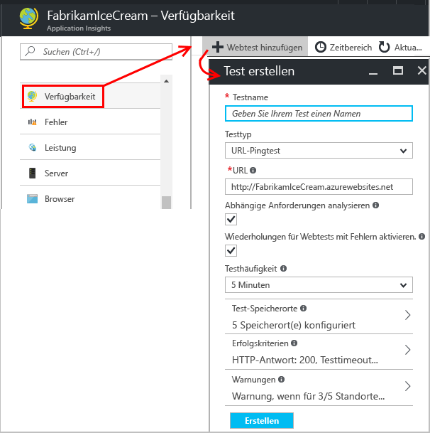
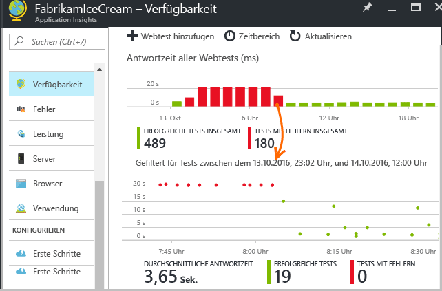
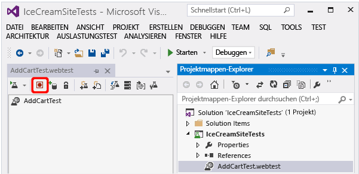
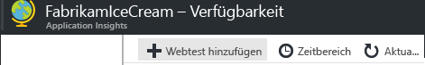
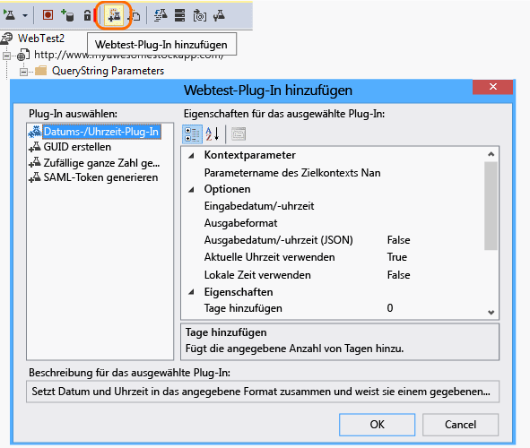
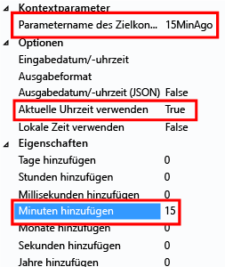
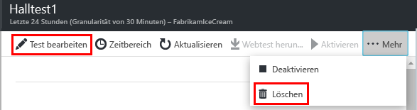

# Überwachen der Verfügbarkeit und Reaktionsfähigkeit von Websites
Nachdem Sie die Web-App oder Website für einen beliebigen Server bereitgestellt haben, können Sie Webtests einrichten, um die Verfügbarkeit und Reaktionsfähigkeit zu überwachen. [Visual Studio Application Insights](app-insights-overview.md) sendet regelmäßig Webanforderungen von verschiedenen Punkten auf der ganzen Welt an Ihre Anwendung. Sie werden benachrichtigt, wenn Ihre Anwendung langsam oder gar nicht reagiert.

Sie können für jeden HTTP- oder HTTPS-Endpunkt, der über das öffentliche Internet zugänglich ist, Webtests einrichten.

Es gibt zwei Arten von Webtests:

* [URL-Pingtest](#create): Dies ist ein einfacher Test, den Sie im Azure-Portal erstellen können.
* [Mehrstufiger Webtest](#multi-step-web-tests): Diesen Test erstellen Sie in Visual Studio Ultimate oder Visual Studio Enterprise und laden ihn in das Portal hoch.

Sie können bis zu zehn Webtests pro Anwendungsressource erstellen.

## 1. Erstellen einer Ressource für Ihre Testberichte
Überspringen Sie diesen Schritt, wenn Sie bereits eine [Application Insights-Ressource][start] für diese Anwendung eingerichtet haben und die Verfügbarkeitsberichte am gleichen Ort angezeigt werden sollen.

Melden Sie sich bei [Microsoft Azure](http://azure.com) an, wechseln Sie zum [Azure-Portal](https://portal.azure.com), und erstellen Sie eine Application Insights-Ressource.

Klicken Sie auf **All resources** (Alle Ressourcen), um das Blatt „Übersicht“ für die neue Ressource zu öffnen.

## 2. Erstellen eines URL-Pingtests
Suchen Sie in der Application Insights-Ressource nach der Kachel "Verfügbarkeit". Klicken Sie darauf, um das Blatt "Webtests" für Ihre Anwendung zu öffnen, und fügen Sie einen Webtest hinzu.

* **Die URL** muss vom öffentlichen Internet aus sichtbar sein. Sie kann auch eine Abfragezeichenfolge enthalten, sodass Sie beispielsweise Ihre Datenbank abfragen können. Wenn die URL in eine Umleitung aufgelöst wird, werden bis zu 10 Umleitungen verfolgt.
* **Abhängige Anforderungen analysieren**: Bilder, Skripts, Formatdateien und andere Ressourcen der Seite werden als Teil des Tests angefordert, und die aufgezeichnete Antwortzeit beinhaltet diese Zeiten. Der Test schlägt fehl, wenn alle diese Ressourcen innerhalb des Zeitlimits für den gesamten Test nicht erfolgreich heruntergeladen werden können.
* **Wiederholungen aktivieren**: Wenn der Test fehlschlägt, wird er nach kurzer Zeit wiederholt. Nur wenn drei aufeinander folgende Versuche scheitern, wird ein Fehler gemeldet. Nachfolgende Tests werden dann in der üblichen Häufigkeit ausgeführt. Die Wiederholung wird bis zum nächsten Erfolg vorübergehend eingestellt. Diese Regel wird an jedem Teststandort unabhängig angewendet. (Diese Einstellung wird empfohlen. Im Durchschnitt verschwinden ca. 80 % der Fehler bei einer Wiederholung.)
* **Testhäufigkeit**: Legt fest, wie oft der Test von jedem Teststandort aus ausgeführt wird. Mit einer Frequenz von fünf Minuten und fünf Teststandorten wird Ihre Website im Durchschnitt jede Minute getestet.
* **Teststandorte** sind die Orte, von denen aus unsere Server Webanforderungen an Ihre URL senden. Wählen Sie mehrere aus, damit Sie Probleme mit der Website von Netzwerkproblemen unterscheiden können. Sie können bis zu 16 Standorte auswählen.
* **Erfolgskriterien**:
  
    **Timeout für Tests**: Reduzieren Sie diesen Wert, um über langsame Antworten benachrichtigt zu werden. Der Test wird als ein Fehler gezählt, wenn die Antworten von Ihrer Website nicht innerhalb dieses Zeitraums empfangen wurden. Bei Auswahl von **Abhängige Anforderungen analysieren** müssen alle Bilder, Styledateien, Skripts und anderen abhängigen Ressourcen innerhalb dieses Zeitraums empfangen werden.
  
    **HTTP-Antwort**: Der zurückgegebene Statuscode, der als Erfolg gezählt wird. 200 ist der Code, der angibt, dass eine normale Webseite zurückgegeben wurde.
  
    **Inhaltsübereinstimmung**: Eine Zeichenfolge, zum Beispiel "Willkommen!" Wir testen, ob sie in jeder Antwort auftritt. Dies muss eine Zeichenfolge in Klartext, ohne Platzhalter sein. Vergessen Sie nicht, diese zu aktualisieren, wenn sich der Seiteninhalt ändert.
* **Warnungen** werden standardmäßig an Sie gesendet, wenn innerhalb von fünf Minuten an drei Standorten Fehler auftreten. Bei einem Fehler an einem Standort handelt es sich wahrscheinlich um ein Netzwerkproblem und nicht um ein Problem mit Ihrer Website. Sie können den Schwellenwert auf eine engere oder weitere Überwachung einstellen oder den Empfänger der E-Mails ändern.
  
    Sie können einen [Webhook](../azure-portal/insights-webhooks-alerts.md) einrichten, der bei einer Warnung aufgerufen wird. (Beachten Sie aber, dass Abfrageparameter derzeit nicht als Eigenschaften übergeben werden.)

### Testen weiterer URLs
Fügen Sie weitere Tests hinzu. Neben dem Testen der Startseite können Sie auch sicherstellen, dass die Datenbank ausgeführt wird, indem Sie eine Such-URL testen.

## 3. Anzeigen der Webtestergebnisse
Nach ein bis zwei Minuten werden Ergebnisse auf dem Webtestblatt angezeigt.

Klicken Sie auf einen beliebigen Balken im Übersichtsdiagramm, um eine detailliertere Ansicht des Zeitraums zu erhalten.

In diesen Diagrammen werden die Ergebnisse für alle Webtests dieser Anwendung kombiniert.

## Wenn Sie Fehler finden ...
Klicken Sie auf einen roten Punkt.

Oder führen Sie einen Bildlauf nach unten durch, und klicken Sie auf einen Test, bei dem der Erfolg kleiner als 100 % ist.

Die Ergebnisse dieses Tests werden geöffnet.

Der Test wird von verschiedenen Standorten aus ausgeführt. Wählen Sie einen davon aus, bei dem die Ergebnisse bei unter 100 % liegen.

Scrollen Sie bis zu **Tests mit Fehlern**, und wählen Sie ein Ergebnis aus.

Klicken Sie auf das Ergebnis, um es im Portal auszuwerten und die Fehlerursache festzustellen.

Alternativ dazu können Sie die Ergebnisdatei herunterladen und in Visual Studio überprüfen.

*Sieht gut aus, wird jedoch als fehlerhaft gemeldet?* Überprüfen Sie alle Bilder, Skripts, Stylesheets und anderen Dateien, die von der Seite geladen werden. Wenn eines dieser Elemente einen Fehler verursacht, wird der Test auch dann als fehlerhaft gemeldet, wenn die HTML-Hauptseite problemlos geladen wird.

## Webtests mit mehreren Schritten
Sie können ein Szenario überwachen, das eine Sequenz mit mehreren URLs umfasst. Wenn Sie zum Beispiel eine Verkaufswebsite überwachen, können Sie testen, ob das Hinzufügen von Artikeln zum Einkaufswagen ordnungsgemäß funktioniert.

Um einen mehrstufigen Test zu erstellen, zeichnen das Szenario mit Visual Studio auf. Laden Sie dann die Aufzeichnung in Application Insights hoch. Application Insights wiederholt das Szenario in bestimmten Abständen und überprüft die Antworten.

Beachten Sie, dass Sie keine codierten Funktionen in den Tests verwenden können: Die Szenarioschritte müssen als Skript in der Webtest-Datei enthalten sein.

#### 1\. Aufzeichnen eines Szenarios
Verwenden Sie Visual Studio Enterprise oder Ultimate, um eine Websitzung aufzuzeichnen.

1. Erstellen Sie ein Webleistungstest-Projekt.
   
    
2. Öffnen Sie die .webtest-Datei und starten Sie die Aufzeichnung.
   
    
3. Führen Sie die Benutzeraktionen durch, die Sie im Test simulieren möchten: Öffnen Sie Ihre Website, fügen Sie dem Warenkorb ein Produkt hinzu usw. Beenden Sie dann den Test.
   
    
   
    Erstellen Sie kein langes Szenario. Es gibt eine Beschränkung von 100 Schritten und 2 Minuten.
4. Bearbeiten Sie den Test:
   
   * Fügen Sie Validierungen zum Überprüfen der empfangenen Text- und Antwortcodes hinzu.
   * Entfernen Sie alle überflüssigen Interaktionen. Sie können auch abhängige Anforderungen für Bilder oder für Werbe- oder Nachverfolgungswebsites entfernen.
     
     Denken Sie daran, dass Sie nur das Testskript bearbeiten können. Sie können keinen benutzerdefinierten Code hinzufügen oder andere Webtests aufrufen. Fügen Sie keine Schleifen in den Test ein. Sie können standardmäßige Webtest-Plug-Ins verwenden.
5. Führen Sie den Test in Visual Studio aus, um sicherzustellen, dass er funktioniert.
   
    Das Webtest-Ausführungsprogramm öffnet einen Webbrowser und wiederholt die aufgezeichneten Aktionen. Stellen Sie sicher, dass der Test wie erwartet funktioniert.
   
    

#### 2\. Hochladen des Webtests in Application Insights
1. Erstellen Sie im Application Insights-Portal einen neuen Webtest.
   
    
2. Wählen Sie einen mehrstufigen Test aus und laden Sie die .webtest-Datei hoch.
   
    
   
    Legen Sie die Teststandorte, Häufigkeit und Warnungsparameter auf die gleiche Weise wie für Ping-Tests fest.

Zeigen Sie die Testergebnisse und alle Fehler auf die gleiche Weise wie für die Tests mit einer einzelnen Url an.

Eine häufige Ursache für Fehler ist, dass der Test zu lange ausgeführt wird. Er darf nicht länger als zwei Minuten ausgeführt werden.

Denken Sie daran, dass alle Ressourcen einer Seite richtig geladen werden müssen, damit der Test erfolgreich ist. Dazu gehören auch Skripts, Stylesheets, Bilder usw.

Beachten Sie, dass der Webtest vollständig in der Webtest-Datei enthalten sein muss: Sie können keine codierten Funktionen im Test verwenden.

### Einfügen von Zeiten und Zufallszahlen in einen mehrstufigen Test
Angenommen, Sie testen ein Tool, das zeitabhängige Daten, wie z. B. Bestände, aus einem externen Feed abruft. Beim Aufzeichnen eines Webtests müssen Sie bestimmte Zeiten verwenden, aber als Parameter des Tests – StartTime und EndTime – festlegen.

Wenn Sie den Test ausführen, sollte "EndTime" immer die aktuelle Uhrzeit widerspiegeln, und "StartTime" sollte der Uhrzeit vor 15 Minuten entsprechen.

Webtest-Plug-Ins sind eine Möglichkeit zum Parametrisieren von Zeiten.

1. Fügen Sie ein Webtest-Plug-In für jeden gewünschten Variablenparameterwert hinzu. Wählen Sie in der Webtest-Symbolleiste **Webtest-Plug-In hinzufügen** aus.
   
    
   
    In diesem Beispiel verwenden wir zwei Instanzen des Datums-/Uhrzeit-Plug-Ins. Eine Instanz gilt für „vor 15 Minuten“ und eine weitere für „jetzt“.
2. Öffnen Sie die Eigenschaften der einzelnen Plug-Ins. Geben Sie einen Namen ein, und legen Sie es so fest, dass die aktuelle Uhrzeit verwendet wird. Legen Sie für eines der Plug-Ins "Add Minutes = -15" fest.
   
    
3. Verwenden Sie im Webtestparameter {{Plug-In-Name}} zum Verweisen auf einen Plug-In-Namen.
   
    

Laden Sie nun den Test in das Portal hoch. Bei jeder Ausführung des Tests werden die dynamischen Werte verwendet.

## Umgang mit der Anmeldung
Wenn sich Benutzer bei Ihrer App anmelden, stehen Ihnen verschiedene Optionen für die Anmeldungssimulation zur Verfügung, damit Sie Seiten testen können, die auf die Anmeldung folgen. Der verwendete Ansatz hängt vom Typ der von der App bereitgestellten Sicherheit ab.

In allen Fällen sollten Sie in der Anwendung ein Konto erstellen, das nur Testzwecken dient. Schränken Sie die Berechtigungen dieses Testkontos nach Möglichkeit ein, damit ausgeschlossen ist, dass sich die Webtests auf echte Benutzer auswirken.

### Einfacher Benutzername und Kennwort
Zeichnen Sie einen Webtest auf normale Weise auf. Löschen Sie zuerst Cookies.

### SAML-Authentifizierung
Verwenden Sie für Webtests das verfügbare SAML-Plug-In.

### Geheimer Clientschlüssel
Verwenden Sie diese Route, wenn die Anmelderoute Ihrer App einen geheimen Clientschlüssel umfasst. Azure Active Directory (AAD) ist ein Beispiel für einen Dienst, bei dem eine Anmeldung mit geheimem Clientschlüssel bereitgestellt wird. In AAD ist der geheime Clientschlüssel der App-Schlüssel.

Hier ist ein Beispiel für einen Webtest einer Azure-Web-App mit App-Schlüssel angegeben:

1. Rufen Sie das Token aus AAD mit dem geheimen Clientschlüssel (AppKey) ab.
2. Extrahieren Sie das Bearertoken aus der Antwort.
3. Rufen Sie die API mit dem Bearertoken im Autorisierungsheader auf.

Stellen Sie sicher, dass der Webtest ein richtiger Client ist – also über eine eigene App in AAD verfügt –, und verwenden Sie dessen Client-ID und App-Schlüssel (clientId und appkey). Ihr getesteter Dienst verfügt ebenfalls über eine eigene App in AAD: Der appID-URI dieser App wird im Webtest im Feld „resource“ angegeben.

### Offene Authentifizierung
Ein Beispiel für die offene Authentifizierung ist die Anmeldung mit Ihrem Microsoft- oder Google-Konto. Viele Apps, die OAuth verwenden, stellen die Alternative mit dem geheimen Clientschlüssel bereit. Ihre erste Taktik sollte also darin bestehen, diese Möglichkeit zu untersuchen.

Wenn bei Ihrem Test die Anmeldung mit OAuth erforderlich ist, lautet die allgemeine Vorgehensweise wie folgt:

* Verwenden Sie ein Tool wie Fiddler, um den Datenverkehr zwischen Ihrem Webbrowser, der Authentifizierungswebsite und Ihrer App zu untersuchen.
* Führen Sie mindestens zwei Anmeldungen auf verschiedenen Computern bzw. in verschiedenen Browsern oder mit großen zeitlichen Abständen durch (damit Token ablaufen können).
* Vergleichen Sie verschiedene Sitzungen, um das von der authentifizierenden Website zurückgegebene Token zu identifizieren, das nach der Anmeldung dann an Ihren App-Server übergeben wird.
* Zeichnen Sie einen Webtests mit Visual Studio auf.
* Parametrisieren Sie die Token, indem Sie den Parameter festlegen, wenn das Token vom Authentifikator zurückgegeben wird, und ihn in der Abfrage an die Website verwenden. (Visual Studio versucht, den Test zu parametrisieren, aber die Token werden nicht richtig parametrisiert.)

##  Bearbeiten oder Deaktivieren eines Tests
Öffnen Sie einen Test, um ihn zu bearbeiten oder zu deaktivieren.

Sie können Webtests beispielsweise deaktivieren, während Sie Wartungsarbeiten für den Dienst durchführen.

## Leistungstests
Sie können für Ihre Website einen Auslastungstest durchführen. Wie beim Verfügbarkeitstest auch, können Sie entweder einfache Anforderungen oder Anforderungen mit mehreren Schritten von unseren weltweit vorhandenen Punkten senden. Im Gegensatz zu einem Verfügbarkeitstest werden viele Anforderungen gesendet, um mehrere gleichzeitige Benutzer zu simulieren.

Öffnen Sie auf dem Blatt „Übersicht“ die Option **Einstellungen** > **Leistungstests**. Wenn Sie einen Test erstellen, können Sie eine Verbindung mit einem Visual Studio Team Services-Konto herstellen bzw. ein Konto erstellen.

Nach Abschluss des Tests werden die Antwortzeiten und Erfolgsraten angezeigt.

## Automation
* [Verwenden Sie PowerShell-Skripts zum automatischen Einrichten eines Webtests](https://azure.microsoft.com/blog/creating-a-web-test-alert-programmatically-with-application-insights/).
* Richten Sie einen [Webhook](../azure-portal/insights-webhooks-alerts.md) ein, der bei einer Warnung aufgerufen wird.

## Fragen? Probleme?
* *Kann ich Code aus meinem Webtest aufrufen?*
  
    Nein. Die Schritte des Tests müssen in der Webtest-Datei enthalten sein. Und Sie können keine anderen Webtests aufrufen oder Schleifen verwenden. Aber es gibt mehrere hilfreiche Plug-Ins.
* *Wird HTTPS unterstützt?*
  
    Wir unterstützen TLS 1.1 und TLS 1.2.
* *Gibt es einen Unterschied zwischen „Webtests“ und „Verfügbarkeitstests“?*
  
    Wir verwenden die beiden Begriffe synonym.
* *Ich möchte Verfügbarkeitstests auf unserem internen Server verwenden, der hinter einer Firewall ausgeführt wird.*
  
    Konfigurieren Sie die Firewall, um Anfragen von den [IP-Adressen der Webtest-Agents](app-insights-ip-addresses.md#availability) zuzulassen.
* *Fehler beim Hochladen eines Webtests mit mehreren Schritten*
  
    Die Größenbeschränkung beträgt 300 K.
  
    Schleifen werden nicht unterstützt.
  
    Verweise auf andere Webtests werden nicht unterstützt.
  
    Datenquellen werden nicht unterstützt.
* *Test mit mehreren Schritten wird nicht abgeschlossen*
  
    Pro Test können maximal 100 Anforderungen verwendet werden.
  
    Der Test wird beendet, wenn die Ausführung länger als zwei Minuten dauert.
* *Wie kann ich einen Test mit Clientzertifikaten durchführen?*
  
    Dies wird leider nicht unterstützt.

## Video
> [!VIDEO https://channel9.msdn.com/Series/Application-Insights-on-Azure-Preview-Portal/Monitoring-Availability-with-Application-Insights/player]
> 
> 

## Nächste Schritte
[Diagnoseprotokolle durchsuchen][diagnostic]

[Problembehandlung][qna]

[IP-Adressen von Webtest-Agents](app-insights-ip-addresses.md)

<!--Link references-->

[azure-availability]: ../insights-create-web-tests.md
[diagnostic]: app-insights-diagnostic-search.md
[qna]: app-insights-troubleshoot-faq.md
[start]: app-insights-overview.md

<!---HONumber=AcomDC_0914_2016-->