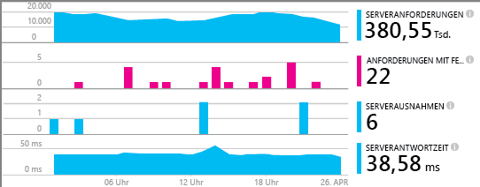
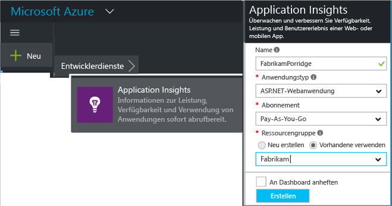
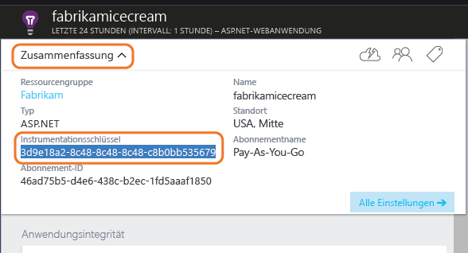
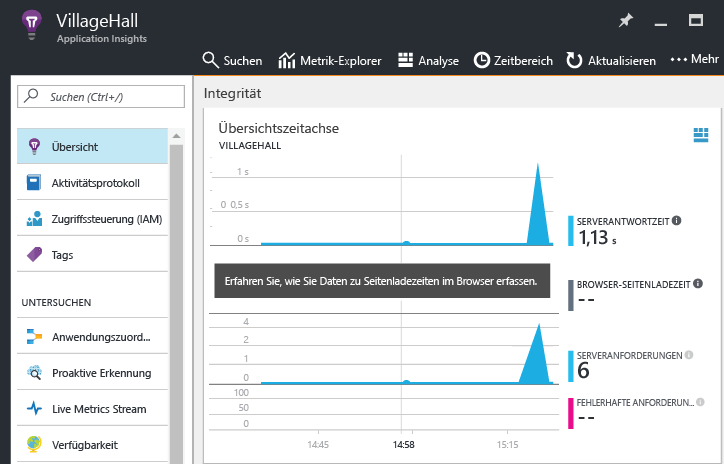

# <a name="add-application-insights-sdk-to-monitor-your-nodejs-app"></a>Hinzufügen des Application Insights SDK zur Überwachung der Node.js-App


[Azure Application Insights](app-insights-overview.md) überwacht Ihre Live-Anwendung. So können Sie [Leistungsprobleme und -ausnahmen erkennen und diagnostizieren](app-insights-detect-triage-diagnose.md) und zudem [ermitteln, wie Ihre App verwendet wird](app-insights-overview-usage.md). Dies funktioniert für Apps, die auf den eigenen lokalen IIS-Servern oder Azure-VMs gehostet werden, sowie für Azure-Web-Apps.

Das SDK ermöglicht die automatische Erfassung der Raten eingehender HTTP-Anforderungen sowie von Antworten, Leistungsindikatoren (CPU, Speicher, RPS) und Ausnahmefehlern. Darüber hinaus können Sie benutzerdefinierte Aufrufe zum Nachverfolgen von Abhängigkeiten, Metriken und anderen Ereignisse hinzufügen.



#### <a name="before-you-start"></a>Vorbereitung
Erforderlich:

* Ein Abonnement für [Microsoft Azure](http://azure.com). Wenn Ihr Team oder Ihre Organisation über ein Azure-Abonnement verfügt, kann der Besitzer Sie mit Ihrem [Microsoft-Konto](http://live.com)hinzufügen.

## <a name="add"></a>Erstellen einer Application Insights-Ressource
Melden Sie sich beim [Azure-Portal][portal] an, und erstellen Sie eine neue Application Insights-Ressource. Eine [Ressource][roles] ist in Azure eine Instanz eines Diensts. In dieser Ressource werden Telemetriedaten aus Ihrer App analysiert und Ihnen angezeigt.



Wählen Sie „Allgemein“ als Anwendungstyp aus. Durch Auswahl des Anwendungstyps werden der Standardinhalt der Ressourcenblätter und die im [Metrik-Explorer][metrics] sichtbaren Eigenschaften festgelegt.

#### <a name="copy-the-instrumentation-key"></a>Kopieren des Instrumentationsschlüssels
Der Schlüssel identifiziert die Ressource, den Sie bald im SDK installieren können, um die Daten an die Ressource zu leiten.



## <a name="sdk"></a> Installieren des SDK in Ihrer Anwendung
```
npm install applicationinsights --save
```

## <a name="usage"></a>Verwendung
Dadurch werden die Anforderungsüberwachung, die Nachverfolgung von Ausnahmefehlern und die Systemleistungsüberwachung (CPU/Speicher/RPS) ermöglicht.

```javascript

var appInsights = require("applicationinsights");
appInsights.setup("<instrumentation_key>").start();
```

Der Instrumentierungsschlüssel kann auch in der Umgebungsvariablen APPINSIGHTS_INSTRUMENTATIONKEY festgelegt werden. In diesem Fall ist beim Aufrufen von `appInsights.setup()` oder `appInsights.getClient()` kein Argument erforderlich.

Sie können das SDK testen, ohne Telemetriedaten zu senden: Legen Sie als Instrumentierungsschlüssel eine nicht leere Zeichenfolge fest.

## <a name="run"></a> Ausführen des Projekts
Starten Sie Ihre Anwendung, und testen Sie sie: Öffnen Sie verschiedene Seiten, um einige Telemetriedaten zu generieren.

## <a name="monitor"></a> Anzeigen der Telemetrie
Kehren Sie zum [Azure-Portal](https://portal.azure.com) zurück, und navigieren Sie zur Application Insights-Ressource.

Suchen Sie nach Daten auf der Übersichtsseite. Zuerst sehen Sie lediglich einen oder zwei Punkte. Zum Beispiel:



Klicken Sie sich durch ein beliebiges Diagramm, um ausführlichere Metriken anzuzeigen. [Weitere Informationen zu Metriken.][perf]

#### <a name="no-data"></a>Sie sehen keine Daten?
* Verwenden Sie die Anwendung, und öffnen Sie verschiedene Seiten, damit einige Telemetriedaten generiert werden.
* Öffnen Sie die Kachel [Suche](app-insights-diagnostic-search.md) , um einzelne Ereignisse anzuzeigen. Manchmal dauert es eine Weile, bis Ereignisse über die Metrikpipeline übertragen werden.
* Warten Sie einige Sekunden, und klicken Sie auf **Aktualisieren**. Diagramme aktualisieren sich in regelmäßigen Abständen selbst, doch Sie können sie auch manuell aktualisieren, wenn Sie auf anzuzeigende Daten warten.
* Informationen hierzu finden Sie unter [Problembehandlung][qna].

## <a name="publish-your-app"></a>Veröffentlichen der App
Stellen Sie jetzt Ihre Anwendung für IIS bereit, und beobachten Sie, wie die Daten gesammelt werden.

#### <a name="no-data-after-you-publish-to-your-server"></a>Keine Daten nach dem Veröffentlichen auf Ihrem Server?
Stellen Sie sicher, dass [die erforderlichen Firewallports geöffnet sind](app-insights-ip-addresses.md).

#### <a name="trouble-on-your-build-server"></a>Probleme auf dem Buildserver?
Weitere Informationen finden Sie in [diesem Artikel zur Problembehandlung](app-insights-asp-net-troubleshoot-no-data.md#NuGetBuild).

## <a name="customized-usage"></a>Benutzerdefinierte Verwendung
### <a name="disabling-auto-collection"></a>Deaktivieren der automatischen Erfassung
```javascript
import appInsights = require("applicationinsights");
appInsights.setup("<instrumentation_key>")
    .setAutoCollectRequests(false)
    .setAutoCollectPerformance(false)
    .setAutoCollectExceptions(false)
    // no telemetry will be sent until .start() is called
    .start();
```

### <a name="custom-monitoring"></a>Benutzerdefinierte Überwachung
```javascript
import appInsights = require("applicationinsights");
var client = appInsights.getClient();

client.trackEvent("custom event", {customProperty: "custom property value"});
client.trackException(new Error("handled exceptions can be logged with this method"));
client.trackMetric("custom metric", 3);
client.trackTrace("trace message");
```

Erfahren Sie mehr über die [Telemetrie-API](app-insights-api-custom-events-metrics.md).

### <a name="using-multiple-instrumentation-keys"></a>Verwenden mehrerer Instrumentierungsschlüssel
```javascript
import appInsights = require("applicationinsights");

// configure auto-collection with one instrumentation key
appInsights.setup("<instrumentation_key>").start();

// get a client for another instrumentation key
var otherClient = appInsights.getClient("<other_instrumentation_key>");
otherClient.trackEvent("custom event");
```

## <a name="examples"></a>Beispiele
### <a name="tracking-dependency"></a>Nachverfolgen von Abhängigkeiten
```javascript
import appInsights = require("applicationinsights");
var client = appInsights.getClient();

var startTime = Date.now();
// execute dependency call
var endTime = Date.now();

var elapsedTime = endTime - startTime;
var success = true;
client.trackDependency("dependency name", "command name", elapsedTime, success);
```


### <a name="manual-request-tracking-of-all-get-requests"></a>Manuelle Anforderungsnachverfolgung aller GET-Anforderungen
```javascript
var http = require("http");
var appInsights = require("applicationinsights");
appInsights.setup("<instrumentation_key>")
    .setAutoCollectRequests(false) // disable auto-collection of requests for this example
    .start();

// assign common properties to all telemetry sent from the default client
appInsights.client.commonProperties = {
    environment: process.env.SOME_ENV_VARIABLE
};

// track a system startup event
appInsights.client.trackEvent("server start");

// create server
var port = process.env.port || 1337
var server = http.createServer(function (req, res) {
    // track all "GET" requests
    if(req.method === "GET") {
        appInsights.client.trackRequest(req, res);
    }

    res.writeHead(200, { "Content-Type": "text/plain" });
    res.end("Hello World\n");
}).listen(port);

// track startup time of the server as a custom metric
var start = +new Date;
server.on("listening", () => {
    var end = +new Date;
    var duration = end - start;
    appInsights.client.trackMetric("StartupTime", duration);
});
```

## <a name="video"></a>Video

> [!VIDEO https://channel9.msdn.com/events/Connect/2016/100/player]

## <a name="next-steps"></a>Nächste Schritte
* [Überwachen Ihrer Telemetriedaten im Portal](app-insights-dashboards.md)
* [Schreiben von Analytics-Abfragen über Ihre Telemetriedaten](app-insights-analytics-tour.md)

<!--Link references-->

[knowUsers]: app-insights-overview-usage.md
[metrics]: app-insights-metrics-explorer.md
[perf]: app-insights-web-monitor-performance.md
[portal]: http://portal.azure.com/
[qna]: app-insights-troubleshoot-faq.md
[roles]: app-insights-resources-roles-access-control.md

