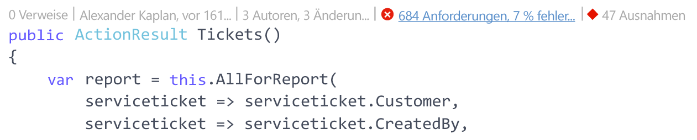
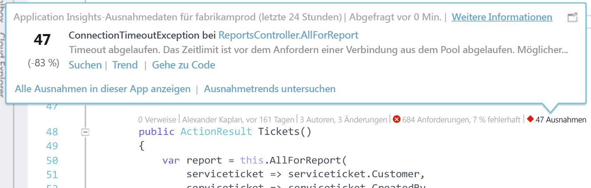
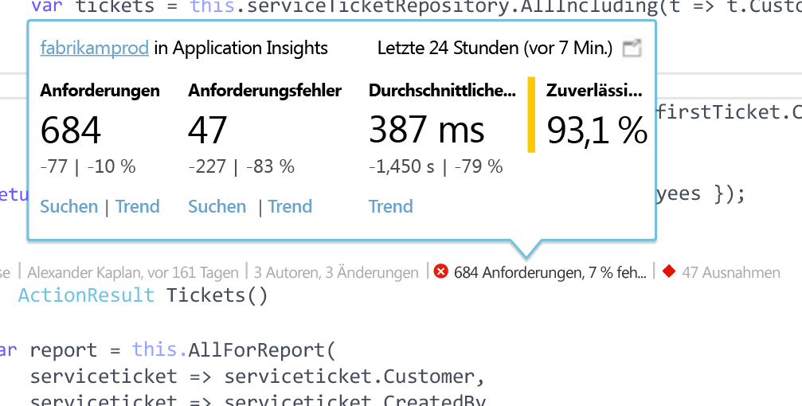

# Application Insights-Telemetrie in Visual Studio CodeLens
Methoden im Code Ihrer Web-App können mit Telemetrie zu Laufzeitausnahmen und Anforderungsantwortzeiten kommentiert werden. Wenn Sie [Azure Application Insights](app-insights-overview.md) in Ihrer Anwendung installieren, wird die Telemetrie in Visual Studio [CodeLens](https://msdn.microsoft.com/library/dn269218.aspx) angezeigt. Hierbei handelt es sich um die praktischen Hinweise am Anfang jeder Funktion, die Aufschluss darüber geben, an wie vielen Stellen auf die Funktion verwiesen wird oder von wem sie zuletzt bearbeitet wurde.

> [!NOTE]
> Application Insights in CodeLens ist ab Visual Studio 2015 Update 3 sowie mit der neuesten Version der [Developer Analytics Tools-Erweiterung](https://visualstudiogallery.msdn.microsoft.com/82367b81-3f97-4de1-bbf1-eaf52ddc635a)verfügbar. CodeLens steht in der Enterprise- und in der Professional-Edition von Visual Studio zur Verfügung.
> 
> 

## Anzeigeort von Application Insights-Daten
Application Insights-Telemetrie finden Sie in den CodeLens-Indikatoren der öffentlichen Anforderungsmethoden Ihrer Webanwendung. CodeLens-Indikatoren werden in C#- und Visual Basic-Code über der Methode und anderen Deklarationen angezeigt. Wenn Application Insights-Daten für eine Methode verfügbar sind, werden Indikatoren für Anforderungen und Ausnahmen angezeigt (beispielsweise „100 Anforderungen, 1 % nicht erfolgreich“ oder „10 Ausnahmen“). Klicken Sie auf einen CodeLens-Indikator, um weitere Details anzuzeigen. 

> [!TIP]
> Wenn weitere CodeLens-Indikatoren angezeigt werden, dauert es unter Umständen etwas, bis Application Insights-Indikatoren zu Anforderungen und Ausnahmen geladen werden.
> 
> 

## Ausnahmen in CodeLens

Der CodeLens-Ausnahmenindikator gibt Aufschluss darüber, wie viele Ausnahmen in den letzten 24 Stunden beim Verarbeiten der von der Methode bedienten Anforderung aufgetreten sind. Dabei werden die 15 am häufigsten aufgetretenen Ausnahmen des jeweiligen Zeitraums angezeigt.

Durch Klicken auf den CodeLens-Ausnahmenindikator werden weitere Details angezeigt:

* Die prozentuale Veränderung der Ausnahmenanzahl der letzten 24 Stunden im Vergleich zu den vorherigen 24 Stunden
* Wählen Sie **Gehe zu Code** aus, um zum Quellcode der Funktion zu gelangen, durch die die Ausnahme ausgelöst wird.
* Wählen Sie **Suchen** aus, um für diese Ausnahme alle Instanzen der letzten 24 Stunden abzufragen.
* Wählen Sie **Trend** aus, um für die Ausnahme eine Trendvisualisierung der Vorkommen der letzten 24 Stunden anzuzeigen.
* Wählen Sie **Alle Ausnahmen in dieser App anzeigen** aus, um alle Ausnahmen abzufragen, die in den letzten 24 Stunden aufgetreten sind.
* Wählen Sie **Ausnahmetrends untersuchen** aus, um eine Trendvisualisierung für alle Ausnahmen der letzten 24 Stunden anzuzeigen. 

> [!TIP]
> Wenn in CodeLens keine Ausnahmen angezeigt werden, aber eigentlich Ausnahmen vorliegen müssten, vergewissern Sie sich, dass in CodeLens die richtige Application Insights-Ressource ausgewählt ist. Wenn Sie eine andere Ressource auswählen möchten, klicken Sie im Projektmappen-Explorer mit der rechten Maustaste auf Ihr Projekt, und wählen Sie **Application Insights > Telemetriequelle auswählen** aus. CodeLens wird nur für die 15 Ausnahmen angezeigt, die in Ihrer Anwendung innerhalb der letzten 24 Stunden am häufigsten aufgetreten sind. Für Ausnahmen ab dem 16. Häufigkeitsrang wird „0 Ausnahmen“ angezeigt. Ausnahmen aus ASP.NET-Ansichten werden unter Umständen nicht für die Controllermethoden angezeigt, die diese Ansichten generiert haben.
> 
> [!TIP]
> Falls in CodeLens „? Ausnahmen“ angezeigt wird, müssen Sie entweder Ihr Azure-Konto mit Visual Studio verknüpfen, oder Ihre Anmeldeinformationen für das Azure-Konto sind abgelaufen. Klicken Sie in einem solchen Fall auf „? Ausnahmen“, und wählen Sie **Konto hinzufügen** aus, um Ihre Anmeldeinformationen einzugeben.
> 
> 

## Anforderungen in CodeLens

Der CodeLens-Anforderungsindikator zeigt die Anzahl von HTTP-Anforderungen, die von einer Methode in den letzten 24 Stunden bedient wurden, sowie den Prozentsatz nicht erfolgreicher Anforderungen an.

Durch Klicken auf den CodeLens-Anforderungsindikator werden weitere Details angezeigt:

* Der absolute Wert und die prozentuale Veränderung der Anzahl von Anforderungen, nicht erfolgreichen Anforderungen und durchschnittlichen Antwortzeiten der letzten 24 Stunden im Vergleich zu den vorherigen 24 Stunden
* Die Zuverlässigkeit der Methode als Prozentsatz der Anforderungen, bei denen in den letzten 24 Stunden kein Fehler aufgetreten ist
* Wählen Sie für Anforderungen oder fehlerhafte Anforderungen die Option **Suche** aus, um alle (nicht erfolgreichen) Anforderungen der letzten 24 Stunden abzufragen.
* Wählen Sie **Trend** aus, um eine Trendvisualisierung für Anforderungen, nicht erfolgreiche Anforderungen oder durchschnittliche Antwortzeiten der letzten 24 Stunden anzuzeigen.
* Wählen Sie links oben in der CodeLens-Detailansicht den Namen der Application Insights-Ressource aus, um eine andere Quellressource für die CodeLens-Daten auszuwählen.

## Nächste Schritte
|  |  |
| --- | --- |
| **[Arbeiten mit Application Insights in Visual Studio](app-insights-visual-studio.md)** Durchsuchen Sie die Telemetriedaten, zeigen Sie Daten in CodeLens an, und konfigurieren Sie Application Insights. Alles in Visual Studio. | |
| **[Hinzufügen weiterer Daten](app-insights-asp-net-more.md)** Überwachen Sie Nutzung, Verfügbarkeit, Abhängigkeiten und Ausnahmen. Integrieren Sie Ablaufverfolgungen aus Protokollierungsframeworks. Schreiben Sie benutzerdefinierte Telemetriedaten. | |
| **[Navigation und Dashboards im Application Insights-Portal](app-insights-dashboards.md)** Enthält Informationen zu Dashboards, leistungsstarken Diagnose- und Analysetools, Warnungen und zum Export von Telemetriedaten sowie eine Livekarte der Abhängigkeiten Ihrer Anwendung. | |

