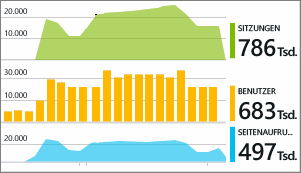

# Verwenden von Azure Application Insights in Visual Studio
In Visual Studio (2015 und höher) können Sie mithilfe von Telemetriedaten aus [Azure Application Insights](app-insights-overview.md) sowohl beim Debuggen als auch in der Produktion in Ihrer ASP.NET-Web-App die Leistung analysieren und Probleme diagnostizieren.

Wenn Sie die ASP.NET-Web-App mit Visual Studio 2017 oder höher erstellt haben, ist das Application Insights-SDK bereits vorhanden. Andernfalls können Sie [Application Insights Ihrer App hinzufügen](app-insights-asp-net.md), falls Sie dies noch nicht getan haben.

Zur Liveüberwachung Ihrer App in der Produktion zeigen Sie die Application Insights-Telemetrie normalerweise im [Azure-Portal](https://portal.azure.com) an, in dem Sie Warnungen festlegen und leistungsfähige Überwachungstool anwenden können. Für das Debuggen können Sie die Telemetriedaten in Visual Studio auch durchsuchen und analysieren. Sie können Visual Studio nutzen, um die Telemetrie sowohl über Ihren Produktionsstandort als auch über Debugläufe auf Ihrem Entwicklungscomputer zu analysieren. Im letzteren Fall können Sie die Debugläufe auch dann analysieren, wenn Sie das SDK nicht zum Senden von Telemetriedaten an das Azure-Portal konfiguriert haben. 

##  Debuggen des Projekts
Führen Sie Ihre Web-App im lokalen Debugmodus aus, indem Sie F5 drücken. Öffnen Sie verschiedene Seiten, um Telemetriedaten zu generieren.

In Visual Studio wird die Anzahl von Ereignissen angezeigt, die vom Application Insights-Modul in Ihrem Projekt protokolliert wurden.

Klicken Sie auf diese Schaltfläche, um Ihre Telemetriedaten zu durchsuchen. 

## Application Insights-Suche
Im Fenster „Application Insights-Suche“ werden Ereignisse angezeigt, die protokolliert wurden. (Wenn Sie sich bei der Einrichtung von Application Insights bei Azure angemeldet haben, können Sie die gleichen Ereignisse im Azure-Portal durchsuchen.)

> [!NOTE] 
> Klicken Sie nach dem Aktivieren bzw. Deaktivieren von Filtern am Ende des Textsuchfelds auf die Schaltfläche „Suchen“.
>

Die Freitextsuche funktioniert in allen Feldern in den Ereignissen. Suchen Sie z. B. einen Teil der URL einer Seite, den Wert einer Eigenschaft, z. B. Ort des Kunden, oder bestimmte Wörter in einem Ablaufverfolgungsprotokoll.

Klicken Sie auf ein beliebiges Ereignis, um seine detaillierten Eigenschaften anzuzeigen.

Für Anforderungen an Ihre Web-App können Sie sich bis zum Code durchklicken.

Außerdem können Sie zum Diagnostizieren von fehlerhaften Anforderungen oder von Ausnahmen auch verwandte Elemente öffnen.

## Ausnahmen und fehlerhafte Anforderungen
Ausnahmeberichte werden im Suchfenster angezeigt. (Bei einigen älteren Typen der ASP.NET-Anwendung müssen Sie die [Ausnahmeüberwachung einrichten](app-insights-asp-net-exceptions.md), um Ausnahmen anzuzeigen, die vom Framework verarbeitet werden.)

Klicken Sie auf eine Ausnahme, um eine Stapelüberwachung zu erhalten. Wenn der Code der App in Visual Studio geöffnet ist, können Sie sich durch die Stapelüberwachung bis zur entsprechenden Zeile im Code klicken.

## Zusammenfassungen von Anforderungen und Ausnahmen im Code
In der Codebereichszeile wird oberhalb jeder Handlermethode die Anzahl von Anforderungen und Ausnahmen angezeigt, die von Application Insights innerhalb der letzten 24 Stunden protokolliert wurden.

> [!NOTE] 
> CodeLens zeigt Application Insights-Daten nur an, wenn Sie Ihre [App zum Senden von Telemetriedaten an das Application Insights-Portal konfiguriert haben](app-insights-asp-net.md).
>

[Weitere Informationen zu Application Insights in CodeLens](app-insights-visual-studio-codelens.md)

## Trends
Mit dem Tool Trends können Sie visualisieren, wie sich Ihre App im Laufe der Zeit verhält. 

Wählen Sie auf der Application Insights-Symbolleiste oder im Application Insights-Suchfenster die Schaltfläche **Telemetrietrends untersuchen** . Wählen Sie eine der fünf allgemeinen Abfragen aus, um zu beginnen. Sie können unterschiedliche Datasets basierend auf Telemetrietypen, Zeiträumen und anderen Eigenschaften analysieren. 

Wählen Sie zum Ermitteln von Anomalien in Ihren Daten in der Dropdownliste „Ansichtstyp“ eine Anomalieoption. Mit den Filteroptionen am unteren Rand des Fensters ist es einfach, bestimmte Teilmengen Ihrer Telemetriedaten anzuzeigen.

[Weitere Informationen zu Trends](app-insights-visual-studio-trends.md)

## Lokale Überwachung
(In Visual Studio 2015 Update 2) Falls Sie das SDK nicht zum Senden von Telemetriedaten an das Application Insights-Portal konfiguriert haben (sodass kein Instrumentationsschlüssel in „ApplicationInsights.config“ enthalten ist), werden im Diagnosefenster Telemetriedaten aus der letzten Debugsitzung angezeigt. 

Dies ist wünschenswert, wenn Sie bereits eine frühere Version der Anwendung veröffentlicht haben. Die Telemetriedaten aus den Debugsitzungen und die Telemetriedaten der veröffentlichten App im Application Insights-Portal müssen getrennt behandelt werden.

Dies ist ebenfalls hilfreich, wenn Sie über [benutzerdefinierte Telemetriedaten](app-insights-api-custom-events-metrics.md) verfügen, die Sie vor dem Senden an das Portal debuggen möchten.

* *Zunächst habe ich Application Insights vollständig für das Senden von Telemetriedaten an das Portal konfiguriert. Aber nun möchte ich die Telemetriedaten nur in Visual Studio anzeigen.*
  
  * In den Einstellungen des Suchfensters steht eine Option zum Durchsuchen der lokalen Diagnosen zur Verfügung, auch wenn Ihre App Telemetriedaten an das Portal sendet.
  * Damit keine Telemetriedaten mehr an das Portal gesendet werden, kommentieren Sie die Zeile `<instrumentationkey>...` in „ApplicationInsights.config“ aus. Wenn Sie bereit sind, Telemetriedaten erneut an das Portal zu senden, heben Sie die Auskommentierung auf.

## Wie geht es weiter?
|  |  |
| --- | --- |
| **[Hinzufügen weiterer Daten](app-insights-asp-net-more.md)** Überwachen Sie Nutzung, Verfügbarkeit, Abhängigkeiten und Ausnahmen. Integrieren Sie Ablaufverfolgungen aus Protokollierungsframeworks. Schreiben Sie benutzerdefinierte Telemetriedaten. | |
| **[Navigation und Dashboards im Application Insights-Portal](app-insights-dashboards.md)** Enthält Informationen zu Dashboards, leistungsstarken Diagnose- und Analysetools, Warnungen und zum Export von Telemetriedaten sowie eine Livekarte der Abhängigkeiten Ihrer Anwendung. | |

