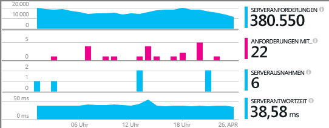
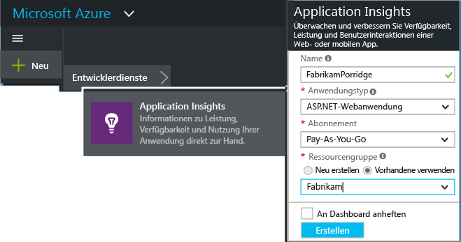
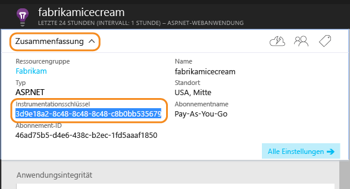
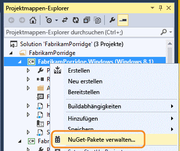
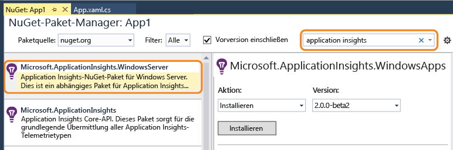
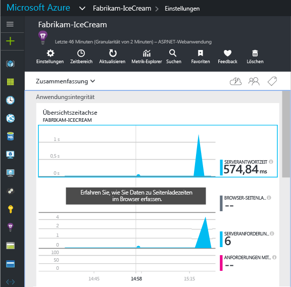
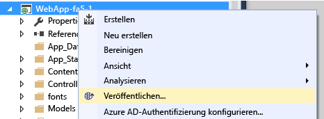

# Manuelle Konfiguration von Application Insights für ASP.NET 4-Anwendungen
[Application Insights](app-insights-overview.md) ist ein erweiterbares Tool für Webentwickler zum Überwachen der Leistung und Verwendung der Liveanwendung. Sie können dieses Tool manuell für die Überwachung von Windows-Diensten, Workerrollen und anderen ASP.NET-Anwendungen konfigurieren. Bei Web-Apps ist die manuelle Konfiguration eine Alternative zu der von Visual Studio bereitgestellten [automatischen Einrichtung](app-insights-asp-net.md) .

#### Vorbereitung
Erforderlich:

* Ein Abonnement für [Microsoft Azure](http://azure.com). Wenn Ihr Team oder Ihre Organisation über ein Azure-Abonnement verfügt, kann der Besitzer Sie mit Ihrem [Microsoft-Konto](http://live.com)hinzufügen.
* Visual Studio 2013 oder höher

## 1. Erstellen einer Application Insights-Ressource
Melden Sie sich beim [Azure-Portal](https://portal.azure.com/)an, und erstellen Sie eine neue Application Insights-Ressource. Wählen Sie als Anwendungstyp "ASP.NET" aus.

Eine [Ressource](app-insights-resources-roles-access-control.md) in Azure ist eine Instanz eines Diensts. In dieser Ressource werden Telemetriedaten aus Ihrer App analysiert und Ihnen angezeigt.

Durch Auswahl des Anwendungstyps werden der Standardinhalt der Ressourcenblätter und die im [Metrik-Explorer](app-insights-metrics-explorer.md)sichtbaren Eigenschaften festgelegt.

#### Kopieren des Instrumentationsschlüssels
Der Schlüssel identifiziert die Ressource, den Sie bald im SDK installieren können, um die Daten an die Ressource zu leiten.

Die Schritte, die Sie gerade zum Erstellen einer neuen Ressource getan haben, sind eine gute Möglichkeit zum Starten der Überwachung einer Anwendung. Nun können Sie Daten zur Anwendung senden.

## 2. Installieren des SDK in Ihrer Anwendung
Installieren und Konfigurieren des Application Insights-SDK variiert abhängig von der Plattform, mit der Sie gerade arbeiten. Bei ASP.NET-Apps ist es einfach.

1. Bearbeiten Sie die NuGet-Pakete Ihres Web-App-Projekts in Visual Studio.
   
    
2. Installieren Sie das Application Insights SDK für Web-Apps.
   
    
   
    *Kann ich andere Pakete verwenden?*
   
    Ja. Wählen Sie die Kern-API (Microsoft.ApplicationInsights), wenn Sie die API nur verwenden möchten, um Ihre eigenen Telemetriedaten zu senden. Das Windows Server-Paket beinhaltet automatisch die Kern-API sowie einige weitere Pakete wie etwa die Sammlung von Leistungsindikatoren und die Abhängigkeitsüberwachung. 

#### So upgraden Sie auf zukünftige SDK-Versionen
Von Zeit zu Zeit veröffentlichen wir eine neue Version des SDK.

Für ein Upgrade auf eine [neue Version des SDK](https://github.com/Microsoft/ApplicationInsights-dotnet-server/releases/)öffnen Sie wieder den NuGet-Paket-Manager und filtern die Ansicht nach installierten Paketen. Wählen Sie **Microsoft.ApplicationInsights.Web** und dann **Upgrade** aus.

Wenn Sie Anpassungen an der Datei "ApplicationInsights.config" vorgenommen haben, speichern Sie vor dem Upgrade eine Kopie davon. Sie können anschließend die Änderungen in die neue Version übernehmen.

## 3. Senden von Telemetriedaten
**Wenn nur das Core-API-Paket installiert wurde:**

* Legen Sie den Instrumentationsschlüssel im Code (beispielsweise in `main()`) fest: 
  
    `TelemetryConfiguration.Active.InstrumentationKey = "` *Ihr Schlüssel* `";` 
* [Schreiben Sie mithilfe der API eigene Telemetrie.](app-insights-api-custom-events-metrics.md#ikey)

**Wenn Sie andere Application Insights-Pakete installiert haben** , können Sie zum Festlegen des Instrumentationsschlüssels auch die CONFIG-Datei verwenden:

* Bearbeiten Sie die Datei "ApplicationInsights.config" (die bei der NuGet-Installation hinzugefügt wurde). Fügen Sie Folgendes direkt vor dem Endtag ein:
  
    `<InstrumentationKey>` *Der kopierte Instrumentationsschlüssel * `</InstrumentationKey>`
* Stellen Sie sicher, dass die Eigenschaften von „ApplicationInsights.config“ im Projektmappen-Explorer auf **Buildvorgang = Inhalt, In Ausgabeverzeichnis kopieren = Kopieren**festgelegt sind.

##  Ausführen des Projekts
Starten Sie Ihre Anwendung mit **F5** , und testen Sie sie: Öffnen Sie verschiedene Seiten, um einige Telemetriedaten zu generieren.

In Visual Studio sehen Sie eine Anzahl der gesendeten Ereignisse.

##  Anzeigen der Telemetrie
Kehren Sie zum [Azure-Portal](https://portal.azure.com/) zurück, und navigieren Sie zur Application Insights-Ressource.

Suchen Sie nach Daten in der Übersichtsdiagrammen. Zuerst sehen Sie lediglich einen oder zwei Punkte. Zum Beispiel:

Klicken Sie sich durch ein beliebiges Diagramm, um ausführlichere Metriken anzuzeigen. [Weitere Informationen zu Metriken.](app-insights-web-monitor-performance.md)

#### Sie sehen keine Daten?
* Verwenden Sie die Anwendung, und öffnen Sie verschiedene Seiten, damit einige Telemetriedaten generiert werden.
* Öffnen Sie die Kachel [Suche](app-insights-diagnostic-search.md) , um einzelne Ereignisse anzuzeigen. Manchmal dauert es eine Weile, bis Ereignisse über die Metrikpipeline übertragen werden.
* Warten Sie einige Sekunden, und klicken Sie auf **Aktualisieren**. Diagramme aktualisieren sich in regelmäßigen Abständen selbst, doch Sie können sie auch manuell aktualisieren, wenn Sie auf anzuzeigende Daten warten.
* Informationen hierzu finden Sie unter [Problembehandlung](app-insights-troubleshoot-faq.md).

## Veröffentlichen der App
Stellen Sie jetzt Ihre Anwendung auf Ihrem Server oder in Azure bereit, und beobachten Sie, wie die Daten gesammelt werden.

Beim Betrieb im Debugmodus wird Telemetrie über die Pipeline geliefert, sodass Ihnen innerhalb von wenigen Sekunden Daten angezeigt werden. Wenn Sie die App in der Releasekonfiguration bereitstellen, sammeln sich die Daten langsamer an.

#### Keine Daten nach dem Veröffentlichen auf Ihrem Server?
Öffnen Sie diese Ports für den ausgehenden Datenverkehr in der Firewall des Servers:

* `dc.services.visualstudio.com:443`
* `f5.services.visualstudio.com:443`

#### Probleme auf dem Buildserver?
Weitere Informationen finden Sie in [diesem Artikel zur Problembehandlung](app-insights-asp-net-troubleshoot-no-data.md#NuGetBuild).

> [!NOTE]
> Wenn die Anwendung viele Telemetriedaten generiert (und Sie Version 2.0.0-beta3 oder höher des ASP.NET-SDK verwenden), reduziert das adaptive Stichprobenmodul automatisch die an das Portal gesendete Datenmenge, indem nur ein repräsentativer Bruchteil der Ereignisse gesendet wird. Ereignisse, die mit derselben Anforderung im Zusammenhang stehen, werden als Gruppe aus- oder abgewählt, sodass Sie zwischen verwandten Ereignissen navigieren können. 
> [Erfahren Sie mehr über das Erstellen von Stichproben.](app-insights-sampling.md)
> 
> 

## Nächste Schritte
* [Fügen Sie weitere Telemetriefunktionen hinzu](app-insights-asp-net-more.md) , um eine Rundumansicht Ihrer Anwendung zu erhalten:

<!--HONumber=Nov16_HO2-->

