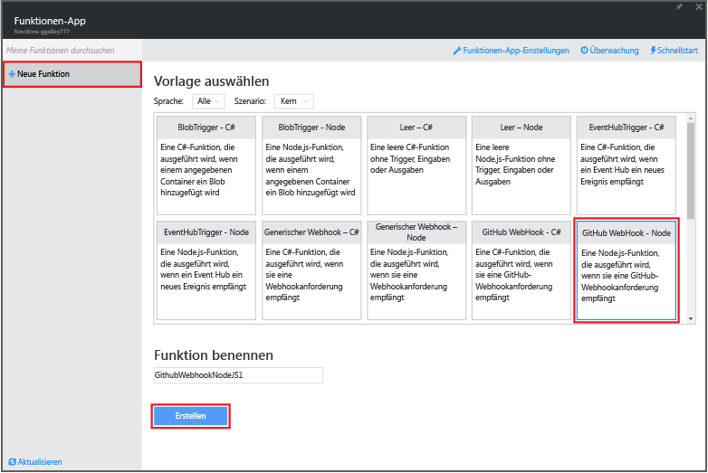
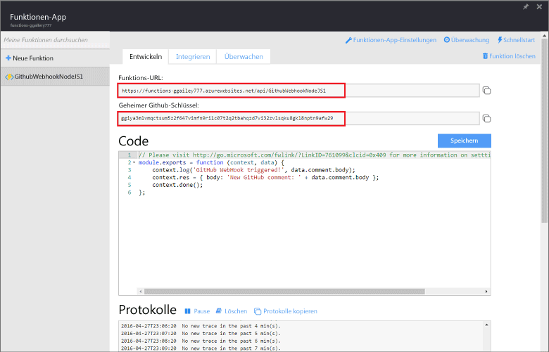
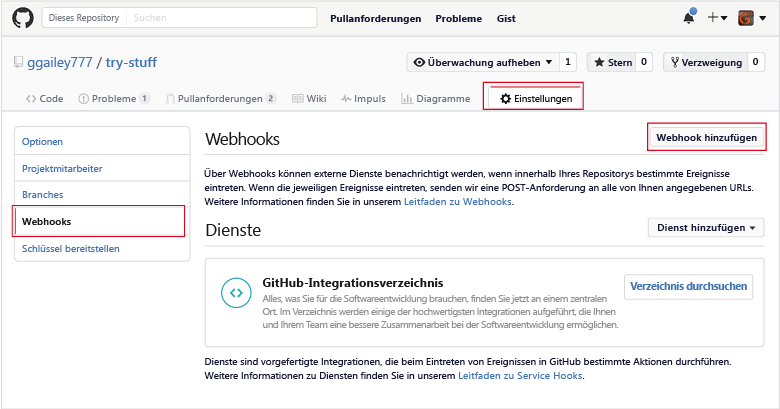
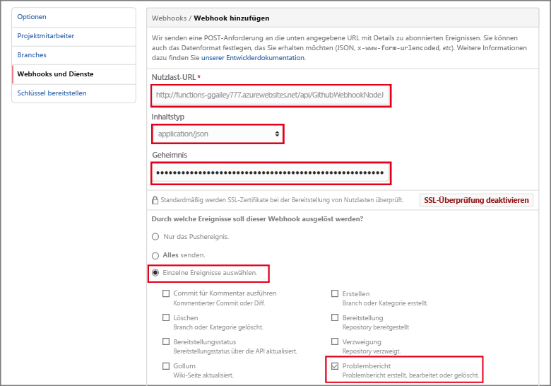

<properties
   pageTitle="Erstellen eines Webhooks oder einer API Azure Functions-Funktion | Microsoft Azure"
   description="Verwenden von Azure Functions zum Erstellen einer Funktion, die durch einen Webhook oder API-Aufruf aufgerufen wird."
   services="azure-functions"
   documentationCenter="na"
   authors="ggailey777"
   manager="erikre"
   editor=""
   tags=""
   />

<tags
   ms.service="functions"
   ms.devlang="multiple"
   ms.topic="get-started-article"
   ms.tgt_pltfrm="multiple"
   ms.workload="na"
   ms.date="08/30/2016"
   ms.author="glenga"/>
   
# Erstellen eines Webhooks oder einer API-Azure-Funktion

Azure Functions vermittelt eine durch Ereignissteuerung und Bedarfsabhängigkeit geprägte Benutzererfahrung. Dies bedeutet, dass Sie geplante oder ausgelöste, in verschiedenen Programmiersprachen implementierte Codeeinheiten erstellen können. Weitere Informationen zu Azure Functions finden Sie in der [Übersicht zu Azure Functions](functions-overview.md).

In diesem Thema erfahren Sie, wie Sie eine neue Node.js-Funktion erstellen, die von einem GitHub-Webhook aufgerufen wird. Die neue Funktion wird basierend auf einer vordefinierten Vorlage im Azure Functions-Portal erstellt. Sie können sich auch ein kurzes Video ansehen, das die Ausführung dieser Schritte im Portal zeigt.

## Video ansehen

Das folgende Video zeigt die Ausführung der grundlegenden Schritte in diesem Tutorial.

[AZURE.VIDEO create-a-web-hook-or-api-azure-function]

##Erstellen einer durch einen Webhook ausgelösten Funktion aus der Vorlage

Eine Funktions-App hostet die Ausführung Ihrer Funktionen in Azure. Bevor Sie eine Funktion erstellen können, müssen Sie über ein aktives Azure-Konto verfügen. Wenn Sie noch kein Azure-Konto haben, [erstellen Sie ein kostenloses Konto](https://azure.microsoft.com/free/).

1. Rufen Sie das [Azure Functions-Portal](https://functions.azure.com/signin) auf, und melden Sie sich mit Ihrem Azure-Konto an.

2. Wenn Sie bereits eine Funktions-App besitzen, wählen Sie diese in **Ihre Funktions-Apps** aus, und klicken Sie dann auf **Öffnen**. Um eine neue Funktions-App zu erstellen, geben Sie einen eindeutigen **Namen** für Ihre neue Funktions-App ein, oder nehmen Sie den generierten Namen an, wählen Sie die bevorzugte **Region** aus, und klicken Sie anschließend auf **Erstellen und starten**.

3. Klicken Sie in Ihrer Funktions-App auf **+ Neue Funktion** > **GitHub-Webhook - Knoten** > **Erstellen**. Eine Funktion wird mit einem Standardnamen erstellt, der auf der angegebenen Vorlage basiert.

	

4. Beachten Sie unter **Entwickeln** die express.js-Beispielfunktion im Fenster **Code**. Diese Funktion empfängt eine GitHub-Anforderung von einem Problemberichtwebhook, protokolliert den Problemtext und sendet eine Antwort als `New GitHub comment: <Your issue comment text>` an den Webhook.

	

5. Kopieren Sie die Werte **Funktions-URL** und **GitHub-Schlüssel**. Diese benötigen Sie, wenn Sie den Webhook in GitHub erstellen.

6. Scrollen Sie nach unten zu **Ausführen**, beachten Sie den vordefinierten JSON-Text eines Problemberichts im Anforderungstext, und klicken Sie auf **Ausführen**.
 
	Sie können rechts in der Registerkarte **Entwickeln** immer eine neue vorlagenbasierte Funktion testen, indem Sie erwartete JSON-Textdaten eingeben und auf die Schaltfläche **Ausführen** klicken. In diesem Fall hat die Vorlage einen vordefinierten Text für einen Problembericht.
 
Als Nächstes erstellen Sie den aktuellen Webhook im GitHub-Repository.

##Konfigurieren des Webhooks

1. Navigieren Sie in GitHub zu einem Repository, das Sie besitzen. Dies schließt auch alle Repositorys in Verzweigungen ein.
 
2. Klicken Sie auf **Einstellungen** > **Webhooks & Dienste** > **Webhook hinzufügen**.

	

3. Fügen Sie die URL und den Schlüssel Ihrer Funktion in **Nutzlast-URL** und **Schlüssel** ein, klicken Sie dann auf **Einzelne Ereignisse auswählen**, wählen Sie **Problembericht**, und klicken Sie auf **Webhook hinzufügen**.

	

An diesem Punkt ist der GitHub-Webhook so konfiguriert, dass die Funktion ausgelöst wird, wenn ein neuer Problembericht hinzugefügt wurde. Jetzt ist es Zeit, zu testen.

##Testen der Funktion

1. Öffnen Sie in Ihrem GitHub-Repository die Registerkarte **Probleme** in einem neuen Browserfenster, klicken Sie auf **Neues Problem**, geben Sie einen Titel ein, und klicken Sie auf **Neues Problem melden**. Sie können auch eine vorhandene Problemmeldung öffnen.

2. Geben Sie in die Problemmeldung einen Kommentar ein, und klicken Sie auf **Kommentar**. An diesem Punkt können Sie zu Ihrem neuen Webhook in GitHub zurückkehren, und sehen unter **Aktuelle Übermittlungen**, dass eine Webhookanforderung gesendet wurde, und der Text der Antwort `New GitHub comment: <Your issue comment text>` ist.

3. Wenn Sie zum „Functions“-Portal zurückgekehrt sind, scrollen Sie zu den Protokollen hinunter, und dort werden Sie feststellen, dass die Funktion ausgelöst und der Wert `New GitHub comment: <Your issue comment text>` in die Streamingprotokolle geschrieben wurde.

##Nächste Schritte

Weitere Informationen zu Azure Functions finden Sie in diesen Themen.

+ [Entwicklerreferenz zu Azure Functions](functions-reference.md) Referenz zu Codierfunktionen für Programmierer.
+ [Testing Azure Functions (Testen von Azure Functions)](functions-test-a-function.md) Beschreibt verschiedene Tools und Techniken zum Testen Ihrer Funktionen
+ [How to scale Azure Functions (Skalieren von Azure Functions)](functions-scale.md) Beschreibt die für Azure Functions verfügbaren Servicepläne einschließlich des dynamischen Serviceplans, und wie Sie den richtigen Plan finden

[AZURE.INCLUDE [Hinweis zu den ersten Schritten](../../includes/functions-get-help.md)]

<!---HONumber=AcomDC_0928_2016-->