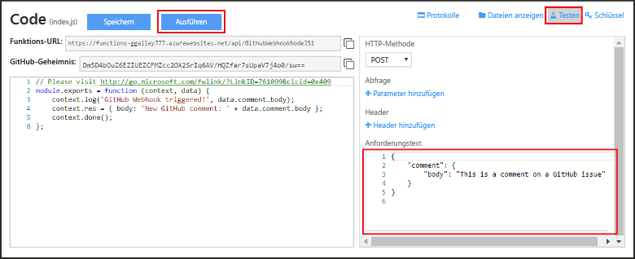

# Erstellen eines Webhooks oder einer API-Azure-Funktion
Azure Functions vermittelt eine durch Ereignissteuerung und Bedarfsabhängigkeit geprägte Benutzererfahrung. Dies bedeutet, dass Sie geplante oder ausgelöste, in verschiedenen Programmiersprachen implementierte Codeeinheiten erstellen können. Weitere Informationen zu Azure Functions finden Sie in der [Übersicht zu Azure Functions](functions-overview.md).

In diesem Thema erfahren Sie, wie Sie eine JavaScript-Funktion erstellen, die von einem GitHub-Webhook aufgerufen wird. Die neue Funktion wird basierend auf einer vordefinierten Vorlage im Azure Functions-Portal erstellt. Sie können sich auch ein kurzes Video ansehen, das die Ausführung dieser Schritte im Portal zeigt.

Die allgemeinen Schritte in diesem Tutorial eignen sich auch zum Erstellen einer Funktion in C# oder F# anstelle von JavaScript. 

## Video ansehen
Das folgende Video zeigt die Ausführung der grundlegenden Schritte in diesem Tutorial. 

>[!VIDEO https://channel9.msdn.com/Series/Windows-Azure-Web-Sites-Tutorials/Create-a-Web-Hook-or-API-Azure-Function/player]
>
>

## Voraussetzungen

Für dieses Tutorial benötigen Sie Folgendes:

+ Ein aktives Azure-Konto. Falls Sie noch nicht über ein Azure-Konto verfügen, können Sie sich [für ein kostenloses Azure-Konto registrieren](https://azure.microsoft.com/free/).  
 Mit [Functions testen](https://functions.azure.com/try) können Sie dieses Tutorial auch ohne Azure-Konto absolvieren.
+ Ein GitHub-Konto. Sie können sich [für ein kostenloses GitHub-Konto registrieren](https://github.com/join), falls Sie noch keines besitzen. 

## Erstellen einer durch einen Webhook ausgelösten Funktion aus der Vorlage
Eine Funktions-App hostet die Ausführung Ihrer Funktionen in Azure. 

1. Wechseln Sie zum [Azure Functions-Portal](https://functions.azure.com/signin) , und melden Sie sich mit Ihrem Azure-Konto an.

2. Wenn Sie bereits eine Funktionen-App besitzen, wählen Sie diese in **Ihre Funktionen-Apps** aus, und klicken Sie dann auf **Öffnen**. Um eine Funktionen-App zu erstellen, geben Sie einen eindeutigen **Namen** für Ihre neue Funktionen-App ein, oder übernehmen Sie den generierten Namen, wählen Sie die bevorzugte **Region** aus, und klicken Sie anschließend auf **Erstellen und starten**. 

3. Klicken Sie in Ihrer Funktionen-App auf **+ Neue Funktion** > **GitHub-Webhook - JavaScript** > **Erstellen**. Durch diesen Schritt wird eine Funktion mit einem Standardnamen erstellt, der auf der angegebenen Vorlage basiert. Alternativ können Sie auch eine C#- oder F#-Funktion erstellen.
   
     

4. Beachten Sie unter **Entwickeln** die Beispielfunktion „ express.js“ im Fenster **Code**. Diese Funktion empfängt eine GitHub-Anforderung von einem Problemberichtwebhook, protokolliert den Problemtext und sendet eine Antwort als `New GitHub comment: <Your issue comment text>`an den Webhook.

     

1. Kopieren und speichern Sie die Werte für **Funktions-URL** und **Geheimer GitHub-Schlüssel**. Diese Werte benötigen Sie im nächsten Abschnitt, um den Webhook in GitHub zu konfigurieren. 

2. Klicken Sie auf **Testen**, beachten Sie den vordefinierten JSON-Text eines Problemberichts im **Anforderungstext**, und klicken Sie auf **Ausführen**. 

    
   
    > [!NOTE]
    > Sie können rechts in der Registerkarte **Entwickeln** immer eine neue vorlagenbasierte Funktion testen, indem Sie erwartete JSON-Textdaten eingeben und auf die Schaltfläche **Ausführen** klicken. In diesem Fall hat die Vorlage einen vordefinierten Text für einen Problembericht. 

Als Nächstes erstellen Sie den aktuellen Webhook im GitHub-Repository.

## Konfigurieren des Webhooks
1. Navigieren Sie in GitHub zu einem Repository, das Sie besitzen. Sie können auch andere beliebige Repositorys verwenden, die Sie verzweigt haben.
 
2. Klicken Sie auf **Einstellungen** > **Webhooks & Dienste** > **Webhook hinzufügen**.
   
       

3. Fügen Sie die Funktions-URL und den geheimen Schlüssel unter **Nutzlast-URL** und **Geheimnis** ein, und wählen Sie unter **Inhaltstyp** die Option **application/json** aus.

4. Klicken Sie auf **Einzelne Ereignisse auswählen**, wählen Sie **Problembericht** aus, und klicken Sie anschließend auf **Webhook hinzufügen**.
   
     

An diesem Punkt ist der GitHub-Webhook so konfiguriert, dass die Funktion ausgelöst wird, wenn ein neuer Problembericht hinzugefügt wurde.  
Jetzt ist es Zeit, zu testen.

## Testen der Funktion
1. Öffnen Sie in Ihrem GitHub-Repository die Registerkarte **Probleme** in einem neuen Browserfenster.

2. Klicken Sie in dem neuen Fenster auf **Neues Problem**, geben Sie einen Titel ein, und klicken Sie anschließend auf **Submit new issue** (Neues Problem übermitteln). Sie können auch eine vorhandene Problemmeldung öffnen.

2. Geben Sie in die Problemmeldung einen Kommentar ein, und klicken Sie auf **Kommentar**. 

3. Klicken Sie im anderen GitHub-Fenster neben Ihrem neuen Webhook auf **Bearbeiten**, scrollen Sie nach unten zu **Recent Deliveries** (Aktuelle Übermittlungen), und vergewissern Sie sich, dass eine Webhookanforderung gesendet wurde und die Antwort wie folgt aussieht: `New GitHub comment: <Your issue comment text>`.

3. Wenn Sie zum „Functions“-Portal zurückgekehrt sind, scrollen Sie zu den Protokollen hinunter, und dort werden Sie feststellen, dass die Funktion ausgelöst und der Wert `New GitHub comment: <Your issue comment text>` in die Streamingprotokolle geschrieben wurde.

## Nächste Schritte
Weitere Informationen zu Azure Functions finden Sie in diesen Themen.

* [Entwicklerreferenz zu Azure Functions](functions-reference.md)  
  Referenz zu Codierfunktionen für Programmierer.
* [Testing Azure Functions (Testen von Azure Functions) (Testen von Azure Functions)](functions-test-a-function.md)  
  Beschreibt verschiedene Tools und Techniken zum Testen Ihrer Funktionen
* [How to scale Azure Functions (Skalieren von Azure Functions) (Skalieren von Azure Functions)](functions-scale.md)  
  Beschreibt die für Azure Functions verfügbaren Servicepläne (einschließlich des Hostingplans „Verbrauchstarif“) und enthält Informationen zur Wahl des geeigneten Plans.  

[!INCLUDE [Getting Started Note](../../includes/functions-get-help.md)]

