# <a name="create-an-azure-function-connected-to-an-azure-service"></a>Erstellen einer Azure Functions-Funktion, die mit einem Azure-Dienst verbunden ist

In diesem Thema wird veranschaulicht, wie Sie eine Azure Functions-Funktion erstellen, die über eine Azure Storage-Warteschlange auf Nachrichten lauscht und die Nachrichten in die Zeilen einer Azure Storage-Tabelle kopiert. Eine per Timer ausgelöste Funktion wird verwendet, um Nachrichten in die Warteschlange zu laden. Mit einer zweiten Funktion werden Daten aus der Warteschlange ausgelesen und Nachrichten in die Tabelle geschrieben. Sowohl die Warteschlange als auch die Tabelle werden für Sie basierend auf den Bindungsdefinitionen von Azure Functions erstellt. 

Interessant ist hierbei, dass eine Funktion in JavaScript und die andere in C#-Skript geschrieben wurde. Dies zeigt, dass eine Funktionen-App über Funktionen in unterschiedlichen Sprachen verfügen kann.

## <a name="watch-the-video"></a>Video ansehen
>[!VIDEO https://channel9.msdn.com/Series/Windows-Azure-Web-Sites-Tutorials/Create-an-Azure-Function-which-binds-to-an-Azure-service/player]
>
>

## <a name="create-a-function-that-writes-to-the-queue"></a>Erstellen einer Funktion, die in die Warteschlange schreibt

Bevor Sie eine Verbindung mit einer Speicherwarteschlange herstellen können, müssen Sie eine Funktion erstellen, die eine Nachrichtenwarteschlange lädt. Für die JavaScript-Funktion wird ein Trigger mit Timer verwendet, bei dem alle zehn Sekunden eine Nachricht in die Warteschlange geschrieben wird. Falls Sie noch kein Azure-Konto besitzen, können Sie sich die Seite zum Ausprobieren von Funktionen ([Try Azure Functions](https://functions.azure.com/try)) ansehen oder [ein kostenloses Azure-Konto erstellen](https://azure.microsoft.com/free/).

1. Navigieren Sie im Azure-Portal zu Ihrer Funktionen-App.

2. Klicken Sie auf **Neue Funktion** > **TimerTrigger-JavaScript**. 

3. Geben Sie der Funktion den Namen **FunctionsBindingsDemo1**, und geben Sie den CRON-Ausdruckswert `0/10 * * * * *` unter **Zeitplan** ein. Klicken Sie anschließend auf **Erstellen**.
   
    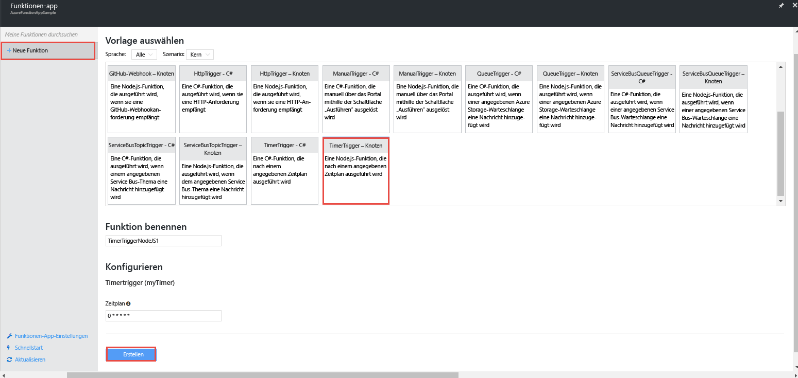

    Sie haben jetzt eine Funktion erstellt, die per Timer ausgelöst und alle zehn Sekunden ausgeführt wird.

5. Klicken Sie auf der Registerkarte **Entwickeln** auf **Protokolle**, und zeigen Sie die Aktivität im Protokoll an. Sie sehen, dass alle zehn Sekunden ein Protokolleintrag geschrieben wird.
   
    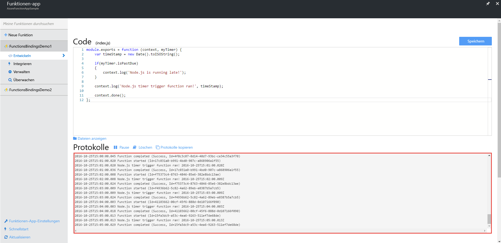

## <a name="add-a-message-queue-output-binding"></a>Hinzufügen einer Ausgabebindung für die Nachrichtenwarteschlange

1. Wählen Sie auf der Registerkarte **Integrieren** die Option **Neue Ausgabe** > **Azure Queue Storage** > **Auswählen**.

    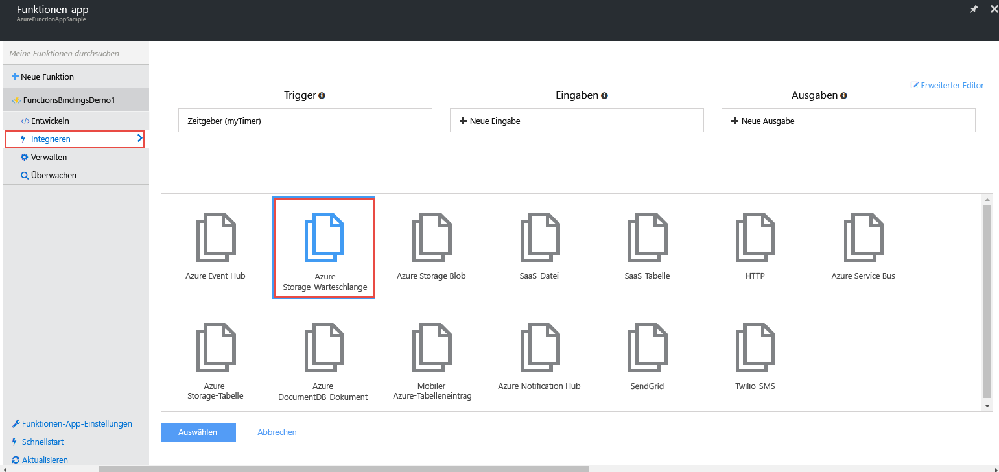

2. Geben Sie `myQueueItem` unter **Nachrichtenparametername** und `functions-bindings` unter **Warteschlangenname** ein, und wählen Sie eine vorhandene **Speicherkontoverbindung** aus, oder klicken Sie auf **Neu**, um eine Speicherkontoverbindung zu erstellen. Klicken Sie anschließend auf **Speichern**.  

    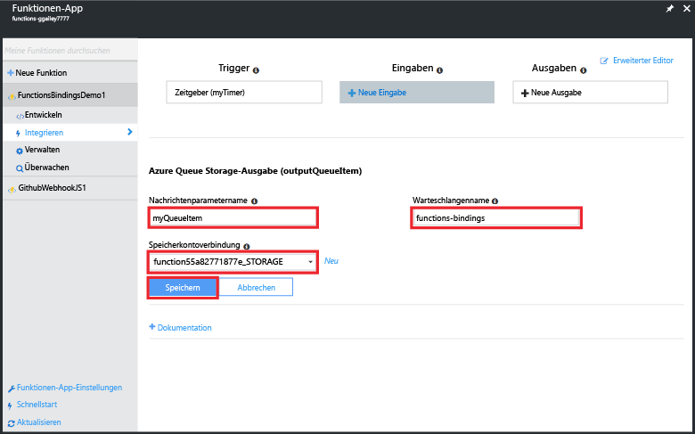

1. Fügen Sie über die Registerkarte **Entwickeln** den folgenden Code an die Funktion an:
   
    ```javascript
   
    function myQueueItem() 
    {
        return {
            msg: "some message goes here",
            time: "time goes here"
        }
    }
   
    ```
2. Suchen Sie nach der *if*-Anweisung, die sich ungefähr in Zeile 9 der Funktion befindet, und fügen Sie nach der Anweisung den folgenden Code ein.
   
    ```javascript
   
    var toBeQed = myQueueItem();
    toBeQed.time = timeStamp;
    context.bindings.myQueueItem = toBeQed;
   
    ```  
   
    Dieser Code erstellt ein **myQueueItem**-Element und legt dessen **time**-Eigenschaft auf den aktuellen Zeitstempel fest. Anschließend wird das neue Warteschlangenelement der **myQueueItem**-Bindung des Kontexts hinzugefügt.

3. Klicken Sie auf **Speichern und ausführen**.

## <a name="view-storage-updates-by-using-storage-explorer"></a>Anzeigen von Speicherupdates mit dem Speicher-Explorer
Sie können die Funktionsweise der Funktion überprüfen, indem Sie in der von Ihnen erstellten Warteschlange Nachrichten anzeigen.  Sie können eine Verbindung mit der Speicherwarteschlange herstellen, indem Sie den Cloud-Explorer in Visual Studio verwenden. Im Portal ist es aber einfach, mit dem Microsoft Azure-Speicher-Explorer eine Verbindung mit Ihrem Speicherkonto herzustellen.

1. Klicken Sie auf der Registerkarte **Integrieren** auf Ihre Warteschlangen-Ausgabebindung und dann auf **Dokumentation**. Blenden Sie anschließend die Verbindungszeichenfolge für Ihr Speicherkonto ein, und kopieren Sie den Wert. Sie verwenden diesen Wert, um eine Verbindung mit Ihrem Speicherkonto herzustellen.

    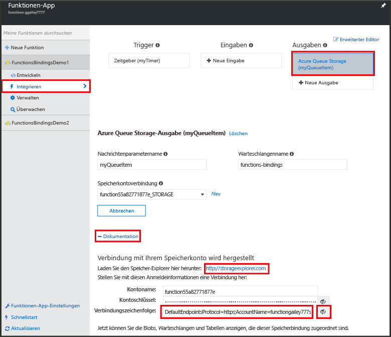


2. Laden Sie den [Microsoft Azure-Speicher-Explorer](http://storageexplorer.com) herunter, und installieren Sie ihn, falls Sie dies noch nicht getan haben. 
 
3. Klicken Sie im Speicher-Explorer auf das Symbol „Verbindung mit Azure-Speicher herstellen“, fügen Sie die Verbindungszeichenfolge in das Feld ein, und schließen Sie den Assistenten ab.

    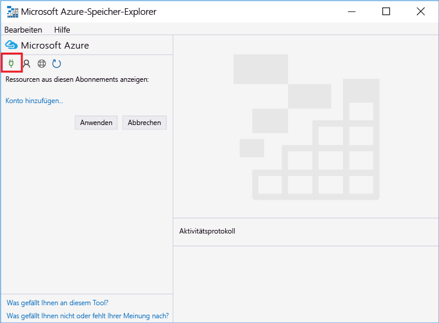

4. Erweitern Sie unter **Local and attached** (Lokal und angefügt) die Option **Speicherkonten** > Ihr Speicherkonto > **Warteschlangen** > **functions-bindings**, und vergewissern Sie sich, dass Nachrichten in die Warteschlange geschrieben werden.

    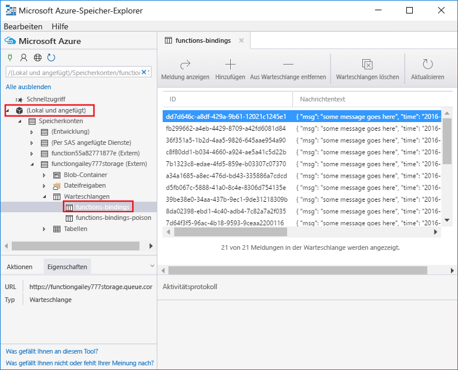

    Wenn die Warteschlange nicht vorhanden oder leer ist, liegt wahrscheinlich ein Problem mit der Funktionsbindung oder dem Code vor.

## <a name="create-a-function-that-reads-from-the-queue"></a>Erstellen einer Funktion zum Auslesen aus der Warteschlange

Nachdem der Warteschlange jetzt Nachrichten hinzugefügt werden, können Sie eine weitere Funktion erstellen, mit der Daten aus der Warteschlange ausgelesen und die Nachrichten dauerhaft in eine Azure Storage-Tabelle geschrieben werden.

1. Klicken Sie auf **Neue Funktion** > **QueueTrigger-CSharp**. 
 
2. Geben Sie der Funktion den Namen `FunctionsBindingsDemo2`, geben Sie **functions-bindings** im Feld **Warteschlangenname** ein, und wählen Sie ein vorhandenes Speicherkonto aus, oder erstellen Sie ein Speicherkonto. Klicken Sie anschließend auf **Erstellen**.

    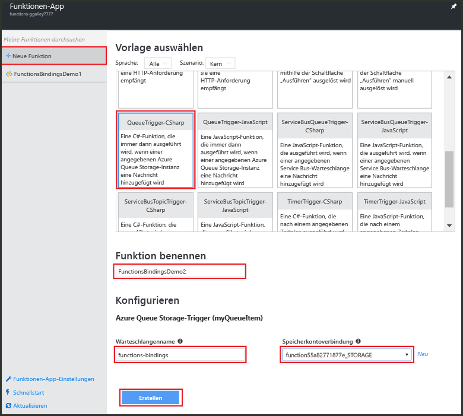 

3. (Optional) Sie können die Funktionsweise der neuen Funktion überprüfen, indem Sie die neue Warteschlange wie zuvor im Speicher-Explorer anzeigen. Sie können auch den Cloud-Explorer in Visual Studio verwenden.  

4. (Optional) Aktualisieren Sie die Warteschlange **functions-bindings**. Sie sehen, dass Elemente aus der Warteschlange entfernt wurden. Das Entfernen wird durchgeführt, weil die Funktion an die Warteschlange **functions-bindings** als Eingabetrigger gebunden ist und die Funktion Daten aus der Warteschlange ausliest. 
 
## <a name="add-a-table-output-binding"></a>Hinzufügen einer Tabellenausgabebindung

1. Klicken Sie in FunctionsBindingsDemo2 auf **Integrieren** > **Neue Ausgabe** > **Azure Table Storage** > **Auswählen**.

    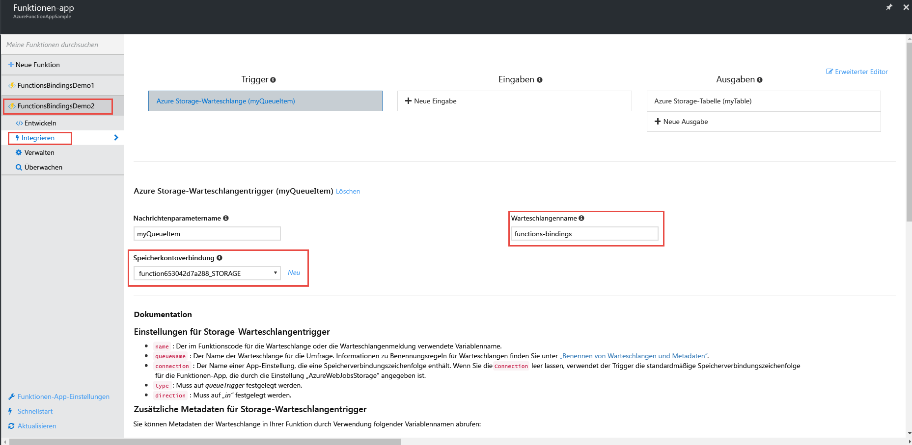 

2. Geben Sie `TableItem` als **Tabellenname** und `functionbindings` als **Tabellenparametername** ein, und wählen Sie eine **Speicherkontoverbindung** aus, oder erstellen Sie eine neue Verbindung. Klicken Sie anschließend auf **Speichern**.

    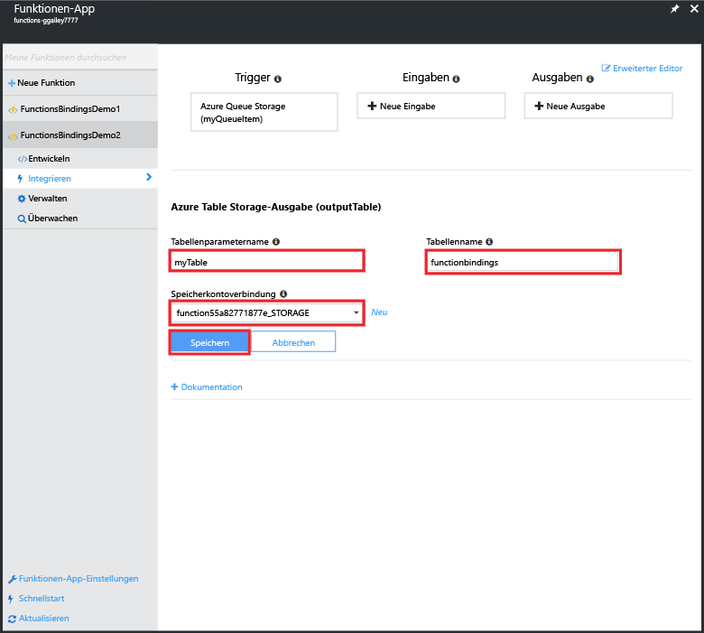
   
3. Ersetzen Sie auf der Registerkarte **Entwickeln** den vorhandenen Funktionscode durch Folgendes:
   
    ```cs
    
    using System;
    
    public static void Run(QItem myQueueItem, ICollector<TableItem> myTable, TraceWriter log)
    {    
        TableItem myItem = new TableItem
        {
            PartitionKey = "key",
            RowKey = Guid.NewGuid().ToString(),
            Time = DateTime.Now.ToString("hh.mm.ss.ffffff"),
            Msg = myQueueItem.Msg,
            OriginalTime = myQueueItem.Time    
        };
        
        // Add the item to the table binding collection.
        myTable.Add(myItem);
    
        log.Verbose($"C# Queue trigger function processed: {myItem.RowKey} | {myItem.Msg} | {myItem.Time}");
    }
    
    public class TableItem
    {
        public string PartitionKey {get; set;}
        public string RowKey {get; set;}
        public string Time {get; set;}
        public string Msg {get; set;}
        public string OriginalTime {get; set;}
    }
    
    public class QItem
    {
        public string Msg { get; set;}
        public string Time { get; set;}
    }
    ```
    Die **TableItem**-Klasse stellt eine Zeile in der Speichertabelle dar, und Sie können das Element der `myTable`-Sammlung mit **TableItem**-Objekten hinzufügen. Sie müssen die Eigenschaften **PartitionKey** und **RowKey** festlegen, um Elemente in die Tabelle einfügen zu können.

4. Klicken Sie auf **Speichern**.  Abschließend können Sie die Funktionsweise der Funktion überprüfen, indem Sie die Tabelle im Speicher-Explorer oder im Cloud-Explorer von Visual Studio anzeigen.

5. (Optional) Erweitern Sie unter Ihrem Speicherkonto im Speicher-Explorer die Option **Tabellen** > **functionsbindings**, und vergewissern Sie sich, dass der Tabelle Zeilen hinzugefügt werden. Dies ist auch im Cloud-Explorer von Visual Studio möglich.

    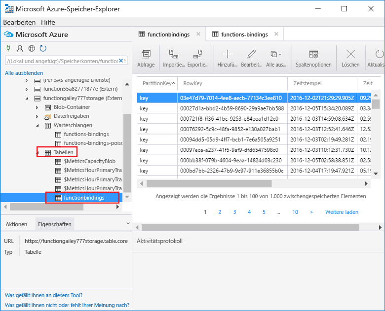

    Wenn die Tabelle nicht vorhanden oder leer ist, liegt wahrscheinlich ein Problem mit der Funktionsbindung oder dem Code vor. 
 
[!INCLUDE [More binding information](../../includes/functions-bindings-next-steps.md)]

## <a name="next-steps"></a>Nächste Schritte
Weitere Informationen zu Azure Functions finden Sie in diesen Themen.

* [Entwicklerreferenz zu Azure Functions](functions-reference.md)  
   Referenz zum Programmieren von Funktionen sowie zum Festlegen von Triggern und Bindungen.
* [Testing Azure Functions (Testen von Azure Functions) (Testen von Azure Functions)](functions-test-a-function.md)  
   Beschreibt verschiedene Tools und Techniken zum Testen Ihrer Funktionen
* [How to scale Azure Functions (Skalieren von Azure Functions) (Skalieren von Azure Functions)](functions-scale.md)  
  Beschreibt die für Azure Functions verfügbaren Servicepläne (einschließlich des Hostingplans „Verbrauchstarif“) und enthält Informationen zur Wahl des geeigneten Plans. 

[!INCLUDE [Getting help note](../../includes/functions-get-help.md)]


<!--HONumber=Dec16_HO2-->


