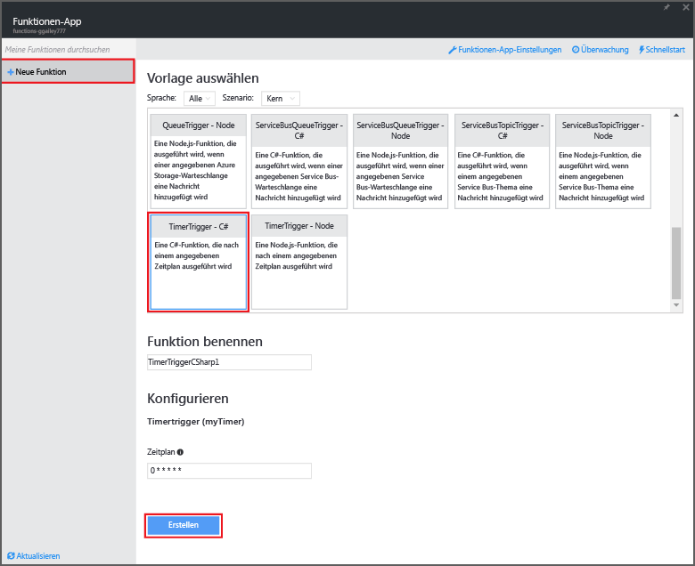
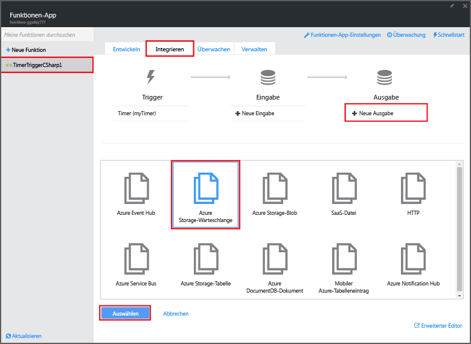
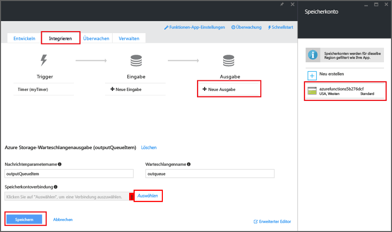

<properties
   pageTitle="Erstellen einer Ereignisverarbeitungsfunktion | Microsoft Azure"
   description="Verwenden Sie Azure Functions, um eine C#-Funktion zu erstellen, die basierend auf einem Ereignistimer ausgeführt wird."
   services="functions"
   documentationCenter="na"
   authors="ggailey777"
   manager="erikre"
   editor=""
   tags=""
   />

<tags
   ms.service="functions"
   ms.devlang="multiple"
   ms.topic="get-started-article"
   ms.tgt_pltfrm="multiple"
   ms.workload="na"
   ms.date="09/25/2016"
   ms.author="glenga"/>
   
# Erstellen einer Azure-Ereignisverarbeitungsfunktion

Azure Functions vermittelt eine durch Ereignissteuerung und Bedarfsabhängigkeit geprägte Benutzererfahrung. Dies bedeutet, dass Sie geplante oder ausgelöste, in verschiedenen Programmiersprachen implementierte Codeeinheiten erstellen können. Weitere Informationen zu Azure Functions finden Sie in der [Übersicht zu Azure Functions](functions-overview.md).

In diesem Thema wird gezeigt, wie Sie eine neue Funktion in C# erstellen, die basierend auf einem Ereignistimer ausgeführt wird, um Nachrichten einer Speicherwarteschlange hinzuzufügen.

## Voraussetzungen 

Bevor Sie eine Funktion erstellen können, müssen Sie über ein aktives Azure-Konto verfügen. Wenn Sie noch kein Azure-Konto haben, [können Sie ein kostenloses Konto erstellen](https://azure.microsoft.com/free/).

## Erstellen einer per Timer ausgelösten Funktion aus der Vorlage

Eine Funktions-App hostet die Ausführung Ihrer Funktionen in Azure. Bevor Sie eine Funktion erstellen können, müssen Sie über ein aktives Azure-Konto verfügen. Wenn Sie noch kein Azure-Konto haben, [erstellen Sie ein kostenloses Konto](https://azure.microsoft.com/free/).

1. Rufen Sie das [Azure Functions-Portal](https://functions.azure.com/signin) auf, und melden Sie sich mit Ihrem Azure-Konto an.

2. Wenn Sie bereits eine Funktions-App besitzen, wählen Sie diese in **Ihre Funktions-Apps** aus, und klicken Sie dann auf **Öffnen**. Um eine neue Funktions-App zu erstellen, geben Sie einen eindeutigen **Namen** für Ihre neue Funktions-App ein, oder nehmen Sie den generierten Namen an, wählen Sie die bevorzugte **Region** aus, und klicken Sie anschließend auf **Erstellen und starten**.

3. Klicken Sie in Ihrer Funktionen-App auf **+ Neue Funktion** > **TimerTrigger – C#** > **Erstellen**. Eine Funktion mit einem Standardnamen wird erstellt, die nach dem Standardzeitplan einmal pro Minute ausgeführt wird.

	

4. Klicken Sie in der neuen Funktion auf die Registerkarte **Integrieren** und dann auf **Neue Ausgabe** > **Azure Storage Queue** (Azure Storage-Warteschlange) > **Auswählen**.

	

5. Wählen Sie in der Ausgabe der **Azure Storage-Warteschlange** eine vorhandene **Speicherkontoverbindung** aus, oder erstellen Sie eine neue Verbindung, und klicken Sie anschließend auf **Speichern**.

	

6. Ersetzen Sie auf der Registerkarte **Entwickeln** das vorhandene C#-Skript im Codefenster durch den folgenden Code:

		using System;
		
		public static void Run(TimerInfo myTimer, out string outputQueueItem, TraceWriter log)
		{
		    // Add a new scheduled message to the queue.
		    outputQueueItem = $"Ping message added to the queue at: {DateTime.Now}.";
		    
		    // Also write the message to the logs.
		    log.Info(outputQueueItem);
		}

	Mit diesem Code wird der Warteschlange eine neue Nachricht mit dem aktuellen Datum und der Uhrzeit der Funktionsausführung hinzugefügt.

7. Klicken Sie auf **Speichern**, und achten Sie im Fenster **Protokolle** auf die nächste Funktionsausführung.

8. (Optional) Navigieren Sie zum Speicherkonto, und überprüfen Sie, ob der Warteschlange Nachrichten hinzugefügt werden.

9. Wechseln Sie zurück zur Registerkarte **Integrieren**, und ändern Sie das Zeitplanfeld in `0 0 * * * *`. Die Funktion wird jetzt einmal pro Stunde ausgeführt.

Dies ist ein stark vereinfachtes Beispiel für einen Trigger mit Timer und eine Storage-Warteschlangen-Ausgabebindung. Weitere Informationen finden Sie in den Themen [Azure Functions-Trigger mit Timer](functions-bindings-timer.md) und [Trigger und Bindungen für Azure Storage in Azure Functions](functions-bindings-storage.md).

##Nächste Schritte

Weitere Informationen zu Azure Functions finden Sie in diesen Themen.

+ [Azure Functions developer reference (Azure Functions-Entwicklerreferenz)](functions-reference.md) Referenz zum Programmieren von Funktionen sowie zum Festlegen von Triggern und Bindungen
+ [Testing Azure Functions (Testen von Azure Functions)](functions-test-a-function.md) Beschreibt verschiedene Tools und Techniken zum Testen Ihrer Funktionen
+ [How to scale Azure Functions (Skalieren von Azure Functions)](functions-scale.md) Beschreibt die für Azure Functions verfügbaren Servicepläne einschließlich des dynamischen Serviceplans, und wie Sie den richtigen Plan finden

[AZURE.INCLUDE [Hinweis zu den ersten Schritten](../../includes/functions-get-help.md)]

<!---HONumber=AcomDC_0928_2016-->