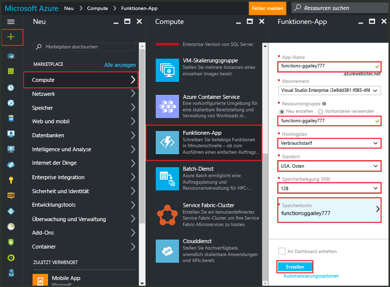
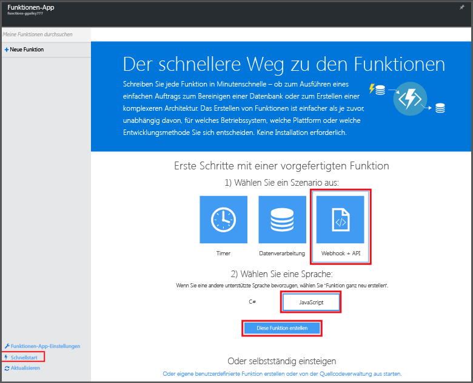

# Erstellen einer Funktion im Azure-Portal
## Übersicht
Azure Functions ist eine ereignisgesteuerte On-Demand-Computeumgebung, die die vorhandene Azure-Anwendungsplattform um Funktionen zur Implementierung von Code erweitert, der von Ereignissen in anderen Azure-Diensten, SaaS-Produkten sowie in lokalen Systemen ausgelöst wird. Mit Azure Functions werden Ihre Anwendungen basierend auf dem Bedarf skaliert, und Sie zahlen nur für die Ressourcen, die Sie tatsächlich nutzen. Azure Functions ermöglicht Ihnen das Erstellen von geplanten oder ausgelösten, in verschiedenen Programmiersprachen implementierten Codeeinheiten. Weitere Informationen zu Azure Functions finden Sie in der [Übersicht zu Azure Functions](functions-overview.md).

In diesem Thema wird erläutert, wie Sie im Azure-Portal eine einfache Node.js-Azure-Funktion „hello world“ erstellen, die von einem HTTP-Trigger aufgerufen wird. Bevor Sie eine Funktion im Azure-Portal erstellen können, müssen Sie explizit eine Funktionen-App in Azure App Service erstellen. Informationen dazu, wie Sie die Funktionen-App automatisch erstellen lassen, finden Sie im [anderen Schnellstart-Tutorial zu Azure Functions](functions-create-first-azure-function.md), das eine einfachere Erläuterung für den Schnellstart bietet und ein Video umfasst.

## Erstellen einer Funktionen-App
Eine Funktionen-App hostet die Ausführung Ihrer Funktionen in Azure. Führen Sie die folgenden Schritte aus, um eine Funktionen-App im Azure-Portal zu erstellen.

Zum Erstellen Ihrer ersten Funktion benötigen Sie ein aktives Azure-Konto. Falls Sie noch kein Azure-Konto haben, können Sie ein [kostenloses Konto erstellen](https://azure.microsoft.com/free/).

1. Wechseln Sie zum [Azure-Portal](https://portal.azure.com), und melden Sie sich mit Ihrem Azure-Konto an.
2. Klicken Sie auf **Neu** > **Web und mobil** > **Funktionen-App**, wählen Sie Ihr **Abonnement** aus, geben Sie einen eindeutigen **App-Namen** zur Identifizierung Ihrer Funktionen-App ein, und legen Sie dann die folgenden Einstellungen fest:
   
   * **[Ressourcengruppe](../azure-portal/resource-group-portal.md)**: Wählen Sie **Neu erstellen** aus, und geben Sie einen Namen für die neue Ressourcengruppe ein. Sie können auch eine vorhandene Ressourcengruppe auswählen. Möglicherweise können Sie jedoch keinen dynamischen App Service-Plan für Ihre Funktionen-App erstellen.
   * **[App Service-Plan](../app-service/azure-web-sites-web-hosting-plans-in-depth-overview.md)**: Wählen Sie *Dynamisch* oder *Klassisch* aus.
     * **Dynamisch**: Dies ist der Standardplantyp für Azure Functions. Wenn Sie einen dynamischen Plan auswählen, müssen Sie auch den **Standort** und die **Speicherbelegung** (in MB) festlegen. Informationen zu den Auswirkungen der Speicherbelegung auf die Kosten finden Sie unter [Azure Functions – Preise](https://azure.microsoft.com/pricing/details/functions/).
     * **Klassisch**: Ein klassischer App Service-Plan erfordert, dass Sie einen **App Service-Plan/Standort** erstellen oder einen vorhandenen App Service-Plan/Standort auswählen. Diese Einstellungen bestimmen den [Standort, die Funktionen, die Kosten und die Computeressourcen](https://azure.microsoft.com/pricing/details/app-service/) Ihrer App.
   * **Speicherkonto**: Für jede Funktionen-App ist ein Speicherkonto erforderlich. Sie können ein vorhandenes Speicherkonto auswählen oder ein neues erstellen.
     
     
3. Klicken Sie auf **Erstellen**, um die neue Funktionen-App bereitzustellen.

Nach der Bereitstellung der Funktionen-App können Sie Ihre erste Funktion erstellen.

## Erstellen einer Funktion
In diesen Schritten wird mithilfe des Schnellstarts von Azure Functions eine Funktion erstellt.

1. Klicken Sie auf der Registerkarte **Schnellstart** auf **WebHook + API**, auf **JavaScript** und anschließend auf **Diese Funktion erstellen**. Eine neue vordefinierte Node.js-Funktion wird erstellt.
   
    
2. (Optional) Sie haben nun die Möglichkeit, eine Schnelleinführung zu den Features von Azure Functions im Portal anzuzeigen. Sobald diese Schnelleinführung beendet ist bzw. übersprungen wurde, können Sie Ihre neue Funktion mit dem HTTP-Trigger testen.

## Testen der Funktion
Da der Schnellstart von Azure Functions Funktionscode enthält, können Sie Ihre neue Funktion sofort testen.

1. Sehen Sie sich auf der Registerkarte **Entwickeln** das Fenster **Code** an. Wie Sie hier sehen können, erfordert dieser Node.js-Code eine HTTP-Anforderung mit dem Wert *Name*, der entweder im Nachrichtentext oder in einer Abfragezeichenfolge übergeben wird. Wenn die Funktion ausgeführt wird, wird dieser Wert in der Antwortnachricht zurückgegeben.
   
    
2. Scrollen Sie nach unten zum Textfeld **Anforderungstext**, ändern Sie den Wert der Eigenschaft *Name* in Ihren Namen, und klicken Sie anschließend auf **Ausführen**. Die Ausführung wird durch eine HTTP-Testanforderung ausgelöst, Informationen werden in die Streamingprotokolle geschrieben, und die Antwort „hello“ wird in der **Ausgabe** angezeigt.
3. Wenn Sie die Ausführung der gleichen Funktion in einem anderen Fenster oder auf einer anderen Registerkarte im Browser auslösen möchten, kopieren Sie den Wert **Funktions-URL** von der Registerkarte **Entwickeln**, und fügen Sie ihn in der Adressleiste des Browsers ein. Hängen Sie anschließend den Abfragezeichenfolgewert `&name=yourname` an, und drücken Sie die Eingabetaste. Dabei werden die gleichen Informationen protokolliert, und der Browser zeigt wie zuvor die Antwort „Hello“ an.

## Nächste Schritte
Der Schnellstart veranschaulicht eine sehr einfache Ausführung einer grundlegenden, über HTTP ausgelösten Funktion. In den folgenden Themen finden Sie weitere Informationen zur Verwendung von Azure Functions in Ihren Apps.

* [Entwicklerreferenz zu Azure Functions](functions-reference.md) Referenz zum Programmieren von Funktionen sowie zum Festlegen von Triggern und Bindungen.
* [Testen von Azure Functions](functions-test-a-function.md) Beschreibt verschiedene Tools und Techniken zum Testen Ihrer Funktionen.
* [Skalieren von Azure Functions](functions-scale.md) Beschreibt die für Azure Functions verfügbaren Servicepläne (einschließlich des dynamischen Serviceplans) und die Auswahl des richtigen Plans.
* [Was ist Azure App Service?](../app-service/app-service-value-prop-what-is.md) Azure Functions nutzt die Azure App Service-Plattform für Kernfunktionen wie Bereitstellungen, Umgebungsvariablen und Diagnosen.

[!INCLUDE [Hinweis zu den ersten Schritten](../../includes/functions-get-help.md)]

<!---HONumber=AcomDC_0914_2016-->