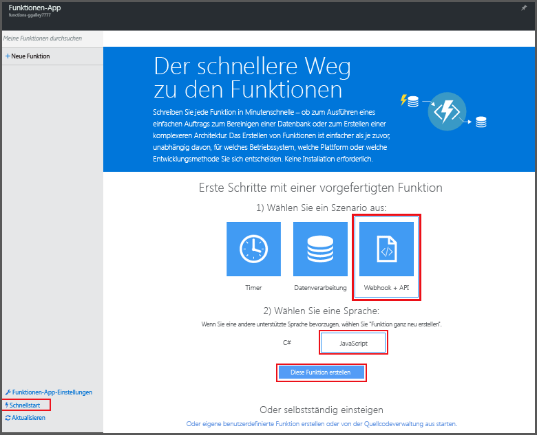
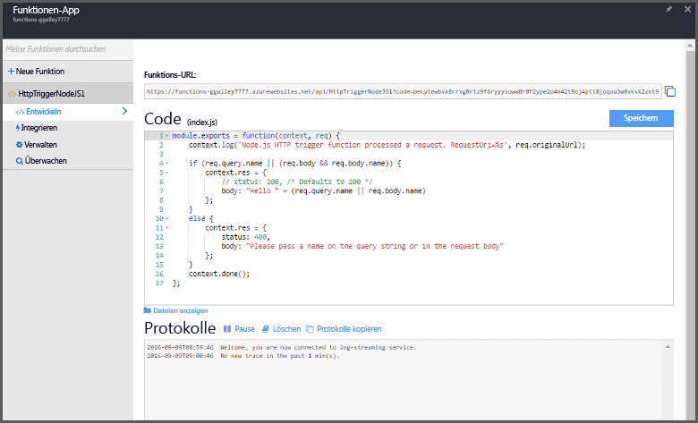

# Erstellen Sie Ihre erste Funktion in Azure Functions
## Übersicht
Azure-Funktionen ist eine ereignisgesteuerte On-Demand-Computeumgebung, mit der die vorhandene Azure-Anwendungsplattform um Funktionen zur Implementierung von Code erweitert wird, der von Ereignissen ausgelöst wird, die in anderen Azure-Diensten, SaaS-Produkten sowie in lokalen Systemen auftreten können. Mit Azure-Funktionen werden Ihre Anwendungen basierend auf der Nachfrage skaliert, und Sie zahlen nur für die Ressourcen, die Sie tatsächlich nutzen. Mit Azure Functions können Sie geplante oder ausgelöste Codeeinheiten erstellen, die in verschiedenen Programmiersprachen implementiert wurden. Weitere Informationen zu Azure Functions finden Sie in der [Übersicht zu Azure Functions](functions-overview.md).

Dieses Thema behandelt die Verwendung des Azure Functions-Schnellstarts im Portal zum Erstellen einer einfachen Node.js-Funktion „Hello World“, die von einem HTTP-Trigger aufgerufen wird. Sie können sich auch ein kurzes Video ansehen, das die Ausführung dieser Schritte im Portal zeigt.

## Video ansehen
Das folgende Video zeigt die Ausführung der grundlegenden Schritte in diesem Tutorial. 

> [!VIDEO https://channel9.msdn.com/Series/Windows-Azure-Web-Sites-Tutorials/Create-your-first-Azure-Function-simple/player]
> 
> 

## Erstellen einer Funktion über den Schnellstart
Eine Funktions-App hostet die Ausführung Ihrer Funktionen in Azure. Führen Sie diese Schritte aus, um eine neue Funktions-App sowie eine neue Funktion zu erstellen. Die neue Funktionen-App wird mit einer Standardkonfiguration erstellt. Ein Beispiel für die explizite Erstellung der Funktionen-App finden Sie im [anderen Schnellstart-Tutorial zu Azure Functions](functions-create-first-azure-function-azure-portal.md).

Bevor Sie Ihre erste Funktion erstellen können, müssen Sie über ein aktives Azure-Konto verfügen. Wenn Sie noch kein Azure-Konto haben, [erstellen Sie ein kostenloses Konto](https://azure.microsoft.com/free/).

1. Wechseln Sie zum [Azure Functions-Portal](https://functions.azure.com/signin) , und melden Sie sich mit Ihrem Azure-Konto an.
2. Geben Sie einen eindeutigen **Namen** für Ihre neue Funktionen-App ein, oder übernehmen Sie den generierten Namen, wählen Sie die bevorzugte **Region** aus, und klicken Sie anschließend auf **Erstellen und starten**. 
3. Klicken Sie auf der Registerkarte **Schnellstart** auf **WebHook + API**, auf **JavaScript** und anschließend auf **Funktion erstellen**. Eine neue vordefinierte Node.js-Funktion wird erstellt. 
   
    
4. (Optional) Nun können Sie auswählen, ob Sie eine kurze Übersicht über die Features von Azure Functions im Portal erhalten möchten.    Sobald diese Schnelleinführung beendet ist bzw. übersprungen wurde, können Sie Ihre neue Funktion mit dem HTTP-Trigger testen.

## Testen der Funktion
Da der Schnellstart von Azure Functions Funktionscode enthält, können Sie Ihre neue Funktion sofort testen.

1. Sehen Sie sich auf der Registerkarte **Entwickeln** das Fenster **Code** an. Wie Sie hier sehen können, erfordert dieser Node.js-Code eine HTTP-Anforderung mit einem Wert für *Name*, der entweder im Nachrichtentext oder in einer Abfragezeichenfolge übergeben wird. Wenn die Funktion ausgeführt wird, wird dieser Wert in der Antwortnachricht zurückgegeben.
   
    
2. Scrollen Sie nach unten zum Textfeld **Anforderungstext**, ändern Sie den Wert der Eigenschaft *Name* in Ihren Namen, und klicken Sie anschließend auf **Ausführen**. Wie Sie sehen, wird die Ausführung von einer Test-HTTP-Anforderung ausgelöst, die Informationen werden in die Streamingprotokolle geschrieben, und die „Hello“-Antwort wird in der **Ausgabe**angezeigt. 
3. Wenn Sie die Ausführung der gleichen Funktion in einem anderen Fenster oder auf einer anderen Registerkarte im Browser auslösen möchten, kopieren Sie den Wert **Funktions-UR**L von der Registerkarte **Entwickeln**, und fügen Sie ihn in der Adressleiste des Browsers ein. Hängen Sie anschließend den Abfragezeichenfolgewert `&name=yourname` an, und drücken Sie die EINGABETASTE. Dabei werden die gleichen Informationen protokolliert, und der Browser zeigt wie zuvor die Antwort „Hello“ an.

## Nächste Schritte
Der Schnellstart zeigt eine sehr einfache Ausführung einer grundlegenden, über HTTP ausgelösten Funktion. Weitere Informationen zur Nutzung von Azure Functions in Ihren Apps finden Sie in den folgenden Themen.

* [Azure Functions developer reference (Azure Functions-Entwicklerreferenz) (Azure Functions-Entwicklerreferenz)](functions-reference.md)  
   Referenz zum Programmieren von Funktionen sowie zum Festlegen von Triggern und Bindungen.
* [Testing Azure Functions (Testen von Azure Functions) (Testen von Azure Functions)](functions-test-a-function.md)  
   Beschreibt verschiedene Tools und Techniken zum Testen Ihrer Funktionen
* [How to scale Azure Functions (Skalieren von Azure Functions) (Skalieren von Azure Functions)](functions-scale.md)  
   Beschreibt die für Azure Functions verfügbaren Servicepläne einschließlich des dynamischen Serviceplans und wie Sie den richtigen Plan finden 
* [Was ist Azure App Service?](../app-service/app-service-value-prop-what-is.md)  
   Azure Functions nutzt die Azure App Service-Plattform für Kernfunktionen wie Bereitstellungen, Umgebungsvariablen und Diagnosen. 

[!INCLUDE [Getting Started Note](../../includes/functions-get-help.md)]

<!---HONumber=Nov16_HO2-->

