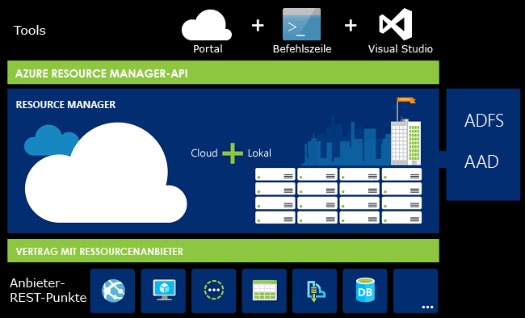
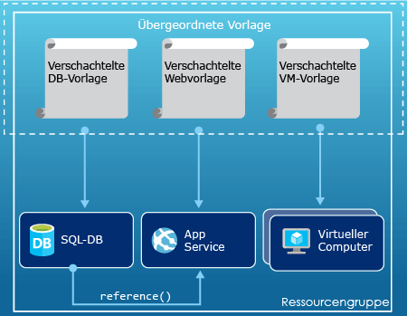
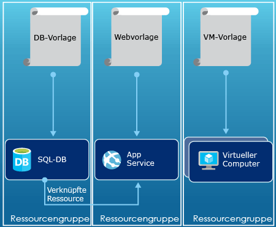

# <a name="azure-resource-manager-overview"></a>Übersicht über den Azure-Ressourcen-Manager
Die Infrastruktur für Ihre Anwendung besteht normalerweise aus vielen Komponenten: womöglich ein virtueller Computer, ein Speicherkonto und ein virtuelles Netzwerk oder eine Web-App, eine Datenbank, ein Datenbankserver und Drittanbieterdienste. Sie sehen diese Komponenten nicht als separate Entitäten, sondern als verwandte und voneinander abhängige Teile einer einzelnen Entität. Diese möchten Sie als Gruppe bereitstellen, verwalten und überwachen. Mit dem Azure-Ressourcen-Manager können Sie als Gruppe mit den Ressourcen in Ihrer Lösung arbeiten. Sie können alle Ressourcen für Ihre Lösung in einem einzigen koordinierten Vorgang bereitstellen, aktualisieren oder löschen. Sie verwenden eine Vorlage für die Bereitstellung, die für unterschiedliche Umgebungen geeignet sein kann, z.B. Testing, Staging und Produktion. Der Ressourcen-Manager bietet Sicherheits-, Überwachungs- und Kennzeichnungsfunktionen, mit denen Sie Ihre Ressourcen nach der Bereitstellung verwalten können. 

## <a name="terminology"></a>Terminologie
Wenn Sie mit dem Azure Resource Manager noch nicht vertraut sind, kennen Sie unter Umständen einige Begriffe noch nicht.

* **Ressource** : Ein verwaltbares Element, das über Azure verfügbar ist. Beispiele für häufig verwendete Ressourcen sind virtueller Computer, Speicherkonto, Web-App, Datenbank und virtuelles Netzwerk, aber es sind noch viele weitere Ressourcen vorhanden.
* **Ressourcengruppe** : Ein Container, der verwandte Ressourcen für eine Azure-Lösung enthält. Die Ressourcengruppe kann alle Ressourcen für die Lösung oder nur die Ressourcen enthalten, die Sie als Gruppe verwalten möchten. Sie entscheiden in Abhängigkeit davon, was für Ihre Organisation am sinnvollsten ist, wie Sie die Ressourcen den Ressourcengruppen zuordnen möchten. Weitere Informationen finden Sie unter [Ressourcengruppen](#resource-groups).
* **Ressourcenanbieter** : Ein Dienst zum Beschaffen der Ressourcen, die Sie über den Resource Manager bereitstellen und verwalten können. Jeder Ressourcenanbieter bietet Vorgänge zum Arbeiten mit den bereitgestellten Ressourcen. Beispiele für häufig verwendete Ressourcenanbieter sind „Microsoft.Compute“ zum Bereitstellen der Ressource für den virtuellen Computer, „Microsoft.Storage“ zum Bereitstellen der Speicherkontoressource und „Microsoft.Web“ zum Bereitstellen von Ressourcen für Web-Apps. Weitere Informationen finden Sie unter [Ressourcenanbieter](#resource-providers).
* **Resource Manager-Vorlage** : Eine JSON-Datei (JavaScript Object Notation), mit der eine oder mehrere Ressourcen zum Bereitstellen einer Ressourcengruppe definiert werden. Außerdem werden damit die Abhängigkeiten zwischen den bereitgestellten Ressourcen definiert. Die Vorlage kann zum konsistenten und wiederholten Bereitstellen der Ressourcen verwendet werden. Weitere Informationen finden Sie unter [Bereitstellung von Vorlagen](#template-deployment).
* **Deklarative Syntax** : Bei dieser Syntax können Sie beispielsweise „Here is what I intend to create“ (Dies möchte ich erstellen) eingeben, ohne dafür die Folge der Programmierbefehle für die Erstellung schreiben zu müssen. Die Resource Manager-Vorlage ist ein Beispiel für die deklarative Syntax. In der Datei definieren Sie die Eigenschaften für die Infrastruktur zum Bereitstellen für Azure. 

## <a name="the-benefits-of-using-resource-manager"></a>Vorteile der Verwendung des Ressourcen-Managers
Der Ressourcen-Manager bietet mehrere Vorteile:

* Sie können alle Ressourcen für Ihre Lösung als Gruppe bereitstellen, verwalten und überwachen, anstatt diese Ressourcen einzeln zu verarbeiten.
* Sie können die Lösung während des gesamten Entwicklungslebenszyklus wiederholt bereitstellen und sicher sein, dass Ihre Ressourcen einheitlich bereitgestellt werden.
* Sie können zum Verwalten Ihrer Infrastruktur anstelle von Skripts auch deklarative Vorlagen verwenden.
* Sie können die Abhängigkeiten zwischen Ressourcen definieren, sodass diese in der richtigen Reihenfolge bereitgestellt werden.
* Sie können die Zugriffssteuerung auf alle Dienste in der Ressourcengruppe anwenden, da die rollenbasierte Zugriffssteuerung (Role-Based Access Control, RBAC) standardmäßig in die Verwaltungsplattform integriert ist.
* Sie können Tags auf Ressourcen anwenden, um alle Ressourcen in Ihrem Abonnement logisch zu organisieren.
* Indem Sie die Kosten für eine Gruppe mit Ressourcen anzeigen, für die das gleiche Tag verwendet wird, erhalten Sie die Abrechnungsinformationen für Ihre Organisation.  

Der Ressourcen-Manager stellt eine neue Möglichkeit zur Bereitstellung und Verwaltung Ihrer Lösungen bereit. Weitere Informationen zu den Änderungen an dem von Ihnen verwendeten früheren Bereitstellungsmodell finden Sie unter [Grundlegendes zur Bereitstellung über den Ressourcen-Manager im Vergleich zur klassischen Bereitstellung](resource-manager-deployment-model.md).

## <a name="consistent-management-layer"></a>Einheitliche Verwaltungsebene
Resource Manager stellt eine einheitliche Verwaltungsebene für die Aufgaben bereit, die Sie über Azure PowerShell, Azure CLI, das Azure-Portal, die REST-API und Entwicklungstools durchführen. Für alle Tools wird ein allgemeiner Satz mit Vorgängen verwendet. Sie verwenden die Tools, die für Sie am besten funktionieren, und es kommt nicht zu Problemen, wenn Sie die Tools wechseln. 

Die folgende Abbildung zeigt, wie alle Tools mit derselben Azure Resource Manager-API interagieren. Die API übergibt Anforderungen an den Resource Manager-Dienst, mit dem die Anforderungen authentifiziert und autorisiert werden. Der Resource Manager leitet die Anforderungen dann an die entsprechenden Ressourcenanbieter weiter.



## <a name="guidance"></a>Anleitungen
Die folgenden Vorschläge helfen Ihnen, bei der Arbeit mit Lösungen die Vorteile von Resource Manager zu nutzen.

1. Definieren Sie die Infrastruktur mithilfe der deklarativen Syntax in Ressourcen-Manager-Vorlagen anstatt mit imperativen Befehlen, und stellen Sie sie so bereit.
2. Definieren Sie alle Bereitstellungs- und Konfigurationsschritte in der Vorlage. Sie sollten keine manuellen Schritte zum Einrichten der Lösung durchführen müssen.
3. Führen Sie imperative Befehle aus, um Ihre Ressourcen zu verwalten, z. B. Starten oder Beenden einer App oder des Computers.
4. Gruppieren Sie Ressourcen mit dem gleichen Lebenszyklus in einer Ressourcengruppe. Verwenden Sie Tags für die weitere Organisation von Ressourcen.

Empfehlungen zu Vorlagen finden Sie unter [Bewährte Methoden für das Erstellen von Azure Resource Manager-Vorlagen](resource-manager-template-best-practices.md).

Anleitungen dazu, wie Unternehmen Abonnements mit Resource Manager effektiv verwalten können, finden Sie unter [Azure-Unternehmensgerüst - Präskriptive Abonnementgovernance](resource-manager-subscription-governance.md).

## <a name="resource-groups"></a>Ressourcengruppen
Beim Definieren der Ressourcengruppe sind einige wichtige Faktoren zu beachten:

1. Alle Ressourcen einer Gruppe sollten über den gleichen Lebenszyklus verfügen. Sie werden von Ihnen zusammen bereitgestellt, aktualisiert und gelöscht. Falls eine Ressource, z. B. ein Datenbankserver, in einem anderen Entwicklungszyklus vorhanden sein muss, sollte er in einer anderen Ressourcengruppe enthalten sein.
2. Jede Ressource kann nur in einer Ressourcengruppe vorhanden sein.
3. Sie können eine Ressource einer Ressourcengruppe jederzeit hinzufügen bzw. die Ressource daraus entfernen.
4. Sie können eine Ressource aus einer Ressourcengruppe in eine andere Gruppe verschieben. Weitere Informationen finden Sie unter [Verschieben von Ressourcen in eine neue Ressourcengruppe oder ein neues Abonnement](resource-group-move-resources.md).
5. Eine Ressourcengruppe kann Ressourcen enthalten, die sich in unterschiedlichen Regionen befinden.
6. Eine Ressourcengruppe kann zum Festlegen der Zugriffssteuerung für administrative Aktionen verwendet werden.
7. Eine Ressource kann mit Ressourcen in anderen Ressourcengruppen interagieren. Diese Interaktion tritt häufig auf, wenn die beiden Ressourcen zusammengehören, aber nicht den gleichen Lebenszyklus aufweisen (z.B. Web-Apps, die eine Verbindung mit einer Datenbank herstellen).

Beim Erstellen einer Ressourcengruppe müssen Sie einen Standort für die Ressourcengruppe angeben. Vielleicht stellen Sie sich hierbei die folgende Frage: „Warum wird für eine Ressourcengruppe ein Standort benötigt? Und wenn die Ressourcen andere Standorte als die Ressourcengruppe aufweisen können, warum ist der Standort der Ressourcengruppe dann überhaupt wichtig?“ In der Ressourcengruppe werden Metadaten zu den Ressourcen gespeichert. Wenn Sie einen Standort für die Ressourcengruppe angeben, legen Sie also fest, wo die Metadaten gespeichert werden. Aus Compliance-Gründen müssen Sie unter Umständen sicherstellen, dass Ihre Daten in einer bestimmten Region gespeichert werden.

## <a name="resource-providers"></a>Ressourcenanbieter
Jeder Ressourcenanbieter stellt einen Satz mit Ressourcen und Vorgängen für die Verwendung eines Azure-Diensts bereit. Wenn Sie beispielsweise Schlüssel und geheime Schlüssel speichern möchten, verwenden Sie den Ressourcenanbieter **Microsoft.KeyVault** . Dieser Ressourcenanbieter bietet einen Ressourcentyp mit dem Namen **vaults** zum Erstellen des Schlüsseltresors an. 

Der Name eines Ressourcentyps hat folgendes Format: **{Ressourcenanbieter}/{Ressourcentyp}**. Der Schlüsseltresortyp lautet beispielsweise **Microsoft.KeyVault/vaults**.

Bevor Sie mit der Bereitstellung Ihrer Ressourcen beginnen, ist es ratsam, sich über die verfügbaren Ressourcenanbieter zu informieren. Wenn Sie die Namen der Ressourcenanbieter und Ressourcen kennen, können Sie besser definieren, welche Ressourcen Sie unter Azure bereitstellen möchten. Außerdem müssen Sie die gültigen Speicherorte und API-Versionen für jeden Ressourcentyp kennen. Weitere Informationen finden Sie unter [Ressourcenanbieter und -typen](resource-manager-supported-services.md).

## <a name="template-deployment"></a>Bereitstellung von Vorlagen
Mit dem Resource Manager können Sie eine Vorlage (im JSON-Format) erstellen, mit der die Infrastruktur und Konfiguration der Azure-Lösung definiert wird. Mit einer Vorlage können Sie die Lösung während ihres Lebenszyklus wiederholt bereitstellen und sicher sein, dass Ihre Ressourcen einheitlich bereitgestellt werden. Wenn Sie eine Lösung über das Portal erstellen, enthält sie automatisch eine Bereitstellungsvorlage. Sie müssen die Vorlage nicht völlig neu erstellen, weil Sie mit der Vorlage für Ihre Lösung beginnen und sie dann an die speziellen Anforderungen anpassen können. Sie können eine Vorlage für eine vorhandene Ressourcengruppe abrufen, indem Sie entweder den aktuellen Zustand der Ressourcengruppe exportieren oder die Vorlage anzeigen, die für eine bestimmte Bereitstellung verwendet wurde. Das Anzeigen der [exportierten Vorlage](resource-manager-export-template.md) ist hilfreich, um sich über die Vorlagensyntax zu informieren.

Weitere Informationen zum Format der Vorlage und zur Erstellung finden Sie unter [Erstellen Ihrer ersten Azure Resource Manager-Vorlage](resource-manager-create-first-template.md). Die JSON-Syntax für Ressourcentypen finden Sie unter [Define resources in Azure Resource Manager templates](/azure/templates/) (Definieren von Ressourcen in Azure Resource Manager-Vorlagen).

Der Resource Manager verarbeitet die Vorlage wie andere Anforderungen auch (siehe Abbildung für [Einheitliche Verwaltungsebene](#consistent-management-layer)). Er analysiert die Vorlage und konvertiert deren Syntax in REST-API-Vorgänge für die entsprechenden Ressourcenanbieter. Beispielsweise kann der Resource Manager eine Vorlage mit der folgenden Ressourcendefinition empfangen:

```json
"resources": [
  {
    "apiVersion": "2016-01-01",
    "type": "Microsoft.Storage/storageAccounts",
    "name": "mystorageaccount",
    "location": "westus",
    "sku": {
      "name": "Standard_LRS"
    },
    "kind": "Storage",
    "properties": {
    }
  }
]
```

Er konvertiert die Definition in den folgenden REST-API-Vorgang, der an den Microsoft.Storage-Ressourcenanbieter gesendet wird:

```HTTP
PUT
https://management.azure.com/subscriptions/{subscriptionId}/resourceGroups/{resourceGroupName}/providers/Microsoft.Storage/storageAccounts/mystorageaccount?api-version=2016-01-01
REQUEST BODY
{
  "location": "westus",
  "properties": {
  }
  "sku": {
    "name": "Standard_LRS"
  },   
  "kind": "Storage"
}
```

Sie können völlig frei entscheiden, wie Sie Vorlagen und Ressourcengruppen definieren und Ihre Lösung verwalten möchten. Beispielsweise können Sie Ihre Anwendung mit drei Ebenen über eine einzelne Vorlage für eine einzelne Ressourcengruppe bereitstellen.


Sie müssen aber nicht die gesamte Infrastruktur in einer einzelnen Vorlage definieren. Oftmals ist es sinnvoll, die Bereitstellungsanforderungen in eine Gruppe von spezifischen, zweckgebundenen Vorlagen zu unterteilen. Sie können diese Vorlagen mühelos für verschiedene Lösungen erneut verwenden. Um eine bestimmte Lösung bereitzustellen, erstellen Sie eine Mastervorlage, die alle erforderlichen Vorlagen verknüpft. Die folgende Abbildung zeigt, wie Sie eine Lösung mit drei Ebenen über eine übergeordnete Vorlage bereitstellen, die drei geschachtelte Vorlagen enthält.



Wenn Ihre Ebenen über separate Lebenszyklen verfügen sollen, können Sie die drei Ebenen in separaten Ressourcengruppen bereitstellen. Beachten Sie, dass die Ressourcen weiterhin mit Ressourcen in anderen Ressourcengruppen verknüpft werden können.



Weitere Vorschläge zum Entwerfen Ihrer Vorlagen finden Sie unter [Muster für das Entwerfen von Azure Resource Manager-Vorlagen](best-practices-resource-manager-design-templates.md). Informationen zu geschachtelten Vorlagen finden Sie unter [Verwenden von verknüpften Vorlagen mit Azure Resource Manager](resource-group-linked-templates.md).

Azure Resource Manager analysiert Abhängigkeiten, um sicherzustellen, dass Ressourcen in der richtigen Reihenfolge erstellt werden. Wenn eine Ressource von einem Wert einer anderen Ressource abhängig ist (z.B. ein virtueller Computer, der ein Speicherkonto für Datenträger benötigt), legen Sie eine Abhängigkeit fest. Weitere Informationen finden Sie unter [Definieren von Abhängigkeiten in Azure-Ressourcen-Manager-Vorlagen](resource-group-define-dependencies.md).

Sie können die Vorlage auch für Aktualisierungen der Infrastruktur verwenden. Beispielsweise können Sie Ihrer Lösung eine Ressource sowie Konfigurationsregeln für die Ressourcen hinzufügen, die bereits bereitgestellt wurden. Wenn in der Vorlage die Erstellung einer Ressource angegeben ist, diese aber bereits vorhanden ist, führt der Azure Resource Manager anstelle der Erstellung einer neuen Ressource eine Aktualisierung durch. Der Azure-Ressourcen-Manager aktualisiert die vorhandene Ressource auf den Zustand, der für eine neue Ressource gelten würde.  

Der Ressourcen-Manager verfügt über Erweiterungen für Szenarien, in denen zusätzliche Vorgänge, wie z. B. das Installieren bestimmter Software, die nicht Teil des Setups ist, erforderlich sind. Wenn Sie bereits einen Konfigurationsverwaltungsdienst verwenden, z. B. DSC, Chef oder Puppet, können Sie ihn weiter nutzen, indem Sie Erweiterungen einsetzen. Informationen zu Erweiterungen für virtuelle Computer finden Sie unter [Informationen zu Erweiterungen und Features für virtuelle Computer](../virtual-machines/windows/extensions-features.md?toc=%2fazure%2fvirtual-machines%2fwindows%2ftoc.json). 

Die Vorlage wird schließlich zu einem Teil des Quellcodes für Ihre App. Sie können sie in das Quellcoderepository einchecken und im Verlauf der App-Entwicklung aktualisieren. Sie können die Vorlage mit Visual Studio bearbeiten.

Nach dem Definieren der Vorlage können Sie die Ressourcen in Azure bereitstellen. Informationen zu den Befehlen für die Bereitstellung der Ressourcen finden Sie hier:

* [Bereitstellen von Ressourcen mit Azure Resource Manager-Vorlagen und Azure PowerShell](resource-group-template-deploy.md)
* [Bereitstellen von Ressourcen mit Azure Resource Manager-Vorlagen und Azure-CLI](resource-group-template-deploy-cli.md)
* [Bereitstellen von Ressourcen mit Azure Resource Manager-Vorlagen und Azure-Portal](resource-group-template-deploy-portal.md)
* [Bereitstellen von Ressourcen mit Resource Manager-Vorlagen und Resource Manager-REST-API](resource-group-template-deploy-rest.md)

## <a name="tags"></a>Tags
Der Ressourcen-Manager verfügt über eine Markierungsfunktion, mit der Sie Ressourcen gemäß Ihren Anforderungen für die Verwaltung oder Abrechnung kategorisieren können. Die Verwendung von Tags (Markierungen) kann ratsam sein, wenn Sie über eine komplexe Sammlung von Ressourcengruppen und Ressourcen verfügen und diese Ressourcen auf möglichst sinnvolle Weise visualisieren müssen. Beispielsweise können Sie Ressourcen markieren, die in Ihrer Organisation eine ähnliche Funktion haben oder zu derselben Abteilung gehören. Benutzer in Ihrer Organisation können mehrere Ressourcen erstellen, die ohne Tags später schwer zu identifizieren und zu verwalten sind. Es kann beispielsweise sein, dass Sie alle Ressourcen für ein bestimmtes Projekt löschen möchten. Wenn diese Ressourcen für das Projekt nicht mit Tags versehen sind, müssen Sie manuell danach suchen. Mit Tags lassen sich unter Umständen unnötige Kosten in Ihrem Abonnement vermeiden. 

Ressourcen müssen sich nicht in derselben Ressourcengruppe befinden, um ein gemeinsames Tag aufzuweisen. Sie können Ihre eigene Tag-Taxonomie erstellen, um dafür zu sorgen, dass alle Benutzer in Ihrer Organisation die gleichen Tags verwenden. So wird verhindert, dass Benutzer versehentlich leicht unterschiedliche Tags nutzen (z. B. „dept“ anstelle von „department“).

Das folgende Beispiel enthält ein Tag, das auf einen virtuellen Computer angewendet wird.

```json
"resources": [    
  {
    "type": "Microsoft.Compute/virtualMachines",
    "apiVersion": "2015-06-15",
    "name": "SimpleWindowsVM",
    "location": "[resourceGroup().location]",
    "tags": {
        "costCenter": "Finance"
    },
    ...
  }
]
```

Verwenden Sie das folgende PowerShell-Cmdlet, um alle Ressourcen mit einem Tagwert abzurufen:

```powershell
Find-AzureRmResource -TagName costCenter -TagValue Finance
```

Oder führen Sie den folgenden Befehl der Azure CLI 2.0 aus:

```azurecli
az resource list --tag costCenter=Finance
```

Sie haben auch die Möglichkeit, Ressourcen mit Tags über das Azure-Portal anzuzeigen.

Der [Nutzungsbericht](../billing/billing-understand-your-bill.md) für Ihr Abonnement enthält Tagnamen und -werte, sodass Sie die Kosten nach Tags aufschlüsseln können. Weitere Informationen zu Tags finden Sie unter [Verwenden von Tags zum Organisieren von Azure-Ressourcen](resource-group-using-tags.md).

## <a name="access-control"></a>Zugriffssteuerung
Mit dem Ressourcen-Manager können Sie steuern, wer Zugriff auf spezielle Aktionen für Ihre Organisation hat. Die rollenbasierte Zugriffssteuerung (Role-Based Access Control, RBAC) ist standardmäßig in die Verwaltungsplattform integriert, und diese Zugriffssteuerung wird auf alle Dienste in der Ressourcengruppe angewendet. 

Es gibt zwei Hauptkonzepte, mit denen Sie vertraut sein sollten, wenn Sie die rollenbasierte Zugriffssteuerung nutzen:

* Rollendefinitionen: Dienen zum Beschreiben einer Gruppe von Berechtigungen und können für viele Zuweisungen verwendet werden.
* Rollenzuweisungen: Eine Definition wird einer Identität (Benutzer oder Gruppe) für einen bestimmten Bereich (Abonnement, Ressourcengruppe oder Ressource) zugeordnet. Die Zuweisung wird an untergeordnete Bereiche vererbt.

Sie können Benutzer vordefinierten Plattformrollen und ressourcenspezifischen Rollen hinzufügen. Beispielsweise können Sie die vordefinierte Rolle „Leser“ verwenden, mit der Benutzer Ressourcen anzeigen, aber nicht ändern können. Sie fügen Benutzer Ihrer Organisation, die diese Art von Zugriff benötigen, der Rolle „Leser“ hinzu und wenden die Rolle auf das Abonnement, die Ressourcengruppe oder die Ressource an.

In Azure werden die folgenden vier Plattformrollen bereitgestellt:

1. Besitzer: Kann alles verwalten, einschließlich des Zugriffs.
2. Mitwirkende: Kann alles mit Ausnahme des Zugriffs verwalten.
3. Leser: Kann alles anzeigen, aber keine Änderungen vornehmen.
4. Benutzerzugriffsadministrator: Kann den Benutzerzugriff auf Azure-Ressourcen verwalten.

Außerdem verfügt Azure über mehrere ressourcenspezifische Rollen. Einige gängige Rollen sind:

1. Mitwirkender für virtuelle Computer: Ermöglicht das Verwalten von virtuellen Computern, aber nicht das Gewähren von Zugriff darauf. Auch das Verwalten des virtuellen Netzwerks oder Speicherkontos, mit dem eine Verbindung besteht, ist nicht möglich
2. Netzwerkmitwirkender: Ermöglicht das Verwalten aller Netzwerkressourcen, aber nicht das Gewähren von Zugriff darauf.
3. Speicherkontomitwirkender: Ermöglicht das Verwalten von Speicherkonten, aber nicht das Gewähren von Zugriff darauf.
4. SQL Server-Mitwirkender: Ermöglicht das Verwalten von SQL-Servern und -Datenbanken, aber nicht der zugehörigen sicherheitsbezogenen Richtlinien.
5. Websitemitwirkender: Ermöglicht das Verwalten von Websites, aber nicht der Webpläne, mit denen sie verbunden sind.

Die vollständige Liste mit den Rollen und zulässigen Aktionen finden Sie unter [RBAC: Integrierte Rollen](../active-directory/role-based-access-built-in-roles.md). Weitere Informationen zur rollenbasierten Zugriffssteuerung finden Sie unter [Rollenbasierte Access Control in Azure](../active-directory/role-based-access-control-configure.md). 

Es kann vorkommen, dass Sie Codeabschnitte oder Skripts ausführen möchten, mit denen auf Ressourcen zugegriffen wird, ohne dabei aber die Anmeldeinformationen eines Benutzers zu verwenden. Stattdessen möchten Sie für die Anwendung eine Identität erstellen, die als Dienstprinzipal bezeichnet wird, und die entsprechende Rolle für den Dienstprinzipal zuweisen. Mit Resource Manager können Sie Anmeldeinformationen für die Anwendung erstellen und die Anwendung programmgesteuert authentifizieren. Informationen zur Erstellung von Dienstprinzipalen finden Sie unter den folgenden Themen:

* [Erstellen eines Dienstprinzipals für den Zugriff auf Ressourcen mithilfe von Azure PowerShell](resource-group-authenticate-service-principal.md)
* [Erstellen eines Dienstprinzipals für den Zugriff auf Ressourcen mithilfe der Azure-Befehlszeilenschnittstelle](resource-group-authenticate-service-principal-cli.md)
* [Erstellen einer Azure Active Directory-Anwendung und eines Dienstprinzipals mit Ressourcenzugriff mithilfe des Portals](resource-group-create-service-principal-portal.md)

Sie können kritische Ressourcen auch explizit sperren, um zu verhindern, dass sie von Benutzern gelöscht oder geändert werden. Weitere Informationen finden Sie unter [Sperren von Ressourcen mit dem Azure-Ressourcen-Manager](resource-group-lock-resources.md).

## <a name="activity-logs"></a>Aktivitätsprotokolle
Resource Manager protokolliert alle Vorgänge, mit denen eine Ressource erstellt, geändert oder gelöscht wird. Sie können bei der Problembehandlung mithilfe der Aktivitätsprotokolle einen Fehler ermitteln oder nachverfolgen, welche Änderungen an einer Ressource ein Benutzer in Ihrer Organisation vorgenommen hat. Wählen Sie zum Anzeigen der Protokolle auf dem Blatt **Einstellungen** die Option **Aktivitätsprotokolle** für eine Ressourcengruppe. Sie können die Protokolle nach vielen verschiedenen Werten filtern, z.B. nach dem Benutzer, der den Vorgang initiiert hat. Informationen zum Verwenden von Aktivitätsprotokollen finden Sie unter [View activity logs to audit actions on resources](resource-group-audit.md) (Anzeigen von Aktivitätsprotokollen zum Überwachen von Aktionen von Ressourcen).

## <a name="customized-policies"></a>Benutzerdefinierte Richtlinien
Mit dem Ressourcen-Manager können Sie benutzerdefinierte Richtlinien zum Verwalten Ihrer Ressourcen erstellen. Die Arten der von Ihnen erstellten Richtlinien können unterschiedliche Szenarien umfassen. Sie können eine Namenskonvention für Ressourcen erzwingen, begrenzen, welche Arten und Instanzen von Ressourcen bereitgestellt werden können, oder begrenzen, in welchen Regionen eine Ressourcenart gehostet werden kann. Um die Abrechnung nach Abteilungen zu organisieren, können Sie die Verwendung eines Tagwerts für Ressourcen obligatorisch machen. Sie erstellen Richtlinien, um Kosten zu senken und die Konsistenz in Ihrem Abonnement zu wahren. 

Sie definieren Richtlinien per JSON-Code und wenden diese Richtlinien dann entweder in Ihrem gesamten Abonnement oder in einer Ressourcengruppe an. Richtlinien unterscheiden sich von der rollenbasierten Zugriffssteuerung, weil sie auf Ressourcentypen angewendet werden.

Das folgende Beispiel enthält eine Richtlinie zum Sicherstellen der Einheitlichkeit von Tags, indem angegeben wird, dass alle Ressourcen ein costCenter-Tag enthalten.

```json
{
  "if": {
    "not" : {
      "field" : "tags",
      "containsKey" : "costCenter"
    }
  },
  "then" : {
    "effect" : "deny"
  }
}
```

Es gibt noch viele weitere Arten von Richtlinien, die Sie erstellen können. Weitere Informationen finden Sie unter [Verwenden von Richtlinien für Ressourcenverwaltung und Zugriffssteuerung](resource-manager-policy.md).

## <a name="sdks"></a>SDKs
Azure-SDKs sind für mehrere Sprachen und Plattformen verfügbar. Jede dieser Sprachimplementierungen ist jeweils über die entsprechenden Ökosystem-Paket-Manager und GitHub verfügbar.

Im Anschluss finden Sie unsere Open Source-SDK-Repositorys. Wir freuen uns über Feedback, Hinweise zu Problemen und Pull Requests.

* [Azure SDK für .NET](https://github.com/Azure/azure-sdk-for-net)
* [Azure-Verwaltungsbibliotheken für Java](https://github.com/Azure/azure-sdk-for-java)
* [Azure SDK für Node.js](https://github.com/Azure/azure-sdk-for-node)
* [Azure SDK für PHP](https://github.com/Azure/azure-sdk-for-php)
* [Azure-SDK für Python](https://github.com/Azure/azure-sdk-for-python)
* [Azure SDK für Ruby](https://github.com/Azure/azure-sdk-for-ruby)

Informationen zur Verwendung dieser Sprachen mit Ihren Ressourcen finden Sie unter:

* [Azure für .NET-Entwickler](/dotnet/azure/?view=azure-dotnet)
* [Azure für Java-Entwickler](/java/azure/)
* [Azure für Node.js-Entwickler](/nodejs/azure/)
* [Azure für Python-Entwickler](/python/azure/)

> [!NOTE]
> Falls die benötigte Funktion durch das SDK nicht bereitstellt wird, können Sie die [Azure-REST-API](https://docs.microsoft.com/rest/api/resources/) auch direkt aufrufen.
> 
> 

## <a name="next-steps"></a>Nächste Schritte
* Eine einfache Einführung in die Verwendung von Vorlagen finden Sie unter [Exportieren einer Azure Resource Manager-Vorlage aus vorhandenen Ressourcen](resource-manager-export-template.md).
* Eine ausführlichere exemplarische Vorgehensweise zur Erstellung einer Vorlage finden Sie unter [Erstellen Ihrer ersten Azure Resource Manager-Vorlage](resource-manager-create-first-template.md).
* Grundlegende Informationen zu den Funktionen, die in einer Vorlage verwendet werden können, finden Sie unter [Vorlagenfunktionen](resource-group-template-functions.md)
* Informationen zum Verwenden von Visual Studio mit Resource Manager finden Sie unter [Erstellen und Bereitstellen von Azure-Ressourcengruppen über Visual Studio](vs-azure-tools-resource-groups-deployment-projects-create-deploy.md).

Hier sehen Sie eine Videodemonstration dieser Übersicht:

>[!VIDEO https://channel9.msdn.com/Blogs/Azure-Documentation-Shorts/Azure-Resource-Manager-Overview/player]


[powershellref]: https://docs.microsoft.com/powershell/resourcemanager/azurerm.resources/v3.2.0/azurerm.resources

