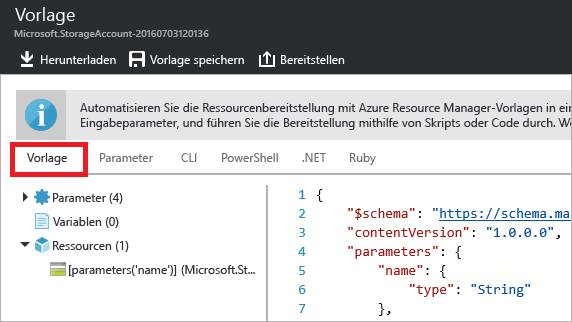
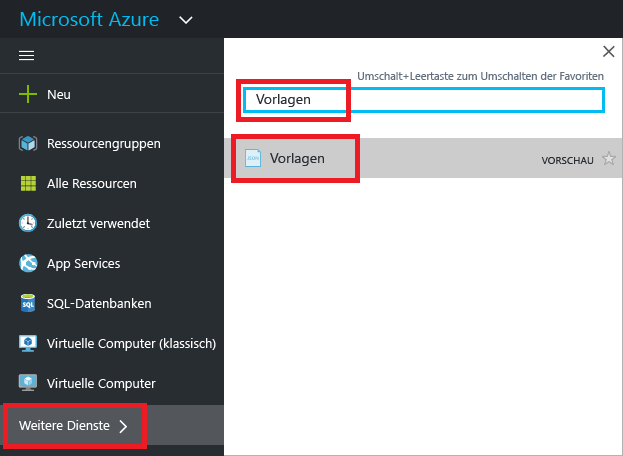
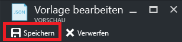

# <a name="export-an-azure-resource-manager-template-from-existing-resources"></a>Exportieren einer Azure Resource Manager-Vorlage aus vorhandenen Ressourcen
In diesem Artikel erfahren Sie, wie Sie eine Resource Manager-Vorlage aus vorhandenen Ressourcen in Ihrem Abonnement exportieren. Anhand dieser generierten Vorlage können Sie sich näher mit der Vorlagensyntax befassen.

Eine Vorlage kann auf zwei Arten exportiert werden:

* Sie können **die für die Bereitstellung verwendete Vorlage exportieren**. Die exportierte Vorlage enthält alle Parameter und Variablen so, wie sie in der Originalvorlage angezeigt wurden. Diese Methode empfiehlt sich, wenn Sie Ressourcen über das Portal bereitgestellt haben und sich die Vorlage für die Erstellung dieser Ressourcen ansehen möchten. Diese Vorlage kann direkt verwendet werden. 
* Sie können **eine generierte Vorlage exportieren, die den aktuellen Zustand der Ressourcengruppe darstellt**. Die exportierte Vorlage basiert nicht auf einer Vorlage, die Sie für die Bereitstellung verwendet haben. Stattdessen wird eine Vorlage erstellt, bei der es sich um eine Momentaufnahme der Ressourcengruppe handelt. Die exportierte Vorlage verfügt über viele hartcodierte Werte und vermutlich nicht über so viele Parameter, wie Sie sonst definieren. Diese Methode ist sinnvoll, wenn Sie die Ressourcengruppe seit der Bereitstellung geändert haben. Die Vorlage muss in der Regel angepasst werden, bevor sie verwendet werden kann.

In diesem Thema werden beide Methoden unter Verwendung des Portals beschrieben.

## <a name="deploy-resources"></a>Bereitstellen von Ressourcen
Zu Beginn stellen wir zunächst Ressourcen für Azure bereit, die Sie für den Export als Vorlage verwenden können. Falls Ihr Abonnement bereits eine Ressourcengruppe enthält, die Sie in eine Vorlage exportieren möchten, können Sie diesen Abschnitt überspringen. Im weiteren Verlauf dieses Artikels wird davon ausgegangen, dass Sie die Web-App und die SQL-Datenbanklösung aus diesem Abschnitt bereitgestellt haben. Bei Verwendung einer anderen Lösung unterscheidet sich das Verfahren möglicherweise geringfügig, die Schritte zum Exportieren einer Vorlage sind jedoch gleich. 

1. Wählen Sie im [Azure-Portal](https://portal.azure.com) die Option **Neu** aus.
   
      
2. Suchen Sie nach **Web-App und SQL**, und wählen Sie es in den verfügbaren Optionen aus.
   
      

3. Klicken Sie auf **Erstellen**.

      

4. Geben Sie die erforderlichen Werte für die Web-App und die SQL-Datenbank an. Klicken Sie auf **Erstellen**.

      

Die Bereitstellung kann etwas dauern. Nach Abschluss des Bereitstellungsvorgangs enthält das Abonnement die Lösung.

## <a name="view-template-from-deployment-history"></a>Anzeigen einer Vorlage aus dem Bereitstellungsverlauf
1. Navigieren Sie zum Blatt „Ressourcengruppe“ für die neue Ressourcengruppe. Beachten Sie, dass auf dem Blatt das Ergebnis der letzten Bereitstellung angezeigt wird. Wählen Sie diesen Link aus.
   
      
2. Der Verlauf der Bereitstellungen für die Gruppe wird angezeigt. In Ihrem Fall ist auf dem Blatt wahrscheinlich nur eine Bereitstellung aufgeführt. Wählen Sie diese Bereitstellung aus.
   
     
3. Auf dem Blatt wird eine Zusammenfassung der Bereitstellung angezeigt. Die Zusammenfassung enthält den Status der Bereitstellung und die dazugehörigen Vorgänge sowie die Werte, die Sie für die Parameter angegeben haben. Wählen Sie **Vorlage anzeigen**, um die Vorlage anzuzeigen, die Sie für die Bereitstellung verwendet haben.
   
     
4. Resource Manager ruft folgende sieben Dateien ab:
   
   1. **Vorlage** : Die Vorlage, mit der die Infrastruktur für Ihre Lösung definiert wird. Wenn Sie das Speicherkonto über das Portal erstellt haben, hat Resource Manager eine Vorlage für die Bereitstellung verwendet und die Vorlage zur späteren Verwendung gespeichert.
   2. **Parameter**: Eine Parameterdatei, die Sie zum Übergeben von Werten während der Bereitstellung verwenden können. Sie enthält die Werte, die Sie im Rahmen der ersten Bereitstellung angegeben haben. Diese Werte können Sie ändern, wenn Sie die Vorlage erneut bereitstellen.
   3. **CLI** : Eine Skriptdatei der Azure-Befehlszeilenschnittstelle, die Sie zum Bereitstellen der Vorlage verwenden können.
   3. **CLI 2.0:** Eine Skriptdatei der Azure-Befehlszeilenschnittstelle, die Sie zum Bereitstellen der Vorlage verwenden können.
   4. **PowerShell** : Eine Azure PowerShell-Skriptdatei, die Sie zum Bereitstellen der Vorlage verwenden können.
   5. **.NET** : Eine .NET-Klasse, die Sie zum Bereitstellen der Vorlage verwenden können.
   6. **Ruby** : Eine Ruby-Klasse, die Sie zum Bereitstellen der Vorlage verwenden können.
      
      Die Dateien sind über die Links im Blatt verfügbar. Standardmäßig wird die Vorlage auf dem Blatt angezeigt.
      
       
      
Dies ist die Vorlage, die zum Erstellen Ihrer Web-App und SQL-Datenbank verwendet wurde. Wie Sie sehen, enthält sie Parameter, mit denen Sie bei der Bereitstellung unterschiedliche Werte angeben können. Weitere Informationen zur Struktur einer Vorlage finden Sie unter [Erstellen von Azure Resource Manager-Vorlagen](resource-group-authoring-templates.md).

## <a name="export-the-template-from-resource-group"></a>Exportieren der Vorlage aus der Ressourcengruppe
Falls Sie Ihre Ressourcen manuell geändert oder Ressourcen in mehreren Bereitstellungen hinzugefügt haben, spiegelt eine aus dem Bereitstellungsverlauf abgerufene Vorlage nicht den aktuellen Zustand der Ressourcengruppe wider. In diesem Abschnitt erfahren Sie, wie Sie eine Vorlage exportieren, die den aktuellen Zustand der Ressourcengruppe widerspiegelt. 

> [!NOTE]
> Sie können keine Vorlage für eine Ressourcengruppe mit mehr als 200 Ressourcen exportieren.
> 
> 

1. Wählen Sie zum Anzeigen der Vorlage für eine Ressourcengruppe die Option **Automatisierungsskript**.
   
      
   
     Resource Manager wertet die Ressourcen in der Ressourcengruppe aus und generiert eine Vorlage für diese Ressourcen. Nicht alle Ressourcentypen unterstützen die Funktion zum Exportieren von Vorlagen. Möglicherweise wird ein Fehler mit dem Hinweis angezeigt, dass ein Problem mit dem Export vorliegt. Informationen zum Umgang mit diesen Problemen finden Sie im Abschnitt [Beheben von Exportproblemen](#fix-export-issues) .
2. Es werden wieder die sechs Dateien angezeigt, mit denen Sie die Lösung erneut bereitstellen können. Allerdings ist die Vorlage diesmal ein wenig anders. Wie Sie sehen, enthält die generierte Vorlage weniger Parameter als die Vorlage im vorherigen Abschnitt. Darüber hinaus sind in dieser Vorlage viele der Werte (etwa der Standort- und der SKU-Wert) hartcodiert und akzeptieren keinen Parameterwert. Vor der Wiederverwendung dieser Vorlage empfiehlt es sich unter Umständen, die Vorlage zu bearbeiten, um die Parameterverwendung zu optimieren. 
   
3. Die Arbeit mit dieser Vorlage kann auf unterschiedliche Weise fortgesetzt werden: Sie können die Vorlage herunterladen und lokal mit einem JSON-Editor bearbeiten. Alternativ können Sie die Vorlage in Ihrer Bibliothek speichern und über das Portal bearbeiten.
   
     Wenn Sie mit einem JSON-Editor wie [VS Code](https://code.visualstudio.com/) oder [Visual Studio](vs-azure-tools-resource-groups-deployment-projects-create-deploy.md) vertraut sind, möchten Sie die Vorlage unter Umständen lieber herunterladen und den vertrauten Editor verwenden. Wählen Sie für die lokale Variante die Option **Herunterladen** aus.
   
      
   
     Falls Sie über keinen JSON-Editor verfügen, bearbeiten Sie die Vorlage wahrscheinlich lieber über das Portal. In weiteren Verlauf dieses Themas wird davon ausgegangen, dass Sie die Vorlage in Ihrer Bibliothek im Portal gespeichert haben. Für die Vorlage müssen jedoch in beiden Fällen (also sowohl bei der lokalen Bearbeitung mit einem JSON-Editor als auch bei der Bearbeitung über das Portal) die gleichen Syntaxänderungen vorgenommen werden. Wenn Sie über das Portal arbeiten möchten, wählen Sie **Zur Bibliothek hinzufügen** aus.
   
      
   
     Geben Sie einen Namen und eine Beschreibung für die Vorlage an, wenn Sie sie der Bibliothek hinzufügen. Wählen Sie anschließend **Speichern** aus.
   
     
4. Wenn Sie eine in der Bibliothek gespeicherte Vorlage anzeigen möchten, wählen Sie **Weitere Dienste** aus, geben Sie **Vorlagen** ein, um die Ergebnisse zu filtern, und wählen Sie **Vorlagen** aus.
   
      
5. Wählen Sie die Vorlage mit dem von Ihnen gespeicherten Namen aus.
   
      

## <a name="customize-the-template"></a>Anpassen der Vorlage
Die exportierte Vorlage eignet sich bestens, wenn Sie für jede Bereitstellung die gleiche Web-App und die gleiche SQL-Datenbank erstellen möchten. Mit den in Resource Manager verfügbaren Optionen können Vorlagen jedoch erheblich flexibler bereitgestellt werden. In diesem Artikel erfahren Sie, wie Sie Parameter für Name und Kennwort des Datenbankadministrators hinzufügen. Mit der gleichen Vorgehensweise können Sie auch andere Werte in der Vorlage flexibler gestalten.

1. Wählen Sie **Bearbeiten** aus, um die Vorlage anzupassen.
   
     
2. Wählen Sie die Vorlage aus.
   
     
3. Fügen Sie dem Abschnitt **parameters** in der Vorlage die beiden folgenden Parameter hinzu, um die Übergabe der Werte zu ermöglichen, die Sie ggf. bei der Bereitstellung angeben möchten:

   ```json
   "administratorLogin": {
       "type": "String"
   },
   "administratorLoginPassword": {
       "type": "SecureString"
   },
   ```

4. Ersetzen Sie im Abschnitt **resources** die SQL Server-Definition, um die neuen Parameter zu verwenden. Wie Sie sehen, werden für **administratorLogin** und **administratorLoginPassword** nun Parameterwerte verwendet.

   ```json
   {
       "comments": "Generalized from resource: '/subscriptions/{subscription-id}/resourceGroups/exportsite/providers/Microsoft.Sql/servers/tfserverexport'.",
       "type": "Microsoft.Sql/servers",
       "kind": "v12.0",
       "name": "[parameters('servers_tfserverexport_name')]",
       "apiVersion": "2014-04-01-preview",
       "location": "South Central US",
       "scale": null,
       "properties": {
           "administratorLogin": "[parameters('administratorLogin')]",
           "administratorLoginPassword": "[parameters('administratorLoginPassword')]",
           "version": "12.0"
       },
       "dependsOn": []
   },
   ```

6. Wählen Sie **OK** aus, wenn Sie mit der Bearbeitung der Vorlage fertig sind.
7. Wählen Sie **Speichern** aus, um die Änderungen an der Vorlage zu speichern.
   
     
8. Wählen Sie **Bereitstellen** aus, um die aktualisierte Vorlage bereitzustellen.
   
     
9. Geben Sie Parameterwerte an, und wählen Sie eine Ressourcengruppe für die Bereitstellung der Ressourcen aus.


## <a name="fix-export-issues"></a>Beheben von Exportproblemen
Nicht alle Ressourcentypen unterstützen die Funktion zum Exportieren von Vorlagen. Beheben Sie dieses Problem, indem Sie die fehlenden Ressourcen der Vorlage manuell erneut hinzufügen. Die Fehlermeldung enthält die Ressourcentypen, die nicht exportiert werden können. Suchen Sie den entsprechenden Ressourcentyp in der [Vorlagenreferenz](/azure/templates/). Informationen zum manuellen Hinzufügen eines virtuellen Netzwerkgateways finden Sie beispielsweise unter [Microsoft.Network/virtualNetworkGateways template reference](/azure/templates/microsoft.network/virtualnetworkgateways) (Microsoft.Network/virtualNetworkGateways – Vorlagenreferenz).

> [!NOTE]
> Exportprobleme treten nur dann auf, wenn Sie aus einer Ressourcengruppe exportieren, anstatt aus Ihrem Bereitstellungsverlauf. Falls die letzte Bereitstellung genau den aktuellen Status der Ressourcengruppe widerspiegelt, sollten Sie die Vorlage nicht aus der Ressourcengruppe, sondern aus dem Bereitstellungsverlauf exportieren. Führen Sie den Export aus einer Ressourcengruppe nur dann durch, wenn Sie Änderungen an der Ressourcengruppe vorgenommen haben, die in einer einzelnen Vorlage nicht definiert sind.
> 
> 

## <a name="next-steps"></a>Nächste Schritte
Sie haben gelernt, wie Sie eine Vorlage aus Ressourcen exportieren, die Sie im Portal erstellt haben.

* Eine Vorlage kann mithilfe von [PowerShell](resource-group-template-deploy.md), mit der [Azure-Befehlszeilenschnittstelle](resource-group-template-deploy-cli.md) oder per [REST-API](resource-group-template-deploy-rest.md) bereitgestellt werden.
* Informationen zum Exportieren einer Vorlage mithilfe von PowerShell finden Sie unter [Verwenden von Windows PowerShell mit Azure Resource Manager](powershell-azure-resource-manager.md).
* Informationen zum Exportieren einer Vorlage mithilfe der Azure-Befehlszeilenschnittstelle finden Sie unter [Verwalten von Azure-Ressourcen und -Ressourcengruppen mithilfe der Azure-Befehlszeilenschnittstelle](xplat-cli-azure-resource-manager.md).


