# Erstellen und Bereitstellen von Azure-Ressourcengruppen mit Visual Studio
Mit Visual Studio und dem [Azure SDK](https://azure.microsoft.com/downloads/) können Sie ein Projekt erstellen, das Ihre Infrastruktur und Ihren Code in Azure bereitstellt. Sie können z. B. den Webhost, die Website und die Datenbank für Ihre App definieren und diese Infrastruktur zusammen mit dem Code bereitstellen. Oder Sie können einen virtuellen Computer, ein virtuelles Netzwerk und ein Speicherkonto definieren und diese Infrastruktur zusammen mit einem Skript, das auf dem virtuellen Computer ausgeführt wird, bereitstellen. Das Bereitstellungsprojekt für die **Azure-Ressourcengruppe** ermöglicht die Bereitstellung aller erforderlichen Ressourcen in einem einzigen, wiederholbaren Vorgang. Weitere Informationen zum Bereitstellen und Verwalten von Ressourcengruppen finden Sie unter [Azure Resource Manager – Übersicht](resource-group-overview.md).

Azure-Ressourcengruppenprojekte enthalten Azure Resource Manager-JSON-Vorlagen, die die für Azure bereitgestellten Ressourcen definieren. Weitere Informationen über die Elemente von Ressourcen-Manager-Vorlagen finden Sie unter [Erstellen von Azure-Ressourcen-Manager-Vorlagen](resource-group-authoring-templates.md). Visual Studio ermöglicht das Bearbeiten dieser Vorlagen und bietet Tools, die das Arbeiten mit Vorlagen vereinfachen.

In diesem Thema stellen Sie eine Web-App und SQL-Datenbank bereit. Die Schritte sind jedoch für jeden Ressourcentyp nahezu identisch. Genauso einfach können Sie einen virtuellen Computer und die dazugehörigen Ressourcen bereitstellen. Visual Studio bietet viele verschiedene Starter-Vorlagen für die Bereitstellung gängiger Szenarien.

Im diesem Artikel werden Visual Studio 2015 Update 2 und Microsoft Azure SDK für .NET 2.9 verwendet. Bei Verwendung von Visual Studio 2013 mit Azure SDK 2.9 ist der Ablauf größtenteils identisch. Sie können ein Azure SDK ab Version 2.6 verwenden. Die Benutzeroberfläche kann sich dann aber von der Benutzeroberfläche in diesem Artikel unterscheiden. Es wird dringend empfohlen, die neueste Version des [Azure SDK](https://azure.microsoft.com/downloads/) zu installieren, bevor Sie mit der Ausführung der Schritte beginnen. 

## Erstellen eines Azure-Ressourcengruppenprojekts
In diesem Verfahren erstellen Sie ein Azure-Ressourcengruppenprojekt mit einer Vorlage vom Typ **Web-App und SQL** .

1. Wählen Sie in Visual Studio **Datei**, **Neues Projekt** und anschließend **C#** oder **Visual Basic** aus. Wählen Sie dann **Cloud** und anschließend das Projekt **Azure-Ressourcengruppe** aus.
   
    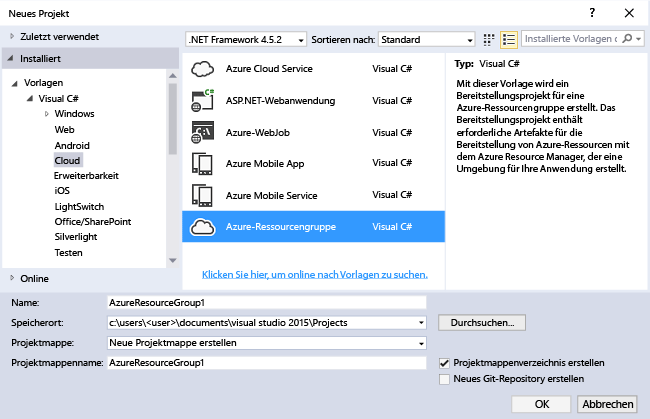
2. Wählen Sie die Vorlage aus, die Sie im Azure-Ressourcen-Manager bereitstellen möchten. Je nach Art des bereitzustellenden Projekts stehen Ihnen viele verschiedene Optionen zur Verfügung. In diesem Thema wählen wir die Vorlage **Web-App und SQL** aus.
   
    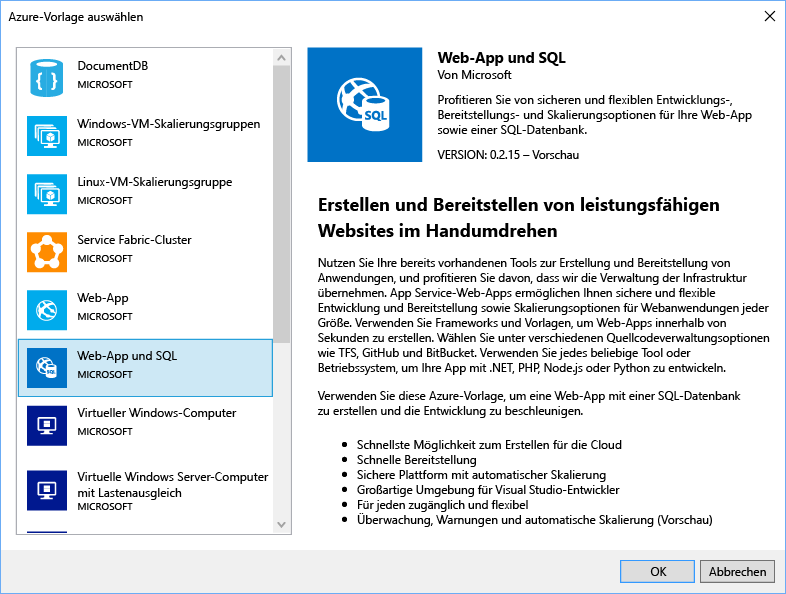
   
    Die Vorlage, die Sie auswählen, ist lediglich der Ausgangspunkt. Sie können Ressourcen hinzufügen und entfernen, um Ihr Szenario auszuführen.
   
   > [!NOTE]
   > Visual Studio ruft online eine Liste mit verfügbaren Vorlagen ab. Die Liste kann sich ändern.
   > 
   > 
   
    Visual Studio erstellt ein Ressourcengruppen-Bereitstellungsprojekt für eine Web-App und SQL-Datenbank.
3. Erweitern Sie die Knoten im Bereitstellungsprojekt, um zu ermitteln, was erstellt wurde.
   
    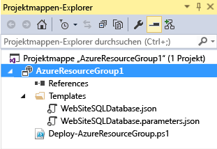
   
    Da wir für dieses Beispiel die Vorlage „Web-App und SQL“ gewählt haben, werden die folgenden Dateien angezeigt: 
   
   | Dateiname | Beschreibung |
   | --- | --- |
   | Deploy-AzureResourceGroup.ps1 |Ein PowerShell-Skript, das PowerShell-Befehle für die Bereitstellung im Azure-Ressourcen-Manager aufruft. **Hinweis** Dieses PowerShell-Skript wird von Visual Studio zum Bereitstellen Ihrer Vorlage verwendet. Alle Änderungen, die Sie an diesem Skript vornehmen, haben Auswirkungen auf die Bereitstellung in Visual Studio. Es ist also Vorsicht geboten. |
   | WebSiteSQLDatabase.json |Die Resource Manager-Vorlage, die sowohl die für Azure bereitzustellende Infrastruktur als auch die Parameter definiert, die Sie bei der Bereitstellung angeben können. Sie definiert auch die Abhängigkeiten zwischen Ressourcen, damit sie von Resource Manager in der richtigen Reihenfolge bereitgestellt werden. |
   | WebSiteSQLDatabase.parameters.json |Eine Parameterdatei, die Werte enthält, die für die Vorlage erforderlich sind. Parameterwerte werden zum Anpassen der einzelnen Bereitstellungen übergeben. |
   
    Alle Ressourcengruppen-Bereitstellungsprojekte enthalten diese grundlegenden Dateien. Andere Projekte enthalten möglicherweise zusätzliche Dateien zur Unterstützung weiterer Funktionen.

## Anpassen der Ressourcen-Manager-Vorlage
Sie können ein Bereitstellungsprojekt anpassen, indem Sie die JSON-Vorlagen bearbeiten, in denen bereitzustellenden Ressourcen beschrieben werden. JSON ist die Kurzform von "JavaScript Object Notation". Es handelt sich um ein serialisiertes Datenformat, das einfach zu verwenden ist. Die JSON-Dateien verwenden ein Schema, auf das Sie am Anfang jeder Datei verweisen. Sie können das Schema herunterladen und analysieren, um es besser zu verstehen. Das Schema definiert die zulässigen Elemente und legt die Arten und Formate von Feldern, die möglichen Werte aufgezählter Werte und Ähnliches fest. Weitere Informationen über die Elemente von Ressourcen-Manager-Vorlagen finden Sie unter [Erstellen von Azure-Ressourcen-Manager-Vorlagen](resource-group-authoring-templates.md).

Öffnen Sie **WebSiteSQLDatabase.json**, um die Vorlage zu bearbeiten.

Der Visual Studio-Editor bietet Tools, die das Bearbeiten der Resource Manager-Vorlage erleichtern. Die in der Vorlage definierten Elemente werden gut sichtbar im Fenster **JSON-Gliederung** angezeigt.

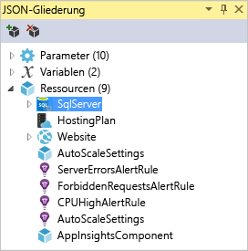

Wenn Sie eines der Elemente in der Gliederung auswählen, gelangen Sie zu diesem Teil der Vorlage und die entsprechende JSON wird hervorgehoben.

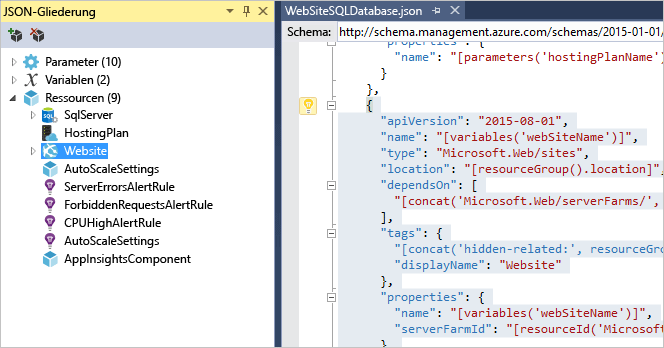

Sie können eine Ressource hinzufügen, indem Sie entweder die Schaltfläche **Ressource hinzufügen** am oberen Rand der JSON-Gliederung auswählen oder mit der rechten Maustaste auf **Ressourcen** und anschließend auf **Neue Ressource hinzufügen** klicken.

Wählen Sie für dieses Tutorial die Option **Speicherkonto** aus, und vergeben Sie einen Namen. Geben Sie einen Namen mit maximal elf Zeichen ein, der nur Zahlen und Kleinbuchstaben enthält.

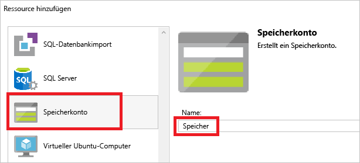

Beachten Sie, dass nicht nur die Ressource hinzugefügt wurde, sondern auch ein Parameter für das Typenspeicherkonto sowie eine Variable für den Namen des Speicherkontos.

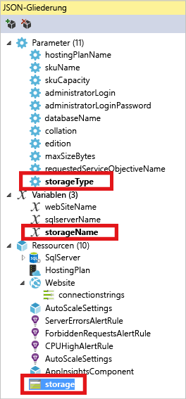

Der Parameter **storageType** ist mit zulässigen Typen und einem Standardtyp vordefiniert. Diese Werte können Sie so beibehalten oder für Ihr Szenario bearbeiten. Wenn Sie verhindern möchten, dass über diese Vorlage ein **Premium_LRS**-Speicherkonto bereitgestellt wird, entfernen Sie es aus den zulässigen Typen. 

    "storageType": {
      "type": "string",
      "defaultValue": "Standard_LRS",
      "allowedValues": [
        "Standard_LRS",
        "Standard_ZRS",
        "Standard_GRS",
        "Standard_RAGRS"
      ]
    }

Visual Studio bietet auch Intellisense, damit Sie besser sehen, welche Eigenschaften beim Bearbeiten der Vorlage verfügbar sind. Wenn Sie beispielsweise die Eigenschaften für Ihren App Service-Plan bearbeiten möchten, navigieren Sie zur Ressource **HostingPlan**, und fügen Sie einen Wert für die Eigenschaften (**properties**) hinzu. Intellisense zeigt daraufhin die verfügbaren Werte sowie eine Beschreibung des Werts an.

Sie können **numberOfWorkers** auf „1“ festlegen.

    "properties": {
      "name": "[parameters('hostingPlanName')]",
      "numberOfWorkers": 1
    }

## Bereitstellen des Ressourcengruppen-Projekts in Azure
Sie können das Projekt jetzt bereitstellen. Wenn Sie ein Azure-Ressourcengruppenprojekt bereitstellen, stellen Sie es für eine Azure-Ressourcengruppe bereit. Die Ressourcengruppe ist eine logische Gruppierung von Ressourcen mit einem gemeinsamen Lebenszyklus.

1. Wählen Sie im Kontextmenü des Bereitstellungsprojektknotens **Bereitstellen** > **New Bereitstellenment**.
   
    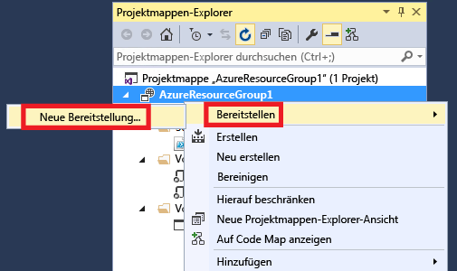
   
    Das Dialogfeld **Für Ressourcengruppe bereitstellen** wird angezeigt.
   
    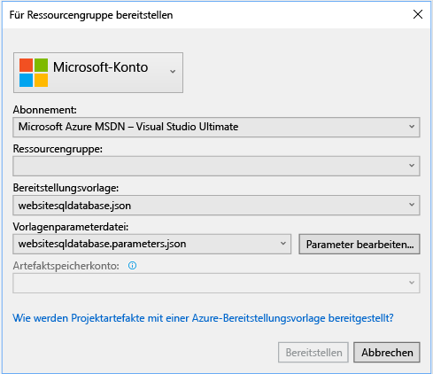
2. Wählen Sie im Dropdownfeld **Ressourcengruppe** eine vorhandene Ressourcengruppe aus, oder erstellen Sie eine neue. Öffnen Sie zum Erstellen einer Ressourcengruppe das Dropdownfeld **Ressourcengruppe**, und wählen Sie **Neu erstellen** aus.
   
    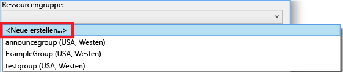
   
    Das Dialogfeld **Ressourcengruppe erstellen** wird angezeigt. Vergeben Sie einen Namen und Speicherort für die Gruppe, und betätigen Sie die Schaltfläche **Erstellen** .
   
    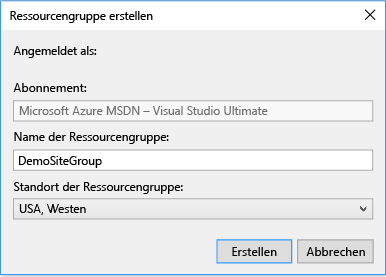
3. Bearbeiten Sie die Parameter für die Bereitstellung, indem Sie die Schaltfläche **Parameter bearbeiten** wählen.
   
    
4. Geben Sie Werte für die leeren Parameter ein, und wählen Sie die Schaltfläche **Speichern** . Die leeren Parameter lauten **hostingPlanName**, **administratorLogin**, **administratorLoginPassword** und **databaseName**.
   
    **hostingPlanName** wird ein Name für den zu erstellenden [App Service-Plan](../app-service/azure-web-sites-web-hosting-plans-in-depth-overview.md) angegeben. 
   
    **administratorLogin** wird der Benutzername für den SQL Server-Administrator angegeben. Verwenden Sie keine gängigen Administratornamen wie **sa** oder **admin**. 
   
    Mit **administratorLoginPassword** wird ein Kennwort für den SQL Server-Administrator angegeben. Die Option **Kennwörter als Nur-Text in der Parameterdatei speichern** ist nicht sicher. Aktivieren Sie diese Option daher nicht. Da das Kennwort nicht als Klartext gespeichert wird, müssen Sie es während der Bereitstellung erneut angeben. 
   
    **databaseName** wird ein Name für die zu erstellende Datenbank angegeben. 
   
    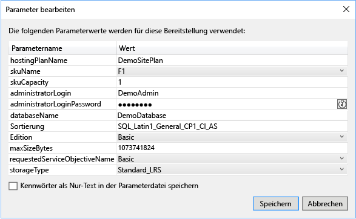
5. Wählen Sie die Schaltfläche **Bereitstellen** aus, um das Projekt in Azure bereitzustellen. Eine PowerShell-Konsole wird außerhalb der Visual Studio-Instanz geöffnet. Geben Sie das SQL Server-Administratorkennwort in der PowerShell-Konsole ein, wenn Sie dazu aufgefordert werden. **Unter Umständen ist die PowerShell-Konsole hinter anderen Elementen angeordnet oder in der Taskleiste minimiert.**  Suchen Sie nach der Konsole, und wählen Sie sie aus, um das Kennwort anzugeben.
   
   > [!NOTE]
   > Visual Studio fordert Sie unter Umständen zur Installation der die Azure PowerShell-Cmdlets auf. Die Azure PowerShell-Cmdlets werden zur erfolgreichen Bereitstellung von Ressourcengruppen benötigt. Führen Sie die Installation durch, wenn Sie dazu aufgefordert werden.
   > 
   > 
6. Die Bereitstellung kann mehrere Minuten dauern. Im Fenster **Ausgabe** wird der Status der Bereitstellung angezeigt. Nachdem die Bereitstellung abgeschlossen ist, wird die letzte Meldung mit dem Hinweis angezeigt, dass die Bereitstellung erfolgreich war. Sie sieht in etwa wie folgt aus:
   
        ... 
        18:00:58 - Successfully deployed template 'c:\users\user\documents\visual studio 2015\projects\azureresourcegroup1\azureresourcegroup1\templates\websitesqldatabase.json' to resource group 'DemoSiteGroup'.
7. Öffnen Sie in einem Browser das [Azure-Portal](https://portal.azure.com/) , und melden Sie sich an Ihrem Konto an. Wählen Sie zum Anzeigen der Ressourcengruppe die Option **Ressourcengruppen** sowie die bereitgestellte Ressourcengruppe aus.
   
    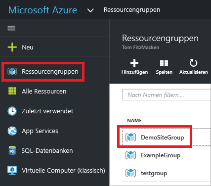
8. Alle bereitgestellten Ressourcen werden angezeigt. Beachten Sie, dass der Name des Speicherkontos nicht genau wie der Name lautet, den Sie beim Hinzufügen der Ressource angegeben haben. Das Speicherkonto muss eindeutig sein. Die Vorlage fügt automatisch eine Zeichenfolge an den von Ihnen angegebenen Namen an, damit die Eindeutigkeit sichergestellt ist. 
   
    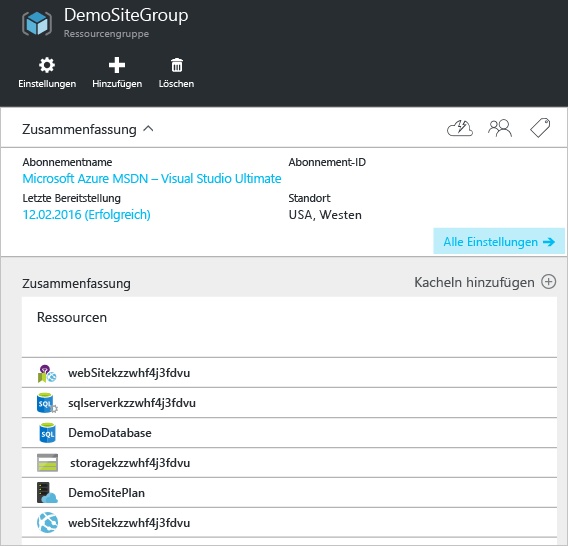
9. Wenn Sie Änderungen vorgenommen haben und das Projekt erneut bereitstellen möchten, wählen Sie über das Kontextmenü des Azure-Ressourcengruppenprojekts die vorhandene Ressourcengruppe aus. Wählen Sie im Kontextmenü die Option **Bereitstellen**und dann die bereitgestellte Ressourcengruppe aus.
   
    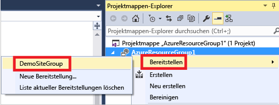

## Bereitstellen von Code mit Ihrer Infrastruktur
Jetzt haben Sie die Infrastruktur für Ihre App bereitgestellt, im Projekt ist jedoch kein Code bereitgestellt. In diesem Thema wird veranschaulicht, wie Sie während der Bereitstellung eine Web-App sowie SQL-Datenbanktabellen bereitstellen können. Wenn Sie anstelle einer Web-App eine virtuelle Maschine bereitstellen, müssen Sie bei der Bereitstellung Code auf der Maschine ausführen. Der Prozess für die Bereitstellung von Code für eine Web-App oder für das Einrichten einer virtuellen Maschine ist fast identisch.

1. Fügen Sie Ihrer Visual Studio-Projektmappe ein Projekt hinzu: Klicken Sie mit der rechten Maustaste auf die Projektmappe, und wählen Sie **Hinzufügen** > **Neues Projekt** aus.
   
    
2. Fügen Sie eine **ASP.NET-Webanwendung**hinzu. 
   
    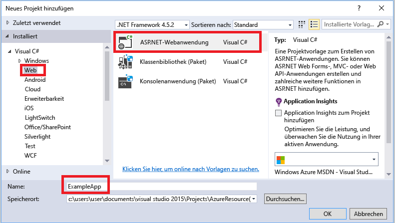
3. Wählen Sie **MVC** aus, und deaktivieren Sie das Kontrollkästchen **In der Cloud hosten**, da diese Aufgabe vom Ressourcengruppenprojekt ausgeführt wird.
   
    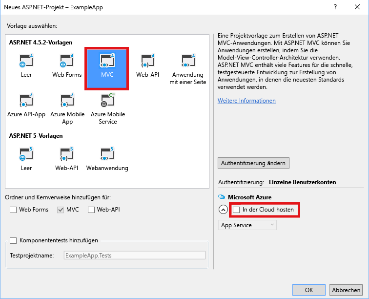
4. Nachdem die Web-App in Visual Studio erstellt wurde, werden beide Projekte in der Projektmappe angezeigt.
   
    
5. Nun müssen Sie sicherstellen, dass Ihr Ressourcengruppenprojekt über das neue Projekt informiert ist. Wechseln Sie zurück zu Ihrem Ressourcengruppenprojekt (AzureResourceGroup1). Klicken Sie mit der rechten Maustaste auf **Verweise**, und wählen Sie **Verweis hinzufügen**.
   
    
6. Wählen Sie das Web-App-Projekt aus, das Sie erstellt haben.
   
    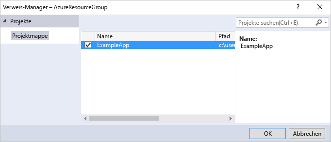
   
    Durch Hinzufügen eines Verweises verknüpfen Sie das Web-App-Projekt mit dem Ressourcengruppenprojekt und legen automatisch drei Schlüsseleigenschaften fest. Die Eigenschaften werden im Fenster **Eigenschaften** für den Verweis angezeigt.
   
      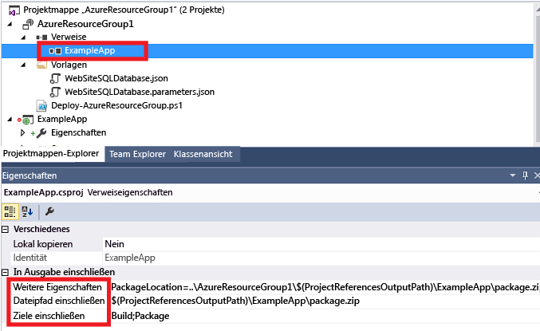
   
    Die Eigenschaften sind:
   
   * **Zusätzliche Eigenschaften** enthält den Stagingspeicherort für das Webbereitstellungspaket, der mittels Pushvorgang an Azure Storage übertragen wird. Beachten Sie den Ordner (ExampleApp) und die Datei (package.zip). Sie müssen diese Werte kennen, da Sie sie als Parameter angeben, wenn Sie die App bereitstellen. 
   * **Dateipfad einbeziehen** enthält den Pfad, unter dem das Paket erstellt wird. **Ziele einbeziehen** enthält den Befehl, der von der Bereitstellung ausgeführt wird. 
   * Der Standardwert **Build;Package** ermöglicht der Bereitstellung das Erstellen eines Webbereitstellungspakets (package.zip).  
     
     Ein Veröffentlichungsprofil ist nicht erforderlich, da die Bereitstellung die erforderlichen Informationen aus den Eigenschaften zum Erstellen des Pakets bezieht.
7. Fügen Sie der Vorlage eine Ressource hinzu.
   
    
8. Wählen Sie nun **Web Deploy für Web Apps**aus. 
   
    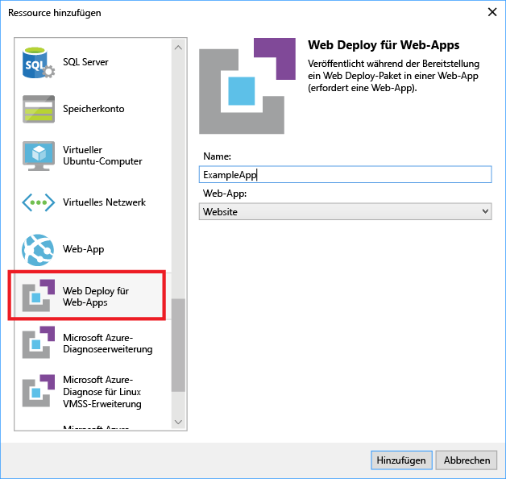
9. Stellen Sie das Ressourcengruppenprojekt für die Ressourcengruppe erneut bereit. Diesmal sind einige neue Parameter enthalten. Die Werte für **_artifactsLocation** oder **_artifactsLocationSasToken** werden von Visual Studio automatisch generiert und müssen daher nicht angegeben werden. Sie müssen den Ordner- und Dateinamen aber auf den Pfad festlegen, unter dem das Bereitstellungspaket vorhanden ist (**ExampleAppPackageFolder** und **ExampleAppPackageFileName** in der folgenden Abbildung). Geben Sie die Werte an, die zuvor in den Verweiseigenschaften angezeigt wurden (**ExampleApp** und **package.zip**).
   
    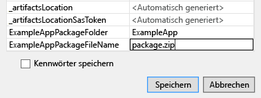
   
    Wählen Sie für **Artefaktspeicherkonto**die mit dieser Ressourcengruppe bereitgestellte Option aus.
10. Wählen Sie Ihre Web-App im Portal aus, nachdem die Bereitstellung abgeschlossen ist. Wählen Sie die URL zum Navigieren zur Website aus.
    
     
11. Sie können sehen, dass Sie die ASP.NET-Standard-App erfolgreich bereitgestellt haben.
    
     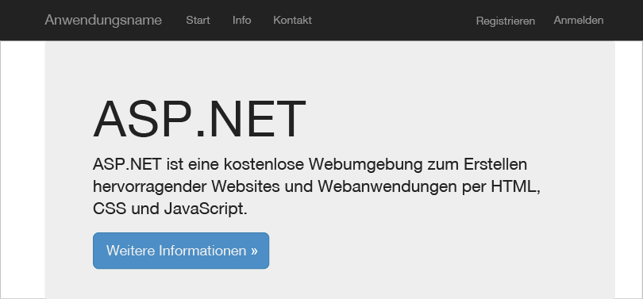

## Nächste Schritte
* Informationen zur Ressourcenverwaltung über das Portal finden Sie unter [Verwenden des Azure-Portals zum Verwalten Ihrer Azure-Ressourcen](resource-group-portal.md).
* Weitere Informationen zu Vorlagen finden Sie unter [Erstellen von Azure Resource Manager-Vorlagen](resource-group-authoring-templates.md).

<!--HONumber=Dec16_HO3-->

