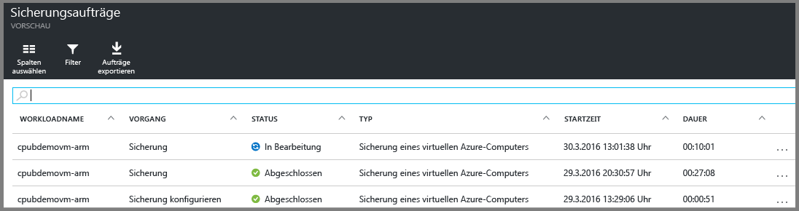

<properties
	pageTitle="Sichern von virtuellen Azure-Computern in einem Recovery Services-Tresor | Microsoft Azure"
	description="Ermitteln, registrieren und sichern Sie Ihre virtuellen Azure-Computer mithilfe dieser Verfahren für das Sichern virtueller Azure-Computer in einem Recovery Services-Tresor."
	services="backup"
	documentationCenter=""
	authors="markgalioto"
	manager="cfreeman"
	editor=""
	keywords="Sicherung virtueller Computer; Sichern virtueller Computer; Sicherung und Notfallwiederherstellung; ARM-VM-Sicherung"/>

<tags
	ms.service="backup"
	ms.workload="storage-backup-recovery"
	ms.tgt_pltfrm="na"
	ms.devlang="na"
	ms.topic="article"
	ms.date="07/29/2016"
	ms.author="trinadhk; jimpark; markgal;"/>

# Sichern von virtuellen Azure-Computern in einem Recovery Services-Tresor

> [AZURE.SELECTOR]
- [Sichern virtueller Azure Resource Manager-Computer (ARM)](backup-azure-arm-vms.md)
- [Sichern von virtuellen Azure-Computern](backup-azure-vms.md)

Dieser Artikel beschreibt das Verfahren zum Sichern virtueller (mit Resource Manager oder dem klassischen Modell bereitgestellten) Azure-Computer in einem Recovery Services-Tresor. Der größte Teil des Arbeitsaufwands zum Sichern virtueller Computer entfällt auf die Vorbereitung. Bevor Sie einen virtuellen Computer sichern oder schützen können, müssen Sie die [Voraussetzungen](backup-azure-arm-vms-prepare.md) zum Vorbereiten der Umgebung auf den Schutz Ihrer VMs schaffen. Wenn Sie die Voraussetzungen geschaffen haben, können Sie den Sicherungsvorgang starten, um Momentaufnahmen Ihres virtuellen Computers zu erstellen.

>[AZURE.NOTE] Azure verfügt über zwei Bereitstellungsmodelle zum Erstellen und Verwenden von Ressourcen: [Resource Manager-Modell und klassisches Modell](../resource-manager-deployment-model.md). Sie können mit Resource Manager bereitgestellte und klassische virtuelle Computer mit Recovery Services-Tresoren schützen. Unter [Sichern von virtuellen Azure-Computern](backup-azure-vms.md) finden Sie ausführliche Informationen zum Arbeiten mit VMs, die mit dem klassischen Bereitstellungsmodell bereitgestellt wurden.

Weitere Informationen finden Sie in den Artikeln [Planen der Sicherungsinfrastruktur für virtuelle Computer in Azure](backup-azure-vms-introduction.md) und [Dokumentation zu Virtual Machines](https://azure.microsoft.com/documentation/services/virtual-machines/).

## Auslösen des Sicherungsauftrags

Die Sicherungsrichtlinie des Recovery Services-Tresors definiert, wie oft und wann der Sicherungsvorgang ausgeführt wird. Standardmäßig ist die erste geplante Sicherung die Anfangssicherung. Bis zur Durchführung der ersten Sicherung wird der Status der letzten Sicherung auf dem Blatt **Sicherungsaufträge** als **Warnung (anfängliche Sicherung steht aus)** angezeigt.

Falls die erste Sicherung nicht ohnehin in Kürze ausgeführt wird, empfiehlt es sich, **Jetzt sichern** auszuführen. Das folgende Verfahren startet das Tresordashboard. Dieses Verfahren dient zur Ausführung des ersten Sicherungsauftrags, nachdem Sie alle erforderlichen Voraussetzungen geschaffen haben. Wenn der erste Sicherungsauftrag bereits ausgeführt wurde, ist dieses Verfahren nicht verfügbar. Die zugeordnete Sicherungsrichtlinie bestimmt den nächsten Sicherungsauftrag.

So führen Sie den ersten Sicherungsauftrag aus:

1. Klicken Sie im Tresordashboard auf der Kachel **Sicherung** auf **Virtuelle Azure-Computer**.   

    Das Blatt **Sicherungselemente** wird geöffnet.

2. Klicken Sie auf dem Blatt **Sicherungselemente** mit der rechten Maustaste auf den Tresor, den Sie sichern möchten, und klicken Sie dann auf **Jetzt sichern**.

    

    Der Sicherungsauftrag wird ausgelöst.  

    

3. Klicken Sie im Tresordashboard auf der Kachel **Sicherungsaufträge** auf **Virtuelle Azure-Computer**, um zu prüfen, ob die erste Sicherung abgeschlossen wurde.

    

    Das Blatt „Sicherungsaufträge“ wird geöffnet.

4. Im Blatt **Sicherungsaufträge** wird der Status aller Aufträge angezeigt.

    

    >[AZURE.NOTE] Als Teil des Sicherungsvorgangs gibt der Azure Backup-Dienst einen Befehl an die Sicherungserweiterung auf jedem virtuellen Computer aus, damit alle Schreibvorgänge geleert werden und eine konsistente Momentaufnahme erstellt wird.

    Wenn der Sicherungsauftrag abgeschlossen ist, lautet der Status *Abgeschlossen*.

## Problembehandlung
Wenn beim Sichern des virtuellen Computers Probleme auftreten, finden Sie Hilfe im Artikel [Problembehandlung bei der Sicherung virtueller Azure-Computer](backup-azure-vms-troubleshoot.md).

## Nächste Schritte

Da Sie nun Ihren virtuellen Computer geschützt haben, informieren Sie sich in den folgenden Artikeln über weitere Verwaltungsaufgaben, die Sie für Ihre VMs ausführen können, und wie Sie VMs wiederherstellen können.

- [Verwalten und Überwachen Ihrer virtuellen Computer](backup-azure-manage-vms.md)
- [Wiederherstellen virtueller Computer](backup-azure-arm-restore-vms.md)

<!---HONumber=AcomDC_0803_2016-->