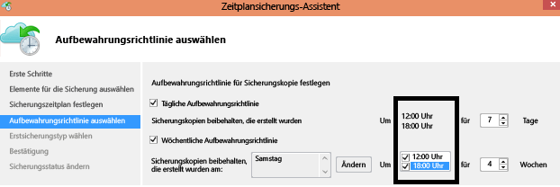

# <a name="azure-backup-service--faq"></a>Azure Backup-Dienst – FAQ
Dieser Artikel enthält eine Liste mit häufig gestellten Fragen (und den dazugehörigen Antworten) zum Azure Backup-Dienst. In unserer Community erhalten Sie schnell eine Antwort, und wenn eine Frage häufig gestellt wird, fügen wir sie diesem Artikel hinzu. Die Antworten auf Fragen enthalten in der Regel Referenz- bzw. Supportinformationen. Sie können im Disqus-Abschnitt dieses Artikels oder eines verwandten Artikels Fragen zu Azure Backup stellen. Außerdem können Sie Fragen zum Azure Backup-Dienst im [Diskussionsforum](https://social.msdn.microsoft.com/forums/azure/home?forum=windowsazureonlinebackup)stellen.

## <a name="what-is-the-list-of-supported-operating-systems-from-which-i-can-back-up-to-azure-using-azure-backup-br"></a>Welche Betriebssysteme werden für die Sicherung in Azure mithilfe von Azure Backup unterstützt? <br/>
Azure Backup unterstützt die folgenden Betriebssysteme für die Sicherung von: Dateien und Ordner und Workloadanwendungen, die mithilfe von Azure Backup Server und SCDPM geschützt werden.

| Betriebssystem | Plattform | SKU |
|:--- | --- |:--- |
| Windows 8 und die neuesten SPs |64-Bit |Enterprise, Pro |
| Windows 7 und die neuesten SPs |64-Bit |Ultimate, Enterprise, Professional, Home Premium, Home Basic, Starter |
| Windows 8.1 und die neuesten SPs |64-Bit |Enterprise, Pro |
| Windows 10 |64-Bit |Enterprise, Pro, Home |
| Windows Server 2012 R2 und die neuesten SPs |64-Bit |Standard, Datacenter, Foundation |
| Windows Server 2012 und die neuesten SPs |64-Bit |Datacenter, Foundation, Standard |
| Windows Storage Server 2012 R2 und die neuesten SPs |64-Bit |Standard, Workgroup |
| Windows Storage Server 2012 und neuesten SPs |64-Bit |Standard, Workgroup |
| Windows Server 2012 R2 und die neuesten SPs |64-Bit |Essential |
| Windows Server 2008 R2 SP1 |64-Bit |Standard, Enterprise, Datacenter, Foundation |
| Windows Server 2008 SP2 |64-Bit |Standard, Enterprise, Datacenter, Foundation |

Für Azure-VM-Sicherung,

* **Linux**: Azure Backup unterstützt eine [Liste von Verteilungen, die von Azure unterstützt werden](../virtual-machines/virtual-machines-linux-endorsed-distros.md). Ausnahme: CoreOS Linux.  Andere Bring-Your-Own-Linux-Verteilungen sollten ebenfalls funktionieren, sofern der VM-Agent auf dem virtuellen Computer verfügbar ist und Python unterstützt wird.
* **Windows Server**: Versionen, die älter als Windows Server 2008 R2 sind, werden nicht unterstützt.

## <a name="where-can-i-download-the-latest-azure-backup-agent-br"></a>Wo kann ich den neuesten Azure Backup-Agent herunterladen? <br/>
Sie können den aktuellen Agent zum Sichern von Windows Server, System Center DPM oder des Windows-Clients [hier](http://aka.ms/azurebackup_agent)herunterladen. Verwenden Sie zum Sichern eines virtuellen Computers den VM-Agent (installiert automatisch die richtige Erweiterung). Der VM-Agent ist auf virtuellen Computern, die über den Azure-Katalog erstellt werden, bereits vorhanden.

## <a name="which-version-of-scdpm-server-is-supported-br"></a>Welche SCDPM-Serverversion wird unterstützt? <br/>
Wir empfehlen, den [aktuellen](http://aka.ms/azurebackup_agent) Azure Backup-Agent aus dem aktuellen Updaterollup von SCDPM (UR11; Stand: August 2016) zu installieren.

## <a name="when-configuring-the-azure-backup-agent-i-am-prompted-to-enter-the-vault-credentials-do-vault-credentials-expire"></a>Beim Konfigurieren des Azure Backup-Agents werde ich aufgefordert, die Tresoranmeldedaten einzugeben. Laufen die Tresoranmeldeinformationen ab?
Ja. Die Tresoranmeldeinformationen laufen nach 48 Stunden ab. Wenn die Datei abläuft, melden Sie sich beim Azure-Portal an, und laden Sie die Dateien mit den Tresoranmeldedaten aus Ihrem Tresor herunter.

## <a name="is-there-any-limit-on-the-number-of-vaults-that-can-be-created-in-each-azure-subscription-br"></a>Gibt es eine Beschränkung hinsichtlich der Anzahl von Tresoren, die in einem Azure-Abonnement erstellt werden können? <br/>
Ja. Seit September 2016 können Sie 25 Sicherungstresore pro Abonnement erstellen. Sie können bis zu 25 Recovery Services-Tresore für jede unterstützte Region der Azure-Sicherung pro Abonnement erstellen. Erstellen Sie ein neues Abonnement, wenn Sie zusätzliche Tresore benötigen.

## <a name="are-there-any-limits-on-the-number-of-serversmachines-that-can-be-registered-against-each-vault-br"></a>Gibt es Beschränkungen im Hinblick auf die Anzahl von Servern/Computern, die pro Tresor registriert werden können? <br/>
Ja. Sie können bis zu 50 Computer pro Tresor registrieren. Bei virtuellen Azure-IaaS-Computern liegt die Beschränkung bei 200 VMs pro Tresor. Wenn Sie weitere Computer registrieren müssen, erstellen Sie einen anderen Tresor.

## <a name="how-do-i-register-my-server-to-another-datacenterbr"></a>Wie registriere ich meinen Server bei einem anderen Datencenter?<br/>
Die Sicherungsdaten werden an das Datencenter des Tresors gesendet, bei dem dieser registriert ist. Die einfachste Methode zum Ändern des Datencenters besteht darin, den Agent zu deinstallieren und neu zu installieren und den Server bei einem neuen Tresor zu registrieren, der zum gewünschten Datencenter gehört.

## <a name="what-happens-if-i-rename-a-windows-server-that-is-backing-up-data-to-azurebr"></a>Was geschieht, wenn ich einen Windows-Server umbenenne, der Daten in Azure sichert?<br/>
Wenn Sie einen Server umbenennen, werden alle derzeit konfigurierten Sicherungen angehalten.
Registrieren Sie den neuen Namen des Servers beim Backup-Tresor. Wenn Sie den neuen Namen beim Tresor registrieren, dann ist der erste Sicherungsvorgang ein *vollständiges* Backup. Falls Sie Daten wiederherstellen müssen, die bisher unter dem alten Servernamen im Tresor gesichert waren, können Sie hierfür im Assistenten **Daten wiederherstellen** die Option [**Anderer Server**](backup-azure-restore-windows-server.md#recover-to-an-alternate-machine) nutzen.

## <a name="what-types-of-drives-can-i-backup-files-and-folders-from-br"></a>Von welchen Laufwerkstypen kann ich Dateien und Ordner sichern? <br/>
Die folgenden Laufwerke/Volumes können nicht gesichert werden:

* Wechselmedien: Das Laufwerk muss als feststehendes Laufwerk gelten, um als Quelle für Backup-Elemente verwendet zu werden.
* Schreibgeschützte Volumes: Das Volume muss beschreibbar sein, damit der Volumeschattenkopie-Dienst funktioniert.
* Offlinevolumes: Das Volume muss online sein, damit der VSS funktioniert.
* Netzwerkfreigabe: Das Volume muss sich lokal auf dem Server befinden, um mit der Onlinesicherung gesichert zu werden.
* Mit BitLocker geschützte Volumes: Das Volume muss entsperrt werden, bevor die Sicherung durchgeführt werden kann.
* Dateisystemidentifizierung: Für diese Version des Onlinesicherungsdiensts wird ausschließlich NTFS unterstützt.

## <a name="what-file-and-folder-types-can-i-back-up-from-my-serverbr"></a>Welche Datei- und Ordnertypen können von meinem Server gesichert werden?<br/>
Die folgenden Typen werden unterstützt:

* Verschlüsselt
* Komprimiert
* Platzsparend
* Komprimiert und geringe Dichte
* Feste Links: Nicht unterstützt, werden übersprungen
* Analysepunkt: Nicht unterstützt, wird übersprungen
* Verschlüsselt und komprimiert: Nicht unterstützt, wird übersprungen
* Verschlüsselt und geringe Dichte: Nicht unterstützt, wird übersprungen
* Komprimierter Stream: Nicht unterstützt, wird übersprungen
* Stream mit geringer Dichte: Nicht unterstützt, wird übersprungen

## <a name="whats-the-minimum-size-requirement-for-the-cache-folder-br"></a>Welche Mindestgröße gilt für den Cacheordner? <br/>
Die Größe des Cacheordners bestimmt die Menge der Daten, die Sie sichern. Der Cacheordner sollte 5% des Speicherplatzes umfassen, der für die Datenspeicherung erforderlich ist.

## <a name="if-my-organization-has-one-vault-how-can-i-isolate-one-servers-data-from-another-server-when-restoring-databr"></a>Wie kann ich bei der Wiederherstellung von Daten die Daten eines Servers von einem anderen Server isolieren, wenn meine Organisation über einen Tresor verfügt?<br/>
Alle für denselben Tresor registrierten Server können die Daten wiederherstellen, die von anderen Servern *mit derselben Passphrase*gesichert wurden. Wenn Sie Server verwenden, deren Sicherungsdaten Sie von anderen Servern Ihrer Organisation isolieren möchten, sollten Sie für diese Server eine speziell dafür vorgesehene Passphrase nutzen. So können Sie beispielsweise für die Server der Personalabteilung, für die Server der Buchhaltung und für die Speicherserver jeweils eine eigene Verschlüsselungspassphrase verwenden.

## <a name="can-i-migrate-my-backup-data-or-vault-between-subscriptions-br"></a>Kann ich meine Sicherungsdaten oder meinen Sicherungstresor zwischen Abonnements „migrieren“? <br/>
Nein. Der Tresor wird auf einer Abonnementebene erstellt und kann nach seiner Erstellung keinem anderen Abonnement zugewiesen werden.

## <a name="does-the-azure-backup-agent-work-on-a-server-that-uses-windows-server-2012-deduplication-br"></a>Funktioniert der Azure Backup-Agent auf einem Server, der die Deduplizierung von Windows Server 2012 verwendet? <br/>
Ja. Der Agent-Dienst konvertiert die deduplizierten Daten bei der Vorbereitung des Sicherungsvorgangs in normale Daten. Anschließend optimiert er die Daten für die Sicherung, verschlüsselt sie und sendet die verschlüsselten Daten an den Onlinesicherungsdienst.

## <a name="if-i-cancel-a-backup-job-once-it-has-started-is-the-transferred-backup-data-deleted-br"></a>Werden die übertragenen Sicherungsdaten gelöscht, wenn ich einen Sicherungsauftrag nach dem Starten abbreche? <br/>
Nein. Alle Daten, die in den Tresor übertragen werden, bleiben vor dem Zeitpunkt des Abbruchs im Tresor. Azure Backup nutzt einen Prüfpunktmechanismus, um den Sicherungsdaten während des Sicherungsvorgangs von Zeit zu Zeit Prüfpunkte hinzuzufügen. Da in den Sicherungsdaten Prüfpunkte vorhanden sind, kann der nächste Sicherungsprozess die Integrität der Dateien überprüfen. Der nächste Sicherungsauftrag ist eine inkrementelle Sicherung für die Daten, die zuvor gesichert wurden. Inkrementelle Sicherungen übertragen nur neue oder geänderte Daten, wodurch eine bessere Nutzung der Bandbreite zustande kommt.

Wenn Sie einen Sicherungsauftrag für eine Azure-VM abbrechen, werden die übertragenen Daten ignoriert. Der nächste Sicherungsauftrag überträgt die inkrementelle Daten aus der letzten erfolgreichen Sicherungsauftrag.

## <a name="why-am-i-seeing-the-warning-azure-backups-have-not-been-configured-for-this-server-even-though-i-had-scheduled-regular-backups-previously-br"></a>Warum wird eine Warnung mit dem Hinweis angezeigt, dass für diesen Server keine Azure-Sicherungen konfiguriert wurden, obwohl ich zuvor regelmäßige Sicherungen geplant habe? <br/>
Diese Warnung tritt auf, wenn die auf dem lokalen Server gespeicherten Sicherungszeitplaneinstellungen nicht den Einstellungen im Sicherungstresor entsprechen. Wenn für den Server oder die Einstellungen ein als funktionierend bekannter Zustand wiederhergestellt wurde, ist unter Umständen die Synchronisierung der Sicherungszeitpläne verloren gegangen. Wenn Sie diese Warnung erhalten, sollten Sie die [Sicherungsrichtlinie neu konfigurieren](backup-azure-manage-windows-server.md) und dann **Sicherung jetzt ausführen** verwenden, um den lokalen Server wieder mit Azure zu synchronisieren.

## <a name="what-firewall-rules-should-be-configured-for-azure-backup-br"></a>Welche Firewallregeln sollten für Azure Backup konfiguriert werden? <br/>
Zur Erzielung eines nahtlosen Schutzes der Daten vom Typ „lokal zu Azure“ und „Workload zu Azure“ wird empfohlen, für die Firewall die Kommunikation mit den folgenden URLs zuzulassen:

* www.msftncsi.com
* \*.Microsoft.com
* \*.WindowsAzure.com
* \*.microsoftonline.com
* \*.windows.net

## <a name="can-i-install-the-azure-backup-agent-on-an-azure-vm-already-backed-by-the-azure-backup-service-using-the-vm-extension-br"></a>Kann ich den Azure Backup-Agent auf einer Azure-VM installieren, die mithilfe der VM-Erweiterung bereits vom Azure Backup-Dienst gesichert wurde? <br/>
Absolut. Azure Backup ermöglicht die Sicherung auf VM-Ebene für Azure VMs mit der VM-Erweiterung. Installieren Sie den Azure Backup-Agent auf einem Windows-Gastbetriebssystem, um Dateien und Ordner auf dem Gastbetriebssystem zu schützen.

## <a name="can-i-install-the-azure-backup-agent-on-an-azure-vm-to-back-up-files-and-folders-present-on-temporary-storage-provided-by-the-azure-vm-br"></a>Kann ich den Azure Backup-Agent auf einer Azure-VM installieren, um Dateien und Ordner in temporärem Speicher zu schützen, der von der Azure-VM bereitgestellt wird? <br/>
Ja. Installieren Sie den Azure Backup-Agent auf dem Windows-Gastbetriebssystem installieren und Dateien und Ordner im temporären Speicher sichern. Beachten Sie aber, dass die Sicherungen nicht erfolgreich durchgeführt werden, nachdem die temporären Speicherdaten entfernt wurden. Wenn die temporären Speicherdaten gelöscht wurden, ist außerdem nur die Wiederherstellung in einem nicht volatilen Speicher möglich.

## <a name="i-have-installed-azure-backup-agent-to-protect-my-files-and-folders-can-i-now-install-scdpm-to-work-with-azure-backup-agent-to-protect-on-premises-applicationvm-workloads-to-azure-br"></a>Ich habe zum Schutz meiner Dateien und Ordner den Azure Backup-Agent installiert. Kann ich jetzt SCDPM installieren und zusammen mit dem Azure Backup-Agent verwenden, um lokale Anwendungen/VM-Workloads mit Azure zu schützen? <br/>
Um Azure Backup mit System Center Data Protection Manager (DPM) zu verwenden, installieren Sie DPM zuerst, und installieren Sie anschließend den Azure Backup-Agent. Das Installieren der Azure Backup-Komponenten in dieser Reihenfolge stellt sicher, dass der Azure Backup-Agent mit DPM arbeitet. Das Installieren des Azure Backup-Agents vor der Installation von DPM wird nicht empfohlen bzw. unterstützt.

## <a name="what-is-the-length-of-file-path-that-can-be-specified-as-part-of-azure-backup-policy-using-azure-backup-agent-br"></a>Wie lang darf der Dateipfad sein, der im Rahmen der Azure Backup-Richtlinie mit dem Azure Backup-Agent angegeben werden kann? <br/>
Der Azure Backup-Agent basiert auf NTFS. Die [Angabe der Dateipfadlänge ist durch die Windows-API beschränkt](https://msdn.microsoft.com/library/aa365247.aspx#fully_qualified_vs._relative_paths). Wenn die Dateipfade von gesicherten Dateien länger ist, als was die Windows-API erlaubt, können Sie auch den übergeordneten Ordner oder den Datenträger mit den Sicherungsdateien für die Sicherung angeben.  

## <a name="what-characters-are-allowed-in-file-path-of-azure-backup-policy-using-azure-backup-agent-br"></a>Welche Zeichen sind im Dateipfad der Azure Backup-Richtlinie mit dem Azure Backup-Agent zulässig? <br>
 Der Azure Backup-Agent basiert auf NTFS. Für die Angabe der Datei können [von NTFS unterstützte Zeichen](https://msdn.microsoft.com/library/aa365247.aspx#naming_conventions) verwendet werden.  

## <a name="can-i-use-azure-backup-server-to-create-a-bare-metal-recovery-bmr-backup-for-a-physical-server-br"></a>Kann ich Azure Backup Server verwenden, um eine Bare Metal Recovery-Sicherung (BMR) für einen physischen Server zu erstellen? <br/>
Ja.

## <a name="can-i-configure-the-backup-service-to-send-mail-if-a-backup-job-fails-br"></a>Kann ich den Backup-Dienst so konfigurieren, dass eine E-Mail gesendet wird, wenn bei einem Sicherungsauftrag ein Fehler auftritt? <br/>
Ja. Der Backup-Dienst verfügt über mehrere ereignisbasierte Warnungen, die mit einem PowerShell-Skript verwendet werden können. Eine vollständige Beschreibung finden Sie unter [Konfigurieren von Benachrichtigungen](backup-azure-monitor-vms.md#configure-notifications).

## <a name="is-there-a-limit-on-the-size-of-each-data-source-being-backed-up-br"></a>Gibt es eine Größenbeschränkung für die einzelnen Datenquellen, die gesichert werden? <br/>
Es gibt keine Beschränkung für die Menge der Daten, die in einem Tresor gesichert werden können. Azure Backup schränkt die maximale Größe für die Datenquelle ein, diese Grenzen sind jedoch sehr groß. Ab August 2015 beträgt die maximale Größe für eine Datenquelle für die unterstützten Betriebssysteme:

| Nr. | Betriebssystem | Maximale Größe der Datenquelle |
|:---:|:--- |:--- |
| 1 |Windows Server 2012 oder höher |54.400 GB |
| 2 |Windows 8 oder höher |54.400 GB |
| 3 |Windows Server 2008, Windows Server 2008 R2 |1.700 GB |
| 4 |Windows 7 |1.700 GB |

In der folgenden Tabelle wird beschrieben, wie die einzelnen Datenquellengrößen bestimmt werden.

| Datenquelle | Details |
|:---:|:--- |
| Volume |Die Datenmenge, die von einem Volume eines Server- oder Clientcomputers gesichert wird |
| Virtueller Hyper-V-Computer |Summe der Daten aller virtuellen Festplatten des zu sichernden virtuellen Computers |
| Microsoft SQL Server-Datenbank |Größe einer einzelnen zu sichernden SQL-Datenbank |
| Microsoft SharePoint |Summe der Inhalts- und Konfigurationsdatenbanken in einer zu sichernden SharePoint-Farm |
| Microsoft Exchange |Summe aller Exchange-Datenbanken eines zu sichernden Exchange-Servers |
| BMR/Systemstatus |Jede einzelne Kopie der BMR oder des Systemstatus des zu sichernden Computers |

## <a name="are-there-limits-on-the-number-of-times-a-backup-job-can-be-scheduled-per-daybr"></a>Gibt es eine Begrenzung dafür, wie häufig ein Sicherungsauftrag pro Tag geplant werden kann?<br/>
Ja. Sie können Sicherungsaufträge unter Windows Server oder auf einem Windows-Client bis zu dreimal pro Tag ausführen. Für System Center DPM können Sie Sicherungsaufträge bis zu zweimal pro Tag ausführen. Für IaaS-VMs können Sie einen Sicherungsauftrag einmal pro Tag ausführen.

## <a name="is-there-a-difference-between-the-scheduling-policy-for-dpm-and-windows-server-ie-on-windows-server-without-dpm-br"></a>Gibt es einen Unterschied zwischen der Planungsrichtlinie für DPM und Windows Server (also unter Windows Server ohne DPM)? <br/>
Ja. Mit DPM können Sie tägliche, wöchentliche, monatliche und jährliche Zeitpläne angeben. Für Windows Server (ohne DPM) können Sie nur tägliche und wöchentliche Zeitpläne angeben.

## <a name="is-there-a-difference-between-the-retention-policy-for-dpm-and-windows-serverclient-ie-on-windows-server-without-dpmbr"></a>Gibt es einen Unterschied zwischen der Aufbewahrungsrichtlinie für DPM und Windows Server bzw. Windows-Client (also unter Windows Server ohne DPM)?<br/>
Nein. Sowohl für DPM als auch für Windows Server bzw. Windows-Clients gelten tägliche, wöchentliche, monatliche und jährliche Aufbewahrungsrichtlinien.

## <a name="can-i-configure-my-retention-policies-selectively-ie-configure-weekly-and-daily-but-not-yearly-and-monthlybr"></a>Kann ich meine Aufbewahrungsrichtlinien selektiv konfigurieren – d.h. wöchentlich und täglich, jedoch nicht jährlich und monatlich?<br/>
Ja, durch die Struktur der Azure Backup-Aufbewahrungsrichtlinie können Sie die Aufbewahrungsrichtlinie entsprechend Ihren Anforderungen flexibel definieren.

## <a name="can-i-schedule-a-backup-at-6pm-and-specify-retention-policies-at-a-different-timebr"></a>Kann ich eine Sicherung um 18:00 Uhr planen und Aufbewahrungsrichtlinien für einen anderen Zeitpunkt festlegen?<br/>
Nein. Aufbewahrungsrichtlinien können nur bei den Sicherungspunkten angewendet werden. In der folgenden Abbildung ist die Aufbewahrungsrichtlinie für Sicherungen angegeben, die um 24:00 und 18:00 Uhr erstellt werden. <br/>


<br/>

## <a name="is-an-incremental-copy-transferred-for-the-retention-policies-scheduled-br"></a>Wird für die geplanten Aufbewahrungsrichtlinien eine inkrementelle Kopie übertragen? <br/>
Nein, die inkrementelle Kopie wird dem Zeitpunkt entsprechend gesendet, der auf der Seite für den Sicherungszeitplan angegeben ist. Die Punkte, die aufbewahrt werden können, werden gemäß der Aufbewahrungsrichtlinie ermittelt.

## <a name="if-a-backup-is-retained-for-a-long-duration-does-it-take-more-time-to-recover-an-older-data-point-br"></a>Dauert die Wiederherstellung eines älteren Datenpunkts länger, wenn eine Sicherung lange Zeit aufbewahrt wird? <br/>
 Nein. Die Dauer zum Wiederherstellen des ältesten oder neuesten Punkts ist gleich. Jeder Wiederherstellungspunkt verhält sich wie ein vollständiger Punkt.

## <a name="if-each-recovery-point-is-like-a-full-point-does-it-impact-the-total-billable-backup-storagebr"></a>Wenn jeder Wiederherstellungspunkt sich wie ein vollständiger Punkt verhält, wie wirkt sich dies auf den gesamten abrechenbaren Sicherungsspeicher aus?<br/>
Bei typischen Produkten für die langfristige Aufbewahrung werden Sicherungsdaten als vollständige Punkte gespeichert. Die vollständigen Punkte sind im Hinblick auf den Speicher *ineffizient*, aber einfacher und schneller wiederherzustellen. Inkrementelle Kopien sind speicher*effizient*. Allerdings müssen Sie eine Datenkette wiederherstellen, was sich auf die Wiederherstellungszeit auswirkt. Die Speicherarchitektur von Azure Backup bietet Ihnen die Vorteile beider Ansätze, indem die Daten optimal zur schnellen Wiederherstellung und zu geringen Speicherkosten gespeichert werden. Mit diesem Ansatz der Datenspeicherung wird sichergestellt, dass die Eingangs- und Ausgangsbandbreite effizient genutzt wird. So werden sowohl der Umfang der Datenspeicherung als auch die benötigte Zeit für die Wiederherstellung der Daten möglichst gering gehalten. Erfahren Sie mehr über die Effizienz von [inkrementellen Sicherungen](https://azure.microsoft.com/blog/microsoft-azure-backup-save-on-long-term-storage/).

## <a name="is-there-a-limit-on-the-number-of-recovery-points-that-can-be-createdbr"></a>Gibt es eine Beschränkung für die Anzahl von Wiederherstellungspunkten, die erstellt werden können?<br/>
Nein. Wir haben eine Beschränkung für Wiederherstellungspunkte ausgeschlossen. Sie können so viele Wiederherstellungspunkte wie gewünscht erstellen.

## <a name="why-is-the-amount-of-data-transferred-in-backup-not-equal-to-the-amount-of-data-i-backed-upbr"></a>Warum entspricht die Menge der in der Sicherung übertragenen Daten nicht der Menge der gesicherten Daten?<br/>
 Alle Daten, die vom Azure Backup-Agent, von SCDPM oder Azure Backup Server gesichert werden, werden vor der Übertragung komprimiert und verschlüsselt. Nach Anwendung der Komprimierung und Verschlüsselung sind die Daten im Sicherungstresor 30 bis 40% kleiner.

## <a name="is-there-a-way-to-adjust-the-amount-of-bandwidth-used-by-the-backup-servicebr"></a>Gibt es eine Möglichkeit, die vom Backup-Dienst genutzte Bandbreite anzupassen?<br/>
 Ja. Verwenden Sie die Option **Eigenschaften ändern** im Backup-Agent, um die Bandbreite anzupassen. Sie können die Bandbreitenmenge und die Zeiten anpassen, zu denen Sie die Bandbreite nutzen. Schritt-für-Schritt-Anleitungen finden Sie im Artikel [Sichern eines Windows-Servers oder -Clients in Azure unter Verwendung des Resource Manager-Bereitstellungsmodells] im Abschnitt **[Aktivieren der Netzwerkdrosselung](backup-configure-vault.md#enable-network-throttling)**.

## <a name="my-internet-bandwidth-is-limited-for-the-amount-of-data-i-need-to-back-up-is-there-a-way-i-can-move-data-to-a-certain-location-with-a-large-network-pipe-and-push-that-data-into-azure-br"></a>Meine Internetbandbreite ist im Hinblick auf die zu sichernden Daten begrenzt. Gibt es eine Möglichkeit, die Daten an einen bestimmten Speicherort mit einer großen Netzwerk-Pipe zu verschieben und diese Daten dann in Azure zu übertragen? <br/>
Sie können Daten in Azure mit dem standardmäßigen Prozess für die Onlinesicherung sichern, oder Sie können den Azure-Import/Export-Dienst verwenden, um Daten an den Blobspeicher in Azure zu übertragen. Es gibt keine weiteren Möglichkeiten, um Sicherungsdaten in den Azure-Speicher zu verschieben. Informationen zur Verwendung des Azure-Import/Export-Diensts mit Azure Backup finden Sie im Artikel [Workflow zur Offlinesicherung](backup-azure-backup-import-export.md) .

## <a name="how-many-recoveries-can-i-perform-on-the-data-that-is-backed-up-to-azurebr"></a>Wie viele Wiederherstellungen kann ich für die Daten ausführen, die auf Azure gesichert werden?<br/>
Es gibt keine Beschränkung für die Anzahl der Wiederherstellungen aus Azure Backup.

## <a name="do-i-have-to-pay-for-the-egress-traffic-from-azure-data-center-during-recoveriesbr"></a>Muss ich bei Wiederherstellungen für ausgehenden Datenverkehr aus dem Azure-Rechenzentrum bezahlen?<br/>
 Nein. Ihre Wiederherstellungen sind kostenlos, und der ausgehende Datenverkehr wird nicht in Rechnung gestellt.

## <a name="is-the-data-sent-to-azure-encrypted-br"></a>Werden die Daten verschlüsselt an Azure gesendet? <br/>
Ja. Daten werden auf dem lokalen Server-/Client-/SCDPM-Computer mit AES256 verschlüsselt, und die Daten werden über eine sichere HTTPS-Verbindung gesendet.

## <a name="is-the-backup-data-on-azure-encrypted-as-wellbr"></a>Werden die Sicherungsdaten auf Azure ebenfalls verschlüsselt?<br/>
 Ja. Die an Azure gesendeten Daten bleiben verschlüsselt (im Ruhezustand). Die Sicherungsdaten werden zu keinem Zeitpunkt von Microsoft entschlüsselt. Wenn Sie eine Azure-VM sichern, basiert Azure Backup auf der Verschlüsselung des virtuellen Computers. Wenn Ihr virtueller Computer z.B. mithilfe von Azure Disk Encryption oder einer anderen Verschlüsselungstechnologie verschlüsselt ist, verwendet Azure Backup diese Verschlüsselung, um Ihre Daten zu sichern.

## <a name="what-is-the-minimum-length-of-encryption-key-used-to-encrypt-backup-data-br"></a>Wie lang muss der Verschlüsselungsschlüssel zur Verschlüsselung von Sicherungsdaten mindestens sein? <br/>
 Der Verschlüsselungsschlüssel sollte mindestens 16 Zeichen lang sein.

## <a name="what-happens-if-i-misplace-the-encryption-key-can-i-recover-the-data-or-can-microsoft-recover-the-data-br"></a>Was geschieht, wenn ich den Schlüssel verlege? Kann ich die Daten wiederherstellen, oder kann Microsoft die Daten wiederherstellen? <br/>
Der Schlüssel zum Verschlüsseln der Sicherungsdaten ist nur am Standort des Kunden vorhanden. Microsoft behält keine Kopie in Azure und hat keinen Zugriff auf den Schlüssel. Wenn der Kunde den Schlüssel verlegt, kann Microsoft die gesicherten Daten nicht wiederherstellen.

## <a name="how-do-i-change-the-cache-location-specified-for-the-azure-backup-agentbr"></a>Wie kann ich den Cachespeicherort für den Azure Backup-Agent ändern?<br/>
 Gehen Sie nacheinander die folgende Aufzählung durch, um den Cachespeicherort zu ändern.

* Beenden Sie das Backup-Modul, indem Sie den folgenden Befehl an einer Eingabeaufforderung mit erhöhten Rechten ausführen:

  ```PS C:\> Net stop obengine```
* Verschieben Sie die Dateien nicht. Kopieren Sie den Cacheordner stattdessen auf ein anderes Laufwerk mit ausreichend Speicherplatz. Der ursprüngliche Cachespeicher kann entfernt werden, nachdem bestätigt wurde, dass die Sicherungen mit dem neuen Cachespeicher funktionieren.
* Aktualisieren Sie die folgenden Registrierungseinträge mit dem Pfad zum neuen Cacheordner.<br/>

| Registrierungspfad | Registrierungsschlüssel | Wert |
| --- | --- | --- |
| `HKEY_LOCAL_MACHINE\SOFTWARE\Microsoft\Windows Azure Backup\Config` |ScratchLocation |*Neuer Speicherort des Cacheordners* |
| `HKEY_LOCAL_MACHINE\SOFTWARE\Microsoft\Windows Azure Backup\Config\CloudBackupProvider` |ScratchLocation |*Neuer Speicherort des Cacheordners* |

* Starten Sie das Backup-Modul neu, indem Sie den folgenden Befehl an einer Eingabeaufforderung mit erhöhten Rechten ausführen:

  ```PS C:\> Net start obengine```

  Nachdem die Erstellung der Sicherung am neuen Cachespeicherort erfolgreich abgeschlossen wurde, können Sie den ursprünglichen Cacheordner entfernen.

## <a name="where-can-i-put-the-cache-folder-for-the-azure-backup-agent-to-work-as-expectedbr"></a>Wo kann ich den Cacheordner platzieren, damit der Azure Backup-Agent erwartungsgemäß funktioniert?<br/>
Folgende Speicherorte werden für den Cacheordner nicht empfohlen:

* Netzwerkfreigabe oder Wechselmedium: Bei dem Cacheordner muss es sich um einen lokalen Ordner des Servers handeln, die mittels Onlinesicherung gesichert werden soll. Netzwerkspeicherorte oder Wechselmedien wie USB-Laufwerke werden nicht unterstützt.
* Offlinevolumes: Der Cacheordner muss für die erwartete Sicherung über den Azure Backup-Agent online sein.

## <a name="are-there-any-attributes-of-the-cache-folder-that-are-not-supportedbr"></a>Gibt es Cacheordnerattribute, die nicht unterstützt werden?<br/>
 Die folgenden Attribute oder Kombinationen dieser Attribute werden für den Cacheordner nicht unterstützt:

* Verschlüsselt
* Dedupliziert
* Komprimiert
* Platzsparend
* Analysepunkt

Weder der Cacheordner noch die Metadaten-VHD verfügt über die erforderlichen Attribute für den Azure Backup-Agent.

## <a name="recovery-services-vaults-are-resource-manager-based-are-backup-vaults-classic-mode-still-supported-br"></a>Recovery Services-Tresor basieren auf Resource Manager. Werden Sicherungstresore (klassischer Modus) weiterhin unterstützt? <br/>
Ja. Backup-Tresore werden weiterhin unterstützt. Erstellen Sie Backup-Tresore im [klassischen Portal](https://manage.windowsazure.com). Erstellen Sie Recovery Services-Tresore im [Azure-Portal](https://portal.azure.com). Wir empfehlen Ihnen jedoch, Recovery Services-Tresore zu erstellen, da alle zukünftigen Verbesserungen nur für Recovery Services-Tresore verfügbar sind.

## <a name="can-i-migrate-a-backup-vault-to-a-recovery-services-vault-br"></a>Kann ich einen Backup-Tresor zu einem Recovery Services-Tresor migrieren? <br/>
Nein, leider nicht. Derzeit ist es nicht möglich, den Inhalt eines Backup-Tresors zu einem Recovery Services-Tresor zu migrieren. Wir arbeiten daran, diese Funktion hinzuzufügen, aber sie steht noch nicht zur Verfügung.

## <a name="do-recovery-services-vaults-support-classic-vms-or-resource-manager-based-vms-br"></a>Unterstützen Recovery Services-Tresore klassische virtuelle Computer oder Resource Manager-basierte virtuelle Computer? <br/>
Recovery Services-Tresore unterstützen beide Modelle.  Sie können eine klassische VM (die im klassischen Portal erstellt wurde) oder eine Ressource Manager-VM (die im Azure-Portal erstellt wurde) in einem Recovery Services-Tresor schützen.

## <a name="i-have-backed-up-my-classic-vms-in-a-backup-vault-can-i-migrate-my-vms-from-classic-mode-to-resource-manager-mode-and-protect-them-in-a-recovery-services-vault"></a>Ich habe meine klassischen virtuellen Computer in einem Sicherungstresor gesichert. Kann ich meine virtuellen Computer vom klassischen Modus in den Resource Manager-Modus migrieren und diese in einem Recovery Services-Tresor schützen?
Klassische VM-Wiederherstellungspunkte in einem Sicherungstresor migrieren nicht automatisch zu Recovery Services-Tresoren, wenn Sie die virtuellen Computer vom klassischen Modus zum Resource Manager-Modus migrieren. Führen Sie diese Schritte aus, um Ihre VM-Sicherungen zu übertragen:

1. Wechseln Sie im Sicherungstresor zur Registerkarte **Geschützte Elemente**, und wählen Sie den virtuellen Computer aus. Klicken Sie auf [Schutz beenden](backup-azure-manage-vms-classic.md#stop-protecting-virtual-machines). Aktivieren Sie die Option *Zugeordnete Sicherungsdaten löschen***nicht**.
2. Migrieren Sie den virtuellen Computer vom klassischen Modus zum Resource Manager-Modus. Stellen Sie sicher, dass Speicher und Netzwerk, die dem virtuellen Computer entsprechen, auch zum Resource Manager-Modus migriert werden.
3. Erstellen Sie einen Recovery Services-Tresor, und konfigurieren Sie die Sicherung auf dem migrierten virtuellen Computer mithilfe der Aktion **Sicherung** oben auf dem Tresordashboard. Weitere ausführliche Informationen zum Sichern von virtuellen Computern in einem Recovery Services-Tresor finden Sie unter [Einführung: Schützen von VMs mit einem Recovery Services-Tresor](backup-azure-vms-first-look-arm.md).


<!--HONumber=Nov16_HO3-->


