# Sichern virtueller Azure-Computer in Recovery Services-Tresoren
> [!div class="op_single_selector"]
> * [Schützen von VMs mit einem Recovery Services-Tresor](backup-azure-vms-first-look-arm.md)
> * [Schützen von VMs mit einem Sicherungstresor](backup-azure-vms-first-look.md)
>
>

In diesem Tutorial werden die Schritte zum Erstellen eines Recovery Services-Tresors und Sichern eines virtuellen Azure-Computers (VM) beschrieben. Recovery Services-Tresore schützen Folgendes:

* Mit Azure Resource Manager bereitgestellte virtuelle Computer
* Klassische virtuelle Computer
* Virtuelle Standardspeichercomputer
* Virtuelle Storage Premium-Computer
* Auf verwalteten Datenträgern ausgeführte virtuelle Computer
* Per Azure Disk Encryption verschlüsselte VMs mit BEK und KEK
* Anwendungskonsistente Sicherung von Windows-VMs mit VSS und Linux-VMs mit benutzerdefinierten Skripts (vor und nach der Momentaufnahme)

Weitere Informationen zum Schutz virtueller Storage Premium-Computer finden Sie im Artikel [Sichern und Wiederherstellen virtueller Storage Premium-Computer](backup-introduction-to-azure-backup.md#using-premium-storage-vms-with-azure-backup). Weitere Informationen zur Unterstützung für virtuelle Computer auf verwalteten Datenträgern finden Sie unter [Sichern und Wiederherstellen von virtuellen Computern auf verwalteten Datenträgern](backup-introduction-to-azure-backup.md#using-managed-disk-vms-with-azure-backup). Weitere Informationen zum Pre- und Post-Skript-Framework für die Linux-VM-Sicherung finden Sie unter [Anwendungskonsistente Sicherung von Azure Linux-VMs (Vorschau)](https://docs.microsoft.com/azure/backup/backup-azure-linux-app-consistent).

Weitere Informationen darüber, welche Elemente Sie sichern können, finden Sie [hier](backup-azure-vms-prepare.md#limitations-when-backing-up-and-restoring-a-vm).

> [!NOTE]
> Dieses Tutorial setzt voraus, dass Sie in Ihrem Azure-Abonnement bereits einen virtuellen Computer verwenden und die entsprechenden Schritte durchgeführt haben, um dem Backup-Dienst den Zugriff auf den virtuellen Computer zu erlauben.
>
>

[!INCLUDE [learn-about-Azure-Backup-deployment-models](../../includes/backup-deployment-models.md)]

Je nach Anzahl von virtuellen Computern, die Sie schützen möchten, können Sie von unterschiedlichen Ausgangspunkten starten. Wenn Sie mit einem Vorgang mehrere virtuelle Computer sichern möchten, können Sie zum Recovery Services-Tresor navigieren und [den Sicherungsauftrag über das Tresordashboard initiieren](backup-azure-vms-first-look-arm.md#configure-the-backup-job-from-the-recovery-services-vault). Beim Sichern eines einzelnen virtuellen Computers können Sie den Sicherungsauftrag über das Blatt „VM-Verwaltung“ initiieren.

## Konfigurieren des Sicherungsauftrags über das Blatt „VM-Verwaltung“

Führen Sie die folgenden Schritte aus, um den Sicherungsauftrag im Azure-Portal über das Blatt „VM-Verwaltung“ zu konfigurieren. Diese Schritte gelten nicht für die virtuellen Computer im klassischen Portal.

1. Melden Sie sich beim [Azure-Portal](https://portal.azure.com/)an.
2. Klicken Sie im Menü „Hub“ auf **Weitere Dienste**, und geben Sie im Dialogfeld „Filter“ den Text **Virtuelle Computer** ein. Während der Eingabe wird die Liste mit den Ressourcen gefiltert. Wenn Sie den Eintrag „Virtuelle Computer“ sehen, können Sie ihn auswählen.

  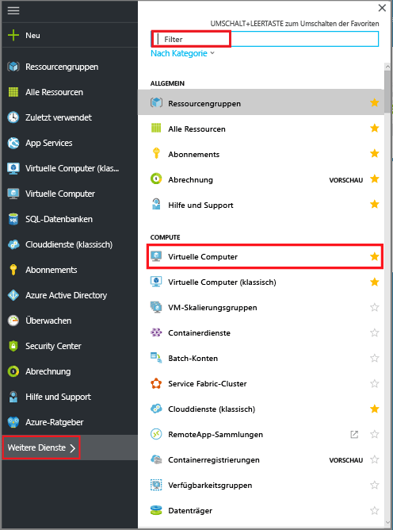

  Die Liste mit den virtuellen Computern (VMs) des Abonnements wird angezeigt.

  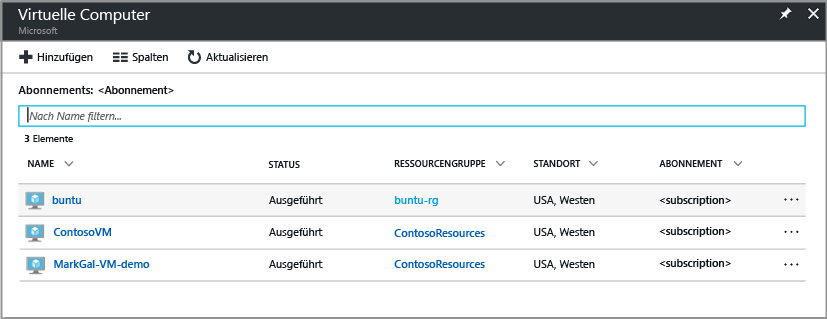

3. Wählen Sie in der Liste eine zu sichernde VM aus.

  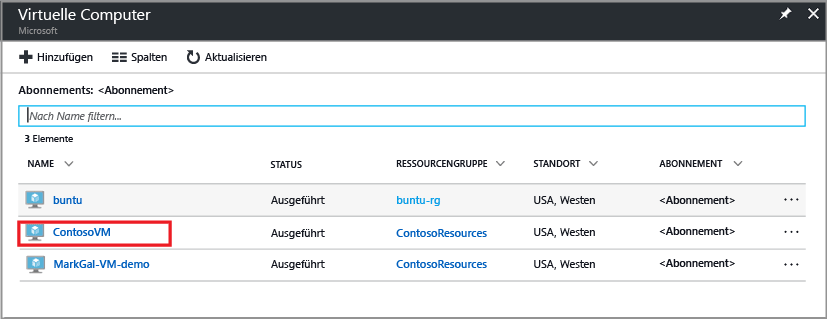

  Wenn Sie die VM auswählen, wird die Liste mit den virtuellen Computern nach links verschoben, und das Blatt „VM-Verwaltung“ und das VM-Dashboard werden geöffnet.  
 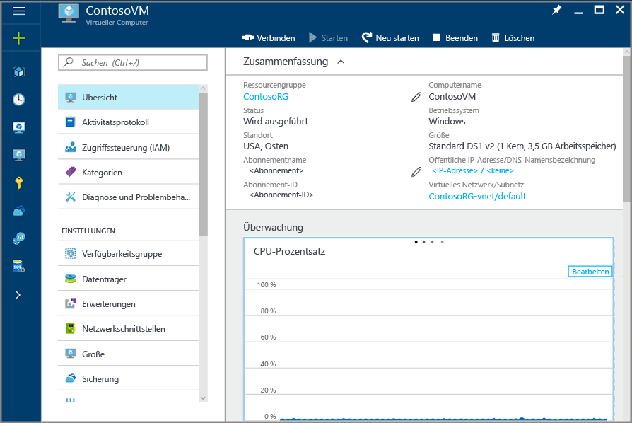

4. Klicken Sie auf dem Blatt „VM-Verwaltung“ im Abschnitt **Einstellungen** auf **Sicherung**.  

  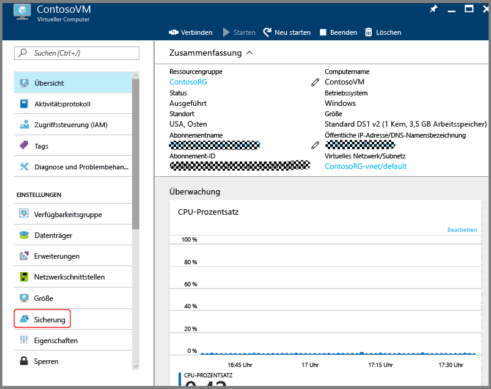

  Das Blatt „Sicherung aktivieren“ wird geöffnet.

  

5. Klicken Sie für den Recovery Services-Tresor auf **Vorhandene auswählen**, und wählen Sie in der Dropdownliste den Wert aus.

  

  Wenn keine Recovery Services-Tresore vorhanden sind oder wenn Sie einen neuen Tresor verwenden möchten, können Sie auf **Neu erstellen** klicken und den Namen für den neuen Tresor angeben. Ein neuer Tresor wird in derselben Ressourcengruppe und an demselben Standort wie der virtuelle Computer erstellt. Wenn Sie einen Recovery Services-Tresor mit anderen Werten erstellen möchten, helfen Ihnen die Informationen im Abschnitt [Erstellen eines Recovery Services-Tresors](backup-azure-vms-first-look-arm.md#create-a-recovery-services-vault-for-a-vm) weiter.

6. Klicken Sie auf **Sicherungsrichtlinie**, um die Details der Sicherungsrichtlinie anzuzeigen.

  Das Blatt **Sicherungsrichtlinie** wird geöffnet und enthält die Details zur ausgewählten Richtlinie. Bei Vorhandensein weiterer Richtlinien können Sie das Dropdownmenü verwenden, um eine andere Sicherungsrichtlinie auszuwählen. Wählen Sie im Dropdownmenü die Option **Neu erstellen** , wenn Sie eine Richtlinie erstellen möchten. Eine Anleitung zum Definieren einer Sicherungsrichtlinie finden Sie unter [Definieren einer Sicherungsrichtlinie](backup-azure-vms-first-look-arm.md#defining-a-backup-policy). Klicken Sie auf **OK**, um die Änderungen an der Sicherungsrichtlinie zu speichern und zum Blatt „Sicherung aktivieren“ zurückzukehren.

  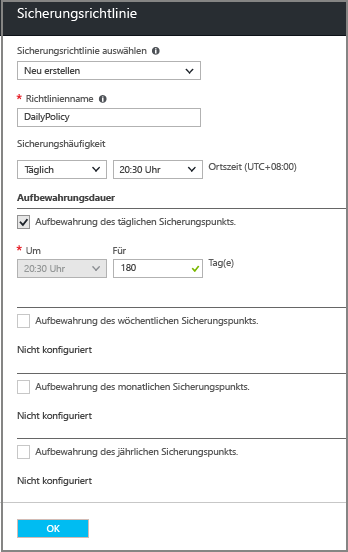

7. Klicken Sie auf dem Blatt „Sicherung aktivieren“ auf **Sicherung aktivieren**, um die Richtlinie bereitzustellen. Durch Bereitstellen der Richtlinie wird sie dem Tresor und den virtuellen Computern zugeordnet.

  

8. Sie können den Konfigurationsprozess über die Benachrichtigungen nachverfolgen, die im Portal angezeigt werden. Im folgenden Beispiel wird veranschaulicht, dass die Bereitstellung gestartet wurde.

  

9. Klicken Sie nach Abschluss des Konfigurationsprozesses auf dem Blatt „VM-Verwaltung“ auf **Sicherung**, um das Blatt „Sicherungselement“ zu öffnen und die Details anzuzeigen.

  

  Bis zum Abschluss des ersten Sicherungsvorgangs wird **Status der letzten Sicherung** als **Warnung (anfängliche Sicherung steht aus)** angezeigt. Klicken Sie unter **Sicherungsrichtlinie** auf den Namen der Richtlinie, um anzuzeigen, wann der nächste geplante Sicherungsauftrag ansteht. Das Blatt „Sicherungsrichtlinie“ wird geöffnet und zeigt den Zeitpunkt der geplanten Sicherung an.

10. Klicken Sie zum Ausführen eines Sicherungsauftrags und Erstellen des ersten Wiederherstellungspunkts auf dem Blatt „Sicherungstresor“ auf **Jetzt sichern**.

  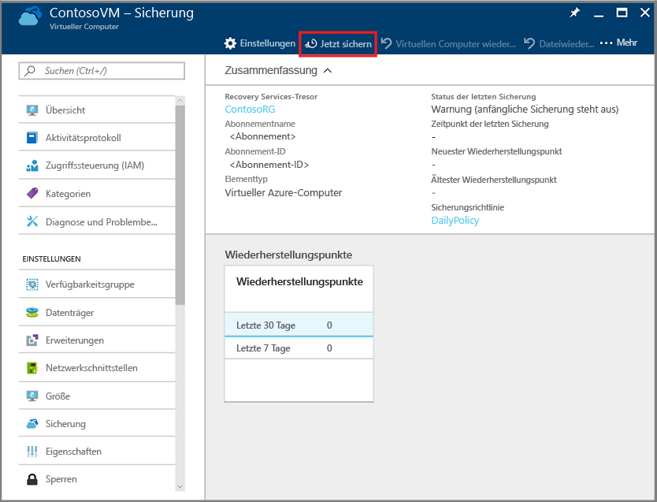

  Das Blatt „Jetzt sichern“ wird geöffnet.

  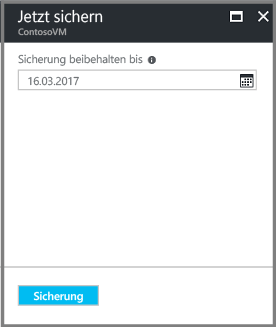

11. Klicken Sie auf dem Blatt „Jetzt sichern“ auf das Kalendersymbol, verwenden Sie das Kalendersteuerelement zum Auswählen des letzten Aufbewahrungstags des Wiederherstellungspunkts, und klicken Sie auf **Sicherung**.

  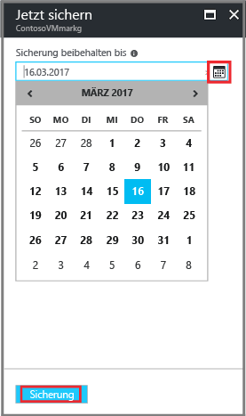

  Anhand von Bereitstellungsbenachrichtigungen werden Sie darüber informiert, dass der Sicherungsauftrag ausgelöst wurde und dass Sie den Status des Auftrags auf der Seite „Sicherungsaufträge“ überwachen können.

## Konfigurieren des Sicherungsauftrags über den Recovery Services-Tresor
Führen Sie die folgenden Schritte aus, um den Sicherungsauftrag zu konfigurieren:  

1. Erstellen Sie einen Recovery Services-Tresor für einen virtuellen Computer.
2. Verwenden Sie das Azure-Portal, um ein Szenario zu wählen, eine Sicherungsrichtlinie festzulegen und zu schützende Elemente anzugeben.
3. Führen Sie die erste Sicherung durch.

## Erstellen eines Recovery Services-Tresor für eine VM
Bei einem Recovery Services-Tresor handelt es sich um eine Entität, in der alle Sicherungen und Wiederherstellungspunkte gespeichert werden, die im Laufe der Zeit erstellt wurden. Der Recovery Services-Tresor enthält auch die Sicherungsrichtlinie, die auf die geschützten VMs angewendet wird.

> [!NOTE]
> Das Sichern von VMs ist ein lokaler Vorgang. Es ist nicht möglich, VMs eines Standorts in einem Recovery Services-Tresor an einem anderen Standort zu sichern. An jedem Azure-Standort, der über zu sichernde VMs verfügt, muss also mindestens ein Recovery Services-Tresor vorhanden sein.
>
>

So erstellen Sie einen Recovery Services-Tresor

1. Melden Sie sich mit Ihrem Azure-Abonnement beim [Azure-Portal](https://portal.azure.com/) an, sofern Sie noch nicht angemeldet sind.
2. Klicken Sie im Menü „Hub“ auf **Weitere Dienste**, und geben Sie im Dialogfeld „Filter“ den Text **Recovery Services** ein. Während der Eingabe wird die Liste mit den Ressourcen gefiltert. Klicken Sie in der Liste auf „Recovery Services-Tresore“, wenn der Eintrag angezeigt wird.

    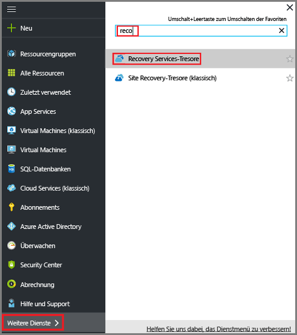  

    Wenn Recovery Services-Tresore im Abonnement vorhanden sind, werden die Tresore aufgeführt.

    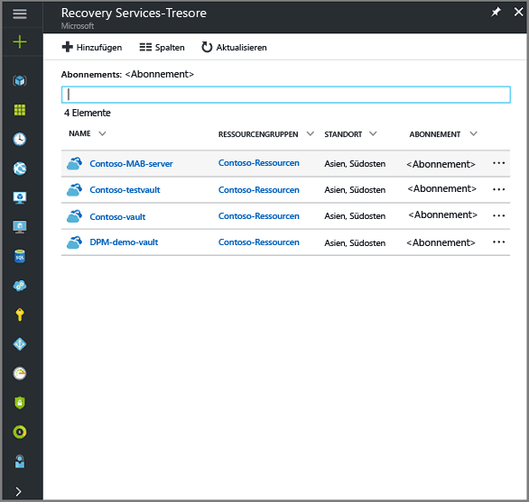
3. Klicken Sie im Menü **Recovery Services-Tresore** auf **Hinzufügen**.

    

    Das Blatt „Recovery Services-Tresor“ wird geöffnet, und Sie werden aufgefordert, **Name**, **Abonnement**, **Ressourcengruppe** und **Standort** anzugeben.

    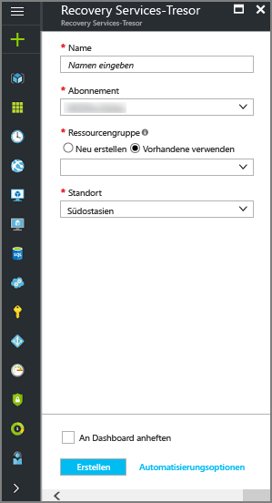

4. Geben Sie unter **Name**einen Anzeigenamen für den Tresor ein. Der Name muss für das Azure-Abonnement eindeutig sein. Geben Sie einen Namen ein, der zwischen 2 und 50 Zeichen enthält. Er muss mit einem Buchstaben beginnen und darf nur Buchstaben, Zahlen und Bindestriche enthalten.

5. Wählen Sie im Abschnitt **Abonnement** über das Dropdownmenü das Azure-Abonnement aus. Wenn Sie nur ein Abonnement verwenden, wird dieses Abonnement angezeigt, und Sie können mit dem nächsten Schritt fortfahren. Falls Sie nicht sicher sind, welches Abonnement geeignet ist, können Sie das Standardabonnement bzw. das vorgeschlagene Abonnement verwenden. Es sind nur dann mehrere Auswahlmöglichkeiten verfügbar, wenn Ihr Organisationskonto mehreren Azure-Abonnements zugeordnet ist.

6. Gehen Sie im Abschnitt **Ressourcengruppe** wie folgt vor:

    * Wählen Sie **Neu erstellen** aus, wenn Sie eine Ressourcengruppe erstellen möchten.
    Oder
    * Wählen Sie **Use existing** (Vorhandene verwenden) aus, und klicken Sie auf das Dropdownmenü, um eine Liste mit verfügbaren Ressourcengruppen anzuzeigen.

  Umfassende Informationen zu Ressourcengruppen finden Sie in der [Übersicht über Azure Resource Manager](../azure-resource-manager/resource-group-overview.md).

7. Klicken Sie auf **Standort** , um die geografische Region für den Tresor auszuwählen. Die Auswahl bestimmt die geografische Region, an die Ihre Sicherungsdaten gesendet werden.

  > [!IMPORTANT]
  > Wenn Sie sich nicht sicher sind, an welchem Standort sich Ihr virtueller Computer befindet, schließen Sie das Dialogfeld zur Tresorerstellung, und wechseln Sie zur Liste der virtuellen Computer im Portal. Falls Sie über virtuelle Computer in mehreren Regionen verfügen, erstellen Sie in jeder Region einen Recovery Services-Tresor. Erstellen Sie den Tresor am ersten Standort, bevor Sie mit dem nächsten Standort fortfahren. Es müssen keine Speicherkonten zum Speichern der Sicherungsdaten angegeben werden. Die Speicherung wird vom Recovery Services-Tresor und vom Azure Backup-Dienst automatisch abgewickelt.
  >

8. Klicken Sie im unteren Bereich des Blatts für den Recovery Services-Tresor auf **Erstellen**.

    Die Erstellung des Recovery Services-Tresors kann mehrere Minuten dauern. Verfolgen Sie die Statusbenachrichtigungen rechts oben im Portal. Nach Abschluss des Erstellungsvorgangs wird der Tresor in der Liste mit den Recovery Services-Tresoren angezeigt. Sollte der Tresor auch nach mehreren Minuten nicht angezeigt werden, klicken Sie auf **Aktualisieren**.

     

    Sobald Ihr Tresor in der Liste mit den Recovery Services-Tresoren angezeigt wird, können Sie die Speicherredundanz festlegen.

Nachdem Sie Ihren Tresor erstellt haben, widmen wir uns nun dem Festlegen der Speicherreplikation.

### Festlegen der Speicherreplikation
Bei der Speicherreplikation haben Sie die Wahl zwischen georedundantem Speicher und lokal redundantem Speicher. Standardmäßig verfügt Ihr Tresor über einen georedundanten Speicher. Falls es sich bei dem Recovery Services-Tresor um Ihre primäre Sicherung handelt, behalten Sie für die Speicherreplikationsoption den georedundanten Speicher bei. Wählen Sie lokal redundanten Speicher, wenn Sie eine günstigere und weniger langfristige Option wünschen. Weitere Informationen zu den Optionen für [georedundanten](../storage/common/storage-redundancy.md#geo-redundant-storage) und [lokal redundanten](../storage/common/storage-redundancy.md#locally-redundant-storage) Speicher finden Sie in der [Übersicht über die Azure Storage-Replikation](../storage/common/storage-redundancy.md).

So bearbeiten Sie die Einstellung für die Speicherreplikation:

1. Wählen Sie auf dem Blatt **Recovery Services-Tresore** den neuen Tresor aus.

  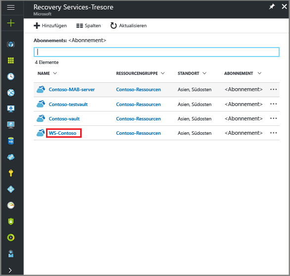

  Wenn Sie den Tresor auswählen, werden das Blatt mit den Einstellungen (*auf dem oben der Name des Tresors angegeben ist*) sowie das Blatt mit den Tresordetails geöffnet.

  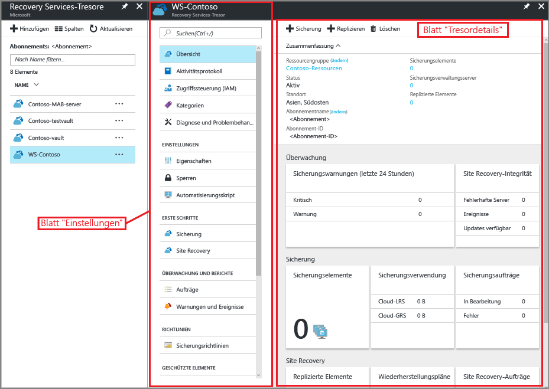

2. Scrollen Sie auf dem Blatt mit den Einstellungen des neuen Tresors mithilfe des vertikalen Schiebereglers nach unten zum Verwaltungsabschnitt, und klicken Sie auf **Sicherungsinfrastruktur**.
    Das Blatt der Sicherungsinfrastruktur wird geöffnet.
3. Klicken Sie auf dem Blatt der Sicherungsinfrastruktur auf **Sicherungskonfiguration**, um das Blatt **Sicherungskonfiguration** zu öffnen.

    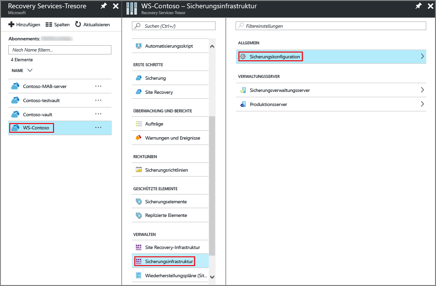
4. Wählen Sie die passende Speicherreplikationsoption für Ihren Tresor aus.

    

    Standardmäßig verfügt Ihr Tresor über einen georedundanten Speicher. Wenn Sie Azure als primären Speicherendpunkt für die Sicherung verwenden, verwenden Sie weiterhin die Option **Georedundant**. Wenn Sie Azure nicht als primären Speicherendpunkt für die Sicherung verwenden, wählen Sie **Lokal redundant** aus. Dadurch verringern sich die Kosten für Azure-Speicher. Weitere Informationen zu den Optionen für [georedundanten](../storage/common/storage-redundancy.md#geo-redundant-storage) und [lokal redundanten](../storage/common/storage-redundancy.md#locally-redundant-storage) Speicher finden Sie in [dieser Übersicht über Speicherredundanz](../storage/common/storage-redundancy.md).

## Auswählen eines Sicherungsziels, Festlegen der Richtlinie und Definieren von zu schützenden Elementen
Führen Sie zunächst den Ermittlungsprozess durch, bevor Sie einen virtuellen Computer registrieren, um sicherzustellen, dass alle neuen virtuellen Computer, die dem Abonnement hinzugefügt wurden, identifiziert werden. Bei diesem Vorgang wird Azure nach der Liste virtueller Computer im Abonnement abgefragt. Außerdem werden zusätzliche Informationen wie der Clouddienstname und die Region erfasst. „Szenario“ bezeichnet im Kontext des Azure-Portals das, was Sie dem Recovery Services-Tresor hinzufügen möchten. Die Richtlinie gibt die Häufigkeit und den Zeitpunkt für die Erstellung von Wiederherstellungspunkten an. Darüber hinaus enthält die Richtlinie die Beibehaltungsdauer für die Wiederherstellungspunkte.

1. Falls Sie bereits über einen geöffneten Recovery Services-Tresor verfügen, können Sie mit Schritt 2 fortfahren. Klicken Sie andernfalls im Hub-Menü auf **More Services** (Weitere Dienste), geben Sie in der Ressourcenliste **Recovery Services** ein, und klicken Sie auf **Recovery Services-Tresore**.

      

    Die Liste mit den Recovery Services-Tresoren wird angezeigt.

    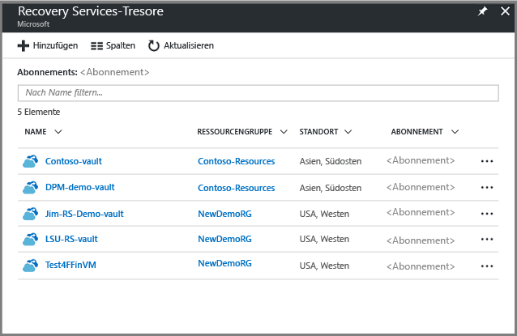

    Wählen Sie in der Liste mit den Recovery Services-Tresoren einen Tresor aus, um das dazugehörige Dashboard zu öffnen.

     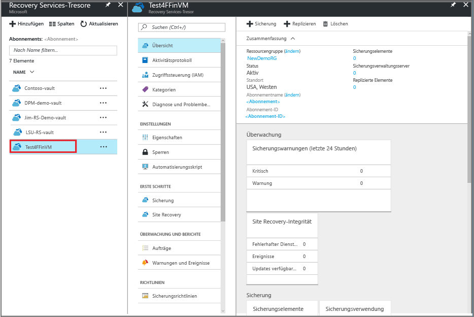

2. Klicken Sie im Menü des Tresordashboards auf **Sicherung**, um das Blatt „Sicherung“ zu öffnen.

    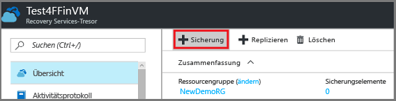

    Die Blätter „Sicherung“ und „Sicherungsziel“ werden geöffnet.

    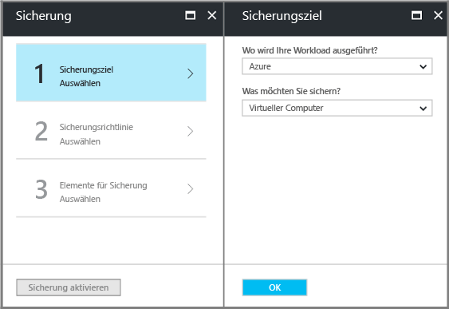
3. Wählen Sie auf dem Blatt „Sicherungsziel“ im Dropdownmenü **Wo wird Ihre Workload ausgeführt?** die Option „Azure“. Wählen Sie im Dropdownmenü **Was möchten Sie sichern?** die Option „Virtueller Computer“, und klicken Sie dann auf **OK**.

    Dadurch wird die VM-Erweiterung im Tresor registriert. Das Blatt „Sicherungsziel“ wird geschlossen, und das Blatt **Sicherungsrichtlinie** wird geöffnet.

    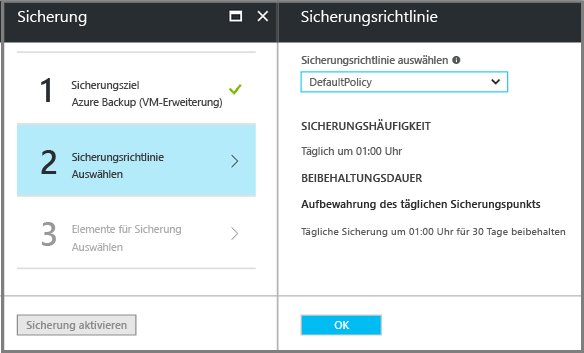

4. Wählen Sie auf dem Blatt „Sicherungsrichtlinie“ die Sicherungsrichtlinie aus, die Sie auf den Tresor anwenden möchten.

    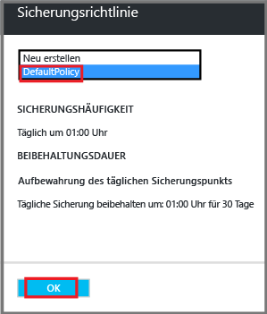

    Die Details zur Standardrichtlinie werden unter dem Dropdownmenü aufgeführt. Wählen Sie im Dropdownmenü die Option **Neu erstellen** , wenn Sie eine Richtlinie erstellen möchten. Eine Anleitung zum Definieren einer Sicherungsrichtlinie finden Sie unter [Definieren einer Sicherungsrichtlinie](backup-azure-vms-first-look-arm.md#defining-a-backup-policy).
    Klicken Sie auf **OK**, um die Sicherungsrichtlinie mit dem Tresor zu verknüpfen.

    Das Blatt „Sicherungsrichtlinie“ wird geschlossen, und das Blatt **Virtuelle Computer auswählen** wird geöffnet.
5. Wählen Sie auf dem Blatt **Virtuelle Computer auswählen** die virtuellen Computer aus, die der angegebenen Richtlinie zugeordnet werden sollen, und klicken Sie auf **OK**.

    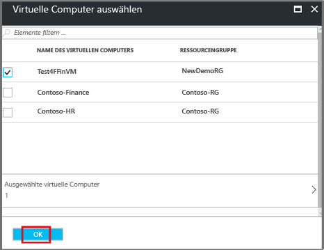

    Der ausgewählte virtuelle Computer wird überprüft. Falls die erwarteten virtuellen Computer nicht angezeigt werden, sollten Sie überprüfen, ob sie sich am gleichen Azure-Standort wie der Recovery Services-Tresor befinden. Der Standort des Recovery Services-Tresors wird auf dem Tresordashboard angezeigt.

6. Nachdem Sie nun alle Einstellungen für den Tresor definiert haben, klicken Sie auf dem Blatt „Backup“ auf **Sicherung aktivieren**, um die Richtlinie für den Tresor und für die virtuellen Computer bereitzustellen. Das Bereitstellen der Sicherungsrichtlinie führt nicht zur Erstellung des ersten Wiederherstellungspunkts für den virtuellen Computer.

    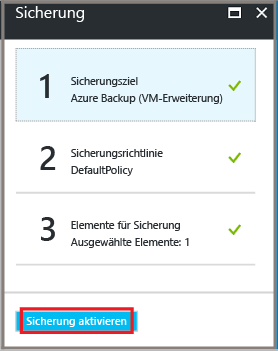

Nachdem die Sicherung erfolgreich aktiviert wurde, wird die Sicherungsrichtlinie nach dem Zeitplan ausgeführt. Fahren Sie hier aber mit dem Initiieren des ersten Sicherungsauftrags fort.

## Erste Sicherung
Nachdem eine Sicherungsrichtlinie auf dem virtuellen Computer bereitgestellt wurde, bedeutet dies nicht, dass die Daten gesichert wurden. Die erste geplante Sicherung (gemäß Definition in der Sicherungsrichtlinie) ist die erste Sicherung. Bis zur Durchführung der ersten Sicherung wird der Status der letzten Sicherung auf dem Blatt **Sicherungsaufträge** als **Warnung (anfängliche Sicherung steht aus)** angezeigt.

Falls die erste Sicherung nicht ohnehin in Kürze durchgeführt wird, empfiehlt es sich, **Jetzt sichern**auszuführen.

So führen Sie den ersten Sicherungsauftrag aus:

1. Klicken Sie im Tresordashboard auf die Zahl unter **Sicherungselemente**, oder klicken Sie auf die Kachel **Sicherungselemente**.  
  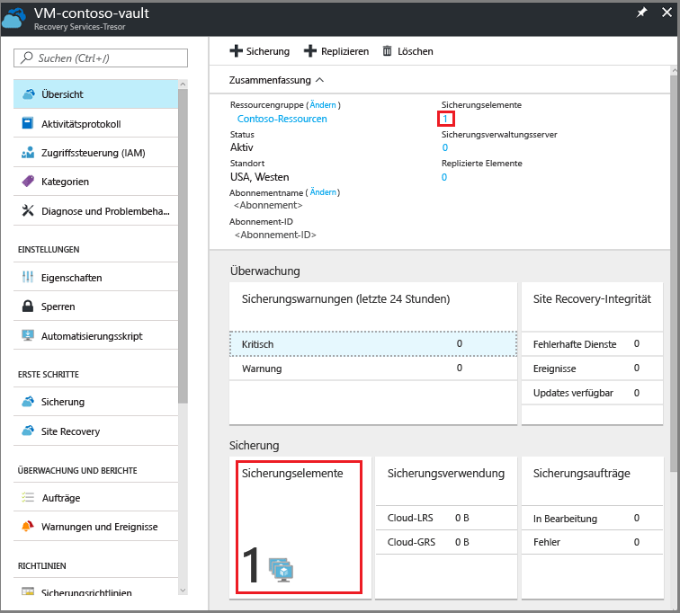

  Das Blatt **Sicherungselemente** wird geöffnet.

  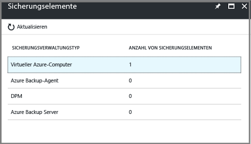

2. Wählen Sie das Element auf dem Blatt **Sicherungselemente** aus.

  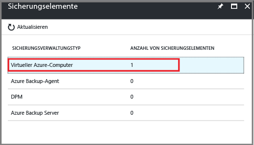

  Die Liste **Sicherungselemente** wird geöffnet.  

  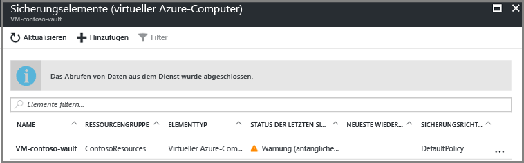

3. Klicken Sie in der Liste **Sicherungselemente** auf die Auslassungszeichen (**...**), um das Kontextmenü zu öffnen.

  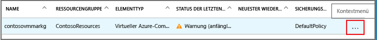

  Das Kontextmenü wird angezeigt.

  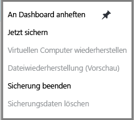

4. Klicken Sie im Kontextmenü auf **Jetzt sichern**.

  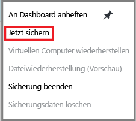

  Das Blatt „Jetzt sichern“ wird geöffnet.

  

5. Klicken Sie auf dem Blatt „Jetzt sichern“ auf das Kalendersymbol, verwenden Sie das Kalendersteuerelement zum Auswählen des letzten Aufbewahrungstags des Wiederherstellungspunkts, und klicken Sie auf **Sicherung**.

  

  Anhand von Bereitstellungsbenachrichtigungen werden Sie darüber informiert, dass der Sicherungsauftrag ausgelöst wurde und dass Sie den Status des Auftrags auf der Seite „Sicherungsaufträge“ überwachen können. Je nach Größe Ihrer VM kann das Erstellen der ersten Sicherung einige Zeit dauern.

6. Klicken Sie im Tresordashboard auf der Kachel **Sicherungsaufträge** auf **In Bearbeitung**, um den Status der ersten Sicherung anzuzeigen oder nachzuverfolgen.

  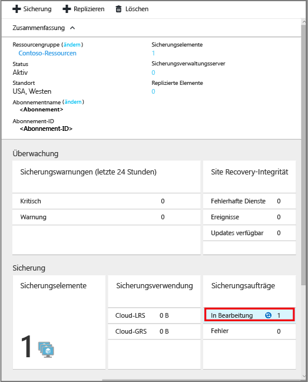

  Das Blatt „Sicherungsaufträge“ wird geöffnet.

  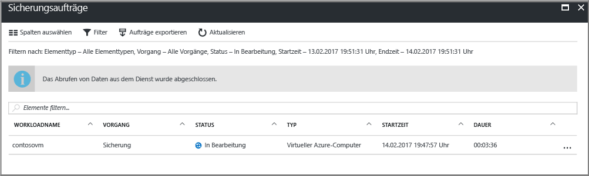

  Im Blatt **Sicherungsaufträge** wird der Status aller Aufträge angezeigt. Überprüfen Sie, ob der Sicherungsvorgang für Ihre VM noch aktiv ist oder beendet wurde. Wenn ein Sicherungsauftrag abgeschlossen ist, lautet der Status *Abgeschlossen*.

  > [!NOTE]
  > Als Teil des Sicherungsvorgangs gibt der Azure Backup-Dienst einen Befehl an die Sicherungserweiterung auf jeder VM aus, damit alle Schreibvorgänge geleert werden und eine konsistente Momentaufnahme erstellt wird.
  >
  >

[!INCLUDE [backup-create-backup-policy-for-vm](../../includes/backup-create-backup-policy-for-vm.md)]

## Installieren des VM-Agents auf dem virtuellen Computer
Diese Informationen werden bereitgestellt, falls es erforderlich ist. Der Azure VM-Agent muss auf dem virtuellen Azure-Computer installiert werden, damit die Sicherungserweiterung funktioniert. Wenn Ihr virtueller Computer aber über den Azure-Katalog erstellt wurde, ist der VM-Agent auf dem virtuellen Computer bereits vorhanden. Auf virtuellen Computern, die aus lokalen Rechenzentren migriert werden, ist der VM-Agent nicht installiert. In diesem Fall muss der VM-Agent installiert werden. Falls beim Sichern des virtuellen Azure-Computers Probleme auftreten, vergewissern Sie sich, dass der Azure VM-Agent korrekt auf dem virtuellen Computer installiert ist (siehe Tabelle weiter unten). Wenn Sie einen benutzerdefinierten virtuellen Computer erstellen, [müssen Sie das Kontrollkästchen **VM-Agent installieren** aktivieren](../virtual-machines/windows/classic/agents-and-extensions.md?toc=%2fazure%2fvirtual-machines%2fwindows%2fclassic%2ftoc.json), bevor Sie den virtuellen Computer bereitstellen.

Erfahren Sie mehr über den [VM-Agent](https://go.microsoft.com/fwLink/?LinkID=390493&clcid=0x409) und seine [Installation](../virtual-machines/windows/classic/manage-extensions.md?toc=%2fazure%2fvirtual-machines%2fwindows%2fclassic%2ftoc.json) (in englischer Sprache).

Die folgende Tabelle enthält weitere Informationen zum VM-Agent für virtuelle Windows- und Linux-Computer.

| **Vorgang** | **Windows** | **Linux** |
| --- | --- | --- |
| Installieren des VM-Agent |<li>Laden Sie den [Agent-MSI](http://go.microsoft.com/fwlink/?LinkID=394789&clcid=0x409)herunter, und installieren Sie ihn. Zum Durchführen der Installation benötigen Sie Administratorberechtigungen. <li>[Aktualisieren Sie die VM-Eigenschaft](http://blogs.msdn.com/b/mast/archive/2014/04/08/install-the-vm-agent-on-an-existing-azure-vm.aspx) , um anzugeben, dass der Agent installiert wurde. |<li> Installieren Sie den neuesten [Linux-Agent](https://github.com/Azure/WALinuxAgent) aus GitHub. Zum Durchführen der Installation benötigen Sie Administratorberechtigungen. <li> [Aktualisieren Sie die VM-Eigenschaft](http://blogs.msdn.com/b/mast/archive/2014/04/08/install-the-vm-agent-on-an-existing-azure-vm.aspx) , um anzugeben, dass der Agent installiert wurde. |
| Aktualisieren des VM-Agents |Das Aktualisieren des VM-Agents ist so einfach wie das Neuinstallieren der [Binärdateien für den VM-Agent](http://go.microsoft.com/fwlink/?LinkID=394789&clcid=0x409).  Stellen Sie sicher, dass kein Sicherungsvorgang ausgeführt wird, während der VM-Agent aktualisiert wird. |Folgen Sie den Anweisungen unter [Aktualisieren des Linux-VM-Agents](../virtual-machines/linux/update-agent.md?toc=%2fazure%2fvirtual-machines%2flinux%2ftoc.json).  Stellen Sie sicher, dass kein Sicherungsvorgang ausgeführt wird, während der VM-Agent aktualisiert wird. |
| Überprüfen der VM-Agent-Installation |<li>Navigieren Sie auf dem virtuellen Azure-Computer zum Ordner *C:\WindowsAzure\Packages*. <li>Dieser Ordner enthält die Datei "WaAppAgent.exe".<li> Klicken Sie mit der rechten Maustaste auf die Datei, wechseln Sie zu **Eigenschaften**, und wählen Sie dann die Registerkarte **Details** aus. Im Feld mit der Produktversion sollte 2.6.1198.718 oder eine höhere Version angegeben sein. |N/V |

### Backup-Erweiterung
Sobald der VM-Agent auf dem virtuellen Computer installiert wurde, installiert der Azure Backup-Dienst die Sicherungserweiterung für den VM-Agent. Der Azure Backup-Dienst installiert nahtlos und ohne zusätzlichen Benutzereingriff Upgrades und Patches für die Backup-Erweiterung.

Der Backup-Dienst installiert die Sicherungserweiterung auch dann, wenn der virtuelle Computer nicht ausgeführt wird. Bei einem ausgeführten virtuellen Computer besteht zudem die größte Chance auf einen anwendungskonsistenten Wiederherstellungspunkt. Der Azure Backup-Dienst setzt die Sicherung des virtuellen Computers jedoch auch dann fort, wenn dieser ausgeschaltet wurde und die Erweiterung nicht installiert werden konnte. Diese Art der Sicherung wird als Offline-VM bezeichnet, und der Wiederherstellungspunkt ist *absturzkonsistent*.

## Informationen zur Problembehandlung
Falls bei der Durchführung einiger Aufgaben in diesem Artikel Probleme auftreten, helfen Ihnen die [Anleitungen zur Problembehandlung](backup-azure-vms-troubleshoot.md)weiter.

## Preise
Die Kosten für die Sicherung virtueller Azure-Computer hängen von der Anzahl geschützter Instanzen ab. Eine Definition für eine geschützte Instanz finden Sie unter [Was ist eine geschützte Instanz?](backup-introduction-to-azure-backup.md#what-is-a-protected-instance). Ein Beispielkostenrechnung für die Sicherung eines virtuellen Computers finden Sie unter [Wie werden geschützte Instanzen berechnet?](backup-azure-vms-introduction.md#calculating-the-cost-of-protected-instances). Backup-Preisinformationen finden Sie auf der [Seite mit den Preisen für Azure Backup](https://azure.microsoft.com/pricing/details/backup/).

## Fragen?
Wenn Sie Fragen haben oder Anregungen zu gewünschten Funktionen mitteilen möchten, [senden Sie uns Ihr Feedback](http://aka.ms/azurebackup_feedback).

