<properties
	pageTitle="Schützen virtueller Computer in Azure mit Azure Backup | Microsoft Azure"
	description="Schützen virtueller Azure-Computer mit dem Azure Backup-Dienst Dieses Tutorial erläutert das Erstellen von Tresoren, das Registrieren virtueller Computer, das Erstellen von Richtlinien und das Schützen virtueller Computer in Azure."
	services="backup"
	documentationCenter=""
	authors="markgalioto"
	manager="jwhit"
	editor=""/>

<tags
	ms.service="backup"
	ms.workload="storage-backup-recovery"
	ms.tgt_pltfrm="na"
	ms.devlang="na"
	ms.topic="hero-article"
	ms.date="04/22/2016"
	ms.author="markgal; jimpark"/>

# Einführung: Sichern von virtuellen Azure-Computern

> [AZURE.SELECTOR]
- [Sichern von ARM-VMs](backup-azure-vms-first-look-arm.md)
- [Sichern von VMs im klassischen Modus](backup-azure-vms-first-look.md)

In diesem Tutorial werden Sie durch die Schritte zum Sichern eines virtuellen Azure-Computers (VM) auf Azure geführt. Die folgenden Voraussetzungen müssen erfüllt sein, damit Sie dieses Tutorial erfolgreich durcharbeiten können:

- Sie haben in Ihrem Azure-Abonnement eine VM erstellt.
- Der virtuelle Computer ist mit öffentlichen Azure-IP-Adressen verbunden. Weitere Informationen finden Sie unter [Netzwerkverbindung](./backup-azure-vms-prepare.md#network-connectivity).

Im Folgenden finden Sie die fünf wesentlichen Schritte, die zum Sichern eines virtuellen Computers ausgeführt werden müssen:

 Erstellen Sie einen Sicherungstresor, oder geben Sie einen vorhandenen Sicherungstresor an.    Verwenden Sie das klassische Azure-Portal, um die virtuellen Computer zu ermitteln und zu registrieren.    Installieren Sie den VM-Agent.    Erstellen Sie die Richtlinie für den Schutz der virtuellen Computer.    Führen Sie die Sicherung aus.

>[AZURE.NOTE] Azure verfügt über zwei Bereitstellungsmodelle zum Erstellen und Verwenden von Ressourcen: [Resource Manager-Bereitstellungen und klassische Bereitstellungen](../resource-manager-deployment-model.md). Dieses Tutorial ist für die Verwendung mit VMs bestimmt, die im klassischen Azure-Portal erstellt werden können. Der Azure Backup-Dienst unterstützt auf Azure Resource Manager (ARM) basierende VMs, die auch als IaaS-V2-VMs bezeichnet werden. Weitere Informationen zum Sichern von ARM-VMs finden Sie unter [Einführung: Sichern von ARM-VMs in einem Recovery Services-Tresor](backup-azure-vms-first-look-arm.md).

## Schritt 1 – Erstellen eines Sicherungstresors für einen virtuellen Computer

Bei einem Sicherungstresor handelt es sich um eine Entität, in der alle Sicherungen und Wiederherstellungspunkte gespeichert werden, die im Laufe der Zeit erstellt wurden. Der Sicherungstresor enthält auch die Sicherungsrichtlinien, die auf die zu sichernden virtuellen Computer angewendet werden.

1. Melden Sie sich beim [klassischen Azure-Portal](http://manage.windowsazure.com/) an.

2. Klicken Sie unten links im Azure-Portal auf **Neu**.

    

3. Klicken Sie im Assistenten für die Schnellerfassung auf **Data Services** > **Recovery Services** > **Sicherungstresor** > **Schnellerfassung**.

    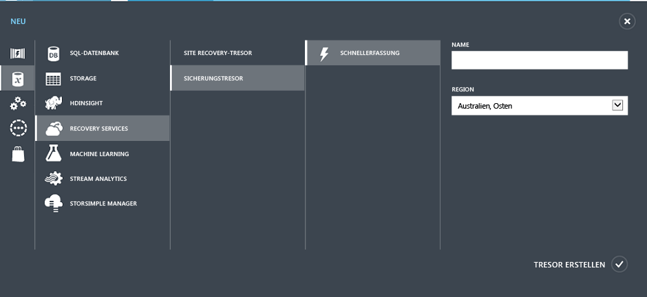

    Der Assistent fordert Sie zum Eingeben von **Name** und **Region** auf. Wenn Sie mehrere Abonnements verwalten, wird ein Dialogfeld zum Auswählen des Abonnements angezeigt.

4. Geben Sie unter **Name** einen Anzeigenamen für den Tresor ein. Der Name muss für das Azure-Abonnement eindeutig sein.

5. Wählen Sie unter **Region** die geografische Region für den Tresor aus. Die Region des Tresors **muss** mit der Region der zu schützenden virtuellen Computer übereinstimmen.

    Falls Sie nicht sicher sind, in welcher Region sich der virtuelle Computer befindet, schließen Sie diesen Assistenten und klicken Sie in der Liste mit den Azure-Diensten auf **Virtuelle Computer**. Die Spalte „Standort“ enthält den Namen der Region. Wenn Sie über virtuelle Computer in verschiedenen Regionen verfügen, sollten Sie in jeder dieser Regionen einen Sicherungstresor erstellen.

6. Falls im Assistenten das Dialogfeld **Abonnement** nicht vorhanden ist, können Sie mit dem nächsten Schritt fortfahren. Wählen Sie bei Verwendung mehrerer Abonnements ein Abonnement aus, das dem neuen Sicherungstresor zugeordnet werden soll.

    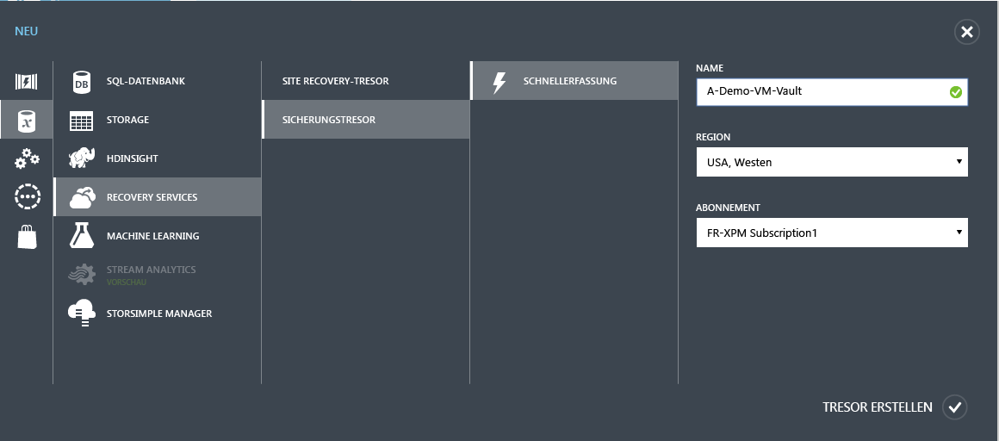

7. Klicken Sie auf **Tresor erstellen**. Es kann eine Weile dauern, bis der Sicherungstresor fertiggestellt wird. Unten im Portal können Sie anhand der Benachrichtigungen den Status prüfen.

    

    In einer Meldung wird bestätigt, dass der Tresor erfolgreich erstellt wurde. Er wird auf der Seite **Recovery Services** als **Aktiv** aufgelistet.

    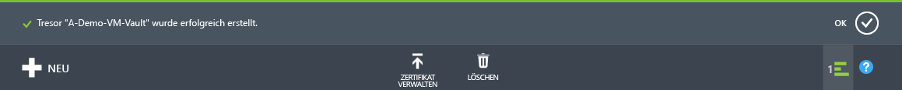

8. Wählen Sie in der Liste mit den Tresoren auf der Seite **Recovery Services** den erstellten Tresor aus, um die Seite **Schnellstart** zu öffnen.

    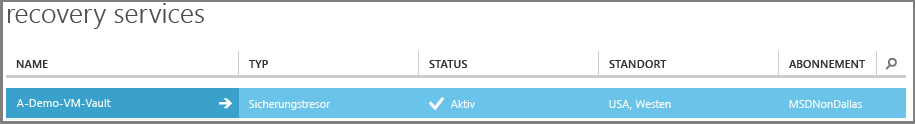

9. Klicken Sie auf der Seite **Schnellstart** auf **Konfigurieren**, um die Option für die Speicherreplikation zu öffnen. 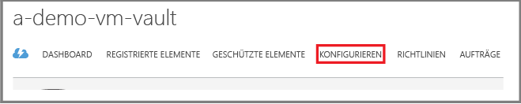

10. Wählen Sie in der Option **Speicherreplikation** die Replikationsoption für Ihren Tresor aus.

    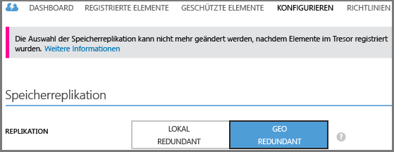

    Standardmäßig verfügt Ihr Tresor über einen georedundanten Speicher. Wählen Sie georedundanten Speicher, wenn Sie Azure als primäre Sicherung verwenden. Wählen Sie lokal redundanten Speicher, wenn Sie eine günstigere und weniger langfristige Option wünschen. Unter [Azure Storage replication](../storage/storage-redundancy.md) (Azure Storage-Replikation) erfahren Sie mehr über die Optionen für georedundante und lokal redundante Speicher.

Wenn Sie die Speicheroption für Ihren Tresor ausgewählt haben, können Sie den virtuellen Computer dem Tresor zuordnen. Ermitteln und registrieren Sie die virtuellen Azure-Computer, um mit der Zuordnung zu beginnen.

## Schritt 2 – Ermitteln und Registrieren virtueller Azure-Computer
Führen Sie vor dem Registrieren der VM mit einem Tresor den Ermittlungsvorgang durch, um neue VMs zu identifizieren. Dadurch wird eine Liste virtueller Computer im Abonnement ausgegeben. Außerdem werden zusätzliche Informationen wie der Clouddienstname und die Region erfasst.

1. Melden Sie sich beim [klassischen Azure-Portal](http://manage.windowsazure.com/) an.

2. Klicken Sie im klassischen Azure-Portal auf **Recovery Services**, um die Liste der Recovery Services-Tresore zu öffnen. 

3. Wählen Sie in der Liste mit den Tresoren den Tresor zum Sichern einer VM aus.

    Wenn Sie Ihren Tresor auswählen, wird er auf der Seite **Schnellstart** geöffnet.

4. Klicken Sie im Tresormenü auf **Registrierte Elemente**.

    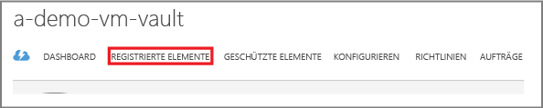

5. Wählen Sie im Menü **Typ** die Option **Virtueller Azure-Computer** aus.

    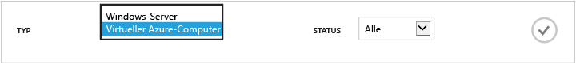

6. Klicken Sie unten auf der Seite auf **ERMITTELN**. 

    Der Ermittlungsvorgang kann einige Minuten dauern, während die virtuellen Computer in einer Tabelle aufgeführt werden. Am unteren Rand des Bildschirms wird eine Benachrichtigung angezeigt, die Ihnen mitteilt, dass der Vorgang ausgeführt wird.

    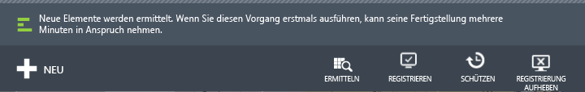

    Die Benachrichtigung ändert sich, sobald der Vorgang abgeschlossen ist.

    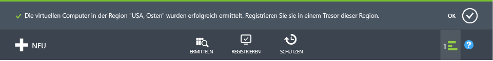

7. Klicken Sie unten auf der Seite auf **REGISTRIEREN**. 

8. Wählen Sie im Kontextmenü **Elemente registrieren** die virtuellen Computer aus, die Sie registrieren möchten.

    >[AZURE.TIP] Mehrere virtuelle Computer können gleichzeitig registriert werden.

    Für jeden virtuellen Computer, den Sie ausgewählt haben, wird ein Auftrag erstellt.

9. Klicken Sie in der Benachrichtigung auf **Auftrag anzeigen**, um zur Seite **Aufträge** zu gelangen.

    

    Der virtuelle Computer wird auch in der Liste der registrierten Elemente aufgeführt, ebenso wie der Status des Registrierungsvorgangs.

    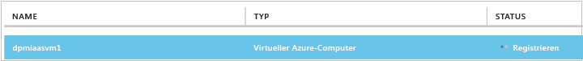

    Wenn der Vorgang abgeschlossen ist, ändert sich der Status gemäß dem *registrierten* Status.

    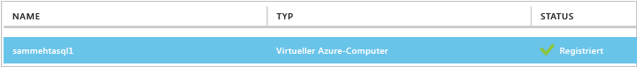

## Schritt 3 – Installieren Sie den VM-Agent auf dem virtuellen Computer.

Der Azure VM-Agent muss auf dem virtuellen Azure-Computer installiert werden, damit die Sicherungserweiterung funktioniert. Wenn Ihr virtueller Computer aus dem Azure-Katalog erstellt wurde, ist der VM-Agent auf dem virtuellen Computer bereits vorhanden. Sie können dann mit [Schützen Ihrer VMs](backup-azure-vms-first-look.md#step-4---protect-azure-virtual-machines) fortfahren.

Falls Sie Ihren virtueller Computer aus einem lokalen Rechenzentrum migriert haben, wurde der VM-Agent wahrscheinlich noch nicht für den virtuellen Computer installiert. Sie müssen den VM-Agent auf dem virtuellen Computer installieren, bevor Sie mit dem Schützen des virtuellen Computers fortfahren. Ausführliche Schritte zum Installieren des VM-Agents finden Sie im[Abschnitt zum VM-Agent im Artikel, der das Sichern virtueller Computer behandelt](backup-azure-vms-prepare.md#vm-agent).

## Schritt 4 – Erstellen der Sicherungsrichtlinie
Bevor Sie den ersten Sicherungsauftrag ausführen, legen Sie einen Zeitplan für Sicherungsmomentaufnahmen fest. Die Sicherungsrichtlinie besteht aus dem Zeitplan für Sicherungsmomentaufnahmen sowie der Dauer, für die diese Aufnahmen gespeichert werden. Als Rotationsschema für die Beibehaltungsdauer wird das Generationenprinzip angewandt.

1. Navigieren Sie zum Sicherungstresor, der sich im klassischen Azure-Portal unter **Recovery Services** befindet, und klicken Sie auf **Registrierte Elemente**.
2. Wählen Sie im Dropdownmenü **Virtueller Azure-Computer** aus.

    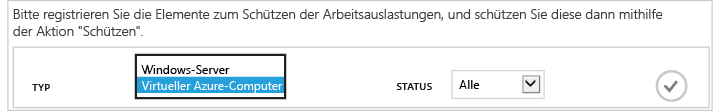

3. Klicken Sie unten auf der Seite auf **SCHÜTZEN**. 

    Der **Assistent zum Schützen von Elementen** wird angezeigt. Darin sind *nur* die virtuellen Computer aufgeführt, die registriert wurden und nicht geschützt sind.

    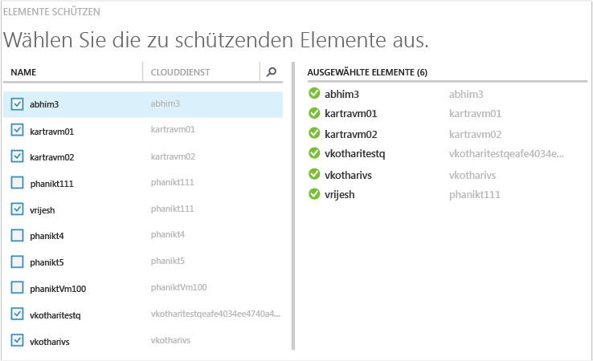

4. Wählen Sie die virtuellen Computer aus, die Sie schützen möchten.

    Wenn zwei oder mehr virtuelle Computer denselben Namen aufweisen, verwenden Sie den Clouddienst, um zwischen den virtuellen Computern zu unterscheiden.

5. Wählen Sie im Menü **Schutz konfigurieren** eine vorhandene Richtlinie aus, oder erstellen Sie eine neue Richtlinie, um die ermittelten virtuellen Computer zu schützen.

    Bei neuen Sicherungstresoren ist dem Tresor eine Standardrichtlinie zugeordnet. Dabei wird jeden Abend eine Momentaufnahmen gemacht, die jeweils 30 Tage lang aufbewahrt wird. Jeder Sicherungsrichtlinie können mehrere virtuelle Computer zugeordnet sein. Ein virtueller Computer kann jedoch immer nur einer Richtlinie zugeordnet sein.

    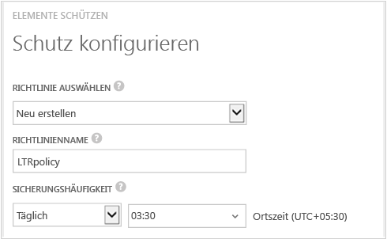

    >[AZURE.NOTE] Eine Sicherungsrichtlinie umfasst auch ein Aufbewahrungsschema für die geplanten Sicherungen. Bei Wahl einer vorhandenen Sicherungsrichtlinie können Sie die Aufbewahrungsoptionen im nächsten Schritt nicht ändern.

6. Wählen Sie unter **Beibehaltungsdauer** die täglichen, wöchentlichen, monatlichen und jährlichen Bereiche für die einzelnen Sicherungspunkte aus.

    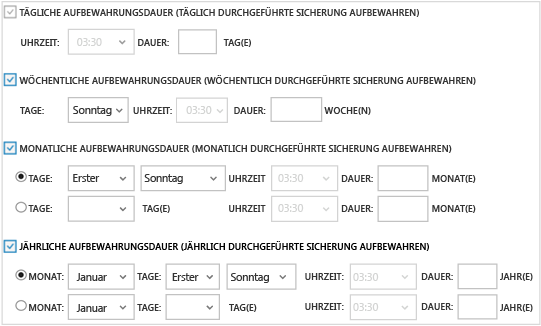

    Die Aufbewahrungsrichtlinie legt fest, für welchen Zeitraum eine Sicherung aufbewahrt wird. Je nach Erstellungszeitpunkt der Sicherung können Sie unterschiedliche Aufbewahrungsrichtlinien festlegen.

7. Klicken Sie auf **Aufträge**, um die Liste mit den Aufträgen vom Typ **Schutz konfigurieren** anzuzeigen.

    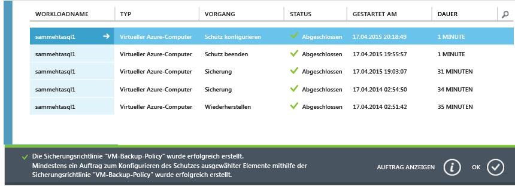

    Nachdem Sie diese Richtlinie nun eingerichtet haben, können Sie mit dem nächsten Schritt fortfahren und die erste Sicherung durchführen.

## Schritt 5 – Erste Sicherung

Wenn ein virtueller Computer mit einer Richtlinie geschützt wird, können Sie diese Beziehung auf der Registerkarte **Geschützte Elemente** anzeigen. Bis zur Durchführung der ersten Sicherung wird der **Schutzstatus** als **Geschützt (erste Sicherung ausstehend)** angezeigt. Standardmäßig ist die erste geplante Sicherung die *Anfangssicherung*.

Starten Sie die anfängliche Sicherung:

1. Klicken Sie unten auf der Seite **Geschützte Elemente** auf **Jetzt sichern**. 

    Der Azure Backup-Dienst erstellt einen Sicherungsauftrag für die erste Sicherung.

2. Klicken Sie auf die Registerkarte **Aufträge**, um die Liste der Aufträge anzuzeigen.

    

    Sobald die erste Sicherung abgeschlossen ist, wird der Status des virtuellen Computers auf der Registerkarte **Geschützte Elemente** als *Geschützt* angezeigt.

    

    >[AZURE.NOTE] Das Sichern virtueller Computer ist ein örtlich gebundener Vorgang. Sie können keine virtuellen Computer aus einer Region in einem Sicherungstresor in einer anderen Region sichern. Deshalb muss in jeder Azure-Region mit virtuellen Computern, die gesichert werden sollen, mindestens ein Sicherungstresor erstellt werden.

## Nächste Schritte
Nachdem Sie einen virtuellen Computer erfolgreich gesichert haben, sind unter Umständen weitere Schritte von Interesse. Der logische nächste Schritt besteht darin, sich mit dem Wiederherstellen von Daten auf einer VM vertraut zu machen. Es gibt aber auch Verwaltungsaufgaben, mit denen Sie besser verstehen können, wie Sie Ihre Daten schützen und die Kosten senken.

- [Verwalten und Überwachen Ihrer virtuellen Computer](backup-azure-manage-vms.md)
- [Wiederherstellen virtueller Computer](backup-azure-restore-vms.md)
- [Anleitungen zur Problembehandlung](backup-azure-vms-troubleshoot.md)

## Fragen?
Wenn Sie Fragen haben oder Anregungen zu gewünschten Funktionen mitteilen möchten, [senden Sie uns Ihr Feedback](http://aka.ms/azurebackup_feedback).

<!---HONumber=AcomDC_0427_2016-->