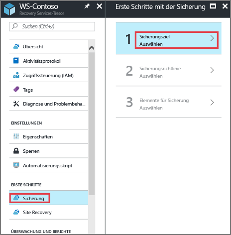
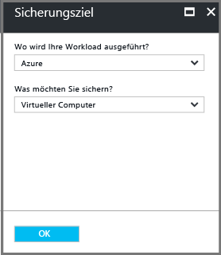
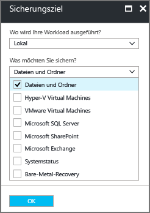
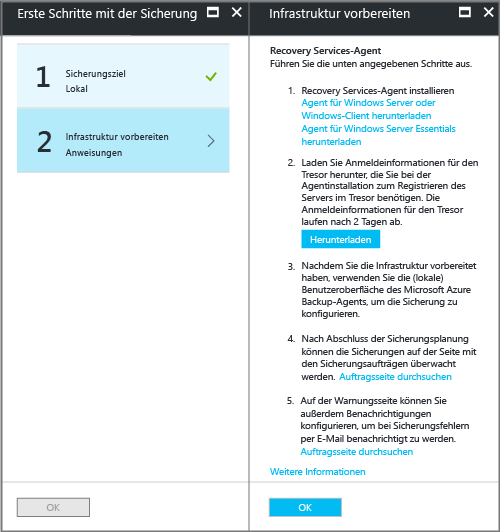
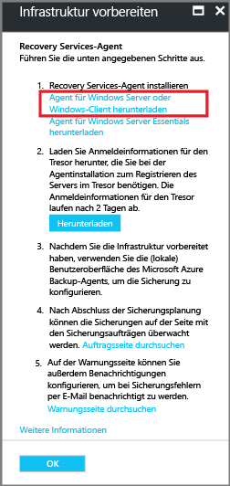
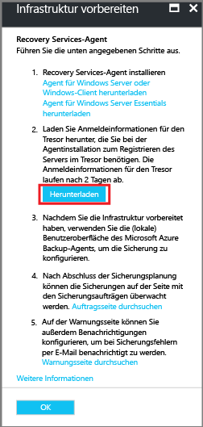
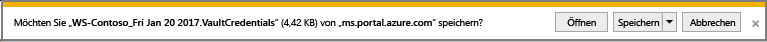
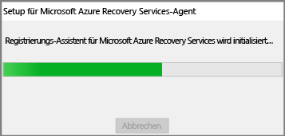

# Einführung: Sichern von Dateien und Ordnern in einer Resource Manager-Bereitstellung
In diesem Artikel erfahren Sie, wie Sie Dateien und Ordner eines Windows Server-Computers (oder eines Windows-Computers) mithilfe einer Resource Manager-Bereitstellung in Azure sichern. Dies ist ein Tutorial, in dem die Grundlagen beschrieben werden. Wenn Sie mit Azure Backup starten möchten, befinden Sie sich am richtigen Ort.

Falls Sie weitere Informationen zu Azure Backup erhalten möchten, können Sie diese [Übersicht](backup-introduction-to-azure-backup.md)lesen.

Falls Sie noch nicht über ein Azure-Abonnement verfügen, können Sie ein [kostenloses Konto](https://azure.microsoft.com/free/) erstellen, mit dem Sie auf alle Azure-Dienste zugreifen können.

## Erstellen eines Recovery Services-Tresors
Um Ihre Dateien und Ordner zu sichern, müssen Sie einen Recovery Services-Tresor in der Region erstellen, in der die Daten gespeichert werden sollen. Außerdem müssen Sie festlegen, wie der Speicher repliziert werden soll.

### So erstellen Sie einen Recovery Services-Tresor
1. Melden Sie sich mit Ihrem Azure-Abonnement beim [Azure-Portal](https://portal.azure.com/) an, sofern Sie noch nicht angemeldet sind.
2. Klicken Sie im Hub-Menü auf **More Services** (Weitere Dienste), geben Sie in der Ressourcenliste **Recovery Services** ein, und klicken Sie auf **Recovery Services-Tresore**.

      

    Wenn Recovery Services-Tresore im Abonnement vorhanden sind, werden die Tresore aufgeführt.
3. Klicken Sie im Menü **Recovery Services-Tresore** auf **Hinzufügen**.

    

    Das Blatt „Recovery Services-Tresor“ wird geöffnet, und Sie werden aufgefordert, **Name**, **Abonnement**, **Ressourcengruppe** und **Standort** anzugeben.

    

4. Geben Sie unter **Name**einen Anzeigenamen für den Tresor ein. Der Name muss für das Azure-Abonnement eindeutig sein. Geben Sie einen Namen ein, der zwischen 2 und 50 Zeichen enthält. Er muss mit einem Buchstaben beginnen und darf nur Buchstaben, Zahlen und Bindestriche enthalten.

5. Wählen Sie im Abschnitt **Abonnement** über das Dropdownmenü das Azure-Abonnement aus. Wenn Sie nur ein Abonnement verwenden, wird dieses Abonnement angezeigt, und Sie können mit dem nächsten Schritt fortfahren. Falls Sie nicht sicher sind, welches Abonnement geeignet ist, können Sie das Standardabonnement bzw. das vorgeschlagene Abonnement verwenden. Es sind nur dann mehrere Auswahlmöglichkeiten verfügbar, wenn Ihr Organisationskonto mehreren Azure-Abonnements zugeordnet ist.

6. Gehen Sie im Abschnitt **Ressourcengruppe** wie folgt vor:

    * Wählen Sie **Neu erstellen** aus, wenn Sie eine neue Ressourcengruppe erstellen möchten.
    Oder
    * Wählen Sie **Use existing** (Vorhandene verwenden) aus, und klicken Sie auf das Dropdownmenü, um eine Liste mit verfügbaren Ressourcengruppen anzuzeigen.

  Umfassende Informationen zu Ressourcengruppen finden Sie in der [Übersicht über Azure Resource Manager](../azure-resource-manager/resource-group-overview.md).

7. Klicken Sie auf **Standort** , um die geografische Region für den Tresor auszuwählen. Die Auswahl bestimmt die geografische Region, an die Ihre Sicherungsdaten gesendet werden.

8. Klicken Sie im unteren Bereich des Blatts für den Recovery Services-Tresor auf **Erstellen**.

    Die Erstellung des Recovery Services-Tresors kann mehrere Minuten dauern. Verfolgen Sie die Statusbenachrichtigungen rechts oben im Portal. Nach Abschluss des Erstellungsvorgangs wird der Tresor in der Liste mit den Recovery Services-Tresoren angezeigt. Sollte der Tresor auch nach mehreren Minuten nicht angezeigt werden, klicken Sie auf **Aktualisieren**.

     

    Sobald Ihr Tresor in der Liste mit den Recovery Services-Tresoren angezeigt wird, können Sie die Speicherredundanz festlegen.

### Festlegen der Speicherredundanz für den Tresor
Vergewissern Sie sich beim Erstellen eines Recovery Services-Tresors, dass die Speicherredundanz wie gewünscht konfiguriert ist.

1. Klicken Sie auf dem Blatt **Recovery Services-Tresore** auf den neuen Tresor.

    

    Wenn Sie den Tresor auswählen, wird das Blatt **Recovery Services-Tresor** schmaler, und das Blatt mit den Einstellungen (*auf dem oben der Name des Tresors angegeben ist*) sowie das Blatt mit den Tresordetails werden geöffnet.

    
2. Scrollen Sie auf dem Blatt mit den Einstellungen des neuen Tresors mithilfe des vertikalen Schiebereglers nach unten zum Verwaltungsabschnitt, und klicken Sie auf **Sicherungsinfrastruktur**.
    Das Blatt der Sicherungsinfrastruktur wird geöffnet.
3. Klicken Sie auf dem Blatt der Sicherungsinfrastruktur auf **Sicherungskonfiguration**, um das Blatt **Sicherungskonfiguration** zu öffnen.

    
4. Wählen Sie die passende Speicherreplikationsoption für Ihren Tresor aus.

    

    Standardmäßig verfügt Ihr Tresor über einen georedundanten Speicher. Wenn Sie Azure als primären Speicherendpunkt für die Sicherung verwenden, verwenden Sie weiterhin die Option **Georedundant**. Wenn Sie Azure nicht als primären Speicherendpunkt für die Sicherung verwenden, wählen Sie **Lokal redundant** aus. Dadurch verringern sich die Kosten für Azure-Speicher. Weitere Informationen zu den Optionen für [georedundanten](../storage/storage-redundancy.md#geo-redundant-storage) und [lokal redundanten](../storage/storage-redundancy.md#locally-redundant-storage) Speicher finden Sie in [dieser Übersicht über Speicherredundanz](../storage/storage-redundancy.md).

Sie haben einen Tresor erstellt und können ihn nun für das Sichern von Dateien und Ordnern konfigurieren.

## Konfigurieren des Tresors
1. Klicken Sie auf dem Blatt „Recovery Services-Tresor“ (für den gerade erstellten Tresor) im Abschnitt „Erste Schritte“ auf **Backup**. Wählen Sie dann auf dem Blatt **Erste Schritte mit der Sicherung** die Option **Sicherungsziel** aus.

    

    Das Blatt **Sicherungsziel** wird geöffnet.

    

2. Wählen Sie im Dropdownmenü **Wo wird Ihre Workload ausgeführt?** die Option **Lokal** aus.

    Sie wählen **Lokal**, da Ihr Windows Server- oder Windows-Computer ein physischer Computer ist, der sich nicht in Azure befindet.

3. Wählen Sie im Menü **Was möchten Sie sichern?** die Option **Dateien und Ordner** aus, und klicken Sie anschließend auf **OK**.

    

    Nach dem Klicken auf „OK“ erscheint ein Häkchen neben **Sicherungsziel**, und das Blatt **Vorbereiten der Infrastruktur** wird geöffnet.

    

4. Klicken Sie auf dem Blatt **Vorbereiten der Infrastruktur** auf **Agent für Windows Server oder Windows-Client herunterladen**.

    

    Wenn Sie Windows Server Essential verwenden, laden Sie den Agent für Windows Server Essential herunter. Sie werden in einem Popupmenü aufgefordert, „MARSAgentInstaller.exe“ auszuführen oder zu speichern.

    

5. Klicken Sie im Downloadpopupmenü auf **Speichern**.

    Die Datei **MARSagentinstaller.exe** wird standardmäßig in Ihrem Downloadordner gespeichert. Nachdem das Installationsprogramm heruntergeladen wurde, erscheint ein Popup mit der Frage, ob Sie das Installationsprogramm ausführen oder den Ordner öffnen möchten.

    

    Sie müssen den Agent noch nicht installieren. Sie können den Agent installieren, nachdem Sie die Anmeldeinformationen für den Tresor heruntergeladen haben.

6. Klicken Sie auf dem Blatt **Vorbereiten der Infrastruktur** auf **Herunterladen**.

    

    Die Anmeldeinformationen für den Tresor werden in den Ordner „Downloads“ heruntergeladen. Nach dem Herunterladen der Anmeldeinformationen für den Tresor erscheint ein Popup mit der Frage, ob Sie die Anmeldeinformationen öffnen oder speichern möchten. Klicken Sie auf **Speichern**. Wenn Sie versehentlich auf **Öffnen** klicken, brechen Sie den Vorgang zum Öffnen der Anmeldeinformationen für den Tresor ab. Sie können die Anmeldeinformationen für den Tresor nicht öffnen. Fahren Sie mit dem nächsten Schritt fort. Die Anmeldeinformationen für den Tresor befinden sich im Ordner „Downloads“.   

    

## Installieren und Registrieren des Agents

> [!NOTE]
> Die Sicherung kann noch nicht über das Azure-Portal aktiviert werden. Verwenden Sie den Microsoft Azure Recovery Services-Agent, um Ihre Dateien und Ordner zu sichern.
>

1. Doppelklicken Sie im Downloadordner (bzw. am entsprechenden Speicherort) auf die Datei **MARSagentinstaller.exe**.

    Das Installationsprogramm sendet eine Reihe von Nachrichten, während es den Recovery Services-Agent extrahiert, installiert und registriert.

    

2. Führen Sie die Schritte im Setup-Assistenten für den Microsoft Azure Recovery Services Agent aus. Zum Abschließen des Assistenten sind folgende Schritte erforderlich:

   * Wählen Sie einen Speicherort für den Installations- und Cacheordner aus.
   * Geben Sie Ihre Proxyserverinformationen an, wenn Sie einen Proxyserver verwenden, um eine Internetverbindung herzustellen.
   * Geben Sie die Informationen zum Benutzernamen und zum Kennwort ein, wenn Sie einen authentifizierten Proxy verwenden.
   * Angeben der heruntergeladenen Tresoranmeldeinformationen
   * Speichern Sie die Verschlüsselungspassphrase an einem sicheren Ort.

     > [!NOTE]
     > Wenn Sie die Passphrase verlieren oder vergessen, kann Microsoft Ihnen bei der Wiederherstellung der Sicherungsdaten nicht behilflich sein. Speichern Sie die Datei daher an einem sicheren Ort. Sie ist erforderlich, um eine Sicherung wiederherzustellen.
     >
     >

Der Agent wurde jetzt installiert, und Ihr Computer wurde im Tresor registriert. Sie können die Sicherung jetzt konfigurieren und planen.

## Netzwerk- und Konnektivitätsanforderungen

Wenn Ihr Computer/Proxy nur eingeschränkten Zugang zum Internet hat, stellen Sie sicher, dass die Firewalleinstellungen auf dem Computer/Proxy für die folgenden URLs konfiguriert sind:  
    1. www.msftncsi.com
    2. *.Microsoft.com
    3. *.WindowsAzure.com
    4. *.microsoftonline.com
    5. *. windows.ne

## Sichern Ihrer Dateien und Ordner
Die erste Sicherung umfasst zwei wichtige Aufgaben:

* Planen der Sicherung
* Erstmaliges Sichern von Dateien und Ordnern

Für die erste Sicherung verwenden Sie den Microsoft Azure Recovery Services-Agent.

### So planen Sie den Sicherungsauftrag
1. Öffnen Sie den Microsoft Azure Recovery Services-Agent. Den Agent finden Sie, indem Sie auf Ihrem Computer nach **Microsoft Azure Backup**suchen.

    
2. Klicken Sie im der Recovery Services-Agent auf **Sicherung planen**.

    
3. Klicken Sie im Assistenten zum Planen der Sicherung auf der Seite mit den ersten Schritten auf **Weiter**.
4. Klicken Sie auf der Seite „Elemente für Sicherung auswählen“ auf **Elemente hinzufügen**.
5. Wählen Sie die Dateien und Ordner aus, die Sie sichern möchten, und klicken Sie auf **OK**.
6. Klicken Sie auf **Weiter**.

7. Geben Sie auf der Seite **Sicherungszeitplan angeben** den **Sicherungszeitplan** an, und klicken Sie auf **Weiter**.

    Sie können tägliche (maximal drei pro Tag) oder wöchentliche Sicherungen planen.

    

   > [!NOTE]
   > Weitere Informationen zum Angeben des Sicherungszeitplans finden Sie im Artikel [Verwenden von Azure Backup als Ersatz für Ihre Bandinfrastruktur](backup-azure-backup-cloud-as-tape.md).
   >

8. Wählen Sie auf der Seite **Aufbewahrungsrichtlinie auswählen** die **Aufbewahrungsrichtlinie** für die Sicherungskopie aus.

    Die Aufbewahrungsrichtlinie gibt an, wie lange die gesicherten Daten gespeichert werden. Anstatt eine einfache Richtlinie für alle Sicherungspunkte anzugeben, können Sie je nach Sicherungszeitpunkt verschiedene Aufbewahrungsrichtlinien festlegen. Sie können die tägliche, wöchentliche, monatliche und jährliche Aufbewahrungsrichtlinie an Ihre Anforderungen anpassen.
9. Wählen Sie auf der Seite „Erstsicherungstyp wählen“ den Typ für die erste Sicherung. Lassen Sie die Option **Automatisch über das Netzwerk** aktiviert, und klicken Sie auf **Weiter**.

    Sie können die Sicherung automatisch über das Netzwerk oder offline durchführen. In den verbleibenden Abschnitten dieses Artikels wird das Verfahren für eine automatische Sicherung beschrieben. Falls Sie vorziehen, eine Offlinesicherung durchzuführen, finden Sie unter [Workflow zur Offlinesicherung in Azure Backup](backup-azure-backup-import-export.md) weitere Informationen.
10. Lesen Sie sich die Informationen auf der Seite „Bestätigung“ durch, und klicken Sie dann auf **Fertig stellen**.
11. Klicken Sie auf **Schließen**, nachdem der Assistent die Erstellung des Sicherungszeitplans abgeschlossen hat.

### So führen Sie erstmals eine Sicherung von Dateien und Ordnern durch
1. Klicken Sie im Recovery Services-Agent auf **Jetzt sichern** , um das anfängliche Seeding über das Netzwerk abzuschließen.

    
2. Überprüfen Sie auf der Seite „Bestätigung“ die Einstellungen, die vom Assistenten für die sofortige Sicherung zum Sichern des Computers verwendet werden. Klicken Sie dann auf **Sichern**.
3. Klicken Sie auf **Schließen** , um den Assistenten zu schließen. Wenn Sie den Assistenten schließen, bevor der Sicherungsvorgang abgeschlossen ist, wird der Assistent im Hintergrund weiter ausgeführt.

Nach Abschluss des ersten Backups wird der Status des Auftrags in der Backup-Konsole als **Auftrag abgeschlossen** angezeigt.

## Fragen?
Wenn Sie Fragen haben oder Anregungen zu gewünschten Funktionen mitteilen möchten, [senden Sie uns Ihr Feedback](http://aka.ms/azurebackup_feedback).

## Nächste Schritte
* Informieren Sie sich ausführlicher über das [Sichern von Windows-Computern](backup-configure-vault.md).
* Nachdem Sie nun Ihre Dateien und Ordner gesichert haben, können Sie [Ihre Tresore und Server verwalten](backup-azure-manage-windows-server.md).
* Informationen zum Wiederherstellen einer Sicherung finden Sie im Artikel zum [Wiederherstellen von Dateien auf einem Windows-Computer](backup-azure-restore-windows-server.md).

