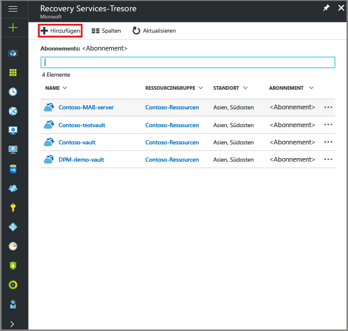

<properties
   pageTitle="Sichern von Dateien und Ordnern unter Windows mit Azure Backup unter Verwendung des Resource Manager-Bereitstellungsmodells | Microsoft Azure"
   description="Hier erfahren Sie, wie Sie Ihre Windows Server-Daten sichern, indem Sie einen Tresor erstellen, den Recovery Services-Agent installieren und Dateien und Ordner in Azure sichern."
   services="backup"
   documentationCenter=""
   authors="markgalioto"
   manager="cfreeman"
   editor=""
   keywords="Sichern; Sicherung"/>

<tags
   ms.service="backup"
   ms.workload="storage-backup-recovery"
   ms.tgt_pltfrm="na"
   ms.devlang="na"
   ms.topic="hero-article"
   ms.date="09/27/2016"
   ms.author="markgal;"/>

# Einführung: Sichern von Dateien und Ordnern mit Azure Backup unter Verwendung des Resource Manager-Bereitstellungsmodells

In diesem Artikel erfahren Sie, wie Sie Dateien und Ordner eines Windows-Servers (oder Windows-Clients) mithilfe von Azure Backup und Resource Manager in Azure sichern. Dies ist ein Tutorial, in dem die Grundlagen beschrieben werden. Wenn Sie mit Azure Backup starten möchten, befinden Sie sich am richtigen Ort.

Falls Sie weitere Informationen zu Azure Backup erhalten möchten, können Sie diese [Übersicht](backup-introduction-to-azure-backup.md) lesen.

Zum Sichern von Dateien und Ordnern in Azure sind die folgenden Aktivitäten erforderlich:

 Registrieren Sie sich für ein Azure-Abonnement (falls Sie noch keins besitzen).   Erstellen eines Recovery Services-Tresors   Herunterladen der erforderlichen Dateien   Installieren und Registrieren des Recovery Services-Agents   Sichern Ihrer Dateien und Ordner

## Schritt 1: Erhalten eines Azure-Abonnements

Falls Sie noch nicht über ein Azure-Abonnement verfügen, können Sie ein [kostenloses Konto](https://azure.microsoft.com/free/) erstellen, mit dem Sie auf alle Azure-Dienste zugreifen können.

## Schritt 2: Erstellen eines Recovery Services-Tresors

Um Ihre Dateien und Ordner zu sichern, müssen Sie einen Recovery Services-Tresor in der Region erstellen, in der die Daten gespeichert werden sollen. Außerdem müssen Sie festlegen, wie der Speicher repliziert werden soll.

### So erstellen Sie einen Recovery Services-Tresor

1. Melden Sie sich mit Ihrem Azure-Abonnement beim [Azure-Portal](https://portal.azure.com/) an, sofern Sie noch nicht angemeldet sind.

2. Klicken Sie im Hub-Menü auf **Durchsuchen**, geben Sie in der Liste mit den Ressourcen **Recovery Services** ein, und klicken Sie auf **Recovery Services-Tresore**.

      

3. Klicken Sie im Menü **Recovery Services-Tresore** auf **Hinzufügen**.

    

    Das Blatt „Recovery Services-Tresor“ wird geöffnet, und Sie werden aufgefordert, **Name**, **Abonnement**, **Ressourcengruppe** und **Standort** anzugeben.

    

4. Geben Sie unter **Name** einen Anzeigenamen für den Tresor ein.

5. Klicken Sie auf **Abonnement**, um die Liste mit den verfügbaren Abonnements anzuzeigen.

6. Klicken Sie auf **Ressourcengruppe**, um die Liste mit den verfügbaren Ressourcengruppen anzuzeigen, oder klicken Sie auf **Neu**, um eine neue Ressourcengruppe zu erstellen.

7. Klicken Sie auf **Standort**, um die geografische Region für den Tresor auszuwählen. Die Auswahl bestimmt die geografische Region, an die Ihre Sicherungsdaten gesendet werden.

8. Klicken Sie auf **Erstellen**.

    Sollte Ihr Tresor nach Abschluss des Vorgangs nicht in der Liste angezeigt werden, klicken Sie auf **Aktualisieren**. Klicken Sie in der aktualisierten Liste auf den Namen des Tresors.

### So bestimmen Sie die Speicherredundanz
Bei der erstmaligen Erstellung eines Recovery Services-Tresors bestimmen Sie, wie der Speicher repliziert werden soll.

1. Klicken Sie auf den neuen Tresor, um das Dashboard zu öffnen.

2. Klicken Sie auf dem Blatt **Einstellungen**, das automatisch zusammen mit Ihrem Tresordashboard geöffnet wird, auf **Backup Infrastructure** (Sicherungsinfrastruktur).

3. Klicken Sie auf dem Blatt „Sicherungsinfrastruktur“ auf **Sicherungskonfiguration**, um den **Speicherreplikationstyp** anzuzeigen.

    

4. Wählen Sie die passende Speicherreplikationsoption für Ihren Tresor aus.

    

    Standardmäßig verfügt Ihr Tresor über einen georedundanten Speicher. Wenn Sie Azure als primären Speicherendpunkt für die Sicherung verwenden, verwenden Sie weiterhin den georedundanten Speicher. Wenn Sie Azure nicht als primären Speicherendpunkt für die Sicherung verwenden, wählen Sie den lokal redundanten Speicher aus, um die Kosten für die Datenspeicherung in Azure zu verringern. Weitere Informationen zu den Optionen für [georedundanten](../storage/storage-redundancy.md#geo-redundant-storage) und [lokal redundanten](../storage/storage-redundancy.md#locally-redundant-storage) Speicher finden Sie in [dieser Übersicht](../storage/storage-redundancy.md).

Nachdem Sie nun über einen Tresor verfügen, können Sie Ihre Infrastruktur zum Sichern von Dateien und Ordnern vorbereiten, indem Sie den Microsoft Azure Recovery Services-Agent sowie Tresoranmeldeinformationen herunterladen.

## Schritt 3: Herunterladen der Dateien

1. Klicken Sie auf dem Dashboard des Recovery Services-Tresors auf **Einstellungen**.

    

2. Klicken Sie auf dem Blatt „Einstellungen“ auf **Erste Schritte > Sicherung**.

    

3. Klicken Sie auf dem Blatt „Sicherung“ auf **Sicherungsziel**.

    

4. Wählen Sie im Menü „Wo wird Ihre Workload ausgeführt?“ die Option **Lokal** aus.

5. Wählen Sie im Menü „Was möchten Sie sichern?“ die Option **Dateien und Ordner** aus, und klicken Sie anschließend auf **OK**.

### Herunterladen des Recovery Services-Agents

1. Klicken Sie auf dem Blatt **Infrastruktur vorbereiten** auf **Agent für Windows Server oder Windows-Client herunterladen**.

    

2. Klicken Sie im Downloadpopupfenster auf **Speichern**. Die Datei **MARSagentinstaller.exe** wird standardmäßig in Ihrem Downloadordner gespeichert.

### Herunterladen der Tresoranmeldedaten

1. Klicken Sie auf dem Blatt „Infrastruktur vorbereiten“ auf **Herunterladen > Speichern**.

    

## Schritt 4: Installieren und Registrieren des Agents

>[AZURE.NOTE] Die Aktivierung der Sicherung über das Azure-Portal wird in Kürze verfügbar. Aktuell wird der Microsoft Azure Recovery Services-Agent lokal zum Sichern von Dateien und Ordnern verwendet.

1. Doppelklicken Sie im Downloadordner (bzw. am entsprechenden Speicherort) auf die Datei **MARSagentinstaller.exe**.

2. Führen Sie die Schritte im Setup-Assistenten für den Microsoft Azure Recovery Services Agent aus. Zum Abschließen des Assistenten sind folgende Schritte erforderlich:

    - Wählen Sie einen Speicherort für den Installations- und Cacheordner aus.
    - Geben Sie Ihre Proxyserverinformationen an, wenn Sie einen Proxyserver verwenden, um eine Internetverbindung herzustellen.
    - Geben Sie die Informationen zum Benutzernamen und zum Kennwort ein, wenn Sie einen authentifizierten Proxy verwenden.
    - Angeben der heruntergeladenen Tresoranmeldeinformationen
    - Speichern Sie die Verschlüsselungspassphrase an einem sicheren Ort.

    >[AZURE.NOTE] Wenn Sie die Passphrase verlieren oder vergessen, kann Microsoft Ihnen bei der Wiederherstellung der Sicherungsdaten nicht behilflich sein. Speichern Sie die Datei daher an einem sicheren Ort. Sie ist erforderlich, um eine Sicherung wiederherzustellen.

Der Agent wurde jetzt installiert, und Ihr Computer wurde im Tresor registriert. Sie können die Sicherung jetzt konfigurieren und planen.

## Schritt 5: Sichern Ihrer Dateien und Ordner

Die erste Sicherung umfasst zwei wichtige Aufgaben:

- Planen der Sicherung
- Erstmaliges Sichern von Dateien und Ordnern

Für die erste Sicherung verwenden Sie den Microsoft Azure Recovery Services Agent.

### So planen Sie die Sicherung

1. Öffnen Sie den Microsoft Azure Recovery Services-Agent. Den Agent finden Sie, indem Sie auf Ihrem Computer nach **Microsoft Azure Backup** suchen.

    

2. Klicken Sie im der Recovery Services-Agent auf **Sicherung planen**.

    

3. Klicken Sie im Assistenten zum Planen der Sicherung auf der Seite mit den ersten Schritten auf **Weiter**.

4. Klicken Sie auf der Seite „Elemente für Sicherung auswählen“ auf **Elemente hinzufügen**.

5. Wählen Sie die Dateien und Ordner aus, die Sie sichern möchten, und klicken Sie auf **OK**.

6. Klicken Sie auf **Weiter**.

7. Geben Sie auf der Seite **Sicherungszeitplan angeben** den **Sicherungszeitplan** an, und klicken Sie auf **Weiter**.

    Sie können tägliche (maximal drei pro Tag) oder wöchentliche Sicherungen planen.

    

    >[AZURE.NOTE] Weitere Informationen zum Angeben des Sicherungszeitplans finden Sie im Artikel [Verwenden von Azure Backup als Ersatz für Ihre Bandinfrastruktur](backup-azure-backup-cloud-as-tape.md).

8. Wählen Sie auf der Seite **Aufbewahrungsrichtlinie auswählen** die **Aufbewahrungsrichtlinie** für die Sicherungskopie aus.

    Die Aufbewahrungsrichtlinie gibt an, wie lange die Sicherung gespeichert werden soll. Statt lediglich eine einfache Richtlinie für alle Sicherungspunkte anzugeben, können Sie je nach Sicherungszeitpunkt verschiedene Aufbewahrungsrichtlinien festlegen. Sie können die tägliche, wöchentliche, monatliche und jährliche Aufbewahrungsrichtlinie an Ihre Anforderungen anpassen.

9. Wählen Sie auf der Seite „Erstsicherungstyp wählen“ den Typ für die erste Sicherung. Lassen Sie die Option **Automatisch über das Netzwerk** aktiviert, und klicken Sie auf **Weiter**.

    Sie können die Sicherung automatisch über das Netzwerk oder offline durchführen. In den verbleibenden Abschnitten dieses Artikels wird das Verfahren für eine automatische Sicherung beschrieben. Falls Sie vorziehen, eine Offlinesicherung durchzuführen, finden Sie unter [Workflow zur Offlinesicherung in Azure Backup](backup-azure-backup-import-export.md) weitere Informationen.

10. Lesen Sie sich die Informationen auf der Seite „Bestätigung“ durch, und klicken Sie dann auf **Fertig stellen**.

11. Klicken Sie auf **Schließen**, nachdem der Assistent die Erstellung des Sicherungszeitplans abgeschlossen hat.

### So führen Sie erstmals eine Sicherung von Dateien und Ordnern durch

1. Klicken Sie im Recovery Services-Agent auf **Jetzt sichern**, um das anfängliche Seeding über das Netzwerk abzuschließen.

    

2. Überprüfen Sie auf der Seite „Bestätigung“ die Einstellungen, die vom Assistenten für die sofortige Sicherung zum Sichern des Computers verwendet werden. Klicken Sie dann auf **Sichern**.

3. Klicken Sie auf **Schließen**, um den Assistenten zu schließen. Wenn Sie auf „Schließen“ klicken, bevor der Sicherungsvorgang abgeschlossen ist, wird der Assistent im Hintergrund weiter ausgeführt.

Nach Abschluss des ersten Backups wird der Status des Auftrags in der Backup-Konsole als **Auftrag abgeschlossen** angezeigt.

## Fragen?
Wenn Sie Fragen haben oder Anregungen zu gewünschten Funktionen mitteilen möchten, [senden Sie uns Ihr Feedback](http://aka.ms/azurebackup_feedback).

## Nächste Schritte
- Informieren Sie sich ausführlicher über das [Sichern von Windows-Computern](backup-configure-vault.md).
- Nachdem Sie nun Ihre Dateien und Ordner gesichert haben, können Sie [Ihre Tresore und Server verwalten](backup-azure-manage-windows-server.md).
- Informationen zum Wiederherstellen einer Sicherung finden Sie im Artikel zum [Wiederherstellen von Dateien auf einem Windows-Computer](backup-azure-restore-windows-server.md).

<!---HONumber=AcomDC_0928_2016-->