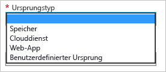

# Erste Schritte mit Azure CDN
In diesem Thema werden die Schritte zum Aktivieren von Azure CDN durch Erstellung eines neuen CDN-Profils und -Endpunkts erläutert.

> [!IMPORTANT]
> Eine Einführung in die Funktionsweise von CDN sowie eine Liste der Features finden Sie in der [Übersicht über CDN](cdn-overview.md).
> 
> 

## Erstellen eines neuen CDN-Profils
Ein CDN-Profil ist eine Sammlung von CDN-Endpunkten.  Jedes Profil enthält mindestens einen CDN-Endpunkt.  Sie können mehrere Profile verwenden, um Ihre CDN-Endpunkte nach Internetdomäne, Webanwendung oder anderen Kriterien zu organisieren.

> [!NOTE]
> Ein einzelnes Azure-Abonnement ist standardmäßig auf acht CDN-Profile beschränkt. Jedes CDN-Profil ist auf zehn CDN-Endpunkte beschränkt.
> 
> Die Preise für Azure CDN gelten auf der Ebene von CDN-Profilen. Wenn Sie die Azure CDN-Tarife kombinieren möchten, benötigen Sie mehrere CDN-Profile.
> 
> 

[!INCLUDE [cdn-create-profile](../../includes/cdn-create-profile.md)]

## Erstellen eines neuen CDN-Endpunkts
**So erstellen Sie einen neuen CDN-Endpunkt**

1. Navigieren Sie im [Azure-Portal](https://portal.azure.com)zu Ihrem CDN-Profil.  Eventuell haben Sie es im vorherigen Schritt an das Dashboard angeheftet.  Andernfalls können Sie es ermitteln, indem Sie nacheinander auf **Durchsuchen**, und **CDN-Profile** und dann auf das Profil klicken, dem Sie den Endpunkt hinzufügen möchten.
   
    Das Blatt für das CDN-Profil wird angezeigt.
   
    ![CDN-Profil][cdn-profile-settings]
2. Klicken Sie auf die Schaltfläche **Endpunkt hinzufügen** .
   
    ![Schaltfläche „Endpunkt hinzufügen“][cdn-new-endpoint-button]
   
    Das Blatt **Endpunkt hinzufügen** wird angezeigt.
   
    ![Blatt „Endpunkt hinzufügen“][cdn-add-endpoint]
3. Geben Sie einen **Namen** für diesen CDN-Endpunkt ein.  Dieser Name wird für den Zugriff auf die zwischengespeicherten Ressourcen in der Domäne `<endpointname>.azureedge.net`verwendet.
4. Wählen Sie in der Dropdownliste **Ursprungstyp** Ihren Ursprungstyp aus.  Wählen Sie **Storage** für ein Azure-Speicherkonto, **Clouddienst** für einen Azure-Clouddienst, **Web-App** für eine Azure-Web-App oder **Benutzerdefinierter Ursprung** für einen öffentlich zugänglichen Webserver (in Azure oder anderswo gehostet).
   
    
5. Wählen Sie in der Dropdownliste **Ursprungshostname** Ihre Ursprungsdomäne aus bzw. geben Sie sie ein.  In der Dropdownliste werden alle verfügbaren Ursprungstypen aufgelistet, die Sie in Schritt 4 angegeben haben.  Bei Auswahl von *Benutzerdefinierter Ursprung* als **Ursprungstyp** geben Sie die Domäne Ihres benutzerdefinierten Ursprungs ein.
6. Geben Sie im Textfeld **Ursprünglicher Pfad** den Pfad zu den Ressourcen ein, die Sie zwischenspeichern möchten, oder lassen Sie das Feld leer, um das Zwischenspeichern aller Ressourcen in der Domäne zuzulassen, die Sie in Schritt 5 angegeben haben.
7. Geben Sie unter **Header des Ursprungshosts**den Hostheader ein, den das CDN bei jeder Anforderung senden soll, oder übernehmen Sie den Standardwert.
   
   > [!WARNING]
   > Bei einigen Ursprungstypen wie etwa Azure Storage und Web-Apps muss der Hostheader mit der Domäne des Ursprungs übereinstimmen. Verwenden Sie den Standardwert, es sei denn, Sie nutzen einen Ursprung, bei dem der Hostheader von der Domäne abweichen muss.
   > 
   > 
8. Geben Sie unter **Protokoll** und **Ursprungsport** die Protokolle und Ports an, über die auf die Ressourcen am Ursprung zugegriffen werden soll.  Sie müssen mindestens ein Protokoll (HTTP oder HTTPS) auswählen.
   
   > [!NOTE]
   > Der **Ursprungsport** bezieht sich nur darauf, welchen Port der Endpunkt zum Abrufen von Informationen vom Ursprung verwendet.  Der Endpunkt selbst ist nur für Endclients auf den Standard-HTTP- und -HTTPS-Ports (80 und 443) verfügbar, unabhängig vom **Ursprungsport**.  
   > 
   > **Azure CDN von Akamai** lassen nicht den vollständigen TCP-Portbereich für Ursprünge zu.  Eine Liste der nicht zulässigen Ursprungsports finden Sie unter [Azure CDN from Akamai Allowed Origin Ports](https://msdn.microsoft.com/library/mt757337.aspx)(Azure CDN von Akamai – Zulässige Ursprungsports).  
   > 
   > Der Zugriff auf CDN-Inhalte über HTTPS weist folgende Einschränkungen auf:
   > 
   > * Sie müssen das vom CDN bereitgestellte SSL-Zertifikat verwenden. Zertifikate von Drittanbietern werden nicht unterstützt.
   > * Sie müssen die vom CDN bereitgestellte Domäne (`<endpointname>.azureedge.net`) verwenden, um auf HTTPS-Inhalte zuzugreifen. HTTPS-Unterstützung ist für benutzerdefinierte Domänennamen (CNAMEs) nicht verfügbar, da das CDN derzeit keine benutzerdefinierten Zertifikate unterstützt.
   > 
   > 
9. Klicken Sie auf die Schaltfläche **Hinzufügen** , um den neuen Endpunkt zu erstellen.
10. Sobald der Endpunkt erstellt wurde, wird er in einer Liste von Endpunkten für das Profil angezeigt. In der Listenansicht werden der URL für den Zugriff auf zwischengespeicherte Inhalte sowie die Ursprungsdomäne angezeigt.
    
    ![CDN-Endpunkt][cdn-endpoint-success]
    
    > [!IMPORTANT]
    > Der Endpunkt kann nicht sofort verwendet werden, da die Verteilung der Registrierung über das CDN eine Weile dauern kann.  Geben Sie unter <b>Azure CDN von Akamai</b> ist die Weitergabe in der Regel innerhalb einer Minute abgeschlossen.  Bei <b>Azure CDN von Verizon</b>-Profilen ist die Weitergabe in der Regel in 90 Minuten abgeschlossen, in manchen Fällen kann es aber länger dauern.
    > 
    > Benutzer, die versuchen, den CDN-Domänennamen zu verwenden, bevor die Endpunktkonfiguration an die POPs verteilt wurde, erhalten den Antwortcode „HTTP 404“.  Wenn Sie ein paar Stunden nach der Erstellung des Endpunkts noch immer 404-Meldungen erhalten, finden Sie unter [Troubleshooting CDN endpoints returning 404 statuses](cdn-troubleshoot-endpoint.md)(Problembehandlung bei CDN-Endpunkten mit Status 404) weitere Informationen.
    > 
    > 

## Siehe auch
* [Steuern des Zwischenspeicherverhaltens von Anforderungen mit Abfragezeichenfolgen](cdn-query-string.md)
* [Zuordnen von CDN-Inhalt (Content Delivery Network) zu einer benutzerdefinierten Domäne](cdn-map-content-to-custom-domain.md)
* [Vorabladen von Assets auf einen Azure CDN-Endpunkt](cdn-preload-endpoint.md)
* [Löschen eines Azure CDN-Endpunkts](cdn-purge-endpoint.md)
* [Troubleshooting CDN endpoints returning 404 statuses (Problembehandlung bei CDN-Endpunkten mit Status 404)](cdn-troubleshoot-endpoint.md)

[cdn-profile-settings]: ./media/cdn-create-new-endpoint/cdn-profile-settings.png
[cdn-new-endpoint-button]: ./media/cdn-create-new-endpoint/cdn-new-endpoint-button.png
[cdn-add-endpoint]: ./media/cdn-create-new-endpoint/cdn-add-endpoint.png
[cdn-endpoint-success]: ./media/cdn-create-new-endpoint/cdn-endpoint-success.png

<!--HONumber=Jan17_HO4-->

