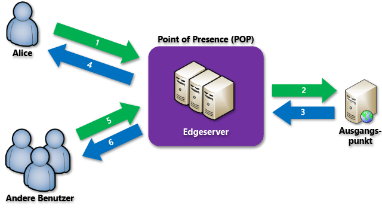

<properties
	pageTitle="Übersicht über das Azure CDN"
	description="Erfahren Sie, was das Azure Content Delivery Network (CDN, Netzwerk für die Inhaltsübermittlung) ist und wie es für die Übermittlung breitbandiger Inhalte eingesetzt wird, indem Blobs und statische Inhalte zwischengespeichert werden."
	services="cdn"
	documentationCenter=".NET"
	authors="camsoper"
	manager="erikre"
	editor=""/>

<tags
	ms.service="cdn"
	ms.workload="tbd"
	ms.tgt_pltfrm="na"
	ms.devlang="na"
	ms.topic="hero-article"
	ms.date="06/06/2016"
	ms.author="casoper"/>

# Übersicht über das Azure Content Delivery Network (CDN)

> [AZURE.NOTE] In diesem Dokument wird beschrieben, worum es sich beim Azure Content Delivery Network (CDN) handelt, wie es funktioniert und über welche Features die einzelnen Azure CDN-Produkte verfügen. Wenn Sie diese Informationen überspringen und direkt auf ein Tutorial zum Erstellen eines CDN-Endpunkts zugreifen möchten, helfen Ihnen die Informationen unter [Verwenden von Azure CDN](cdn-create-new-endpoint.md) weiter. Eine Liste mit den aktuellen CDN-Knotenstandorten finden Sie unter [POP-Standorte von Azure Content Delivery Network (CDN)](cdn-pop-locations.md).

Das Azure Content Delivery Network (CDN) speichert statische Webinhalte an strategisch platzierten Standorten zwischen, um beim Bereitstellen von Inhalten für Benutzer einen maximalen Durchsatz zu ermöglichen. Das CDN bietet Entwicklern eine globale Lösung für die Übermittlung von Inhalten mit hoher Bandbreite durch Zwischenspeichern der Inhalte auf physischen Knoten auf der ganzen Welt.

Die Verwendung des CDN zum Zwischenspeichern von Websiteobjekten bietet folgende Vorteile:

- Bessere Leistung und höhere Benutzerfreundlichkeit für Endbenutzer, vor allem bei Verwendung von Anwendungen, für die zum Laden von Inhalten mehrere Roundtrips erforderlich sind
- Umfassende Skalierung, um hohe Lasten zu Beginn eines Ereignisses, z.B. bei einer Produkteinführung, besser verarbeiten zu können
- Durch das Verteilen der Benutzeranforderungen und die Bereitstellung von Inhalten über Edgeserver entfällt weniger Datenverkehr auf den Ursprung der Inhalte

## So funktioniert's

1. Ein Benutzer (Alice) fordert eine Datei (auch als „Asset“ bezeichnet) über eine URL mit einem speziellen Domänennamen an, z.B. `<endpointname>.azureedge.net`. DNS leitet die Anforderung an den Point-of-Presence-Standort (POP) mit der besten Leistung weiter. In der Regel ist dies der POP, der dem Benutzer geografisch am nächsten liegt.

2. Wenn die Datei nicht im Cache der Edgeserver am POP enthalten ist, fordert der Edgeserver die Datei vom Ursprung an. Beim Ursprung kann es sich um eine Azure-Web-App, einen Azure Cloud Service, ein Azure Storage-Konto oder einen beliebigen öffentlich zugänglichen Webserver handeln.

3. Der Ursprung gibt die Datei an den Edgeserver zurück, und zwar einschließlich der optionalen HTTP-Header, in denen die Lebensdauer (Time-To-Live, TTL) beschrieben wird.

4. Der Edgeserver speichert die Datei zwischen und gibt sie an die ursprüngliche anfordernde Person (Alice) zurück. Die Datei bleibt auf dem Edgeserver so lange zwischengespeichert, bis die Lebensdauer abläuft. Falls vom Ursprung kein TTL-Wert angegeben wurde, wird der Standardwert von 7 Tagen verwendet.

5. Weitere Benutzer (z.B. Bob) können die Datei dann über dieselbe URL anfordern und werden ggf. auch an denselben POP geleitet.

6. Sofern die Lebensdauer der Datei noch nicht abgelaufen ist, gibt der Edgeserver die Datei aus dem Cache zurück. Dies führt zu schnellen Reaktionen und somit zu einer höheren Benutzerfreundlichkeit.

## Azure CDN-Features

Es gibt drei Azure CDN-Produkte: **Azure CDN Standard von Akamai**, **Azure CDN Standard von Verizon** und **Azure CDN Premium von Verizon**. Die folgende Tabelle listet die Features auf, die bei jedem Produkt zur Verfügung stehen.

| | Standard Akamai | Standard Verizon | Premium Verizon |
|-------|-----------------|------------------|-----------------|
| Einfache Integration in Azure-Dienste wie [Storage](cdn-create-a-storage-account-with-cdn.md), [Cloud Services](cdn-cloud-service-with-cdn.md), [Web-Apps](../app-service-web/cdn-websites-with-cdn.md) und [Media Services](../media-services/media-services-manage-origins.md#enable_cdn) | **&#x2713;** | **&#x2713;** | **&#x2713;**|
| HTTPS-Unterstützung | **&#x2713;** | **&#x2713;** | **&#x2713;** |
| Lastenausgleich | **&#x2713;** | **&#x2713;** | **&#x2713;** |
| DDoS-Schutz | **&#x2713;** | **&#x2713;** | **&#x2713;** |
| Dualer IPv4-/IPv6-Stapel | **&#x2713;** | **&#x2713;** | **&#x2713;** |
| [Unterstützung benutzerdefinierter Domänennamen](cdn-map-content-to-custom-domain.md) | **&#x2713;** | **&#x2713;** | **&#x2713;** |
| [Zwischenspeicherung von Abfragezeichenfolgen](cdn-query-string.md) | **&#x2713;** | **&#x2713;** | **&#x2713;** |
| [Länderfilter](cdn-restrict-access-by-country.md) | | **&#x2713;** | **&#x2713;** |
| [Schnelles Löschen](cdn-purge-endpoint.md) | **&#x2713;** | **&#x2713;** | **&#x2713;** |
| [Vorabladen von Assets](cdn-preload-endpoint.md) | | **&#x2713;** | **&#x2713;** |
| [Wichtige Analysen](cdn-analyze-usage-patterns.md) | | **&#x2713;** | **&#x2713;** |
| [Verwaltung über die REST-API](https://msdn.microsoft.com/library/mt634456.aspx) | **&#x2713;** | **&#x2713;** | **&#x2713;** |
| [Anpassbares, regelbasiertes Modul zur Inhaltsübermittlung](cdn-rules-engine.md) | | | **&#x2713;** |
| [Erweiterte HTTP-Berichte](cdn-advanced-http-reports.md) | | | **&#x2713;** |
| [Echtzeitstatistiken](cdn-real-time-stats.md) | | | **&#x2713;** |

## Nächste Schritte

Informationen zu den ersten Schritten mit CDN finden Sie unter [Verwenden von Azure CDN](./cdn-create-new-endpoint.md).

Wenn Sie bereits CDN-Kunde sind, können Sie jetzt Ihre CDN-Endpunkte über das [Microsoft Azure-Portal](https://portal.azure.com) verwalten.

Im [Video zu unserer Build 2016-Veranstaltung](https://azure.microsoft.com/documentation/videos/build-2016-leveraging-the-new-azure-cdn-apis-to-build-wicked-fast-applications/) können Sie das CDN in Aktion sehen.

Preisinformationen finden Sie unter [Content Delivery Network (CDN) – Preise](https://azure.microsoft.com/pricing/details/cdn/).

Gibt es eine Funktion, die Sie sich für Azure CDN wünschen? [Geben Sie uns Feedback!](https://feedback.azure.com/forums/169397-cdn)

<!---HONumber=AcomDC_0608_2016-->