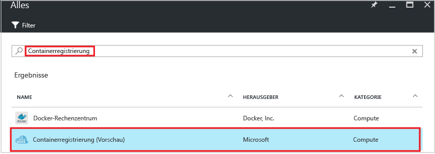
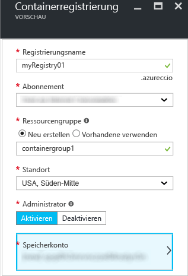
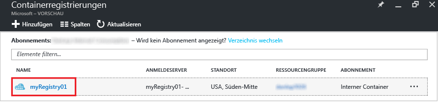
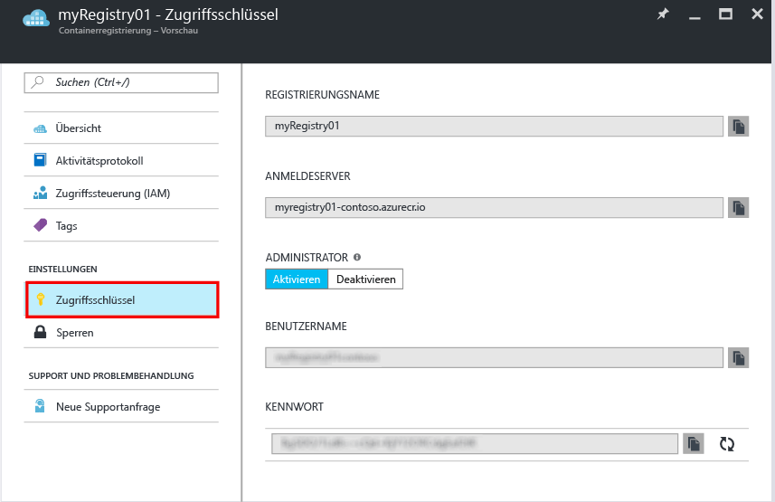

# Erstellen einer privaten Docker-Containerregistrierung mit dem Azure-Portal
Verwenden Sie das Azure-Portal, um eine Containerregistrierung zu erstellen und die dazugehörigen Einstellungen zu verwalten. Sie können Containerregistrierungen auch mit den [Azure CLI 2.0-Befehlen](container-registry-get-started-azure-cli.md) oder programmgesteuert mit der [REST-API](https://go.microsoft.com/fwlink/p/?linkid=834376) für die Containerregistrierung erstellen und verwalten.

Hintergrundinformationen und Konzepte finden Sie in der [Übersicht](container-registry-intro.md).

> [!NOTE]
> Die Containerregistrierung befindet sich derzeit in der Vorschauphase.

## Erstellen einer Containerregistrierung
1. Klicken Sie im [Portal](https://portal.azure.com) auf **+ Neu**.
2. Durchsuchen Sie den Marketplace nach **Containerregistrierung**.
3. Wählen Sie **Containerregistrierung (Vorschau)** und als Herausgeber **Microsoft**. 
    
4. Klicken Sie auf **Erstellen**. Das Blatt **Containerregistrierung** wird angezeigt.

    
5. Geben Sie auf dem Blatt **Containerregistrierung** die folgenden Informationen ein. Klicken Sie auf **Erstellen**, wenn Sie fertig sind.
   
    a. **Registrierungsname**: Ein global eindeutiger Name einer Domäne der obersten Ebene für Ihre jeweilige Registrierung. In diesem Beispiel lautet der Registrierungsname *myRegistry01*. Ersetzen Sie ihn durch einen eigenen eindeutigen Namen. Der Name darf nur Buchstaben und Ziffern enthalten.
   
    b. **Ressourcengruppe**: Wählen Sie eine vorhandene [Ressourcengruppe](../azure-resource-manager/resource-group-overview.md#resource-groups) aus, oder geben Sie den Namen für eine neue Ressourcengruppe ein. 
   
    c. **Standort**: Wählen Sie den Standort eines Azure-Datencenters aus, für den der Dienst [verfügbar](https://azure.microsoft.com/regions/services/) ist, z.B. **USA, Süden-Mitte**. 
   
    d. **Administratorbenutzer**: Bei Bedarf können Sie einem Administratorbenutzer Zugriff auf die Registrierung gewähren. Sie können diese Einstellung ändern, nachdem Sie die Registrierung erstellt haben.
   
    > [!IMPORTANT]
    > Neben der Gewährung des Zugriffs über ein Administratorbenutzerkonto unterstützen Containerregistrierungen die Authentifizierung anhand von Azure Active Directory-Dienstprinzipalen. Weitere Informationen und Beschreibungen von Aspekten finden Sie unter [Authenticate with a container registry](container-registry-authentication.md) (Authentifizieren mit einer Containerregistrierung).
    >
    
    e. **Speicherkonto**: Verwenden Sie die Standardeinstellung, um ein [Speicherkonto](../storage/storage-introduction.md) zu erstellen, oder wählen Sie ein vorhandenes Speicherkonto an demselben Standort aus. Storage Premium wird derzeit nicht unterstützt.

## Verwalten von Registrierungseinstellungen
Nach dem Erstellen der Registrierung können Sie im Portal über das Blatt **Containerregistrierungen** auf die Registrierungseinstellungen zugreifen. Beispielsweise benötigen Sie die Einstellungen ggf. zum Anmelden an Ihrer Registrierung, oder Sie möchten den Administratorbenutzer aktivieren oder deaktivieren.

1. Klicken Sie auf dem Blatt **Containerregistrierungen** auf den Namen Ihrer Registrierung.
   
    
2. Klicken Sie zum Verwalten von Zugriffseinstellungen auf **Zugriffsschlüssel**.
   
    
3. Beachten Sie die folgenden Einstellungen:
   
   * **Anmeldeserver**: Der vollqualifizierte Name, den Sie zum Anmelden an der Registrierung verwenden. In diesem Beispiel lautet er `myregistry01-contoso.azurecr.io`.
   * **Administratorbenutzer**: Hier können Sie das Administratorbenutzerkonto der Registrierung aktivieren bzw. deaktivieren.
   * **Benutzername** und **Kennwort**: Die Anmeldeinformationen des Administratorbenutzerkontos (sofern aktiviert), die Sie zum Anmelden an der Registrierung verwenden können. Optional können Sie das Kennwort neu generieren.

## Nächste Schritte
* [Freigeben Ihres ersten Image mit der Docker CLI](container-registry-get-started-docker-cli.md)

