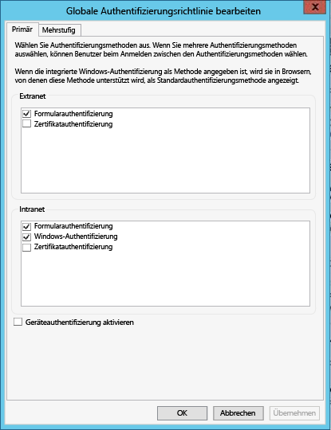

<properties
   pageTitle="Voraussetzungen für Azure Data Catalog | Microsoft Azure"
   description="Voraussetzungen für Azure Data Catalog – was Sie für Ihre ersten Schritte mit Azure Data Catalog benötigen."
   services="data-catalog"
   documentationCenter=""
   authors="steelanddata"
   manager="NA"
   editor=""
   tags=""/>
<tags
   ms.service="data-catalog"
   ms.devlang="NA"
   ms.topic="article"
   ms.tgt_pltfrm="NA"
   ms.workload="data-catalog"
   ms.date="09/21/2016"
   ms.author="maroche"/>

# Azure Data Catalog-Voraussetzungen

## Wie steige ich in Azure Data Catalog ein?

Es gibt einige Dinge, die Sie erledigen müssen, bevor Sie **Azure Data Catalog** einrichten können. Keine Sorge, das wird nicht lange dauern!

## Azure-Abonnement
Um den Azure Data Catalog einzurichten, müssen Sie Besitzer oder Mitbesitzer eines Azure-Abonnements sein.

Mit Azure-Abonnements können Sie den Zugriff auf die Clouddienstressourcen wie Azure Data Catalog organisieren. Mit diesen Abonnements können Sie darüber hinaus steuern, wie die Ressourcennutzung gemeldet, abgerechnet und bezahlt wird. Jedes Abonnement kann in Bezug auf Abrechnung und Zahlung unterschiedlich eingerichtet sein, daher können Sie je nach Abteilung, Projekt, Niederlassung usw. verschiedene Abonnements und verschiedene Pläne haben. Jeder Clouddienst gehört zu einem Abonnement, und Sie benötigen ein Abonnement vor dem Einrichten von Azure Data Catalog. Weitere Informationen finden Sie unter [Verwalten von Konten, Abonnements und Administratorrollen](../active-directory/active-directory-assign-admin-roles.md).

## Azure Active Directory
Um Azure Data Catalog einzurichten, müssen Sie mit einem Azure Active Directory-Benutzerkonto angemeldet sein.

Azure Active Directory (Azure AD) bietet Ihrem Unternehmen eine einfache Möglichkeit für die Identitäts- und Zugriffsverwaltung – in der Cloud und lokal. Benutzer können ein einzelnes Arbeits- oder Schulkonto für das einmalige Anmelden bei Webanwendungen in der Cloud oder lokalen Webanwendung verwenden. Azure Data Catalog verwendet Azure AD für die Authentifizierung bei der Anmeldung. Weitere Informationen finden Sie unter [Was ist Azure Active Directory?](../active-directory/active-directory-whatis.md)

> [AZURE.NOTE] Über das [Azure-Portal](http://portal.azure.com/) können sich Benutzer entweder mit einem persönlichen Microsoft-Konto oder mit einem Geschäfts-, Schul- oder Unikonto für Azure Active Directory anmelden. Zum Einrichten von Azure Data Catalog mit dem Azure-Portal oder dem [Data Catalog-Portal](http://www.azuredatacatalog.com) müssen Sie mit einem Azure Active Directory-Konto und nicht einem persönlichen Konto angemeldet sein.

## Active Directory-Richtlinienkonfiguration

Es gibt Situationen, in denen Benutzer sich beim Azure Data Catalog-Portal anmelden können, jedoch bei dem Versuch, sich beim Tool zum Registrieren von Datenquellen anzumelden, eine Fehlermeldung erhalten, die die Anmeldung verhindert. Dieses Problem tritt möglicherweise nur dann auf, wenn der Benutzer über das Unternehmensnetzwerk arbeitet oder wenn der Benutzer von außerhalb des Unternehmensnetzwerks eine Verbindung herstellt.

Das Tool zum Registrieren von Datenquellen verwendet die Formularauthentifizierung, um Benutzeranmeldungen für Active Directory zu überprüfen. Für eine erfolgreiche Anmeldung muss die Formularauthentifizierung durch einen Active Directory-Administrator in der globalen Authentifizierungsrichtlinie aktiviert sein.

Mit der globalen Authentifizierungsrichtlinie können separate Authentifizierungsmethoden für Intranet- und Extranetverbindungen aktiviert werden, wie nachstehend veranschaulicht. Anmeldefehler können auftreten, wenn die Formularauthentifizierung nicht für das Netzwerk aktiviert ist, aus dem der Benutzer eine Verbindung herstellt.

 

Weitere Informationen finden Sie unter [Konfigurieren von Authentifizierungsrichtlinien](https://technet.microsoft.com/library/dn486781.aspx).

<!---HONumber=AcomDC_0921_2016-->