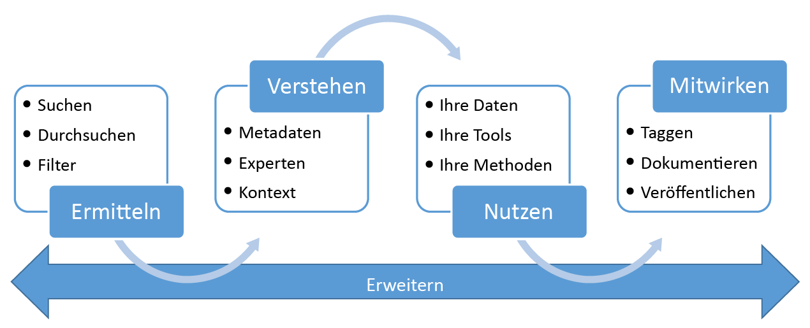

<properties
   pageTitle="Was ist Azure Data Catalog? | Microsoft Azure"
   description="Dieser Artikel enthält eine Übersicht über Microsoft Azure Data Catalog, einschließlich seiner Funktionen und der Probleme, die er beheben soll. Data Catalog enthält Funktionen, mit denen alle Benutzer – von Analysten über Datenwissenschaftler bis hin zu Entwicklern – Datenquellen registrieren, ermitteln, verstehen und nutzen können."
   services="data-catalog"
   documentationCenter=""
   authors="steelanddata"
   manager="NA"
   editor=""
   tags=""/>
<tags
   ms.service="data-catalog"
   ms.devlang="NA"
   ms.topic="get-started-article"
   ms.tgt_pltfrm="NA"
   ms.workload="data-catalog"
   ms.date="09/21/2016"
   ms.author="maroche"/>

# Was ist Azure Data Catalog?

Azure Data Catalog ist ein vollständig verwalteter Clouddienst, mit dem Benutzer die benötigten Datenquellen ermitteln und die Ergebnisse besser verstehen können. Unternehmen können mit ihren vorhandenen Investitionen so einen höheren Wert erzielen. Data Catalog enthält Funktionen, mit denen alle Benutzer – von Analysten über Datenwissenschaftler bis hin zu Entwicklern – Datenquellen ermitteln, verstehen und nutzen können. Data Catalog umfasst ein Crowdsourcing-Modell für Metadaten und Anmerkungen und ermöglicht es allen Benutzern, ihr Wissen zum Aufbau einer Community und Datenkultur beizusteuern.

## Aufgaben der Ermittlung für Datennutzer

Das Ermitteln der Datenquellen von Unternehmen war bisher ein natürlicher Prozess, der auf „Stammeswissen“ basierte. Dies schafft für Unternehmen, die aus ihren Informationsassets den größtmöglichen Nutzen ziehen möchten, eine Vielzahl von Problemen.

-	Benutzer wissen erst, dass Datenquellen vorhanden sind, wenn sie im Rahmen eines anderen Prozesses darauf stoßen. Es gibt keinen zentralen Speicherort, an dem Datenquellen registriert sind.
-	Nur wenn ein Benutzer den Speicherort der Datenquelle kennt, kann er mit einer Clientanwendung eine Verbindung damit herstellen. Für Oberflächen zur Datennutzung ist es erforderlich, dass Benutzer die Verbindungszeichenfolge bzw. den Pfad kennen.
-	Wenn ein Benutzer den Speicherort der Dokumentation für eine Datenquelle nicht kennt, kann er die beabsichtigte Verwendung der Daten nicht verstehen. Datenquellen und Dokumentation liegen an unterschiedlichen Orten vor und werden über unterschiedliche Umgebungen genutzt.
-	Wenn ein Benutzer Fragen zu einem Informationsasset hat, muss er den für die Daten verantwortlichen Experten bzw. das Team finden und diese Experten offline ansprechen. Es besteht keine explizite Verbindung zwischen Daten und den Personen, die dafür über Expertenwissen zur Nutzung verfügen.
-  Ein Benutzer muss den Prozess zum Anfordern des Zugriff auf die Datenquelle verstehen. Mit der ermittelten Datenquelle und der dazugehörigen Dokumentation allein kann er nämlich noch nicht auf die benötigten Daten zugreifen.

## Aufgaben der Ermittlung für Datenproduzenten

Oben sind die Hürden für die Nutzer der Daten angegeben, aber auch für Benutzer, die für die Erstellung und Pflege von Informationsassets verantwortlich sind, gelten besondere Anforderungen.

-	Das Versehen von Datenquellen mit beschreibenden Metadaten führt häufig nicht zum gewünschten Erfolg. Beschreibungen, die in der Datenquelle gespeichert sind, werden von Clientanwendungen meist ignoriert.
-	Das Erstellen von Dokumentation für Datenquellen ist oft sinnlos. Die ständige Synchronisierung der Dokumentation mit der Datenquelle ist eine kontinuierliche Aufgabe, und Benutzer haben kein Vertrauen in die Dokumentation, da sie häufig als veraltet angesehen wird.
- Eine beständige Herausforderung besteht darin, den Zugriff auf die Datenquelle zu beschränken und sicherzustellen, dass die Datennutzer wissen, wie sie den Zugriff anfordern.

Das Erstellen und Pflegen der Dokumentation für eine Datenquelle ist komplex und zeitaufwendig. Dies gilt in noch stärkerem Maße für die Aufgabe, die Dokumentation für alle Personen leicht zugänglich zu machen, die die Datenquelle verwenden.

Zusammen stellen diese Probleme eine erhebliche Hürde für Unternehmen dar, die die Nutzung und das Verständnis der Unternehmensdaten fördern möchten.

## Hilfe von Azure Data Catalog

Data Catalog ist für die Lösung dieser Probleme ausgelegt und ermöglicht es Unternehmen, mit den vorhandenen Datenressourcen den größten Nutzen zu erzielen. Data Catalog leistet Unterstützung, indem Datenquellen leicht ermittelbar gestaltet werden und von den Benutzern, die die verwalteten Daten benötigen, leicht verstanden werden.

Data Catalog bietet einen cloudbasierten Dienst, unter dem Datenquellen registriert werden können. Die Daten verbleiben an ihrem vorhandenen Speicherort, aber eine Kopie der Metadaten wird Data Catalog hinzugefügt – zusammen mit einem Verweis auf den Speicherort der Datenquelle. Diese Metadaten werden außerdem indiziert, damit jede Datenquelle per Suchfunktion leicht ermittelt werden kann und für die Benutzer verständlich ist, die sie ermitteln.

Nachdem eine Datenquelle registriert wurde, können die dazugehörigen Metadaten erweitert werden. Dies kann entweder von dem Benutzer übernommen werden, der die Registrierung durchgeführt hat, oder von anderen Benutzern des Unternehmens. Alle Benutzer können eine Datenquelle mit Anmerkungen versehen, indem Beschreibungen, Tags oder andere Metadaten bereitgestellt werden, z. B. Dokumentation und Prozesse für das Anfordern des Datenquellenzugriffs. Diese beschreibenden Metadaten sind eine Erweiterung der strukturellen Metadaten (z.B. Spaltennamen und Datentypen), die für die Datenquelle registriert wurden.

Das Ermitteln und Verstehen von Datenquellen und ihrer Nutzung sind der Hauptzweck bei der Registrierung von Quellen. Wenn Benutzer in Unternehmen Daten für ihre Arbeit benötigen (z. B. Business Intelligence, Anwendungsentwicklung, Datenwissenschaft oder andere Aufgaben, die spezielle Daten erfordern), können sie die Data Catalog-Ermittlungsoberfläche verwenden. Hiermit können sie schnell die passenden Daten für ihre Anforderungen finden, Daten auf ihre Eignung hin untersuchen und Daten nutzen, indem sie die Datenquelle im Tool ihrer Wahl öffnen. Zugleich ermöglicht es Data Catalog Benutzern durch Markieren, Dokumentieren und Kommentieren bereits registrierter Datenquellen sowie durch die Registrierung neuer Datenquellen, welche dann wiederum von anderen Benutzern des Katalogs gefunden, nachvollzogen und genutzt werden können, am Katalog mitzuarbeiten.

## Erste Schritte mit Data Catalog

Sie können noch heute mit der Nutzung von Data Catalog beginnen, indem Sie die Seite [www.azuredatacatalog.com](https://www.azuredatacatalog.com) besuchen.

Einen Leitfaden zu den ersten Schritten finden Sie [hier](data-catalog-get-started.md).

## Weitere Informationen zu Data Catalog

Weitere Informationen zu den Funktionen von Data Catalog finden Sie unter:

* [Registrieren von Datenquellen](data-catalog-how-to-register.md)
* [Ermitteln von Datenquellen](data-catalog-how-to-discover.md)
* [Hinzufügen von Anmerkungen zu Datenquellen](data-catalog-how-to-annotate.md)
* [So dokumentieren Sie Datenquellen](data-catalog-how-to-documentation.md)
* [Herstellen einer Verbindung mit Datenquellen](data-catalog-how-to-connect.md)
* [Arbeiten mit großen Datenquellen in Azure Data Catalog](data-catalog-how-to-big-data.md)
* [Verwalten von Datenassets](data-catalog-how-to-manage.md)
* [Einrichten des Unternehmensglossars](data-catalog-how-to-business-glossary.md)
* [Häufig gestellte Fragen](data-catalog-frequently-asked-questions.md)

<!---HONumber=AcomDC_0921_2016--->