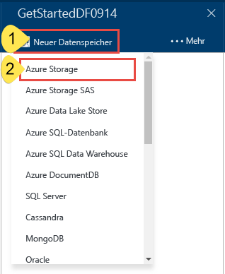
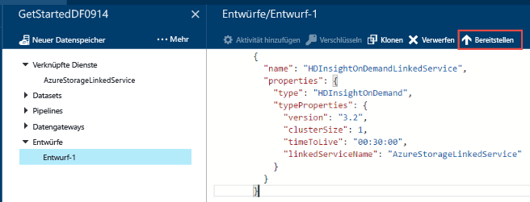
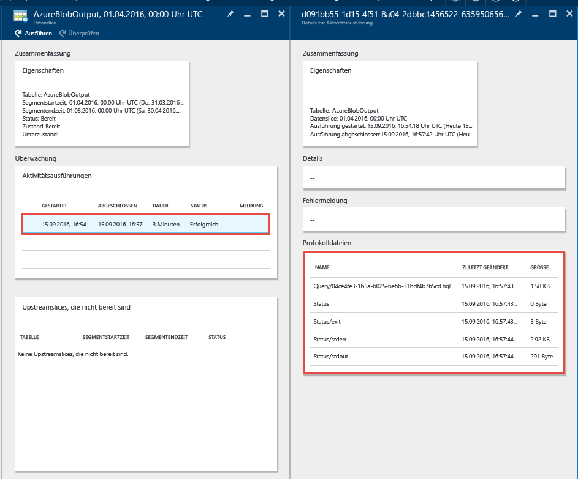

# <a name="tutorial-build-your-first-azure-data-factory-using-azure-portal"></a>Tutorial: Erstellen der ersten Azure Data Factory mit dem Azure-Portal
> [!div class="op_single_selector"]
> * [Übersicht und Voraussetzungen](data-factory-build-your-first-pipeline.md)
> * [Azure-Portal](data-factory-build-your-first-pipeline-using-editor.md)
> * [Visual Studio](data-factory-build-your-first-pipeline-using-vs.md)
> * [PowerShell](data-factory-build-your-first-pipeline-using-powershell.md)
> * [Resource Manager-Vorlage](data-factory-build-your-first-pipeline-using-arm.md)
> * [REST-API](data-factory-build-your-first-pipeline-using-rest-api.md)


In diesem Artikel erfahren Sie, wie Sie mithilfe des [Azure-Portals](https://portal.azure.com/) Ihre erste Azure Data Factory erstellen. Falls Sie das Tutorial mit anderen Tools/SDKs absolvieren möchten, wählen Sie in der Dropdownliste eine andere Option aus. 

Die Pipeline in diesem Tutorial enthält eine Aktivität: **HDInsight-Hive-Aktivität**. Bei dieser Aktivität wird ein Hive-Skript in einem Azure HDInsight-Cluster ausgeführt, mit dem Eingabedaten transformiert werden, um Ausgabedaten zu erhalten. Die Pipeline zwischen dem Start- und Endzeitpunkt wird einmal pro Monat ausgeführt. 

> [!NOTE]
> Die Datenpipeline in diesem Tutorial transformiert Eingabedaten in Ausgabedaten. Ein Tutorial zum Kopieren von Daten mithilfe von Azure Data Factory finden Sie unter [Kopieren von Daten aus Blob Storage in SQL-Datenbank mithilfe von Data Factory](data-factory-copy-data-from-azure-blob-storage-to-sql-database.md).
> 
> Eine Pipeline kann mehrere Aktivitäten enthalten. Sie können zwei Aktivitäten verketten (nacheinander ausführen), indem Sie das Ausgabedataset einer Aktivität als Eingabedataset der anderen Aktivität festlegen. Weitere Informationen finden Sie unter [Planung und Ausführung in einer Data Factory](data-factory-scheduling-and-execution.md#multiple-activities-in-a-pipeline).

## <a name="prerequisites"></a>Voraussetzungen
1. Lesen Sie sich den Artikel mit der [Übersicht über das Tutorial](data-factory-build-your-first-pipeline.md) durch, und führen Sie die erforderlichen Schritte aus, damit die **Voraussetzungen** erfüllt sind.
2. Dieser Artikel bietet keine grundlegende Übersicht über den Azure Data Factory-Dienst. Sie sollten den Artikel [Einführung in Azure Data Factory](data-factory-introduction.md) lesen, um eine ausführliche Übersicht über den Dienst zu erhalten.  

## <a name="create-data-factory"></a>Erstellen einer Data Factory
Eine Data Factory kann eine oder mehrere Aktivitäten aufweisen. Eine Pipeline kann eine oder mehrere Aktivitäten aufweisen. Beispielsweise eine Kopieraktivität zum Kopieren von Daten aus einer Quelle in einen Zieldatenspeicher und eine HDInsight-Hive-Aktivität zum Ausführen eines Hive-Skripts zum Transformieren von Eingabedaten in Produktausgabedaten. In diesem Schritt erstellen wir zunächst die Data Factory.

1. Melden Sie sich beim [Azure-Portal](https://portal.azure.com/)an.
2. Klicken Sie im Menü auf der linken Seite auf **NEU**, und klicken Sie auf **Data + Analytics** und dann auf **Data Factory**.

   
3. Geben Sie auf dem Blatt **Neue Data Factory** unter „Name“ die Zeichenfolge **GetStartedDF** ein.

   

   > [!IMPORTANT]
   > Der Name der Azure Data Factory muss **global eindeutig**sein. Gehen Sie wie folgt vor, wenn Sie die Fehlermeldung **Die Data Factory mit dem Namen „GetStartedDF“ ist nicht verfügbar**erhalten: Ändern Sie den Namen der Data Factory (z.B. in „ihrnameGetStartedDF“), und versuchen Sie, die Erstellung erneut durchzuführen. Im Thema [Data Factory – Benennungsregeln](data-factory-naming-rules.md) finden Sie Benennungsregeln für Data Factory-Artefakte.
   >
   > Der Name der Data Factory kann in Zukunft als **DNS** -Name registriert und so öffentlich sichtbar werden.
   >
   >
4. Wählen Sie das **Azure-Abonnement** , in dem die Data Factory erstellt werden soll.
5. Wählen Sie eine vorhandene **Ressourcengruppe** aus, oder erstellen Sie eine Ressourcengruppe. Erstellen Sie für das Tutorial eine Ressourcengruppe mit dem Namen **ADFGetStartedRG**.
6. Wählen Sie den **Standort** für die Data Factory aus. In der Dropdownliste werden nur Regionen angezeigt, die vom Data Factory-Dienst unterstützt werden.
7. Wählen Sie die Option **An Dashboard anheften** aus. 
8. Klicken Sie auf dem Blatt **Neue Data Factory** auf **Erstellen**.

   > [!IMPORTANT]
   > Zum Erstellen von Data Factory-Instanzen müssen Sie Mitglied der Rolle [Data Factory-Mitwirkender](../active-directory/role-based-access-built-in-roles.md#data-factory-contributor) auf Abonnement- bzw. Ressourcengruppenebene sein.
   >
   >
7. Auf dem Dashboard sehen Sie die folgende Kachel mit dem Status „Die Data Factory wird bereitgestellt.“.    

   
8. Glückwunsch! Sie haben erfolgreich Ihre erste Data Factory erstellt. Nachdem die Data Factory erfolgreich erstellt wurde, sehen Sie die Data Factory-Seite mit dem Inhalt der Data Factory.     

    

Vor dem Erstellen einer Pipeline in der Data Factory müssen Sie zunächst einige Data Factory-Entitäten erstellen. Zuerst erstellen Sie verknüpfte Dienste zum Verknüpfen von Datenspeichern/Berechnungen mit Ihrem Datenspeicher, definieren die Datasets für Ein- und Ausgabe, um Eingabe-/Ausgabedaten in verknüpften Datenspeichern darzustellen, und erstellen dann die Pipeline mit einer Aktivität, die diese Datasets verwendet.

## <a name="create-linked-services"></a>Erstellen von verknüpften Diensten
In diesem Schritt verknüpfen Sie Ihr Azure Storage-Konto und einen bedarfsgesteuerten Azure HDInsight-Cluster mit Ihrer Data Factory. Das Azure Storage-Konto enthält in diesem Beispiel die Ein- und Ausgabedaten für die Pipeline. Der verknüpfte HDInsight-Dienst wird verwendet, um ein in der Aktivität der Pipeline in diesem Beispiel angegebenes Hive-Skript auszuführen. Identifizieren Sie, welche [Datenspeicher-](data-factory-data-movement-activities.md)/[Computedienste](data-factory-compute-linked-services.md) in Ihrem Szenario verwendet werden, und verknüpfen Sie diese Dienste mit der Data Factory, indem Sie verknüpfte Dienste erstellen.  

### <a name="create-azure-storage-linked-service"></a>Erstellen des mit Azure Storage verknüpften Diensts
In diesem Schritt verknüpfen Sie Ihr Azure Storage-Konto mit Ihrer Data Factory. In diesem Tutorial verwenden Sie das gleiche Azure Storage-Konto, um Ein-/Ausgabedaten und die HQL-Skriptdatei zu speichern.

1. Klicken Sie auf dem Blatt **DATA FACTORY** für **GetStartedDF** auf **Erstellen und bereitstellen**. Der Data Factory-Editor sollte angezeigt werden.

   
2. Klicken Sie auf **Neuer Datenspeicher**, und wählen Sie **Azure Storage**.

   
3. Das JSON-Skript zum Erstellen eines mit einem Azure-Speicher verknüpften Diensts sollte im Editor angezeigt werden.

   
4. Ersetzen Sie **Kontoname** durch den Namen Ihres Azure-Speicherkontos und **Kontoschlüssel** durch den Zugriffsschlüssel des Azure-Speicherkontos. Informationen zum Abrufen Ihres Speicherzugriffsschlüssels finden Sie unter [Verwalten von Speicherkonten](../storage/storage-create-storage-account.md#manage-your-storage-account) in den Informationen zum Anzeigen, Kopieren und erneuten Generieren von Speicherzugriffsschlüsseln.
5. Klicken Sie auf der Befehlsleiste auf **Bereitstellen** , um den verknüpften Dienst bereitzustellen.

    

   Nach erfolgreicher Bereitstellung des verknüpften Diensts sollte das Fenster **Draft-1** nicht mehr angezeigt werden, und Sie sehen **AzureStorageLinkedService** in der Strukturansicht links.

        

### <a name="create-azure-hdinsight-linked-service"></a>Erstellen des mit Azure-HDInsight verknüpften Diensts
In diesem Schritt verknüpfen Sie einen bedarfsgesteuerten HDInsight-Cluster mit Ihrer Data Factory. Der HDInsight-Cluster wird automatisch zur Laufzeit erstellt und gelöscht, nachdem die Verarbeitung abgeschlossen und die angegebene Leerlaufzeit verstrichen ist.

1. Klicken Sie im **Data Factory-Editor** in der Befehlszeile auf **... Weitere** und dann auf **Neu berechnen**, und wählen Sie **On-demand HDInsight cluster** (Bedarfsgesteuerter HDInsight-Cluster).

    
2. Kopieren Sie den folgenden Codeausschnitt, und fügen Sie ihn in das Fenster **Draft-1** ein. Der JSON-Codeausschnitt beschreibt die Eigenschaften, die zum Erstellen des bedarfsgesteuerten HDInsight-Clusters verwendet werden.

    ```JSON
    {
      "name": "HDInsightOnDemandLinkedService",
      "properties": {
        "type": "HDInsightOnDemand",
        "typeProperties": {
          "clusterSize": 1,
          "timeToLive": "00:30:00",
          "linkedServiceName": "AzureStorageLinkedService"
        }
      }
    }
    ```

    Die folgende Tabelle enthält eine Beschreibung der JSON-Eigenschaften, die im Codeausschnitt verwendet werden:

   | Eigenschaft | Beschreibung |
   |:--- |:--- |
   | ClusterSize |Gibt die Größe des HDInsight-Clusters an. |
   | TimeToLive |Gibt die Leerlaufzeit des HDInsight-Clusters an, bevor er gelöscht wird. |
   | linkedServiceName |Gibt das Speicherkonto an, das verwendet wird, um die von HDInsight generierten Protokolle zu speichern. |

    Beachten Sie folgende Punkte:

   * Die Data Factory erstellt mit dem JSON-Code einen **Windows-basierten** HDInsight-Cluster für Sie. Sie können sich auch für die Erstellung eines **Linux-basierten** HDInsight-Clusters entscheiden. Ausführliche Informationen finden Sie unter [Bedarfsgesteuerter verknüpfter HDInsight-Dienst](data-factory-compute-linked-services.md#azure-hdinsight-on-demand-linked-service) .
   * Anstelle eines bedarfsgesteuerten HDInsight-Clusters könnten Sie **Ihren eigenen HDInsight-Cluster** verwenden. Ausführliche Informationen finden Sie unter [Verknüpfter HDInsight-Dienst](data-factory-compute-linked-services.md#azure-hdinsight-linked-service) .
   * Der HDInsight-Cluster erstellt einen **Standardcontainer** im Blobspeicher, den Sie im JSON-Code angegeben haben (**linkedServiceName**). HDInsight löscht diesen Container nicht, wenn der Cluster gelöscht wird. Dieses Verhalten ist beabsichtigt. Beim bedarfsgesteuerten verknüpften HDInsight-Dienst wird jedes Mal ein HDInsight-Cluster erstellt, wenn ein Slice verarbeitet wird. Dies gilt nur dann nicht, wenn ein aktiver Cluster (**timeToLive**) vorhanden ist. Der Cluster wird automatisch gelöscht, nachdem die Verarbeitung abgeschlossen ist.

       Wenn mehr Segmente verarbeitet werden, werden in Ihrem Azure-Blobspeicher viele Container angezeigt. Falls Sie diese für die Problembehandlung der Aufträge nicht benötigen, sollten Sie sie ggf. löschen, um die Speicherkosten zu verringern. Die Namen dieser Container basieren auf dem folgenden Muster: „adf**ihrdatafactoryname**-**nameverknüpfterdienst**-datumuhrzeitstempel“. Verwenden Sie Tools wie den [Microsoft-Speicher-Explorer](http://storageexplorer.com/), um Container in Ihrem Azure-Blobspeicher zu löschen.

     Ausführliche Informationen finden Sie unter [Bedarfsgesteuerter verknüpfter HDInsight-Dienst](data-factory-compute-linked-services.md#azure-hdinsight-on-demand-linked-service) .
3. Klicken Sie auf der Befehlsleiste auf **Bereitstellen** , um den verknüpften Dienst bereitzustellen.

    
4. Vergewissern Sie sich, dass in der Strukturansicht auf der linken Seite **AzureStorageLinkedService** und **HDInsightOnDemandLinkedService** angezeigt werden.

    

## <a name="create-datasets"></a>Erstellen von Datasets
In diesem Schritt erstellen Sie Datasets, um die Eingabe- und Ausgabedaten für die Hive-Verarbeitung darzustellen. Diese Datasets verweisen auf den **AzureStorageLinkedService** , den Sie zuvor in diesem Tutorial erstellt haben. Der verknüpfte Dienst weist auf ein Azure Storage-Konto, und Datasets geben Container, Ordner und Dateiname in dem Speicher an, der Eingabe- und Ausgabedaten enthält.   

### <a name="create-input-dataset"></a>Erstellen eines Eingabedatasets
1. Klicken Sie im **Data Factory-Editor** in der Befehlszeile auf **... Weitere** und dann auf **Neues Dataset**, und wählen Sie **Azure-Blobspeicher**.

    
2. Kopieren Sie den folgenden Codeausschnitt, und fügen Sie ihn in das Fenster „Draft-1“ ein. Im JSON-Codeausschnitt erstellen Sie ein Dataset mit dem Namen **AzureBlobInput** , das Eingabedaten für eine Aktivität in der Pipeline darstellt. Darüber hinaus geben Sie an, dass die Eingabedaten im Blobcontainer **adfgetstarted** und im Ordner **inputdata** gespeichert werden.

    ```JSON
    {
        "name": "AzureBlobInput",
        "properties": {
            "type": "AzureBlob",
            "linkedServiceName": "AzureStorageLinkedService",
            "typeProperties": {
                "fileName": "input.log",
                "folderPath": "adfgetstarted/inputdata",
                "format": {
                    "type": "TextFormat",
                    "columnDelimiter": ","
                }
            },
            "availability": {
                "frequency": "Month",
                "interval": 1
            },
            "external": true,
            "policy": {}
        }
    }
    ```
    Die folgende Tabelle enthält eine Beschreibung der JSON-Eigenschaften, die im Codeausschnitt verwendet werden:

   | Eigenschaft | Beschreibung |
   |:--- |:--- |
   | Typ |Die Eigenschaft „type“ wird auf **AzureBlob** festgelegt, da sich Daten in Azure Blob Storage befinden. |
   | linkedServiceName |Verweist auf den **AzureStorageLinkedService**-Dienst, den Sie zuvor erstellt haben. |
   | folderPath | Diese Eigenschaft gibt den **Blobcontainer** und den **Ordner** an, der Eingabeblobs enthält. | 
   | fileName |Diese Eigenschaft ist optional. Wenn Sie diese Eigenschaft nicht angeben, werden alle Dateien in „folderPath“ übernommen. In diesem Tutorial wird nur **input.log** verarbeitet. |
   | Typ |Da die Protokolldateien im Textformat vorliegen, verwenden wir **TextFormat**. |
   | columnDelimiter |Spalten werden in den Protokolldateien per **Komma (`,`)** voneinander getrennt. |
   | frequency/interval |„frequency“ wird auf **Month** und „interval“ auf **1** festgelegt, was bedeutet, dass die Eingabeslices monatlich verfügbar sind. |
   | external | Diese Eigenschaft wird auf **true** festgelegt, wenn die Daten nicht von dieser Pipeline generiert werden. In diesem Tutorial wird die Datei „input.log“ nicht von dieser Pipeline generiert. Daher legen wir die Eigenschaft auf „true“ fest. |

    Weitere Informationen zu diesen JSON-Eigenschaften finden Sie im Artikel [Azure Blob-Connector](data-factory-azure-blob-connector.md#dataset-properties).
3. Klicken Sie auf der Befehlsleiste auf **Bereitstellen** , um das neu erstellte DataSet bereitzustellen. Das Dataset sollte in der Strukturansicht auf der linken Seite angezeigt werden.

### <a name="create-output-dataset"></a>Erstellen des Ausgabedatasets
Nun erstellen Sie das Ausgabedataset, das die im Azure-Blobspeicher gespeicherten Ausgabedaten darstellt.

1. Klicken Sie im **Data Factory-Editor** in der Befehlszeile auf **... Weitere** und dann auf **Neues Dataset**, und wählen Sie **Azure-Blobspeicher**.  
2. Kopieren Sie den folgenden Codeausschnitt, und fügen Sie ihn in das Fenster „Draft-1“ ein. Im JSON-Codeausschnitt erstellen Sie ein Dataset mit dem Namen **AzureBlobOutput**und geben die Struktur der Daten an, die vom Hive-Skript erzeugt werden. Darüber hinaus geben Sie an, dass die Ergebnisse im Blobcontainer **adfgetstarted** und im Ordner **partitioneddata** gespeichert werden. Der Abschnitt **availability** gibt an, dass das Ausgabe-DataSet monatlich erzeugt wird.

    ```JSON
    {
      "name": "AzureBlobOutput",
      "properties": {
        "type": "AzureBlob",
        "linkedServiceName": "AzureStorageLinkedService",
        "typeProperties": {
          "folderPath": "adfgetstarted/partitioneddata",
          "format": {
            "type": "TextFormat",
            "columnDelimiter": ","
          }
        },
        "availability": {
          "frequency": "Month",
          "interval": 1
        }
      }
    }
    ```
    Im Abschnitt **Erstellen des Eingabedatasets** werden diese Eigenschaften beschrieben. Sie legen die Eigenschaft „external“ nicht für ein Ausgabedataset fest, da das Dataset vom Data Factory-Dienst erstellt wird.
3. Klicken Sie auf der Befehlsleiste auf **Bereitstellen** , um das neu erstellte DataSet bereitzustellen.
4. Überprüfen Sie, ob das Dataset erfolgreich erstellt wurde.

    

## <a name="create-pipeline"></a>Erstellen der Pipeline
In diesem Schritt erstellen Sie Ihre erste Pipeline mit einer **HDInsightHive** -Aktivität. Der Eingabeslice ist monatlich verfügbar („frequency“: „Month“, „interval“: „1“), der Ausgabeslice wird monatlich erstellt, und die scheduler-Eigenschaft für die Aktivität ist ebenfalls auf ein monatliches Intervall festgelegt. Die Einstellungen für das Ausgabedataset und den Aktivitätsplaner müssen übereinstimmen. Derzeit steuert das Ausgabedataset den Zeitplan, sodass Sie auch dann ein Ausgabedataset erstellen müssen, wenn die Aktivität keine Ausgabe erzeugt. Wenn die Aktivität keine Eingabe akzeptiert, können Sie das Erstellen des Eingabedatasets überspringen. Am Ende dieses Abschnitts werden die in der folgenden JSON verwendeten Eigenschaften erläutert.

1. Klicken Sie im **Data Factory-Editor** auf **(...) Weitere Befehle** und dann auf **Neue Pipeline**.

    
2. Kopieren Sie den folgenden Codeausschnitt, und fügen Sie ihn in das Fenster „Draft-1“ ein.

   > [!IMPORTANT]
   > Ersetzen Sie im JSON-Code **storageaccountname** durch den Namen Ihres Speicherkontos.
   >
   >

    ```JSON
    {
        "name": "MyFirstPipeline",
        "properties": {
            "description": "My first Azure Data Factory pipeline",
            "activities": [
                {
                    "type": "HDInsightHive",
                    "typeProperties": {
                        "scriptPath": "adfgetstarted/script/partitionweblogs.hql",
                        "scriptLinkedService": "AzureStorageLinkedService",
                        "defines": {
                            "inputtable": "wasb://adfgetstarted@<storageaccountname>.blob.core.windows.net/inputdata",
                            "partitionedtable": "wasb://adfgetstarted@<storageaccountname>.blob.core.windows.net/partitioneddata"
                        }
                    },
                    "inputs": [
                        {
                            "name": "AzureBlobInput"
                        }
                    ],
                    "outputs": [
                        {
                            "name": "AzureBlobOutput"
                        }
                    ],
                    "policy": {
                        "concurrency": 1,
                        "retry": 3
                    },
                    "scheduler": {
                        "frequency": "Month",
                        "interval": 1
                    },
                    "name": "RunSampleHiveActivity",
                    "linkedServiceName": "HDInsightOnDemandLinkedService"
                }
            ],
            "start": "2016-04-01T00:00:00Z",
            "end": "2016-04-02T00:00:00Z",
            "isPaused": false
        }
    }
    ```

    Im JSON-Codeausschnitt erstellen Sie eine Pipeline, die aus einer einzelnen Aktivität besteht. Diese nutzt Hive, um Daten in einem HDInsight-Cluster Daten zu verarbeiten.

    Die Hive-Skriptdatei **partitionweblogs.hql** ist im Azure-Speicherkonto (das durch den scriptLinkedService-Dienst namens **AzureStorageLinkedService** angegeben ist) und im Ordner **script** im Container **adfgetstarted** gespeichert.

    Der Abschnitt **defines** dient zum Angeben der Laufzeiteinstellungen, die als Hive-Konfigurationswerte (z.B. „${hiveconf:inputtable}“, „${hiveconf:partitionedtable}“) an das Hive-Skript übergeben werden.

    Die Eigenschaften **start** und **end** der Pipeline geben den aktiven Zeitraum der Pipeline an.

    Im JSON-Code der Aktivität geben Sie an, dass das Hive-Skript auf der Computeinstanz ausgeführt wird, die vom **linkedServiceName** – **HDInsightOnDemandLinkedService** angegeben wurde.

   > [!NOTE]
   > Ausführliche Informationen zu den in diesem Beispiel verwendeten JSON-Eigenschaften finden Sie in [Pipelines und Aktivitäten in Azure Data Factory](data-factory-create-pipelines.md) unter „Pipeline-JSON“.
   >
   >
3. Überprüfen Sie Folgendes:

   1. Die Datei **input.log** ist im Ordner **inputdata** des Containers **adfgetstarted** im Azure-Blobspeicher enthalten.
   2. Die Datei **partitionweblogs.hql** ist im Ordner **script** des Containers **adfgetstarted** im Azure-Blobspeicher enthalten. Führen Sie die vorbereitenden Schritte in der [Übersicht über das Tutorial](data-factory-build-your-first-pipeline.md) aus, wenn diese Dateien nicht vorhanden sind.
   3. Stellen Sie sicher, dass Sie im JSON-Code der Pipeline **storageaccountname** durch den Namen Ihres Speicherkontos ersetzt haben.
4. Klicken Sie auf der Befehlsleiste auf **Bereitstellen** , um die Pipeline bereitzustellen. Da die Zeiten für **start** und **end** in der Vergangenheit festgelegt sind und **isPaused** auf „false“ festgelegt ist, wird die Pipeline (Aktivität in der Pipeline) sofort nach der Bereitstellung ausgeführt.
5. Vergewissern Sie sich, dass die Pipeline in der Strukturansicht angezeigt wird.

    
6. Glückwunsch, Sie haben Ihre erste Pipeline erfolgreich erstellt!

## <a name="monitor-pipeline"></a>Überwachen der Pipeline
### <a name="monitor-pipeline-using-diagram-view"></a>Überwachen der Pipeline mit der Diagrammansicht
1. Klicken Sie auf **X**, um die Data Factory-Editor-Blätter zu schließen und zum Blatt „Data Factory“ zurückzukehren, und klicken Sie auf **Diagramm**.

    
2. In der Diagrammansicht sehen Sie eine Übersicht über die in diesem Tutorial verwendeten Pipelines und Datasets.

    
3. Um alle Aktivitäten in der Pipeline anzuzeigen, klicken Sie im Diagramm mit der rechten Maustaste auf die Pipeline und klicken dann auf „Pipeline öffnen“.

    
4. Vergewissern Sie sich, dass Sie die HDInsightHive-Aktivität in der Pipeline sehen.

    

    Um zurück zur vorherigen Ansicht zu navigieren, klicken Sie oben in der Breadcrumb-Leiste auf **Data Factory** .
5. Doppelklicken Sie in der **Diagrammansicht** auf das Dataset **AzureBlobInput**. Vergewissern Sie sich, dass der Slice sich im Zustand **Bereit** befindet. Es kann ein paar Minuten dauern, bis der Slice im Status „Bereit“ angezeigt wird. Wenn dies nicht geschieht, nachdem Sie einige Zeit gewartet haben, sollten Sie prüfen, ob Sie die Eingabedatei („input.log“) im richtigen Container („adfgetstarted“) und Ordner („inputdata“) platziert haben.

   
6. Klicken Sie auf **X**, um das Blatt **AzureBlobInput** zu schließen.
7. Doppelklicken Sie in der **Diagrammansicht** auf das Dataset **AzureBlobOutput**. Sie sehen den Slice, der gerade verarbeitet wird.

   
8. Wenn die Verarbeitung abgeschlossen ist, wird der Slice mit dem Zustand **Bereit** angezeigt.

     

   > [!IMPORTANT]
   > Die Erstellung eines bedarfsgesteuerten HDInsight-Clusters dauert in der Regel einige Zeit (etwa 20 Minuten). Daher ist damit zu rechnen, dass die Pipeline **etwa 30 Minuten** zum Verarbeiten des Slice benötigt.
   >
   >

9. Sobald der Slice den Status **Bereit** hat, überprüfen Sie, ob die Ausgabedaten sich in Ihrem Blobspeicher im Ordner **partitioneddata** im Container **adfgetstarted** befinden.  

   
10. Klicken Sie auf den Slice, um Details dazu auf dem Blatt **Datenslice** anzuzeigen.

     
11. Klicken Sie in der Liste mit den **Aktivitätsausführungen** auf eine Aktivitätsausführung, um Details dazu (hier: die Hive-Aktivität) in einem Fenster mit dem Namen **Details zur Aktivitätsausführung** anzuzeigen.   

       

   In den Protokolldateien werden die ausgeführte Hive-Abfrage und Statusinformationen angezeigt. Diese Protokolle sind zur Behandlung von Problemen hilfreich.
   Ausführliche Informationen finden Sie im Artikel [Überwachen und Verwalten von Azure Data Factory-Pipelines](data-factory-monitor-manage-pipelines.md) .

> [!IMPORTANT]
> Die Eingabedatei wird bei erfolgreicher Verarbeitung des Slice gelöscht. Wenn Sie den Slice erneut ausführen oder das Tutorial nochmals durchgehen möchten, laden Sie die Eingabedatei (input.log) daher in den Ordner „inputdata“ des Containers „adfgetstarted“ hoch.
>
>

### <a name="monitor-pipeline-using-monitor--manage-app"></a>Überwachen der Pipeline mit der App „Überwachung und Verwaltung“
Sie können die App „Überwachung und Verwaltung“ auch zum Überwachen Ihrer Pipelines verwenden. Ausführliche Informationen zur Verwendung dieser App finden Sie unter [Überwachen und Verwalten von Azure Data Factory-Pipelines mit der neuen App „Überwachung und Verwaltung“](data-factory-monitor-manage-app.md).

1. Klicken Sie auf der Startseite Ihrer Data Factory auf die Kachel **Überwachung und Verwaltung**.

    
2. Die **App „Überwachung und Verwaltung“** wird angezeigt. Ändern Sie die **Startzeit** und **Endzeit** in die Startzeit (04-01-2016 12:00 AM) und Endzeit (04-02-2016 12:00 AM) Ihrer Pipeline, und klicken Sie auf **Übernehmen**.

    
3. Wählen Sie in der Liste **Aktivitätsfenster** ein Aktivitätsfenster aus, um die Details dazu anzuzeigen.

    

## <a name="summary"></a>Zusammenfassung
In diesem Tutorial haben Sie eine Azure Data Factory zum Verarbeiten von Daten erstellt, indem Sie ein Hive-Skript in einem HDInsight Hadoop-Cluster ausgeführt haben. Sie haben den Data Factory-Editor im Azure-Portal verwendet, um die folgenden Schritte auszuführen:  

1. Sie haben eine Azure **Data Factory**erstellt.
2. Sie haben zwei **verknüpfte Dienste**erstellt:
   1. **Azure Storage** -Dienst zum Verknüpfen Ihres Azure-Blobspeichers, in dem die Eingabe- und Ausgabedateien der Data Factory enthalten sind.
   2. **Azure HDInsight** -Dienst zum Verknüpfen eines bedarfsgesteuerten HDInsight Hadoop-Clusters mit der Data Factory. Azure Data Factory erstellt einen HDInsight Hadoop-Cluster „just in time“, um Eingabedaten zu verarbeiten und Ausgabedaten zu erzeugen.
3. Sie haben zwei **Datasets**erstellt, in denen Eingabe- und Ausgabedaten für eine HDInsight Hive-Aktivität in der Pipeline beschrieben werden.
4. Sie haben eine **Pipeline** mit einer **HDInsight Hive**-Aktivität erstellt.

## <a name="next-steps"></a>Nächste Schritte
In diesem Artikel haben Sie eine Pipeline mit einer Transformationsaktivität (HDInsight-Aktivität) erstellt, die ein Hive-Skript in einem bedarfsgesteuerten HDInsight-Cluster ausführt. Informationen zum Verwenden einer Kopieraktivität zum Kopieren von Daten aus einem Azure-Blob in Azure SQL finden Sie unter [Lernprogramm: Kopieren von Daten aus einem Azure-Blob in Azure SQL](data-factory-copy-data-from-azure-blob-storage-to-sql-database.md).

## <a name="see-also"></a>Weitere Informationen
| Thema | Beschreibung |
|:--- |:--- |
| [Pipelines](data-factory-create-pipelines.md) |In diesem Artikel erhalten Sie Informationen zu Pipelines und Aktivitäten in Azure Data Factory und erfahren, wie diese zum Erstellen datengesteuerter End-to-End-Workflows für Ihr Szenario oder Ihr Unternehmen genutzt werden können. |
| [Datasets](data-factory-create-datasets.md) |Dieser Artikel enthält Informationen zu Datasets in Azure Data Factory. |
| [Planung und Ausführung](data-factory-scheduling-and-execution.md) |In diesem Artikel werden die Planungs- und Ausführungsaspekte des Azure Data Factory-Anwendungsmodells erläutert. |
| [Überwachen und Verwalten von Pipelines mit der Überwachungs-App](data-factory-monitor-manage-app.md) |In diesem Artikel wird das Überwachen, Verwalten und Debuggen von Pipelines mit der App für die Überwachung und Verwaltung beschrieben. |

