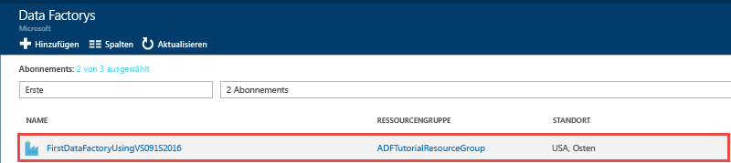
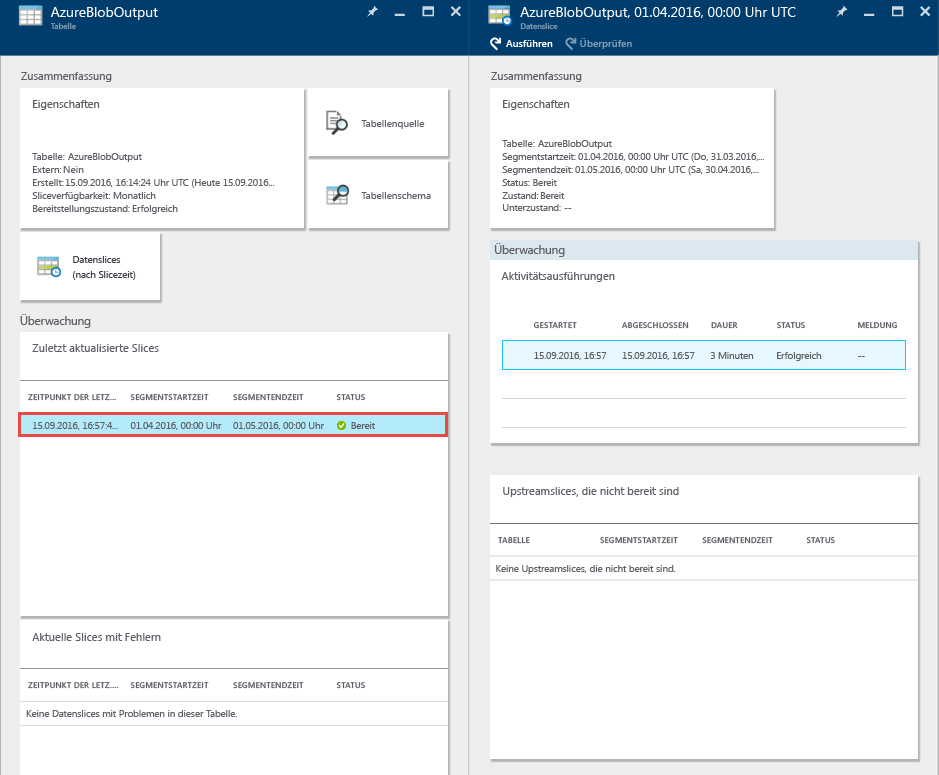
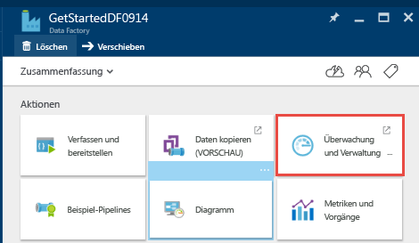
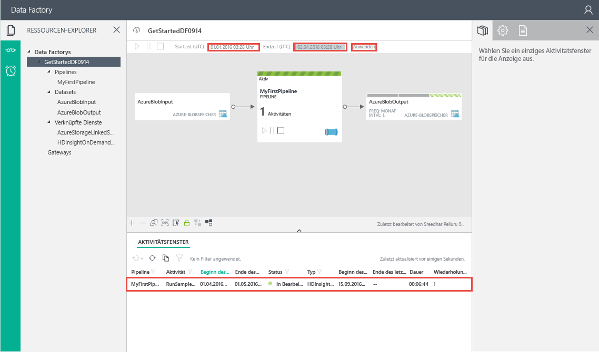
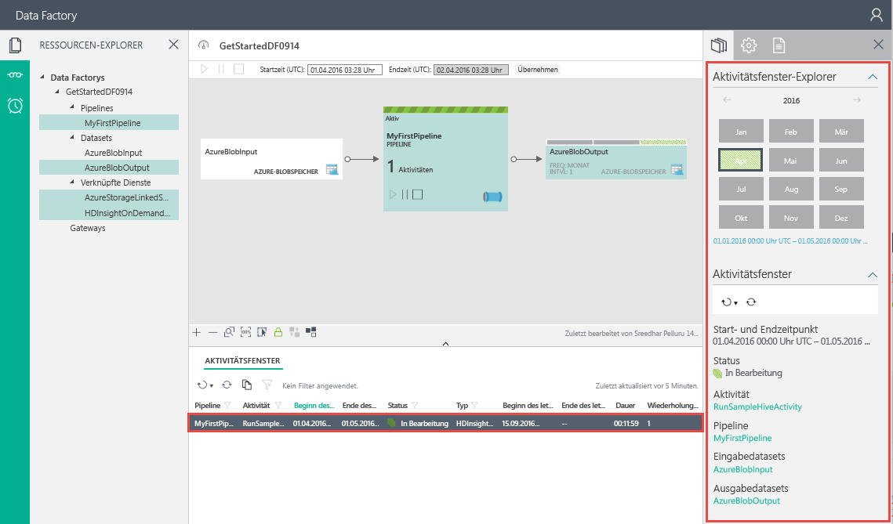

# <a name="tutorial-create-a-data-factory-by-using-visual-studio"></a>Tutorial: Erstellen einer Data Factory mit Visual Studio
> [!div class="op_single_selector" title="Tools/SDKs"]
> * [Übersicht und Voraussetzungen](data-factory-build-your-first-pipeline.md)
> * [Azure-Portal](data-factory-build-your-first-pipeline-using-editor.md)
> * [Visual Studio](data-factory-build-your-first-pipeline-using-vs.md)
> * [PowerShell](data-factory-build-your-first-pipeline-using-powershell.md)
> * [Resource Manager-Vorlage](data-factory-build-your-first-pipeline-using-arm.md)
> * [REST-API](data-factory-build-your-first-pipeline-using-rest-api.md)

In diesem Tutorial wird veranschaulicht, wie Sie eine Azure Data Factory mit Visual Studio erstellen. Sie erstellen ein Visual Studio-Projekt, indem Sie die Data Factory-Projektvorlage verwenden, Data Factory-Entitäten (verknüpfte Dienste, Datasets und Pipeline) im JSON-Format definieren und diese Entitäten anschließend in der Cloud veröffentlichen oder bereitstellen. 

Die Pipeline in diesem Tutorial enthält eine Aktivität: **HDInsight-Hive-Aktivität**. Bei dieser Aktivität wird ein Hive-Skript in einem Azure HDInsight-Cluster ausgeführt, mit dem Eingabedaten transformiert werden, um Ausgabedaten zu erhalten. Die Pipeline zwischen dem Start- und Endzeitpunkt wird einmal pro Monat ausgeführt. 

> [!NOTE]
> In diesem Tutorial wird nicht veranschaulicht, wie Sie Daten mit Azure Data Factory kopieren. Ein Tutorial zum Kopieren von Daten mithilfe von Azure Data Factory finden Sie unter [Kopieren von Daten aus Blob Storage in SQL-Datenbank mithilfe von Data Factory](data-factory-copy-data-from-azure-blob-storage-to-sql-database.md).
> 
> Eine Pipeline kann mehrere Aktivitäten enthalten. Sie können zwei Aktivitäten verketten (nacheinander ausführen), indem Sie das Ausgabedataset einer Aktivität als Eingabedataset der anderen Aktivität festlegen. Weitere Informationen finden Sie unter [Planung und Ausführung in einer Data Factory](data-factory-scheduling-and-execution.md#multiple-activities-in-a-pipeline).


## <a name="walkthrough-create-and-publish-data-factory-entities"></a>Exemplarische Vorgehensweise: Erstellen und Veröffentlichen von Data Factory-Entitäten
Hier sind die Schritte angegeben, die Sie im Rahmen dieser exemplarischen Vorgehensweise ausführen:

1. Erstellen von zwei verknüpften Diensten: **AzureStorageLinkedService1** und **HDInsightOnDemandLinkedService1**. 
   
    In diesem Tutorial befinden sich die Eingabe- und Ausgabedaten für die Hive-Aktivität in derselben Azure Blob Storage-Instanz. Sie verwenden einen bedarfsgesteuerten HDInsight-Cluster zum Verarbeiten von vorhandenen Eingabedaten, um die Ausgabedaten zu erstellen. Der bedarfsgesteuerte HDInsight-Cluster wird von Azure Data Factory zur Laufzeit automatisch für Sie erstellt, wenn die Eingabedaten für die Verarbeitung bereit sind. Sie müssen Ihre Datenspeicher oder Computevorgänge mit Ihrer Data Factory verknüpfen, damit der Data Factory-Dienst zur Laufzeit eine Verbindung damit herstellen kann. Aus diesem Grund verknüpfen Sie Ihr Azure Storage-Konto mit der Data Factory per „AzureStorageLinkedService1“ und verwenden „HDInsightOnDemandLinkedService1“ zum Verknüpfen eines bedarfsgesteuerten HDInsight-Clusters. Beim Veröffentlichen geben Sie den Namen für die zu erstellende Data Factory oder den Namen einer vorhandenen Data Factory an.  
2. Erstellen Sie zwei Datasets: **InputDataset** und **OutputDataset**. Diese Datasets stehen für die Eingabe- bzw. Ausgabedaten, die im Azure-Blobspeicher gespeichert werden. 
   
    Diese Datasetdefinitionen beziehen sich auf den verknüpften Azure Storage-Dienst, den Sie im vorherigen Schritt erstellt haben. Für InputDataset geben Sie den Blobcontainer (adfgetstarted) und den Ordner (inputdata) an, der ein Blob mit den Eingabedaten enthält. Für OutputDataset geben Sie den Blobcontainer (adfgetstarted) und den Ordner (partitioneddata) an, der die Ausgabedaten enthält. Sie können auch andere Eigenschaften wie Struktur, Verfügbarkeit und die Richtlinie angeben.
3. Erstellen Sie eine Pipeline mit dem Namen **MyFirstPipeline**. 
  
    In dieser exemplarischen Vorgehensweise enthält die Pipeline nur eine Aktivität: **HDInsight-Hive-Aktivität**. Bei dieser Aktivität werden Eingabedaten transformiert, um Ausgabedaten zu erhalten, indem ein Hive-Skript in einem bedarfsgesteuerten HDInsight-Cluster ausgeführt wird. Weitere Informationen zur Hive-Aktivität finden Sie unter [Hive-Aktivität](data-factory-hive-activity.md). 
4. Erstellen Sie eine Data Factory mit dem Namen **DataFactoryUsingVS**. Stellen Sie die Data Factory und alle Data Factory-Entitäten (verknüpfte Dienste, Tabellen und die Pipeline) bereit.
5. Nach der Veröffentlichung verwenden Sie die Blätter im Azure-Portal und die App für die Überwachung und Verwaltung, um die Pipeline zu überwachen. 
  
### <a name="prerequisites"></a>Voraussetzungen
1. Lesen Sie sich den Artikel mit der [Übersicht über das Tutorial](data-factory-build-your-first-pipeline.md) durch, und führen Sie die erforderlichen Schritte aus, damit die **Voraussetzungen** erfüllt sind. Sie können auch oben in der Dropdownliste die Option **Übersicht und Voraussetzungen** wählen, um zum Artikel zu wechseln. Nachdem Sie alle Voraussetzungen erfüllt haben, können Sie zurück zu diesem Artikel wechseln, indem Sie in der Dropdownliste die Option **Visual Studio** wählen.
2. Zum Erstellen von Data Factory-Instanzen müssen Sie Mitglied der Rolle [Data Factory-Mitwirkender](../active-directory/role-based-access-built-in-roles.md#data-factory-contributor) auf Abonnement- bzw. Ressourcengruppenebene sein.  
3. Folgendes muss auf Ihrem Computer installiert sein:
   * Visual Studio 2013 oder Visual Studio 2015
   * Laden Sie das Azure-SDK für Visual Studio 2013 oder Visual Studio 2015 herunter. Navigieren Sie zur [Azure-Downloadseite](https://azure.microsoft.com/downloads/), und klicken Sie auf **VS 2013** oder **VS 2015** im Abschnitt **.NET**.
   * Laden Sie das neueste Azure Data Factory-Plug-In für Visual Studio herunter: [VS 2013](https://visualstudiogallery.msdn.microsoft.com/754d998c-8f92-4aa7-835b-e89c8c954aa5) oder [VS 2015](https://visualstudiogallery.msdn.microsoft.com/371a4cf9-0093-40fa-b7dd-be3c74f49005). Sie können das Plug-In auch wie folgt aktualisieren: Klicken Sie im Menü auf **Tools** -> **Erweiterungen und Updates** -> **Online** -> **Visual Studio-Katalog** -> **Microsoft Azure Data Factory-Tools für Visual Studio** -> **Aktualisieren**.

Wir erstellen mit Visual Studio nun eine Azure Data Factory.

### <a name="create-visual-studio-project"></a>Erstellen eines Visual Studio-Projekts
1. Starten Sie **Visual Studio 2013** oder **Visual Studio 2015**. Klicken Sie auf **Datei**, zeigen Sie auf **Neu**, und klicken Sie auf **Projekt**. Das Dialogfeld **Neues Projekt** sollte angezeigt werden.  
2. Wählen Sie im Dialogfeld **Neues Projekt** die Vorlage **DataFactory** aus, und klicken Sie auf **Leeres Data Factory-Projekt**.   

    
3. Füllen Sie für das Projekt die Felder **Name**, **Speicherort** und **Lösung** aus, und klicken Sie auf **OK**.

    

### <a name="create-linked-services"></a>Erstellen von verknüpften Diensten
In diesem Schritt erstellen Sie zwei verknüpfte Dienste: **Azure Storage** und **HDInsight (bedarfsgesteuert)**. 

Mit dem verknüpften Azure Storage-Dienst wird Ihr Azure Storage-Konto mit der Data Factory verknüpft, indem die Verbindungsinformationen bereitgestellt werden. Der Data Factory-Dienst verwendet die Verbindungszeichenfolge der Einstellung des verknüpften Diensts, um zur Laufzeit eine Verbindung mit dem Azure-Speicher herzustellen. Dieser Speicher enthält Eingabe- und Ausgabedaten für die Pipeline und die Hive-Skriptdatei, die von der Hive-Aktivität verwendet wird. 

Bei einem verknüpften bedarfsgesteuerten HDInsight-Dienst wird der HDInsight-Cluster zur Laufzeit automatisch erstellt, wenn die Eingabedaten bereit für die Verarbeitung sind. Der Cluster wird gelöscht, nachdem die Verarbeitung abgeschlossen und die angegebene Zeit im Leerlaufzustand verstrichen ist. 

> [!NOTE]
> Sie erstellen eine Data Factory, indem Sie den Namen und die Einstellungen während der Veröffentlichung Ihrer Data Factory-Lösung angeben.

#### <a name="create-azure-storage-linked-service"></a>Erstellen des mit Azure Storage verknüpften Diensts
1. Klicken Sie im Projektmappen-Explorer mit der rechten Maustaste auf **Verknüpfte Dienste**, zeigen Sie auf **Hinzufügen**, und klicken Sie auf **Neues Element**.      
2. Wählen Sie im Dialogfeld **Neues Element hinzufügen** die Option **Mit Azure-Speicher verknüpfter Dienst** aus der Liste aus, und klicken Sie auf **Hinzufügen**.
    
3. Ersetzen Sie `<accountname>` und `<accountkey>` durch den Namen Ihres Azure-Speicherkontos bzw. durch den dazugehörigen Schlüssel. Informationen zum Abrufen Ihres Speicherzugriffsschlüssels finden Sie unter [Verwalten von Speicherkonten](../storage/common/storage-create-storage-account.md#manage-your-storage-account) in den Informationen zum Anzeigen, Kopieren und erneuten Generieren von Speicherzugriffsschlüsseln.
    
4. Speichern Sie die Datei **AzureStorageLinkedService1.json** .

#### <a name="create-azure-hdinsight-linked-service"></a>Erstellen des mit Azure-HDInsight verknüpften Diensts
1. Klicken Sie im **Projektmappen-Explorer** mit der rechten Maustaste auf **Verknüpfte Dienste**, zeigen Sie auf **Hinzufügen**, und klicken Sie auf **Neues Element**.
2. Wählen Sie **Bedarfsgesteuerter verknüpfter HDInsight-Dienst**, und klicken Sie auf **Hinzufügen**.
3. Ersetzen Sie den **JSON-Code** durch Folgendes:

     ```json
    {
        "name": "HDInsightOnDemandLinkedService",
        "properties": {
        "type": "HDInsightOnDemand",
            "typeProperties": {
                "version": "3.5",
                "clusterSize": 1,
                "timeToLive": "00:05:00",
                "osType": "Linux",
                "linkedServiceName": "AzureStorageLinkedService1"
            }
        }
    }
    ```

    Die folgende Tabelle enthält eine Beschreibung der JSON-Eigenschaften, die im Codeausschnitt verwendet werden:

    Eigenschaft | Beschreibung
    -------- | ----------- 
    ClusterSize | Gibt die Größe des HDInsight-Hadoop-Clusters an.
    TimeToLive | Gibt die Leerlaufzeit des HDInsight-Clusters an, bevor er gelöscht wird.
    linkedServiceName | Gibt das Speicherkonto an, das verwendet wird, um die vom HDInsight-Hadoop-Cluster generierten Protokolle zu speichern. 

    > [!IMPORTANT]
    > Der HDInsight-Cluster erstellt einen **Standardcontainer** im Blobspeicher, den Sie im JSON-Code (linkedServiceName) angegeben haben. HDInsight löscht diesen Container nicht, wenn der Cluster gelöscht wird. Dieses Verhalten ist beabsichtigt. Beim bedarfsgesteuerten verknüpften HDInsight-Dienst wird jedes Mal ein HDInsight-Cluster erstellt, wenn ein Slice verarbeitet wird. Dies gilt nur dann nicht, wenn ein aktiver Cluster (timeToLive) vorhanden ist. Der Cluster wird automatisch gelöscht, nachdem die Verarbeitung abgeschlossen ist.
    > 
    > Wenn mehr Segmente verarbeitet werden, werden in Ihrem Azure-Blobspeicher viele Container angezeigt. Falls Sie diese für die Problembehandlung der Aufträge nicht benötigen, sollten Sie sie ggf. löschen, um die Speicherkosten zu verringern. Die Namen dieser Container folgen einem Muster: `adf<yourdatafactoryname>-<linkedservicename>-datetimestamp`. Verwenden Sie Tools wie den [Microsoft-Speicher-Explorer](http://storageexplorer.com/), um Container in Ihrem Azure-Blobspeicher zu löschen.

    Weitere Informationen zu JSON-Eigenschaften finden Sie im Artikel [Verknüpfte Computedienste](data-factory-compute-linked-services.md#azure-hdinsight-on-demand-linked-service). 
4. Speichern Sie die Datei **HDInsightOnDemandLinkedService1.json** .

### <a name="create-datasets"></a>Erstellen von Datasets
In diesem Schritt erstellen Sie Datasets, um die Eingabe- und Ausgabedaten für die Hive-Verarbeitung darzustellen. Diese Datasets verweisen auf den **AzureStorageLinkedService1** , den Sie zuvor in diesem Tutorial erstellt haben. Der verknüpfte Dienst weist auf ein Azure Storage-Konto, und Datasets geben Container, Ordner und Dateiname in dem Speicher an, der Eingabe- und Ausgabedaten enthält.   

#### <a name="create-input-dataset"></a>Erstellen eines Eingabedatasets
1. Klicken Sie im **Projektmappen-Explorer** mit der rechten Maustaste auf **Tabellen**, zeigen Sie auf **Hinzufügen**, und klicken Sie auf **Neues Element**.
2. Wählen Sie **Azure-Blob** in der Liste aus, ändern Sie den Namen der Datei in **InputDataSet.json**, und klicken Sie auf **Hinzufügen**.
3. Ersetzen Sie den **JSON-Code** im Editor durch den folgenden JSON-Codeausschnitt:

    ```json
    {
        "name": "AzureBlobInput",
        "properties": {
            "type": "AzureBlob",
            "linkedServiceName": "AzureStorageLinkedService1",
            "typeProperties": {
                "fileName": "input.log",
                "folderPath": "adfgetstarted/inputdata",
                "format": {
                    "type": "TextFormat",
                    "columnDelimiter": ","
                }
            },
            "availability": {
                "frequency": "Month",
                "interval": 1
            },
            "external": true,
            "policy": {}
        }
    }
    ```
    Mit diesem JSON-Codeausschnitt wird ein Dataset mit dem Namen **AzureBlobInput** erstellt, das Eingabedaten für die Hive-Aktivität in der Pipeline darstellt. Sie geben an, dass sich die Eingabedaten im Blobcontainer `adfgetstarted` und im Ordner `inputdata` befinden.

    Die folgende Tabelle enthält eine Beschreibung der JSON-Eigenschaften, die im Codeausschnitt verwendet werden:

    Eigenschaft | Beschreibung |
    -------- | ----------- |
    Typ |Die Type-Eigenschaft wird auf **AzureBlob** festgelegt, da sich Daten in Azure Blob Storage befinden.
    linkedServiceName | Verweist auf den „AzureStorageLinkedService1“, den Sie zuvor erstellt haben.
    fileName |Diese Eigenschaft ist optional. Wenn Sie diese Eigenschaft nicht angeben, werden alle Dateien in „folderPath“ übernommen. In diesem Fall wird nur „input.log“ verarbeitet.
    Typ | Da die Protokolldateien im Textformat vorliegen, verwenden wir „TextFormat“. |
    columnDelimiter | Spalten werden in den Protokolldateien per Komma (`,`) voneinander getrennt.
    frequency/interval | „frequency“ wird auf „Month“ und „interval“ auf „1“ festgelegt, was bedeutet, dass die Eingabeslices monatlich verfügbar sind.
    external | Diese Eigenschaft wird auf „true“ festgelegt, wenn die Eingabedaten für die Aktivität nicht von der Pipeline generiert werden. Die Eigenschaft wird nur für Eingabedatasets angegeben. Legen Sie sie für das Eingabedataset der ersten Aktivität immer auf „true“ fest.
4. Speichern Sie die Datei **InputDataset.json** .

#### <a name="create-output-dataset"></a>Erstellen des Ausgabedatasets
Nun erstellen Sie das Ausgabedataset, das im Azure-Blobspeicher gespeicherte Ausgabedaten darstellt.

1. Klicken Sie im **Projektmappen-Explorer** mit der rechten Maustaste auf **Tabellen**, zeigen Sie auf **Hinzufügen**, und klicken Sie auf **Neues Element**.
2. Wählen Sie **Azure-Blob** in der Liste aus, ändern Sie den Namen der Datei in **OutputDataset.json**, und klicken Sie auf **Hinzufügen**.
3. Ersetzen Sie den **JSON-Code** im Editor durch Folgendes:
    
    ```json
    {
        "name": "AzureBlobOutput",
        "properties": {
            "type": "AzureBlob",
            "linkedServiceName": "AzureStorageLinkedService1",
            "typeProperties": {
                "folderPath": "adfgetstarted/partitioneddata",
                "format": {
                    "type": "TextFormat",
                    "columnDelimiter": ","
                }
            },
            "availability": {
                "frequency": "Month",
                "interval": 1
            }
        }
    }
    ```
    Mit dem JSON-Codeausschnitt wird ein Dataset mit dem Namen **AzureBlobOutput** definiert. Es steht für Ausgabedaten, die mit der Hive-Aktivität in der Pipeline produziert werden. Sie geben an, dass die von der Hive-Aktivität produzierten Ausgabedaten im Blobcontainer `adfgetstarted` und im Ordner `partitioneddata` angeordnet werden sollen. 
    
    Der Abschnitt **availability** gibt an, dass das Ausgabe-DataSet monatlich erzeugt wird. Das Ausgabedataset ist die Grundlage für den Zeitplan der Pipeline. Die Pipeline wird monatlich zwischen dem Start- und Endzeitpunkt ausgeführt. 

    Im Abschnitt **Erstellen des Eingabedatasets** werden diese Eigenschaften beschrieben. Sie legen die Eigenschaft „external“ für ein Ausgabedataset nicht fest, da das Dataset von der Pipeline erstellt wird.
4. Speichern Sie die Datei **OutputDataset.json** .

### <a name="create-pipeline"></a>Erstellen der Pipeline
Bisher haben Sie den verknüpften Azure Storage-Dienst und die Eingabe- und Ausgabedatasets erstellt. Nun erstellen Sie eine Pipeline mit einer **HDInsightHive**-Aktivität. Die Eingabe (**input**) für die Hive-Aktivität ist auf **AzureBlobInput** und die Ausgabe (**output**) auf **AzureBlobOutput** festgelegt. Ein Slice eines Eingabedatasets ist monatlich verfügbar (frequency: Month, interval: 1), und auch das Ausgabeslice wird monatlich erstellt. 

1. Klicken Sie im **Projektmappen-Explorer** mit der rechten Maustaste auf **Pipelines**, zeigen Sie auf **Hinzufügen**, und klicken Sie auf **Neues Element**.
2. Wählen Sie **Hive-Transformationspipeline** in der Liste aus, und klicken Sie auf **Hinzufügen**.
3. Ersetzen Sie den **JSON**-Code durch den folgenden Ausschnitt:

    > [!IMPORTANT]
    > Ersetzen Sie `<storageaccountname>` durch den Namen Ihres Speicherkontos.

    ```json
    {
        "name": "MyFirstPipeline",
        "properties": {
            "description": "My first Azure Data Factory pipeline",
            "activities": [
                {
                    "type": "HDInsightHive",
                    "typeProperties": {
                        "scriptPath": "adfgetstarted/script/partitionweblogs.hql",
                        "scriptLinkedService": "AzureStorageLinkedService1",
                        "defines": {
                            "inputtable": "wasb://adfgetstarted@<storageaccountname>.blob.core.windows.net/inputdata",
                            "partitionedtable": "wasb://adfgetstarted@<storageaccountname>.blob.core.windows.net/partitioneddata"
                        }
                    },
                    "inputs": [
                        {
                            "name": "AzureBlobInput"
                        }
                    ],
                    "outputs": [
                        {
                            "name": "AzureBlobOutput"
                        }
                    ],
                    "policy": {
                        "concurrency": 1,
                        "retry": 3
                    },
                    "scheduler": {
                        "frequency": "Month",
                        "interval": 1
                    },
                    "name": "RunSampleHiveActivity",
                    "linkedServiceName": "HDInsightOnDemandLinkedService"
                }
            ],
            "start": "2016-04-01T00:00:00Z",
            "end": "2016-04-02T00:00:00Z",
            "isPaused": false
        }
    }
    ```

    > [!IMPORTANT]
    > Ersetzen Sie `<storageaccountname>` durch den Namen Ihres Speicherkontos.

    Mit dem JSON-Codeausschnitt wird eine Pipeline definiert, die aus einer einzelnen Aktivität (Hive-Aktivität) besteht. Diese Aktivität führt ein Hive-Skript für die Verarbeitung von Eingabedaten in einem bedarfsgesteuerten HDInsight-Cluster aus, um Ausgabedaten zu erstellen. Im Abschnitt „activities“ des JSON-Pipelinecodes sehen Sie, dass nur für eine Aktivität des Arrays der Typ auf **HDInsightHive** festgelegt ist. 

    In den Typeigenschaften für die HDInsight-Hive-Aktivität geben Sie an, welcher verknüpfte Azure Storage-Dienst über die Hive-Skriptdatei, den Pfad zur Skriptdatei und die Parameter zur Skriptdatei verfügt. 

    Die Hive-Skriptdatei **partitionweblogs.hql** ist im Azure-Speicherkonto (angegeben durch „scriptLinkedService“) und im Container `adfgetstarted` im Ordner `script` gespeichert.

    Der Abschnitt `defines` wird zum Angeben der Runtimeeinstellungen verwendet, die als Hive-Konfigurationswerte an das Hive-Skript übergeben werden (z.B. `${hiveconf:inputtable}`, `${hiveconf:partitionedtable})`.

    Die Eigenschaften **start** und **end** der Pipeline geben den aktiven Zeitraum der Pipeline an. Sie haben die monatliche Erstellung des Datasets konfiguriert. Daher wird von der Pipeline nur ein Slice erstellt (da das Start- und Enddatum in demselben Monat liegen).

    Im JSON-Code der Aktivität geben Sie an, dass das Hive-Skript auf der Computeinstanz ausgeführt wird, die vom **linkedServiceName** – **HDInsightOnDemandLinkedService** angegeben wurde.
4. Speichern Sie die Datei **HiveActivity1.json** .

### <a name="add-partitionweblogshql-and-inputlog-as-a-dependency"></a>Hinzufügen von „partitionweblogs.hql“ und „input.log“ als Abhängigkeit
1. Klicken Sie mit der rechten Maustaste im Fenster **Projektmappen-Explorer** auf **Abhängigkeiten**, zeigen Sie auf **Hinzufügen**, und klicken Sie auf **Vorhandenes Element**.  
2. Navigieren Sie zu **C:\ADFGettingStarted**, wählen Sie die Dateien **partitionweblogs.hql** und **input.log** aus, und klicken Sie auf **Hinzufügen**. Sie haben diese beiden Dateien als Teil der erforderlichen Komponenten erstellt, die in der [Übersicht über das Tutorial](data-factory-build-your-first-pipeline.md) angegeben sind.

Beim Veröffentlichen der Lösung im nächsten Schritt wird die Datei **partitionweblogs.hql** in den Ordner **script** des Blobcontainers `adfgetstarted` hochgeladen.   

### <a name="publishdeploy-data-factory-entities"></a>Veröffentlichen/Bereitstellen der Data Factory-Entitäten
In diesem Schritt veröffentlichen Sie die Data Factory-Entitäten (verknüpfte Dienste, Datasets und Pipeline) in Ihrem Projekt für den Azure Data Factory-Dienst. Während der Veröffentlichung geben Sie den Namen für Ihre Data Factory an. 

1. Klicken Sie im Projektmappen-Explorer mit der rechten Maustaste auf das Projekt, und klicken Sie auf **Veröffentlichen**.
2. Wenn das Dialogfeld **Melden Sie sich bei Ihrem Microsoft-Konto an** angezeigt wird, geben Sie Ihre Anmeldeinformationen für das Konto mit dem Azure-Abonnement ein, und klicken Sie auf **Anmelden**.
3. Das folgende Dialogfeld sollte angezeigt werden:

   
4. Führen Sie auf der Seite **Data Factory konfigurieren** die folgenden Schritte aus:

    

   1. Wählen Sie die Option **Neue Data Factory erstellen** .
   2. Geben Sie einen eindeutigen **Namen** für die Data Factory ein. Beispiel: **DataFactoryUsingVS09152016**. Der Name muss global eindeutig sein.
   3. Wählen Sie im Feld **Abonnement** das richtige Abonnement aus. 
        > [!IMPORTANT]
        > Gehen Sie wie folgt vor, wenn keine Abonnements angezeigt werden: Stellen Sie sicher, dass Sie mit einem Konto angemeldet sind, bei dem es sich um den Administrator oder Co-Admin des Abonnements handelt.
   4. Wählen Sie die **Ressourcengruppe** für die zu erstellende Data Factory aus.
   5. Wählen Sie die **Region** für die Data Factory aus.
   6. Klicken Sie auf **Weiter**, um zur Seite **Publish Items** zu wechseln. (Drücken Sie die **TAB-TASTE**, um das Feld „Name“ zu verlassen, wenn die Schaltfläche **Weiter** deaktiviert ist.)

    > [!IMPORTANT]
    > Wenn die Fehlermeldung **Data Factory-Name „DataFactoryUsingVS“ nicht verfügbar** beim Veröffentlichen angezeigt wird, ändern Sie den Namen (z.B. in „IhrNameDataFactoryUsingVS“). Benennungsregeln für Data Factory-Artefakte finden Sie im Thema [Data Factory – Benennungsregeln](data-factory-naming-rules.md) .   
1. Stellen Sie auf der Seite **Publish Items** sicher, dass alle Data Factory-Entitäten ausgewählt sind, und klicken Sie auf **Weiter**, um zur Seite **Zusammenfassung** zu wechseln.

         
2. Prüfen Sie die Zusammenfassung, und klicken Sie auf **Weiter**, um den Bereitstellungsprozess zu starten und den **Bereitstellungsstatus** anzuzeigen.

    
3. Auf der Seite **Bereitstellungsstatus** sollte der Status des Bereitstellungsprozesses angezeigt werden. Klicken Sie auf „Fertig stellen“, nachdem die Bereitstellung abgeschlossen ist.

Beachten Sie die folgenden wichtigen Punkte:

- Führen Sie einen der folgenden Schritte aus, wenn Sie eine Fehlermeldung wie **Dieses Abonnement ist nicht zur Verwendung des Microsoft.DataFactory-Namespaces registriert** erhalten, und versuchen Sie, die Veröffentlichung erneut durchzuführen:
    - Führen Sie in Azure PowerShell den folgenden Befehl aus, um den Data Factory-Anbieter zu registrieren.
        ```PowerShell   
        Register-AzureRmResourceProvider -ProviderNamespace Microsoft.DataFactory
        ```
        Sie können den folgenden Befehl ausführen, um sicherzustellen, dass der Data Factory-Anbieter registriert ist.

        ```PowerShell
        Get-AzureRmResourceProvider
        ```
    - Melden Sie sich mit dem Azure-Abonnement beim [Azure-Portal](https://portal.azure.com) an, und navigieren Sie zu einem Data Factory-Blatt, oder erstellen Sie eine Data Factory im Azure-Portal. Mit dieser Aktion wird der Anbieter automatisch für Sie registriert.
- Der Name der Data Factory kann in Zukunft als DNS-Name registriert und so öffentlich sichtbar werden.
- Um Data Factory-Instanzen erstellen zu können, müssen Sie ein Administrator oder Co-Admin des Azure-Abonnements sein.

### <a name="monitor-pipeline"></a>Überwachen der Pipeline
In diesem Schritt überwachen Sie die Pipeline über die Diagrammansicht der Data Factory. 

#### <a name="monitor-pipeline-using-diagram-view"></a>Überwachen der Pipeline mit der Diagrammansicht
1. Melden Sie sich beim [Azure-Portal](https://portal.azure.com/) an, und gehen Sie wie folgt vor:
   1. Klicken Sie auf **Weitere Dienste** und dann auf **Data Factorys**.
       
        
   2. Wählen Sie in der Liste mit den Data Factorys den Namen Ihrer Data Factory aus (z.B. **DataFactoryUsingVS09152016**).
   
       
2. Klicken Sie auf der Startseite Ihrer Data Factory auf **Diagramm**.

    
3. In der Diagrammansicht sehen Sie eine Übersicht über die in diesem Tutorial verwendeten Pipelines und Datasets.

    
4. Um alle Aktivitäten in der Pipeline anzuzeigen, klicken Sie im Diagramm mit der rechten Maustaste auf die Pipeline und klicken dann auf „Pipeline öffnen“.

    
5. Vergewissern Sie sich, dass Sie die HDInsightHive-Aktivität in der Pipeline sehen.

    

    Um zurück zur vorherigen Ansicht zu navigieren, klicken Sie oben in der Breadcrumb-Leiste auf **Data Factory** .
6. Doppelklicken Sie in der **Diagrammansicht** auf das Dataset **AzureBlobInput**. Vergewissern Sie sich, dass der Slice sich im Zustand **Bereit** befindet. Es kann ein paar Minuten dauern, bis der Slice im Status „Bereit“ angezeigt wird. Warten Sie eine Weile, und vergewissern Sie sich ggf., dass sich die Eingabedatei (input.log) im richtigen Container (`adfgetstarted`) und Ordner (`inputdata`) befindet. Stellen Sie außerdem sicher, dass die **external**-Eigenschaft für das Eingabedataset auf **true** festgelegt ist. 

   
7. Klicken Sie auf **X**, um das Blatt **AzureBlobInput** zu schließen.
8. Doppelklicken Sie in der **Diagrammansicht** auf das Dataset **AzureBlobOutput**. Sie sehen den Slice, der gerade verarbeitet wird.

   
9. Wenn die Verarbeitung abgeschlossen ist, wird der Slice mit dem Zustand **Bereit** angezeigt.

   > [!IMPORTANT]
   > Die Erstellung eines bedarfsgesteuerten HDInsight-Clusters dauert in der Regel einige Zeit (etwa 20 Minuten). Daher ist damit zu rechnen, dass die Pipeline **etwa 30 Minuten** zum Verarbeiten des Slice benötigt.  
   
        
10. Sobald sich der Slice im Zustand **Bereit** befindet, prüfen Sie den Ordner `partitioneddata` im Container `adfgetstarted` in Ihrem Blobspeicher auf die Ausgabedaten.  

    
11. Klicken Sie auf den Slice, um Details dazu auf dem Blatt **Datenslice** anzuzeigen.

      
12. Klicken Sie in der Liste mit den **Aktivitätsausführungen** auf eine Aktivitätsausführung, um Details dazu (hier: die Hive-Aktivität) in einem Fenster mit dem Namen **Details zur Aktivitätsausführung** anzuzeigen. 
  
        

    In den Protokolldateien werden die ausgeführte Hive-Abfrage und Statusinformationen angezeigt. Diese Protokolle sind zur Behandlung von Problemen hilfreich.  

Unter [Überwachen von Datasets und Pipelines](data-factory-monitor-manage-pipelines.md) finden Sie eine Anleitung zum Überwachen der in diesem Tutorial erstellten Pipeline und Datasets über das Azure-Portal.

#### <a name="monitor-pipeline-using-monitor--manage-app"></a>Überwachen der Pipeline mit der App „Überwachung und Verwaltung“
Sie können die App „Überwachung und Verwaltung“ auch zum Überwachen Ihrer Pipelines verwenden. Ausführliche Informationen zur Verwendung dieser App finden Sie unter [Überwachen und Verwalten von Azure Data Factory-Pipelines mit der neuen App „Überwachung und Verwaltung“](data-factory-monitor-manage-app.md).

1. Klicken Sie auf die Kachel „Überwachung und Verwaltung“.

    
2. Die App „Überwachung und Verwaltung“ wird angezeigt. Ändern Sie die **Startzeit** und **Endzeit** in die Startzeit (04-01-2016 12:00 AM) und Endzeit (04-02-2016 12:00 AM) Ihrer Pipeline, und klicken Sie auf **Übernehmen**.

    
3. Wählen Sie in der Liste **Aktivitätsfenster** ein Aktivitätsfenster aus, um die Details dazu anzuzeigen.
    

> [!IMPORTANT]
> Die Eingabedatei wird bei erfolgreicher Verarbeitung des Slice gelöscht. Wenn Sie den Slice erneut ausführen oder das Tutorial nochmals durchgehen möchten, laden Sie die Eingabedatei (input.log) daher in den Ordner `inputdata` des Containers `adfgetstarted` hoch.

### <a name="additional-notes"></a>Zusätzliche Hinweise
- Eine Data Factory kann eine oder mehrere Aktivitäten aufweisen. Eine Pipeline kann eine oder mehrere Aktivitäten aufweisen. Beispielsweise eine Kopieraktivität zum Kopieren von Daten aus einer Quelle in einen Zieldatenspeicher und eine HDInsight-Hive-Aktivität zum Ausführen eines Hive-Skripts zum Transformieren von Eingabedaten. Informationen zu allen Quellen und Senken, die von der Kopieraktivität unterstützt werden, finden Sie unter [Unterstützte Datenspeicher](data-factory-data-movement-activities.md#supported-data-stores-and-formats) . Eine Liste mit Computediensten, die von Data Factory unterstützt werden, finden Sie unter [Verknüpfte Computedienste](data-factory-compute-linked-services.md) .
- Verknüpfte Dienste verknüpfen Datenspeicher oder Serverdienste mit einer Azure Data Factory. Informationen zu allen Quellen und Senken, die von der Kopieraktivität unterstützt werden, finden Sie unter [Unterstützte Datenspeicher](data-factory-data-movement-activities.md#supported-data-stores-and-formats) . Eine Liste mit den Computediensten, die von Data Factory unterstützt werden, und den [Transformationsaktivitäten](data-factory-data-transformation-activities.md), die darunter ausgeführt werden können, finden Sie unter [Verknüpfte Computedienste](data-factory-compute-linked-services.md).
- Details zu JSON-Eigenschaften, die für die Definition von verknüpften Azure Storage-Diensten verwendet werden, finden Sie unter [Verschieben von Daten in einen und aus einem Azure-Blob mithilfe von Azure Data Factory](data-factory-azure-blob-connector.md#azure-storage-linked-service).
- Anstelle eines bedarfsgesteuerten HDInsight-Clusters könnten Sie Ihren eigenen HDInsight-Cluster verwenden. Weitere Informationen finden Sie unter [Verknüpfte Computedienste](data-factory-compute-linked-services.md) .
-  Die Data Factory erstellt mit dem obigen JSON-Code einen **Linux-basierten** HDInsight-Cluster für Sie. Ausführliche Informationen finden Sie unter [Bedarfsgesteuerter verknüpfter HDInsight-Dienst](data-factory-compute-linked-services.md#azure-hdinsight-on-demand-linked-service) .
- Der HDInsight-Cluster erstellt einen **Standardcontainer** im Blobspeicher, den Sie im JSON-Code (linkedServiceName) angegeben haben. HDInsight löscht diesen Container nicht, wenn der Cluster gelöscht wird. Dieses Verhalten ist beabsichtigt. Beim bedarfsgesteuerten verknüpften HDInsight-Dienst wird jedes Mal ein HDInsight-Cluster erstellt, wenn ein Slice verarbeitet wird. Dies gilt nur dann nicht, wenn ein aktiver Cluster (timeToLive) vorhanden ist. Der Cluster wird automatisch gelöscht, nachdem die Verarbeitung abgeschlossen ist.
    
    Wenn mehr Segmente verarbeitet werden, werden in Ihrem Azure-Blobspeicher viele Container angezeigt. Falls Sie diese für die Problembehandlung der Aufträge nicht benötigen, sollten Sie sie ggf. löschen, um die Speicherkosten zu verringern. Die Namen dieser Container folgen einem Muster: `adf**yourdatafactoryname**-**linkedservicename**-datetimestamp`. Verwenden Sie Tools wie den [Microsoft-Speicher-Explorer](http://storageexplorer.com/), um Container in Ihrem Azure-Blobspeicher zu löschen.
- Derzeit steuert das Ausgabedataset den Zeitplan, sodass Sie auch dann ein Ausgabedataset erstellen müssen, wenn die Aktivität keine Ausgabe erzeugt. Wenn die Aktivität keine Eingabe akzeptiert, können Sie das Erstellen des Eingabedatasets überspringen. 
- In diesem Tutorial wird nicht veranschaulicht, wie Sie Daten mit Azure Data Factory kopieren. Ein Tutorial zum Kopieren von Daten mithilfe von Azure Data Factory finden Sie unter [Kopieren von Daten aus Blob Storage in SQL-Datenbank mithilfe von Data Factory](data-factory-copy-data-from-azure-blob-storage-to-sql-database.md).


## <a name="use-server-explorer-to-view-data-factories"></a>Verwenden von Server-Explorer zum Anzeigen von Data Factorys
1. Klicken Sie in **Visual Studio** im Menü auf **Ansicht** und dann auf **Server-Explorer**.
2. Erweitern Sie im Server-Explorer-Fenster erst die Option **Azure** und dann **Data Factory**. Wenn **Bei Visual Studio anmelden** angezeigt wird, geben Sie das mit Ihrem Azure-Abonnement verknüpfte **Konto** ein, und klicken Sie auf **Weiter**. Geben Sie Ihr **Kennwort** ein, und klicken Sie auf **Anmelden**. Visual Studio versucht, Informationen zu allen Azure Data Factorys abzurufen, die in Ihrem Abonnement enthalten sind. Der Status dieses Vorgangs wird im Fenster **Data Factory-Aufgabenliste** angezeigt.

    
3. Durch Klicken mit der rechten Maustaste auf eine Data Factory und Auswählen von **Data Factory in neues Projekt exportieren** können Sie anhand einer vorhandenen Data Factory ein Visual Studio-Projekt erstellen.

    

## <a name="update-data-factory-tools-for-visual-studio"></a>Aktualisieren von Data Factory-Tools für Visual Studio
Führen Sie die folgenden Schritte aus, um die Azure Data Factory-Tools für Visual Studio zu aktualisieren:

1. Klicken Sie im Menü auf **Extras**, und wählen Sie **Erweiterungen und Updates** aus.
2. Wählen Sie im linken Bereich **Updates** und dann **Visual Studio Gallery** aus.
3. Wählen Sie **Azure Data Factory tools for Visual Studio** aus, und klicken Sie auf **Update**. Wenn dieser Eintrag nicht angezeigt wird, verfügen Sie bereits über die neueste Version der Tools.

## <a name="use-configuration-files"></a>Verwenden von Konfigurationsdateien
Sie können Konfigurationsdateien in Visual Studio verwenden, um Eigenschaften für verknüpfte Dienste/Tabellen/Pipelines für jede Umgebung unterschiedlich zu konfigurieren.

Sehen Sie sich die folgende JSON-Definition für einen verknüpften Azure Storage-Dienst an. Sie wird zum Angeben von **connectionString** mit unterschiedlichen Werten für „accountname“ und „accountkey“ basierend auf der Umgebung (Entwicklung/Test/Produktion) verwendet, in der Sie Data Factory-Entitäten bereitstellen. Dieses Verhalten erreichen Sie, indem Sie für jede Umgebung eine separate Konfigurationsdatei nutzen.

```json
{
    "name": "StorageLinkedService",
    "properties": {
        "type": "AzureStorage",
        "description": "",
        "typeProperties": {
            "connectionString": "DefaultEndpointsProtocol=https;AccountName=<accountname>;AccountKey=<accountkey>"
        }
    }
}
```

### <a name="add-a-configuration-file"></a>Hinzufügen einer Konfigurationsdatei
Führen Sie die folgenden Schritte aus, um eine Konfigurationsdatei für jede Umgebung hinzuzufügen:   

1. Klicken Sie mit der rechten Maustaste auf das Data Factory-Projekt in Ihrer Visual Studio-Projektmappe, zeigen Sie auf **Hinzufügen**, und klicken Sie auf **Neuer Eintrag**.
2. Wählen Sie links in der Liste mit den installierten Vorlagen die Option **Config** aus, klicken Sie auf **Konfigurationsdatei**, geben Sie einen **Namen** für die Konfigurationsdatei ein, und klicken Sie auf **Hinzufügen**.

    
3. Fügen Sie Konfigurationsparameter und deren Werte im folgenden Format hinzu:

    ```json
    {
        "$schema": "http://datafactories.schema.management.azure.com/vsschemas/V1/Microsoft.DataFactory.Config.json",
        "AzureStorageLinkedService1": [
            {
                "name": "$.properties.typeProperties.connectionString",
                "value": "DefaultEndpointsProtocol=https;AccountName=<accountname>;AccountKey=<accountkey>"
            }
        ],
        "AzureSqlLinkedService1": [
            {
                "name": "$.properties.typeProperties.connectionString",
                "value":  "Server=tcp:spsqlserver.database.windows.net,1433;Database=spsqldb;User ID=spelluru;Password=Sowmya123;Trusted_Connection=False;Encrypt=True;Connection Timeout=30"
            }
        ]
    }
    ```

    In diesem Beispiel wird die connectionString-Eigenschaft eines verknüpften Azure Storage-Diensts und eines verknüpften Azure SQL-Diensts konfiguriert. Beachten Sie, dass die Syntax zum Angeben des Namens [JsonPath](http://goessner.net/articles/JsonPath/)lautet.   

    Falls JSON wie im folgenden Code gezeigt über eine Eigenschaft mit einem Array von Werten verfügt:  

    ```json
    "structure": [
          {
              "name": "FirstName",
            "type": "String"
          },
          {
            "name": "LastName",
            "type": "String"
        }
    ],
    ```

    Konfigurieren Sie Eigenschaften wie in der folgenden Konfigurationsdatei dargestellt (nullbasierte Indizierung verwenden):

    ```json
    {
        "name": "$.properties.structure[0].name",
        "value": "FirstName"
    }
    {
        "name": "$.properties.structure[0].type",
        "value": "String"
    }
    {
        "name": "$.properties.structure[1].name",
        "value": "LastName"
    }
    {
        "name": "$.properties.structure[1].type",
        "value": "String"
    }
    ```

### <a name="property-names-with-spaces"></a>Eigenschaftennamen mit Leerzeichen
Wenn ein Eigenschaftenname ein Leerzeichen enthält, verwenden Sie eckige Klammern wie im folgenden Beispiel (Datenbankservername):

```json
 {
     "name": "$.properties.activities[1].typeProperties.webServiceParameters.['Database server name']",
     "value": "MyAsqlServer.database.windows.net"
 }
```

### <a name="deploy-solution-using-a-configuration"></a>Bereitstellen der Projektmappe mit einer Konfiguration
Wenn Sie Azure Data Factory-Entitäten in VS veröffentlichen, können Sie die Konfiguration angeben, die Sie für diesen Veröffentlichungsvorgang verwenden möchten.

Gehen Sie wie folgt vor, um Entitäten in einem Azure Data Factory-Projekt mit der Konfigurationsdatei zu veröffentlichen:   

1. Klicken Sie mit der rechten Maustaste auf das Data Factory-Projekt, und klicken Sie dann auf **Veröffentlichen**, um das Dialogfeld **Elemente veröffentlichen** anzuzeigen.
2. Wählen Sie eine vorhandene Data Factory aus, oder geben Sie Werte zum Erstellen einer Data Factory auf der Seite **Data Factory konfigurieren** an, und klicken Sie auf **Weiter**.   
3. Auf der Seite **Elemente veröffentlichen** wird eine Dropdownliste mit verfügbaren Konfigurationen für das Feld **Bereitstellungskonfiguration auswählen** angezeigt.

    
4. Wählen Sie die **Konfigurationsdatei** aus, die Sie verwenden möchten, und klicken Sie auf **Weiter**.
5. Vergewissern Sie sich, dass der Name der JSON-Datei auf der Seite **Zusammenfassung** angezeigt wird, und klicken Sie auf **Weiter**.
6. Klicken Sie auf **Fertig stellen** , wenn der Bereitstellungsvorgang abgeschlossen ist.

Bei der Bereitstellung werden die Werte aus der Konfigurationsdatei zum Festlegen der Werte für Eigenschaften in den JSON-Dateien verwendet, bevor die Entitäten für den Azure Data Factory-Dienst bereitgestellt werden.   

## <a name="use-azure-key-vault"></a>Verwenden von Azure Key Vault
Es ist nicht ratsam und häufig gemäß der Sicherheitsrichtlinie auch nicht zulässig, für sensible Daten, z.B. Verbindungszeichenfolgen, ein Commit in das Coderepository durchzuführen. Informationen zum Speichern von sensiblen Informationen in Azure Key Vault und zum Verwenden beim Veröffentlichen von Data Factory-Entitäten finden Sie im Beispiel [ADF Secure Publish](https://github.com/Azure/Azure-DataFactory/tree/master/Samples/ADFSecurePublish) (Sichere ADF-Veröffentlichung) auf GitHub. Mit der Secure Publish-Erweiterung für Visual Studio können Geheimnisse in Key Vault gespeichert werden, und in verknüpften Diensten bzw. Bereitstellungskonfigurationen werden dann nur Verweise darauf angegeben. Diese Verweise werden aufgelöst, wenn Sie Data Factory-Entitäten in Azure veröffentlichen. Für diese Dateien können dann Commits in das Quellrepository durchgeführt werden, ohne Geheimnisse offenzulegen.

## <a name="summary"></a>Zusammenfassung
In diesem Tutorial haben Sie eine Azure Data Factory zum Verarbeiten von Daten erstellt, indem Sie ein Hive-Skript in einem HDInsight Hadoop-Cluster ausgeführt haben. Sie haben den Data Factory-Editor im Azure-Portal verwendet, um die folgenden Schritte auszuführen:  

1. Sie haben eine Azure **Data Factory**erstellt.
2. Sie haben zwei **verknüpfte Dienste**erstellt:
   1. **Azure Storage** -Dienst zum Verknüpfen Ihres Azure-Blobspeichers, in dem die Eingabe- und Ausgabedateien der Data Factory enthalten sind.
   2. **Azure HDInsight** -Dienst zum Verknüpfen eines bedarfsgesteuerten HDInsight Hadoop-Clusters mit der Data Factory. Azure Data Factory erstellt einen HDInsight Hadoop-Cluster „just in time“, um Eingabedaten zu verarbeiten und Ausgabedaten zu erzeugen.
3. Sie haben zwei **Datasets**erstellt, in denen Eingabe- und Ausgabedaten für eine HDInsight Hive-Aktivität in der Pipeline beschrieben werden.
4. Sie haben eine **Pipeline** mit einer **HDInsight Hive**-Aktivität erstellt.  

## <a name="next-steps"></a>Nächste Schritte
In diesem Artikel haben Sie eine Pipeline mit einer Transformationsaktivität (HDInsight-Aktivität) erstellt, die ein Hive-Skript in einem bedarfsgesteuerten HDInsight-Cluster ausführt. Informationen zum Verwenden einer Kopieraktivität zum Kopieren von Daten aus einem Azure-Blob in Azure SQL finden Sie unter [Lernprogramm: Kopieren von Daten aus einem Azure-Blob in Azure SQL](data-factory-copy-data-from-azure-blob-storage-to-sql-database.md).

Sie können zwei Aktivitäten verketten (nacheinander ausführen), indem Sie das Ausgabedataset einer Aktivität als Eingabedataset der anderen Aktivität festlegen. Ausführliche Informationen finden Sie unter [Data Factory – Planung und Ausführung](data-factory-scheduling-and-execution.md). 


## <a name="see-also"></a>Weitere Informationen
| Thema | Beschreibung |
|:--- |:--- |
| [Pipelines](data-factory-create-pipelines.md) |In diesem Artikel erhalten Sie Informationen zu Pipelines und Aktivitäten in Azure Data Factory und erfahren, wie diese zum Erstellen datengesteuerter Workflows für Ihr Szenario oder Ihr Unternehmen genutzt werden können. |
| [Datasets](data-factory-create-datasets.md) |Dieser Artikel enthält Informationen zu Datasets in Azure Data Factory. |
| [Transformationsaktivitäten von Daten](data-factory-data-transformation-activities.md) |Dieser Artikel enthält eine Liste mit Transformationsaktivitäten von Daten (z.B. die HDInsight Hive-Transformation, die Sie in diesem Tutorial verwendet haben), die von Azure Data Factory unterstützt werden. |
| [Planung und Ausführung](data-factory-scheduling-and-execution.md) |In diesem Artikel werden die Planungs- und Ausführungsaspekte des Azure Data Factory-Anwendungsmodells erläutert. |
| [Überwachen und Verwalten von Pipelines mit der Überwachungs-App](data-factory-monitor-manage-app.md) |In diesem Artikel wird das Überwachen, Verwalten und Debuggen von Pipelines mit der App für die Überwachung und Verwaltung beschrieben. |

