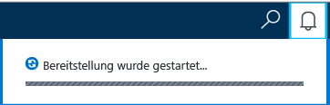
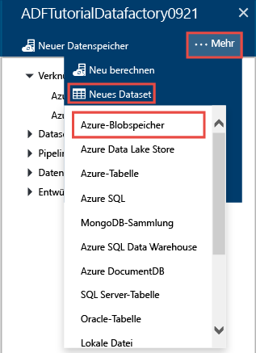
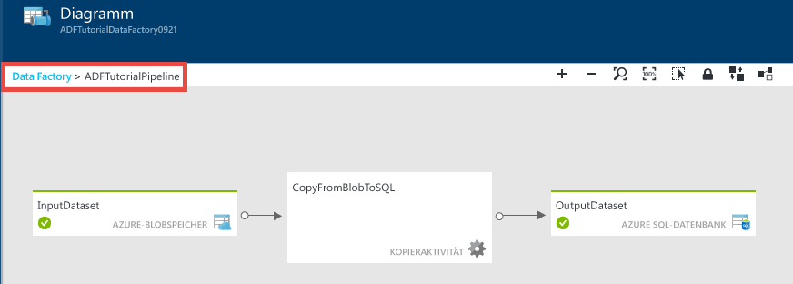
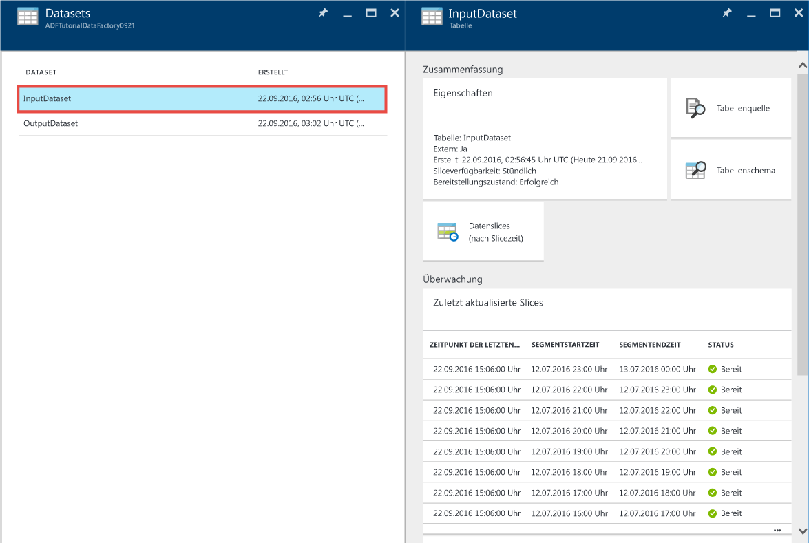
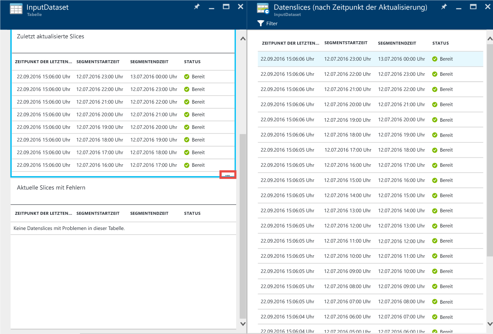
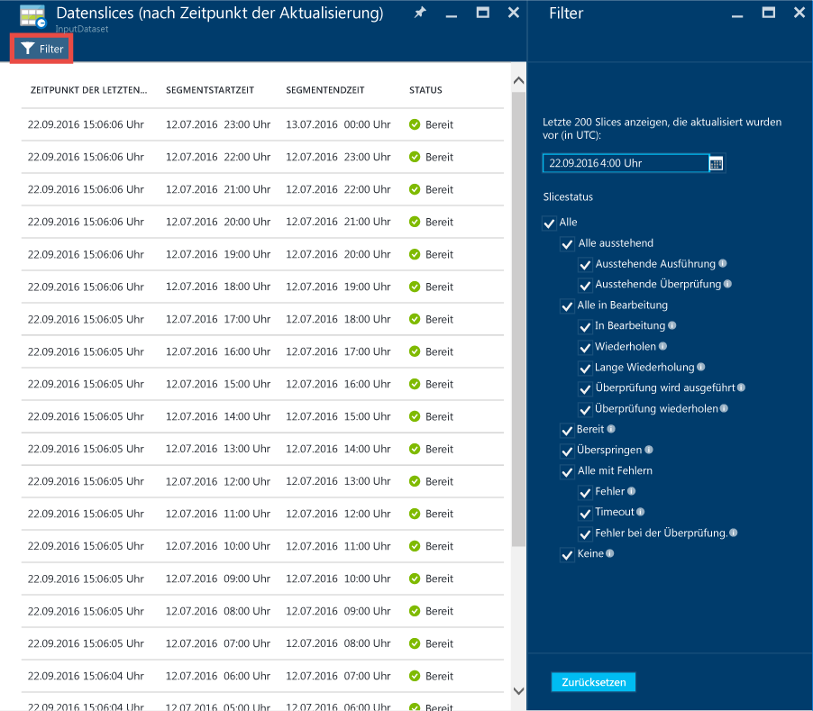
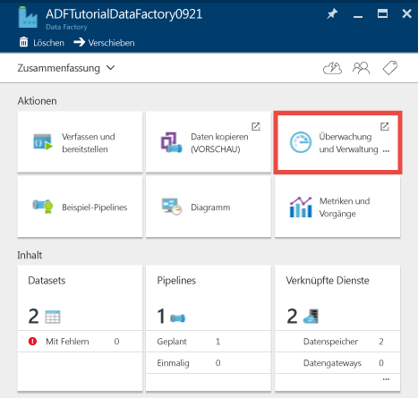
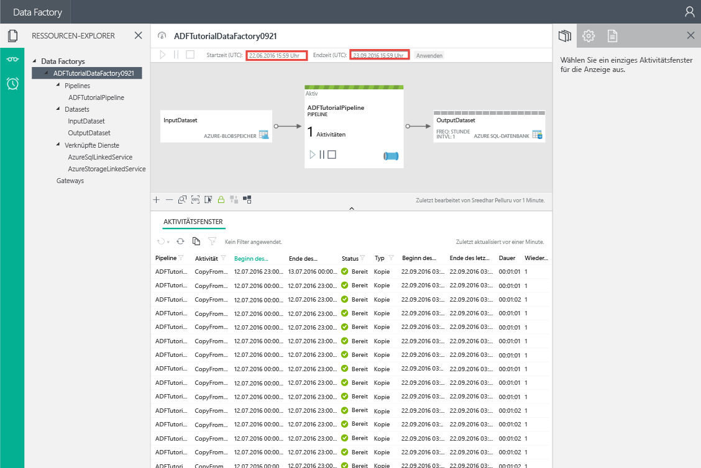
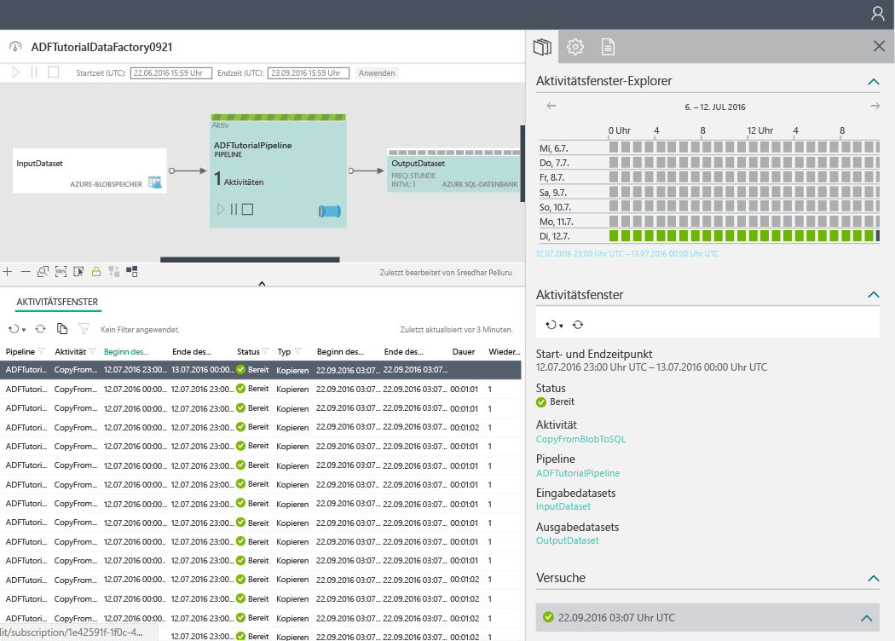

<properties 
	pageTitle="Tutorial: Erstellen einer Pipeline mit Kopieraktivität mithilfe des Azure-Portals | Microsoft Azure" 
	description="In diesem Tutorial erstellen Sie eine Azure Data Factory-Pipeline mit Kopieraktivität mithilfe des Data Factory-Editors im Azure-Portal." 
	services="data-factory" 
	documentationCenter="" 
	authors="spelluru" 
	manager="jhubbard" 
	editor="monicar"/>

<tags 
	ms.service="data-factory" 
	ms.workload="data-services" 
	ms.tgt_pltfrm="na" 
	ms.devlang="na" 
	ms.topic="get-started-article" 
	ms.date="09/16/2016" 
	ms.author="spelluru"/>

# Tutorial: Erstellen einer Pipeline mit Kopieraktivität mithilfe des Azure-Portals
> [AZURE.SELECTOR]
- [Übersicht und Voraussetzungen](data-factory-copy-data-from-azure-blob-storage-to-sql-database.md)
- [Azure-Portal](data-factory-copy-activity-tutorial-using-azure-portal.md)
- [Visual Studio](data-factory-copy-activity-tutorial-using-visual-studio.md)
- [PowerShell](data-factory-copy-activity-tutorial-using-powershell.md)
- [REST-API](data-factory-copy-activity-tutorial-using-rest-api.md)
- [.NET API](data-factory-copy-activity-tutorial-using-dotnet-api.md)
- [Kopier-Assistent](data-factory-copy-data-wizard-tutorial.md)

In diesem Tutorial wird veranschaulicht, wie Sie eine Azure Data Factory mit dem Azure-Portal erstellen und überwachen. Die Pipeline in der Data Factory verwendet eine Kopieraktivität zum Kopieren von Daten aus Azure Blob Storage in Azure SQL-Datenbank.

Hier sind die Schritte angegeben, die Sie im Rahmen dieses Tutorials ausführen:

Schritt | Beschreibung
-----| -----------
[Erstellen einer Azure Data Factory](#create-data-factory) | In diesem Schritt erstellen Sie eine Azure Data Factory mit dem Namen **ADFTutorialDataFactory**.  
[Erstellen von verknüpften Diensten](#create-linked-services) | In diesem Schritt erstellen Sie zwei verknüpfte Dienste: **AzureStorageLinkedService** und **AzureSqlLinkedService**.   „AzureStorageLinkedService“ verbindet den Azure-Speicher und „AzureSqlLinkedService“ die Azure SQL-Datenbank mit „ADFTutorialDataFactory“. Die Eingabedaten für die Pipeline befinden sich in einem Blobcontainer im Azure-Blobspeicher. Ausgabedaten werden in einer Tabelle in der Azure SQL-Datenbank gespeichert. Daher fügen Sie diese beiden Datenspeicher als verknüpfte Dienste der Data Factory hinzu.      
[Erstellen von Eingabe- und Ausgabedatasets](#create-datasets) | Im vorherigen Schritt haben Sie verknüpfte Dienste erstellt, die auf Datenspeicher verweisen, die Ein- und Ausgabedaten enthalten. In diesem Schritt definieren Sie zwei Datasets: **InputDataset** und **OutputDataset**. Die Datasets stehen für die Eingabe- bzw. Ausgabedaten, die in den Datenspeichern gespeichert sind.   Für „InputDataset“ geben Sie den Blobcontainer an, der ein Blob mit den Quelldaten enthält. Für „OutputDataset“ geben Sie die SQL-Tabelle an, in der die Ausgabedaten gespeichert werden. Sie können auch andere Eigenschaften wie Struktur, Verfügbarkeit und die Richtlinie angeben. 
[Erstellen einer Pipeline](#create-pipeline) | In diesem Schritt erstellen Sie die Pipeline **ADFTutorialPipeline** in der ADFTutorialDataFactory.   Sie fügen der Pipeline eine **Kopieraktivität** hinzu, mit der Eingabedaten aus dem Azure-Blob in die Azure SQL-Ausgabetabelle kopiert werden. Die Kopieraktivität dient zum Verschieben von Daten in Azure Data Factory. Sie basiert auf einem global verfügbaren Dienst, mit dem Daten zwischen verschiedenen Datenspeichern sicher, zuverlässig und skalierbar kopiert werden können. Ausführliche Informationen zur Kopieraktivität finden Sie im Artikel [Datenverschiebungsaktivitäten](data-factory-data-movement-activities.md). 
[Überwachen der Pipeline](#monitor-pipeline) | In diesem Schritt überwachen Sie die Slices von Eingabe- und Ausgabetabellen im Azure-Portal.

## Voraussetzungen 
Führen Sie vor dem Durcharbeiten dieses Tutorials die Schritte zur Erfüllung der Voraussetzungen aus, die im Artikel [Übersicht über das Tutorial](data-factory-copy-data-from-azure-blob-storage-to-sql-database.md) aufgeführt sind.

## Erstellen einer Data Factory
In diesem Schritt erstellen Sie im Azure-Portal eine Azure Data Factory namens **ADFTutorialDataFactory**.

1.	Klicken Sie nach dem Anmelden am [Azure-Portal](https://portal.azure.com/) auf **Neu**, wählen Sie **Intelligence + Analytics** (Intelligence und Analyse), und klicken Sie auf **Data Factory**.

	

6. Gehen Sie auf dem Blatt **Neue Data Factory** so vor:
	1. Geben Sie **ADFTutorialDataFactory** als **Namen** ein.
	
  		

		Der Name der Azure Data Factory muss **global eindeutig** sein. Sollte der folgende Fehler auftreten, ändern Sie den Namen der Data Factory (beispielsweise in „<IhrName>ADFTutorialDataFactory“), und wiederholen Sie den Vorgang. Im Thema [Data Factory – Benennungsregeln](data-factory-naming-rules.md) finden Sie Benennungsregeln für Data Factory-Artefakte.
	
			Data factory name “ADFTutorialDataFactory” is not available  
	 
		
	2. Wählen Sie Ihr Azure-**Abonnement** aus.
	3. Führen Sie für die Ressourcengruppe einen der folgenden Schritte aus:
		1. Wählen Sie die Option **Use existing** (Vorhandene verwenden) und dann in der Dropdownliste eine vorhandene Ressourcengruppe.
		2. Wählen Sie **Neu erstellen**, und geben Sie den Namen einer Ressourcengruppe ein.
	
			Bei einigen Schritten dieses Lernprogramms wird davon ausgegangen, dass Sie die Ressourcengruppe namens **ADFTutorialResourceGroup** verwenden. Weitere Informationen über Ressourcengruppen finden Sie unter [Verwenden von Ressourcengruppen zum Verwalten von Azure-Ressourcen](../resource-group-overview.md).
	4. Wählen Sie den **Standort** für die Data Factory aus. In der Dropdownliste werden nur Regionen angezeigt, die vom Data Factory-Dienst unterstützt werden.
	5. Wählen Sie **An Startmenü anheften** aus.
	6. Klicken Sie auf **Create**.

		> [AZURE.IMPORTANT] Zum Erstellen von Data Factory-Instanzen müssen Sie Mitglied der Rolle [Data Factory-Mitwirkender](../active-directory/role-based-access-built-in-roles.md/#data-factory-contributor) auf Abonnement- bzw. Ressourcengruppenebene sein.
		>  
		>  Der Name der Data Factory kann in Zukunft als DNS-Name registriert und so öffentlich sichtbar werden.
9.  Klicken Sie in der Symbolleiste auf das Glockensymbol, um Status-/Benachrichtigungsmeldungen anzuzeigen.

	
10. Nach Abschluss der Erstellung wird das Blatt **Data Factory** wie in dieser Abbildung angezeigt:

    

## Erstellen von verknüpften Diensten
Verknüpfte Dienste verknüpfen Datenspeicher oder Serverdienste mit einer Azure Data Factory. Informationen zu allen Quellen und Senken, die von der Kopieraktion unterstützt werden, finden Sie unter [Unterstützte Datenspeicher](data-factory-data-movement-activities.md##supported-data-stores-and-formats). Eine Liste mit Computediensten, die von Data Factory unterstützt werden, finden Sie unter [Verknüpfte Computedienste](data-factory-compute-linked-services.md). In diesem Tutorial verwenden Sie keine Computedienste.

In diesem Schritt erstellen Sie zwei verknüpfte Dienste: **AzureStorageLinkedService** und **AzureSqlLinkedService**. Der verknüpfte Dienst „AzureStorageLinkedService“ verknüpft ein Azure-Speicherkonto und „AzureSqlLinkedService“ eine Azure SQL-Datenbank mit der **ADFTutorialDataFactory**. Später in diesem Tutorial erstellen Sie eine Pipeline, die Daten aus einem Blobcontainer in „AzureStorageLinkedService“ in eine SQL-Tabelle in „AzureSqlLinkedService“ kopiert.

### Erstellen eines verknüpften Diensts für das Azure-Speicherkonto
1.	Klicken Sie auf dem Blatt **Data Factory** auf die Kachel **Verfassen und bereitstellen**, um den **Editor** für die Data Factory zu starten.

	
5. Klicken Sie im **Editor** auf der Symbolleiste auf die Schaltfläche **Neuer Datenspeicher**, und wählen Sie im Dropdownmenü **Azure-Speicher** aus. Die JSON-Vorlage zum Erstellen eines mit einem Azure-Speicher verknüpften Diensts sollte im rechten Bereich angezeigt werden.

	
6. Ersetzen Sie `<accountname>` und `<accountkey>` durch die Werte für den Kontonamen und -schlüssel Ihres Azure-Speicherkontos.

	
6. Klicken Sie in der Symbolleiste auf **Bereitstellen**. Das bereitgestellte **AzureStorageLinkedService**-Element wird jetzt in der Strukturansicht angezeigt.

	

> [AZURE.NOTE]
Details zu JSON-Eigenschaften finden Sie unter [Verschieben von Daten in einen und aus einem Azure-Blob mithilfe von Azure Data Factory](data-factory-azure-blob-connector.md#azure-storage-linked-service).

### Erstellen eines verknüpften Diensts für die Azure SQL-Datenbank
1. Klicken Sie im **Data Factory-Editor** auf der Symbolleiste auf die Schaltfläche **Neuer Datenspeicher**, und wählen Sie im Dropdownmenü die Option **Azure SQL-Datenbank** aus. Die JSON-Vorlage zum Erstellen eines mit der Azure SQL-Datenbank verknüpften Diensts sollte im rechten Bereich angezeigt werden.
2. Ersetzen Sie `<servername>`, `<databasename>`, `<username>@<servername>` und `<password>` durch die Namen für Ihren Azure SQL-Server, die Datenbank, das Benutzerkonto und das Kennwort.
3. Klicken Sie auf der Symbolleiste auf **Bereitstellen**, um den verknüpften Dienst **AzureSqlLinkedService** zu erstellen und bereitzustellen.
4. Vergewissern Sie sich, dass **AzureSqlLinkedService** in der Strukturansicht angezeigt wird.

> [AZURE.NOTE]
Details zu JSON-Eigenschaften finden Sie unter [Verschieben von Daten in und aus Azure SQL-Datenbank mithilfe von Azure Data Factory](data-factory-azure-sql-connector.md#azure-sql-linked-service-properties).

## Erstellen von Datasets
Im vorherigen Schritt haben Sie die verknüpften Dienste **AzureStorageLinkedService** und **AzureSqlLinkedService** erstellt, um ein Azure Storage-Konto und eine Azure SQL-Datenbank mit der Data Factory **ADFTutorialDataFactory** zu verknüpfen. In diesem Schritt definieren Sie die beiden Datasets **InputDataset** und **OutputDataset**. Sie stellen die Ein- und Ausgabedaten in den Datenspeichern dar, auf die mit „AzureStorageLinkedService“ und „AzureSqlLinkedService“ verwiesen wird. Für „InputDataset“ geben Sie den Blobcontainer an, der ein Blob mit den Quelldaten enthält. Für „OutputDataset“ geben Sie die SQL-Tabelle an, in der die Ausgabedaten gespeichert werden.

### Erstellen eines Eingabedatasets 
In diesem Schritt erstellen Sie ein Dataset namens **InputDataset**, das auf einen Blobcontainer im Azure-Speicher verweist. Dieser wird vom verknüpften Dienst **AzureStorageLinkedService** dargestellt.

1. Klicken Sie im **Editor** für die Data Factory auf **... More** (Mehr), klicken Sie auf **Neues Dataset**, und klicken Sie im Dropdownmenü auf **Azure-Blobspeicher**.

	
2. Ersetzen Sie den JSON-Code im rechten Bereich durch den folgenden JSON-Codeausschnitt:

		{
		  "name": "InputDataset",
		  "properties": {
		    "structure": [
		      {
		        "name": "FirstName",
		        "type": "String"
		      },
		      {
		        "name": "LastName",
		        "type": "String"
		      }
		    ],
		    "type": "AzureBlob",
		    "linkedServiceName": "AzureStorageLinkedService",
		    "typeProperties": {
		      "folderPath": "adftutorial/",
			  "fileName": "emp.txt",
		      "format": {
		        "type": "TextFormat",
		        "columnDelimiter": ","
		      }
		    },
		    "external": true,
		    "availability": {
		      "frequency": "Hour",
		      "interval": 1
		    }
		  }
		}
		
     Beachten Sie folgende Punkte:
	
	- **dataset type** ist auf **AzureBlob** festgelegt.
	- **linkedServiceName** ist auf **AzureStorageLinkedService** festgelegt. Sie haben diesen verknüpften Dienst in Schritt 2 erstellt.
	- **folderPath** ist auf den Container **adftutorial** festgelegt. Sie können auch den Namen eines Blobs im Ordner angeben, indem Sie die **fileName**-Eigenschaft verwenden. Da Sie nicht den Namen des Blobs angeben, werden Daten aus allen Blobs im Container als Eingabedaten betrachtet.
	- **format: type** ist auf **TextFormat** festgelegt.
	- Die Textdatei enthält die beiden Felder **FirstName** und **LastName**, die durch ein Komma getrennt sind (**columnDelimiter**).
	- Die Verfügbarkeit (**availability**) ist auf stündlich (**hourly**) festgelegt (**frequency** auf **hour** und **interval** auf **1**). Der Data Factory-Dienst sucht also stündlich im Stammordner des angegebenen Blobcontainers (**adftutorial**) nach Eingabedaten.
	
	Wenn Sie keinen Dateinamen (**fileName**) für ein **Eingabe**dataset angeben, werden alle Dateien/Blobs aus dem Eingabeordner (**folderPath**) als Eingaben angesehen. Wenn Sie einen Dateinamen in der JSON-Datei angeben, wird nur die angegebene Datei/der angegebene Blob als Eingabe betrachtet.
 
	Wenn Sie **fileName** für eine **Ausgabetabelle** nicht angeben, werden die generierten Dateien in **folderPath** im folgenden Format benannt: Data.&lt;GUID&gt;.txt (Beispiel: Data.0a405f8a-93ff-4c6f-b3be-f69616f1df7a.txt.).

	Um **folderPath** und **fileName** dynamisch basierend auf der **SliceStart**-Zeit festzulegen, verwenden Sie die **partitionedBy**-Eigenschaft. Im folgenden Beispiel verwendet folderPath die Angaben für Jahr, Monat und Tag aus „SliceStart“ (Startzeit des zu verarbeitenden Slices) und „fileName“ die Angabe für Stunde aus „SliceStart“. Wenn beispielsweise ein Slice für den Zeitpunkt „2016-09-20T08:00:00“ erzeugt wird, wird „folderName“ auf „wikidatagateway/wikisampledataout/2016/09/20“ und „fileName“ auf „08.csv“ festgelegt.

			"folderPath": "wikidatagateway/wikisampledataout/{Year}/{Month}/{Day}",
	        "fileName": "{Hour}.csv",
	        "partitionedBy": 
	        [
	        	{ "name": "Year", "value": { "type": "DateTime", "date": "SliceStart", "format": "yyyy" } },
	            { "name": "Month", "value": { "type": "DateTime", "date": "SliceStart", "format": "MM" } }, 
	            { "name": "Day", "value": { "type": "DateTime", "date": "SliceStart", "format": "dd" } }, 
	            { "name": "Hour", "value": { "type": "DateTime", "date": "SliceStart", "format": "hh" } } 
	        ],
2. Klicken Sie in der Symbolleiste auf **Bereitstellen**, um das Dataset **InputDataset** zu erstellen und bereitzustellen. Vergewissern Sie sich, dass **InputDataset** in der Strukturansicht angezeigt wird.

> [AZURE.NOTE]
Details zu JSON-Eigenschaften finden Sie unter [Verschieben von Daten in einen und aus einem Azure-Blob mithilfe von Azure Data Factory](data-factory-azure-blob-connector.md#azure-blob-dataset-type-properties).

### Erstellen des Ausgabedatasets
In diesem Teilschritt erstellen Sie ein Ausgabedataset namens **OutputDataset**. Dieses Dataset verweist auf eine SQL-Tabelle in der durch **AzureSqlLinkedService** dargestellten Azure SQL-Datenbank.

1. Klicken Sie im **Editor** für die Data Factory auf **... More** (Mehr), klicken Sie auf **Neues Dataset**, und klicken Sie im Dropdownmenü auf **Azure SQL**.
2. Ersetzen Sie den JSON-Code im rechten Bereich durch den folgenden JSON-Codeausschnitt:

		{
		  "name": "OutputDataset",
		  "properties": {
		    "structure": [
		      {
		        "name": "FirstName",
		        "type": "String"
		      },
		      {
		        "name": "LastName",
		        "type": "String"
		      }
		    ],
		    "type": "AzureSqlTable",
		    "linkedServiceName": "AzureSqlLinkedService",
		    "typeProperties": {
		      "tableName": "emp"
		    },
		    "availability": {
		      "frequency": "Hour",
		      "interval": 1
		    }
		  }
		}
		
     Beachten Sie folgende Punkte:
	
	- **dataset type** ist auf **AzureSQLTable** festgelegt.
	- **linkedServiceName** ist auf **AzureSqlLinkedService** festgelegt (diesen verknüpften Dienst haben Sie in Schritt 2 erstellt).
	- **tablename** ist auf **emp** festgelegt.
	- Die emp-Tabelle in der Datenbank enthält drei Spalten: **ID**, **FirstName** und **LastName**. Da es sich bei „ID“ um eine Identitätsspalte handelt, müssen Sie hier lediglich **FirstName** und **LastName** angeben.
	- Die Verfügbarkeit (**availability**) ist auf **hourly**, (**frequency** auf **hour** und **interval** auf **1**) festgelegt. Der Data Factory-Dienst generiert in der Tabelle **emp** in der Azure SQL-Datenbank stündlich einen Ausgabedatenslice.

3. Klicken Sie in der Symbolleiste auf **Bereitstellen**, um das Dataset **OutputDataset** zu erstellen und bereitzustellen. Vergewissern Sie sich, dass **OutputDataset** in der Strukturansicht angezeigt wird.

> [AZURE.NOTE]
Details zu JSON-Eigenschaften finden Sie unter [Verschieben von Daten in und aus Azure SQL-Datenbank mithilfe von Azure Data Factory](data-factory-azure-sql-connector.md#azure-sql-linked-service-properties).

## Erstellen der Pipeline
In diesem Schritt erstellen Sie eine Pipeline mit einer **Kopieraktivität**, für die **InputDataset** als Eingabe und **OutputDataset** als Ausgabe verwendet wird.

1. Klicken Sie im **Editor** für die Data Factory auf **... More** (Mehr), und klicken Sie auf **Neue Pipeline**. Alternativ können Sie in der Strukturansicht mit der rechten Maustaste auf **Pipelines** und dann auf **Neue Pipeline** klicken.
2. Ersetzen Sie den JSON-Code im rechten Bereich durch den folgenden JSON-Codeausschnitt:
		
		{
		  "name": "ADFTutorialPipeline",
		  "properties": {
		    "description": "Copy data from a blob to Azure SQL table",
		    "activities": [
		      {
		        "name": "CopyFromBlobToSQL",
		        "type": "Copy",
		        "inputs": [
		          {
		            "name": "InputDataset"
		          }
		        ],
		        "outputs": [
		          {
		            "name": "OutputDataset"
		          }
		        ],
		        "typeProperties": {
		          "source": {
		            "type": "BlobSource"
		          },
		          "sink": {
		            "type": "SqlSink",
		            "writeBatchSize": 10000,
		            "writeBatchTimeout": "60:00:00"
		          }
		        },
		        "Policy": {
		          "concurrency": 1,
		          "executionPriorityOrder": "NewestFirst",
		          "retry": 0,
		          "timeout": "01:00:00"
		        }
		      }
		    ],
		    "start": "2016-07-12T00:00:00Z",
		    "end": "2016-07-13T00:00:00Z"
		  }
		} 

	Beachten Sie folgende Punkte:

	- Der Abschnitt „Activities“ enthält nur eine Aktivität, deren **type** auf **Copy** festgelegt ist.
	- Die Eingabe für die Aktivität ist auf **InputDataset** und die Ausgabe für die Aktivität ist auf **OutputDataset** festgelegt.
	- Im Abschnitt **typeProperties** ist **BlobSource** als Quelltyp und **SqlSink** als Senkentyp angegeben.

	Ersetzen Sie den Wert der **start** Eigenschaft durch den aktuellen Tag und den der **End**-Eigenschaft durch den nächsten Tag. Sie können auch nur den Datumsteil angeben und den Uhrzeitteil überspringen. „2016-02-03“ entspricht z.B. „2016-02-03T00:00:00Z“.
	
	Die Start- und Endzeit von Datums-/Uhrzeitangaben müssen im [ISO-Format](http://en.wikipedia.org/wiki/ISO_8601) angegeben werden. Beispiel: 2016-10-14T16:32:41Z. Die Zeitangabe **end** ist optional, wird aber in diesem Tutorial verwendet.
	
	Wenn für die **end**-Eigenschaft kein Wert angegeben wird, wird sie als „**start + 48 Stunden**“ berechnet. Um die Pipeline auf unbestimmte Zeit auszuführen, geben Sie als Wert für die **end**-Eigenschaft **9999-09-09** an.
	
	Im obigen Beispiel ergeben sich 24 Datenslices, da jede Stunde ein Datenslice erstellt wird.
	
4. Klicken Sie auf der Symbolleiste auf **Bereitstellen**, um die Pipeline **ADFTutorialPipeline** bereitzustellen. Vergewissern Sie sich, dass die Pipeline in der Strukturansicht angezeigt wird.
5. Schließen Sie jetzt das Blatt **Editor**, indem Sie auf **X** klicken. Klicken Sie erneut auf **X**, um die **Data Factory**-Startseite für **ADFTutorialDataFactory** anzuzeigen.

**Glückwunsch!** Sie haben erfolgreich eine Azure Data Factory, verknüpfte Dienste, Tabellen und eine Pipeline erstellt und die Pipeline geplant.
 
### Anzeigen einer Diagrammansicht der Data Factory 
1. Klicken Sie auf dem Blatt **Data Factory** auf **Diagramm**.

	
2. Ein Diagramm wie in der folgenden Abbildung wird angezeigt:

	

	Sie können die Ansicht vergrößern, verkleinern, auf 100 % anpassen, an die Fenstergröße anpassen, Pipelines und Tabellen automatisch positionieren und Informationen zur Datenherkunft anzeigen (d. h. vor- und nachgelagerte Elemente ausgewählter Elemente hervorheben). Sie können auf ein Objekt (in der Ein-/Ausgabetabelle oder Pipeline) doppelklicken, um seine Eigenschaften anzuzeigen.
3. Klicken Sie in der Diagrammansicht mit der rechten Maustaste auf **ADFTutorialPipeline**, und klicken Sie dann auf**Pipeline öffnen**.

	
4. Die Aktivitäten in der Pipeline sowie Ein- und Ausgabedatasets für die Aktivitäten sollten angezeigt werden. In diesem Tutorial gibt es nur eine Aktivität in der Pipeline (Kopieraktivität) mit „InputDataset“ als Eingabedataset und „OutputDataset“ als Ausgabedataset.

	
5. Klicken Sie auf der Breadcrumb-Leiste links oben auf **Data Factory**, um zur Diagrammansicht zurückzukehren. In der Diagrammansicht werden alle Pipelines angezeigt. Bei diesem Beispiel haben Sie nur eine Pipeline erstellt.
 

## Überwachen der Pipeline
In diesem Schritt verwenden Sie das Azure-Portal zur Überwachung der Aktivitäten in einer Azure Data Factory.

### Überwachen der Pipeline mit der Diagrammansicht

1. Klicken Sie auf **X**, um die Ansicht **Diagramm** zu schließen und die Data Factory-Startseite für die Data Factory anzuzeigen. Führen Sie die folgenden Schritte aus, wenn Sie den Webbrowser geschlossen haben:
	2. Navigieren Sie zum [Azure-Portal](https://portal.azure.com/).
	2. Doppelklicken Sie im **Startmenü** auf **ADFTutorialDataFactory**, oder klicken Sie im Menü auf der linken Seite auf **Data Factorys**, und suchen Sie nach „ADFTutorialDataFactory“.
3. In diesem Fenster sollten die Anzahl und die Namen der von Ihnen erstellten Tabellen und Pipelines angezeigt werden.

	
4. Klicken Sie nun auf die Kachel **Datasets**.
5. Klicken Sie auf dem Blatt **Datasets** auf **InputDataset**. Bei diesem Dataset handelt es sich um das Eingabedataset für **ADFTutorialPipeline**.

	
5. Klicken Sie auf **… (Auslassungspunkte)**, um alle Datenslices anzuzeigen.

	

	Beachten Sie, dass alle Datenslices bis zum aktuellen Zeitpunkt den Status **Bereit** aufweisen, da die Datei **emp.txt** ständig im Blobcontainer **adftutorial\\input** vorhanden ist. Überprüfen Sie, ob unten im Abschnitt **Letzte fehlerhafte Slices** keine Slices angezeigt werden.

	Die Listen **Letzte aktualisierte Slices** und **Letzte fehlerhafte Slices** werden anhand der **UHRZEIT DER LETZTEN AKTUALISIERUNG** sortiert.
    
	Klicken Sie auf der Symbolleiste auf **Filter**, um die Slices zu filtern.
	
	
6. Schließen Sie die Blätter, bis das Blatt **Datasets** angezeigt wird. Klicken Sie auf **OutputDataset**. Bei diesem Dataset handelt es sich um das Ausgabedataset für **ADFTutorialPipeline**.

	
6. Das Blatt **OutputDataset** sollte wie in der folgenden Abbildung dargestellt angezeigt werden:

	
7. Beachten Sie, dass die Datenslices bis zum aktuellen Zeitpunkt bereits erstellt wurden und den Status **Bereit** aufweisen. Im Abschnitt **Problemslices** am unteren Rand werden keine Slices angezeigt.
8. Klicken Sie auf **… (Auslassungspunkte)**, um alle Slices anzuzeigen.

	
9. Klicken Sie in der Liste auf einen beliebigen Datenslice. Das Blatt **Datenslice** wird angezeigt.

	
  
	Wenn der Slice nicht den Status **Bereit** hat, sehen Sie die vorgelagerten Slices, die nicht bereit sind und das Ausführen des aktuellen Slices blockieren, in der Liste **Vorgelagerte Slices, die nicht bereit sind**.
11. Auf dem Blatt **DATENSLICE** sollten in der Liste im unteren Bereich alle Aktivitätsausführungen angezeigt werden. Klicken Sie auf eine **Aktivitätsausführung**, um das Blatt **Details zur Aktivitätsausführung** anzuzeigen.

	
12. Klicken Sie auf **X**, um alle Blätter zu schließen, bis Sie such wieder im Startfenster für **ADFTutorialDataFactory** befinden.
14. (Optional) Klicken Sie auf der Startseite von **ADFTutorialDataFactory** auf **Pipelines**, dann auf dem Blatt **Pipelines** auf **ADFTutorialPipeline**, und führen Sie eine Detailsuche in den Eingabetabellen (**Consumed**) oder Ausgabetabellen (**Produced**) aus.
15. Starten Sie **SQL Server Management Studio**, stellen Sie eine Verbindung mit der Azure SQL-Datenbank her, und überprüfen Sie, ob die Zeilen in die Tabelle **emp** der Datenbank eingefügt wurden.

	

### Überwachen der Pipeline mit der App „Überwachung und Verwaltung“
Sie können die App „Überwachung und Verwaltung“ auch zum Überwachen Ihrer Pipelines verwenden. Ausführliche Informationen zur Verwendung dieser App finden Sie unter [Überwachen und Verwalten von Azure Data Factory-Pipelines mit der neuen App „Überwachung und Verwaltung“](data-factory-monitor-manage-app.md).

1. Klicken Sie auf der Startseite Ihrer Data Factory auf die Kachel **Überwachung und Verwaltung**.

	
2. Die **App „Überwachung und Verwaltung“** wird angezeigt. Ändern Sie die **Startzeit** und **Endzeit** in die Startzeit (2016-07-12) und Endzeit (2016-07-13) Ihrer Pipeline, und klicken Sie auf **Übernehmen**.

	
3. Wählen Sie in der Liste **Aktivitätsfenster** ein Aktivitätsfenster aus, um die Details dazu anzuzeigen. 

## Zusammenfassung 
In diesem Lernprogramm haben Sie eine Azure Data Factory erstellt, um Daten aus einem Azure-Blob in eine Azure SQL-Datenbank zu kopieren. Sie haben mithilfe des Azure-Portals die Data Factory, verknüpfte Dienste, Datasets und eine Pipeline erstellt. Nachfolgend sind die allgemeinen Schritte aufgeführt, die Sie in diesem Tutorial ausgeführt haben:

1.	Sie haben eine Azure **Data Factory** erstellt.
2.	Sie haben **verknüpfte Dienste** erstellt:
	1. Einen verknüpften **Azure Storage**-Dienst zum Verknüpfen Ihres Azure Storage-Kontos, in dem Eingabedaten enthalten sind.
	2. Einen verknüpften **Azure SQL**-Dienst zum Verknüpfen Ihrer Azure SQL-Datenbank, in der die Ausgabedaten enthalten sind.
3.	Sie haben **Datasets** erstellt, die Eingabedaten und Ausgabedaten für Pipelines beschreiben.
4.	Sie haben eine **Pipeline** mit einer **Kopieraktivität**, mit **BlobSource** als Quelle und mit **SqlSink** als Senke erstellt.

## Weitere Informationen
| Thema | Beschreibung |
| :---- | :---- |
| [Datenverschiebungsaktivitäten](data-factory-data-movement-activities.md) | Dieser Artikel enthält ausführliche Informationen zur Kopieraktivität, die Sie in diesem Tutorial verwendet haben. |
| [Planung und Ausführung](data-factory-scheduling-and-execution.md) | In diesem Artikel werden die Planungs- und Ausführungsaspekte des Azure Data Factory-Anwendungsmodells erläutert. |
| [Pipelines](data-factory-create-pipelines.md) | Dieser Artikel enthält Informationen zu Pipelines und Aktivitäten in Azure Data Factory. |
| [Datasets](data-factory-create-datasets.md) | Dieser Artikel enthält Informationen zu Datasets in Azure Data Factory.
| [Überwachen und Verwalten von Pipelines mit der Überwachungs-App](data-factory-monitor-manage-app.md) | In diesem Artikel wird das Überwachen, Verwalten und Debuggen von Pipelines mit der App für die Überwachung und Verwaltung beschrieben. 

<!---HONumber=AcomDC_0928_2016-->