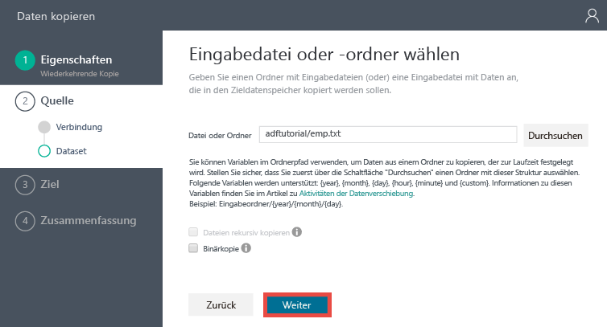
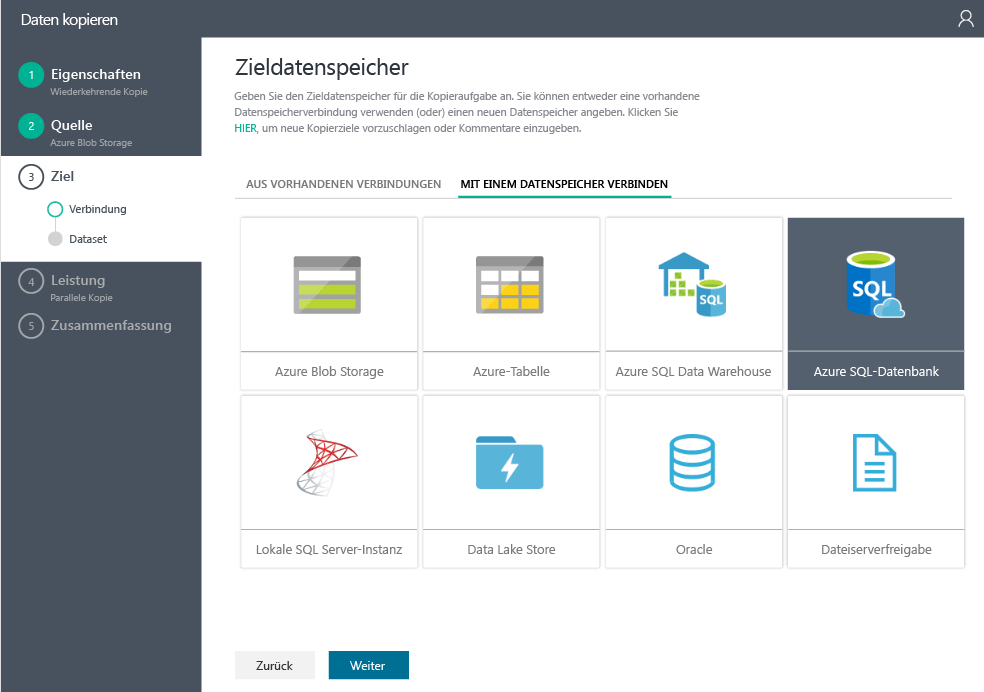
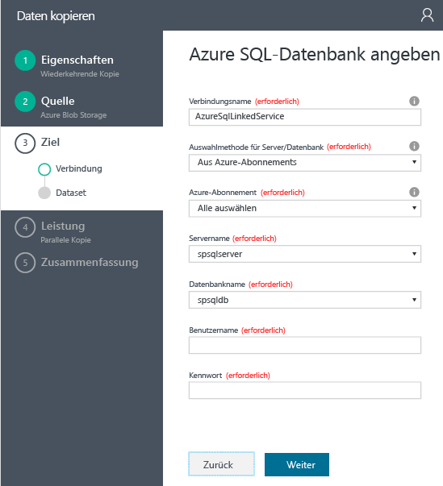
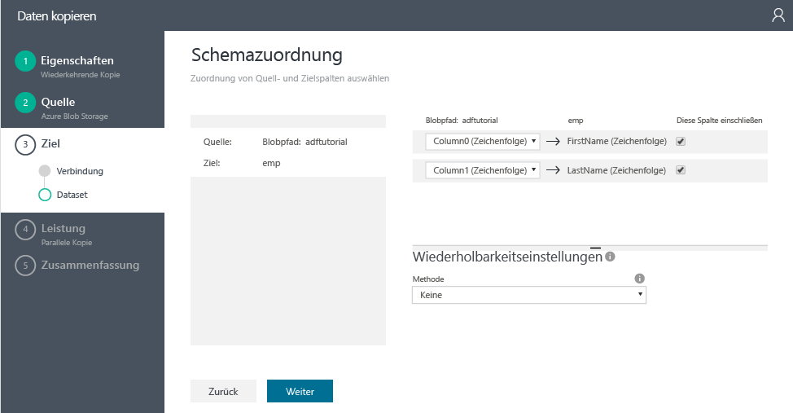
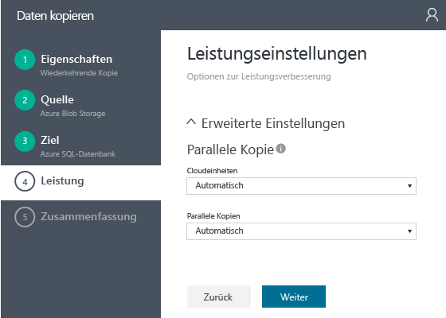
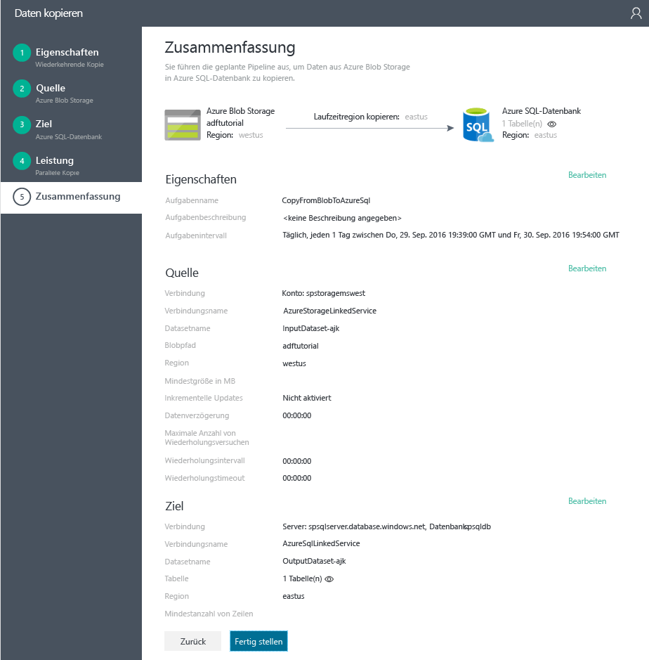

<properties 
	pageTitle="Tutorial: Erstellen einer Pipeline mit dem Kopier-Assistenten" 
	description="In diesem Tutorial erstellen Sie eine Azure Data Factory-Pipeline mit einer Kopieraktivität, indem Sie den von der Data Factory unterstützten Kopier-Assistenten verwenden." 
	services="data-factory" 
	documentationCenter="" 
	authors="spelluru" 
	manager="jhubbard" 
	editor="monicar"/>

<tags ms.service="data-factory" ms.workload="data-services" ms.tgt_pltfrm="na" ** ms.devlang="na" ms.topic="get-started-article" ms.date="09/16/2016" ms.author="spelluru"/>

# Tutorial: Erstellen einer Pipeline mit Kopieraktivität mithilfe des Data Factory-Kopier-Assistenten
> [AZURE.SELECTOR]
- [Übersicht und Voraussetzungen](data-factory-copy-data-from-azure-blob-storage-to-sql-database.md)
- [Kopier-Assistent](data-factory-copy-data-wizard-tutorial.md)
- [Azure-Portal](data-factory-copy-activity-tutorial-using-azure-portal.md)
- [Visual Studio](data-factory-copy-activity-tutorial-using-visual-studio.md)
- [PowerShell](data-factory-copy-activity-tutorial-using-powershell.md)
- [REST-API](data-factory-copy-activity-tutorial-using-rest-api.md)
- [.NET API](data-factory-copy-activity-tutorial-using-dotnet-api.md)

Mit dem **Kopier-Assistenten** von Azure Data Factory können Sie einfach und schnell eine Pipeline erstellen, mit der das Szenario für die Datenerfassung und -verschiebung implementiert wird. Daher empfehlen wir Ihnen, den Assistenten als ersten Schritt zum Erstellen einer einfachen Pipeline für die Datenverschiebung zu verwenden. In diesem Tutorial wird gezeigt, wie Sie eine Azure Data Factory erstellen, den Kopier-Assistenten starten und die Schritte zum Angeben von Details zur Datenerfassung bzw. -verschiebung ausführen. Nachdem Sie die Schritte im Assistenten durchgeführt haben, erstellt der Assistent automatisch eine Pipeline mit einer Kopieraktivität, um Daten aus einem Azure-Blobspeicher in eine Azure SQL-Datenbank zu kopieren. Ausführliche Informationen zur Kopieraktivität finden Sie im Artikel [Datenverschiebungsaktivitäten](data-factory-data-movement-activities.md).

> [AZURE.IMPORTANT] Der Artikel [Kopieren von Daten aus Blob Storage in SQL-Datenbank mithilfe von Data Factory](data-factory-copy-data-from-azure-blob-storage-to-sql-database.md) enthält eine Übersicht über das Tutorial und die Schritte, mit denen die **Voraussetzungen** vor dem Durcharbeiten dieses Tutorials erfüllt werden.

## Erstellen einer Data Factory
In diesem Schritt erstellen Sie im Azure-Portal eine Azure Data Factory namens **ADFTutorialDataFactory**.

1.	Klicken Sie nach dem Anmelden am [Azure-Portal](https://portal.azure.com) oben links auf **+ NEU**, klicken Sie auf **Intelligence + Analytics** (Intelligence und Analyse), und klicken Sie auf **Data Factory**.

	

6. Gehen Sie auf dem Blatt **Neue Data Factory** so vor:
	1. Geben Sie **ADFTutorialDataFactory** als **Namen** ein. Der Name der Azure Data Factory muss global eindeutig sein. Bei Anzeige der Fehlermeldung **Data Factory-Name "ADFTutorialDataFactory" ist nicht verfügbar** ändern Sie den Namen der Data Factory (z. B.in "IhrNameADFTutorialDataFactory") und wiederholen den Vorgang. Im Thema [Data Factory – Benennungsregeln](data-factory-naming-rules.md) finden Sie Benennungsregeln für Data Factory-Artefakte.
	 
		
	
		> [AZURE.NOTE] Der Name der Data Factory kann in Zukunft als DNS-Name registriert und so öffentlich sichtbar werden.
	2. Wählen Sie Ihr Azure-**Abonnement** aus.
	3. Führen Sie unter „Ressourcengruppe“ einen der folgenden Schritte aus:
		1. Wählen Sie **Use existing** (Vorhandene verwenden), um eine vorhandene Ressourcengruppe auszuwählen.
		2. Wählen Sie **Neu erstellen**, um einen Namen für eine Ressourcengruppe einzugeben.

			Bei einigen Schritten dieses Lernprogramms wird davon ausgegangen, dass Sie die Ressourcengruppe namens **ADFTutorialResourceGroup** verwenden. Weitere Informationen über Ressourcengruppen finden Sie unter [Verwenden von Ressourcengruppen zum Verwalten von Azure-Ressourcen](../resource-group-overview.md).
	3. Wählen Sie einen **Standort** für die Data Factory aus.
	4. Aktivieren Sie unten auf dem Blatt das Kontrollkästchen **An Dashboard anheften**.
	5. Klicken Sie auf **Erstellen**.
	
		
10. Nach Abschluss der Erstellung wird das Blatt **Data Factory** wie in der folgenden Abbildung dargestellt angezeigt:

    

## Starten und Verwenden des Kopier-Assistenten

1. Klicken Sie auf der Data Factory-Startseite auf die Kachel **Daten kopieren**, um den **Kopier-Assistenten** zu starten.

	> [AZURE.NOTE] Wenn Sie feststellen, dass der Webbrowser bei der Autorisierung hängen bleibt, deaktivieren Sie die Einstellung **Cookies und Websitedaten von Drittanbietern blockieren**, oder lassen Sie die Einstellung aktiviert, und erstellen Sie eine Ausnahme für **login.microsoftonline.com**. Versuchen Sie anschließend erneut, den Assistenten zu starten.
2. Auf der Seite **Eigenschaften**:
	1. Geben Sie unter **Aufgabenname** den Namen **CopyFromBlobToAzureSql** ein.
	2. Geben Sie eine **Beschreibung** ein (optional).
	3. Ändern Sie **Startdatum/-zeit** und **Enddatum/-zeit** so, dass das Enddatum auf den heutigen Tag und das Startdatum auf fünf Tage vor dem heutigen Tag festgelegt ist.
	3. Klicken Sie auf **Next**.

	
3. Klicken Sie auf der Seite **Quelldatenspeicher** auf die Kachel **Azure Blob Storage**. Sie können diese Seite verwenden, um den Quelldatenspeicher für die Kopieraufgabe anzugeben. Sie können einen verknüpften Datenspeicherdienst verwenden oder einen neuen Datenspeicher angeben. Klicken Sie zum Verwenden eines vorhandenen verknüpften Diensts auf **FROM EXISTING LINKED SERVICES** (ÜBER VORHANDENE VERKNÜPFTE DIENSTE), und wählen Sie den richtigen verknüpften Dienst aus.

	
5. Auf der Seite **Azure Blob Storage-Konto angeben**:
	1. Geben Sie unter **Name des verknüpften Diensts** als Name **AzureStorageLinkedService** ein.
	2. Überprüfen Sie, ob unter **Kontoauswahlmethode** die Option **Über Azure-Abonnements** ausgewählt ist.
	3. Wählen Sie Ihr Azure-**Abonnement** aus.
	3. Wählen Sie in der Liste mit den Azure-Speicherkonten, die im ausgewählten Abonnement verfügbar sind, ein **Azure-Speicherkonto** aus. Sie können sich auch für das manuelle Eingeben von Speicherkontoeinstellungen entscheiden, indem Sie unter **Kontoauswahlmethode** die Option **Manuell eingeben** auswählen und dann auf **Weiter** klicken.

	
6. Auf der Seite **Eingabedatei oder -ordner auswählen**:
	1. Navigieren Sie zum Ordner **adftutorial**.
	2. Wählen Sie **emp.txt** aus, und klicken Sie auf **Auswählen**.
	3. Klicken Sie auf **Next**.

	
7. Klicken Sie auf der Seite **Choose the input file or folder** (Eingabedatei oder -ordner auswählen) auf **Weiter**. Aktivieren Sie nicht die Option **Binary copy** (Binärkopie).

	
8. Auf der Seite **File format settings** (Dateiformateinstellungen) werden die Trennzeichen und das Schema angezeigt. Diese Informationen werden vom Assistenten beim Analysieren der Datei automatisch erkannt. Sie können die Trennzeichen auch manuell eingeben, um die automatische Erkennung für den Kopier-Assistenten zu beenden oder die Werte zu überschreiben. Klicken Sie auf **Weiter**, nachdem Sie die Trennzeichen und Vorschaudaten geprüft haben.

	
8. Wählen Sie auf der Seite „Zieldatenspeicher“ die Option **Azure SQL-Datenbank**, und klicken Sie auf **Weiter**.

	
9. Auf der Seite **Azure SQL-Datenbank angeben**:
	1. Geben Sie im Feld **Verbindungsname** den Text **AzureSqlLinkedService** ein.
	2. Überprüfen Sie, ob unter **Server/database selection method** (Server-/Datenbankauswahlmethode) die Option **Über Azure-Abonnements** ausgewählt ist.
	3. Wählen Sie Ihr Azure-**Abonnement** aus.
	2. Wählen Sie **Servername** und **Datenbank** aus.
	4. Geben Sie **Benutzername** und **Kennwort** ein.
	5. Klicken Sie auf **Next**.

	
9. Wählen Sie auf der Seite **Tabellenzuordnung** für das Feld **Ziel** in der Dropdownliste die Option **emp** aus, und klicken Sie auf den **Pfeil nach unten** (optional), um das Schema und eine Vorschau der Daten anzuzeigen.

	
10. Klicken Sie auf der Seite **Schemazuordnung** auf **Weiter**.

	
11. Klicken Sie auf der Seite **Leistungseinstellungen** auf **Weiter**.

	
11. Überprüfen Sie die Informationen auf der Seite **Zusammenfassung**, und klicken Sie auf **Fertig stellen**. Der Assistent erstellt zwei verknüpfte Dienste, zwei Datasets (Eingabe und Ausgabe) und eine Pipeline in der Data Factory erstellt (von der aus Sie den Kopier-Assistenten gestartet haben).

	

## Starten der Anwendung „Überwachung und Verwaltung“ 
12. Klicken Sie auf der Seite **Bereitstellung** auf den Link **Zum Überwachen der Kopierpipeline hier klicken**.

	
13. Verwenden Sie die Anleitung unter [Überwachen und Verwalten der Pipeline mit der Überwachungs-App](data-factory-monitor-manage-app.md), um zu erfahren, wie Sie die erstellte Pipeline überwachen können. Klicken Sie in der Liste **AKTIVITÄTSFENSTER** auf das Symbol **Aktualisieren**, um den Slice anzuzeigen.

	
 	
	> [AZURE.NOTE] Klicken Sie unten in der Liste **AKTIVITÄTSFENSTER** auf die Schaltfläche **Aktualisieren**, um den aktuellen Status anzuzeigen. Die Liste wird nicht automatisch aktualisiert.

## Weitere Informationen
| Thema | Beschreibung |
| :---- | :---- |
| [Datenverschiebungsaktivitäten](data-factory-data-movement-activities.md) | Dieser Artikel enthält ausführliche Informationen zur Kopieraktivität, die Sie in diesem Tutorial verwendet haben. |
| [Planung und Ausführung](data-factory-scheduling-and-execution.md) | In diesem Artikel werden die Planungs- und Ausführungsaspekte des Azure Data Factory-Anwendungsmodells erläutert. |
| [Pipelines](data-factory-create-pipelines.md) | In diesem Artikel erhalten Sie Informationen zu Pipelines und Aktivitäten in Azure Data Factory und erfahren, wie diese zum Erstellen datengesteuerter End-to-End-Workflows für Ihr Szenario oder Ihr Unternehmen genutzt werden können. |
| [Datasets](data-factory-create-datasets.md) | Dieser Artikel enthält Informationen zu Datasets in Azure Data Factory.
| [Überwachen und Verwalten von Pipelines mit der Überwachungs-App](data-factory-monitor-manage-app.md) | In diesem Artikel wird das Überwachen, Verwalten und Debuggen von Pipelines mit der App für die Überwachung und Verwaltung beschrieben. 

<!---HONumber=AcomDC_1005_2016-->