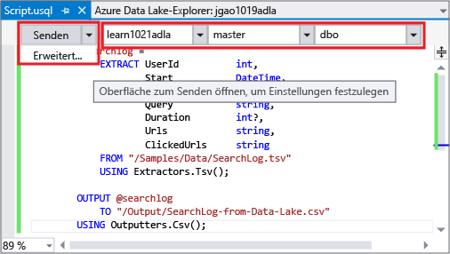
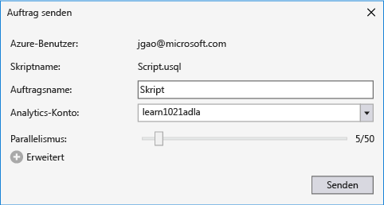
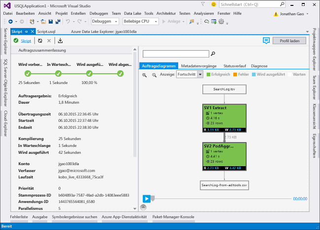

# <a name="develop-u-sql-scripts-by-using-data-lake-tools-for-visual-studio"></a>Entwickeln von U-SQL-Skripts mit Data Lake-Tools für Visual Studio
[!INCLUDE [get-started-selector](../../includes/data-lake-analytics-selector-get-started.md)]


Erfahren Sie, wie Sie mit Visual Studio Azure Data Lake Analytics-Konten erstellen, Aufträge in [U-SQL](data-lake-analytics-u-sql-get-started.md) definieren und Aufträge an den Data Lake Analytics-Dienst übermitteln. Weitere Informationen zu Data Lake Analytics finden Sie unter [Übersicht über Azure Data Lake Analytics](data-lake-analytics-overview.md).


## <a name="prerequisites"></a>Voraussetzungen

* **Visual Studio:** alle Editionen außer Express werden unterstützt.
    * Visual Studio 2017
    * Visual Studio 2015
    * Visual Studio 2013
* **Microsoft Azure SDK für .NET**, Version 2.7.1 oder höher.  Führen Sie die Installation mit dem [Webplattform-Installer](http://www.microsoft.com/web/downloads/platform.aspx)durch.
* Ein **Data Lake Analytics**-Konto. Informationen zum Erstellen eines Kontos finden Sie unter [Erste Schritte mit Azure Data Lake Analytics mithilfe des Azure-Portals](data-lake-analytics-get-started-portal.md).

## <a name="install-azure-data-lake-tools-for-visual-studio"></a>Installieren von Azure Data Lake Tools für Visual Studio 

Sie können Azure Data Lake Tools für Visual Studio [über das Download Center](http://aka.ms/adltoolsvs) herunterladen und installieren. Beachten Sie nach der Installation Folgendes:
* Der Knoten **Server-Explorer** > **Azure** enthält den Knoten **Data Lake Analytics**. 
* Das Menü **Extras** enthält die Option **Data Lake**.

## <a name="connect-to-an-azure-data-lake-analytics-account"></a>Herstellen einer Verbindung mit einem Azure Data Lake Analytics-Konto

1. Öffnen Sie Visual Studio.
2. Öffnen Sie Server-Explorer, indem Sie **Ansicht** > **Server-Explorer** auswählen.
3. Klicken Sie mit der rechten Maustaste auf **Azure**. Wählen Sie dann **Verbindung mit Microsoft Azure-Abonnement herstellen** aus, und befolgen Sie die Anweisungen.
4. Wählen Sie im Server-Explorer **Azure** > **Data Lake Analytics** aus. Es wird eine Liste Ihrer Data Lake Analytics-Konten angezeigt.


## <a name="write-your-first-u-sql-script"></a>Schreiben Ihres ersten U-SQL-Skripts

Der folgende Text ist ein einfaches U-SQL-Skript. Es definiert ein kleines Dataset und schreibt dieses Dataset als Datei mit dem Namen `/data.csv` in die Standardinstanz von Data Lake Store.

```
@a  = 
    SELECT * FROM 
        (VALUES
            ("Contoso", 1500.0),
            ("Woodgrove", 2700.0)
        ) AS 
              D( customer, amount );
OUTPUT @a
    TO "/data.csv"
    USING Outputters.Csv();
```

### <a name="submit-a-data-lake-analytics-job"></a>Übermitteln eines Data Lake Analytics-Auftrags

1. Wählen Sie **Datei** > **Neu** > **Projekt**.

2. Wählen Sie den Typ **U-SQL-Projekt** aus, und klicken Sie auf **OK**. Visual Studio erstellt eine Projektmappe mit der Datei **Script.usql**.

3. Fügen Sie das vorherige Skript im Fenster **Script.usql** ein.

4. Geben Sie in der linken oberen Ecke des Fensters **Script.usql** das Data Lake Analytics-Konto an.

    

5. Wählen Sie in der linken oberen Ecke des Fensters **Script.usql** die Option **Senden** aus.
6. Überprüfen Sie das **Analytics-Konto**, und wählen Sie dann **Senden** aus. Die Sendeergebnisse sind nach Abschluss der Übermittlung im Ergebnisfenster der Data Lake-Tools für Visual Studio verfügbar.

    
7. Um den aktuellen Auftragsstatus anzuzeigen und den Bildschirm zu aktualisieren, klicken Sie auf **Aktualisieren**. Wenn der Auftrag erfolgreich ist, werden **Auftragsdiagramm**, **Metadatenvorgänge**, **Zustandsverlauf** und **Diagnose** angezeigt:

    

   * **Auftragszusammenfassung** enthält die Zusammenfassung des Auftrags.   
   * **Auftragsdetails** zeigt ausführlichere Informationen zum Auftrag an, einschließlich Skript, Ressourcen und Scheitelpunkten.
   * **Auftragsdiagramm** visualisiert den Fortschritt des Auftrags.
   * **Metadatenvorgänge** zeigt alle Aktionen, die auf den U-SQL-Katalog ausgeführt wurden.
   * **Daten** zeigt alle Eingaben und Ausgaben.
   * **Diagnose** enthält eine erweiterte Analyse für die Optimierung der Ausführung und Leistung des Auftrags.

### <a name="to-check-job-state"></a>So überprüfen Sie den Auftragsstatus

1. Wählen Sie im Server-Explorer **Azure** > **Data Lake Analytics** aus. 
2. Erweitern Sie den Namen des Azure Data Lake Analytics-Kontos.
3. Doppelklicken Sie auf **Aufträge**.
4. Wählen Sie den Auftrag aus, den Sie zuvor gesendet haben.

### <a name="to-see-the-output-of-a-job"></a>So zeigen Sie die Ausgabe eines Auftrags an

1. Navigieren Sie im Server-Explorer zu dem Auftrag, den Sie gesendet haben.
2. Klicken Sie auf die Registerkarte **Daten** .
3. Wählen Sie auf der Registerkarte **Auftragsausgaben** die Datei `"/data.csv"` aus.

## <a name="next-steps"></a>Nächste Schritte

* [Testen und Debuggen von U-SQL-Aufträgen mit lokalen Testläufen und dem Azure Data Lake-U-SQL-SDK](data-lake-analytics-data-lake-tools-local-run.md)
* [Debuggen von U-SQL-Aufträgen](data-lake-analytics-debug-u-sql-jobs.md)
* [Verwenden der Azure Data Lake-Tools für Visual Studio Code](data-lake-analytics-data-lake-tools-for-vscode.md)

