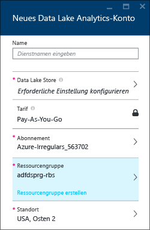
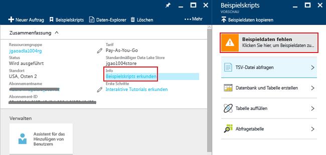
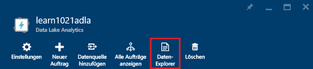
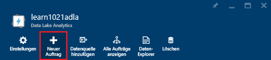
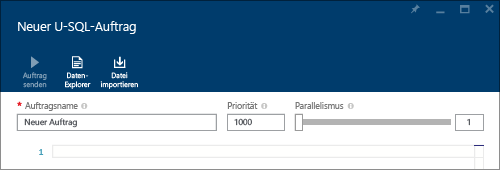
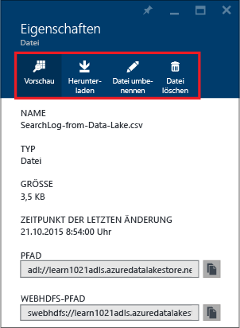

# Tutorial: Erste Schritte mit Azure Data Lake Analytics mithilfe des Azure-Portals
[!INCLUDE [get-started-selector](../../includes/data-lake-analytics-selector-get-started.md)]

Enthält Informationen zur Verwendung des Azure-Portals zum Erstellen von Azure Data Lake Analytics-Konten, zum Definieren von Data Lake Analytics-Aufträgen in [U-SQL](data-lake-analytics-u-sql-get-started.md) und zum Übermitteln von Aufträgen an den Data Lake Analytics-Dienst. Weitere Informationen zu Data Lake Analytics finden Sie unter [Übersicht über Azure Data Lake Analytics](data-lake-analytics-overview.md).

In diesem Tutorial entwickeln Sie einen Auftrag, bei dem eine Datei mit tabulatorgetrennten Werten (TSV) gelesen und in eine Datei mit kommagetrennten Werten (CSV) konvertiert wird. Um das gleiche Lernprogramm unter Verwendung anderer unterstützter Tools zu durchlaufen, klicken Sie auf die Registerkarten oben in diesem Abschnitt. Nachdem Ihr erster Auftrag erfolgreich durchgeführt wurde, können Sie damit beginnen, mit U-SQL komplexere Datentransformationen zu schreiben.

## Voraussetzungen
Bevor Sie mit diesem Tutorial beginnen können, benötigen Sie Folgendes:

* **Ein Azure-Abonnement**. Siehe [Kostenlose Azure-Testversion](https://azure.microsoft.com/pricing/free-trial/).

## Erstellen eines Data Lake Analytics-Kontos
Zum Ausführen von Aufträgen ist ein Data Lake Analytics-Konto erforderlich.

Jedes Data Lake Analytics-Konto ist von einem [Azure Data Lake-Speicher]() konto abhängig.  Dieses Konto wird als Data Lake-Standardspeicherkonto bezeichnet.  Sie können das Data Lake-Speicherkonto vorher oder während der Erstellung Ihres Data Lake Analytics-Kontos erstellen. In diesem Tutorial erstellen Sie das Data Lake-Speicherkonto mit dem Data Lake Analytics-Konto.

**So erstellen Sie ein Data Lake Analytics-Konto**

1. Melden Sie sich beim [Azure-Portal](https://portal.azure.com)an.
2. Klicken Sie auf **Neu**, auf **Intelligence + Analyse** und anschließend auf **Data Lake Analytics**.
3. Geben Sie folgende Werte ein bzw. wählen diese aus:

    

   * **Name**: Name des Data Lake Analytics-Kontos.
   * **Abonnement**: Wählen Sie das Azure-Abonnement aus, das für das Analytics-Konto verwendet wird.
   * **Ressourcengruppe**. Wählen Sie eine vorhandene Ressourcengruppe aus, oder erstellen Sie eine neue Ressourcengruppe. Azure Resource Manager ermöglicht es Ihnen, mit den Ressourcen in Ihrer Anwendung als Gruppe zu arbeiten. Weitere Informationen finden Sie unter [Übersicht über den Azure-Ressourcen-Manager](../azure-resource-manager/resource-group-overview.md).
   * **Standort**. Wählen Sie ein Azure-Rechenzentrum für das Data Lake Analytics-Konto aus.
   * **Data Lake-Speicher**: Jedes Data Lake Analytics-Konto verfügt über ein abhängiges Data Lake-Speicherkonto. Das Data Lake Analytics-Konto und das abhängige Data Lake-Speicherkonto müssen sich in demselben Azure-Rechenzentrum befinden. Führen Sie die Anweisungen zum Erstellen eines neuen Data Lake-Speicherkontos aus, oder wählen Sie ein vorhandenes Konto aus.
4. Klicken Sie auf **Erstellen**. Sie gelangen auf die Startseite des Portals. Dem Startmenü wird eine neue Kachel mit der Bezeichnung „Azure Data Lake Analytics wird bereitgestellt“ hinzugefügt. Es dauert einige Zeit, bis ein Data Lake Analytics-Konto erstellt wurde. Bei seiner Erstellung wird das Konto im Portal auf einem neuen Blatt geöffnet.

Nachdem ein Data Lake Analytics-Konto erstellt wurde, können Sie weitere Data Lake-Speicherkonten und Azure-Speicherkonten hinzufügen. Eine Anleitung finden Sie unter [Verwalten von Datenquellen für Data Lake Analytics-Konten](data-lake-analytics-manage-use-portal.md#manage-account-data-sources).

## Vorbereiten von Quelldaten
In diesem Tutorial verarbeiten Sie einige Suchprotokolle.  Das Suchprotokoll kann entweder in einem Data Lake-Speicher oder einem Azure-Blobspeicher gespeichert werden.

Das Azure-Portal enthält eine Benutzeroberfläche zum Kopieren einiger Beispieldatendateien in das Data Lake Store-Standardkonto. Hierzu gehört auch eine Suchprotokolldatei.

**So kopieren Sie Beispieldatendateien**

1. Öffnen Sie über das [Azure-Portal](https://portal.azure.com) Ihr Data Lake Analytics-Konto.  Informationen zur Erstellung eines Kontos finden Sie unter [Verwalten von Data Lake Analytics-Konten](data-lake-analytics-get-started-portal.md#create-data-lake-analytics-account). Öffnen Sie das Konto im Portal.
2. Erweitern Sie den Bereich **Zusammenfassung**, und klicken Sie dann auf **Beispielskripts erkunden**. Ein weiteres Blatt mit dem Namen **Beispielskripts** wird geöffnet.

    
3. Klicken Sie auf **Beispieldaten fehlen**, um die Dateien mit den Beispieldaten zu kopieren. Nach Abschluss des Vorgangs wird im Portal die Meldung **Beispieldateien wurden erfolgreich aktualisiert** angezeigt.
4. Klicken Sie auf dem Data Lake Analytics-Kontoblatt oben auf **Daten-Explorer** .

    

    Zwei Blätter werden geöffnet. Ein Blatt für den **Daten-Explorer**und ein anderes Blatt mit dem Data Lake-Standardspeicherkonto.
5. Klicken Sie auf dem Blatt mit dem Data Lake Store-Standardkonto auf **Beispiele**, um den Ordner zu erweitern, und klicken Sie dann auf **Daten**, um den Ordner zu erweitern. Die folgenden Dateien und Ordner werden angezeigt:

   * AmbulanceData/
   * AdsLog.tsv
   * SearchLog.tsv
   * version.txt
   * WebLog.log

     In diesem Tutorial verwenden Sie „SearchLog.tsv“.

In der Praxis programmieren Sie Ihre Anwendungen entweder so, dass Daten in ein verknüpftes Speicherkonto geschrieben werden, oder Sie laden die Daten hoch. Informationen zum Hochladen von Dateien finden Sie unter [So laden Sie Dateien in das Data Lake-Speicherkonto hoch](data-lake-analytics-manage-use-portal.md#upload-data-to-adls) oder [So laden Sie die Dateien in das Azure-Blobspeicherkonto hoch](data-lake-analytics-manage-use-portal.md#upload-data-to-wasb).

## Erstellen und Übermitteln von Data Lake Analytics-Aufträgen
Nachdem Sie die Quelldaten vorbereitet haben, können Sie mit dem Entwickeln eines U-SQL-Skripts beginnen.  

**So senden Sie einen Auftrag**

1. Klicken Sie im Portal auf dem Data Lake Analytics-Kontoblatt auf **Neuer Auftrag**.

    

    Wenn das Blatt nicht angezeigt wird, helfen Ihnen die Informationen unter [Öffnen eines Data Lake Analytics-Kontos im Portal](data-lake-analytics-manage-use-portal.md#access-adla-account)weiter.
2. Geben Sie den **Auftragsnamen**und das folgende U-SQL-Skript ein:

        @searchlog =
            EXTRACT UserId          int,
                    Start           DateTime,
                    Region          string,
                    Query           string,
                    Duration        int?,
                    Urls            string,
                    ClickedUrls     string
            FROM "/Samples/Data/SearchLog.tsv"
            USING Extractors.Tsv();

        OUTPUT @searchlog   
            TO "/Output/SearchLog-from-Data-Lake.csv"
        USING Outputters.Csv();

    

    Mit diesem U-SQL-Skript wird die Quelldatei mithilfe von **Extractors.Tsv()** gelesen, und anschließend wird eine CSV-Datei mithilfe von **Outputters.Csv()** erstellt.

    Ändern Sie die beiden Pfade nur, wenn Sie die Quelldatei an einen anderen Speicherort kopieren.  Data Lake Analytics erstellt den Ausgabeordner, falls er nicht vorhanden ist.  In diesem Fall verwenden wir einfache relative Pfade.  

    Es ist einfacher, für Dateien, die unter Data Lake-Standardkonten gespeichert sind, relative Pfade zu verwenden. Sie können aber auch absolute Pfade verwenden.  Beispiel:

        adl://<Data LakeStorageAccountName>.azuredatalakestore.net:443/Samples/Data/SearchLog.tsv

    Weitere Informationen zu U-SQL finden Sie unter [Erste Schritte mit Azure Data Lake Analytics-U-SQL-Sprache](data-lake-analytics-u-sql-get-started.md) und unter [U-SQL Language Reference](http://go.microsoft.com/fwlink/?LinkId=691348) (Referenz zur U-SQL-Sprache).

1. Klicken Sie oben auf **Auftrag senden** .   
2. Warten Sie, bis sich der Auftragsstatus in **Erfolgreich**ändert. Sie sehen, dass die Dauer für die Durchführung des Auftrags ungefähr eine Minute betrug.

    Falls für den Auftrag ein Fehler auftritt, helfen Ihnen die Informationen unter [Überwachung und Problembehandlung für Data Lake Analytics-Aufträge](data-lake-analytics-monitor-and-troubleshoot-jobs-tutorial.md) weiter.
3. Klicken Sie unten auf dem Blatt auf die Registerkarte **Ausgabe**, und klicken Sie dann auf **SearchLog-from-Data-Lake.csv**. Sie können für die Ausgabedatei eine Vorschau anzeigen und sie herunterladen, umbenennen und löschen.

    

## Siehe auch
* Eine komplexere Abfrage finden Sie unter [Analysieren von Websiteprotokollen mit Azure Data Lake Analytics](data-lake-analytics-analyze-weblogs.md).
* Informationen zu den ersten Schritten der Entwicklung von U-SQL-Anwendungen finden Sie unter [Entwickeln von U-SQL-Skripts mit Data Lake-Tools für Visual Studio](data-lake-analytics-data-lake-tools-get-started.md).
* Informationen zum Erlernen von U-SQL finden Sie unter [Erste Schritte mit der Sprache U-SQL für Azure Data Lake Analytics](data-lake-analytics-u-sql-get-started.md).
* Informationen zu Verwaltungsaufgaben finden Sie unter [Verwalten von Azure Data Lake Analytics mithilfe des Azure-Portals](data-lake-analytics-manage-use-portal.md).
* Eine Übersicht über Data Lake Analytics finden Sie unter [Azure Data Lake Analytics – Übersicht](data-lake-analytics-overview.md).
* Wenn Sie dasselbe Tutorial mit anderen Tools verwenden möchten, klicken Sie oben auf der Seite auf die Registerkartenauswahl.
* Informationen zum Protokollieren von Diagnoseinformationen finden Sie unter [Accessing diagnostic logs for Azure Data Lake Analytics](data-lake-analytics-diagnostic-logs.md)

<!--HONumber=Dec16_HO2-->

