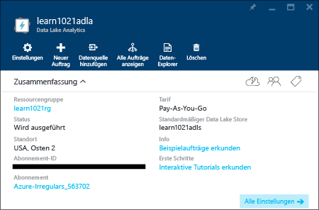
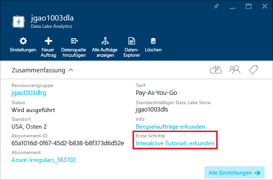

# Verwenden interaktiver Lernprogramme zu Azure Data Lake Analytics
Das Azure-Portal bietet ein interaktives Tutorial für die ersten Schritte mit Data Lake Analytics. In diesem Artikel erfahren Sie, wie Sie das Tutorial für die Analyse von Websiteprotokollen durchlaufen.

Weitere Lernprogramme finden Sie unter:

* [Erste Schritte mit Data Lake Analytics mithilfe des Azure-Portals](data-lake-analytics-get-started-portal.md)
* [Erste Schritte mit Data Lake Analytics mithilfe von Azure PowerShell](data-lake-analytics-get-started-powershell.md)
* [Erste Schritte mit Data Lake Analytics mithilfe des .NET SDK](data-lake-analytics-get-started-net-sdk.md)
* [Entwickeln von U-SQL-Skripts mit Data Lake-Tools für Visual Studio](data-lake-analytics-data-lake-tools-get-started.md) 

**Voraussetzungen**

Bevor Sie mit diesem Lernprogramm beginnen können, benötigen Sie Folgendes:

* **Data Lake Analytics-Konto**.  Weitere Informationen finden Sie unter [Erste Schritte mit Azure Data Lake Analytics mithilfe des Azure-Portals](data-lake-analytics-get-started-portal.md).

## Erstellen eines Data Lake Analytics-Kontos
Zum Ausführen von Aufträgen ist ein Data Lake Analytics-Konto erforderlich.

Jedes Data Lake Analytics-Konto ist mit einem [Azure Data Lake Store](../data-lake-store/data-lake-store-overview.md)-Konto (dem Data Lake Store-Standardkonto) verknüpft.  In diesem Tutorial erstellen Sie das Data Lake Store-Standardkonto mit dem Analytics-Konto. Dieser Schritt kann auch bereits im Vorfeld ausgeführt werden.

**So erstellen Sie ein Data Lake Analytics-Konto**

1. Melden Sie sich beim [Azure-Portal](https://portal.azure.com/signin/index/?Microsoft_Azure_Kona=true&Microsoft_Azure_DataLake=true&hubsExtension_ItemHideKey=AzureDataLake_BigStorage%2cAzureKona_BigCompute)an.
2. Klicken Sie links oben auf **Microsoft Azure** , um das Startmenü zu öffnen.
3. Klicken Sie auf die Kachel **Marketplace** .  
4. Geben Sie **Azure Data Lake Analytics** in das Suchfeld auf dem Blatt **Alles** ein, und drücken Sie die**** EINGABETASTE. **Azure Data Lake Analytics** wird in der Liste angezeigt.
5. Klicken Sie in der Liste auf **Azure Data Lake Analytics** .
6. Klicken Sie unten auf dem Blatt auf **Erstellen** .
7. Geben Sie Folgendes ein, oder treffen Sie die entsprechende Auswahl:
   
    
   
   * **Name**: Geben Sie dem Analytics-Konto einen Namen.
   * **Data Lake-Speicher**: Jedes Data Lake Analytics-Konto verfügt über ein abhängiges Data Lake-Speicherkonto. Das Data Lake Analytics-Konto und das abhängige Data Lake-Speicherkonto müssen sich in demselben Azure-Rechenzentrum befinden. Führen Sie die Anweisungen zum Erstellen eines Data Lake Store-Kontos aus, oder wählen Sie ein vorhandenes Konto aus.
   * **Abonnement**: Wählen Sie das Azure-Abonnement aus, das für das Analytics-Konto verwendet wird.
   * **Ressourcengruppe**. Wählen Sie eine vorhandene Ressourcengruppe aus, oder erstellen Sie eine neue Ressourcengruppe. Anwendungen setzen sich in der Regel aus zahlreichen Komponenten zusammen. Hierzu zählen beispielsweise Web-App, Datenbank, Datenbankserver, Speicher und Drittanbieterdienste. Mit dem Azure-Ressourcen-Manager (ARM) können Sie mit den Ressourcen in Ihrer Anwendung als Gruppe arbeiten, was als Azure-Ressourcengruppe bezeichnet wird. Sie können die Ressourcen für Ihre Anwendung in einem einzelnen, koordinierten Vorgang bereitstellen, aktualisieren, überwachen oder löschen. Sie verwenden eine Vorlage für die Bereitstellung, die für unterschiedliche Umgebungen (Testing, Staging, Produktion und Ähnliches) geeignet ist. Sie können die Abrechnung für Ihre Organisation vereinfachen, indem Sie die zusammengefassten Kosten für die gesamte Gruppe anzeigen. Weitere Informationen finden Sie unter [Übersicht über den Azure-Ressourcen-Manager](../azure-resource-manager/resource-group-overview.md). 
   * **Standort**. Wählen Sie ein Azure-Rechenzentrum für das Data Lake Analytics-Konto aus. 
8. Wählen Sie **An Startmenü anheften**aus. Dies ist für das folgende Tutorial erforderlich.
9. Klicken Sie auf **Erstellen**. Sie gelangen zum Startmenü des Portals. Dem Startmenü wird eine neue Kachel mit der Bezeichnung „Deploying Azure Data Lake Analytics“ hinzugefügt. Es dauert einige Zeit, bis ein Data Lake Analytics-Konto erstellt wurde. Bei seiner Erstellung wird das Konto im Portal auf einem neuen Blatt geöffnet.
   
    

## Ausführen des interaktiven Lernprogramms zum Analysieren von Websiteprotokollen
**So öffnen Sie das interaktive Lernprogramm zum Analysieren von Websiteprotokollen**

1. Klicken Sie im linken Menü des Portals auf **Microsoft Azure** , um das Startmenü zu öffnen.
2. Klicken Sie auf die Kachel, die mit Ihrem Data Lake Analytics-Konto verknüpft ist.
3. Klicken Sie auf **Interaktive Tutorials erkunden** in der Leiste **Zusammenfassung**.
   
    
4. Falls die orangefarbene Warnung „Samples not set up, click ...“ angezeigt wird, klicken Sie auf **Copy Sample Data** , um die Beispieldaten in das Data Lake-Standardspeicherkonto zu kopieren. Das interaktive Lernprogramm benötigt diese Daten zur Ausführung.
5. Klicken Sie auf dem Blatt **Interaktive Tutorials** auf **Website Log Analytics**. Im Portal wird das Lernprogramm auf einem neuen Portalblatt geöffnet.
6. Klicken Sie auf **Einführung**, und befolgen Sie dann die Anweisungen.

## Weitere Informationen
* [Übersicht über Microsoft Azure Data Lake Analytics](data-lake-analytics-overview.md)
* [Erste Schritte mit Data Lake Analytics mithilfe des Azure-Portals](data-lake-analytics-get-started-portal.md)
* [Erste Schritte mit Data Lake Analytics mithilfe von Azure PowerShell](data-lake-analytics-get-started-powershell.md)
* [Entwickeln von U-SQL-Skripts mit Data Lake-Tools für Visual Studio](data-lake-analytics-data-lake-tools-get-started.md)
* [Analysieren von Websiteprotokollen mit Azure Data Lake Analytics](data-lake-analytics-analyze-weblogs.md)

