# Zugriffssteuerung in Azure Data Lake Store
Das von Data Lake Store implementierte Zugriffssteuerungsmodell leitet sich von HDFS und damit wiederum vom POSIX-Zugriffssteuerungsmodell ab. In diesem Artikel werden die Grundlagen des Zugriffssteuerungsmodells für Data Lake Store zusammengefasst. Weitere Informationen zum HDFS-Zugriffssteuerungsmodell finden Sie im [Handbuch zu HDFS-Berechtigungen](https://hadoop.apache.org/docs/current/hadoop-project-dist/hadoop-hdfs/HdfsPermissionsGuide.html).

## Zugriffssteuerungslisten für Dateien und Ordner
Es gibt zwei Arten von Zugriffssteuerungslisten (Access Control Lists, ACLs): **Zugriffs-ACLs** und **Standard-ACLs**.

* **Zugriffs-ACLs** : Diese Listen steuern den Zugriff auf ein Objekt. Dateien und Ordner verfügen jeweils über Zugriffs-ACLs.
* **Standard-ACLs** : Hierbei handelt es sich um eine Art Vorlage für ACLs, die einem Ordner zugeordnet sind und die Zugriffs-ACLs für alle untergeordneten Elemente bestimmen, die in unter diesem Ordner erstellt werden. Dateien verfügen über keine Standard-ACLs.

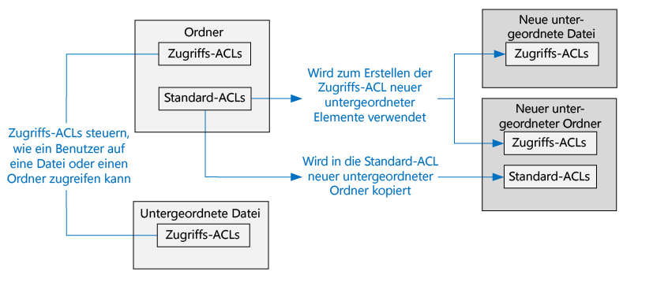

Zugriffs- und Standard-ACLs besitzen die gleiche Struktur.

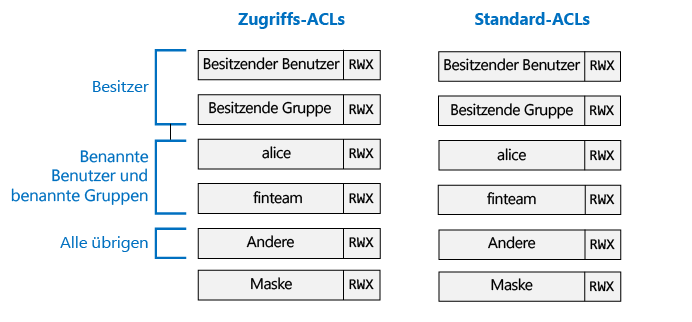

> [!NOTE]
> Änderungen an der Standard-ACL für ein übergeordnetes Element haben keine Auswirkungen auf die Zugriffs- oder Standard-ACL bereits vorhandener untergeordneter Elemente.
> 
> 

## Benutzer und Identitäten
Alle Dateien und Ordner verfügen über eigene Berechtigungen für folgende Identitäten:

* Der für die Datei zuständige Benutzer
* Die zuständige Gruppe
* Benannte Benutzer
* Benannte Gruppen
* Alle anderen Benutzer

Bei den Identitäten von Benutzern und Gruppen handelt es sich um AAD-Identitäten (Azure Active Directory). Im Kontext von Data Lake Store kann der Begriff „Benutzer“ also einen AAD-Benutzer oder eine AAD-Sicherheitsgruppe bezeichnen, sofern nicht anders angegeben.

## Berechtigungen
Die Berechtigungen für ein Dateisystemobjekt sind **Lesen**, **Schreiben** und **Ausführen**. Diese Berechtigungen können wie folgt auf Dateien und Ordner angewendet werden.

|  | File | Ordner |
| --- | --- | --- |
| **Lesen (Read, R)** |Berechtigt zum Lesen von Dateiinhalten |Erfordert **Lesen** und **Ausführen**, um den Inhalt des Ordners aufzulisten. |
| **Schreiben (Write, W)** |Berechtigt zum Schreiben in eine Datei sowie zum Anfügen an eine Datei |Erfordert **Schreiben und Ausführen**, um untergeordnete Elemente in einem Ordner zu erstellen. |
| **Ausführen (Execute, X)** |Hat im Kontext von Data Lake Store keine Bedeutung |Erfordert das Durchlaufen der untergeordneten Elemente eines Ordners |

### Kurzformen für Berechtigungen
**RWX** steht für **Lesen (Read), Schreiben (Write) und Ausführen (Execute)**. Es gibt auch ein noch kürzeres numerisches Format. Hierbei steht **4 für Lesen**, **2 für Schreiben** und **1 für Ausführen**, und Berechtigungen werden als Summe dieser Werte angegeben. Im Anschluss finden Sie einige Beispiele:

| Numerische Form | Kurzform | Bedeutung |
| --- | --- | --- |
| 7 |RWX |Lesen, Schreiben und Ausführen |
| 5 |R-X |Lesen und Ausführen |
| 4 |R-- |Lesen |
| 0 |--- |Keine Berechtigungen |

### Keine Vererbung bei Berechtigungen
Im von Data Lake Store verwendeten POSIX-basierten Modell werden Berechtigungen für ein Element direkt im Element gespeichert. Berechtigungen für ein Element können also nicht von den übergeordneten Elementen geerbt werden.

## Allgemeine Szenarien im Zusammenhang mit Berechtigungen
Im Anschluss finden Sie einige allgemeinen Szenarien, die veranschaulichen, welche Berechtigungen zum Ausführen bestimmter Vorgänge für ein Data Lake Store-Konto erforderlich sind.

### Erforderliche Berechtigungen zum Lesen einer Datei
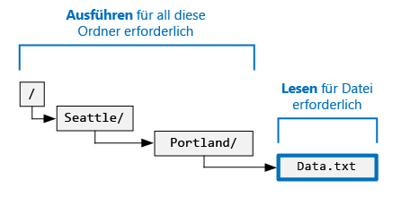

* Zum Lesen der Datei benötigt der Aufrufer **Leseberechtigungen** .
* Für alle Ordner in der Ordnerstruktur, in denen die Datei enthalten ist, benötigt der Aufrufer **Ausführungsberechtigungen** .

### Erforderliche Berechtigungen zum Anfügen an eine Datei
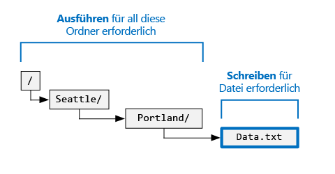

* Für die Datei, an die etwas angefügt werden soll, benötigt der Aufrufer **Schreibberechtigungen** .
* Für alle Ordner, in denen die Datei enthalten ist, benötigt der Aufrufer **Ausführungsberechtigungen** .

### Erforderliche Berechtigungen zum Löschen einer Datei
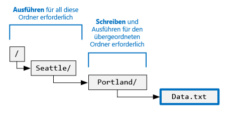

* Für den übergeordneten Ordner benötigt der Aufrufer **Schreib- und Ausführungsberechtigungen** .
* Für alle anderen Ordner am Pfad der Datei benötigt der Aufrufer **Ausführungsberechtigungen** .

> [!NOTE]
> Wenn die beiden obigen Bedingungen erfüllt sind, werden zum Löschen der Datei keine Schreibberechtigungen für die Datei benötigt.
> 
> 

### Erforderliche Berechtigungen zum Auflisten eines Ordners
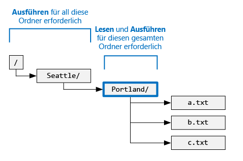

* Für den aufzulistenden Ordner benötigt der Aufrufer **Lese- und Ausführungsberechtigungen** .
* Für alle Vorgängerordner benötigt der Aufrufer **Ausführungsberechtigungen** .

## Anzeigen der Berechtigungen im Azure-Portal
Klicken Sie auf dem Blatt **Daten-Explorer** des Data Lake Store-Kontos auf **Zugriff**, um die ACLs für eine Datei oder einen Ordner anzuzeigen. Wenn Sie wie im folgenden Screenshot gezeigt auf „Zugriff“ klicken, werden die ACLs für den Ordner **catalog** unter dem Konto **mydatastore** angezeigt.

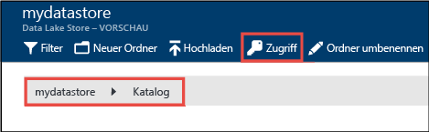

Im oberen Bereich dieses Blatts finden Sie eine Übersicht über Ihre Berechtigungen. (Im Screenshot heißt der Benutzer Bob.) Darunter sind die Zugriffsberechtigungen angegeben.

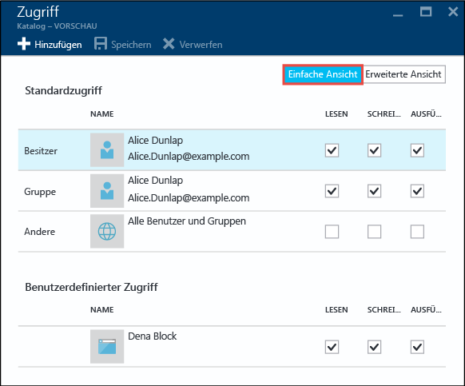

Klicken Sie auf **Erweitert**, um die erweiterte Ansicht mit Standard-ACLs, Maske und Superuser anzuzeigen.

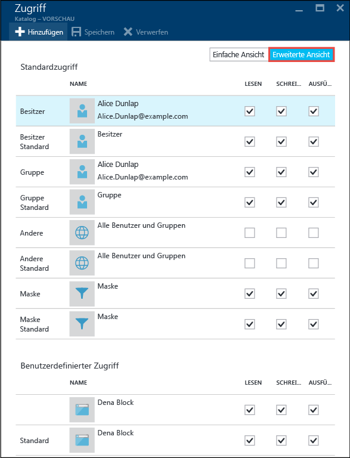

## Der Administrator
Ein Administrator verfügt im Vergleich zu den anderen Benutzern in Data Lake Store über die meisten Berechtigungen. Für den Administrator gilt Folgendes:

* Er hat RWX-Berechtigungen für **alle** Dateien und Ordner.
* Er kann die Berechtigungen für jede Datei und jeden Ordner ändern.
* Er kann den zuständigen Benutzer und die zuständige Gruppe einer beliebigen Datei und eines beliebigen Ordners ändern.

Ein Data Lake Store-Konto besitzt in Azure mehrere Azure-Rollen:

* Besitzer
* Mitwirkende
* Leser
* und weitere

Alle Benutzer, die der Rolle **Besitzer** für ein Data Lake Store-Konto angehören, sind automatisch auch Administratoren für dieses Konto. Weitere Informationen zur rollenbasierten Zugriffssteuerung von Azure finden Sie unter [Verwenden von Rollenzuweisungen zum Verwalten Ihrer Azure-Abonnementressourcen](../active-directory/role-based-access-control-configure.md).

Wenn Sie eine benutzerdefinierte RBAC-Rolle mit Superuser-Berechtigungen erstellen möchten, muss diese über folgende Berechtigungen verfügen:
* Microsoft.DataLakeStore/accounts/Superuser/action
* Microsoft.Authorization/roleAssignments/write

## Der zuständige Benutzer
Der Benutzer, der das Element erstellt hat, ist automatisch der zuständige Benutzer für das Element. Der zuständige Benutzer hat folgende Möglichkeiten:

* Er kann die Berechtigungen einer Datei ändern, für die er als Besitzer fungiert.
* Er kann die zuständige Gruppe einer Datei ändern, für die er als Besitzer fungiert, solange der zuständige Benutzer auch der Zielgruppe angehört.

> [!NOTE]
> Der zuständige Benutzer einer anderen Datei, die sich im Besitz eines Benutzers befindet, kann vom zuständigen Benutzer **nicht** geändert werden. Nur Administratoren können den zuständigen Benutzer einer Datei oder eines Ordners ändern.
> 
> 

## Die zuständige Gruppe
In den POSIX-Zugriffssteuerungslisten ist jeder Benutzer einer primären Gruppe zugeordnet. So kann beispielsweise die Benutzerin „Alice“ der Gruppe „finance“ angehören. Alice kann mehreren Gruppen angehören, eine Gruppe wird aber immer als ihre primäre Gruppe festgelegt. In POSIX gilt: Wenn Alice eine Datei erstellt, wird die zuständige Gruppe der Datei auf ihre primäre Gruppe festgelegt (in diesem Fall „finance“).

Bei Erstellung eines neuen Dateisystemelements weist Data Lake Store der zuständigen Gruppe einen Wert zu. 

* **1. Fall:** Der Stammordner „/“. Dieser Ordner wird erstellt, wenn ein Data Lake Store-Konto erstellt wird. In diesem Fall wird die zuständige Gruppe auf den Benutzer festgelegt, der das Konto erstellt hat.
* **2. Fall**: Jeder andere Fall. Beim Erstellen eines neuen Elements wird die zuständige Gruppe aus dem übergeordneten Ordner kopiert.

Die zuständige Gruppe kann von folgenden Benutzern geändert werden:

* Beliebiger Administrator
* Zuständiger Benutzer, sofern er auch der Zielgruppe angehört

## Algorithmus für die Zugriffsüberprüfung
Die folgende Abbildung zeigt den Zugriffsüberprüfungsalgorithmus für Data Lake Store-Konten:

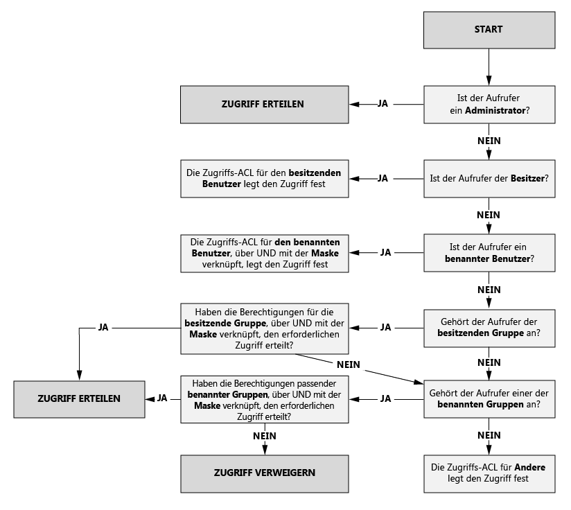

## Die Maske und „effektive Berechtigungen“
Die **Maske** ist ein RWX-Wert, der verwendet wird, um beim Ausführen des Zugriffsüberprüfungsalgorithmus den Zugriff für **benannte Benutzer**, die **zuständige Gruppe** und **benannte Gruppen** einzuschränken. Im Anschluss werden die grundlegenden Konzepte für die Maske erläutert. 

* Die Maske erstellt „effektive Berechtigungen“. Das bedeutet, sie passt die Berechtigungen zum Zeitpunkt der Zugriffsüberprüfung an.
* Die Maske kann direkt vom Dateibesitzer sowie von einem beliebigen Administrator bearbeitet werden.
* Die Maske kann Berechtigungen entfernen, um die effektive Berechtigung zu erstellen. Die Maske kann der effektiven Berechtigung aber **keine** Berechtigungen hinzufügen. 

Werfen wir einen Blick auf einige Beispiele. Im folgenden Beispiel ist die Maske auf **RWX** festgelegt. Durch die Maske werden also keine Berechtigungen entfernt. Beachten Sie, dass die effektiven Berechtigungen für den benannten Benutzer, die zuständige Gruppe und die benannte Gruppe bei dieser Zugriffsüberprüfung nicht verändert werden.

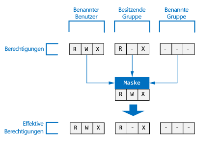

Im folgenden Beispiel ist die Maske auf **R-X**festgelegt. Das bedeutet, die Maske **deaktiviert die Schreibberechtigung** für **benannter Benutzer**, **zuständige Gruppe** und **benannte Gruppe** zum Zeitpunkt der Zugriffsüberprüfung.

Hier sehen Sie, wo die Maske für eine Datei oder einen Ordner im Azure-Portal angezeigt wird:

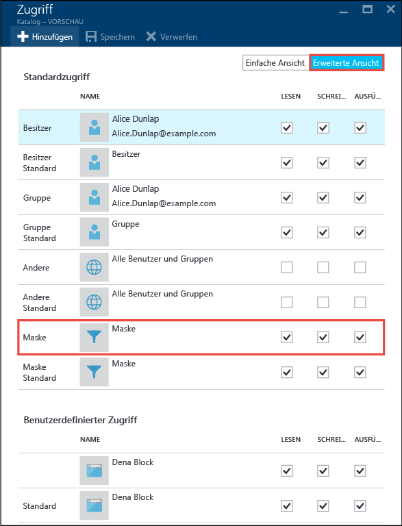

> [!NOTE]
> Bei einem neuen Data Lake Store-Konto wird die Maske für die Zugriffs- und die Standard-ACL des Stammordners („/“) standardmäßig auf „RWX“ festgelegt.
> 
> 

## Berechtigungen für neue Dateien und Ordner
Wenn unter einem bereits vorhandenen Ordner eine neue Datei oder ein erstellt wird, bestimmt die Standard-ACL des übergeordneten Ordners Folgendes:

* Eine Standard- und eine Access-ACL des untergeordneten Ordners
* Eine Zugriffs-ACL der untergeordneten Datei (Dateien besitzen keine Standard-ACL.)

### Eine Zugriffs-ACL der untergeordneten Datei oder des untergeordneten Ordners
Beim Erstellen einer untergeordneten Dateien oder eines untergeordneten Ordners wird die Standard-ACL des übergeordneten Elements als Zugriffs-ACL der untergeordneten Datei oder des untergeordneten Ordners kopiert. Falls ein **anderer** Benutzer in der Standard-ACL des übergeordneten Elements RWX-Berechtigungen besitzt, werden diese vollständig aus der Zugriffs-ACL des untergeordneten Elements entfernt.

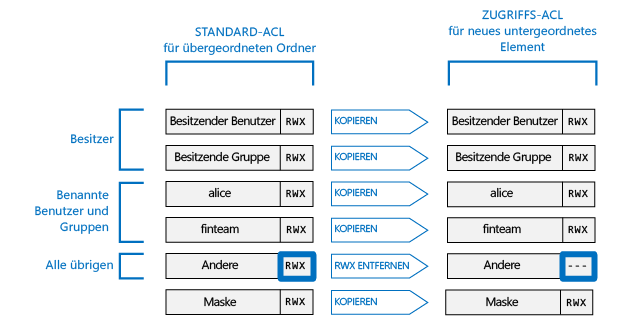

Die obigen Informationen zur Bestimmung der Zugriffs-ACL eines untergeordneten Elements dürften in den meisten Szenarien ausreichen. Wenn Sie dagegen mit POSIX-Systemen vertraut sind und sich im Detail über diese Transformation informieren möchten, lesen Sie den Abschnitt [Rolle von „umask“ beim Erstellen der Zugriffs-ACL für neue Dateien und Ordner](#umasks-role-in-creating-the-access-acl-for-new-files-and-folders) weiter unten in diesem Artikel.

### Eine Standard-ACL des untergeordneten Ordners
Wenn unter einem übergeordneten Ordner ein untergeordneter Ordner erstellt wird, wird die Standard-ACL des übergeordneten Ordners unverändert als Standard-ACL des untergeordneten Ordners übernommen.

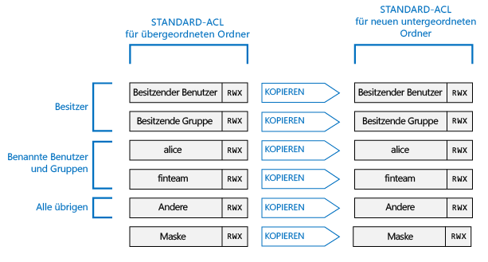

## Weiterführende Themen zu ACLs in Data Lake Store
Im Anschluss finden Sie einige weiterführende Themen, in denen ausführlicher auf die Bestimmung von ACLs für Data Lake Store-Dateien oder -Ordner eingegangen wird.

### Rolle von „umask“ beim Erstellen der Zugriffs-ACL für neue Dateien und Ordner
Gemäß dem allgemeinen Konzept eines POSIX-kompatiblen Systems handelt es sich bei „umask“ um einen 9-Bit-Wert für den übergeordneten Ordner, der dazu dient, die Berechtigung für **zuständiger Benutzer**, **zuständige Gruppe** und **andere Benutzer** für die Zugriffs-ACL einer neuen untergeordneten Datei oder eines neuen untergeordneten Ordners zu transformieren. Die Bits von „umask“ geben an, welche Bits in der Zugriffs-ACL des untergeordneten Elements deaktiviert werden sollen. Somit dient „unmask“ also zur selektiven Unterbindung der die Weitergabe von Berechtigungen für den zuständigen Benutzer, die zuständige Gruppe und andere Benutzer.

In einem HDFS-System handelt es sich bei „umask“ in der Regel um eine standortweite, von Administratoren gesteuerte Konfigurationsoption. Data Lake Store verwendet ein unveränderliches **umask-Element für das gesamte Konto** . Die folgende Tabelle veranschaulicht das umask-Element von Data Lake Store:

| Benutzergruppe | Einstellung | Auswirkung auf die Zugriffs-ACL eines neuen untergeordneten Elements |
| --- | --- | --- |
| zuständige Benutzer |--- |Keine Auswirkungen |
| zuständige Gruppe |--- |Keine Auswirkungen |
| anderer |RWX |Entfernen von Lesen, Schreiben und Ausführen |

Die folgende Abbildung zeigt dieses unmask-Element in Aktion. Letztendlich entfernt es **Lesen/Schreiben/Ausführen** für **andere** Benutzer. Da das umask-Element keine Bits für **zuständiger Benutzer** und **zuständige Gruppe** angibt, werden diese Berechtigungen nicht transformiert.

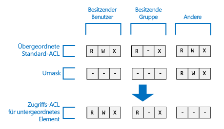 

### Das Sticky Bit
Das Sticky Bit ist ein erweitertes Feature eines POSIX-Dateisystems. Im Kontext von Data Lake Store wird das Sticky Bit höchstwahrscheinlich nicht benötigt.

Die folgende Tabelle veranschaulicht die Funktionsweise des Sticky Bits in Data Lake Store:

| Benutzergruppe | Datei | Ordner |
| --- | --- | --- |
| Sticky Bit **AUS** |Keine Auswirkungen |Keine Auswirkungen |
| Sticky Bit **EIN** |Keine Auswirkungen |Sorgt dafür, dass nur **Administratoren** und der **zuständige Benutzer** eines untergeordneten Elements dieses Element löschen oder umbenennen können. |

Das Sticky Bit wird im Azure-Portal nicht angezeigt.

## Allgemeine Fragen zu ACLs in Data Lake Store
Im Anschluss finden Sie einige Fragen, die häufig zu ACLs in Data Lake Store gestellt werden.

### Muss ich die Unterstützung für ACLs aktivieren?
Nein. Die ACL-basierte Zugriffssteuerung ist für ein Data Lake Store-Konto immer aktiviert.

### Welche Berechtigungen werden zum rekursiven Löschen eines Ordners und seines Inhalts benötigt?
* Der übergeordnete Ordner muss über **Schreib- und Ausführungsberechtigungen**verfügen.
* Der zu löschende Ordner und alle darin enthaltenen Ordner müssen über **Lese-, Schreib- und Ausführungsberechtigungen**verfügen.

> [!NOTE] 
> Zum Löschen der in Ordnern enthaltenen Dateien werden keine Schreibberechtigungen für diese Dateien benötigt. Außerdem gilt: Der Stammordner „/“ kann **nie** gelöscht werden.
>
>

### Wer wird als Besitzer einer Datei oder eines Ordners festgelegt?
Der Ersteller einer Datei oder eines Ordners wird als Besitzer festgelegt.

### Wer wird bei der Erstellung als zuständige Gruppe einer Datei oder eines Ordners festgelegt?
Hierzu wird die zuständige Gruppe des übergeordneten Ordners kopiert, unter dem die neue Datei oder der neue Ordner erstellt wird.

### Ich bin der zuständige Benutzer einer Datei, verfüge aber nicht über die erforderlichen RWX-Berechtigungen. Wie gehe ich vor?
Der zuständige Benutzer kann einfach die Berechtigungen der Datei ändern und sich so die erforderlichen RWX-Berechtigungen gewähren.

### Wenn ich mir die ACLs im Azure-Portal ansehe, sehe ich dort Benutzernamen, über APIs werden mir jedoch GUIDs angezeigt. Warum ist das so?
Einträge in den ACLs werden als GUIDs gespeichert, die Benutzern in Azure Active Directory (AAD) entsprechen. Die APIs geben die GUIDs unverändert zurück. Das Azure-Portal wandelt die GUIDs zur Vereinfachung der ACL-Verwendung nach Möglichkeit in benutzerfreundliche Namen um. 

### Warum werden im Portal manchmal GUIDs in den ACLs angezeigt?
Eine GUID wird angezeigt, wenn der Benutzer in AAD nicht mehr vorhanden ist. Dies ist meist der Fall, wenn der Benutzer aus dem Unternehmen ausgeschieden ist oder sein Konto in AAD gelöscht wurde.

### Unterstützt Data Lake Store die Vererbung von ACLs?
Nein.

### Was ist der Unterschied zwischen „mask“ und „umask“?
| mask | umask |
| --- | --- |
| Die **mask** -Eigenschaft steht für jede Datei und jeden Ordner zur Verfügung. |**umask** ist eine Eigenschaft des Data Lake Store-Kontos. Data Lake Store enthält also nur ein einzelnes umask-Element. |
| Die mask-Eigenschaft für eine Datei oder einen Ordner kann vom zuständigen Benutzer oder von der zuständigen Gruppe einer Datei oder aber vom Administrator geändert werden. |Die umask-Eigenschaft kann von keinem Benutzer geändert werden – auch nicht von einem Administrator. Hierbei handelt es sich um einen unveränderlichen, konstanten Wert. |
| Mithilfe der mask-Eigenschaft wird im Rahmen des Zugriffsüberprüfungsalgorithmus zur Laufzeit bestimmt, ob ein Benutzer zum Ausführen eines Vorgangs für eine Datei oder einen Ordner berechtigt ist. Die Rolle der Maske besteht in der Erstellung „effektiver Berechtigungen“ zum Zeitpunkt der Zugriffsüberprüfung. |„umask“ wird bei der Zugriffsüberprüfung überhaupt nicht verwendet. Mithilfe von „umask“ wird die Zugriffs-ACL neuer untergeordneter Elemente eines Ordners bestimmt. |
| Die Maske ist ein 3-Bit-RWX-Wert, der zum Zeitpunkt der Zugriffsüberprüfung auf den benannten Benutzer, die benannte Gruppe und den zuständigen Benutzer angewendet wird. |Bei „umask“ handelt es sich um einen 9-Bit-Wert für den zuständigen Benutzer, die zuständige Gruppe und andere Benutzer eines neuen untergeordneten Elements. |

### Wo finde ich weitere Informationen zum POSIX-Zugriffssteuerungsmodell?
* [http://www.vanemery.com/Linux/ACL/POSIX_ACL_on_Linux.html](http://www.vanemery.com/Linux/ACL/POSIX_ACL_on_Linux.html)
* [HDFS Permission Guide (Handbuch zu HDFS-Berechtigungen)](http://hadoop.apache.org/docs/current/hadoop-project-dist/hadoop-hdfs/HdfsPermissionsGuide.html) 
* [POSIX FAQ (Häufig gestellte Fragen zu POSIX)](http://www.opengroup.org/austin/papers/posix_faq.html)
* [POSIX 1003.1 2008](http://standards.ieee.org/findstds/standard/1003.1-2008.html)
* [POSIX 1003.1e 1997](http://users.suse.com/~agruen/acl/posix/Posix_1003.1e-990310.pdf)
* [POSIX ACL on Linux (POSIX-ACL unter Linux)](http://users.suse.com/~agruen/acl/linux-acls/online/)
* [ACL using Access Control Lists on Linux (ACL mit Zugriffssteuerungslisten unter Linux)](http://bencane.com/2012/05/27/acl-using-access-control-lists-on-linux/)

## Siehe auch
* [Übersicht über Azure Data Lake-Speicher](data-lake-store-overview.md)
* [Erste Schritte mit Azure Data Lake Analytics](../data-lake-analytics/data-lake-analytics-get-started-portal.md)

<!--HONumber=Dec16_HO2-->

