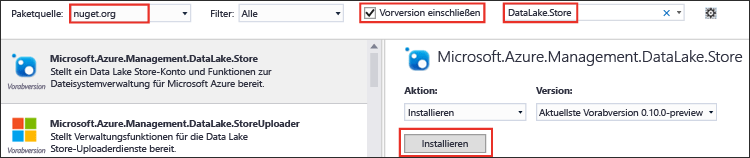

<properties
   pageTitle="Verwenden des Data Lake Store .NET SDK zur Anwendungsentwicklung | Microsoft Azure"
   description="Verwenden des .NET SDK für Azure Data Lake-Speicher zur Anwendungsentwicklung | Azure"
   services="data-lake-store"
   documentationCenter=""
   authors="nitinme"
   manager="jhubbard"
   editor="cgronlun"/>

<tags
   ms.service="data-lake-store"
   ms.devlang="na"
   ms.topic="get-started-article"
   ms.tgt_pltfrm="na"
   ms.workload="big-data"
   ms.date="09/26/2016"
   ms.author="nitinme"/>

# Erste Schritte mit Azure Data Lake-Speicher mithilfe des .NET SDK

> [AZURE.SELECTOR]
- [Portal](data-lake-store-get-started-portal.md)
- [PowerShell](data-lake-store-get-started-powershell.md)
- [.NET SDK](data-lake-store-get-started-net-sdk.md)
- [Java SDK](data-lake-store-get-started-java-sdk.md)
- [REST-API](data-lake-store-get-started-rest-api.md)
- [Azure-Befehlszeilenschnittstelle](data-lake-store-get-started-cli.md)
- [Node.js](data-lake-store-manage-use-nodejs.md)

Erfahren Sie, wie Sie das [Azure Data Lake Store .NET SDK](https://msdn.microsoft.com/library/mt581387.aspx) zum Durchführen von einfachen Vorgängen nutzen, z.B. Ordner erstellen, Datendateien hochladen und herunterladen usw. Weitere Informationen über Data Lake finden Sie unter [Übersicht über Azure Data Lake-Speicher](data-lake-store-overview.md).

## Voraussetzungen

* **Visual Studio 2013 oder 2015**. Die folgenden Anweisungen verwenden Visual Studio 2015.

* **Ein Azure-Abonnement**. Siehe [Kostenlose Azure-Testversion](https://azure.microsoft.com/pricing/free-trial/).

* **Azure Data Lake-Speicherkonto**. Eine Anleitung zur Erstellung eines Kontos finden Sie unter [Erste Schritte mit Azure Data Lake-Speicher mithilfe des Azure-Portals](data-lake-store-get-started-portal.md).

* **Erstellen einer Azure Active Directory-Anwendung**. Die Azure AD-Anwendung wird verwendet, um die Data Lake Store-Anwendung bei Azure AD zu authentifizieren. Für die Authentifizierung bei Azure AD stehen zwei unterschiedliche Konzepte zur Verfügung: **Endbenutzerauthentifizierung** und **Dienst-zu-Dienst-Authentifizierung**. Anweisungen und weitere Informationen zur Authentifizierung finden Sie unter [Authenticate with Data Lake Store using Azure Active Directory](data-lake-store-authenticate-using-active-directory.md) (Authentifizieren bei Data Lake Store mithilfe von Azure Active Directory).

## Erstellen einer .NET-Anwendung

1. Öffnen Sie Visual Studio, und erstellen Sie eine Konsolenanwendung.

2. Klicken Sie im Menü **Datei** auf **Neu** und dann auf **Projekt**.

3. Unter **Neues Projekt** können Sie die folgenden Werte eingeben bzw. auswählen:

	| Eigenschaft | Wert |
	|----------|-----------------------------|
	| Kategorie | Vorlagen/Visual C#/Windows |
	| Vorlage | Konsolenanwendung |
	| Name | CreateADLApplication |

4. Klicken Sie auf **OK**, um das Projekt zu erstellen.

5. Fügen Sie Ihrem Projekt die Nuget-Pakete hinzu.

	1. Klicken Sie im Projektmappen-Explorer mit der rechten Maustaste auf den Projektnamen und dann auf **NuGet-Pakete verwalten**.
	2. Stellen Sie auf der Registerkarte **NuGet-Paket-Manager** sicher, dass **Paketquelle** auf **nuget.org** festgelegt und das Kontrollkästchen **Vorabversion einbeziehen** aktiviert ist.
	3. Suchen und installieren Sie die folgenden NuGet-Pakete:

		* `Microsoft.Azure.Management.DataLake.Store`: In diesem Tutorial wird „v0.12.5-preview“ verwendet.
		* `Microsoft.Azure.Management.DataLake.StoreUploader`: In diesem Tutorial wird „v0.10.6-preview“ verwendet.
		* `Microsoft.Rest.ClientRuntime.Azure.Authentication`: In diesem Tutorial wird „v2.2.8-preview“ verwendet.

		

	4. Schließen Sie den **NuGet-Paket-Manager**.

6. Öffnen Sie **Program.cs**, löschen Sie den vorhandenen Code, und fügen Sie dann die folgenden Anweisungen ein, um Verweise auf Namespaces hinzuzufügen.

        using System;
        using System.Threading;
        
        using Microsoft.Rest.Azure.Authentication;
        using Microsoft.Azure.Management.DataLake.Store;
        using Microsoft.Azure.Management.DataLake.StoreUploader;

7. Deklarieren Sie die Variablen wie unten gezeigt, und geben Sie die Werte für den Data Lake Store-Namen und den Ressourcengruppennamen an, die bereits vorhanden sind. Stellen Sie außerdem sicher, dass der hier angegebene lokale Pfad und der Dateiname auf dem Computer vorhanden sind. Fügen Sie nach den Namespacedeklarationen den folgenden Codeausschnitt hinzu.

        namespace SdkSample
        {
            class Program
            {
                private static DataLakeStoreAccountManagementClient _adlsClient;
                private static DataLakeStoreFileSystemManagementClient _adlsFileSystemClient;
                
                private static string _adlsAccountName;
                private static string _resourceGroupName;
                private static string _location;
				private static string _subId;

                
                private static void Main(string[] args)
                {
                    _adlsAccountName = "<DATA-LAKE-STORE-NAME>"; // TODO: Replace this value with the name of your existing Data Lake Store account.
                    _resourceGroupName = "<RESOURCE-GROUP-NAME>"; // TODO: Replace this value with the name of the resource group containing your Data Lake Store account.
                    _location = "East US 2";
					_subId = "<SUBSCRIPTION-ID>";
                    
                    string localFolderPath = @"C:\local_path"; // TODO: Make sure this exists and can be overwritten.
                    string localFilePath = localFolderPath + "file.txt"; // TODO: Make sure this exists and can be overwritten.
                    string remoteFolderPath = "/data_lake_path/";
                    string remoteFilePath = remoteFolderPath + "file.txt";
                }
            }
        }

In den restlichen Abschnitten dieses Artikels erfahren Sie, wie Sie die verfügbaren .NET-Methoden verwenden, um Vorgänge wie Authentifizierung, Dateiupload usw. durchzuführen.

## Authentifizierung

### Informationen zur Endbenutzerauthentifizierung

Verwenden Sie diese Option mit einer vorhandenen nativen Azure AD-Clientanwendung. Eine solche Anwendung ist im Anschluss bereitgestellt.

    // User login via interactive popup
    // Use the client ID of an existing AAD "Native Client" application.
    SynchronizationContext.SetSynchronizationContext(new SynchronizationContext());
    var domain = "common"; // Replace this string with the user's Azure Active Directory tenant ID or domain name, if needed.
    var nativeClientApp_clientId = "1950a258-227b-4e31-a9cf-717495945fc2";
    var activeDirectoryClientSettings = ActiveDirectoryClientSettings.UsePromptOnly(nativeClientApp_clientId, new Uri("urn:ietf:wg:oauth:2.0:oob"));
    var creds = UserTokenProvider.LoginWithPromptAsync(domain, activeDirectoryClientSettings).Result;

Im obigen Codeausschnitt verwenden wir eine Azure AD-Domäne und eine Client-ID, die standardmäßig für alle Azure-Abonnements verfügbar ist. Wenn Sie Ihre eigene Azure AD-Domäne und Anwendungsclient-ID verwenden möchten, müssen Sie eine native Azure AD-Anwendung erstellen. Eine entsprechende Anleitung finden Sie unter [Erstellen einer Active Directory-Anwendung](../resource-group-create-service-principal-portal.md#create-an-active-directory-application).

>[AZURE.NOTE] Die Anleitung unter dem obigen Link bezieht sich auf eine Azure AD-Webanwendung. Zur Erstellung einer nativen Clientanwendung müssen jedoch genau die gleichen Schritte ausgeführt werden.

### Informationen zur Dienst-zu-Dienst-Authentifizierung mit geheimem Clientschlüssel 

Mit dem folgenden Codeausschnitt können Sie unter Verwendung des geheimen Clientschlüssels/Anwendungsschlüssels/Dienstprinzipals eine nicht interaktive Authentifizierung Ihrer Anwendung durchführen. Verwenden Sie diese Option mit einer vorhandenen [Azure AD-Anwendung vom Typ „Web-App“](../resource-group-create-service-principal-portal.md).

    // Service principal / appplication authentication with client secret / key
    // Use the client ID and certificate of an existing AAD "Web App" application.
    SynchronizationContext.SetSynchronizationContext(new SynchronizationContext());
    var domain = "<AAD-directory-domain>";
    var webApp_clientId = "<AAD-application-clientid>";
    var clientSecret = "<AAD-application-client-secret>";
    var clientCredential = new ClientCredential(webApp_clientId, clientSecret);
    var creds = ApplicationTokenProvider.LoginSilentAsync(domain, clientCredential).Result;

### Informationen zur Dienst-zu-Dienst-Authentifizierung mit Zertifikat

Als dritte Möglichkeit können Sie den folgenden Codeausschnitt verwenden, um Ihre Anwendung auf nicht interaktive Weise zu authentifizieren, indem Sie das Zertifikat für eine Anwendung bzw. einen Dienstprinzipal nutzen. Verwenden Sie diese Option mit einer vorhandenen [Azure AD-Anwendung vom Typ „Web-App“](../resource-group-create-service-principal-portal.md).

    // Service principal / application authentication with certificate
    // Use the client ID and certificate of an existing AAD "Web App" application.
    SynchronizationContext.SetSynchronizationContext(new SynchronizationContext());
    var domain = "<AAD-directory-domain>";
    var webApp_clientId = "<AAD-application-clientid>";
    System.Security.Cryptography.X509Certificates.X509Certificate2 clientCert = <AAD-application-client-certificate>
    var clientAssertionCertificate = new ClientAssertionCertificate(webApp_clientId, clientCert);
    var creds = ApplicationTokenProvider.LoginSilentWithCertificateAsync(domain, clientAssertionCertificate).Result;

## Erstellen von Clientobjekten

Mit dem folgenden Codeausschnitt werden das Data Lake Store-Konto und die Dateisystem-Clientobjekte erstellt, die zum Ausführen von Anforderungen für den Dienst genutzt werden.

    // Create client objects and set the subscription ID
    _adlsClient = new DataLakeStoreAccountManagementClient(creds);
    _adlsFileSystemClient = new DataLakeStoreFileSystemManagementClient(creds);

	_adlsClient.SubscriptionId = _subId;

## Auflisten aller Data Lake Store-Konten in einem Abonnement

Mit dem folgenden Codeausschnitt werden alle Data Lake Store-Konten innerhalb eines bestimmten Azure-Abonnements aufgelistet:

    // List all ADLS accounts within the subscription
    public static List<DataLakeStoreAccount> ListAdlStoreAccounts()
    {
        var response = _adlsClient.Account.List();
        var accounts = new List<DataLakeStoreAccount>(response);
        
        while (response.NextPageLink != null)
        {
            response = _adlsClient.Account.ListNext(response.NextPageLink);
            accounts.AddRange(response);
        }
        
        return accounts;
    }

## Erstellen eines Verzeichnisses

Im folgenden Codeausschnitt wird eine `CreateDirectory`-Methode veranschaulicht, die Sie zum Erstellen eines Verzeichnisses in einem Data Lake Store-Konto verwenden können.

    // Create a directory
    public static void CreateDirectory(string path)
    {
        _adlsFileSystemClient.FileSystem.Mkdirs(_adlsAccountName, path);
    }

## Hochladen einer Datei

Im folgenden Codeausschnitt wird eine `UploadFile`-Methode veranschaulicht, die Sie zum Hochladen von Dateien in ein Data Lake Store-Konto verwenden können.

    // Upload a file
    public static void UploadFile(string srcFilePath, string destFilePath, bool force = true)
    {
        var parameters = new UploadParameters(srcFilePath, destFilePath, _adlsAccountName, isOverwrite: force);
        var frontend = new DataLakeStoreFrontEndAdapter(_adlsAccountName, _adlsFileSystemClient);
        var uploader = new DataLakeStoreUploader(parameters, frontend);
        uploader.Execute();
    }

`DataLakeStoreUploader` unterstützt rekursive Upload- und Downloadvorgänge zwischen einem lokalen Dateipfad und einem Data Lake Store-Dateipfad.

## Abrufen von Datei- oder Verzeichnisinformationen

Im folgenden Codeausschnitt wird eine `GetItemInfo`-Methode veranschaulicht, die Sie zum Abrufen von Informationen zu einer Datei oder einem Verzeichnis in Data Lake Store verwenden können.

    // Get file or directory info
    public static FileStatusProperties GetItemInfo(string path)
    {
        return _adlsFileSystemClient.FileSystem.GetFileStatus(_adlsAccountName, path).FileStatus;
    }

## Auflisten von Dateien oder Verzeichnissen

Im folgenden Codeausschnitt wird eine `ListItem`-Methode veranschaulicht, die Sie zum Auflisten der Dateien und Verzeichnisse in einem Data Lake Store-Konto verwenden können.

    // List files and directories
    public static List<FileStatusProperties> ListItems(string directoryPath)
    {
        return _adlsFileSystemClient.FileSystem.ListFileStatus(_adlsAccountName, directoryPath).FileStatuses.FileStatus.ToList();
    }

## Verketten von Dateien

Im folgenden Codeausschnitt wird eine `ConcatenateFiles`-Methode veranschaulicht, die Sie zum Verketten von Dateien verwenden können.

    // Concatenate files
    public static void ConcatenateFiles(string[] srcFilePaths, string destFilePath)
    {
        _adlsFileSystemClient.FileSystem.Concat(_adlsAccountName, destFilePath, srcFilePaths);
    }

## Anfügen an eine Datei

Im folgenden Codeausschnitt wird eine `AppendToFile`-Methode veranschaulicht, die Sie zum Anfügen von Daten an eine bereits im Data Lake Store-Konto gespeicherte Datei verwenden können.

    // Append to file
    public static void AppendToFile(string path, string content)
    {
        var stream = new MemoryStream(Encoding.UTF8.GetBytes(content));
        
        _adlsFileSystemClient.FileSystem.Append(_adlsAccountName, path, stream);
    }

## Herunterladen einer Datei

Im folgenden Codeausschnitt wird eine `DownloadFile`-Methode veranschaulicht, die Sie zum Herunterladen einer Datei aus einem Data Lake Store-Konto verwenden können.

    // Download file
    public static void DownloadFile(string srcPath, string destPath)
    {
        var stream = _adlsFileSystemClient.FileSystem.Open(_adlsAccountName, srcPath);
        var fileStream = new FileStream(destPath, FileMode.Create);
        
        stream.CopyTo(fileStream);
        fileStream.Close();
        stream.Close();
    }

## Nächste Schritte

- [Sichern von Daten in Data Lake-Speicher](data-lake-store-secure-data.md)
- [Verwenden von Azure Data Lake Analytics mit Data Lake-Speicher](../data-lake-analytics/data-lake-analytics-get-started-portal.md)
- [Verwenden von Azure HDInsight mit Data Lake-Speicher](data-lake-store-hdinsight-hadoop-use-portal.md)
- [Data Lake Store .NET SDK Reference (Referenz zum Data Lake Store .NET SDK)](https://msdn.microsoft.com/library/mt581387.aspx)
- [Data Lake Store REST Reference (Data Lake Store-REST-Referenz)](https://msdn.microsoft.com/library/mt693424.aspx)

<!---HONumber=AcomDC_0928_2016-->