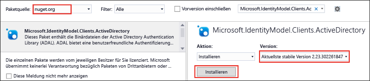

<properties
   pageTitle="Verwenden des .NET SDK für Data Lake-Speicher zur Anwendungsentwicklung | Azure"
   description="Verwenden des .NET SDK für Azure Data Lake-Speicher zur Anwendungsentwicklung | Azure"
   services="data-lake-store"
   documentationCenter=""
   authors="nitinme"
   manager="paulettm"
   editor="cgronlun"/>

<tags
   ms.service="data-lake-store"
   ms.devlang="na"
   ms.topic="get-started-article"
   ms.tgt_pltfrm="na"
   ms.workload="big-data"
   ms.date="07/18/2016"
   ms.author="nitinme"/>

# Erste Schritte mit Azure Data Lake-Speicher mithilfe des .NET SDK

> [AZURE.SELECTOR]
- [Portal](data-lake-store-get-started-portal.md)
- [PowerShell](data-lake-store-get-started-powershell.md)
- [.NET SDK](data-lake-store-get-started-net-sdk.md)
- [Java SDK](data-lake-store-get-started-java-sdk.md)
- [REST-API](data-lake-store-get-started-rest-api.md)
- [Azure-Befehlszeilenschnittstelle](data-lake-store-get-started-cli.md)
- [Node.js](data-lake-store-manage-use-nodejs.md)

Erfahren Sie, wie Sie mithilfe des [.NET SDK für Azure Data Lake Store](https://msdn.microsoft.com/library/mt581387.aspx) ein Azure Data Lake-Konto erstellen und grundlegende Vorgänge ausführen, z.B. Ordner erstellen, Datendateien hoch- und herunterladen, Ihr Konto löschen usw. Weitere Informationen über Data Lake finden Sie unter [Übersicht über Azure Data Lake-Speicher](data-lake-store-overview.md).

## Voraussetzungen

* Visual Studio 2013 oder 2015 Die folgenden Anweisungen verwenden Visual Studio 2015.
* **Ein Azure-Abonnement**. Siehe [Kostenlose Azure-Testversion](https://azure.microsoft.com/pricing/free-trial/).
* **Aktiviertes Azure-Abonnement** für die öffentliche Vorschauversion von Data Lake Store. Weitere Informationen finden Sie in den [Anweisungen](data-lake-store-get-started-portal.md#signup).
* **Erstellen einer Azure Active Directory-Anwendung**. Zur Authentifizierung mithilfe von Azure Active Directory stehen Ihnen zwei Möglichkeiten zur Verfügung: **interaktiv** und **nicht interaktiv**. Je nach der gewählten Authentifizierung gelten unterschiedliche Voraussetzungen.
	* **Interaktive Authentifizierung** (die in diesem Artikel verwendet wird) – Sie müssen in Azure Active Directory eine **native Clientanwendung** erstellen. Nach dem Erstellen der Anwendung rufen Sie die folgenden Werte ab, die mit der Anwendung in Zusammenhang stehen.
		- Abrufen von **Client-ID** und **Umleitungs-URI** für die Anwendung
		- Festlegen der delegierten Berechtigungen

	* **Nicht interaktive Authentifizierung** – Sie müssen in Azure Active Directory eine **Webanwendung** erstellen. Nach dem Erstellen der Anwendung rufen Sie die folgenden Werte ab, die mit der Anwendung in Zusammenhang stehen.
		- Abrufen von **Client-ID**,**geheimem Clientschlüssel** und **Umleitungs-URI** für die Anwendung
		- Festlegen der delegierten Berechtigungen
		- Weisen Sie die Azure Active Directory-Anwendung einer Rolle zu. Die Rolle kann sich auf der Ebene des Bereichs befinden, auf der Sie die Berechtigung für die Azure Active Directory-Anwendung gewähren möchten. Beispielsweise können Sie die Anwendung auf Abonnementebene oder auf der Ebene einer Ressourcengruppe zuweisen.

	Anweisungen dazu, wie Sie diese Werte abrufen, Berechtigungen festlegen und Rollen zuweisen, finden Sie unter [Erstellen einer Active Directory-Anwendung und eines Dienstprinzipals mithilfe des Portals](../resource-group-create-service-principal-portal.md).

## Erstellen einer .NET-Anwendung

1. Öffnen Sie Visual Studio, und erstellen Sie eine Konsolenanwendung.

2. Klicken Sie im Menü **Datei** auf **Neu** und dann auf **Projekt**.

3. Unter **Neues Projekt** können Sie die folgenden Werte eingeben bzw. auswählen:

	| Eigenschaft | Wert |
	|----------|-----------------------------|
	| Kategorie | Vorlagen/Visual C#/Windows |
	| Vorlage | Konsolenanwendung |
	| Name | CreateADLApplication |

4. Klicken Sie auf **OK**, um das Projekt zu erstellen.

5. Fügen Sie Ihrem Projekt die Nuget-Pakete hinzu.

	1. Klicken Sie im Projektmappen-Explorer mit der rechten Maustaste auf den Projektnamen und dann auf **NuGet-Pakete verwalten**.
	2. Stellen Sie auf der Registerkarte **NuGet-Paket-Manager** sicher, dass **Paketquelle** auf **nuget.org** festgelegt und das Kontrollkästchen **Vorabversion einbeziehen** aktiviert ist.
	3. Suchen und installieren Sie folgende Pakete für den Data Lake-Speicher:

		* `Microsoft.Azure.Management.DataLake.Store`
		* `Microsoft.Azure.Management.DataLake.StoreUploader`

		

	4. Installieren Sie außerdem das Paket `Microsoft.IdentityModel.Clients.ActiveDirectory` für die Authentifizierung in Azure Active Directory. *Deaktivieren* Sie das Kontrollkästchen **Vorabversion einbeziehen** unbedingt, damit eine stabile Version dieses Pakets installiert wird.

		

	5. Schließen Sie den **NuGet-Paket-Manager**.

7. Öffnen Sie **Program.cs**, löschen Sie den vorhandenen Code, und fügen Sie dann die folgenden Anweisungen ein, um Verweise auf Namespaces hinzuzufügen.

		using System;
        using System.IO;
        using System.Security;
        using System.Text;
        using System.Collections.Generic;
        using System.Linq;

        using Microsoft.Azure.Management.DataLake.Store;
        using Microsoft.Azure.Management.DataLake.Store.Models;
        using Microsoft.Azure.Management.DataLake.StoreUploader;
        using Microsoft.IdentityModel.Clients.ActiveDirectory;
        using Microsoft.Rest;

8. Deklarieren Sie die Variablen wie unten gezeigt, und geben Sie die Werte für den Data Lake-Speichernamen und den Ressourcengruppennamen an. Der von Ihnen angegebene Data Lake-Speichername wird von der Anwendung erstellt. Die Ressourcengruppe, die Sie hier bereitstellen, sollte bereits vorhanden sein. Stellen Sie außerdem sicher, dass der hier angegebene lokale Pfad und der Dateiname auf dem Computer vorhanden sind. Fügen Sie nach den Namespacedeklarationen den folgenden Codeausschnitt hinzu.

		namespace SdkSample
        {
            class Program
            {
                private static DataLakeStoreAccountManagementClient _adlsClient;
                private static DataLakeStoreFileSystemManagementClient _adlsFileSystemClient;

                private static string _adlsAccountName;
                private static string _resourceGroupName;
                private static string _location;

                private static void Main(string[] args)
                {
                    _adlsAccountName = "<DATA-LAKE-STORE-NAME>"; // TODO: Replace this value with the name for a NEW Store account.
                    _resourceGroupName = "<RESOURCE-GROUP-NAME>"; // TODO: Replace this value. This resource group should already exist.
                    _location = "East US 2";

                    string localFolderPath = @"C:\local_path"; // TODO: Make sure this exists and can be overwritten.
                    string localFilePath = localFolderPath + "file.txt"; // TODO: Make sure this exists and can be overwritten.
                    string remoteFolderPath = "/data_lake_path/";
                    string remoteFilePath = remoteFolderPath + "file.txt";
				}
			}
		}

In den restlichen Abschnitten dieses Artikels erfahren Sie, wie Sie die verfügbaren .NET-Methoden verwenden, um Vorgänge wie das Authentifizieren von Benutzern, Erstellen eines Data Lake-Speicherkontos, Hochladen von Dateien usw. durchzuführen. Ein vollständiges Beispiel zur Verwendung von Data Lake Store finden Sie im [Anhang](#appendix-sample-code) am Ende dieses Artikels.

## Authentifizieren des Benutzers

Es gibt zwei Möglichkeiten für die Authentifizierung mit Azure Active Directory:

* **Interaktiv:** Ein Benutzer meldet sich über die Anwendung an. Diese Option wird in der `AuthenticateUser`-Methode im folgenden Codeausschnitt implementiert.

* **Nicht interaktiv:** Hierbei stellt die Anwendung eigene Anmeldeinformationen bereit. Diese Option wird in der `AuthenticateAppliaction`-Methode im folgenden Codeausschnitt implementiert.

### Interaktive Authentifizierung

Im folgenden Codeausschnitt wird eine `AuthenticateUser`-Methode veranschaulicht, die Sie für die interaktive Anmeldung verwenden können.

 	// Authenticate the user with AAD through an interactive popup.
    // You need to have an application registered with AAD in order to authenticate.
    //   For more information and instructions on how to register your application with AAD, see:
    //   https://azure.microsoft.com/de-DE/documentation/articles/resource-group-create-service-principal-portal/
	public static TokenCredentials AuthenticateUser(string tenantId, string resource, string appClientId, Uri appRedirectUri, string userId = "")
	{
	    var authContext = new AuthenticationContext("https://login.microsoftonline.com/" + tenantId);
	
	    var tokenAuthResult = authContext.AcquireToken(resource, appClientId, appRedirectUri,
	        PromptBehavior.Auto, UserIdentifier.AnyUser);
	
	    return new TokenCredentials(tokenAuthResult.AccessToken);
	}

### Nicht interaktive Authentifizierung

Im folgenden Codeausschnitt wird eine `AuthenticateApplication`-Methode veranschaulicht, die Sie für die nicht interaktive Anmeldung verwenden können.

	// Authenticate the application with AAD through the application's secret key.
	// You need to have an application registered with AAD in order to authenticate.
	//   For more information and instructions on how to register your application with AAD, see:
	//   https://azure.microsoft.com/de-DE/documentation/articles/resource-group-create-service-principal-portal/
	public static TokenCredentials AuthenticateApplication(string tenantId, string resource, string appClientId, Uri appRedirectUri, SecureString clientSecret)
	{
	    var authContext = new AuthenticationContext("https://login.microsoftonline.com/" + tenantId);
	    var credential = new ClientCredential(appClientId, clientSecret);
	
	    var tokenAuthResult = authContext.AcquireToken(resource, credential);
	
	    return new TokenCredentials(tokenAuthResult.AccessToken);
	}
	
## Erstellen eines Data Lake-Speicherkontos

Im folgenden Codeausschnitt wird eine `CreateAccount`-Methode veranschaulicht, die Sie zum Erstellen eines Data Lake Store-Kontos verwenden können.

	// Create Data Lake Store account
    public static void CreateAccount()
    {
        var adlsParameters = new DataLakeStoreAccount(location: _location);
        _adlsClient.Account.Create(_resourceGroupName, _adlsAccountName, adlsParameters);
    } 

## Auflisten aller Data Lake Store-Konten in einem Abonnement

Im folgenden Codeausschnitt wird eine `ListAdlStoreAccounts`-Methode veranschaulicht, die Sie zum Auflisten aller Data Lake Store-Konten in einem Azure-Abonnement verwenden können.

	// List all ADLS accounts within the subscription
	public static List<DataLakeStoreAccount> ListAdlStoreAccounts()
	{
	    var response = _adlsClient.Account.List(_adlsAccountName);
	    var accounts = new List<DataLakeStoreAccount>(response);
	
	    while (response.NextPageLink != null)
	    {
	        response = _adlsClient.Account.ListNext(response.NextPageLink);
	        accounts.AddRange(response);
	    }
	
	    return accounts;
	}

## Erstellen eines Verzeichnisses

Im folgenden Codeausschnitt wird eine `CreateDirectory`-Methode veranschaulicht, die Sie zum Erstellen eines Verzeichnisses in einem Data Lake Store-Konto verwenden können.

	// Create a directory
    public static void CreateDirectory(string path)
    {
        _adlsFileSystemClient.FileSystem.Mkdirs(_adlsAccountName, path);
    }

## Hochladen einer Datei in den Data Lake-Speicher

Im folgenden Codeausschnitt wird eine `UploadFile`-Methode veranschaulicht, die Sie zum Hochladen von Dateien in ein Data Lake Store-Konto verwenden können.

	// Upload a file
    public static void UploadFile(string srcFilePath, string destFilePath, bool force = true)
    {
        var parameters = new UploadParameters(srcFilePath, destFilePath, _adlsAccountName, isOverwrite: force);
        var frontend = new DataLakeStoreFrontEndAdapter(_adlsAccountName, _adlsFileSystemClient);
        var uploader = new DataLakeStoreUploader(parameters, frontend);
        uploader.Execute();
    }

„DataLakeStoreUploader“ unterstützt rekursive Upload- und Downloadvorgänge zwischen einem lokalen Datei- bzw. Ordnerpfad und Data Lake Store.

## Abrufen von Datei- oder Verzeichnisinformationen

Im folgenden Codeausschnitt wird eine `GetItemInfo`-Methode veranschaulicht, die Sie zum Abrufen von Informationen zu einer Datei oder einem Verzeichnis in Data Lake Store verwenden können.

	// Get file or directory info
    public static FileStatusProperties GetItemInfo(string path)
    {
        return _adlsFileSystemClient.FileSystem.GetFileStatus(_adlsAccountName, path).FileStatus;
    }

## Auflisten von Dateien oder Verzeichnissen

Im folgenden Codeausschnitt wird eine `ListItem`-Methode veranschaulicht, die Sie zum Auflisten der Dateien und Verzeichnisse in einem Data Lake Store-Konto verwenden können.
	
	// List files and directories
    public static List<FileStatusProperties> ListItems(string directoryPath)
    {
        return _adlsFileSystemClient.FileSystem.ListFileStatus(_adlsAccountName, directoryPath).FileStatuses.FileStatus.ToList();
    }

## Verketten von Dateien

Im folgenden Codeausschnitt wird eine `ConcatenateFiles`-Methode veranschaulicht, die Sie zum Verketten von Dateien verwenden können.

	// Concatenate files
    public static void ConcatenateFiles(string[] srcFilePaths, string destFilePath)
    {
        _adlsFileSystemClient.FileSystem.Concat(_adlsAccountName, destFilePath, srcFilePaths);
    }

## Anfügen an eine Datei

Im folgenden Codeausschnitt wird eine `AppendToFile`-Methode veranschaulicht, die Sie zum Anfügen von Daten an eine bereits im Data Lake Store-Konto gespeicherte Datei verwenden können.

	// Append to file
    public static void AppendToFile(string path, string content)
    {
        var stream = new MemoryStream(Encoding.UTF8.GetBytes(content));

        _adlsFileSystemClient.FileSystem.Append(_adlsAccountName, path, stream);
    }

## Herunterladen einer Datei

Im folgenden Codeausschnitt wird eine `DownloadFile`-Methode veranschaulicht, die Sie zum Herunterladen einer Datei aus einem Data Lake Store-Konto verwenden können.

	// Download file
    public static void DownloadFile(string srcPath, string destPath)
    {
        var stream = _adlsFileSystemClient.FileSystem.Open(_adlsAccountName, srcPath);
        var fileStream = new FileStream(destPath, FileMode.Create);

        stream.CopyTo(fileStream);
        fileStream.Close();
        stream.Close();
    }

## Löschen eines Data Lake-Speicherkontos

Im folgenden Codeausschnitt wird eine `DeleteAccount`-Methode veranschaulicht, die Sie zum Löschen eines Data Lake Store-Kontos verwenden können.

	// Delete account
    public static void DeleteAccount()
    {
        _adlsClient.Account.Delete(_resourceGroupName, _adlsAccountName);
    }

## Anhang: Beispielcode

Der folgende Codeausschnitt ist ein umfassendes Codebeispiel, das Sie kopieren und in Ihre Anwendung einfügen können, um einen End-to-End-Vorgang im Data Lake-Speicher zu verfolgen. Stellen Sie vor dem Ausführen des Codeausschnitts sicher, dass Sie die erforderlichen Werte angeben, z.B. Data Lake-Speichername, Ressourcengruppenname usw. Sie müssen auch die Werte angeben, die für die Azure Active Directory-Authentifizierung benötigt werden, z.B. **<APPLICATION-CLIENT-ID>** , **<APPLICATION-REPLY-URI>** und **<SUBSCRIPTION-ID>**.

Der unten angegebene Codeausschnitt enthält zwar Methoden für beide Ansätze (interaktiv und nicht interaktiv), aber der nicht interaktive Codeblock ist auskommentiert. Für diese interaktive Methode müssen Sie die Client-ID und den Umleitungs-URI der AAD-Anwendung angeben. Im Link unter „Voraussetzungen“ finden Sie Anweisungen, wie Sie diese Informationen erhalten können.

>[AZURE.NOTE] Wenn Sie den Codeausschnitt ändern und stattdessen die nicht interaktive Methode (`AuthenticateApplication`) verwenden möchten, müssen Sie zusätzlich zu Client-ID und Clientantwort-URI auch den Clientauthentifizierungsschlüssel als Eingabe für die Methode angeben. Im Artikel [Erstellen einer Active Directory-Anwendung und eines Dienstprinzipals mithilfe des Portals](../resource-group-create-service-principal-portal.md) finden Sie auch Informationen zum Generieren und Abrufen des Clientauthentifizierungsschlüssels.
	
Stellen Sie abschließend sicher, dass der hier angegebene lokale Pfad und der Dateiname auf dem Computer vorhanden sind. Wenn Sie Beispieldaten zum Hochladen verwenden möchten, können Sie den Ordner **Ambulance Data** aus dem [Azure Data Lake-Git-Repository](https://github.com/MicrosoftBigData/usql/tree/master/Examples/Samples/Data/AmbulanceData) herunterladen.

    using System;
    using System.IO;
    using System.Security;
    using System.Text;
    using System.Collections.Generic;
    using System.Linq;

    using Microsoft.Azure.Management.DataLake.Store;
    using Microsoft.Azure.Management.DataLake.Store.Models;
    using Microsoft.Azure.Management.DataLake.StoreUploader;
    using Microsoft.IdentityModel.Clients.ActiveDirectory;
    using Microsoft.Rest;

    namespace SdkSample
    {
        class Program
        {
            private static DataLakeStoreAccountManagementClient _adlsClient;
            private static DataLakeStoreFileSystemManagementClient _adlsFileSystemClient;

            private static string _adlsAccountName;
            private static string _resourceGroupName;
            private static string _location;

            private static void Main(string[] args)
            {
                _adlsAccountName = "<DATA-LAKE-STORE-NAME>"; // TODO: Replace this value with the name for a NEW Store account.
                _resourceGroupName = "<RESOURCE-GROUP-NAME>"; // TODO: Replace this value. This resource group should already exist.
                _location = "East US 2";

                string localFolderPath = @"C:\local_path"; // TODO: Make sure this exists and can be overwritten.
                string localFilePath = localFolderPath + "file.txt"; // TODO: Make sure this exists and can be overwritten.
                string remoteFolderPath = "/data_lake_path/";
                string remoteFilePath = remoteFolderPath + "file.txt";

                // Authenticate the user
                var tokenCreds = AuthenticateUser("common", "https://management.core.windows.net/",
                    "<APPLICATION-CLIENT-ID>", new Uri("<APPLICATION-REPLY-URI>")); // TODO: Replace bracketed values.

                SetupClients(tokenCreds, "<SUBSCRIPTION-ID>"); // TODO: Replace bracketed value.

                // Run sample scenarios
                WaitForNewline("Authenticated.", "Creating NEW account.");
                CreateAccount();
                WaitForNewline("Account created.", "Creating a directory.");

                // Create a directory in the Data Lake Store
                CreateDirectory(remoteFolderPath);
                WaitForNewline("Directory created.", "Showing directory info.");

                // Get info about the directory in the Data Lake Store
                var itemInfo = GetItemInfo(remoteFolderPath);
                Console.WriteLine("Type: " + itemInfo.Type);
                Console.WriteLine("Last modified (UTC): " +
                                  new DateTime(1970, 1, 1, 0, 0, 0, 0, DateTimeKind.Utc).AddMilliseconds(
                                      itemInfo.ModificationTime.Value));
                WaitForNewline("Directory info shown.", "Uploading a file.");

                // Upload a file to the Data Lake Store
                UploadFile(localFilePath, remoteFilePath);
                WaitForNewline("File uploaded.", "Listing files and directories.");

                // List the files in the Data Lake Store
                var itemList = ListItems(remoteFolderPath);
                var fileMenuItems = itemList.Select(a => String.Format("{0,15} {1}", a.Type, a.PathSuffix));
                Console.WriteLine(String.Join("\r\n", fileMenuItems));
                WaitForNewline("Files and directories listed.", "Appending content to a file.");

                // Append to a file in the Data Lake Store
                AppendToFile(remoteFilePath, "123");
                WaitForNewline("Content appended.", "Downloading a file.");

                // Download a file from the Data Lake Store
                DownloadFile(remoteFilePath, localFilePath);
                WaitForNewline("File downloaded.", "Deleting account.");

                // Delete account
                DeleteAccount();
                WaitForNewline("Account deleted. You can now exit.");
            }

            // Helper function to show status and wait for user input
            public static void WaitForNewline(string reason, string nextAction = "")
            {
                if (!String.IsNullOrWhiteSpace(nextAction))
                {
                    Console.WriteLine(reason + "\r\nPress ENTER to continue...");
                    Console.ReadLine();
                    Console.WriteLine(nextAction);
                }
                else
                {
                    Console.WriteLine(reason + "\r\nPress ENTER to continue...");
                    Console.ReadLine();
                }
            }

            // Authenticate the user with AAD through an interactive popup.
            // You need to have an application registered with AAD in order to authenticate.
            //   For more information and instructions on how to register your application with AAD, see:
            //   https://azure.microsoft.com/de-DE/documentation/articles/resource-group-create-service-principal-portal/
            public static TokenCredentials AuthenticateUser(string tenantId, string resource, string appClientId, Uri appRedirectUri, string userId = "")
            {
                var authContext = new AuthenticationContext("https://login.microsoftonline.com/" + tenantId);

                var tokenAuthResult = authContext.AcquireToken(resource, appClientId, appRedirectUri,
                    PromptBehavior.Auto, UserIdentifier.AnyUser);

                return new TokenCredentials(tokenAuthResult.AccessToken);
            }
			
			/*
            // Authenticate the application with AAD through the application's secret key.
            // You need to have an application registered with AAD in order to authenticate.
            //   For more information and instructions on how to register your application with AAD, see:
            //   https://azure.microsoft.com/de-DE/documentation/articles/resource-group-create-service-principal-portal/
            public static TokenCredentials AuthenticateApplication(string tenantId, string resource, string appClientId, Uri appRedirectUri, SecureString clientSecret)
            {
                var authContext = new AuthenticationContext("https://login.microsoftonline.com/" + tenantId);
                var credential = new ClientCredential(appClientId, clientSecret);

                var tokenAuthResult = authContext.AcquireToken(resource, credential);

                return new TokenCredentials(tokenAuthResult.AccessToken);
            }
			*/

            //Set up clients
            public static void SetupClients(TokenCredentials tokenCreds, string subscriptionId)
            {
                _adlsClient = new DataLakeStoreAccountManagementClient(tokenCreds);
                _adlsClient.SubscriptionId = subscriptionId;

                _adlsFileSystemClient = new DataLakeStoreFileSystemManagementClient(tokenCreds);
            }

            // Create account
            public static void CreateAccount()
            {
                // Create ADLS account
                var adlsParameters = new DataLakeStoreAccount(location: _location);
                _adlsClient.Account.Create(_resourceGroupName, _adlsAccountName, adlsParameters);
            }

            // Delete account
            public static void DeleteAccount()
            {
                _adlsClient.Account.Delete(_resourceGroupName, _adlsAccountName);
            }

            // List all ADLS accounts within the subscription
            public static List<DataLakeStoreAccount> ListAdlStoreAccounts()
            {
                var response = _adlsClient.Account.List(_adlsAccountName);
                var accounts = new List<DataLakeStoreAccount>(response);

                while (response.NextPageLink != null)
                {
                    response = _adlsClient.Account.ListNext(response.NextPageLink);
                    accounts.AddRange(response);
                }

                return accounts;
            }

            // Upload a file
            public static void UploadFile(string srcFilePath, string destFilePath, bool force = true)
            {
                var parameters = new UploadParameters(srcFilePath, destFilePath, _adlsAccountName, isOverwrite: force);
                var frontend = new DataLakeStoreFrontEndAdapter(_adlsAccountName, _adlsFileSystemClient);
                var uploader = new DataLakeStoreUploader(parameters, frontend);
                uploader.Execute();
            }

            // Concatenate files
            public static void ConcatenateFiles(string[] srcFilePaths, string destFilePath)
            {
                _adlsFileSystemClient.FileSystem.Concat(_adlsAccountName, destFilePath, srcFilePaths);
            }

            // Get file or directory info
            public static FileStatusProperties GetItemInfo(string path)
            {
                return _adlsFileSystemClient.FileSystem.GetFileStatus(_adlsAccountName, path).FileStatus;
            }

            // List files and directories
            public static List<FileStatusProperties> ListItems(string directoryPath)
            {
                return _adlsFileSystemClient.FileSystem.ListFileStatus(_adlsAccountName, directoryPath).FileStatuses.FileStatus.ToList();
            }

            // Download file
            public static void DownloadFile(string srcPath, string destPath)
            {
                var stream = _adlsFileSystemClient.FileSystem.Open(_adlsAccountName, srcPath);
                var fileStream = new FileStream(destPath, FileMode.Create);

                stream.CopyTo(fileStream);
                fileStream.Close();
                stream.Close();
            }

            // Append to file
            public static void AppendToFile(string path, string content)
            {
                var stream = new MemoryStream(Encoding.UTF8.GetBytes(content));

                _adlsFileSystemClient.FileSystem.Append(_adlsAccountName, path, stream);
            }

            // Create a directory
            public static void CreateDirectory(string path)
            {
                _adlsFileSystemClient.FileSystem.Mkdirs(_adlsAccountName, path);
            }
        }
    }

## Nächste Schritte

- [Sichern von Daten in Data Lake-Speicher](data-lake-store-secure-data.md)
- [Verwenden von Azure Data Lake Analytics mit Data Lake-Speicher](../data-lake-analytics/data-lake-analytics-get-started-portal.md)
- [Verwenden von Azure HDInsight mit Data Lake-Speicher](data-lake-store-hdinsight-hadoop-use-portal.md)
- [Data Lake Store .NET SDK Reference](https://msdn.microsoft.com/library/mt581387.aspx) (Referenz zum Data Lake Store .NET SDK)
- [Data Lake Store REST Reference](https://msdn.microsoft.com/library/mt693424.aspx) (Data Lake Store-REST-Referenz)

<!---HONumber=AcomDC_0907_2016-->