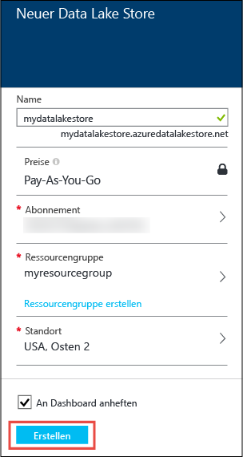
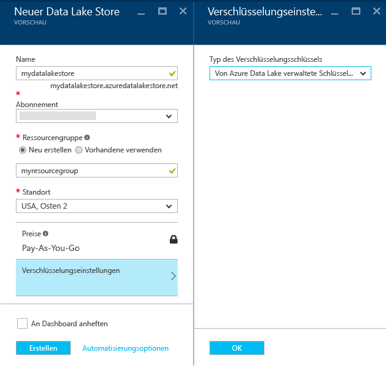
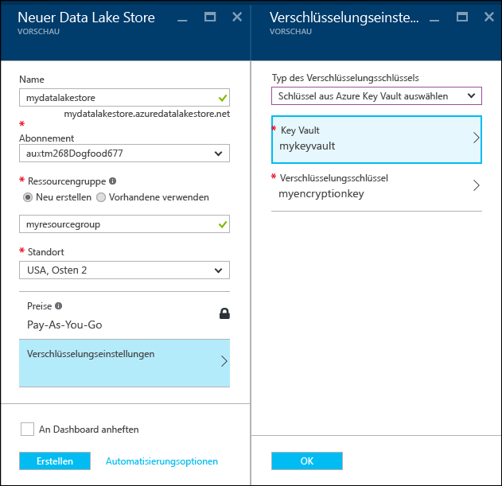
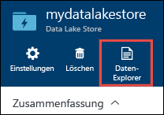
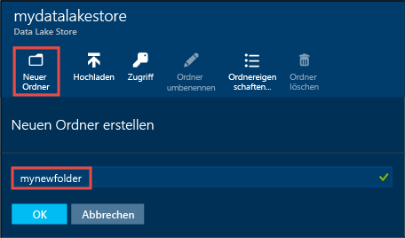
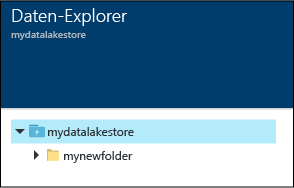
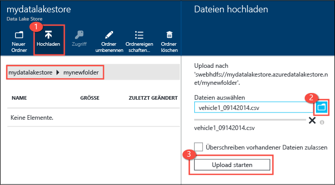
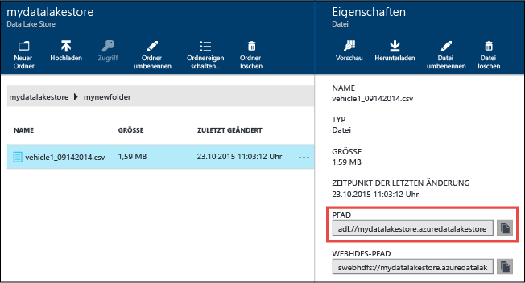
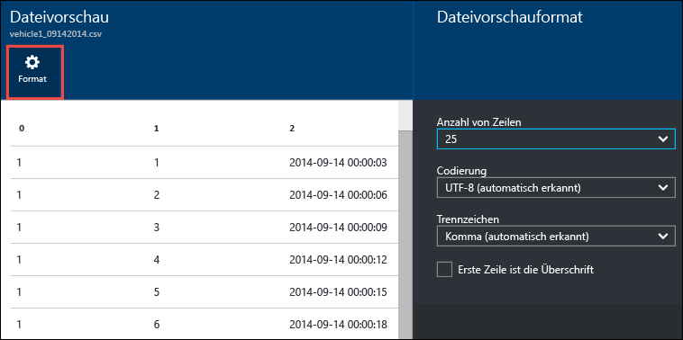
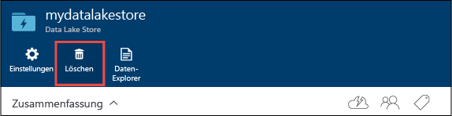

# Erste Schritte mit Azure Data Lake-Speicher mithilfe des Azure-Portals
> [!div class="op_single_selector"]
> * [Portal](data-lake-store-get-started-portal.md)
> * [PowerShell](data-lake-store-get-started-powershell.md)
> * [.NET SDK](data-lake-store-get-started-net-sdk.md)
> * [Java SDK](data-lake-store-get-started-java-sdk.md)
> * [REST-API](data-lake-store-get-started-rest-api.md)
> * [Azure-Befehlszeilenschnittstelle](data-lake-store-get-started-cli.md)
> * [Node.js](data-lake-store-manage-use-nodejs.md)
> 
> 

Hier erfahren Sie, wie Sie im Azure-Portal ein Azure Data Lake-Speicherkonto erstellen und grundlegende Vorgänge ausführen, z. B. Ordner erstellen, Datendateien hoch- und herunterladen, Ihr Konto löschen usw. Weitere Informationen zu Data Lake Store finden Sie unter [Übersicht über Azure Data Lake Store](data-lake-store-overview.md).

## Voraussetzungen
Bevor Sie mit diesem Tutorial beginnen können, benötigen Sie Folgendes:

* **Ein Azure-Abonnement**. Siehe [How to get Azure Free trial for testing Hadoop in HDInsight](https://azure.microsoft.com/pricing/free-trial/)(in englischer Sprache).

## Lernen Sie schneller mit Videos?
Sehen Sie sich die folgenden Videos mit ersten Schritten mit dem Data Lake-Speicher an.

* [Erstellen eines Data Lake-Speicherkontos](https://mix.office.com/watch/1k1cycy4l4gen)
* [Verwalten von Daten im Data Lake-Speicher mit dem Daten-Explorer](https://mix.office.com/watch/icletrxrh6pc)

## Erstellen eines Azure Data Lake-Speicherkontos
1. Melden Sie sich beim neuen [Azure-Portal](https://portal.azure.com)an.
2. Klicken Sie auf **NEU**, auf **Daten und Speicher** und anschließend auf **Azure Data Lake Store**. Prüfen Sie die Informationen auf dem Blatt **Azure Data Lake Store**, und klicken Sie dann in der unteren linken Ecke des Blatts auf **Erstellen**.
3. Geben Sie auf dem Blatt **Neuer Data Lake-Speicher** die Werte wie im folgenden Screenshot gezeigt an:
   
    
   
   * **Name**. Geben Sie einen eindeutigen Namen für das Data Lake Store-Konto ein.
   * **Abonnement**. Wählen Sie das Abonnement aus, unter dem Sie ein neues Data Lake Store-Konto erstellen möchten.
   * **Ressourcengruppe**. Wählen Sie eine vorhandene Ressourcengruppe aus, oder wählen Sie die Option **Neu erstellen**, um eine Ressourcengruppe zu erstellen. Eine Ressourcengruppe ist ein Container, der verwandte Ressourcen für eine Anwendung enthält. Weitere Informationen finden Sie unter [Ressourcengruppen in Azure](../azure-resource-manager/resource-group-overview.md#resource-groups).
   * **Ort**: Wählen Sie den Ort aus, an dem Sie das Data Lake-Speicherkonto erstellen möchten.
   * **Verschlüsselungseinstellungen**. Sie können auswählen, ob Ihr Data Lake Store-Konto verschlüsselt werden soll. Bei Auswahl der Verschlüsselung können Sie auch angeben, wie Sie den Masterverschlüsselungsschlüssel verwalten, den Sie zum Verschlüsseln der Daten in Ihrem Konto verwenden möchten.
     
     * (Standard) Wählen Sie in der Dropdownliste die Option **Verschlüsselung nicht aktivieren**, wenn Sie die Verschlüsselung nicht verwenden möchten.
     * (Optional) Wählen Sie **Von Azure Data Lake verwaltete Schlüssel verwenden**, wenn Sie möchten, dass Ihre Verschlüsselungsschlüssel von Azure Data Lake Store verwaltet werden sollen.
       
         
     * (Optional) Wählen Sie **Schlüssel aus Azure Key Vault auswählen**, wenn Sie Ihre eigenen Schlüssel verwenden möchten, die in Azure Key Vault enthalten sind. Mit dieser Option können Sie auch ein Key Vault-Konto und Schlüssel erstellen, falls Sie dies noch nicht durchgeführt haben.
       
         
       
       Klicken Sie auf dem Blatt **Verschlüsselungseinstellungen** auf **OK**.
       
       > [!NOTE]
       > Wenn Sie die Schlüssel aus einem Azure Key Vault verwenden, um die Verschlüsselung für das Data Lake Store-Konto zu konfigurieren, müssen Sie für das Azure Data Lake Store-Konto Berechtigungen zum Zugreifen auf den Azure Key Vault zuweisen. Eine Anleitung hierzu finden Sie unter [Zuweisen von Berechtigungen zu Azure Key Vault](#assign-permissions-to-the-azure-key-vault).
       > 
       > 
4. Klicken Sie auf **Erstellen**. Wenn Sie die Option zum Anheften des Kontos an das Dashboard ausgewählt haben, wird wieder das Dashboard angezeigt, und Sie können den Fortschritt der Bereitstellung Ihres Data Lake Store-Kontos überprüfen. Nachdem das Data Lake-Speicherkonto bereitgestellt wurde, wird das Kontoblatt angezeigt.

## Zuweisen von Berechtigungen zu Azure Key Vault
Wenn Sie Schlüssel aus einem Azure Key Vault zum Konfigurieren der Verschlüsselung für das Data Lake Store-Konto verwendet haben, müssen Sie den Zugriff zwischen dem Data Lake Store-Konto und dem Azure Key Vault-Konto konfigurieren. Führen Sie hierzu die folgenden Schritte aus:

1. Wenn Sie Schlüssel aus dem Azure Key Vault verwendet haben, wird oben auf dem Blatt für das Data Lake Store-Konto eine Warnung angezeigt. Klicken Sie auf die Warnung, um das Blatt **Key Vault-Berechtigungen konfigurieren** zu öffnen.
   
    
2. Das Blatt enthält zwei Optionen zum Konfigurieren des Zugriffs.
   
   * Klicken Sie unter der ersten Option auf **Berechtigung erteilen**, um den Zugriff zu konfigurieren. Die erste Option ist nur aktiviert, wenn der Benutzer, der das Data Lake Store-Konto erstellt hat, auch ein Azure Key Vault-Administrator ist.
   * Mit der anderen Option wird das PowerShell-Cmdlet ausgeführt, das auf dem Blatt angezeigt wird. Sie müssen der Besitzer der Azure Key Vault-Instanz sein oder Berechtigungen für Azure Key Vault gewähren können. Wechseln Sie nach dem Ausführen des Cmdlets zurück zum Blatt, und klicken Sie auf **Aktivieren**, um den Zugriff zu konfigurieren.

## Erstellen von Ordnern im Azure Data Lake-Speicherkonto
Sie können in Ihrem Data Lake-Speicherkonto Ordner zum Verwalten und Speichern von Daten erstellen.

1. Öffnen Sie das eben erstellte Data Lake-Speicherkonto. Klicken Sie im linken Bereich auf **Durchsuchen** und dann auf **Data Lake Store**. Klicken Sie anschließend auf dem Blatt „Data Lake Store“ auf den Namen des Kontos, in dem Sie Ordner erstellen möchten. Wenn Sie das Konto an das Startmenü angeheftet haben, klicken Sie auf die Kontokachel.
2. Klicken Sie auf dem Blatt Ihres Data Lake-Speicherkontos auf **Daten-Explorer**.
   
    
3. Klicken Sie auf dem Blatt Ihres Data Lake Store-Kontos auf **Neuer Ordner**, geben Sie einen Namen für den neuen Ordner ein, und klicken Sie dann auf **OK**.
   
    
   
    Der neu erstellte Ordner wird auf dem Blatt **Daten-Explorer** aufgelistet. Sie können geschachtelte Ordner mit beliebig vielen Schachtelungsebenen erstellen.
   
    

## Hochladen von Daten in das Azure Data Lake-Speicherkonto
Sie können Ihre Daten direkt auf die Stammebene eines Azure Data Lake-Speicherkontos oder in einen im Konto erstellten Ordner hochladen. Gehen Sie wie im folgenden Screenshot gezeigt vor, um auf dem Blatt **Daten-Explorer** eine Datei in einen Unterordner hochzuladen. In diesem Screenshot wird die Datei in den auf der Breadcrumb-Leiste (rot markiert) angezeigten Unterordner hochgeladen.

Wenn Sie Beispieldaten zum Hochladen verwenden möchten, können Sie den Ordner **Ambulance Data** aus dem [Azure Data Lake-Git-Repository](https://github.com/MicrosoftBigData/usql/tree/master/Examples/Samples/Data/AmbulanceData)herunterladen.

## Verfügbare Eigenschaften und Aktionen für die gespeicherten Daten
Klicken Sie auf die neu hinzugefügte Datei, um das Blatt **Eigenschaften** zu öffnen. Auf diesem Blatt werden die Eigenschaften der Datei und die verfügbaren Aktionen für die Datei angezeigt. Sie können auch den vollständigen Pfad der Datei in Ihrem Azure Data Lake-Speicherkonto kopieren (rot markiert im folgenden Screenshot).

* Klicken Sie auf **Vorschau**, um direkt im Browser eine Vorschau der Datei anzuzeigen. Sie können auch das Format der Vorschau angeben. Klicken Sie auf **Vorschau**, klicken Sie auf dem Blatt **Dateivorschau** auf **Format**, und geben Sie dann auf dem Blatt **Format der Dateivorschau** Optionen wie die Anzahl anzuzeigender Zeilen, die zu verwendende Codierung, das Trennzeichen usw. an.
  
  
* Klicken Sie auf **Herunterladen** , um die Datei auf Ihren Computer herunterzuladen.
* Klicken Sie auf **Datei umbenennen** , um die Datei umzubenennen.
* Klicken Sie auf **Datei löschen** , um die Datei zu löschen.

## Sichern der Daten
Sie können die in Ihrem Azure Data Lake-Speicherkonto gespeicherten Daten mithilfe von Azure Active Directory und Access Control (Zugriffssteuerungslisten, ACLs) sichern. Anweisungen dazu finden Sie unter [Sichern von Daten in Azure Data Lake-Speicher](data-lake-store-secure-data.md).

## Löschen des Azure Data Lake-Speicherkontos
Um ein Azure Data Lake-Speicherkonto zu löschen, klicken Sie auf dem Blatt „Data Lake-Speicher“ auf **Löschen**. Sie werden aufgefordert, den Namen des zu löschenden Kontos einzugeben, um die Aktion zu bestätigen. Geben Sie den Namen des Kontos ein, und klicken Sie dann auf **Löschen**.

## Nächste Schritte
* [Sichern von Daten in Data Lake-Speicher](data-lake-store-secure-data.md)
* [Verwenden von Azure Data Lake Analytics mit Data Lake-Speicher](../data-lake-analytics/data-lake-analytics-get-started-portal.md)
* [Verwenden von Azure HDInsight mit Data Lake-Speicher](data-lake-store-hdinsight-hadoop-use-portal.md)
* [Zugreifen auf Diagnoseprotokolle für Azure Data Lake Store](data-lake-store-diagnostic-logs.md)

<!--HONumber=Nov16_HO2-->

