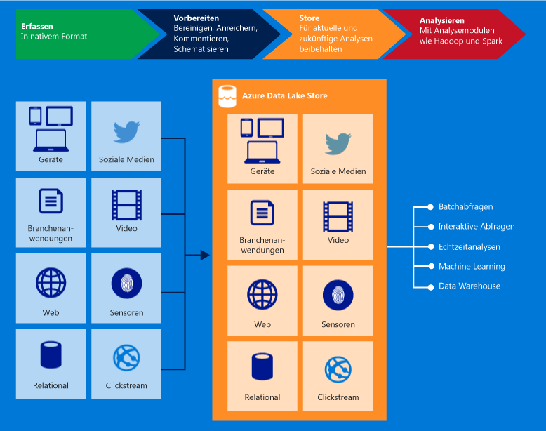

<properties
   pageTitle="Übersicht über Azure Data Lake-Speicher | Azure"
   description="Erfahren Sie, was Azure Data Lake-Speicher ist und welche Vorteile er im Vergleich zu anderen Datenspeichern bietet."
   services="data-lake-store"
   documentationCenter=""
   authors="nitinme"
   manager="jhubbard"
   editor="cgronlun"/>

<tags
   ms.service="data-lake-store"
   ms.devlang="na"
   ms.topic="get-started-article"
   ms.tgt_pltfrm="na"
   ms.workload="big-data"
   ms.date="08/02/2016"
   ms.author="nitinme"/>

# Übersicht über Azure Data Lake-Speicher

Azure Data Lake-Speicher ist ein unternehmensweites riesiges Repository für Big Data-Analyseworkloads. Azure Data Lake bietet Ihnen die Möglichkeit, Daten von beliebiger Größe, Art und Erfassungsgeschwindigkeit zur Durchführung operativer und explorativer Analysen an einem einzigen Ort zu erfassen.

> [AZURE.TIP] Verwenden Sie den [Lernpfad für Data Lake-Speicher](https://azure.microsoft.com/documentation/learning-paths/data-lake-store-self-guided-training/), um den Azure Data Lake-Speicherdienst zu erkunden.

Auf Azure Data Lake-Speicher kann über Hadoop (verfügbar mit HDInsight-Clustern) mithilfe der WebHDFS-kompatiblen REST-APIs zugegriffen werden. Er wurde speziell für Analysen der gespeicherten Daten konzipiert und für Datenanalyseszenarien leistungsoptimiert. Er enthält standardmäßig all die Funktionen auf Unternehmensniveau, die für reale Anwendungsfälle von Unternehmen erforderlich sind – Sicherheit, Verwaltbarkeit, Skalierbarkeit, Zuverlässigkeit und Verfügbarkeit.

Azure Data Lake bietet u. a. die folgenden wichtigen Funktionen.

### Konzipiert für Hadoop

Beim Azure Data Lake-Speicher handelt es sich um ein Apache Hadoop-Dateisystem, das mit HDFS (Hadoop Distributed File System) kompatibel ist und mit dem Hadoop-Ökosystem eingesetzt werden kann. Ihre vorhandenen HDInsight-Anwendungen oder -Dienste, die die WebHDFS-API verwenden, können problemlos in Data Lake-Speicher integriert werden. Data Lake-Speicher macht auch eine WebHDFS-kompatible REST-Schnittstelle für Anwendungen verfügbar.

In Data Lake-Speicher gespeicherte Daten können mühelos mit Hadoop-Analyseframeworks wie MapReduce oder Hive analysiert werden. Microsoft Azure HDInsight-Cluster können für den direkten Zugriff auf in Data Lake-Speicher gespeicherte Daten bereitgestellt und konfiguriert werden.

### Unbegrenzter Speicher, Dateigrößen bis in den Petabytebereich

Azure Data Lake-Speicher bietet unbegrenzten Speicher und eignet sich zum Speichern unterschiedlichster Daten für Analysezwecke. Es gelten keinerlei Einschränkungen für Kontogrößen, Dateigrößen oder die Menge an Daten, die in einem Data Lake gespeichert werden kann. Data Lake-Speicher unterstützt Dateigrößen vom Kilobyte- bis in den Petabytebereich und ist somit eine gute Wahl für die Speicherung von Daten jeglicher Art. Daten werden dauerhaft gespeichert, indem mehrere Kopien erstellt werden, und können für unbegrenzte Zeit im Data Lake gespeichert werden.

### Leistungsoptimiert für Big Data-Analysen

Azure Data Lake-Speicher ist für die Ausführung großer Analysesysteme ausgelegt, die zum Abfragen und Analysieren großer Datenmengen einen enormen Durchsatz erfordern. Der Data Lake verteilt Teile einer Datei auf mehrere einzelne Speicherserver. Dies verbessert den Lesedurchsatz, wenn die Datei zum Ausführen von Datenanalysen parallel gelesen wird.

### Geeignet für Unternehmen: Hoch verfügbar und sicher

Azure Data Lake-Speicher bietet Verfügbarkeit und Zuverlässigkeit nach Industriestandard. Ihre Datenassets werden dauerhaft gespeichert, indem zum Schutz vor unerwarteten Fehlern redundante Kopien erstellt werden. Unternehmen können Azure Data Lake in ihren Lösungen als wesentlichen Bestandteil ihrer vorhandenen Datenplattform einsetzen.

Data Lake-Speicher bietet außerdem Sicherheit auf Unternehmensniveau für die gespeicherten Daten. Weitere Informationen finden Sie unter [Sichern von Daten in Azure Data Lake-Speicher](#DataLakeStoreSecurity).

### Alle Daten

Azure Data Lake-Speicher kann beliebige Daten ohne vorherige Transformation im systemeigenen Format speichern. Bei Data Lake-Speicher ist es nicht erforderlich, vor dem Laden der Daten ein Schema zu definieren. Die Interpretation der Daten und Definition eines Schemas erfolgt zum Zeitpunkt der Analyse durch die einzelnen Analyseframeworks. Dank der Möglichkeit, Dateien beliebiger Größe und Formate zu speichern, kann Data Lake-Speicher strukturierte, teilweise strukturierte und unstrukturierte Daten verwalten.

Azure Data Lake-Speichercontainer für Daten sind im Wesentlichen Ordner und Dateien. Sie arbeiten mit den gespeicherten Daten mithilfe von SDKs, des Azure-Portals und von Azure PowerShell. Solange Sie Ihre Daten unter Verwendung dieser Schnittstellen im Speicher ablegen und die entsprechenden Container verwenden, können Sie jeden Datentyp speichern. Data Lake-Speicher führt keine spezielle Verarbeitung von Daten basierend auf dem Typ der gespeicherten Daten durch.

## Sichern von Daten in Azure Data Lake-Speicher

Azure Data Lake-Speicher verwendet Azure Active Directory zur Authentifizierung und Zugriffssteuerungslisten (ACLs) zum Verwalten des Zugriffs auf Ihre Daten.

| Feature | Beschreibung |
|-----------------------------------------|------------------------------------------|
| Authentifizierung | Zur Identitäts- und Zugriffsverwaltung für alle in Azure Data Lake-Speicher gespeicherten Daten ist Azure Data Lake-Speicher in Azure Active Directory (AAD) integriert. Dank dieser Integration nutzt Azure Data Lake sämtliche AAD-Funktionen, z. B. Multi-Factor Authentication, bedingter Zugriff, rollenbasierte Zugriffssteuerung, Überwachung der Anwendungsnutzung, Sicherheitsüberwachung und -warnungen usw. Azure Data Lake-Speicher unterstützt das OAuth 2.0-Protokoll für die Authentifizierung mit der REST-Schnittstelle. |
| Zugriffssteuerung | Azure Data Lake-Speicher ermöglicht eine Zugriffssteuerung durch die Unterstützung von POSIX-Berechtigungen, die vom WebHDFS-Protokoll verfügbar gemacht werden. In der aktuellen Version können ACLs im Stammordner, in Unterordnern und in einzelnen Dateien aktiviert werden. Die ACLs, die Sie auf den Stammordner anwenden, gelten auch für alle untergeordneten Ordner bzw. Dateien.|

Weitere Informationen zum Schützen von Daten im Data Lake-Speicher finden Sie unter folgenden Links:

* Anweisungen zum Sichern von Daten in Data Lake-Speicher finden Sie unter [Sichern von Daten in Azure Data Lake-Speicher](data-lake-store-secure-data.md).
* Bevorzugen Sie Videos? Sehen Sie sich [dieses Video](https://mix.office.com/watch/1q2mgzh9nn5lx) über das Schützen von im Data Lake-Speicher gespeicherten Daten an.

## Mit Azure Data Lake-Speicher kompatible Anwendungen

Azure Data Lake-Speicher ist mit den meisten Open Source-Komponenten des Hadoop-Systems kompatibel. Außerdem ist eine problemlose Integration in andere Azure-Dienste möglich. Das macht Data Lake-Speicher zur optimalen Lösung für Ihre Datenspeicheranforderungen. Unter den folgenden Links finden Sie weitere Informationen zur Verwendung von Data Lake-Speicher mit Open Source-Komponenten und anderen Azure-Diensten:

* Eine Liste der mit Data Lake-Speicher interoperablen Open-Source-Anwendungen finden Sie unter [Mit Azure Data Lake-Speicher kompatible Anwendungen und Dienste](data-lake-store-compatible-oss-other-applications.md).
* Informationen dazu, wie Data Lake-Speicher mit anderen Azure-Diensten verwendet werden kann, um ein breiteres Spektrum von Szenarien zu ermöglichen, finden Sie unter [Integration in andere Azure-Dienste](data-lake-store-integrate-with-other-services.md).
* Informationen dazu, wie Data Lake-Speicher beispielsweise zum Erfassen von Daten, zum Verarbeiten von Daten, zum Herunterladen von Daten und zum Visualisieren von Daten verwendet werden kann, finden Sie unter [Datenszenarien im Zusammenhang mit dem Azure Data Lake-Speicher](data-lake-store-data-scenarios.md).

## Was ist das Azure Data Lake Store-Dateisystem (adl://)?

In Hadoop-Umgebungen (verfügbar mit HDInsight-Clustern) kann über das neue Dateisystem „AzureDataLakeFilesystem“ (adl://) auf Data Lake Store zugegriffen werden. Anwendungen und Dienste, die adl:// verwenden, können weitere Leistungsoptimierungen nutzen, die gegenwärtig nicht in WebHDFS verfügbar sind. Daher bietet Ihnen Data Lake-Speicher die Flexibilität, entweder mit adl:// (empfohlene Option) die optimale Leistung zu nutzen oder vorhandenen Code beizubehalten, indem Sie die WebHDFS-API weiterhin direkt verwenden. Azure HDInsight schöpft die Möglichkeiten des „AzureDataLakeFilesystem“ voll aus, um eine optimale Leistung für Data Lake-Speicher bereitzustellen.

Sie können mithilfe von `adl://<data_lake_store_name>.azuredatalakestore.net` auf Ihre Daten im Data Lake-Speicher zugreifen. Weitere Informationen zum Zugriff auf die Daten im Data Lake-Speicher finden Sie unter [Anzeigen der Eigenschaften der gespeicherten Daten](data-lake-store-get-started-portal.md#properties).

## Wie verwende ich Azure Data Lake-Speicher?

Informationen zur Bereitstellung eines Data Lake-Speichers über das Azure-Portal finden Sie unter [Erste Schritte mit Data Lake-Speicher mithilfe des Azure-Portals](data-lake-store-get-started-portal.md). Nachdem Sie Azure Data Lake bereitgestellt haben, können Sie sich darüber informieren, wie Big Data-Angebote wie Azure Data Lake Analytics oder Azure HDInsight mit Data Lake-Speicher verwendet werden. Sie können auch eine .NET-Anwendung zum Erstellen eines Azure Data Lake-Speicherkontos erstellen und Vorgänge wie das Hoch- und Herunterladen von Daten usw. durchführen.

- [Erste Schritte mit Azure Data Lake Analytics](../data-lake-analytics/data-lake-analytics-get-started-portal.md)
- [Verwenden von Azure HDInsight mit Data Lake-Speicher](data-lake-store-hdinsight-hadoop-use-portal.md)
- [Erste Schritte mit Azure Data Lake-Speicher mithilfe des .NET SDK](data-lake-store-get-started-net-sdk.md)

## Videos zum Data Lake-Speicher

Für Benutzer, die sich lieber anhand von Videos informieren, stellt Data Lake-Speicher Videos für eine Reihe von Features bereit:

* [Create an Azure Data Lake Store Account (Erstellen eines Azure Data Lake-Speicherkontos)](https://mix.office.com/watch/1k1cycy4l4gen)
* [Use the Data Explorer to Manage Data in Azure Data Lake Store (Verwalten von Daten im Azure Data Lake-Speicher mithilfe des Daten-Explorers)](https://mix.office.com/watch/icletrxrh6pc)
* [Connect Azure Data Lake Analytics to Azure Data Lake Store (Verknüpfen von Azure Data Lake Analytics mit dem Azure Data Lake-Speicher)](https://mix.office.com/watch/qwji0dc9rx9k)
* [Access Azure Data Lake Store via Data Lake Analytics (Zugreifen auf den Azure Data Lake-Speicher mit Azure Data Lake Analytics)](https://mix.office.com/watch/1n0s45up381a8)
* [Connect Azure HDInsight to Azure Data Lake Store (Verknüpfen von Azure HDInsight mit dem Azure Data Lake-Speicher)](https://mix.office.com/watch/l93xri2yhtp2)
* [Access Azure Data Lake Store via Hive and Pig (Zugreifen auf den Azure Data Lake-Speicher mit Hive und Pig)](https://mix.office.com/watch/1n9g5w0fiqv1q)
* [Use DistCp (Hadoop Distributed Copy) to copy data to and from Azure Data Lake Store (Kopieren von Daten aus dem und in den Azure Data Lake-Speicher mithilfe von DistCp [Hadoop Distributed Copy])](https://mix.office.com/watch/1liuojvdx6sie)
* [Use Apache Sqoop to move data between relational sources and Azure Data Lake Store (Verschieben von Daten zwischen relationalen Quellen und dem Azure Data Lake-Speicher mithilfe von Apache Sqoop)](https://mix.office.com/watch/1butcdjxmu114)
* [Data Orchestration using Azure Data Factory for Azure Data Lake Store (Datenorchestrierung mithilfe von Azure Data Factory für den Azure Data Lake-Speicher)](https://mix.office.com/watch/1oa7le7t2u4ka)
* [Securing Data in the Azure Data Lake Store (Schützen von Daten im Azure Data Lake-Speicher)](https://mix.office.com/watch/1q2mgzh9nn5lx)

<!----HONumber=AcomDC_0914_2016--->