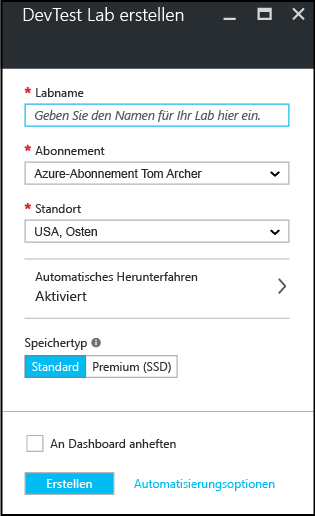

# Erstellen eines Labs in Azure DevTest Labs
## Voraussetzungen
Zum Erstellen eines Labs benötigen Sie Folgendes:

* Ein Azure-Abonnement. Weitere Informationen zu den Azure-Kaufoptionen finden Sie unter [Azure erwerben](https://azure.microsoft.com/pricing/purchase-options/) oder [Kostenlose Testversion (1 Monat)](https://azure.microsoft.com/pricing/free-trial/). Zum Erstellen des Labs müssen Sie der Besitzer des Abonnements sein.

## Schritte zum Erstellen eines Labs in Azure DevTest Labs
Die folgenden Schritte beschreiben, wie Sie mithilfe des Azure-Portals ein Lab in Azure DevTest Labs erstellen. 

1. Melden Sie sich beim [Azure-Portal](http://go.microsoft.com/fwlink/p/?LinkID=525040)an.
2. Wählen Sie **Weitere Dienste** und dann in der Liste **DevTest Labs**.
3. Wählen Sie auf dem Blatt **DevTest Labs** die Option **Hinzufügen** aus.
   
    
4. Führen Sie auf dem Blatt **DevTest Lab erstellen** folgende Schritte aus:
   
   1. Geben Sie einen **Labnamen** für das neue Lab ein.
   2. Wählen Sie das **Abonnement** aus, das mit dem Lab verknüpft werden soll.
   3. Wählen Sie einen **Speicherort** für das Lab aus.
   4. Geben Sie mithilfe von **Auto-shutdown** (Automatisch herunterfahren) an, ob Sie das automatische Herunterfahren für alle virtuellen Computer im Lab aktivieren und die entsprechenden Parameter festlegen möchten.
   5. Wählen Sie den **Speichertyp** , um den Speicherdatenträgertyp für die virtuellen Computer im Lab anzugeben. 
   6. Klicken Sie auf **Erstellen**.
      
      

[!INCLUDE [devtest-lab-try-it-out](../../includes/devtest-lab-try-it-out.md)]

## Nächste Schritte
Nachdem das Lab erstellt wurde, sollten Sie ggf. die folgenden Schritte ausführen:

* [Sicherer Zugriff auf ein Lab](devtest-lab-add-devtest-user.md).
* [Festlegen von Labrichtlinien](devtest-lab-set-lab-policy.md).
* [Erstellen einer Labvorlage](devtest-lab-create-template.md).
* [Erstellen benutzerdefinierter Artefakte für Ihre VMs](devtest-lab-artifact-author.md).
* [Hinzufügen einer VM mit Artefakten zu einem Lab](devtest-lab-add-vm-with-artifacts.md).

<!--HONumber=Nov16_HO2-->

