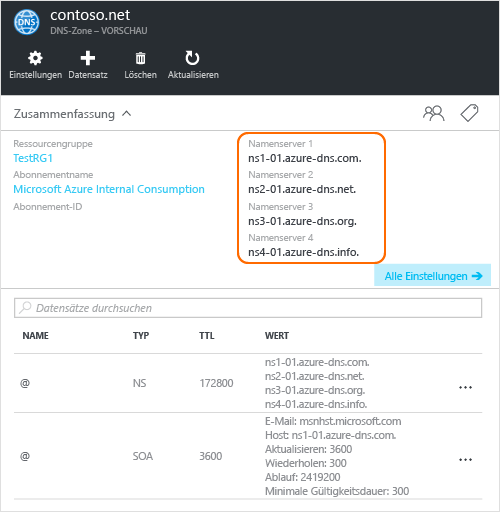

# <a name="delegate-a-domain-to-azure-dns"></a>Delegieren von Domänen an Azure DNS

Azure DNS ermöglicht es Ihnen, eine DNS-Zone zu hosten und die DNS-Einträge für eine Domäne in Azure zu verwalten. Damit DNS-Abfragen für eine Domäne Azure DNS erreichen, muss die Domäne aus der übergeordneten Domäne an Azure DNS delegiert werden. Denken Sie daran, dass Azure DNS keine Domänenregistrierungsstelle ist. In diesem Artikel wird die Funktionsweise der Domänendelegierung und die Domänendelegierung an Azure DNS beschrieben.

## <a name="how-dns-delegation-works"></a>Funktionsweise der DNS-Delegierung

### <a name="domains-and-zones"></a>Domänen und Zonen

Das Domain Name System ist eine Hierarchie von Domänen. Die Hierarchie beginnt mit der Stammdomäne, deren Name einfach „**.**“ lautet.  Darunter befinden sich Domänen der obersten Ebene, z.B. „com“, „net“, „org“, „uk“ oder „jp“.  Unterhalb davon befinden sich die Domänen der zweiten Ebene, z.B. „org.uk“ oder „co.jp“.  Und so weiter. Die Domänen in der DNS-Hierarchie werden mithilfe von separaten DNS-Zonen gehostet. Diese Zonen sind global verteilt und werden von DNS-Namenservern in der ganzen Welt gehostet.

**DNS-Zone**

Eine Domäne ist ein eindeutiger Name im Domain Name System, z.B. „contoso.com“. Eine DNS-Zone wird zum Hosten der DNS-Einträge für eine bestimmte Domäne verwendet. Die Domäne „contoso.com“ kann beispielsweise mehrere DNS-Einträge enthalten, z.B. „mail.contoso.com“ (für einen E-Mail-Server) und „www.contoso.com“ (für eine Website).

**Domänenregistrierungsstelle**

Eine Domänenregistrierungsstelle ist ein Unternehmen, das Internetdomänennamen anbieten kann. Das Unternehmen überprüft, ob die Internetdomäne, die Sie verwenden möchten, noch verfügbar ist, und ermöglicht es Ihnen, sie zu erwerben. Sobald der Domänenname registriert wurde, sind Sie der rechtmäßige Besitzer des Domänennamens. Wenn Sie bereits über eine Internetdomäne verfügen, verwenden Sie für die Delegierung an Azure DNS die aktuelle Domänenregistrierungsstelle.

> [!NOTE]
> Weitere Informationen dazu, wer der Besitzer eines bestimmten Domänennamens ist, oder Informationen zum Kauf einer Domäne finden Sie im Thema zur [Verwaltung von Internetdomänen in Azure AD](https://msdn.microsoft.com/library/azure/hh969248.aspx).

### <a name="resolution-and-delegation"></a>Auflösung und Delegierung

Es gibt zwei Arten von DNS-Server:

* Ein *autoritativer* DNS-Server hostet DNS-Zonen. Er antwortet nur auf DNS-Abfragen nach Einträgen für diese Zonen.
* Ein *rekursiver* DNS-Server hostet keine DNS-Zonen. Er reagiert auf alle DNS-Abfragen durch Aufrufen der autoritativen DNS-Server, um die benötigten Daten zu erfassen.

> [!NOTE]
> Azure DNS stellt einen autoritativen DNS-Dienst bereit.  Ein rekursiver DNS-Dienst wird nicht bereitgestellt.
>
> Cloud Services und virtuelle Computer in Azure werden automatisch für die Verwendung eines rekursiven DNS-Diensts konfiguriert, der separat als Teil der Infrastruktur von Azure bereitgestellt wird.  Informationen zum Ändern dieser DNS-Einstellungen finden Sie unter [Namensauflösung mithilfe eines eigenen DNS-Servers](../virtual-network/virtual-networks-name-resolution-for-vms-and-role-instances.md#name-resolution-using-your-own-dns-server).

DNS-Clients in PCs und mobilen Geräten rufen in der Regel einen rekursiven DNS-Server auf, um DNS-Abfragen auszuführen, die die Clientanwendungen benötigen.

Wenn ein rekursiver DNS-Server eine Abfrage für einen DNS-Eintrag erhält, z.B. „www.contoso.com“, muss er zuerst nach dem Namenserver suchen, der die Zone für die Domäne „contoso.com“ hostet. Zu diesem Zweck beginnt er mit den Stammnamenservern und sucht von dort aus die Namenserver, die die Zone „com“ hosten. Anschließend fragt er die com-Namenserver ab, um den Namenserver zu suchen, der die Zone „contoso.com“ hostet.  Anschließend kann er diese Namenserver nach „www.contoso.com“ abfragen.

Dies wird als Auflösen des DNS-Namens bezeichnet. Streng genommen umfasst die DNS-Auflösung zusätzliche Schritte wie das Verfolgen von CNAMEs, aber für die Funktionsweise der DNS-Delegierung ist dies nicht relevant.

Wie verweist eine übergeordnete Zone auf die Namenserver für eine untergeordnete Zone? Hierfür wird eine besondere Art von DNS-Eintrag verwendet: ein so genannter NS-Eintrag. (NS steht hier für Namenserver.) Die Stammzone enthält beispielsweise NS-Einträge für „com“ und zeigt die Namenserver für die Zone „com“ an. Die Zone „com“ enthält im Gegenzug NS-Einträge für „contoso.com“ und zeigt die Namenserver für die Zone „contoso.com“ an. Das Einrichten der NS-Einträge für eine untergeordnete Zone in einer übergeordneten Zone wird Delegieren der Domäne genannt.


Jede Delegierung umfasst eigentlich zwei Kopien der NS-Einträge: eine in der übergeordneten Zone, die auf die untergeordnete Zone verweist, und eine in der untergeordneten Zone selbst. Die Zone „contoso.com“ enthält die NS-Einträge für „contoso.com“ (neben den NS-Einträgen in „com“). Diese werden als autoritative NS-Einträge bezeichnet und befinden sich an der Spitze der untergeordneten Zone.

## <a name="delegating-a-domain-to-azure-dns"></a>Delegieren einer Domäne an Azure DNS
Nachdem Sie Ihre DNS-Zone in Azure DNS erstellt haben, müssen Sie NS-Einträge in der übergeordneten Zone einrichten, um Azure DNS zur autoritativen Quelle für die Namensauflösung der Zone zu machen. Für Domänen, die von einer Registrierungsstelle erworben wurden, bietet Ihnen die Registrierungsstelle die Möglichkeit, diese NS-Einträge einzurichten.

> [!NOTE]
> Sie müssen keine Domäne besitzen, um eine DNS-Zone mit diesem Domänennamen in Azure DNS zu erstellen. Sie müssen jedoch Besitzer der Domäne sein, um die Delegierung an Azure DNS bei der Registrierungsstelle einzurichten.

Nehmen wir beispielsweise an, Sie erwerben die Domäne „contoso.com“ und erstellen eine Zone mit dem Namen „contoso.com“ in Azure DNS. Als Besitzer der Domäne bietet Ihre Registrierungsstelle Ihnen die Option, die Namenserveradressen (d. h. die NS-Einträge) für Ihre Domäne zu konfigurieren. Die Registrierungsstelle speichert diese NS-Einträge in der übergeordneten Domäne (in diesem Fall „.com“). Clients auf der ganzen Welt werden beim Auflösen von DNS-Einträgen nach „contoso.com“ dann an Ihre Domäne in der Azure DNS-Zone geleitet.

### <a name="finding-the-name-server-names"></a>Ermitteln der Namen der Namenserver
Bevor Sie Ihre DNS-Zone an Azure DNS delegieren können, müssen Sie den Namenserver für Ihre Zone ermitteln. Azure DNS weist bei jeder Zonenerstellung Namenserver aus einem Pool zu.

Welche Namenserver Ihrer Zone zugewiesen sind, lässt sich am einfachsten über das Azure-Portal ermitteln.  In diesem Beispiel wurden der Zone „contoso.net“ die Namenserver „ns1-01.azure-dns.com“, „ns2-01.azure-dns.net“, „ns3-01.azure-dns.org“ und „ns4-01.azure-dns.info“ zugewiesen:

 

Azure DNS erstellt in Ihrer Zone automatisch autoritative NS-Einträge mit den zugewiesenen Namenservern.  Die Namen der Namenserver können Sie über Azure PowerShell oder mithilfe der Azure-Befehlszeilenschnittstelle anzeigen, indem Sie diese Einträge abrufen.

Mithilfe von Azure PowerShell können die autoritativen NS-Einträge wie folgt abgerufen werden. (Hinweis: Der Eintragsname „"@"“ wird verwendet, um auf Einträge an der Spitze der Zone zu verweisen.)

```powershell
$zone = Get-AzureRmDnsZone -Name contoso.net -ResourceGroupName MyResourceGroup
Get-AzureRmDnsRecordSet -Name "@" -RecordType NS -Zone $zone
```

Das folgende Beispiel ist die Antwort.

```
Name              : @
ZoneName          : contoso.net
ResourceGroupName : MyResourceGroup
Ttl               : 3600
Etag              : 5fe92e48-cc76-4912-a78c-7652d362ca18
RecordType        : NS
Records           : {ns1-01.azure-dns.com, ns2-01.azure-dns.net, ns3-01.azure-dns.org,
                    ns4-01.azure-dns.info}
Tags              : {}
```

Sie können auch die plattformübergreifende Azure-Befehlszeilenschnittstelle verwenden, um die autoritativen NS-Datensätze abzurufen, und so die Ihrer Zone zugewiesenen Namenserver ermitteln:

```azurecli
azure network dns record-set show MyResourceGroup contoso.net @ NS
```

Das folgende Beispiel ist die Antwort.

```
info:    Executing command network dns record-set show
    + Looking up the DNS Record Set "@" of type "NS"
data:    Id                              : /subscriptions/.../resourceGroups/MyResourceGroup/providers/Microsoft.Network/dnszones/contoso.net/NS/@
data:    Name                            : @
data:    Type                            : Microsoft.Network/dnszones/NS
data:    Location                        : global
data:    TTL                             : 172800
data:    NS records
data:        Name server domain name     : ns1-01.azure-dns.com.
data:        Name server domain name     : ns2-01.azure-dns.net.
data:        Name server domain name     : ns3-01.azure-dns.org.
data:        Name server domain name     : ns4-01.azure-dns.info.
data:
info:    network dns record-set show command OK
```

### <a name="to-set-up-delegation"></a>So richten Sie die Delegierung ein

Jede Registrierungsstelle hat seine eigenen DNS-Verwaltungstools, um die Namenservereinträge für eine Domäne zu ändern. Bearbeiten Sie auf der DNS-Verwaltungsseite der Registrierungsstelle die NS-Einträge, und ersetzen Sie die NS-Einträge durch die von Azure DNS erstellten Einträge.

Wenn Sie eine Domäne an Azure DNS delegieren, müssen Sie die von Azure DNS bereitgestellten Namen der Namenserver verwenden.  Sie sollten immer alle vier Namensservernamen verwenden, und zwar unabhängig vom Namen Ihrer Domäne.  Für die Domänendelegierung ist es nicht erforderlich, dass der Namensservername dieselbe Domäne der obersten Ebene wie Ihre Domäne verwendet.

Sie sollten nicht mit Verbindungsdatensätzen auf die IP-Adressen der Azure DNS-Namenserver verweisen, da sich diese IP-Adressen später ändern können. Delegierungen, für die Namen der Namenserver in Ihrer eigenen Zone verwendet werden (manchmal als „Vanity-Namenserver“ bezeichnet), werden derzeit in Azure DNS nicht unterstützt.

### <a name="to-verify-name-resolution-is-working"></a>So überprüfen Sie, ob die Namensauflösung funktioniert

Nach Abschluss der Delegierung können Sie überprüfen, ob die Namensauflösung funktioniert, indem Sie mithilfe eines Tools wie „nslookup“ den SOA-Eintrag für die Zone abrufen (wird beim Erstellen der Zone automatisch erstellt).

Beachten Sie, dass Sie nicht die Azure DNS-Namenserver angeben müssen, da der normale DNS-Auflösungsvorgang die Namenserver automatisch findet, wenn die Delegierung ordnungsgemäß eingerichtet wurde.

```
nslookup -type=SOA contoso.com

Server: ns1-04.azure-dns.com
Address: 208.76.47.4

contoso.com
primary name server = ns1-04.azure-dns.com
responsible mail addr = msnhst.microsoft.com
serial = 1
refresh = 900 (15 mins)
retry = 300 (5 mins)
expire = 604800 (7 days)
default TTL = 300 (5 mins)
```

## <a name="delegating-sub-domains-in-azure-dns"></a>Delegieren von Unterdomänen in Azure DNS

Wenn Sie eine separate untergeordnete Zone einrichten möchten, können Sie eine Unterdomäne in Azure DNS delegieren. Angenommen, Sie möchten nach dem Einrichten und Delegieren von „contoso.com“ in Azure DNS die separate untergeordnete Zone „partners.contoso.com“ einrichten.

Eine Unterdomäne wird auf eine ähnliche Weise eingerichtet wie eine normale Delegierung. Der einzige Unterschied besteht darin, dass in Schritt 3 die NS-Datensätze in der übergeordneten Zone „contoso.com“ in Azure DNS erstellt werden müssen und nicht über eine Domänenregistrierungsstelle eingerichtet werden.

1. Erstellen Sie die untergeordnete Zone „partners.contoso.com“ in Azure DNS.
2. Suchen Sie die autoritativen NS-Datensätze in der untergeordneten Zone, um die Namenserver abzurufen, die die untergeordnete Zone in Azure DNS hosten.
3. Delegieren Sie die untergeordnete Zone, indem Sie NS-Datensätze in der übergeordneten Zone konfigurieren, die auf die untergeordnete Zone verweisen.

### <a name="to-delegate-a-sub-domain"></a>So delegieren Sie eine Unterdomäne

Die Vorgehensweise wird im folgenden PowerShell-Beispiel veranschaulicht. Die gleichen Schritte können über das Azure-Portal oder mithilfe der plattformübergreifenden Azure-Befehlsschnittstelle durchgeführt werden.

#### <a name="step-1-create-the-parent-and-child-zones"></a>Schritt 1: Erstellen der übergeordneten und untergeordneten Zonen
Als Erstes erstellen wir die übergeordneten und untergeordneten Zonen. Diese können sich in der gleichen Ressourcengruppe oder in unterschiedlichen Ressourcengruppen befinden.

```powershell
$parent = New-AzureRmDnsZone -Name contoso.com -ResourceGroupName RG1
$child = New-AzureRmDnsZone -Name partners.contoso.com -ResourceGroupName RG1
```

#### <a name="step-2-retrieve-ns-records"></a>Schritt 2: Abrufen der NS-Einträge

Dann rufen wir wie im folgenden Beispiel dargestellt die autoritativen NS-Datensätze aus der untergeordneten Zone ab.  Darin enthalten sind die Namenserver, die der untergeordnete Zone zugewiesen sind.

```powershell
$child_ns_recordset = Get-AzureRmDnsRecordSet -Zone $child -Name "@" -RecordType NS
```

#### <a name="step-3-delegate-the-child-zone"></a>Schritt 3: Delegieren der untergeordneten Zone

Erstellen Sie in der übergeordneten Zone den entsprechenden NS-Eintragssatz, um die Delegierung abzuschließen. Beachten Sie, dass der Name des Datensatzes in der übergeordneten Zone mit dem Namen in der untergeordneten Zone (in diesem Fall „partners“) übereinstimmt.

```powershell
$parent_ns_recordset = New-AzureRmDnsRecordSet -Zone $parent -Name "partners" -RecordType NS -Ttl 3600
$parent_ns_recordset.Records = $child_ns_recordset.Records
Set-AzureRmDnsRecordSet -RecordSet $parent_ns_recordset
```

### <a name="to-verify-name-resolution-is-working"></a>So überprüfen Sie, ob die Namensauflösung funktioniert

Sie können überprüfen, ob alles ordnungsgemäß eingerichtet ist, indem Sie den SOA-Eintrag der untergeordneten Zone suchen.

```
nslookup -type=SOA partners.contoso.com

Server: ns1-08.azure-dns.com
Address: 208.76.47.8

partners.contoso.com
    primary name server = ns1-08.azure-dns.com
    responsible mail addr = msnhst.microsoft.com
    serial = 1
    refresh = 900 (15 mins)
    retry = 300 (5 mins)
    expire = 604800 (7 days)
    default TTL = 300 (5 mins)
```

## <a name="next-steps"></a>Nächste Schritte

[Verwalten von DNS-Zonen](dns-operations-dnszones.md)

[Verwalten von DNS-Einträgen](dns-operations-recordsets.md)


<!--HONumber=Feb17_HO2-->


