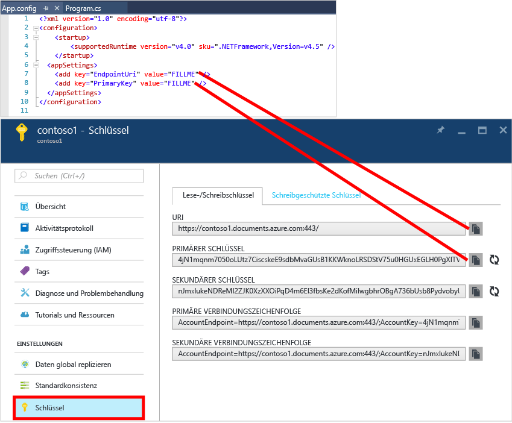

<properties
	pageTitle="NoSQL-Tutorial: DocumentDB .NET SDK | Microsoft Azure"
	description="Ein NoSQL-Tutorial, das eine Onlinedatenbank und eine C#-Konsolenanwendung mit dem DocumentDB .NET SDK erstellt. DocumentDB ist eine NoSQL-Datenbank für JSON."
	keywords="nosql tutorial, online database, c# console application"
	services="documentdb"
	documentationCenter=".net"
	authors="AndrewHoh"
	manager="jhubbard"
	editor="monicar"/>

<tags
	ms.service="documentdb"
	ms.workload="data-services"
	ms.tgt_pltfrm="na"
	ms.devlang="dotnet"
	ms.topic="hero-article"
	ms.date="09/01/2016"
	ms.author="anhoh"/>

# NoSQL-Tutorial: Erstellen einer DocumentDB-C#-Konsolenanwendung

> [AZURE.SELECTOR]
- [.NET](documentdb-get-started.md)
- [Node.js](documentdb-nodejs-get-started.md)

Willkommen beim NoSQL-Tutorial für das Azure DocumentDB .NET SDK! Nachdem Sie das Schnellstartprojekt abgerufen oder das Tutorial absolviert haben, verfügen Sie über eine Konsolenanwendung zum Erstellen und Abfragen von DocumentDB-Ressourcen.

- **[Schnellstart](#quickstart)**: Laden Sie das Beispielprojekt herunter, und geben Sie Ihre Verbindungsinformationen an. So verfügen Sie in weniger als zehn Minuten über eine verwendungsbereite DocumentDB-App.
- **[Tutorial](#tutorial)**: Erstellen Sie die Schnellstart-App von Grund auf in 30 Minuten.

## Voraussetzungen

- Ein aktives Azure-Konto. Wenn Sie keines besitzen, können Sie sich für ein [kostenloses Konto](https://azure.microsoft.com/free/) registrieren.
- [Visual Studio 2013 oder Visual Studio 2015](http://www.visualstudio.com/).
- .NET Framework 4.6

## Schnellstart

1. Laden Sie die ZIP-Datei mit dem Beispielprojekt von [GitHub](https://github.com/Azure-Samples/documentdb-dotnet-getting-started-quickstart/archive/master.zip) herunter, oder klonen Sie das Repository [documentdb-dotnet-getting-started-quickstart](https://github.com/Azure-Samples/documentdb-dotnet-getting-started-quickstart).
2. [Erstellen Sie ein DocumentDB-Konto](documentdb-create-account.md) über das Azure-Portal.
3. Ersetzen Sie in der Datei „App.config“ die Werte für „EndpointUri“ und „PrimaryKey“ durch Werte aus dem [Azure-Portal](https://portal.azure.com/). Klicken Sie hierzu auf dem Blatt **DocumentDB (NoSQL)** auf **Kontoname** und anschließend im Ressourcenmenü auf **Schlüssel**. 
4. Erstellen Sie das Projekt. Im Konsolenfenster können Sie verfolgen, wie die neuen Ressourcen erstellt, abgefragt und anschließend bereinigt werden.
    
    

## Tutorial

Dieses Tutorial zeigt Schritt für Schritt, wie Sie eine DocumentDB-Datenbank, eine DocumentDB-Sammlung und JSON-Dokumente erstellen. Anschließend fragen Sie die Sammlung ab und bereinigen und löschen die Datenbank. Im Rahmen dieses Tutorial wird das Projekt erstellt, das Sie auch mit dem Schnellstartprojekt erhalten. Dabei gehen Sie jedoch Schritt für Schritt vor und erhalten Erklärungen zu dem Code, den Sie dem Projekt hinzufügen.

## Schritt 1: Erstellen eines DocumentDB-Kontos

In diesem Schritt erstellen Sie ein DocumentDB-Konto. Wenn Sie bereits über ein Konto verfügen, das Sie verwenden möchten, können Sie diesen Schritt überspringen und mit [Einrichten der Visual Studio-Projektmappe](#SetupVS) fortfahren.

[AZURE.INCLUDE [DocumentDB-Erstellen-DB-Account](../../includes/documentdb-create-dbaccount.md)]

## Schritt 2: Einrichten Ihrer Visual Studio-Projektmappe

1. Öffnen Sie **Visual Studio 2015** auf Ihrem Computer.
2. Wählen Sie im Menü **Datei** die Option **Neu** und anschließend **Projekt** aus.
3. Wählen Sie im Dialogfeld **Neues Projekt** die Option **Vorlagen**/**Visual C#**/**Konsolenanwendung** aus, geben Sie Ihrem Projekt einen Namen, und klicken Sie dann auf **OK**. 
4. Im **Projektmappen-Explorer** klicken Sie mit der rechten Maustaste auf die neue Konsolenanwendung, die sich unter Ihrer Visual Studio-Projektmappe befindet.
5. Klicken Sie im gleichen Menü auf **NuGet-Pakete verwalten...**. 
6. Klicken Sie auf der Registerkarte **NuGet** auf **Durchsuchen**, und geben Sie in das Suchfeld **azure documentdb** ein.
7. Suchen Sie in den Ergebnissen nach **Microsoft.Azure.DocumentDB**, und klicken Sie auf **Installieren**. Die Paket-ID für die DocumentDB-Clientbibliothek lautet [Microsoft.Azure.DocumentDB](https://www.nuget.org/packages/Microsoft.Azure.DocumentDB). 

Prima. Damit ist die Einrichtung abgeschlossen und wir können mit dem Schreiben von Code beginnen. Ein vollständiges Codeprojekt dieses Tutorials finden Sie auf [GitHub](https://github.com/Azure-Samples/documentdb-dotnet-getting-started/blob/master/src/Program.cs).

## Schritt 3: Herstellen einer Verbindung mit einem DocumentDB-Konto

Fügen Sie zunächst in der Datei "Program.cs" am Anfang der C#-Anwendung folgende Verweise hinzu:

    using System;
    using System.Linq;
    using System.Threading.Tasks;

    // ADD THIS PART TO YOUR CODE
    using System.Net;
    using Microsoft.Azure.Documents;
    using Microsoft.Azure.Documents.Client;
    using Newtonsoft.Json;

> [AZURE.IMPORTANT] Um dieses NoSQL-Tutorial abzuschließen, müssen Sie die oben genannten Abhängigkeiten hinzufügen.

Fügen Sie diese beiden Konstanten und Ihre *Client*variable nun unter der öffentlichen *Program*-Klasse hinzu.

	public class Program
	{
		// ADD THIS PART TO YOUR CODE
		private const string EndpointUri = "<your endpoint URI>";
		private const string PrimaryKey = "<your key>";
		private DocumentClient client;

Navigieren Sie als Nächstes zum [Azure-Portal](https://portal.azure.com), um Ihren URI und den Primärschlüssel abzurufen. Der DocumentDB-URI und der Primärschlüssel sind erforderlich, damit Ihre Anwendung weiß, womit die Verbindung hergestellt werden soll, und damit DocumentDB weiß, dass die Verbindung Ihrer Anwendung vertrauenswürdig ist.

Navigieren Sie im Azure-Portal zu Ihrem DocumentDB-Konto, und klicken Sie auf **Schlüssel**.

Kopieren Sie den URI aus dem Portal, und fügen Sie ihn in der Datei „program.cs“ in `<your endpoint URI>` ein. Kopieren Sie anschließend den PRIMÄRSCHLÜSSEL aus dem Portal, und fügen Sie ihn in `<your key>` ein.

![Screenshot des Azure-Portals, das vom NoSQL-Tutorial zum Erstellen einer C#-Konsolenanwendung verwendet wird. Zeigt ein DocumentDB-Konto, bei dem der ACTIVE-Hub, die Schaltfläche „SCHLÜSSEL“ auf dem Blatt „DocumentDB-Konto“ sowie auf dem Blatt „Schlüssel“ die Werte URI, PRIMÄRSCHLÜSSEL und SEKUNDÄRSCHLÜSSEL hervorgehoben sind.][keys]

Zu Beginn erstellen wir für die Anwendung zu den ersten Schritten eine neue Instanz von **DocumentClient**.

Fügen Sie unterhalb der **Main**-Methode die neue asynchrone Aufgabe mit der Bezeichnung **GetStartedDemo** hinzu. Sie dient zum Instanziieren des neuen **DocumentClient**-Elements.

	static void Main(string[] args)
	{
	}

	// ADD THIS PART TO YOUR CODE
	private async Task GetStartedDemo()
	{
		this.client = new DocumentClient(new Uri(EndpointUri), PrimaryKey);
	}

Fügen Sie den folgenden Code hinzu, um die asynchrone Aufgabe über die **Main**-Methode auszuführen. Mit der **Main**-Methode werden Ausnahmen abgefangen und in die Konsole geschrieben.

	static void Main(string[] args)
	{
			// ADD THIS PART TO YOUR CODE
			try
			{
					Program p = new Program();
					p.GetStartedDemo().Wait();
			}
			catch (DocumentClientException de)
			{
					Exception baseException = de.GetBaseException();
					Console.WriteLine("{0} error occurred: {1}, Message: {2}", de.StatusCode, de.Message, baseException.Message);
			}
			catch (Exception e)
			{
					Exception baseException = e.GetBaseException();
					Console.WriteLine("Error: {0}, Message: {1}", e.Message, baseException.Message);
			}
			finally
			{
					Console.WriteLine("End of demo, press any key to exit.");
					Console.ReadKey();
			}

Drücken Sie F5, um die Anwendung auszuführen.

Glückwunsch! Sie haben die Verbindung mit einem DocumentDB-Konto erfolgreich hergestellt. Als Nächstes sehen wir uns die Verwendung von DocumentDB-Ressourcen an.

## Schritt 4: Erstellen einer Datenbank
Bevor Sie den Code zum Erstellen einer Datenbank hinzufügen, fügen Sie eine Hilfsmethode zum Schreiben in die Konsole hinzu.

Kopieren Sie die **WriteToConsoleAndPromptToContinue**-Methode, und fügen Sie sie unterhalb der **GetStartedDemo**-Methode ein.

	// ADD THIS PART TO YOUR CODE
	private void WriteToConsoleAndPromptToContinue(string format, params object[] args)
	{
			Console.WriteLine(format, args);
			Console.WriteLine("Press any key to continue ...");
			Console.ReadKey();
	}

Ihre DocumentDB-[Datenbank](documentdb-resources.md#databases) kann mithilfe der Methode [CreateDatabaseAsync](https://msdn.microsoft.com/library/microsoft.azure.documents.client.documentclient.createdatabaseasync.aspx) der **DocumentClient**-Klasse erstellt werden. Eine Datenbank ist ein logischer Container für JSON-Dokumentspeicher, der auf Sammlungen aufgeteilt ist.

Kopieren Sie die **CreateDatabaseIfNotExists**-Methode, und fügen Sie sie unterhalb der **WriteToConsoleAndPromptToContinue**-Methode ein.

	// ADD THIS PART TO YOUR CODE
	private async Task CreateDatabaseIfNotExists(string databaseName)
	{
			// Check to verify a database with the id=FamilyDB does not exist
			try
			{
					await this.client.ReadDatabaseAsync(UriFactory.CreateDatabaseUri(databaseName));
					this.WriteToConsoleAndPromptToContinue("Found {0}", databaseName);
			}
			catch (DocumentClientException de)
			{
					// If the database does not exist, create a new database
					if (de.StatusCode == HttpStatusCode.NotFound)
					{
							await this.client.CreateDatabaseAsync(new Database { Id = databaseName });
							this.WriteToConsoleAndPromptToContinue("Created {0}", databaseName);
					}
					else
					{
							throw;
					}
			}
	}

Kopieren Sie den folgenden Code, und fügen Sie ihn in die **GetStartedDemo**-Methode unterhalb der Clienterstellung ein. Eine Datenbank mit dem Namen *FamilyDB* wird erstellt.

	private async Task GetStartedDemo()
	{
		this.client = new DocumentClient(new Uri(EndpointUri), PrimaryKey);

		// ADD THIS PART TO YOUR CODE
		await this.CreateDatabaseIfNotExists("FamilyDB_va");

Drücken Sie F5, um die Anwendung auszuführen.

Glückwunsch! Sie haben die Erstellung einer DocumentDB-Datenbank erfolgreich abgeschlossen.

## Schritt 5: Erstellen einer Sammlung  

> [AZURE.WARNING] **CreateDocumentCollectionAsync** erstellt eine neue Sammlung mit reserviertem Durchsatz. Dies wirkt sich auf den Preis aus. Weitere Informationen finden Sie auf unserer [Preisseite](https://azure.microsoft.com/pricing/details/documentdb/).

Eine [Sammlung](documentdb-resources.md#collections) kann mithilfe der [CreateDocumentCollectionAsync](https://msdn.microsoft.com/library/microsoft.azure.documents.client.documentclient.createdocumentcollectionasync.aspx)-Methode der **DocumentClient**-Klasse erstellt werden. Eine Sammlung ist ein Container für JSON-Dokumente und die zugehörige JavaScript-Anwendungslogik.

Kopieren Sie die **CreateDocumentCollectionIfNotExists**-Methode, und fügen Sie sie unterhalb der **CreateDatabaseIfNotExists**-Methode ein.

	// ADD THIS PART TO YOUR CODE
	private async Task CreateDocumentCollectionIfNotExists(string databaseName, string collectionName)
	{
		try
		{
			await this.client.ReadDocumentCollectionAsync(UriFactory.CreateDocumentCollectionUri(databaseName, collectionName));
			this.WriteToConsoleAndPromptToContinue("Found {0}", collectionName);
		}
		catch (DocumentClientException de)
		{
			// If the document collection does not exist, create a new collection
			if (de.StatusCode == HttpStatusCode.NotFound)
			{
				DocumentCollection collectionInfo = new DocumentCollection();
				collectionInfo.Id = collectionName;

				// Configure collections for maximum query flexibility including string range queries.
				collectionInfo.IndexingPolicy = new IndexingPolicy(new RangeIndex(DataType.String) { Precision = -1 });

				// Here we create a collection with 400 RU/s.
				await this.client.CreateDocumentCollectionAsync(
					UriFactory.CreateDatabaseUri(databaseName),
					collectionInfo,
					new RequestOptions { OfferThroughput = 400 });

				this.WriteToConsoleAndPromptToContinue("Created {0}", collectionName);
			}
			else
			{
				throw;
			}
		}
	}

Kopieren Sie den folgenden Code, und fügen Sie ihn unterhalb der Datenbankerstellung in die **GetStartedDemo**-Methode ein. Dadurch wird eine Dokumentsammlung namens *FamilyCollection\_va* erstellt.

		this.client = new DocumentClient(new Uri(EndpointUri), PrimaryKey);

		await this.CreateDatabaseIfNotExists("FamilyDB_oa");

		// ADD THIS PART TO YOUR CODE
		await this.CreateDocumentCollectionIfNotExists("FamilyDB_va", "FamilyCollection_va");

Drücken Sie F5, um die Anwendung auszuführen.

Glückwunsch! Sie haben die Erstellung einer DocumentDB-Dokumentsammlung erfolgreich abgeschlossen.

## Schritt 6: Erstellen von JSON-Dokumenten
Ein [Dokument](documentdb-resources.md#documents) kann mithilfe der [CreateDocumentAsync](https://msdn.microsoft.com/library/microsoft.azure.documents.client.documentclient.createdocumentasync.aspx)-Methode der **DocumentClient**-Klasse erstellt werden. Dokumente sind benutzerdefinierter (beliebiger) JSON-Inhalt. Wir können jetzt eines oder mehrere Dokumente einfügen. Wenn Sie bereits über Daten verfügen, die Sie in der Datenbank speichern möchten, können Sie das [Datenmigrationstool](documentdb-import-data.md) von DocumentDB verwenden.

Zunächst müssen wir eine **Family**-Klasse erstellen, die in diesem Beispiel in DocumentDB gespeicherte Objekte darstellt. Außerdem erstellen wir die Unterklassen **Parent**, **Child**, **Pet** und **Address**, die in **Family** verwendet werden. Beachten Sie, dass Dokumente eine **Id**-Eigenschaft enthalten müssen, die in JSON als **id** serialisiert wird. Erstellen Sie diese Klassen, indem Sie die folgenden internen Unterklassen nach der **GetStartedDemo**-Methode hinzufügen.

Kopieren Sie die Klassen **Family**, **Parent**, **Child**, **Pet** und **Address**, und fügen Sie sie unterhalb der **WriteToConsoleAndPromptToContinue**-Methode ein.

	private void WriteToConsoleAndPromptToContinue(string format, params object[] args)
	{
		Console.WriteLine(format, args);
		Console.WriteLine("Press any key to continue ...");
		Console.ReadKey();
	}

	// ADD THIS PART TO YOUR CODE
	public class Family
	{
		[JsonProperty(PropertyName = "id")]
		public string Id { get; set; }
		public string LastName { get; set; }
		public Parent[] Parents { get; set; }
		public Child[] Children { get; set; }
		public Address Address { get; set; }
		public bool IsRegistered { get; set; }
		public override string ToString()
		{
				return JsonConvert.SerializeObject(this);
		}
	}

	public class Parent
	{
		public string FamilyName { get; set; }
		public string FirstName { get; set; }
	}

	public class Child
	{
		public string FamilyName { get; set; }
		public string FirstName { get; set; }
		public string Gender { get; set; }
		public int Grade { get; set; }
		public Pet[] Pets { get; set; }
	}

	public class Pet
	{
		public string GivenName { get; set; }
	}

	public class Address
	{
		public string State { get; set; }
		public string County { get; set; }
		public string City { get; set; }
	}

Kopieren Sie die **CreateFamilyDocumentIfNotExists**-Methode, und fügen Sie sie unterhalb der **CreateDocumentCollectionIfNotExists**-Methode ein.

	// ADD THIS PART TO YOUR CODE
	private async Task CreateFamilyDocumentIfNotExists(string databaseName, string collectionName, Family family)
	{
		try
		{
			await this.client.ReadDocumentAsync(UriFactory.CreateDocumentUri(databaseName, collectionName, family.Id));
			this.WriteToConsoleAndPromptToContinue("Found {0}", family.Id);
		}
		catch (DocumentClientException de)
		{
			if (de.StatusCode == HttpStatusCode.NotFound)
			{
				await this.client.CreateDocumentAsync(UriFactory.CreateDocumentCollectionUri(databaseName, collectionName), family);
				this.WriteToConsoleAndPromptToContinue("Created Family {0}", family.Id);
			}
			else
			{
				throw;
			}
		}
	}

Fügen Sie zwei Dokumente ein: eines für die Familie Andersen und eines für die Familie Wakefield.

Kopieren Sie den folgenden Code, und fügen Sie ihn unterhalb der Erstellung der Dokumentsammlung in die **GetStartedDemo**-Methode ein.

	await this.CreateDatabaseIfNotExists("FamilyDB_va");

	await this.CreateDocumentCollectionIfNotExists("FamilyDB_va", "FamilyCollection_va");

	// ADD THIS PART TO YOUR CODE
	Family andersenFamily = new Family
	{
			Id = "Andersen.1",
			LastName = "Andersen",
			Parents = new Parent[]
			{
					new Parent { FirstName = "Thomas" },
					new Parent { FirstName = "Mary Kay" }
			},
			Children = new Child[]
			{
					new Child
					{
							FirstName = "Henriette Thaulow",
							Gender = "female",
							Grade = 5,
							Pets = new Pet[]
							{
									new Pet { GivenName = "Fluffy" }
							}
					}
			},
			Address = new Address { State = "WA", County = "King", City = "Seattle" },
			IsRegistered = true
	};

	await this.CreateFamilyDocumentIfNotExists("FamilyDB_va", "FamilyCollection_va", andersenFamily);

	Family wakefieldFamily = new Family
	{
			Id = "Wakefield.7",
			LastName = "Wakefield",
			Parents = new Parent[]
			{
					new Parent { FamilyName = "Wakefield", FirstName = "Robin" },
					new Parent { FamilyName = "Miller", FirstName = "Ben" }
			},
			Children = new Child[]
			{
					new Child
					{
							FamilyName = "Merriam",
							FirstName = "Jesse",
							Gender = "female",
							Grade = 8,
							Pets = new Pet[]
							{
									new Pet { GivenName = "Goofy" },
									new Pet { GivenName = "Shadow" }
							}
					},
					new Child
					{
							FamilyName = "Miller",
							FirstName = "Lisa",
							Gender = "female",
							Grade = 1
					}
			},
			Address = new Address { State = "NY", County = "Manhattan", City = "NY" },
			IsRegistered = false
	};

	await this.CreateFamilyDocumentIfNotExists("FamilyDB_va", "FamilyCollection_va", wakefieldFamily);

Drücken Sie F5, um die Anwendung auszuführen.

Glückwunsch! Sie haben die Erstellung von zwei DocumentDB-Dokumenten erfolgreich abgeschlossen.

##Schritt 7: Abfragen von DocumentDB-Ressourcen

DocumentDB unterstützt umfassende [Abfragen](documentdb-sql-query.md) der in jeder Sammlung gespeicherten JSON-Dokumente. Der folgende Beispielcode zeigt die verschiedenen Abfragen - sowohl mithilfe der SQL-Syntax als auch LINQ -, die wir nun mit den Dokumenten ausführen können, die wir im vorherigen Schritt eingefügt haben.

Kopieren Sie die **ExecuteSimpleQuery**-Methode, und fügen Sie sie unterhalb der **CreateFamilyDocumentIfNotExists**-Methode ein.

	// ADD THIS PART TO YOUR CODE
	private void ExecuteSimpleQuery(string databaseName, string collectionName)
	{
		// Set some common query options
		FeedOptions queryOptions = new FeedOptions { MaxItemCount = -1 };

			// Here we find the Andersen family via its LastName
			IQueryable<Family> familyQuery = this.client.CreateDocumentQuery<Family>(
					UriFactory.CreateDocumentCollectionUri(databaseName, collectionName), queryOptions)
					.Where(f => f.LastName == "Andersen");

			// The query is executed synchronously here, but can also be executed asynchronously via the IDocumentQuery<T> interface
			Console.WriteLine("Running LINQ query...");
			foreach (Family family in familyQuery)
			{
					Console.WriteLine("\tRead {0}", family);
			}

			// Now execute the same query via direct SQL
			IQueryable<Family> familyQueryInSql = this.client.CreateDocumentQuery<Family>(
					UriFactory.CreateDocumentCollectionUri(databaseName, collectionName),
					"SELECT * FROM Family WHERE Family.LastName = 'Andersen'",
					queryOptions);

			Console.WriteLine("Running direct SQL query...");
			foreach (Family family in familyQueryInSql)
			{
					Console.WriteLine("\tRead {0}", family);
			}

			Console.WriteLine("Press any key to continue ...");
			Console.ReadKey();
	}

Kopieren Sie den folgenden Code, und fügen Sie ihn unterhalb der Erstellung des zweiten Dokuments in die **GetStartedDemo**-Methode ein.

	await this.CreateFamilyDocumentIfNotExists("FamilyDB_va", "FamilyCollection_va", wakefieldFamily);

	// ADD THIS PART TO YOUR CODE
	this.ExecuteSimpleQuery("FamilyDB_va", "FamilyCollection_va");

Drücken Sie F5, um die Anwendung auszuführen.

Glückwunsch! Sie haben die Abfrage einer DocumentDB-Sammlung erfolgreich abgeschlossen.

Das folgende Diagramm veranschaulicht, wie die DocumentDB-SQL-Abfragesyntax gegen die erstellte Sammlung aufgerufen wird. Die gleiche Logik wird auf die LINQ-Abfrage angewendet.

Das [FROM](documentdb-sql-query.md#from-clause) -Schlüsselwort ist in der Abfrage optional, da DocumentDB Abfragen auf eine Sammlung begrenzt. Aus diesem Grund ist "FROM Familien f" austauschbar mit "FROM Stamm r" oder einem anderen variablen Namen, den Sie auswählen. DocumentDB wird ableiten, dass Familien, Stamm oder der variable Name, den Sie ausgewählt haben, standardmäßig auf die aktuelle Sammlung verweisen.

##Schritt 8: Ersetzen eines JSON-Dokuments

DocumentDB unterstützt das Ersetzen von JSON-Dokumenten.

Kopieren Sie die **ReplaceFamilyDocument**-Methode, und fügen Sie sie unterhalb der **ExecuteSimpleQuery**-Methode ein.

	// ADD THIS PART TO YOUR CODE
	private async Task ReplaceFamilyDocument(string databaseName, string collectionName, string familyName, Family updatedFamily)
	{
		try
		{
			await this.client.ReplaceDocumentAsync(UriFactory.CreateDocumentUri(databaseName, collectionName, familyName), updatedFamily);
			this.WriteToConsoleAndPromptToContinue("Replaced Family {0}", familyName);
		}
		catch (DocumentClientException de)
		{
			throw;
		}
	}

Kopieren Sie den folgenden Code, und fügen Sie ihn unterhalb der Abfrageausführung in die **GetStartedDemo**-Methode ein. Nach dem Ersetzen des Dokuments wird dieselbe Abfrage erneut ausgeführt, um das geänderte Dokument anzuzeigen.

	await this.CreateFamilyDocumentIfNotExists("FamilyDB_va", "FamilyCollection_va", wakefieldFamily);

	this.ExecuteSimpleQuery("FamilyDB_va", "FamilyCollection_va");

	// ADD THIS PART TO YOUR CODE
	// Update the Grade of the Andersen Family child
	andersenFamily.Children[0].Grade = 6;

	await this.ReplaceFamilyDocument("FamilyDB_va", "FamilyCollection_va", "Andersen.1", andersenFamily);

	this.ExecuteSimpleQuery("FamilyDB_va", "FamilyCollection_va");

Drücken Sie F5, um die Anwendung auszuführen.

Glückwunsch! Sie haben die Ersetzung eines DocumentDB-Dokuments erfolgreich abgeschlossen.

##Schritt 9: Löschen eines JSON-Dokuments

DocumentDB unterstützt das Löschen von JSON-Dokumenten.

Kopieren Sie die **DeleteFamilyDocument**-Methode, und fügen Sie sie unterhalb der **ReplaceFamilyDocument**-Methode ein.

	// ADD THIS PART TO YOUR CODE
	private async Task DeleteFamilyDocument(string databaseName, string collectionName, string documentName)
	{
		try
		{
			await this.client.DeleteDocumentAsync(UriFactory.CreateDocumentUri(databaseName, collectionName, documentName));
			Console.WriteLine("Deleted Family {0}", documentName);
		}
		catch (DocumentClientException de)
		{
			throw;
		}
	}

Kopieren Sie den folgenden Code, und fügen Sie ihn unterhalb der zweiten Abfrageausführung in die **GetStartedDemo**-Methode ein.

	await this.ReplaceFamilyDocument("FamilyDB_va", "FamilyCollection_va", "Andersen.1", andersenFamily);

	this.ExecuteSimpleQuery("FamilyDB_va", "FamilyCollection_va");

	// ADD THIS PART TO CODE
	await this.DeleteFamilyDocument("FamilyDB_va", "FamilyCollection_va", "Andersen.1");

Drücken Sie F5, um die Anwendung auszuführen.

Glückwunsch! Sie haben das Löschen eines DocumentDB-Dokuments erfolgreich abgeschlossen.

##Schritt 10: Löschen der Datenbank

Das Löschen der erstellten Datenbank entfernt die Datenbank und alle untergeordneten Ressourcen (Sammlungen, Dokumente usw.).

Kopieren Sie den folgenden Code, und fügen Sie ihn unterhalb des Dokumentlöschvorgangs in die **GetStartedDemo**-Methode ein, um die gesamte Datenbank und alle untergeordneten Ressourcen zu löschen.

	this.ExecuteSimpleQuery("FamilyDB_va", "FamilyCollection_va");

	await this.DeleteFamilyDocument("FamilyDB_va", "FamilyCollection_va", "Andersen.1");

	// ADD THIS PART TO CODE
	// Clean up/delete the database
	await this.client.DeleteDatabaseAsync(UriFactory.CreateDatabaseUri("FamilyDB_va"));

Drücken Sie F5, um die Anwendung auszuführen.

Glückwunsch! Sie haben das Löschen einer DocumentDB-Datenbank erfolgreich abgeschlossen.

##Schritt 11: Ausführen der gesamten C#-Konsolenanwendung

Drücken Sie in Visual Studio F5 , um die Anwendung im Debugmodus zu erstellen.

Die Ausgabe der GetStarted-Anwendung sollte angezeigt werden. Die Ausgabe zeigt die Ergebnisse der hinzugefügten Abfragen an. Sie sollte mit unten stehendem Beispieltext übereinstimmen.

	Created FamilyDB_va
	Press any key to continue ...
	Created FamilyCollection_va
	Press any key to continue ...
	Created Family Andersen.1
	Press any key to continue ...
	Created Family Wakefield.7
	Press any key to continue ...
	Running LINQ query...
		Read {"id":"Andersen.1","LastName":"Andersen","District":"WA5","Parents":[{"FamilyName":null,"FirstName":"Thomas"},{"FamilyName":null,"FirstName":"Mary Kay"}],"Children":[{"FamilyName":null,"FirstName":"Henriette Thaulow","Gender":"female","Grade":5,"Pets":[{"GivenName":"Fluffy"}]}],"Address":{"State":"WA","County":"King","City":"Seattle"},"IsRegistered":true}
	Running direct SQL query...
		Read {"id":"Andersen.1","LastName":"Andersen","District":"WA5","Parents":[{"FamilyName":null,"FirstName":"Thomas"},{"FamilyName":null,"FirstName":"Mary Kay"}],"Children":[{"FamilyName":null,"FirstName":"Henriette Thaulow","Gender":"female","Grade":5,"Pets":[{"GivenName":"Fluffy"}]}],"Address":{"State":"WA","County":"King","City":"Seattle"},"IsRegistered":true}
	Replaced Family Andersen.1
	Press any key to continue ...
	Running LINQ query...
		Read {"id":"Andersen.1","LastName":"Andersen","District":"WA5","Parents":[{"FamilyName":null,"FirstName":"Thomas"},{"FamilyName":null,"FirstName":"Mary Kay"}],"Children":[{"FamilyName":null,"FirstName":"Henriette Thaulow","Gender":"female","Grade":6,"Pets":[{"GivenName":"Fluffy"}]}],"Address":{"State":"WA","County":"King","City":"Seattle"},"IsRegistered":true}
	Running direct SQL query...
		Read {"id":"Andersen.1","LastName":"Andersen","District":"WA5","Parents":[{"FamilyName":null,"FirstName":"Thomas"},{"FamilyName":null,"FirstName":"Mary Kay"}],"Children":[{"FamilyName":null,"FirstName":"Henriette Thaulow","Gender":"female","Grade":6,"Pets":[{"GivenName":"Fluffy"}]}],"Address":{"State":"WA","County":"King","City":"Seattle"},"IsRegistered":true}
	Deleted Family Andersen.1
	End of demo, press any key to exit.

Glückwunsch! Sie haben dieses NoSQL-Tutorial abgeschlossen und verfügen über eine funktionierende C#-Konsolenanwendung!

## Nächste Schritte

- Möchten Sie ein komplexeres ASP.NET MVC-NoSQL-Tutorial ausführen? Siehe: [Erstellen einer Webanwendung mit ASP.NET MVC unter Verwendung von DocumentDB](documentdb-dotnet-application.md).
- Möchten Sie Skalierungs- und Leistungstests mit DocumentDB durchführen? Weitere Informationen finden Sie unter [Leistungs- und Skalierungstests mit Azure DocumentDB](documentdb-performance-testing.md).
-	Sie erfahren, wie Sie ein [DocumentDB-Konto überwachen](documentdb-monitor-accounts.md).
-	Fragen Sie unser Beispieldataset im [Query Playground](https://www.documentdb.com/sql/demo) ab.
-	Weitere Informationen zum Programmiermodell finden Sie auf der [DocumentDB-Dokumentationsseite](https://azure.microsoft.com/documentation/services/documentdb/) im Abschnitt "Entwickeln".

[documentdb-create-account]: documentdb-create-account.md
[documentdb-manage]: documentdb-manage.md
[keys]: media/documentdb-get-started-quickstart/nosql-tutorial-keys.png

<!---HONumber=AcomDC_0907_2016-->