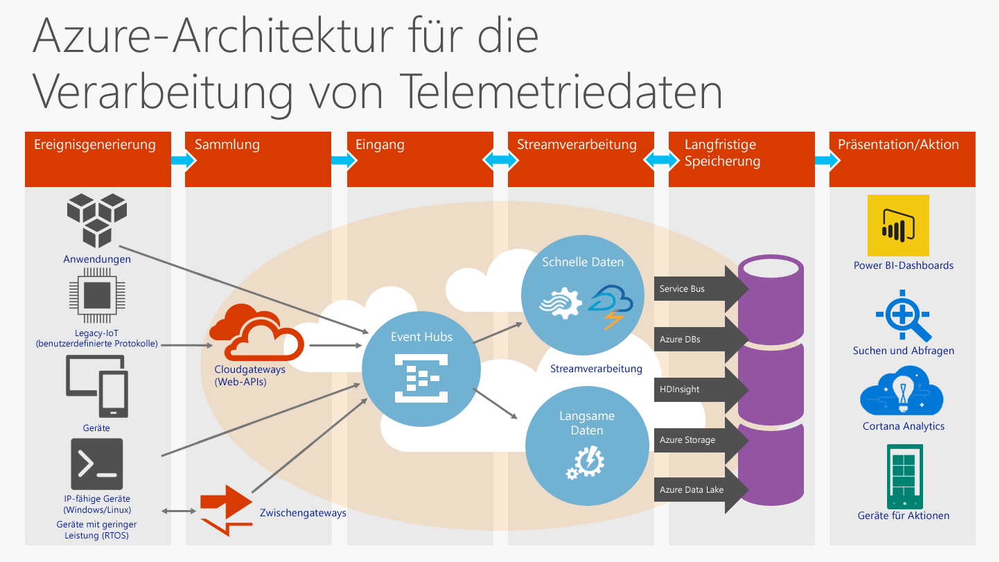
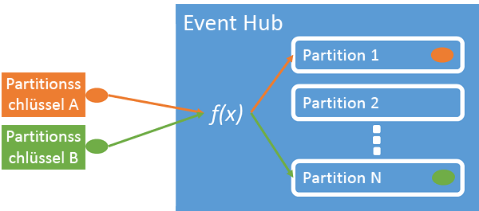
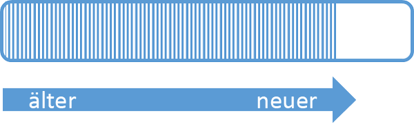
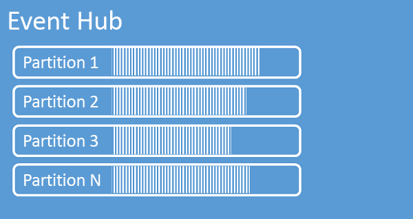
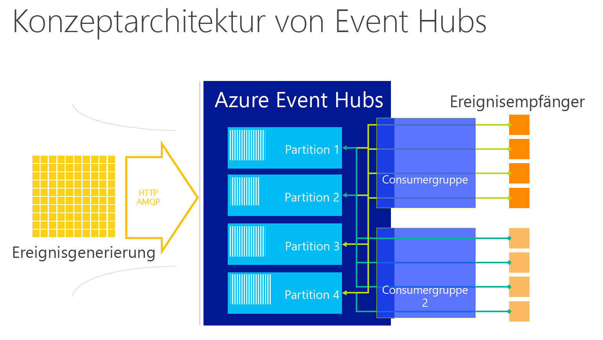
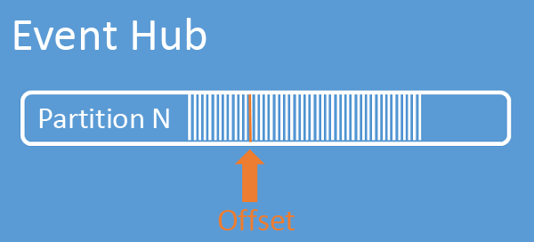

# <a name="what-is-azure-event-hubs"></a>Was ist Azure Event Hubs?
Event Hubs ist eine hochgradig skalierbare Datenstreamingplattform, die Millionen Ereignisse pro Sekunde erfassen kann. An einen Event Hub gesendete Daten können transformiert und mit einem beliebigen Echtzeitanalyse Anbieter oder Batchverarbeitungs-/Speicheradapter gespeichert werden. Mit der Möglichkeit, Veröffentlichen-/Abonnieren-Funktionen mit niedriger Latenz und enormem Umfang anzubieten, sind Event Hubs der Einstiegspunkt für Big Data.

## <a name="why-use-event-hubs"></a>Vorteile von Event Hubs
Die Ereignis- und Telemetrieverarbeitungsfunktionen von Event Hubs machen ihn besonders hilfreich für:

* Anwendungsinstrumentation
* Benutzerumgebung oder Workflowverarbeitung
* Internet der Dinge (IoT)-Szenarien

Event Hubs ermöglicht außerdem Verhaltensanalysen in mobilen Apps, Verkehrsinformationen von Webfarmen, Ereignisaufzeichnungen in Konsolenspielen oder von Industriemaschinen oder verbundenen Fahrzeugen erfasste Telemetriedaten.

## <a name="azure-event-hubs-overview"></a>Übersicht über Event Hubs
In Lösungsarchitekturen übernimmt Event Hubs im Allgemeinen eine Funktion als „Eingangstür“ für eine Ereignispipeline, häufig als *Ereigniserfassung* bezeichnet. Ein Ereigniserfasser ist eine Komponente oder ein Dienst zwischen Ereignisherausgeber und Ereignisverarbeitung zum Entkoppeln der Erzeugung eines Ereignisstreams von der Verarbeitung dieser Ereignisse.



Azure Event Hubs ist ein Dienst zur Ereignisverarbeitung, der große Mengen an Ereignis- und Telemetriedaten in der Cloud erfassen kann und gleichzeitig eine niedrige Latenz und hohe Zuverlässigkeit bietet. Event Hubs bietet eine Funktion zur Abwicklung von Nachrichtendatenströmen und verfügt über Eigenschaften, die sich enorm von herkömmlichen Unternehmensnachrichtendiensten unterscheiden. Event Hubs-Funktionen werden für Szenarien mit hohem Durchsatz und Ereignisverarbeitung erstellt. Infolgedessen werden von Event Hubs einige der Kommunikationsfunktionen, die für Nachrichtenentitäten wie Themen verfügbar sind, nicht implementiert.

Ein Event Hub wird auf Namespaceebene erstellt und verwendet AMQP und HTTP als primäre API-Schnittstellen.

## <a name="event-publishers"></a>Ereignisherausgeber
Jede Entität, die Daten an einen Event Hub sendet, ist ein *Ereignisherausgeber*. Ereignisherausgeber können Ereignisse über HTTPS oder AMQP 1.0 veröffentlichen. Ereignisherausgeber identifizieren sich mit einem Shared Access Signature (SAS)-Token bei einem Event Hub und können eine eindeutige Identität aufweisen oder ein gemeinsames SAS-Token verwenden.

### <a name="publishing-an-event"></a>Veröffentlichen eines Ereignisses
Sie können ein Ereignis über AMQP 1.0 oder HTTPS veröffentlichen. Service Bus bietet eine [EventHubClient](https://docs.microsoft.com/dotnet/api/microsoft.servicebus.messaging.eventhubclient)-Klasse zum Veröffentlichen von Ereignissen für einen Event Hub von .NET-Clients aus. Für andere Runtimes und Plattformen können beliebige AMQP 1.0-Clients verwendet werden, z.B. [Apache Qpid](http://qpid.apache.org/). Sie können Ereignisse einzeln oder als Batch veröffentlichen. Jede Veröffentlichung (Ereignisdateninstanz) ist auf 256 KB beschränkt, unabhängig davon, ob es sich um ein einzelnes Ereignis oder einen Batch handelt. Das Veröffentlichen von größeren Ereignissen führt zu einem Fehler. Es ist eine bewährte Methode für Herausgeber, die Partitionen innerhalb des Event Hubs nicht zu beachten und nur einen *Partitionsschlüssel* (im nächsten Abschnitt eingeführt) oder die eigene Identität über das SAS-Token anzugeben.

Die Wahl zwischen AMQP oder HTTPS ist auf das Verwendungsszenario bezogen. AMQP erfordert die Einrichtung eines persistenten bidirektionalen Sockets zusätzlich zu TLS (Transport Level Security) oder SSL/TLS. AMQP weist höhere Netzwerkkosten beim Initialisieren der Sitzung auf, HTTPS erfordert jedoch zusätzlichen SSL-Mehraufwand für jede Anfrage. AMQP verfügt über eine höhere Leistung für häufige Herausgeber.



Event Hubs stellt sicher, dass alle Ereignisse, die denselben Partitionsschlüsselwert verwenden, in der richtigen Reihenfolge und an dieselbe Partition übermittelt werden. Wenn Partitionsschlüssel mit Herausgeberrichtlinien verwendet werden, müssen die Identität des Herausgebers und der Wert des Partitionsschlüssels übereinstimmen. Andernfalls tritt ein Fehler auf.

### <a name="publisher-policy"></a>Herausgeberrichtlinie
Event Hubs ermöglicht eine differenzierte Kontrolle über Ereignisherausgeber durch *Herausgeberrichtlinien*. Herausgeberrichtlinien sind Laufzeitfunktionen, mit denen große Mengen unabhängiger Herausgeber verwaltet werden können. Mit Herausgeberrichtlinien verwendet jeder Herausgeber einen eigenen eindeutigen Bezeichner für die Veröffentlichung von Ereignissen in einem Event Hub. Dabei kommt der folgende Mechanismen zum Einsatz:

```
//[my namespace].servicebus.windows.net/[event hub name]/publishers/[my publisher name]
```

Sie müssen Herausgebernamen nicht im Voraus erstellen, jedoch müssen diese mit dem SAS-Token übereinstimmen, das beim Veröffentlichen eines Ereignisses verwendet wird, um die Identitäten unabhängiger Herausgeber sicherzustellen. Bei Verwendung von Herausgeberrichtlinien wird der Wert **PartitionKey** auf den Herausgebernamen festgelegt. Diese Werte müssen übereinstimmen, damit alles ordnungsgemäß funktioniert.

## <a name="partitions"></a>Partitionen
Event Hubs bietet Nachrichtenstreaming über ein partitioniertes Consumermuster, in dem jeder Consumer nur eine bestimmte Teilmenge oder Partition des Nachrichtenstreams liest. Dieses Muster ermöglicht eine horizontale Skalierung für die Ereignisverarbeitung und bietet andere datenstrombezogene Features, die in Warteschlangen und Themen nicht verfügbar sind.

Eine Partition ist eine geordnete Sequenz von Ereignissen, die in einem Event Hub besteht. Neu eingehende Ereignisse werden am Ende dieser Sequenz hinzugefügt. Eine Partition kann als "Commitprotokoll" betrachtet werden



Event Hubs bewahrt Daten einen konfigurierten Aufbewahrungszeitraum lang auf, der für alle Partitionen im Event Hub gilt. Ereignisse laufen nach Zeit ab. Sie können nicht direkt gelöscht werden. Da Partitionen unabhängig sind und ihre eigene Datensequenz enthalten, wachsen sie häufig mit unterschiedlicher Geschwindigkeit.



Die Anzahl der Partitionen wird bei der Erstellung angegeben und muss zwischen zwei und 32 liegen. Die Anzahl der Partitionen kann nicht geändert werden. Sie sollten also die langfristige Skalierung berücksichtigen, wenn Sie die Anzahl der Partitionen festlegen. Partitionen sind ein Mechanismus zur Organisation von Daten, der sich auf die in verarbeitenden Anwendungen erforderliche Downstreamparallelität bezieht. Die Anzahl der Partitionen in einem Event Hub steht in direktem Zusammenhang mit der erwarteten Anzahl von gleichzeitigen Lesern. Sie können die Anzahl der Partitionen auf mehr als 32 erhöhen, wenn Sie das Event Hubs-Team kontaktieren.

Auch wenn Partitionen identifizierbar sind und direkt an sie gesendet werden kann, ist dies nicht empfehlenswert. Stattdessen können Sie Konstrukte höherer Ebene verwenden, die in den Abschnitten [Ereignisherausgeber](#event-publishers) und [Kapazität](#capacity) erläutert werden.

Partitionen werden mit einer Sequenz von Ereignisdaten gefüllt, die den Hauptteil des Ereignisses, einen benutzerdefinierten Eigenschaftenbehälter und Metadaten enthalten, wie den Offset in der Partition und die Nummer in der Streamsequenz.

### <a name="partition-key"></a>Partitionsschlüssel
Sie können einen Partitionsschlüssel zum Zuordnen der in spezifischen Partitionen eingehenden Daten für die Datenorganisation verwenden. Der Partitionsschlüssel ist ein vom Absender bereitgestellter Wert, der an einen Event Hub übergeben wird. Er wird über eine statische Hashfunktion verarbeitet, die die Partitionszuweisung erstellt. Wenn Sie beim Veröffentlichen eines Ereignisses keinen Partitionsschlüssel angeben, wird eine Roundrobinzuordnung verwendet.

Dem Ereignisherausgeber ist nur der Partitionsschlüssel bekannt, nicht die Partition, auf der die Ereignisse veröffentlicht werden. Dieses Entkoppeln von Schlüssel und Partition entbindet den Absender davon, zu viel über die Downstreamverarbeitung wissen zu müssen. Eine gerätebezogene oder für einen Benutzer eindeutige Identität stellt einen guten Partitionsschlüssel dar, es können aber auch andere Attribute wie z. B. Geografie zum Gruppieren von verwandten Ereignissen in einer einzelnen Partition verwendet werden.

## <a name="sas-tokens"></a>SAS-Token
Event Hubs verwendet *Shared Access Signatures*, die auf Namespace- und Event Hub-Ebene verfügbar sind. Ein SAS-Token wird aus einem SAS-Schlüssel generiert und ist ein SHA-Hash einer URL, der in einem bestimmten Format codiert ist. Mit dem Namen des Schlüssels (Richtlinie) und dem Token kann Event Hubs den Hash erneut generieren und somit den Absender authentifizieren. In der Regel werden SAS-Token für Ereignisherausgeber nur mit **Senden** -Berechtigung für einen bestimmten Event Hub erstellt. Dieser SAS-Token-URL-Mechanismus bildet die Grundlage für die Herausgeberidentifizierung, die in der Herausgeberrichtlinie eingeführt wurde. Weitere Informationen zur Verwendung von SAS finden Sie unter [SAS-Authentifizierung (Shared Access Signature) mit Service Bus](../service-bus-messaging/service-bus-shared-access-signature-authentication.md).

## <a name="event-consumers"></a>Ereignisconsumer
Eine Entität, die Ereignisdaten von einem Event Hub liest, ist ein *Ereignisconsumer*. Alle Event Hubs-Consumer stellen über eine AMQP 1.0-Sitzung eine Verbindung her und Ereignisse werden über die Sitzung übermittelt, sobald sie verfügbar sind. Der Client muss die Verfügbarkeit der Daten nicht abfragen.

### <a name="consumer-groups"></a>Verbrauchergruppen
Der Veröffentlichen-/Abonnieren-Mechanismus von Event Hubs erfolgt durch *Consumergruppen*. Eine Consumergruppe ist eine Ansicht (Status, Position oder Offset) des gesamten Event Hubs. Mithilfe von Consumergruppen können mehrere verarbeitende Anwendungen jeweils eine separate Ansicht des Ereignisstreams aufweisen und den Stream unabhängig voneinander in einem unabhängigen Tempo und mit eigenen Offsets lesen.

In einer Streamverarbeitungsarchitektur entspricht jede Downstreamanwendung einer Consumergruppe. Wenn Sie Ereignisdaten in den langfristigen Speicher schreiben möchten, ist die entsprechende Speicherschreibanwendung eine Consumergruppe. Komplexe Ereignisverarbeitung kann von einer anderen separaten Consumergruppe ausgeführt werden. Sie können auf Partitionen nur über eine Consumergruppe zugreifen. Jede Partition kann jeweils nur über einen aktiven Leser **aus einer bestimmten Consumergruppe** verfügen. In einem Event Hub gibt es immer eine Standardconsumergruppe, und Sie können bis zu 20 Consumergruppen für einen Event Hub auf Standardebene erstellen.

Es folgen Beispiele für die URI-Konvention für Consumergruppen:

```
//[my namespace].servicebus.windows.net/[event hub name]/[Consumer Group #1]
//[my namespace].servicebus.windows.net/[event hub name]/[Consumer Group #2]
```



### <a name="stream-offsets"></a>Streamoffsets
Ein *Offset* ist die Position eines Ereignisses innerhalb einer Partition. Sie können sich einen Offset als einen clientseitigen Zeiger vorstellen. Der Offset ist eine Nummerierung des Ereignisses in Byte. Dies ermöglicht Ereignisconsumern (Lesern), ein Punkt im Ereignisstream anzugeben, ab dem Ereignisse gelesen werden sollen. Sie können den Offset als Zeitstempel oder als Offsetwert angeben. Es liegt in der Verantwortung jedes Consumers, seine eigenen Offsetwerte außerhalb des Event Hubs-Diensts zu speichern. Innerhalb einer Partition enthält jedes Ereignis einen Offset.



### <a name="checkpointing"></a>Setzen von Prüfpunkten
*Setzen von Prüfpunkten* ist ein Vorgang, bei dem Leser ihre Position innerhalb einer Partitionsereignissequenz markieren oder bestätigen. Dies liegt in der Verantwortung des Consumers und erfolgt auf Partitionsbasis innerhalb einer Consumergruppe. Das bedeutet, dass für jede Consumergruppe jeder Partitionsleser seine aktuelle Position im Ereignisstream nachverfolgen muss und den Dienst informieren kann, wenn er den Datenstrom als abgeschlossen betrachtet.

Wenn ein Leser die Verbindung zu eine Partition trennt, beginnt nach dem erneuten Herstellen der Verbindung das Lesen bei dem Prüfpunkt, der zuvor durch den letzten Leser dieser Partition in dieser Consumergruppe übermittelt wurde. Wenn der Leser verbunden ist, übergibt er diesen Offset an den Event Hub, um die Position für den nächsten Lesevorgang anzugeben. Auf diese Weise können mithilfe von Prüfpunkten Ereignisse von Downstreamanwendungen als "abgeschlossen" markiert werden, und sie bieten Stabilität im Fall eines Failovers zwischen Lesern, die auf unterschiedlichen Computern ausgeführt werden. Sie können ältere Daten zurückgeben, indem Sie einen niedrigeren Offset aus diesem Prüfpunktprozess angeben. Durch diesen Mechanismus ermöglicht das Setzen von Prüfpunkten Failoverstabilität und eine erneute Wiedergabe des Ereignisstreams.

### <a name="common-consumer-tasks"></a>Allgemeine Consumeraufgaben
Alle Event Hubs-Consumer stellen eine Verbindung über eine AMQP 1.0-Sitzung und einen statusaktivierten bidirektionalen Kommunikationskanal her. Jede Partition weist eine AMQP 1.0-Sitzung auf, die den Transport von Ereignissen nach Partition getrennt ermöglicht.

#### <a name="connect-to-a-partition"></a>Herstellen einer Verbindung mit einer Partition
Bei Verbindungen werden die Reader-Verbindungen mithilfe eines Leasingmechanismus oft zu bestimmten Partitionen koordiniert. Auf diese Weise ist es möglich, dass jede Partition in einer Consumergruppe nur über einen aktive Leser verfügt. Das Setzen von Prüfpunkten, das Leasen und das Verwalten von Lesern werden durch Nutzung der [EventProcessorHost](https://docs.microsoft.com/dotnet/api/microsoft.servicebus.messaging.eventprocessorhost)-Klasse für .NET-Clients vereinfacht. [EventProcessorHost](https://docs.microsoft.com/dotnet/api/microsoft.servicebus.messaging.eventprocessorhost) ist ein intelligenter Consumer-Agent.

#### <a name="read-events"></a>Lesen von Ereignissen
Nachdem eine AMQP 1.0-Sitzung und ein Link für eine bestimmte Partition geöffnet wurde, werden Ereignisse vom Event Hubs-Dienst an den AMQP 1.0-Client übergeben. Dieser Mechanismus ermöglicht einen höheren Durchsatz und eine niedrigere Latenz als Pull-basierte Mechanismen wie z. B. HTTP GET. Wenn Ereignisse an den Client gesendet werden, enthält jede Ereignisdateninstanz wichtige Metadaten wie z. B. den Offset und die Sequenznummer, die zur Vereinfachung des Setzens von Prüfpunkten in der Ereignissequenz verwendet werden.

Ereignisdaten:
* Offset
* Sequenznummer
* body
* Benutzereigenschaften
* Systemeigenschaften

Die Verwaltung des Offsets liegt in Ihrer Verantwortung.

## <a name="capacity"></a>Kapazität
Event Hubs verfügt über eine hochgradig skalierbare parallele Architektur. Zudem müssen beim Ändern der Größe und Skalierung mehrere Schlüsselfaktoren berücksichtigt werden.

### <a name="throughput-units"></a>Durchsatzeinheiten
Die Durchsatzkapazität von Event Hubs wird durch *Durchsatzeinheiten* gesteuert. Durchsatzeinheiten werden vorab als Kapazitätseinheiten erworben. Eine einzelne Durchsatzeinheit umfasst Folgendes:

* Eingang: bis zu 1 MB pro Sekunde oder 1.000 Ereignisse pro Sekunde, je nachdem, was zuerst eintritt
* Ausgang: bis zu 2 MB pro Sekunde

Bei Überschreitung der Kapazität der erworbenen Durchsatzeinheiten wird der Eingang eingeschränkt und [ServerBusyException](https://docs.microsoft.com/dotnet/api/microsoft.azure.eventhubs.serverbusyexception) zurückgegeben. Der Ausgang erstellt zwar keine Drosselungsausnahmen, die Kapazität der erworbenen Durchsatzeinheiten ist allerdings dennoch beschränkt. Wenn Sie Ausnahmen für die Veröffentlichungsrate erhalten oder einen größeren Ausgang erwarten, überprüfen Sie, wie viele Durchsatzeinheiten Sie für den Namespace erworben haben. Sie können Durchsatzeinheiten auf dem Blatt **Skalierung** der Namespaces im [Azure-Portal][Azure portal] verwalten. Dies kann auch programmgesteuert mithilfe der Azure-APIs erreicht werden.

Durchsatzeinheiten werden auf Stundenbasis abgerechnet und im Voraus erworben. Nach dem Erwerb werden Durchsatzeinheiten für mit einem Minimum von einer Stunde in Rechnung gestellt. Bis zu 20 Durchsatzeinheiten können für einen Event Hubs-Namespace erworben und in allen Event Hubs im Namespace gemeinsam verwendet werden.

Weitere Durchsatzeinheiten können in Blöcken von 20 über den Azure-Support erworben werden (bis zu 100 Durchsatzeinheiten insgesamt). Darüber hinaus können Sie auch Blöcke von je 100 Durchsatzeinheiten erwerben.

Es wird empfohlen, Durchsatzeinheiten und Partitionen sorgfältig aufeinander abzustimmen, um eine optimale Skalierbarkeit zu erreichen. Eine einzelne Partition weist über eine maximale Skalierung von einer Durchsatzeinheit auf. Die Anzahl der Durchsatzeinheiten sollte kleiner oder gleich der Anzahl der Partitionen in einem Event Hub sein.

Preisinformationen finden Sie unter [Event Hubs Preise](https://azure.microsoft.com/pricing/details/event-hubs/).

## <a name="next-steps"></a>Nächste Schritte

* Beginnen Sie mit einem [Event Hubs-Tutorial][Event Hubs tutorial].
* Eine vollständige [Beispielanwendung mit Verwendung von Event Hubs]
* [Programmierleitfaden für Event Hubs](event-hubs-programming-guide.md)
* [Event Hubs – häufig gestellte Fragen](event-hubs-faq.md)

[Event Hubs tutorial]: event-hubs-csharp-ephcs-getstarted.md
[Beispielanwendung mit Verwendung von Event Hubs]: https://code.msdn.microsoft.com/Service-Bus-Event-Hub-286fd097
[Azure portal]: https://portal.azure.com


<!--HONumber=Feb17_HO1-->


