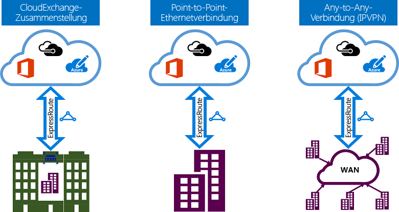

# ExpressRoute-Konnektivitätsmodelle
Sie können eine Verbindung zwischen Ihrem lokalen Netzwerk und der Microsoft-Cloud auf drei verschiedene Arten erstellen: [CloudExchange Zusammenstellung](#CloudExchange), [Point-to-Point-Ethernet-Verbindung](#Ethernet) und [Any-to-Any-Verbindung (IPVPN)](#IPVPN). Konnektivitätsanbieter können ein oder mehrere Konnektivitätsmodelle bereitstellen. Sie können zusammen mit Ihrem Konnektivitätsanbieter das Modell auswählen, das für Sie am besten geeignet ist.
  

## Über einen Cloud Exchange
Wenn Sie sich in einer Einrichtung mit einem Cloud Exchange befinden, können Sie virtuelle Querverbindungen zur Microsoft Cloud über den Ethernet Exchange des Co-Location-Anbieters bestellen. Co-Location-Anbieter stellen entweder Layer 2-Querverbindungen oder verwaltete Layer 3-Querverbindungen zwischen Ihrer Infrastruktur in der Co-Location-Einrichtung und der Microsoft Cloud bereit.

## Point-to-Point-Ethernet-Verbindungen
Sie können Ihre lokalen Rechenzentren/Büros über Point-to-Point-Ethernet-Links mit der Microsoft Cloud verbinden. Point-to-Point-Ethernet-Anbieter können Layer 2-Verbindungen oder verwaltete Layer 3-Verbindungen zwischen Ihrem Standort und der Microsoft Cloud bereitstellen.

## Any-to-Any-Netzwerke (IPVPN)
Sie können Ihr WAN in die Microsoft Cloud integrieren. IPVPN-Anbieter (normalerweise MPLS VPN) bieten Any-to-Any-Konnektivität zwischen Ihren Niederlassungen und den Rechenzentren an. Die Microsoft Cloud kann mit Ihrem WAN verbunden werden, um sie wie eine normale Niederlassung erscheinen zu lassen. WAN-Anbieter stellen in der Regel verwaltete Layer 3-Konnektivität bereit. ExpressRoute-Funktionen und -Features sind für alle oben genannten Konnektivitätsmodelle identisch. 

## Nächste Schritte
* Informieren Sie sich über ExpressRoute-Verbindungen und Routingdomänen. Siehe [ExpressRoute-Verbindungen und Routingdomänen](expressroute-circuit-peerings.md).
* Erfahren Sie mehr zu ExpressRoute-Funktionen. Siehe [ExpressRoute - Technische Übersicht](expressroute-introduction.md)
* Suchen Sie nach einem Service Provider. Siehe [ExpressRoute-Partner und Peeringstandorte](expressroute-locations.md).
* Stellen Sie sicher, dass alle Voraussetzungen erfüllt werden. Informationen finden Sie unter [ExpressRoute-Voraussetzungen](expressroute-prerequisites.md).
* Sehen Sie sich die Anforderungen für [Routing](expressroute-routing.md), [NAT](expressroute-nat.md) und [QoS](expressroute-qos.md) an.
* Konfigurieren Sie Ihre ExpressRoute-Verbindung.
  * [Erstellen einer ExpressRoute-Verbindung](expressroute-howto-circuit-portal-resource-manager.md)
  * [Konfigurieren des Routings](expressroute-howto-routing-portal-resource-manager.md)
  * [Verknüpfen eines VNet mit einer ExpressRoute-Verbindung](expressroute-howto-linkvnet-portal-resource-manager.md)

<!--HONumber=Feb17_HO2-->

