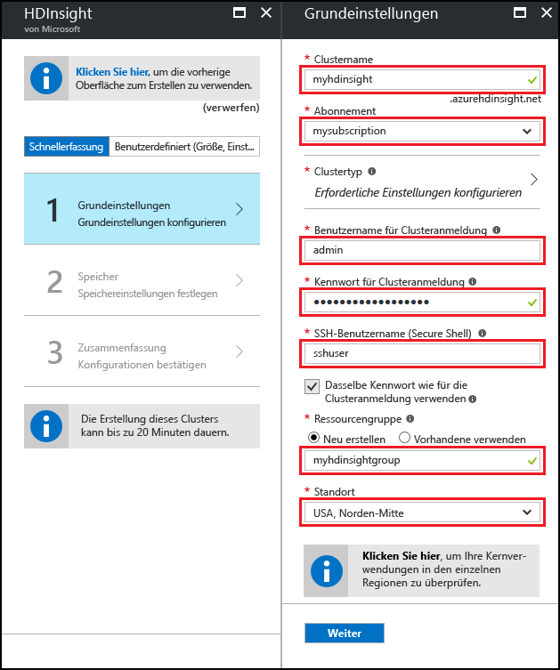
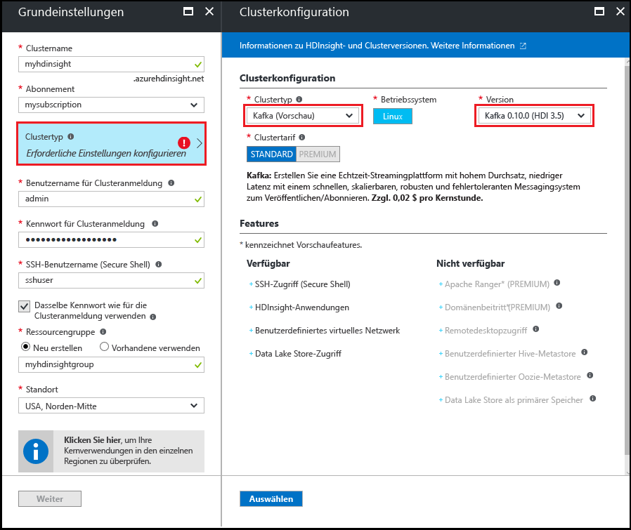
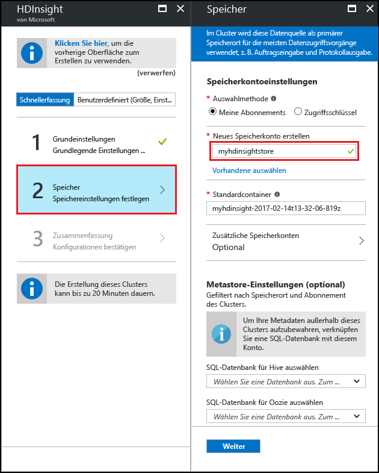
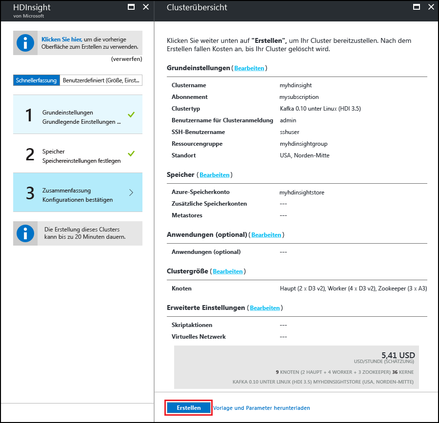

# <a name="start-with-apache-kafka-preview-on-hdinsight"></a>Erste Schritte mit Apache Kafka (Vorschau) in HDInsight

Erfahren Sie, wie Sie ein [Apache Kafka](https://kafka.apache.org)-Cluster in Azure HDInsight erstellen und verwenden. Kafka ist eine verteilte Open Source-Streamingplattform, die für HDInsight verfügbar ist. Diese wird häufig als Nachrichtenbroker eingesetzt, da sie eine ähnliche Funktionalität wie eine Veröffentlichen-Abonnieren-Nachrichtenwarteschlange aufweist.

> [!NOTE]
> Für HDInsight sind derzeit zwei Version von Kafka verfügbar: 0.9.0 (HDInsight 3.4) und 0.10.0 (HDInsight 3.5 und 3.6). Für die Schritte in diesem Dokument wird davon ausgegangen, dass Sie Kafka in HDInsight 3.6 verwenden.

[!INCLUDE [delete-cluster-warning](../../includes/hdinsight-delete-cluster-warning.md)]

## <a name="create-a-kafka-cluster"></a>Erstellen eines Kafka-Clusters

Verwenden Sie die folgenden Schritte, um ein Cluster vom Typ „Kafka in HDInsight“ zu erstellen:

1. Wählen Sie im [Azure-Portal](https://portal.azure.com) die Optionen **+ NEU**, **Intelligence + Analyse** und dann **HDInsight**.
   
    

2. Geben Sie unter **Grundlagen** Folgendes ein:

    * **Clustername**: Der Name des HDInsight-Clusters.
    * **Abonnement**: Wählen Sie das zu verwendende Abonnement aus.
    * **Benutzername für Clusteranmeldung** und **Kennwort für Clusteranmeldung**: Die Anmeldung beim Zugriff auf den Cluster über HTTPS. Sie verwenden diese Anmeldeinformationen für den Zugriff auf Dienste wie z.B. die Ambari-Webbenutzeroberfläche oder die REST-API.
    * **Secure Shell (SSH)-Benutzername**: Die für den Clusterzugriff über SSH verwendete Anmeldung. Das Kennwort ist standardmäßig mit dem Kennwort für die Clusteranmeldung identisch.
    * **Ressourcengruppe**: Die Ressourcengruppe, in der der Cluster erstellt wird.
    * **Standort**: Die Azure-Region, in der der Cluster erstellt werden soll.
   
 

3. Wählen Sie **Clustertyp** aus, und legen Sie dann unter **Clusterkonfiguration** die folgenden Werte fest:
   
    * **Clustertyp**: Kafka

    * **Version**: Kafka 0.10.0 (HDI 3.6)

    * **Clusterebene**: Standard
     
 Klicken Sie abschließend auf die Schaltfläche **Auswählen**, um die Einstellungen zu speichern.
     
 

4. Legen Sie nach dem Auswählen des Clustertyps mit der Schaltfläche __Auswählen__ den Clustertyp fest. Schließen Sie dann mit der Schaltfläche __Weiter__ die grundlegende Konfiguration ab.

5. Wählen Sie unter **Speicher** ein Speicherkonto aus, oder erstellen Sie eines. Behalten Sie für die Schritte in diesem Dokument für die weiteren Felder die Standardwerte bei. Speichern Sie mit der Schaltfläche __Weiter__ die Speicherkonfiguration.

    

6. Wählen Sie unter __Anwendungen (optional)__ zum Fortfahren __Weiter__ aus. Für dieses Beispiel sind keine Anwendungen erforderlich.

7. Wählen Sie unter __Clustergröße__ zum Fortfahren die Option __Weiter__ aus.

    > [!WARNING]
    > Um die Verfügbarkeit von Kafka in HDInsight zu gewährleisten, muss der Cluster mindestens drei Workerknoten enthalten.

    

    > [!NOTE]
    > Der Eintrag für **Datenträger pro Workerknoten** steuert die Skalierbarkeit von Kafka in HDInsight. Weitere Informationen finden Sie unter [Konfigurieren von Speicher und Skalierbarkeit von Kafka in HDInsight](hdinsight-apache-kafka-scalability.md).

8. Wählen Sie unter __Erweiterte Einstellungen__ die Option __Weiter__ aus, um fortzufahren.

9. Überprüfen Sie unter **Zusammenfassung** die Konfiguration für den Cluster. Ändern Sie ggf. falsche Einstellungen mithilfe der Link zum __Bearbeiten__. Verwenden Sie abschließend die Schaltfläche__Erstellen__, um den Cluster zu erstellen.
   
    
   
    > [!NOTE]
    > Das Erstellen des Clusters kann bis zu 20 Minuten dauern.

## <a name="connect-to-the-cluster"></a>Verbinden mit dem Cluster

> [!IMPORTANT]
> Für die folgenden Schritte muss ein SSH-Client verwendet werden. Weitere Informationen finden Sie im Dokument [Herstellen einer Verbindung mit HDInsight (Hadoop) per SSH](hdinsight-hadoop-linux-use-ssh-unix.md).

Verwenden Sie SSH auf Ihrem Client, um eine Verbindung mit dem Cluster herzustellen:

```ssh SSHUSER@CLUSTERNAME-ssh.azurehdinsight.net```

Ersetzen Sie **SSHUSER** durch den SSH-Benutzernamen, den Sie während der Clustererstellung angegeben haben. Ersetzen Sie **CLUSTERNAME** durch den Namen des Clusters.

Geben Sie bei Aufforderung das Kennwort ein, das Sie für das SSH-Konto verwendet haben.

Informationen hierzu finden Sie unter [Verwenden von SSH mit Linux-basiertem Hadoop in HDInsight unter Linux, Unix oder OS X](hdinsight-hadoop-linux-use-ssh-unix.md).

## <a id="getkafkainfo"></a>Beschaffen der Zookeeper- und Broker-Hostinformationen

Bei Verwendung von Kafka müssen Sie zwei Hostwerte kennen: die *Zookeeper*-Hosts und die *Broker*-Hosts. Diese Hosts werden zusammen mit der Kafka-API und vielen Hilfsprogrammen verwendet, die in Kafka enthalten sind.

Verwenden Sie die folgenden Schritte, um Umgebungsvariablen zu erstellen, die die Hostinformationen enthalten. Diese Umgebungsvariablen werden in den Schritten in diesem Dokument genutzt.

1. Verwenden Sie für eine SSH-Verbindung mit dem Cluster den folgenden Befehl, um das Hilfsprogramm `jq` zu installieren. Dieses Hilfsprogramm wird verwendet, um JSON-Dokumente zu analysieren, und es ist beim Beschaffen der Broker-Hostinformationen hilfreich:
   
    ```bash
    sudo apt -y install jq
    ```

2. Verwenden Sie die folgenden Befehle, um die Umgebungsvariablen mit den von Ambari abgerufenen Informationen festzulegen:

    ```bash
    CLUSTERNAME='your cluster name'
    PASSWORD='your cluster password'
    export KAFKAZKHOSTS=`curl -sS -u admin:$PASSWORD -G https://$CLUSTERNAME.azurehdinsight.net/api/v1/clusters/$CLUSTERNAME/services/ZOOKEEPER/components/ZOOKEEPER_SERVER | jq -r '["\(.host_components[].HostRoles.host_name):2181"] | join(",")' | cut -d',' -f1,2`

    export KAFKABROKERS=`curl -sS -u admin:$PASSWORD -G https://$CLUSTERNAME.azurehdinsight.net/api/v1/clusters/$CLUSTERNAME/services/KAFKA/components/KAFKA_BROKER | jq -r '["\(.host_components[].HostRoles.host_name):9092"] | join(",")' | cut -d',' -f1,2`

    echo '$KAFKAZKHOSTS='$KAFKAZKHOSTS
    echo '$KAFKABROKERS='$KAFKABROKERS
    ```

    > [!IMPORTANT]
    > Legen Sie `CLUSTERNAME=` auf den Namen des Kafka-Clusters fest. Legen Sie `PASSWORD=` auf das Anmeldekennwort (Administrator) fest, das Sie beim Erstellen des Clusters verwendet haben.

    Der folgende Text ist ein Beispiel für den Inhalt von `$KAFKAZKHOSTS`:
   
    `zk0-kafka.eahjefxxp1netdbyklgqj5y1ud.ex.internal.cloudapp.net:2181,zk2-kafka.eahjefxxp1netdbyklgqj5y1ud.ex.internal.cloudapp.net:2181`
   
    Der folgende Text ist ein Beispiel für den Inhalt von `$KAFKABROKERS`:
   
    `wn1-kafka.eahjefxxp1netdbyklgqj5y1ud.cx.internal.cloudapp.net:9092,wn0-kafka.eahjefxxp1netdbyklgqj5y1ud.cx.internal.cloudapp.net:9092`

    > [!NOTE]
    > Der `cut`-Befehl wird verwendet, um die Liste der Hosts auf zwei Hosteinträge zu kürzen. Sie müssen nicht die vollständige Liste der Hosts angeben, wenn Sie einen Kafka-Consumer oder -Producer erstellen.
   
    > [!WARNING]
    > Verlassen Sie sich bei den Informationen, die bei dieser Sitzung zurückgegeben werden, nicht ohne Prüfung darauf, dass sie immer korrekt sind. Wenn Sie den Cluster skalieren, werden neue Broker hinzugefügt oder entfernt. Wenn ein Fehler auftritt und ein Knoten ersetzt wird, kann sich der Hostname für den Knoten ändern.
    >
    > Sie sollten die Zookeeper- und Broker-Hostinformationen kurz vor ihrer Nutzung abrufen, um sicherzustellen, dass Sie über gültige Informationen verfügen.

## <a name="create-a-topic"></a>Erstellen eines Themas

Kafka speichert Datenströme in Kategorien, die als *Themen* bezeichnet werden. Verwenden Sie für eine SSH-Verbindung mit einem Clusterhauptknoten ein in Kafka enthaltenes Skript, um ein Thema zu erstellen:

```bash
/usr/hdp/current/kafka-broker/bin/kafka-topics.sh --create --replication-factor 3 --partitions 8 --topic test --zookeeper $KAFKAZKHOSTS
```

Mit diesem Befehl wird eine Verbindung mit Zookeeper hergestellt, indem die in `$KAFKAZKHOSTS` gespeicherten Informationen verwendet werden. Anschließend wird ein Kafka-Thema mit dem Namen **test** erstellt. Sie können überprüfen, ob das Thema erstellt wurde, indem Sie das folgende Skript zum Auflisten von Themen verwenden:

```bash
/usr/hdp/current/kafka-broker/bin/kafka-topics.sh --list --zookeeper $KAFKAZKHOSTS
```

In der Ausgabe dieses Befehls werden die Kafka-Themen aufgelistet, und das Thema **test** sollte in der Liste enthalten sein.

## <a name="produce-and-consume-records"></a>Erstellen und Nutzen von Datensätzen

Bei Kafka werden *Datensätze* in Themen gespeichert. Datensätze werden von *Producern* erstellt und von *Consumern* genutzt. Producer rufen Datensätze von Kafka-*Brokern* ab. Jeder Workerknoten in Ihrem HDInsight-Cluster ist ein Kafka-Broker.

Mit den folgenden Schritten können Sie Datensätze im zuvor erstellten Testthema speichern und dann mit einem Consumer lesen:

1. Verwenden Sie in der SSH-Sitzung ein in Kafka enthaltenes Skript, um Datensätze in das Thema zu schreiben:
   
    ```bash
    /usr/hdp/current/kafka-broker/bin/kafka-console-producer.sh --broker-list $KAFKABROKERS --topic test
    ```
   
    Nach diesem Befehl gelangen Sie nicht zur Eingabeaufforderung zurück. Geben Sie stattdessen einige Textnachrichten ein, und drücken Sie **STRG+C**, um das Senden an das Thema zu beenden. Jede Zeile wird als separater Datensatz gesendet.

2. Verwenden Sie ein in Kafka enthaltenes Skript, um Datensätze aus dem Thema zu lesen:
   
    ```bash
    /usr/hdp/current/kafka-broker/bin/kafka-console-consumer.sh --bootstrap-server $KAFKABROKERS --topic test --from-beginning
    ```
   
    Die Datensätze werden mit dem Befehl aus dem Thema abgerufen und angezeigt. Mit `--from-beginning` wird der Consumer angewiesen, am Anfang des Datenstroms zu beginnen, damit alle Datensätze abgerufen werden.

3. Drücken Sie __STRG+C__, um den Consumer zu beenden.

## <a name="producer-and-consumer-api"></a>Producer- und Consumer-API

Sie können Datensätze mit den [Kafka-APIs](http://kafka.apache.org/documentation#api) auch programmgesteuert erstellen und verwenden. Wenn Sie einen Java-Producer oder -Consumer erstellen möchten, führen Sie in Ihrer Umgebungsentwicklung die folgenden Schritte aus.

> [!IMPORTANT]
> Die folgenden Komponenten müssen in der Entwicklungsumgebung installiert sein:
>
> * [Java JDK 8](http://www.oracle.com/technetwork/java/javase/downloads/index.html) oder ein gleichwertiges Kit, z.B. OpenJDK.
>
> * [Apache Maven](http://maven.apache.org/)
>
> * Ein SSH-Client und der Befehl `scp`. Weitere Informationen finden Sie im Dokument [Herstellen einer Verbindung mit HDInsight (Hadoop) per SSH](hdinsight-hadoop-linux-use-ssh-unix.md).

1. Laden Sie die Beispiele unter [https://github.com/Azure-Samples/hdinsight-kafka-java-get-started](https://github.com/Azure-Samples/hdinsight-kafka-java-get-started) herunter. Verwenden Sie für das Producer/Consumer-Beispiel das Projekt im Verzeichnis `Producer-Consumer`. Dieses Beispiel enthält die folgenden Klassen:
   
    * **Run**: Startet entweder den Consumer oder den Producer.

    * **Producer**: Speichert 1.000.000 Datensätze im Thema.

    * **Consumer**: Liest Datensätze aus dem Thema aus.

2. Wechseln Sie zum Verzeichnis `Producer-Consumer`, und erstellen Sie dann mit dem folgenden Befehl ein JAR-Paket:

    ```
    mvn clean package
    ```

    Mit diesem Befehl wird ein Verzeichnis mit dem Namen `target` erstellt, das eine Datei namens `kafka-producer-consumer-1.0-SNAPSHOT.jar` enthält.

3. Verwenden Sie die folgenden Befehle, um die Datei `kafka-producer-consumer-1.0-SNAPSHOT.jar` in Ihren HDInsight-Cluster zu kopieren:
   
    ```bash
    scp ./target/kafka-producer-consumer-1.0-SNAPSHOT.jar SSHUSER@CLUSTERNAME-ssh.azurehdinsight.net:kafka-producer-consumer.jar
    ```
   
    Ersetzen Sie **SSHUSER** durch den SSH-Benutzer für Ihren Cluster, und ersetzen Sie **CLUSTERNAME** durch den Namen Ihres Clusters. Geben Sie nach Aufforderung das Kennwort für den SSH-Benutzer ein.

4. Sobald der Befehl `scp` das Kopieren der Datei abgeschlossen hat, stellen Sie die Verbindung mit dem Cluster mithilfe von SSH her. Verwenden Sie den folgenden Befehl zum Schreiben von Datensätzen in das Testthema:

    ```bash
    java -jar kafka-producer-consumer.jar producer $KAFKABROKERS
    ```

5. Verwenden Sie nach Abschluss des Vorgangs den folgenden Befehl, um Daten aus dem Thema auszulesen:
   
    ```bash
    java -jar kafka-producer-consumer.jar consumer $KAFKABROKERS
    ```
   
    Die gelesenen Datensätze und die Anzahl von Datensätzen wird angezeigt. Die Anzahl von protokollierten Datensätzen kann den Wert von 1.000.000 übersteigen, da Sie mit einem Skript aus einem der vorherigen Schritte mehrere Datensätze an das Thema gesendet haben.

6. Drücken Sie __STRG+C__, um den Consumer zu beenden.

### <a name="multiple-consumers"></a>Mehrere Consumer

Kafka-Consumer verwenden beim Lesen von Datensätzen eine Consumergruppe. Das Verwenden derselben Gruppe mit mehreren Consumern führt zu Lesevorgängen mit Lastenausgleich aus einem Thema. Jeder Consumer in der Gruppe erhält einen Teil der Datensätze. Führen Sie die folgenden Schritte aus, um diesen Vorgang in Aktion zu sehen:

1. Öffnen Sie eine neue SSH-Sitzung für den Cluster, damit Sie über zwei Sitzungen verfügen. Verwenden Sie in jeder Sitzung Folgendes, um einen Consumer mit derselben Consumergruppen-ID zu starten:
   
    ```bash
    java -jar kafka-producer-consumer.jar consumer $KAFKABROKERS mygroup
    ```

    Dieser Befehl startet einen Consumer mithilfe der Gruppen-ID `mygroup`.

    > [!NOTE]
    > Verwenden Sie die Befehle im Abschnitt [Beschaffen der Zookeeper- und Broker-Hostinformationen](#getkafkainfo), um `$KAFKABROKERS` für die SSH-Sitzung festzulegen.

2. Verfolgen Sie, wie in jeder Sitzung die Datensätze gezählt werden, die aus dem Thema empfangen werden. Die Summe aus den beiden Sitzungen sollte der Anzahl entsprechen, die Sie zuvor von einem Consumer erhalten haben.

Der Verbrauch durch die Clients in derselben Gruppe wird über die Partitionen für das Thema gesteuert. Für das zuvor erstellte Thema `test` sind acht Partitionen vorhanden. Wenn Sie acht SSH-Sitzungen öffnen und einen Consumer in allen Sitzungen starten, liest jeder Consumer Datensätze aus einer einzelnen Partition für das Thema aus.

> [!IMPORTANT]
> Eine Consumergruppe kann nicht mehr Consumerinstanzen als Partitionen enthalten. In diesem Beispiel kann eine Consumergruppe bis zu acht Consumer enthalten, da dies die Anzahl von Partitionen im Thema ist. Sie können auch mehrere Consumergruppen verwenden, die jeweils nicht mehr als acht Consumer enthalten.

Datensätze werden in Kafka in der Reihenfolge gespeichert, in der sie in einer Partition empfangen werden. Erstellen Sie eine Consumergruppe, bei der die Anzahl von Consumerinstanzen mit der Anzahl von Partitionen übereinstimmt, um für Datensätze *in einer Partition* eine geordnete Bereitstellung zu erzielen. Erstellen Sie eine Consumergruppe mit nur einer Consumerinstanz, um für Datensätze *im Thema* eine geordnete Bereitstellung zu erzielen.

## <a name="streaming-api"></a>Streaming-API

Die Streaming-API wurde Kafka in Version 0.10.0 hinzugefügt. In früheren Versionen wurde für die Datenstromverarbeitung Apache Spark oder Storm verwendet.

1. Laden Sie die Beispiele unter [https://github.com/Azure-Samples/hdinsight-kafka-java-get-started](https://github.com/Azure-Samples/hdinsight-kafka-java-get-started) in Ihre Bereitstellungsumgebung herunter, falls Sie dies noch nicht getan haben. Verwenden Sie für das Streamingbeispiel das Projekt im Verzeichnis `streaming`.
   
    Dieses Projekt enthält nur eine Klasse (`Stream`), mit der Datensätze aus dem zuvor erstellten Thema `test` gelesen werden. Es werden die gelesenen Wörter gezählt, und alle Wörter und die Anzahl werden in ein Thema mit dem Namen `wordcounts` ausgegeben. Das Thema `wordcounts` wird in einem Schritt weiter unten in diesem Abschnitt erstellt.

2. Wechseln Sie über die Befehlszeile in Ihrer Entwicklungsumgebung zum Speicherort des Verzeichnisses `Streaming`, und erstellen Sie dann mit dem folgenden Befehl ein JAR-Paket:

    ```bash
    mvn clean package
    ```

    Mit diesem Befehl wird ein Verzeichnis mit dem Namen `target` erstellt, das eine Datei namens `kafka-streaming-1.0-SNAPSHOT.jar` enthält.

3. Verwenden Sie die folgenden Befehle, um die Datei `kafka-streaming-1.0-SNAPSHOT.jar` in Ihren HDInsight-Cluster zu kopieren:
   
    ```bash
    scp ./target/kafka-streaming-1.0-SNAPSHOT.jar SSHUSER@CLUSTERNAME-ssh.azurehdinsight.net:kafka-streaming.jar
    ```
   
    Ersetzen Sie **SSHUSER** durch den SSH-Benutzer für Ihren Cluster, und ersetzen Sie **CLUSTERNAME** durch den Namen Ihres Clusters. Geben Sie nach Aufforderung das Kennwort für den SSH-Benutzer ein.

4. Nachdem das Kopieren der Datei mit dem Befehl `scp` abgeschlossen wurde, können Sie per SSH eine Verbindung mit dem Cluster herstellen. Verwenden Sie dann folgenden Befehl, um das Thema `wordcounts` zu erstellen:

    ```bash
    /usr/hdp/current/kafka-broker/bin/kafka-topics.sh --create --replication-factor 3 --partitions 8 --topic wordcounts --zookeeper $KAFKAZKHOSTS
    ```

5. Starten Sie als Nächstes den Streamingprozess mit dem folgenden Befehl:
   
    ```bash
    java -jar kafka-streaming.jar $KAFKABROKERS $KAFKAZKHOSTS 2>/dev/null &
    ```
   
    Mit diesem Befehl wird der Streamingprozess im Hintergrund gestartet.

6. Verwenden Sie folgenden Befehl, um Nachrichten an das Thema `test` zu senden. Diese Nachrichten werden im Streamingbeispiel verarbeitet:
   
    ```bash
    java -jar kafka-producer-consumer.jar producer $KAFKABROKERS &>/dev/null &
    ```

7. Verwenden Sie folgenden Befehl, um die Ausgabe anzuzeigen, die vom Streamingprozess in das Thema `wordcounts` geschrieben wird:
   
    ```bash
    /usr/hdp/current/kafka-broker/bin/kafka-console-consumer.sh --bootstrap-server $KAFKABROKERS --topic wordcounts --from-beginning --formatter kafka.tools.DefaultMessageFormatter --property print.key=true --property key.deserializer=org.apache.kafka.common.serialization.StringDeserializer --property value.deserializer=org.apache.kafka.common.serialization.LongDeserializer
    ```
   
    > [!NOTE]
    > Zum Anzeigen der Daten müssen Sie den Consumer anweisen, den Schlüssel und das Deserialisierungsprogramm anzugeben, die für den Schlüssel und den Wert verwendet werden sollen. Der Schlüsselname ist das Wort, und der Schlüsselwert enthält die Anzahl.
   
    Die Ausgabe sieht in etwa wie folgender Text aus:
   
        dwarfs  13635
        ago     13664
        snow    13636
        dwarfs  13636
        ago     13665
        a       13803
        ago     13666
        a       13804
        ago     13667
        ago     13668
        jumped  13640
        jumped  13641
        a       13805
        snow    13637
   
    > [!NOTE]
    > Die Anzahl wird jedes Mal erhöht, wenn ein Wort eingeht.

7. Verwenden Sie die Tastenkombination __STRG+C__, um den Consumer zu beenden, und anschließend den Befehl `fg`, um die Streaming-Hintergrundaufgabe wieder in der Vordergrund zu verlagern. Verwenden Sie zum Beenden auch hier wieder __STRG+C__.

## <a name="delete-the-cluster"></a>Löschen des Clusters

[!INCLUDE [delete-cluster-warning](../../includes/hdinsight-delete-cluster-warning.md)]

## <a name="troubleshoot"></a>Problembehandlung

Falls beim Erstellen von HDInsight-Clustern Probleme auftreten, sehen Sie sich die [Voraussetzungen für die Zugriffssteuerung](hdinsight-administer-use-portal-linux.md#create-clusters) an.

## <a name="next-steps"></a>Nächste Schritte

In diesem Dokument wurden die Grundlagen der Arbeit mit Apache Kafka in HDInsight beschrieben. Verwenden Sie Folgendes, um weitere Informationen zur Verwendung von Kafka zu erhalten:

* [Ensure high availability of your data with Kafka on HDInsight](hdinsight-apache-kafka-high-availability.md) (Sicherstellen der hohen Verfügbarkeit von Daten mit Kafka in HDInsight)
* [Erhöhen der Skalierbarkeit durch Konfigurieren von verwalteten Datenträgern mit Kafka in HDInsight](hdinsight-apache-kafka-scalability.md)
* [Apache Kafka-Dokumentation](http://kafka.apache.org/documentation.html) unter „kafka.apache.org“.
* [Verwenden von MirrorMaker zum Erstellen eines Replikats von Kafka in HDInsight](hdinsight-apache-kafka-mirroring.md)
* [Verwenden von Apache Storm mit Kafka in HDInsight](hdinsight-apache-storm-with-kafka.md)
* [Verwenden von Apache Spark mit Kafka in HDInsight](hdinsight-apache-spark-with-kafka.md)
* [Herstellen einer Verbindung mit Kafka über eine Azure Virtual Network-Instanz](hdinsight-apache-kafka-connect-vpn-gateway.md)

