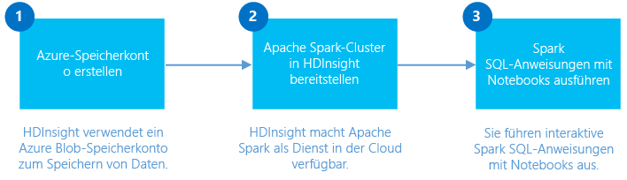
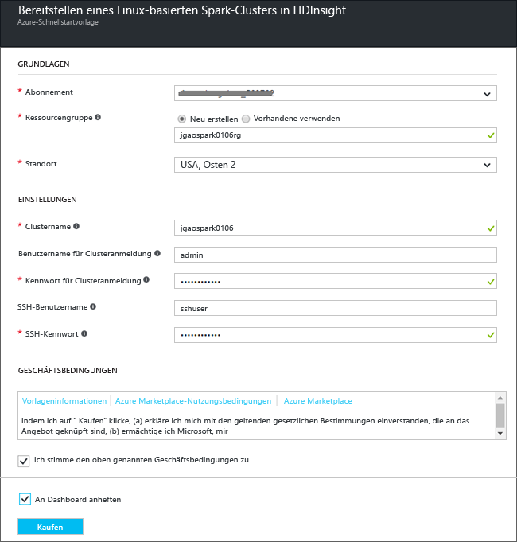
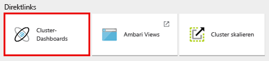

# Erste Schritte: Erstellen eines Apache Spark-Clusters für Azure HDInsight und Ausführen von interaktiven Abfragen per Spark-SQL

Hier erfahren Sie, wie Sie einen [Apache Spark](hdinsight-apache-spark-overview.md)-Cluster in HDInsight erstellen und dann ein [Jupyter](https://jupyter.org) Notebook verwenden, um interaktive Spark-SQL-Abfragen für den Spark-Cluster auszuführen.

   

[!INCLUDE [delete-cluster-warning](../../includes/hdinsight-delete-cluster-warning.md)]

## Voraussetzungen
* **Ein Azure-Abonnement**. Für dieses Tutorial wird ein Azure-Abonnement benötigt. Weitere Informationen finden Sie unter [Erstellen Sie noch heute Ihr kostenloses Azure-Konto](https://azure.microsoft.com/free).

* **Ein Secure Shell-Client (SSH)**: Linux-, Unix und OS X-Systeme stellen einen SSH-Client über den Befehl `ssh` bereit. Informationen für Windows-Clients finden Sie unter [Verwenden von SSH mit HDInsight (Hadoop) aus PuTTY unter Windows](hdinsight-hadoop-linux-use-ssh-windows.md), und für Linux, Unix oder OS X unter [Verwenden von SSH mit HDInsight (Hadoop) unter Windows, Linux, Unix oder OS X](hdinsight-hadoop-linux-use-ssh-unix.md).

> [!NOTE]
> In diesem Artikel wird mithilfe einer Azure Resource Manager-Vorlage ein Spark-Cluster erstellt, der [Azure Storage-Blobs als Clusterspeicher](hdinsight-hadoop-use-blob-storage.md) verwendet. Sie können auch einen Spark-Cluster erstellen, der neben Azure Storage-Blobs als Standardspeicher [Azure Data Lake-Speicher](../data-lake-store/data-lake-store-overview.md) als zusätzlichen Speicher verwendet. Anweisungen hierzu finden Sie unter [Erstellen eines HDInsight-Clusters mit Data Lake-Speicher](../data-lake-store/data-lake-store-hdinsight-hadoop-use-portal.md).
>
>

### Voraussetzungen für die Zugriffssteuerung
[!INCLUDE [access-control](../../includes/hdinsight-access-control-requirements.md)]

## Erstellen von Spark-Clustern
In diesem Abschnitt erstellen Sie einen Spark-Cluster in HDInsight mit einer [Azure Resource Manager-Vorlage](https://azure.microsoft.com/resources/templates/101-hdinsight-spark-linux/). Informationen zu den verschiedenen HDInsight-Versionen und ihren SLAs finden Sie unter [HDInsight-Komponentenversionen](hdinsight-component-versioning.md). Andere Methoden zur Erstellung von Clustern finden Sie unter [Erstellen von Linux-basierten Hadoop-Clustern in HDInsight](hdinsight-hadoop-provision-linux-clusters.md).

1. Klicken Sie auf die folgende Abbildung, um die Vorlage im Azure-Portal zu öffnen:         

    

2. Geben Sie die folgenden Werte ein:

    

   * **Abonnement**: Wählen Sie Ihr Azure-Abonnement für diesen Cluster aus.
   * **Ressourcengruppe**: Erstellen Sie eine neue Ressourcengruppe, oder wählen Sie eine vorhandene aus. Die Ressourcengruppe wird verwendet, um Azure-Ressourcen für Ihre Projekte zu verwalten.
   * **Standort**: Wählen Sie einen Standort für die Ressourcengruppe aus.  Dieser Standort wird auch für den Standardspeicher des Clusters und den HDInsight-Cluster verwendet.
   * **Clustername**: Geben Sie einen Namen für den Hadoop-Cluster ein, den Sie erstellen möchten.
   * **Cluster-Benutzername und -Kennwort**: Der Standardname für die Anmeldung lautet „admin“.
   * **SSH-Benutzername und -Kennwort**.

   Bitte notieren Sie diese Werte.  Sie werden diese später im Lernprogramm benötigen.

3. Aktivieren Sie die Optionen **Ich stimme den oben genannten Geschäftsbedingungen zu** und **An Dashboard anheften**, und klicken Sie anschließend auf **Kaufen**. Daraufhin wird eine neue Kachel mit der Bezeichnung „Bereitstellung für Vorlagenbereitstellung wird gesendet“ angezeigt. Das Erstellen des Clusters dauert ca. 20 Minuten.

## Ausführen von Spark-SQL-Abfragen mit einem Jupyter Notebook
In diesem Abschnitt verwenden Sie Jupyter Notebook, um Spark-SQL-Abfragen für einen Spark-Cluster auszuführen. HDInsight Spark-Cluster bieten zwei Kernel, die Sie für Jupyter Notebook verwenden können. Diese sind wie folgt:

* **PySpark** (für in Python geschriebene Anwendungen)
* **Spark** (für in Scala geschriebene Anwendungen)

In diesem Artikel verwenden Sie den PySpark-Kernel. Weitere Informationen zu den beiden Kernels finden Sie unter [Verfügbare Kernels für Jupyter Notebooks mit Apache Spark-Clustern unter HDInsight (Linux)](hdinsight-apache-spark-jupyter-notebook-kernels.md). Zentrale Vorteile des PySpark-Kernels:

* Die Kontexte für Spark und Hive werden automatisch festgelegt.
* Mithilfe von Zellen-Magics wie `%%sql` können Sie SQL- und Hive-Abfragen direkt (also ohne vorherige Codeausschnitte) ausführen.
* Die Ausgabe für die SQL- oder Hive-Abfragen wird automatisch angezeigt.

### Erstellen von Jupyter Notebook mit PySpark-Kernel

1. Öffnen Sie das [Azure-Portal](https://portal.azure.com/).
2. Klicken Sie im Menü auf der linken Seite auf **Ressourcengruppen**.
3. Klicken Sie auf die Ressourcengruppe, die Sie im vorherigen Abschnitt erstellt haben. Sie können die Suchfunktion verwenden, falls zu viele Ressourcengruppen angezeigt werden. In der Gruppe werden zwei Ressourcen angezeigt: der HDInsight-Cluster und das Standardspeicherkonto.
4. Klicken Sie auf den Cluster, um ihn zu öffnen.

2. Klicken Sie unter **Quicklinks** auf **Clusterdashboards** und dann auf **Jupyter Notebook**. Geben Sie die Administratoranmeldeinformationen für den Cluster ein, wenn Sie dazu aufgefordert werden.

   

   > [!NOTE]
   > Sie können auch das Jupyter Notebook für Ihren Cluster aufrufen, indem Sie in Ihrem Browser die folgende URL öffnen. Ersetzen Sie **CLUSTERNAME** durch den Namen Ihres Clusters:
   >
   > `https://CLUSTERNAME.azurehdinsight.net/jupyter`
   >
   >
3. Erstellen Sie ein neues Notebook. Klicken Sie auf **Neu** und dann auf **PySpark**.

   

   Ein neues Notebook mit dem Namen „Untitled“ (Untitled.pynb) wird erstellt und geöffnet.

4. Klicken Sie oben auf den Namen des Notebooks, und geben Sie bei Bedarf einen Anzeigenamen ein.

    
5. Fügen Sie den folgenden Code in eine leere Zelle ein, und drücken Sie **UMSCHALT+EINGABETASTE**, um den Code auszuführen. Mit dem Code werden die Typen importiert, die für dieses Szenario benötigt werden:

        from pyspark.sql.types import *

    Da Sie ein Notebook mit dem PySpark-Kernel erstellt haben, müssen Sie keine Kontexte explizit erstellen. Die Spark-, und Hive-Kontexte werden automatisch für Sie erstellt, wenn Sie die erste Codezelle ausführen.

    

    Bei jedem Ausführen eines Auftrags in Jupyter wird in der Titelleiste Ihres Webbrowserfensters neben dem Notebooktitel der Status **(Beschäftigt)** angezeigt. Außerdem sehen Sie in der rechten oberen Ecke einen ausgefüllten Kreis neben dem Text **PySpark** . Wenn der Auftrag abgeschlossen ist, wird ein Kreis ohne Füllung angezeigt.

6. Führen Sie den folgenden Code aus, um einige Beispieldaten in einer temporären Tabelle mit dem Namen **hvac** zu registrieren.

        # Load the data
        hvacText = sc.textFile("wasbs:///HdiSamples/HdiSamples/SensorSampleData/hvac/HVAC.csv")
        
        # Create the schema
        hvacSchema = StructType([StructField("date", StringType(), False),StructField("time", StringType(), False),StructField("targettemp", IntegerType(), False),StructField("actualtemp", IntegerType(), False),StructField("buildingID", StringType(), False)])
        
        # Parse the data in hvacText
        hvac = hvacText.map(lambda s: s.split(",")).filter(lambda s: s[0] != "Date").map(lambda s:(str(s[0]), str(s[1]), int(s[2]), int(s[3]), str(s[6]) ))
        
        # Create a data frame
        hvacdf = sqlContext.createDataFrame(hvac,hvacSchema)
        
        # Register the data fram as a table to run queries against
        hvacdf.registerTempTable("hvac")

    Spark-Cluster in HDInsight verfügen über die Beispieldatendatei **hvac.csv** unter **\HdiSamples\HdiSamples\SensorSampleData\hvac**.

7. Führen Sie den folgenden Code aus, um die Daten abzufragen:

        %%sql
        SELECT buildingID, (targettemp - actualtemp) AS temp_diff, date FROM hvac WHERE date = \"6/1/13\"

   Da Sie einen PySpark-Kernel verwenden, können Sie jetzt direkt eine SQL-Abfrage für die temporäre Tabelle **hvac** ausführen, die Sie gerade mit der Magic `%%sql` erstellt haben. Weitere Informationen zur `%%sql` -Magic sowie anderen für den PySpark-Kernel verfügbaren Magics finden Sie unter [Verfügbare Kernels für Jupyter Notebooks mit Spark-Clustern unter HDInsight](hdinsight-apache-spark-jupyter-notebook-kernels.md#choose-between-the-kernels).

   Die folgende Ausgabe in Tabellenform wird standardmäßig angezeigt.

     

    Sie können die Ergebnisse auch in anderen Visualisierungen anzeigen. Beispielsweise würde ein Bereichsdiagramm für dieselbe Ausgabe wie folgt aussehen.

    

9. Nach dem Ausführen der Anwendung können Sie das Notebook herunterfahren, um die Ressourcen freizugeben. Klicken Sie hierzu im Menü **Datei** des Notebooks auf die Option zum **Schließen und Anhalten**. Dadurch wird das Notebook heruntergefahren und geschlossen.

## Löschen des Clusters
[!INCLUDE [delete-cluster-warning](../../includes/hdinsight-delete-cluster-warning.md)]

## Siehe auch
* [Übersicht: Apache Spark in Azure HDInsight](hdinsight-apache-spark-overview.md)

### Szenarios
* [Spark mit BI: Durchführen interaktiver Datenanalysen mithilfe von Spark in HDInsight mit BI-Tools](hdinsight-apache-spark-use-bi-tools.md)
* [Spark mit Machine Learning: Analysieren von Gebäudetemperaturen mithilfe von Spark in HDInsight und HVAC-Daten](hdinsight-apache-spark-ipython-notebook-machine-learning.md)
* [Spark mit Machine Learning: Vorhersage von Lebensmittelkontrollergebnissen mithilfe von Spark in HDInsight](hdinsight-apache-spark-machine-learning-mllib-ipython.md)
* [Spark-Streaming: Erstellen von Echtzeitstreaminganwendungen mithilfe von Spark in HDInsight](hdinsight-apache-spark-eventhub-streaming.md)
* [Websiteprotokollanalyse mithilfe von Spark in HDInsight](hdinsight-apache-spark-custom-library-website-log-analysis.md)
* [Application Insight telemetry data analysis using Spark in HDInsight (Application Insight-Telemetriedatenanalyse mithilfe von Spark in HDInsight)](hdinsight-spark-analyze-application-insight-logs.md)

### Erstellen und Ausführen von Anwendungen
* [Erstellen einer eigenständigen Anwendung mit Scala](hdinsight-apache-spark-create-standalone-application.md)
* [Remoteausführung von Aufträgen in einem Spark-Cluster mithilfe von Livy](hdinsight-apache-spark-livy-rest-interface.md)

### Tools und Erweiterungen
* [Verwenden des HDInsight-Tools-Plug-Ins für IntelliJ IDEA zum Erstellen und Übermitteln von Spark Scala-Anwendungen](hdinsight-apache-spark-intellij-tool-plugin.md)
* [Use HDInsight Tools Plugin for IntelliJ IDEA to debug Spark applications remotely (Verwenden von HDInsight-Tools-Plug-Ins für IntelliJ IDEA zum Remotedebuggen von Spark-Anwendungen)](hdinsight-apache-spark-intellij-tool-plugin-debug-jobs-remotely.md)
* [Verwenden von Zeppelin-Notebooks mit einem Spark-Cluster in HDInsight](hdinsight-apache-spark-use-zeppelin-notebook.md)
* [Verfügbare Kernels für Jupyter-Notebook im Spark-Cluster für HDInsight](hdinsight-apache-spark-jupyter-notebook-kernels.md)
* [Verwenden von externen Paketen mit Jupyter Notebooks](hdinsight-apache-spark-jupyter-notebook-use-external-packages.md)
* [Installieren von Jupyter Notebook auf Ihrem Computer und Herstellen einer Verbindung zum Apache Spark-Cluster in Azure HDInsight (Vorschau)](hdinsight-apache-spark-jupyter-notebook-install-locally.md)

### Verwalten von Ressourcen
* [Verwalten von Ressourcen für den Apache Spark-Cluster in Azure HDInsight](hdinsight-apache-spark-resource-manager.md)
* [Track and debug jobs running on an Apache Spark cluster in HDInsight(Nachverfolgen und Debuggen von Aufträgen in einem Apache Spark-Cluster unter HDInsight)](hdinsight-apache-spark-job-debugging.md)

[hdinsight-versions]: hdinsight-component-versioning.md
[hdinsight-upload-data]: hdinsight-upload-data.md
[hdinsight-storage]: hdinsight-hadoop-use-blob-storage.md

[azure-purchase-options]: http://azure.microsoft.com/pricing/purchase-options/
[azure-member-offers]: http://azure.microsoft.com/pricing/member-offers/
[azure-free-trial]: http://azure.microsoft.com/pricing/free-trial/
[azure-management-portal]: https://manage.windowsazure.com/
[azure-create-storageaccount]: storage-create-storage-account.md

<!--HONumber=Feb17_HO1-->

