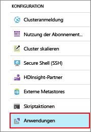
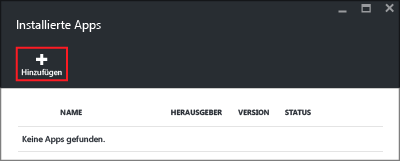
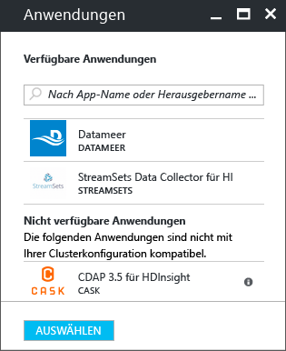
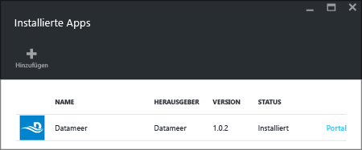

# Installieren von Hadoop-Anwendungen von Drittanbietern in Azure HDInsight

In diesem Artikel wird beschrieben, wie Sie eine bereits veröffentlichte Hadoop-Anwendung eines Drittanbieters in Azure HDInsight installieren. Eine Anleitung zur Installation Ihrer eigenen Anwendung finden Sie unter [Installieren benutzerdefinierter HDInsight-Anwendungen](hdinsight-apps-install-custom-applications.md).

Eine HDInsight-Anwendung kann von Benutzern in einem Linux-basierten HDInsight-Cluster installiert werden. Diese Anwendungen können von Microsoft oder von unabhängigen Softwareanbietern (Independent Software Vendors, ISVs) bezogen oder aber selbst entwickelt werden.  

Derzeit stehen vier veröffentlichte Anwendungen zur Verfügung:

* **DATAIKU DDS unter HDInsight**: Dataiku DSS (Data Science Studio) ist eine Software, mit der Datenexperten (Datenanalysten, Unternehmensanalysten, Entwickler...) Prototypen für hochspezifische Dienste entwickeln und diese Dienste anschließend erstellen und bereitstellen können, um Rohdaten in wirkungsvolle Unternehmensprognosen zu verwandeln.
* **Datameer**: [Datameer](http://www.datameer.com/documentation/display/DAS50/Home?ls=Partners&lsd=Microsoft&c=Partners&cd=Microsoft) bietet Analysten eine Möglichkeit, Big-Data-Ergebnisse interaktiv zu ermitteln, zu analysieren und zu visualisieren. Binden Sie zusätzliche Datenquellen auf einfache Weise ein, um neue Beziehungen zu ermitteln und die benötigten Antworten schnell zu erhalten.
* **Streamsets Data Collector für HDInsight** stellt eine voll ausgestattete integrierte Entwicklungsumgebung (IDE) bereit, mit der Sie n:n-Erfassungspipelines entwerfen, testen, bereitstellen und verwalten können. Diese Pipelines mischen Strom- und Batchdaten und enthalten eine Reihe von datenstrominternen Transformationen – ohne benutzerdefinierten Code schreiben zu müssen. 
* **Cask CDAP 3.5/4.0/4.1 für HDInsight** stellt die erste einheitliche Integrationsplattform für Big Data bereit, die die Zeit bis zur Einführung in der Produktion für Datenanwendungen und Data Lakes um 80 % reduziert. Diese Anwendung unterstützt nur Standard HBase 3.4-Cluster.
* **H2O Artificial Intelligence für HDInsight (Beta)** H2O Sparkling Water unterstützt die folgenden verteilten Algorithmen: GLM, Naïve Bayes, Distributed Random Forest, Gradient Boosting Machine, Deep Neural Networks, Deep Learning, K-Means , PCA, Generalized Low Rank Models, Anomalieerkennung und Autoencoder.

Für die Anleitungen in diesem Artikel wird das Azure-Portal verwendet. Sie können die Azure Resource Manager-Vorlage auch aus dem Portal exportieren oder eine Kopie der Resource Manager-Vorlage von Anbietern erhalten und Azure PowerShell und die Azure CLI zum Bereitstellen der Vorlage verwenden.  Weitere Informationen finden Sie unter [Erstellen Linux-basierter Hadoop-Cluster in HDInsight mithilfe von ARM-Vorlagen](hdinsight-hadoop-create-linux-clusters-arm-templates.md).

## Voraussetzungen
Wenn Sie HDInsight-Anwendungen in einem vorhandenen HDInsight-Cluster installieren möchten, benötigen Sie einen HDInsight-Cluster. Informationen zum Erstellen eines solchen Clusters finden Sie unter [Erstellen von Clustern](hdinsight-hadoop-linux-tutorial-get-started.md#create-cluster). Im Zuge der HDInsight-Clustererstellung können Sie auch HDInsight-Anwendungen installieren.

## Installieren von Anwendungen für vorhandene Cluster
Das folgende Verfahren veranschaulicht, wie Sie HDInsight-Anwendungen für einen vorhandenen HDInsight-Cluster installieren.

**So installieren Sie eine HDInsight-Anwendung**

1. Melden Sie sich beim [Azure-Portal](https://portal.azure.com)an.
2. Klicken Sie im linken Menü auf **HDInsight-Cluster** .  Sollte diese Option nicht angezeigt werden, klicken Sie auf **Weitere Dienste** und anschließend auf **HDInsight-Cluster**.
3. Klicken Sie auf einen HDInsight-Cluster.  Falls Sie noch keinen Cluster besitzen, müssen Sie zuerst einen erstellen.  Weitere Informationen finden Sie unter [Erstellen von Clustern](hdinsight-hadoop-linux-tutorial-get-started.md#create-cluster).
4. Klicken Sie in der Kategorie **Konfigurationen** auf **Anwendungen**. Sofern vorhanden, wird eine Liste der installierten Anwendungen angezeigt. Sollte „Anwendungen“ nicht angezeigt werden, sind für diese Version des HDInsight-Clusters keine Anwendungen vorhanden.
   
    
5. Klicken Sie im Menü des Blatts auf **Hinzufügen** . 
   
    
   
    Eine Liste mit den vorhandenen HDInsight-Anwendungen wird angezeigt.
   
    
6. Klicken Sie auf eine Anwendung, stimmen Sie den rechtlichen Bedingungen zu, und klicken Sie dann auf **Auswählen**.

Sie können den Status der Installation über die Portalbenachrichtigungen verfolgen. (Klicken Sie oben im Portal auf das Glockensymbol.) Nach der Installation wird die Anwendung auf dem Blatt „Installierte Apps“ angezeigt.

## Installieren von Anwendungen während der Clustererstellung
Sie haben die Möglichkeit, die HDInsight-Anwendung beim Erstellen eines Clusters zu installieren. Während des Prozesses werden HDInsight-Anwendungen installiert, nachdem der Cluster erstellt wurde und sich im ausgeführten Zustand befindet. Das folgende Verfahren veranschaulicht, wie Sie beim Erstellen eines Clusters HDInsight-Anwendungen installieren.

**So installieren Sie eine HDInsight-Anwendung**

1. Melden Sie sich beim [Azure-Portal](https://portal.azure.com) an.
2. Klicken Sie auf **NEU**, auf **Daten & Analysen** und anschließend auf **HDInsight**.
3. Geben Sie den **Clusternamen**ein: Dieser Name muss global eindeutig sein.
4. Klicken Sie auf **Abonnement** , um das Azure-Abonnement auszuwählen, das für den Cluster verwendet werden soll.
5. Klicken Sie auf **Clustertyp auswählen**, und wählen Sie dann aus:
   
   * **Clustertyp**: Wenn Sie nicht sicher sind, welche Angabe hier richtig ist, können Sie **Hadoop** auswählen. Das ist der am häufigsten verwendete Clustertyp.
   * **Betriebssystem**: Wählen Sie **Linux** aus.
   * **Version:**Verwenden Sie die Standardversion, wenn Sie nicht wissen, was Sie auswählen sollen. Weitere Informationen finden Sie unter [HDInsight-Clusterversionen](hdinsight-component-versioning.md).
   * **Clustertarif:**Azure HDInsight bietet die Cloudlösungen für Big Data in zwei Kategorien an: Standard und Premium. Weitere Informationen finden Sie unter [Clustertarife](hdinsight-hadoop-provision-linux-clusters.md#cluster-tiers).
6. Klicken Sie auf **Anwendungen**, auf eine der veröffentlichten Anwendungen und dann auf **Auswählen**.
7. Klicken Sie auf **Anmeldeinformationen** , und geben Sie ein Kennwort für den Administrator ein. Außerdem müssen Sie einen **SSH-Benutzernamen** und entweder ein **KENNWORT** oder einen **ÖFFENTLICHEN SCHLÜSSEL** zum Authentifizieren des SSH-Benutzers eingeben. Es wird empfohlen, einen öffentlichen Schlüssel zu verwenden. Klicken Sie unten auf **Auswählen** , um die Konfiguration der Anmeldeinformationen zu speichern.
8. Klicken Sie auf **Datenquelle**, und wählen Sie eines der vorhandenen Speicherkonten aus, oder erstellen Sie ein neues Speicherkonto, das als Standardspeicherkonto für den Cluster verwendet werden kann.
9. Klicken Sie auf **Ressourcengruppe**, um eine vorhandene Ressourcengruppe auszuwählen, oder klicken Sie auf **Neu**, um eine neue Ressourcengruppe zu erstellen.
10. Vergewissern Sie sich auf dem Blatt **Neuer HDInsight-Cluster**, dass **An Startmenü anheften** ausgewählt ist, und klicken Sie dann auf **Erstellen**. 

## Auflisten der installierten HDInsight-Apps und Eigenschaften
Im Portal wird eine Liste mit den installierten HDInsight-Anwendungen für einen Cluster und den Eigenschaften der einzelnen installierten Anwendungen angezeigt.

**So listen Sie HDInsight-Anwendungen und Eigenschaften auf**

1. Melden Sie sich beim [Azure-Portal](https://portal.azure.com)an.
2. Klicken Sie im linken Menü auf **HDInsight-Cluster** .  Sollte diese Option nicht angezeigt werden, klicken Sie auf **Durchsuchen** und anschließend auf **HDInsight-Cluster**.
3. Klicken Sie auf einen HDInsight-Cluster.
4. Klicken Sie auf dem Blatt **Einstellungen** unter der Kategorie **Allgemein** auf **Anwendungen**. Auf dem Blatt „Installierte Apps“ werden alle installierten Anwendungen aufgeführt. 
   
    
5. Klicken Sie auf eine installierte Anwendung, um die Eigenschaft anzuzeigen. Auf dem Blatt „Eigenschaft“ wird Folgendes angezeigt:
   
   * App-Name: Name der Anwendung.
   * Status: Status der Anwendung. 
   * Webseite: Die URL der Webanwendung, die Sie auf dem Edgeknoten bereitgestellt haben, falls vorhanden. Die Anmeldeinformationen sind mit den HTTP-Benutzeranmeldeinformationen identisch, die Sie für den Cluster konfiguriert haben.
   * HTTP-Endpunkt: Die Anmeldeinformationen sind mit den HTTP-Benutzeranmeldeinformationen identisch, die Sie für den Cluster konfiguriert haben. 
   * SSH-Endpunkt: Sie können SSH verwenden, um eine Verbindung mit dem Edgeknoten herzustellen. Die SSH-Anmeldeinformationen sind mit den SSH-Benutzeranmeldeinformationen identisch, die Sie für den Cluster konfiguriert haben. Informationen hierzu finden Sie unter [Verwenden von SSH mit Linux-basiertem Hadoop in HDInsight unter Linux, Unix oder OS X](hdinsight-hadoop-linux-use-ssh-unix.md).
6. Klicken Sie zum Löschen einer Anwendung mit der rechten Maustaste darauf, und klicken Sie im Kontextmenü dann auf **Löschen** .

## Herstellen einer Verbindung mit dem Edgeknoten
Sie können per HTTP und SSH eine Verbindung mit dem Edgeknoten herstellen. Sie finden die Endpunktinformationen im [Portal](#list-installed-hdinsight-apps-and-properties). Informationen hierzu finden Sie unter [Verwenden von SSH mit Linux-basiertem Hadoop in HDInsight unter Linux, Unix oder OS X](hdinsight-hadoop-linux-use-ssh-unix.md).

Die HTTP-Endpunkt-Anmeldeinformationen sind die HTTP-Benutzeranmeldeinformationen, die Sie für den HDInsight-Cluster konfiguriert haben. Die SSH-Endpunkt-Anmeldeinformationen sind die SSH-Anmeldeinformationen, die Sie für den HDInsight-Cluster konfiguriert haben.

## Problembehandlung
Weitere Informationen finden Sie unter [Behandeln von Installationsproblemen](hdinsight-apps-install-custom-applications.md#troubleshoot-the-installation).

## Nächste Schritte
* [Installieren benutzerdefinierter HDInsight-Anwendungen](hdinsight-apps-install-custom-applications.md): Hier erfahren Sie, wie Sie eine nicht veröffentlichte HDInsight-Anwendung in HDInsight bereitstellen.
* [Veröffentlichen von HDInsight-Anwendungen](hdinsight-apps-publish-applications.md): Hier erfahren Sie, wie Sie benutzerdefinierte HDInsight-Anwendungen im Azure Marketplace veröffentlichen.
* [MSDN: Install an HDInsight application](https://msdn.microsoft.com/library/mt706515.aspx)(MSDN: Installieren einer HDInsight-Anwendung): Hier erfahren Sie, wie Sie HDInsight-Anwendungen definieren.
* [Anpassen Linux-basierter HDInsight-Cluster mithilfe von Skriptaktionen](hdinsight-hadoop-customize-cluster-linux.md): Hier erfahren Sie, wie Sie mithilfe der Skriptaktion zusätzliche Anwendungen installieren.
* [Erstellen von Linux-basierten Hadoop-Clustern in HDInsight mit Resource Manager-Vorlagen](hdinsight-hadoop-create-linux-clusters-arm-templates.md): Hier erfahren Sie, wie Sie Resource Manager-Vorlagen für die Erstellung von HDInsight-Clustern aufrufen.
* [Verwenden leerer Edgeknoten in HDInsight](hdinsight-apps-use-edge-node.md): Erfahren Sie, wie Sie einen leeren Edgeknoten zum Zugreifen auf HDInsight-Cluster, Testen von HDInsight-Anwendungen und Hosten von HDInsight-Anwendungen verwenden.

