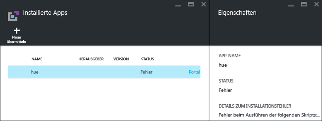
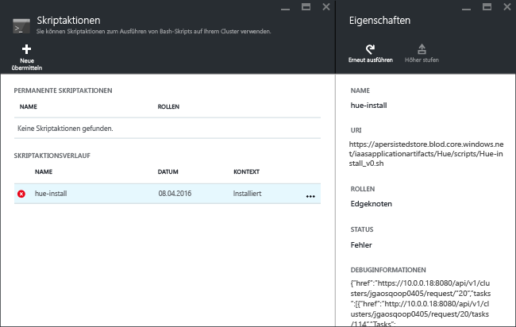

<properties
   	pageTitle="Installieren von Hadoop-Anwendungen in HDInsight | Microsoft Azure"
   	description="Hier erfahren Sie, wie Sie Hadoop-Anwendungen in HDInsight installieren."
   	services="hdinsight"
   	documentationCenter=""
   	authors="mumian"
   	manager="paulettm"
   	editor="cgronlun"
	tags="azure-portal"/>

<tags
   	ms.service="hdinsight"
   	ms.devlang="na"
   	ms.topic="hero-article"
   	ms.tgt_pltfrm="na"
   	ms.workload="big-data"
   	ms.date="06/07/2016"
   	ms.author="jgao"/>

# Installieren benutzerdefinierter HDInsight-Anwendungen

Eine HDInsight-Anwendung kann von Benutzern in einem Linux-basierten HDInsight-Cluster installiert werden. Diese Anwendungen können von Microsoft oder von unabhängigen Softwareanbietern (Independent Software Vendors, ISVs) bezogen oder aber selbst entwickelt werden. In diesem Artikel erfahren Sie, wie Sie eine nicht im Azure-Portal veröffentlichte HDInsight-Anwendung unter HDInsight installieren. Der Name der zu installierenden Anwendung lautet [Hue](http://gethue.com/).

Weitere verwandte Artikel:

- [Veröffentlichen von HDInsight-Anwendungen](hdinsight-apps-publish-applications.md): Hier erfahren Sie, wie Sie benutzerdefinierte HDInsight-Anwendungen im Azure Marketplace veröffentlichen.
- [MSDN: Install an HDInsight application](https://msdn.microsoft.com/library/mt706515.aspx) (MSDN: Installieren einer HDInsight-Anwendung): Hier erfahren Sie, wie Sie HDInsight-Anwendungen definieren.

 
## Voraussetzungen

Wenn Sie HDInsight-Anwendungen in einem vorhandenen HDInsight-Cluster installieren möchten, benötigen Sie einen HDInsight-Cluster. Informationen zum Erstellen eines solchen Clusters finden Sie unter [Erstellen von Clustern](hdinsight-hadoop-linux-tutorial-get-started.md#create-cluster). Im Zuge der HDInsight-Clustererstellung können Sie auch HDInsight-Anwendungen installieren.

## Installieren von HDInsight-Anwendungen

HDInsight-Anwendungen können bei der Clustererstellung oder in einem vorhandenen HDInsight-Cluster installiert werden. Informationen zum Definieren von ARM-Vorlagen finden Sie unter [MSDN: Install an HDInsight application](https://msdn.microsoft.com/library/mt706515.aspx) (MSDN: Installieren einer HDInsight-Anwendung).

Zum Bereitstellen der Anwendung „Hue“ benötigen Sie folgende Dateien:

- [azuredeploy.json](https://github.com/hdinsight/Iaas-Applications/blob/master/Hue/azuredeploy.json): Die ARM-Vorlage zum Installieren der HDInsight-Anwendung. Informationen zum Entwickeln Ihrer eigenen ARM-Vorlage finden Sie unter [MSDN: Install an HDInsight application](https://msdn.microsoft.com/library/mt706515.aspx) (MSDN: Installieren einer HDInsight-Anwendung).
- [hue-install\_v0.sh](https://github.com/hdinsight/Iaas-Applications/blob/master/Hue/scripts/Hue-install_v0.sh): Die Skriptaktion, die von der ARM-Vorlage zum Konfigurieren des Edgeknotens aufgerufen wird. 
- [hue-binaries.tgz](https://hdiconfigactions.blob.core.windows.net/linuxhueconfigactionv01/hue-binaries-14-04.tgz): Die von „hue-install\_v0.sh“ aufgerufene Hue-Binärdatei. 
- [hue-binaries-14-04.tgz](https://hdiconfigactions.blob.core.windows.net/linuxhueconfigactionv01/hue-binaries-14-04.tgz): Die von „hue-install\_v0.sh“ aufgerufene Hue-Binärdatei. 
- [webwasb-tomcat.tar.gz](https://hdiconfigactions.blob.core.windows.net/linuxhueconfigactionv01/webwasb-tomcat.tar.gz): Eine von „hue-install\_v0.sh“ aufgerufene Beispielwebanwendung (Tomcat).

**So installieren Sie Hue in einem bereits vorhandenen HDInsight-Cluster**

1. Klicken Sie auf die folgende Abbildung, um sich bei Azure anzumelden und die ARM-Vorlage im Azure-Portal zu öffnen. 

    

    Diese Schaltfläche öffnet eine ARM-Vorlage im Azure-Portal. Die ARM-Vorlage befindet sich unter [https://github.com/hdinsight/Iaas-Applications/tree/master/Hue](https://github.com/hdinsight/Iaas-Applications/tree/master/Hue). Informationen zum Erstellen dieser ARM-Vorlage finden Sie unter [MSDN: Install an HDInsight application](https://msdn.microsoft.com/library/mt706515.aspx) (MSDN: Installieren einer HDInsight-Anwendung).
    
2. Geben Sie auf dem Blatt **Parameter** Folgendes ein:

    - **ClusterName**: Geben Sie den Namen des Clusters ein, in dem die Anwendung installiert werden soll. Dieser Cluster muss bereits vorhanden sein.
    
3. Klicken Sie auf **OK**, um die Parameter zu speichern.
4. Geben Sie auf dem Blatt **Benutzerdefinierte Bereitstellung** die Zeichenfolge **Ressourcengruppe** ein. Die Ressourcengruppe ist ein Container, in dem der Cluster, das abhängige Speicherkonto und andere Ressourcen gruppiert werden. Es wird benötigt, um die Ressourcengruppe als Cluster zu verwenden.
5. Klicken Sie auf **Rechtliche Bedingungen** und dann auf **Erstellen**.
6. Vergewissern Sie sich, dass das Kontrollkästchen **An Dashboard anheften** aktiviert ist, und klicken Sie auf **Erstellen**. Der Installationsstatus kann über die an das Portaldashboard angeheftete Kachel sowie anhand der Portalbenachrichtigung nachverfolgt werden. (Klicken Sie oben im Portal auf das Glockensymbol.) Die Installation der Anwendung dauert etwa zehn Minuten.

**So installieren Sie Hue im Zuge der Clustererstellung**

1. Klicken Sie auf die folgende Abbildung, um sich bei Azure anzumelden und die ARM-Vorlage im Azure-Portal zu öffnen. 

    

    Diese Schaltfläche öffnet eine ARM-Vorlage im Azure-Portal. Die ARM-Vorlage befindet sich unter [https://hditutorialdata.blob.core.windows.net/hdinsightapps/create-linux-based-hadoop-cluster-in-hdinsight.json](https://hditutorialdata.blob.core.windows.net/hdinsightapps/create-linux-based-hadoop-cluster-in-hdinsight.json). Informationen zum Erstellen dieser ARM-Vorlage finden Sie unter [MSDN: Install an HDInsight application](https://msdn.microsoft.com/library/mt706515.aspx) (MSDN: Installieren einer HDInsight-Anwendung).

2. Befolgen Sie die Anleitung, um den Cluster zu erstellen und Hue zu installieren. Weitere Informationen zum Erstellen von HDInsight-Clustern finden Sie unter [Erstellen von Linux-basierten Hadoop-Clustern in HDInsight](hdinsight-hadoop-provision-linux-clusters.md).

Neben dem Azure-Portal können Sie ARM-Vorlagen auch mithilfe von [Azure PowerShell](hdinsight-hadoop-create-linux-clusters-arm-templates.md#deploy-with-powershell) sowie mithilfe der [Azure-Befehlszeilenschnittstelle](hdinsight-hadoop-create-linux-clusters-arm-templates.md#deploy-with-azure-cli) aufrufen.

## Überprüfen der Installation

Sie können den Status der Anwendung im Azure-Portal nachverfolgen und sich so vergewissern, dass die Anwendung installiert wurde. Darüber hinaus können Sie sich vergewissern, dass alle HTTP-Endpunkte wie erwartet verfügbar sind, und die Webseite überprüfen (sofern vorhanden):

**So öffnen Sie das Hue-Portal**

1. Melden Sie sich beim [Azure-Portal](https://portal.azure.com) an.
2. Klicken Sie im linken Menü auf **HDInsight-Cluster**. Sollte diese Option nicht angezeigt werden, klicken Sie auf **Durchsuchen** und anschließend auf **HDInsight-Cluster**.
3. Klicken Sie auf den Cluster, in dem Sie die Anwendung installiert haben.
4. Klicken Sie auf dem Blatt **Einstellungen** unter der Kategorie **Allgemein** auf **Anwendungen**. Die Anwendung **Hue** wird in der Liste auf dem Blatt **Installierte Apps** angezeigt.
5. Klicken Sie in der Liste auf **Hue**, um die Eigenschaften anzuzeigen.  
6. Klicken Sie auf den Webseitenlink, um die Website zu überprüfen. Öffnen Sie den HTTP-Endpunkt in einem Browser, um die Weboberfläche von Hue zu überprüfen, und öffnen Sie den SSH-Endpunkt mithilfe von [PuTTY](hdinsight-hadoop-linux-use-ssh-windows.md) oder eines anderen [SSH-Clients](hdinsight-hadoop-linux-use-ssh-unix.md).
 
## Behandeln von Installationsproblemen

Sie können den Status der Anwendungsinstallation über die Portalbenachrichtigung überprüfen. (Klicken Sie oben im Portal auf das Glockensymbol.)

Wenn eine Anwendungsinstallation nicht erfolgreich ist, können Sie die Fehlermeldungen anzeigen und Informationen an drei Stellen debuggen:

- HDInsight-Anwendungen: allgemeine Fehlerinformationen.

    Öffnen Sie den Cluster im Portal, und klicken Sie im Blatt „Einstellungen“ auf „Anwendungen“:

    

- HDInsight-Skriptaktion: Wenn mit der Fehlermeldung der HDInsight-Anwendung ein Skriptaktionsfehler angegeben wird, werden im Bereich mit den Skriptaktionen Details zum Skriptfehler angezeigt.

    Klicken Sie im Blatt „Einstellungen“ auf „Skriptaktion“. Im Skriptaktionsverlauf werden die Fehlermeldungen angezeigt.

    
    
- Ambari-Webbenutzeroberfläche: Wenn das Installationsskript der Grund für den Fehler war, können Sie die Ambari-Webbenutzeroberfläche verwenden, um die vollständigen Protokolle zu den Installationsskripts zu überprüfen.

    Weitere Informationen finden Sie unter [Problembehandlung](hdinsight-hadoop-customize-cluster-linux.md#troubleshooting).

## Entfernen von HDInsight-Anwendungen

HDInsight-Anwendungen können auf unterschiedliche Weise gelöscht werden.

### Mithilfe des Portals

**So entfernen Sie eine Anwendung mithilfe des Portals**

1. Melden Sie sich beim [Azure-Portal](https://portal.azure.com) an.
2. Klicken Sie im linken Menü auf **HDInsight-Cluster**. Sollte diese Option nicht angezeigt werden, klicken Sie auf **Durchsuchen** und anschließend auf **HDInsight-Cluster**.
3. Klicken Sie auf den Cluster, in dem Sie die Anwendung installiert haben.
4. Klicken Sie auf dem Blatt **Einstellungen** unter der Kategorie **Allgemein** auf **Anwendungen**. Eine Liste mit installierten Anwendungen wird angezeigt. Im Rahmen dieses Tutorials wird **Hue** auf dem Blatt **Installierte Apps** angezeigt.
5. Klicken Sie mit der rechten Maustaste auf die zu entfernende Anwendung, und klicken Sie anschließend auf **Löschen**.
6. Klicken Sie auf **Ja**, um zu bestätigen.

Über das Portal können Sie auch den Cluster oder die Ressourcengruppe löschen, die die Anwendung enthält.

### Mithilfe von Azure PowerShell

Mit Azure PowerShell können Sie den Cluster oder die Ressourcengruppe löschen. Weitere Informationen finden Sie unter [Löschen von Clustern mithilfe von Azure PowerShell](hdinsight-administer-use-powershell.md#delete-clusters).

### Mithilfe der Azure-Befehlszeilenschnittstelle

Mit der Azure-Befehlszeilenschnittstelle können Sie den Cluster oder die Ressourcengruppe löschen. Weitere Informationen finden Sie unter [Löschen von Clustern mithilfe der Azure-Befehlszeilenschnittstelle](hdinsight-administer-use-command-line.md#delete-clusters).

## Nächste Schritte

- [MSDN: Install an HDInsight application](https://msdn.microsoft.com/library/mt706515.aspx) (MSDN: Installieren einer HDInsight-Anwendung): Hier erfahren Sie, wie Sie ARM-Vorlagen für die Bereitstellung von HDInsight-Anwendungen entwickeln.
- [Veröffentlichen von HDInsight-Anwendungen](hdinsight-apps-publish-applications.md): Hier erfahren Sie, wie Sie benutzerdefinierte HDInsight-Anwendungen im Azure Marketplace veröffentlichen.
- [Anpassen Linux-basierter HDInsight-Cluster mithilfe von Skriptaktionen](hdinsight-hadoop-customize-cluster-linux.md): Hier erfahren Sie, wie Sie mithilfe der Skriptaktion zusätzliche Anwendungen installieren.
- [Erstellen Linux-basierter Hadoop-Cluster in HDInsight mithilfe von ARM-Vorlagen](hdinsight-hadoop-create-linux-clusters-arm-templates.md): Hier erfahren Sie, wie Sie ARM-Vorlagen für die Erstellung von HDInsight-Clustern aufrufen.

<!---HONumber=AcomDC_0608_2016-->