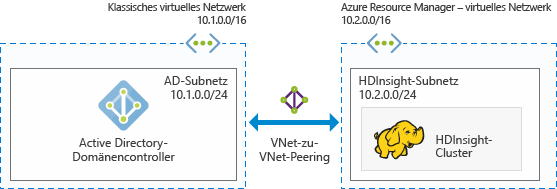
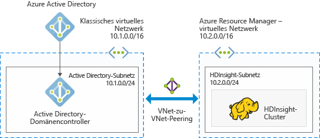
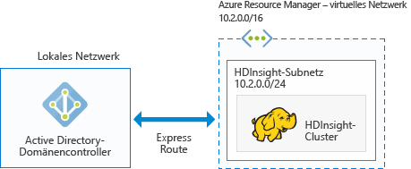

# Planen von in die Azure-Domäne eingebundenen Hadoop-Clustern in HDInsight

Bei einem herkömmlichen Hadoop-Cluster handelt es sich um einen Einzelbenutzercluster. Dieser ist für die meisten Unternehmen geeignet, in denen kleinere Anwendungsteams ihre Big Data-Workloads erstellen. Hadoop wird immer beliebter, und viele Unternehmen führen die Umstellung auf ein Modell durch, bei dem Cluster von IT-Teams verwaltet werden und mehrere Anwendungsteams Cluster gemeinsam nutzen. Cluster für mehrere Benutzer sind daher eine der am meisten geforderten Funktionen in HDInsight.

Anstatt die Authentifizierung und Autorisierung für mehrere Benutzer selbst zu erstellen, wird für HDInsight der beliebteste Identitätsanbieter verwendet: Active Directory (AD). Die leistungsstarke Sicherheitsgruppenfunktion in Active Directory kann zum Verwalten der Autorisierung für mehrere Benutzer in HDInsight verwendet werden. Indem HDInsight in Active Directory integriert wird, können Active Directory-Benutzer mit den Clustern kommunizieren, indem sie ihre eigenen Active Directory-Anmeldeinformationen nutzen. In HDInsight wird ein Active Directory-Benutzer einem lokalen Hadoop-Benutzer zugeordnet, sodass alle Dienste, die unter HDInsight ausgeführt werden (Ambari, Hive-Server, Ranger, Spark Thrift-Server usw.) für den authentifizierten Benutzer nahtlos funktionieren.

## Integrieren von HDInsight in Active Directory

Indem HDInsight in Active Directory integriert wird, werden die HDInsight-Clusterknoten in die Active Directory-Domäne eingebunden. In HDInsight werden Dienstprinzipale für die im Cluster ausgeführten Hadoop-Dienste erstellt und in einer angegebenen Organisationseinheit (OE) in Active Directory angeordnet. Außerdem werden in HDInsight umgekehrte DNS-Zuordnungen in der Active Directory-Domäne für die IP-Adresse der Knoten erstellt, die in die Domäne eingebunden werden.

Zur Umsetzung dieser Einrichtung können Sie mehrere Architekturen verwenden. Sie treffen die Entscheidung, welche Architektur für Sie am besten geeignet ist.

**1. Integration von HDInsight in AD unter Azure IAAS**

Dies ist die einfachste Architektur für die Integration von HDInsight in Active Directory. Der Active Directory-Domänencontroller wird auf mindestens einem virtuellen Computer (VM) in Azure ausgeführt. Diese virtuellen Computer befinden sich üblicherweise innerhalb eines virtuellen Netzwerks. Sie richten ein anderes virtuelles Netzwerk für den HDInsight-Cluster ein. Zum Herstellen einer „Sichtverbindung“ von HDInsight mit Active Directory müssen Sie diese virtuellen Netzwerke per [VNet-zu-VNet-Peering](../virtual-network/virtual-networks-create-vnetpeering-arm-portal.md) verknüpfen.

> [!NOTE]
> In dieser Architektur können Sie Azure Data Lake Store nicht mit einem HDInsight-Cluster nutzen.
 

Voraussetzungen für die Active Directory-Instanz:

* Es muss eine [Organisationseinheit](../active-directory-domain-services/active-directory-ds-admin-guide-create-ou.md) erstellt werden, in der die HDInsight-Cluster-VMs und die vom Cluster verwendeten Dienstprinzipale platziert werden sollen.
* Für die Kommunikation mit der Active Directory-Instanz muss [LDAPS](../active-directory-domain-services/active-directory-ds-admin-guide-configure-secure-ldap.md) eingerichtet werden. Das Zertifikat zum Einrichten von LDAPS muss ein reales Zertifikat (kein selbst signiertes Zertifikat) sein.
* In der Domäne müssen für den IP-Adressbereich des HDInsight-Subnetzes (z.B. 10.2.0.0/24 in der obigen Abbildung) Reverse-DNS-Zonen erstellt werden.
* Es wird ein Dienst- oder ein Benutzerkonto benötigt, das zum Erstellen des HDInsight-Clusters verwendet wird. Dieses Konto muss die folgenden Berechtigungen besitzen:

    - Berechtigungen zum Erstellen von Dienstprinzipalobjekten und Computerobjekten innerhalb der Organisationseinheit
    - Berechtigungen zum Erstellen von Reverse-DNS-Proxyregeln
    - Berechtigungen zum Einbinden von Computern in die Active Directory-Domäne

**2. Integration von HDInsight in eine auf die Cloud beschränkte Azure AD-Instanz**

Für eine auf die Cloud beschränkte Azure Active Directory-Instanz (Azure AD) müssen Sie einen Domänencontroller konfigurieren, damit HDInsight in Ihre Azure Active Directory-Instanz integriert werden kann. Dies wird mithilfe von [Azure Active Directory Domain Services](../active-directory-domain-services/active-directory-ds-overview.md) (Azure AD DS) erreicht. Mit Azure AD DS werden Domänencontrollercomputer in der Cloud erstellt, und für Sie werden entsprechende IP-Adressen bereitgestellt. Es werden zwei Domänencontroller erstellt, um für eine hohe Verfügbarkeit zu sorgen.

Derzeit ist Azure AD DS nur in klassischen VNets vorhanden. Der Zugriff darauf ist nur über das klassische Azure-Portal möglich. Das HDInsight-VNet ist im Azure-Portal vorhanden, und das Peering mit dem klassischen VNet muss per VNet-zu-VNet-Peering hergestellt werden.

> [!NOTE]
> Für das Peering zwischen einem klassischen VNet und einem Azure Resource Manager-VNet müssen sich beide virtuellen Netzwerke in derselben Region und unter demselben Azure-Abonnement befinden.

Voraussetzungen für die Active Directory-Instanz:

* Es muss eine [Organisationseinheit](../active-directory-domain-services/active-directory-ds-admin-guide-create-ou.md) erstellt werden, in der die HDInsight-Cluster-VMs und die vom Cluster verwendeten Dienstprinzipale platziert werden sollen. 
* Für die Konfiguration von AD DS muss [LDAPS](../active-directory-domain-services/active-directory-ds-admin-guide-configure-secure-ldap.md) eingerichtet werden. Das Zertifikat zum Einrichten von LDAPS muss ein reales Zertifikat (kein selbst signiertes Zertifikat) sein.
* In der Domäne müssen für den IP-Adressbereich des HDI-Subnetzes (z.B. 10.2.0.0/24 in der obigen Abbildung) Reverse-DNS-Zonen erstellt werden. 
* [Kennworthashes](../active-directory-domain-services/active-directory-ds-getting-started-password-sync.md) müssen zwischen Azure AD und AD DS synchronisiert werden.
* Es wird ein Dienst- oder ein Benutzerkonto benötigt, das zum Erstellen des HDInsight-Clusters verwendet wird. Dieses Konto muss die folgenden Berechtigungen besitzen:

    - Berechtigungen zum Erstellen von Dienstprinzipalobjekten und Computerobjekten innerhalb der Organisationseinheit
    - Berechtigungen zum Erstellen von Reverse-DNS-Proxyregeln
    - Berechtigungen zum Einbinden von Computern in die Active Directory-Domäne

**3. Integration von HDInsight in eine lokale AD-Instanz per VPN**

Diese Architektur ähnelt der Architektur im ersten Szenario. Der einzige Unterschied besteht darin, dass die Active Directory-Instanz lokal angeordnet ist und die „Sichtverbindung“ für HDInsight zu Active Directory über eine [VPN-Verbindung von Azure zum lokalen Netzwerk](../expressroute/expressroute-introduction.md) hergestellt wird.

> [!NOTE]
> In dieser Architektur können Sie Azure Data Lake Store nicht mit einem HDInsight-Cluster nutzen.

Voraussetzungen für die Active Directory-Instanz:

* Es muss eine [Organisationseinheit](../active-directory-domain-services/active-directory-ds-admin-guide-create-ou.md) erstellt werden, in der die HDInsight-Cluster-VMs und die vom Cluster verwendeten Dienstprinzipale platziert werden sollen.
* Für die Kommunikation mit der Active Directory-Instanz muss [LDAPS](../active-directory-domain-services/active-directory-ds-admin-guide-configure-secure-ldap.md) eingerichtet werden. Das Zertifikat zum Einrichten von LDAPS muss ein reales Zertifikat (kein selbst signiertes Zertifikat) sein.
* In der Domäne müssen für den IP-Adressbereich des HDI-Subnetzes (z.B. 10.2.0.0/24 in der obigen Abbildung) Reverse-DNS-Zonen erstellt werden.
* Es wird ein Dienst- oder ein Benutzerkonto benötigt, das zum Erstellen des HDInsight-Clusters verwendet wird. Dieses Konto muss die folgenden Berechtigungen besitzen:

    - Berechtigungen zum Erstellen von Dienstprinzipalobjekten und Computerobjekten innerhalb der Organisationseinheit
    - Berechtigungen zum Erstellen von Reverse-DNS-Proxyregeln
    - Berechtigungen zum Einbinden von Computern in die Active Directory-Domäne

**4. Integration von HDInsight in eine lokale AD-Instanz, die mit einer Azure AD-Instanz synchronisiert wird**

Diese Architektur ähnelt der Architektur im zweiten Szenario. Der einzige Unterschied besteht darin, dass die lokale Active Directory-Instanz mit der Azure Active Directory-Instanz synchronisiert wird. Sie müssen in der Cloud einen Domänencontroller konfigurieren, damit HDInsight in Ihre Azure Active Directory-Instanz integriert werden kann. Dies wird mithilfe von [Azure Active Directory Domain Services](../active-directory-domain-services/active-directory-ds-overview.md) (AD DS) erreicht. Mit AD DS werden Domänencontrollercomputer in der Cloud erstellt, und für Sie werden entsprechende IP-Adressen bereitgestellt. Es werden zwei Domänencontroller erstellt, um für eine hohe Verfügbarkeit zu sorgen.

Derzeit ist Azure AD DS nur in klassischen VNets vorhanden. Der Zugriff darauf ist nur über das klassische Azure-Portal möglich. Das HDInsight-VNet ist im Azure-Portal vorhanden, und das Peering mit dem klassischen VNet muss per VNet-zu-VNet-Peering hergestellt werden.

> [!NOTE]
> Für das Peering zwischen einem klassischen VNet und einem Azure Resource Manager-VNet müssen sich beide virtuellen Netzwerke in derselben Region und unter demselben Azure-Abonnement befinden.

Voraussetzungen für die Active Directory-Instanz:

* Es muss eine [Organisationseinheit](../active-directory-domain-services/active-directory-ds-admin-guide-create-ou.md) erstellt werden, in der Sie die HDInsight-Cluster-VMs und die vom Cluster verwendeten Dienstprinzipale platzieren möchten. 
* Für die Konfiguration von AD DS muss [LDAPS](../active-directory-domain-services/active-directory-ds-admin-guide-configure-secure-ldap.md) eingerichtet werden. Das Zertifikat zum Einrichten von LDAPS muss ein reales Zertifikat (kein selbst signiertes Zertifikat) sein.
* In der Domäne müssen für den IP-Adressbereich des HDI-Subnetzes (z.B. 10.2.0.0/24 in der obigen Abbildung) Reverse-DNS-Zonen erstellt werden. 
* [Kennworthashes](../active-directory-domain-services/active-directory-ds-getting-started-password-sync.md) müssen zwischen Azure AD und AD DS synchronisiert werden.
* Es wird ein Dienst- oder ein Benutzerkonto benötigt, das zum Erstellen des HDInsight-Clusters verwendet wird. Dieses Konto muss die folgenden Berechtigungen besitzen:

    - Berechtigungen zum Erstellen von Dienstprinzipalobjekten und Computerobjekten innerhalb der Organisationseinheit
    - Berechtigungen zum Erstellen von Reverse-DNS-Proxyregeln
    - Berechtigungen zum Einbinden von Computern in die Active Directory-Domäne

**5. Integration von HDInsight in eine nicht standardmäßige Azure AD-Instanz (nur für Test- und Entwicklungszwecke empfohlen)**

Diese Architektur ähnelt der Architektur im zweiten Szenario. Für die meisten Unternehmen ist der Administratorzugriff auf Active Directory auf bestimmte Personen beschränkt. Wenn Sie eine Machbarkeitsstudie erstellen oder auch nur die Erstellung eines in die Domäne eingebundenen Clusters ausprobieren möchten, kann es vorteilhaft sein, im Abonnement einfach eine neue Azure Active Directory-Instanz zu erstellen, anstatt auf die Konfiguration der Voraussetzungen in der Active Directory-Instanz durch den Administrator zu warten. Da dies eine von Ihnen erstellte Azure AD-Instanz ist, verfügen Sie über die vollständigen Azure AD-Berechtigungen zum Konfigurieren von AD DS.

Mit AD DS werden Domänencontrollercomputer in der Cloud erstellt, und für Sie werden entsprechende IP-Adressen bereitgestellt. Es werden zwei Domänencontroller erstellt, um für eine hohe Verfügbarkeit zu sorgen.

Da AD DS derzeit nur in klassischen VNets vorhanden ist, benötigen Sie Zugriff auf das klassische Portal und müssen ein klassisches VNet für die AD DS-Konfiguration erstellen. Das HDInsight-VNet ist im Azure-Portal vorhanden, und das Peering mit dem klassischen VNet muss per VNet-zu-VNet-Peering hergestellt werden.

> [!NOTE]
> Für das Peering zwischen klassischen VNets und Azure Resource Manager-VNets müssen sich beide virtuellen Netzwerke in derselben Region und unter demselben Azure-Abonnement befinden.

Voraussetzungen für die Active Directory-Instanz:

* Es muss eine [Organisationseinheit](../active-directory-domain-services/active-directory-ds-admin-guide-create-ou.md) erstellt werden, in der die HDInsight-Cluster-VMs und die vom Cluster verwendeten Dienstprinzipale platziert werden sollen. 
* Für die Konfiguration von AD DS muss [LDAPS](../active-directory-domain-services/active-directory-ds-admin-guide-configure-secure-ldap.md) eingerichtet werden. Sie können für die LDAPS-Konfiguration ein [selbstsigniertes Zertifikat](../active-directory-domain-services/active-directory-ds-admin-guide-configure-secure-ldap.md) erstellen. Zum Verwenden eines selbstsignierten Zertifikats müssen Sie aber ein Ausnahme von <a href="mailto:hdipreview@microsoft.com">hdipreview@microsoft.com</a> anfordern.
* In der Domäne müssen für den IP-Adressbereich des HDI-Subnetzes (z.B. 10.2.0.0/24 in der obigen Abbildung) Reverse-DNS-Zonen erstellt werden. 
* [Kennworthashes](../active-directory-domain-services/active-directory-ds-getting-started-password-sync.md) müssen zwischen Azure AD und AD DS synchronisiert werden.
* Es wird ein Dienst- oder ein Benutzerkonto benötigt, das zum Erstellen des HDInsight-Clusters verwendet wird. Dieses Konto muss die folgenden Berechtigungen besitzen:

    - Berechtigungen zum Erstellen von Dienstprinzipalobjekten und Computerobjekten innerhalb der Organisationseinheit
    - Berechtigungen zum Erstellen von Reverse-DNS-Proxyregeln
    - Berechtigungen zum Einbinden von Computern in die Active Directory-Domäne

## Nächste Schritte
* Informationen zum Konfigurieren eines in die Domäne eingebundenen HDInsight-Clusters finden Sie unter [Configure Domain-joined HDInsight clusters (Preview)](hdinsight-domain-joined-configure.md) (Konfigurieren von in die Domäne eingebundenen HDInsight-Clustern [Vorschau]).
* Informationen zum Verwalten von in die Domäne eingebundenen HDInsight-Clustern finden Sie unter [Verwalten von in die Domäne eingebundenen HDInsight-Clustern (Vorschau)](hdinsight-domain-joined-manage.md).
* Informationen zum Konfigurieren von Hive-Richtlinien und zum Ausführen von Hive-Abfragen finden Sie unter [Configure Hive policies in Domain-joined HDInsight (Preview)](hdinsight-domain-joined-run-hive.md) (Konfigurieren von Hive-Richtlinien für in die Domäne eingebundene HDInsight-Cluster).
* Informationen zum Ausführen von Hive-Abfragen mit SSH für in die Domäne eingebundene HDInsight-Cluster finden Sie unter [Verwenden von SSH mit Linux-basiertem Hadoop in HDInsight unter Linux, Unix oder OS X](hdinsight-hadoop-linux-use-ssh-unix.md).

<!--HONumber=Feb17_HO1-->

