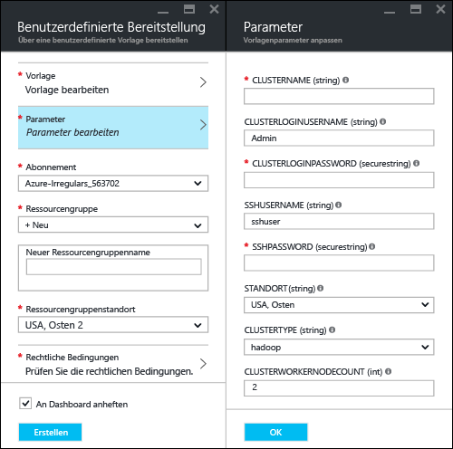
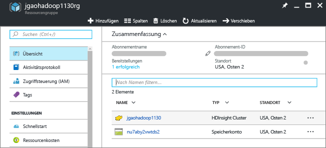
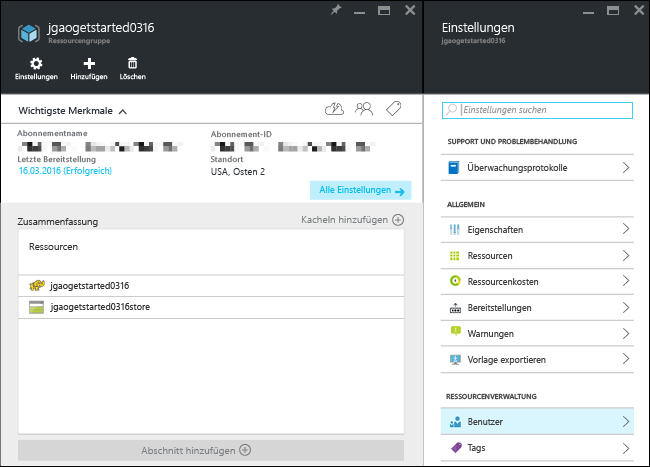
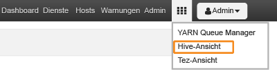

# Hadoop-Tutorial: Erste Schritte bei der Verwendung von Hadoop in HDInsight

Erfahren Sie, wie Sie [Hadoop](http://hadoop.apache.org/)-Cluster in HDInsight erstellen und Hive-Aufträge in HDInsight ausführen. [Apache Hive](https://hive.apache.org/) ist die beliebteste Komponente im Hadoop-Ökosystem. HDInsight bietet derzeit sechs verschiedene Clustertypen: [Hadoop](hdinsight-hadoop-introduction.md), [Spark](hdinsight-apache-spark-overview.md), [HBase](hdinsight-hbase-overview.md), [Storm](hdinsight-storm-overview.md), [Interactive Hive (Vorschau)](hdinsight-hadoop-use-interactive-hive.md) und [R Server](hdinsight-hadoop-r-server-overview.md).  Jeder Clustertyp unterstützt eine andere Gruppe von Komponenten. Alle sechs Clustertypen unterstützen Hive. Eine Liste mit den unterstützten Komponenten in HDInsight finden Sie unter [Neuheiten in den von HDInsight bereitgestellten Hadoop-Clusterversionen](hdinsight-component-versioning.md)  

[!INCLUDE [delete-cluster-warning](../../includes/hdinsight-delete-cluster-warning.md)]

## Voraussetzungen
Bevor Sie mit diesem Tutorial beginnen können, benötigen Sie Folgendes:

* **Azure-Abonnement:**Um ein kostenloses Testkonto für die Dauer eines Monats zu erstellen, navigieren Sie zu [azure.microsoft.com/free](https://azure.microsoft.com/free).

## Cluster erstellen

Die meisten Hadoop-Aufträge sind Batchaufträge. Sie erstellen einen Cluster, führen einige Aufträge aus und löschen dann den Cluster. In diesem Abschnitt erstellen Sie einen Hadoop-Cluster in HDInsight mit einer [Azure Resource Manager-Vorlage](../azure-resource-manager/resource-group-template-deploy.md). Für dieses Tutorial ist keine Erfahrung mit Resource Manager-Vorlagen erforderlich. Andere Methoden zur Erstellung von Clustern und Informationen zu den in diesem Tutorial verwendeten Eigenschaften finden Sie unter [Erstellen von HDInsight-Clustern](hdinsight-hadoop-provision-linux-clusters.md). Wählen Sie mithilfe der Auswahloptionen am Seitenanfang die gewünschten Clustererstellungsoptionen aus.

Die in diesem Tutorial verwendete Resource Manager-Vorlage befindet sich auf [GitHub](https://azure.microsoft.com/resources/templates/101-hdinsight-linux-ssh-password/). 

1. Klicken Sie auf die folgende Abbildung, um sich bei Azure anzumelden, und öffnen Sie die Resource Manager-Vorlage im Azure-Portal. 
   
    
2. Geben Sie folgende Werte ein bzw. wählen diese aus:
   
    .
   
    * **Abonnement**: Wählen Sie Ihr Azure-Abonnement aus.
    * **Ressourcengruppe**: Erstellen Sie eine Ressourcengruppe, oder wählen Sie eine vorhandene Ressourcengruppe aus.  Bei einer Ressourcengruppe handelt es sich um einen Container mit Azure-Komponenten.  In diesem Fall enthält die Ressourcengruppe den HDInsight-Cluster und das abhängige Azure Storage-Konto. 
    * **Standort**: Wählen Sie einen Azure-Standort aus, an dem Sie Ihren Cluster erstellen möchten.  Je näher der Standort, desto besser die Leistung. 
    * **Cluster Type**: Wählen Sie **Hadoop** für dieses Tutorial.
    * **Clustername**: Geben Sie einen Namen für den Hadoop-Cluster ein.
    * **Cluster-Benutzername und -Kennwort**: Der Standardname für die Anmeldung lautet **admin**.
    * **SSH-Benutzername und -Kennwort**: Der Standardname für die Anmeldung lautet **sshuser**.  Sie können auch einen anderen Namen festlegen. 
     
    Einige Eigenschaften wurden in der Vorlage hartcodiert.  Diese Werte können über die Vorlage konfiguriert werden.

    * **Standort**: Für den Standort des Clusters und des abhängigen Speicherkontos wird jeweils der gleiche Standort verwendet wie für die Ressourcengruppe.
    * **Clusterversion**: 3.5
    * **Betriebssystemtyp**: Linux
    * **Anzahl von Workerknoten**: 2

     Jeder Cluster verfügt über eine Abhängigkeit von einem Azure Storage-Konto. Es wird als Standardspeicherkonto bezeichnet. Der HDInsight-Cluster und das dazugehörige Speicherkonto müssen sich in derselben Azure-Region befinden. Beim Löschen von Clustern wird das Speicherkonto nicht gelöscht. 
     
     Eine ausführlichere Erläuterung dieser Eigenschaften finden Sie unter [Erstellen von Linux-basierten Hadoop-Clustern in HDInsight](hdinsight-hadoop-provision-linux-clusters.md).

3. Aktivieren Sie die Optionen **Ich stimme den oben genannten Geschäftsbedingungen zu** und **An Dashboard anheften**, und klicken Sie anschließend auf **Kaufen**. Im Portal-Dashboard erscheint eine neue Kachel namens **Deploying Template deployment** (Vorlagenbereitstellung bereitstellen). Das Erstellen eines Clusters dauert ca. 20 Minuten. Nachdem der Cluster erstellt wurde, wird die Beschriftung der Kachel in den von Ihnen angegebenen Ressourcengruppennamen geändert. Die Ressourcengruppe wird automatisch auf einem neuen Blatt geöffnet. Cluster und Standardspeicher werden aufgelistet.
   
    .

4. Klicken Sie auf den Clusternamen, um den Cluster auf einem neuen Blatt zu öffnen.

   

## Ausführen von Hive-Abfragen
[Apache Hive](hdinsight-use-hive.md) ist die am häufigsten in HDInsight verwendete Komponente. Es gibt viele Verfahren zum Ausführen von Hive-Aufträgen in HDInsight. In diesem Tutorial verwenden Sie die Ambari Hive-Ansicht aus dem Portal, um einige Hive-Aufträge auszuführen. Andere Methoden zum Übermitteln von Hive-Aufträgen finden Sie unter [Verwenden von Hive in HDInsight](hdinsight-use-hive.md).

1. Klicken Sie im vorherigen Screenshot auf **Cluster-Dashboard** und dann auf **HDInsight-Cluster-Dashboard**.  Sie können auch zu **https://&lt;Clustername>.azurehdinsight.net** navigieren, wobei „&lt;Clustername>“ der Cluster ist, den Sie im letzten Abschnitt zum Öffnen von Ambari erstellt haben.
2. Geben Sie den Hadoop-Benutzernamen und das Kennwort wie im letzten Abschnitt festgelegt ein. Der Standard-Benutzername lautet **admin**.
3. Öffnen Sie die **Hive-Ansicht** wie im folgenden Screenshot dargestellt:
   
    .
4. Fügen Sie im Abschnitt **Abfrage-Editor** der Seite die folgenden HiveQL-Anweisungen in das Arbeitsblatt ein:
   
        SHOW TABLES;
   
   > [!NOTE]
   > Für Hive ist ein Semikolon erforderlich.       
   > 
   > 
5. Klicken Sie auf **Ausführen**. Der Abschnitt **Abfrageprozessergebnisse** sollte unterhalb des Abfrage-Editors angezeigt werden und Informationen über den Auftrag enthalten. 
   
    Nach Abschluss der Abfrage werden im Abschnitt **Abfrageprozessergebnisse** die Ergebnisse des Vorgangs angezeigt. Sie sehen eine Tabelle mit dem Namen **hivesampletable**. Die ist eine Hive-Beispieltabelle mit allen HDInsight-Clustern.
   
    .
6. Wiederholen Sie die Schritte 4 und 5, um die folgende Abfrage ausführen:
   
        SELECT * FROM hivesampletable;
   
   > [!TIP]
   > Beachten Sie die Dropdownliste **Ergebnisse speichern** in der oberen linken Ecke des Abschnitts **Abfrageprozessergebnisse**. Hiermit können Sie entweder die Ergebnisse herunterladen oder auf HDInsight-Speicher als CSV-Datei speichern.
   > 
   > 
7. Klicken Sie auf **Verlauf** , um eine Liste mit den Aufträgen zu erhalten.

Nachdem Sie einen Hive-Auftrag abgeschlossen haben, können Sie die [Ergebnisse in eine Azure SQL-Datenbank oder eine SQL Server-Datenbank](hdinsight-use-sqoop-mac-linux.md) exportieren und die [Abfrageergebnisse mithilfe von Excel visualisieren](hdinsight-connect-excel-power-query.md). Weitere Informationen zum Verwenden von Hive in HDInsight finden Sie unter [Verwenden von Hive und HiveQL mit Hadoop in HDInsight zum Analysieren einer Apache Log4j-Beispieldatei](hdinsight-use-hive.md).

## Bereinigen des Tutorials
Nach Abschluss des Tutorials kann es ratsam sein, den Cluster zu löschen. Mit HDInsight werden Ihre Daten im Azure-Speicher gespeichert, sodass Sie einen Cluster problemlos löschen können, wenn er nicht verwendet wird. Für einen HDInsight-Cluster fallen auch dann Gebühren an, wenn er nicht verwendet wird. Da die Gebühren für den Cluster erheblich höher sind als die Kosten für den Speicher, ist es sinnvoll, nicht verwendete Cluster zu löschen. 

> [!NOTE]
> Mit der [Azure Data Factory](hdinsight-hadoop-create-linux-clusters-adf.md) können Sie HDInsight-Cluster bedarfsgesteuert erstellen und eine TimeToLive-Einstellung konfigurieren, um die Cluster automatisch zu löschen. 
> 
> 

**So löschen Sie den Cluster bzw. das Standardspeicherkonto**

1. Melden Sie sich beim [Azure-Portal](https://portal.azure.com)an.
2. Klicken Sie im Dashboard des Portals auf die Kachel mit dem Ressourcengruppennamen, den Sie beim Erstellen des Clusters verwendet haben.
3. Klicken Sie auf dem Blatt mit den Ressourcen auf **Löschen**, um die Ressourcengruppe zu löschen, die den Cluster und das Standardspeicherkonto enthält. Oder klicken Sie auf der Kachel **Ressourcen** auf den Clusternamen und dann auf dem Clusterblatt auf **Löschen**. Beachten Sie, dass das Speicherkonto beim Löschen der Ressourcengruppe ebenfalls gelöscht wird. Wenn Sie das Speicherkonto beibehalten möchten, müssen Sie auswählen, dass nur der Cluster gelöscht werden soll.

## Problembehandlung

Falls beim Erstellen von HDInsight-Clustern Probleme auftreten, sehen Sie sich die [Voraussetzungen für die Zugriffssteuerung](hdinsight-administer-use-portal-linux.md#create-clusters) an.

## Nächste Schritte
In diesem Tutorial haben Sie gelernt, wie Sie mithilfe einer Resource Manager-Vorlage einen Linux-basierten HDInsight-Cluster erstellen und einfache Hive-Abfragen ausführen.

Weitere Informationen zur Datenanalyse mit HDInsight finden Sie in den folgenden Artikeln:

* Weitere Informationen zum Verwenden von Hive mit HDInsight (etwa zum Ausführen von Hive-Abfragen in Visual Studio) finden Sie im Artikel zum [Verwenden von Hive mit HDInsight][hdinsight-use-hive].
* Informationen zu Pig (einer Sprache zum Transformieren von Daten) finden Sie im Artikel zum [Verwenden von Pig mit HDInsight][hdinsight-use-pig].
* Informationen zu MapReduce (einer Möglichkeit zum Schreiben von Programmen, die Daten in Hadoop verarbeiten) finden Sie im Artikel zum [Verwenden von MapReduce mit HDInsight][hdinsight-use-mapreduce].
* Informationen zur Verwendung der HDInsight-Tools für Visual Studio zum Analysieren von Daten in HDInsight finden Sie unter [Erste Schritte bei der Verwendung von Hadoop-Tools für Visual Studio für HDInsight](hdinsight-hadoop-visual-studio-tools-get-started.md).

Wenn Sie mit eigenen Daten arbeiten und mehr darüber wissen möchten, wie Daten in HDInsight gespeichert werden oder wie HDInsight auf Daten zugreift, finden Sie weitere Informationen in folgenden Artikeln:

* Informationen zur Verwendung von Azure Storage durch HDInsight finden Sie unter [Verwenden von Azure Storage mit HDInsight](hdinsight-hadoop-use-blob-storage.md).
* Informationen zum Hochladen von Daten in HDInsight finden Sie im Artikel zum [Hochladen von Daten zu HDInsight][hdinsight-upload-data].

Weitere Informationen zum Erstellen und Verwalten von HDInsight-Clustern finden Sie in folgenden Artikeln:

* Informationen zum Verwalten eines Linux-basierten HDInsight-Clusters finden Sie unter [Verwalten von HDInsight-Clustern mit Ambari](hdinsight-hadoop-manage-ambari.md).
* Informationen zu den Optionen, die Sie beim Erstellen eines HDInsight-Clusters auswählen können, finden Sie unter [Erstellen von HDInsight unter Linux mit benutzerdefinierten Optionen](hdinsight-hadoop-provision-linux-clusters.md).
* Wenn Sie mit Linux und Hadoop vertraut sind und detaillierte Informationen zu Hadoop in HDInsight benötigen, finden Sie diese unter [Informationen zur Verwendung von HDInsight unter Linux](hdinsight-hadoop-linux-information.md). Dieser Artikel enthält u.a. folgende Informationen:
  
  * URLs für im Cluster gehostete Dienste, z. B. Ambari und WebHCat
  * Speicherort von Hadoop-Dateien und -Beispielen im lokalen Dateisystem
  * Verwendung von Azure-Speicher (WASB) anstelle von HDFS als Standarddatenspeicher

[1]: ../HDInsight/hdinsight-hadoop-visual-studio-tools-get-started.md

[hdinsight-provision]: hdinsight-provision-linux-clusters.md
[hdinsight-upload-data]: hdinsight-upload-data.md
[hdinsight-use-mapreduce]: hdinsight-use-mapreduce.md
[hdinsight-use-hive]: hdinsight-use-hive.md
[hdinsight-use-pig]: hdinsight-use-pig.md

