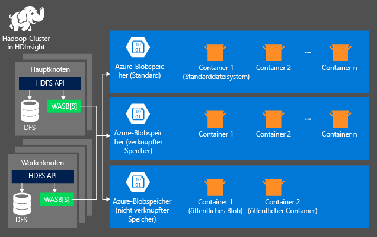
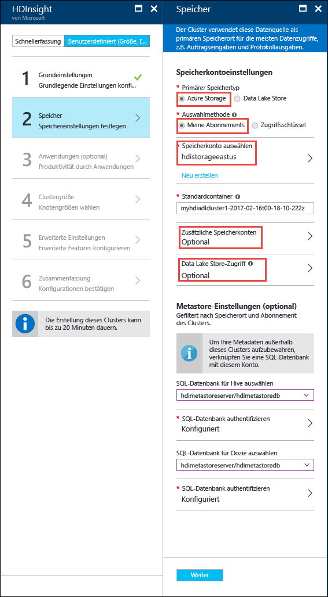

# Verwenden des HDFS-kompatiblen Speichers mit Hadoop in HDInsight

Zum Analysieren von Daten im HDInsight-Cluster können Sie die Daten entweder in Azure Storage, Azure Data Lake Store oder beidem speichern. Beide Speichervarianten ermöglichen das sichere Löschen der HDInsight-Cluster, die für Berechnungen verwendet werden, ohne Benutzerdaten zu verlieren.

Hadoop unterstützt eine Variante des Standarddateisystems. Das Standarddateisystem gibt ein Standardschema und eine Standardautorität vor. Es kann auch zur Auflösung relativer Pfade verwendet werden. Während der Erstellung des HDInsight-Clusters können Sie einen Blobcontainer in Azure Storage als Standarddateisystem angeben. Mit HDInsight 3.5 können Sie Azure Storage oder Azure Data Lake Store als Standarddateisystem auswählen.

In diesem Artikel wird beschrieben, wie die beiden Speicheroptionen für HDInsight-Cluster funktionieren. Weitere Informationen zum Erstellen eines HDInsight-Clusters finden Sie unter [Erste Schritte mit HDInsight](hdinsight-hadoop-linux-tutorial-get-started.md).

## Verwenden von Azure-Speicher mit HDInsight-Clustern

Azure Storage stellt eine robuste, universelle Speicherlösung dar, die problemlos mit HDInsight integriert werden kann. In HDInsight kann ein Blobcontainer in Azure Storage als Standarddateisystem für den Cluster verwendet werden. Über eine HDFS-Schnittstelle (Hadoop Distributed File System) können sämtliche Komponenten in HDInsight direkt mit strukturierten oder unstrukturierten Daten arbeiten, die als Blobs gespeichert sind.

> [!WARNING]
> Beim Erstellen eines Azure Storage-Kontos stehen Ihnen mehrere Optionen zur Verfügung. Die folgende Tabelle enthält Informationen dazu, welche Optionen mit HDInsight unterstützt werden:
> 
> | Speicherkontotyp | Speicherebene | Für HDInsight unterstützt |
> | ------- | ------- | ------- |
> | Allgemeines Speicherkonto | Standard | __Ja__ |
> | &nbsp; | Premium | Nein |
> | Blob Storage-Konto | Heiß | Nein |
> | &nbsp; | Kalt | Nein |

### HDInsight-Speicherarchitektur
Das folgende Diagramm bietet einen zusammenfassenden Überblick über die HDInsight-Speicherarchitektur.

HDInsight bietet Zugang zum verteilten Dateisystem, das lokal an die Rechenknoten angefügt ist. Auf dieses Dateisystem kann über den vollständig qualifizierten URI zugegriffen werden. Zum Beispiel:

    hdfs://<namenodehost>/<path>

Zusätzlich bietet HDInsight die Möglichkeit, auf die in Azure Storage gespeicherten Daten zuzugreifen. Die Syntax ist:

    wasb[s]://<containername>@<accountname>.blob.core.windows.net/<path>

Hier sind einige Aspekte beim Verwenden eines Azure Storage-Kontos mit HDInsight-Clustern.

* **Container in Speicherkonten, die mit einem Cluster verbunden sind:** Da Kontoname und Schlüssel dem Cluster bei der Erstellung zugeordnet werden, haben Sie vollständigen Zugriff auf die Blobs in diesen Containern.

* **Öffentliche Container oder öffentliche Blobs in Speicherkonten, die NICHT mit einem Cluster verbunden sind:** Sie haben schreibgeschützten Zugriff auf die Blobs in den Containern.
  
  > [!NOTE]
  > Öffentliche Container erlauben das Abrufen einer Liste aller im Container verfügbaren Blobs und der Container-Metadaten. Auf öffentliche Blobs haben Sie nur Zugriff, wenn Sie die exakte URL kennen. Weitere Informationen finden Sie unter <a href="http://msdn.microsoft.com/library/windowsazure/dd179354.aspx">Beschränken des Zugriffs auf Container und Blobs</a>.
  > 
  > 
* **Private Container in Speicherkonten, die NICHT mit einem Cluster verbunden sind** : Sie können nicht auf die Blobs in den Containern zugreifen, es sei denn, Sie definieren beim Senden der WebHCat-Aufträge das Speicherkonto. Dies wird weiter unten im Artikel erläutert.

Die bei der Erstellung definierten Speicherkonten und ihre Schlüssel werden in der Datei „%HADOOP_HOME%/conf/core-site.xml“ auf den Clusterknoten gespeichert. Standardmäßig verwendet HDInsight die in der Datei core-site.xml definierten Speicherkonten. Die Datei „core-site.xml“ sollte nicht direkt bearbeitet werden, da der Clusterhauptknoten (Master) jederzeit neu aus einem Image erstellt oder migriert werden kann, und Änderungen an dieser Datei werden nicht beibehalten.

Verschiedene WebHCat-Aufträge, darunter Hive, MapReduce, Hadoop Streaming und Pig, können eine Beschreibung von Speicherkonten und Metadaten enthalten. (Dies funktioniert momentan nur für Pig und Speicherkonten, nicht für Metadaten.) Im Abschnitt [Blobzugriff über Azure PowerShell](#powershell) dieses Artikels finden Sie ein Beispiel für dieses Feature. Weitere Informationen finden Sie unter [Verwenden eines HDInsight-Clusters mit alternativen Speicherkonten und Metastores](http://social.technet.microsoft.com/wiki/contents/articles/23256.using-an-hdinsight-cluster-with-alternate-storage-accounts-and-metastores.aspx).

Blobs können für strukturierte und unstrukturierte Daten verwendet werden. In Blobcontainern werden Daten als Schlüssel-Wert-Paare gespeichert, und es gibt keine Verzeichnishierarchie. Allerdings kann im Schlüsselnamen der Schrägstrich (/) verwendet werden, damit es so aussieht, als wäre eine Datei in einer Verzeichnisstruktur gespeichert. Der Schlüssel eines Blobs kann z. B. *input/log1.txt* heißen. Das Verzeichnis *input* existiert zwar nicht, wegen des Schrägstrichs (/) im Schlüsselnamen sieht es jedoch so aus, als gäbe es einen Dateipfad.

### Vorteile von Azure Storage
Der Leistungsaufwand, der damit verbunden ist, dass die Computecluster und Speicherressourcen nicht an demselben Ort vorliegen, wird dadurch verringert, dass die Computecluster nahe an den Speicherkontoressourcen in der Azure-Region erstellt werden. Hier macht das Hochgeschwindigkeitsnetzwerk den Zugriff auf die Daten im Azure-Speicher für die Serverknoten sehr effizient.

Die Speicherung von Daten im Azure-Speicher anstatt im HDFS hat mehrere Vorteile:

* **Datenfreigabe und -wiederverwendung:** Die Daten im HDFS befinden sich innerhalb des Rechenclusters. Nur die Anwendungen, die Zugriff auf den Rechencluster haben, können die Daten über die HDFS-API verwenden. Auf die Dateien im Azure-Speicher kann entweder über die HDFS-APIs oder über die [Blob Storage-REST-APIs][blob-storage-restAPI] zugegriffen werden. Somit kann eine größere Menge von Anwendungen (darunter andere HDInsight-Cluster) und Tools verwendet werden, um die Daten zu produzieren und abzurufen.
* **Datenarchivierung:** Die Speicherung von Daten im Azure-Speicher sorgt dafür, dass die HDInsight-Cluster, die für Berechnungen verwendet werden, sicher gelöscht werden können, ohne Benutzerdaten zu verlieren.
* **Datenspeicherkosten:** Die langfristige Datenspeicherung in DFS ist kostspieliger als die Datenspeicherung im Azure-Speicher, da die Kosten eines Computeclusters höher als die Kosten für Azure-Speicher sind. Da die Daten nicht für jede Erzeugung eines neues Rechenclusters neu geladen werden, sparen Sie auch Kosten für das Laden von Daten.
* **Elastische horizontale Skalierung:** Auch wenn HDFS ein horizontal skaliertes Dateisystem bietet, wird die Skalierung durch die Anzahl der Knoten bestimmt, die Sie für Ihren Cluster erstellen. Eine Änderung der Skalierung kann weitaus schwieriger werden, als auf die flexiblen Speicherkapazitäten zu vertrauen, die Ihnen der Azure-Speicher automatisch bietet.
* **Georeplikation:** Für Ihren Azure-Speicher kann die Georeplikation durchgeführt werden. Obwohl Sie dadurch von geographischer Wiederherstellung und Datenredundanz profitieren, wirkt sich ein Ausfall des georeplizierten Standorts schwer auf Ihre Leistung aus und kann zusätzliche Kosten nach sich ziehen. Deshalb empfehlen wir, die Georeplikation mit Bedacht auszuwählen und nur dann anzuwenden, wenn der Wert der Daten die zusätzlichen Kosten rechtfertigt.

Bestimmte MapReduce-Aufträge und -Pakete können zu Zwischenergebnissen führen, die Sie eher nicht im Azure-Speicher speichern möchten. In diesem Fall können Sie die Dateien auch im lokalen HDFS speichern. Tatsächlich verwendet HDInsight DFS für einige dieser Zwischenergebnisse in Hive-Jobs und anderen Prozessen.

> [!NOTE]
> Die meisten HDFS-Befehle (z. B. <b>ls</b>, <b>copyFromLocal</b> und <b>mkdir</b>) funktionieren weiterhin wie erwartet. Nur die für die native HDFS-Implementierung (als DFS bezeichnet) spezifischen Befehle wie <b>fschk</b> und <b>dfsadmin</b> zeigen im Azure-Speicher ein anderes Verhalten.
> 
> 

### Erstellen eines Blob-Containers
Um Blobs zu verwenden, erstellen Sie zuerst ein Azure-[Speicherkonto][azure-storage-create]. Hierzu liegen Sie eine Azure-Region fest, in der das Speicherkonto erstellt wird. Cluster und Speicherkonto müssen sich in der gleichen Region befinden. Die SQL Server-Datenbanken für den Hive- und Oozie-Metastore müssen sich ebenfalls in der gleichen Region befinden.

Ein Blob gehört unabhängig davon, wo es sich befindet, stets zu einem Container Ihres Azure-Speicherkontos. Dieser Container kann ein außerhalb von HDInsight erstelltes Blob sein, oder es handelt sich um einen Container, der für einen HDInsight-Cluster erstellt wird.

Der standardmäßige Blobcontainer speichert clusterspezifische Informationen wie etwa Auftragsverlauf und Protokolle. Geben Sie einen Standard-Blob-Container nicht für mehrere HDInsight-Cluster frei. Dies kann zu einer Beschädigung des Auftragsverlaufs führen. Es wird empfohlen, unterschiedliche Container für die einzelnen Cluster zu verwenden und freigegebene Daten nicht im Standardspeicherkonto, sondern in einem verknüpften Speicherkonto abzulegen, das in der Bereitstellung aller relevanten Cluster angegeben wird. Weitere Informationen zum Konfigurieren verknüpfter Speicherkonten finden Sie unter [Erstellen von HDInsight-Clustern][hdinsight-creation]. Einen Standardspeichercontainer können Sie jedoch auch wiederverwenden, wenn der ursprüngliche HDInsight-Cluster gelöscht wurde. Bei HBase-Clustern können Sie das HBase-Tabellenschema sowie die darin enthaltenen Daten sogar beibehalten, indem Sie einen neuen HBase-Cluster mit dem Standardblobcontainer erstellen, der von einem gelöschten HBase-Cluster verwendet wurde.

#### Verwenden des Azure-Portals
Beim Erstellen eines HDInsight-Clusters über das Portal können Sie Optionen zum Angeben der Details zum Speicherkonto nutzen (wie unten dargestellt). Sie können auch angeben, ob dem Cluster ein zusätzliches Speicherkonto zugeordnet werden soll. Wenn ja, können Sie Data Lake Store oder ein anderes Azure Storage-Blob als zusätzlichen Speicher auswählen.

> [!WARNING]
> Die Verwendung eines zusätzlichen Speicherkontos an einem anderen Ort als dem HDInsight-Cluster wird nicht unterstützt.

#### Verwenden der Azure-Befehlszeilenschnittstelle
[!INCLUDE [use-latest-version](../../includes/hdinsight-use-latest-cli.md)]

Wenn Sie [die Befehlszeilenschnittstelle von Azure (Azure-CLI) installiert und konfiguriert](../cli-install-nodejs.md)haben, können Sie zur Erstellung eines Speicherkontos und Containers den folgenden Befehl verwenden.

    azure storage account create <storageaccountname> --type LRS

> [!NOTE]
> Der Parameter `--type` gibt an, wie das Speicherkonto repliziert wird. Weitere Informationen finden Sie unter [Azure-Speicherreplikation](../storage/storage-redundancy.md). Verwenden Sie keinen ZRS, da ZRS keine Seitenblobs, Dateien, Tabellen oder Warteschlangen unterstützt.
> 
> 

Sie werden zum Angeben der geografischen Region aufgefordert, in der das Speicherkonto erstellt wird. Das Speicherkonto sollte in derselben Region erstellt werden, in der der HDInsight-Cluster erstellt werden soll.

Nach der Erstellung des Speicherkontos können Sie den Schlüssel des Speicherkontos mit dem folgenden Befehl abrufen:

    azure storage account keys list <storageaccountname>

Zum Erstellen eines Containers verwenden Sie den folgenden Befehl:

    azure storage container create <containername> --account-name <storageaccountname> --account-key <storageaccountkey>

#### Verwenden von Azure PowerShell
Nach dem [Installieren und Konfigurieren von Azure PowerShell][powershell-install] können Sie ein Speicherkonto und einen Container wie folgt an der Azure PowerShell-Eingabeaufforderung erstellen:

[!INCLUDE [upgrade-powershell](../../includes/hdinsight-use-latest-powershell.md)]

    $SubscriptionID = "<Your Azure Subscription ID>"
    $ResourceGroupName = "<New Azure Resource Group Name>"
    $Location = "EAST US 2"

    $StorageAccountName = "<New Azure Storage Account Name>"
    $containerName = "<New Azure Blob Container Name>"

    Add-AzureRmAccount
    Select-AzureRmSubscription -SubscriptionId $SubscriptionID

    # Create resource group
    New-AzureRmResourceGroup -name $ResourceGroupName -Location $Location

    # Create default storage account
    New-AzureRmStorageAccount -ResourceGroupName $ResourceGroupName -Name $StorageAccountName -Location $Location -Type Standard_LRS 

    # Create default blob containers
    $storageAccountKey = (Get-AzureRmStorageAccountKey -ResourceGroupName $resourceGroupName -StorageAccountName $StorageAccountName)[0].Value
    $destContext = New-AzureStorageContext -StorageAccountName $storageAccountName -StorageAccountKey $storageAccountKey  
    New-AzureStorageContainer -Name $containerName -Context $destContext

### Zugreifen auf Dateien in Azure-Speicher
Das URI-Schema für den Zugriff auf Dateien in Azure-Speicher aus HDInsight lautet:

    wasb[s]://<BlobStorageContainerName>@<StorageAccountName>.blob.core.windows.net/<path>

Das URI-Schema bietet unverschlüsselten Zugriff (mit dem Präfix *wasb:*) wie auch SSL-verschlüsselten Zugriff (mit *wasbs*). Wir empfehlen die Verwendung von *wasbs* , und zwar auch für den Zugriff auf Daten, die sich in Azure in derselben Region befinden.

&lt;BlobStorageContainerName&gt; ist der Name des Blobcontainers im Azure-Speicher.
&lt;StorageAccountName&gt; ist der Name des Azure-Speicherkontos. Ein vollqualifizierter Domänenname (FQDN) ist erforderlich.

Wenn weder &lt;BlobStorageContainerName&gt; noch &lt;StorageAccountName&gt; angegeben ist, wird das Standarddateisystem verwendet. Für die Dateien im Standarddateisystem können Sie relative oder absolute Pfade verwenden. Auf die Datei *hadoop-mapreduce-examples.jar*, die sich in HDInsight-Clustern befindet, kann z. B. mit einem der folgenden Befehle verwiesen werden:

    wasbs://mycontainer@myaccount.blob.core.windows.net/example/jars/hadoop-mapreduce-examples.jar
    wasbs:///example/jars/hadoop-mapreduce-examples.jar
    /example/jars/hadoop-mapreduce-examples.jar

> [!NOTE]
> In HDInsight-Clustern der Version 2.1 und 1.6 lautet der Dateiname <i>hadoop-examples.jar</i>.
> 
> 

&lt;path&gt; ist der HDFS-Pfadname der Datei oder des Verzeichnisses. Da es sich bei Containern im Azure-Speicher lediglich um Schlüssel-Wert-Paare handelt, wird kein echtes hierarchisches Dateisystem verwendet. Ein Schrägstrich (/) in einem Blobschlüssel wird als Verzeichnistrennzeichen interpretiert. Der Blob-Name für *hadoop-mapreduce-examples.jar* lautet z. B.:

    example/jars/hadoop-mapreduce-examples.jar

> [!NOTE]
> Wenn Blobs außerhalb von HDInsight verwendet werden, wird das WASB-Format von den meisten Dienstprogrammen nicht erkannt. Diese erwartet vielmehr ein grundlegendes Pfadformat wie `example/jars/hadoop-mapreduce-examples.jar`.
> 
> 

### Zugreifen auf Blobs über die Azure-Befehlszeilenschnittstelle
Verwenden Sie den folgenden Befehl, um die Blob-bezogenen Befehle aufzulisten:

    azure storage blob

**Beispiel für die Verwendung der Azure-CLI zum Hochladen einer Datei**

    azure storage blob upload <sourcefilename> <containername> <blobname> --account-name <storageaccountname> --account-key <storageaccountkey>

**Beispiel für die Verwendung der Azure-CLI zum Herunterladen einer Datei**

    azure storage blob download <containername> <blobname> <destinationfilename> --account-name <storageaccountname> --account-key <storageaccountkey>

**Beispiel für die Verwendung der Azure-CLI zum Löschen einer Datei**

    azure storage blob delete <containername> <blobname> --account-name <storageaccountname> --account-key <storageaccountkey>

**Beispiel für die Verwendung der Azure-CLI zum Auflisten von Dateien**

    azure storage blob list <containername> <blobname|prefix> --account-name <storageaccountname> --account-key <storageaccountkey>

### Zugreifen auf Blobs über Azure PowerShell
> [!NOTE]
> In diesem Abschnitt wird anhand eines einfachen Beispiels gezeigt, wie Sie mit PowerShell-Befehlen auf in Blobs gespeicherte Daten zugreifen. Ein komplexeres, speziell auf HDInsight zugeschnittenes Beispiel, das mehr Funktionen verwendet, finden Sie unter [HDInsight-Tools](https://github.com/Blackmist/hdinsight-tools).
> 
> 

Verwenden Sie den folgenden Befehl, um die Blob-bezogenen Cmdlets aufzulisten:

    Get-Command *blob*

![Liste der Blob-bezogenen PowerShell-Cmdlets.][img-hdi-powershell-blobcommands]

#### Hochladen von Dateien
Siehe [Hochladen von Daten in HDInsight][hdinsight-upload-data].

#### Herunterladen von Dateien
Mit dem folgenden Skript wird ein Blockblob in das aktuelle Verzeichnis heruntergeladen. Wechseln Sie vor der Ausführung des Skripts in ein Verzeichnis, für das Sie Schreibberechtigungen haben.

    $resourceGroupName = "<AzureResourceGroupName>"
    $storageAccountName = "<AzureStorageAccountName>"   # The storage account used for the default file system specified at creation.
    $containerName = "<BlobStorageContainerName>"  # The default file system container has the same name as the cluster.
    $blob = "example/data/sample.log" # The name of the blob to be downloaded.

    # Use Add-AzureAccount if you haven't connected to your Azure subscription
    Login-AzureRmAccount 
    Select-AzureRmSubscription -SubscriptionID "<Your Azure Subscription ID>"

    Write-Host "Create a context object ... " -ForegroundColor Green
    $storageAccountKey = (Get-AzureRmStorageAccountKey -ResourceGroupName $resourceGroupName -Name $storageAccountName)[0].Value
    $storageContext = New-AzureStorageContext -StorageAccountName $storageAccountName -StorageAccountKey $storageAccountKey  

    Write-Host "Download the blob ..." -ForegroundColor Green
    Get-AzureStorageBlobContent -Container $ContainerName -Blob $blob -Context $storageContext -Force

    Write-Host "List the downloaded file ..." -ForegroundColor Green
    cat "./$blob"

Bei Angabe des Ressourcengruppen- und Clusternamens können Sie den folgenden Code verwenden:

    $resourceGroupName = "<AzureResourceGroupName>"
    $clusterName = "<HDInsightClusterName>"
    $blob = "example/data/sample.log" # The name of the blob to be downloaded.

    $cluster = Get-AzureRmHDInsightCluster -ResourceGroupName $resourceGroupName -ClusterName $clusterName
    $defaultStorageAccount = $cluster.DefaultStorageAccount -replace '.blob.core.windows.net'
    $defaultStorageAccountKey = (Get-AzureRmStorageAccountKey -ResourceGroupName $resourceGroupName -Name $defaultStorageAccount)[0].Value
    $defaultStorageContainer = $cluster.DefaultStorageContainer
    $storageContext = New-AzureStorageContext -StorageAccountName $defaultStorageAccount -StorageAccountKey $defaultStorageAccountKey 

    Write-Host "Download the blob ..." -ForegroundColor Green
    Get-AzureStorageBlobContent -Container $defaultStorageContainer -Blob $blob -Context $storageContext -Force

#### Löschen von Dateien
    Remove-AzureStorageBlob -Container $containerName -Context $storageContext -blob $blob

#### Auflisten von Dateien
    Get-AzureStorageBlob -Container $containerName -Context $storageContext -prefix "example/data/"

#### Ausführen von Hive-Abfragen mit einem nicht definierten Speicherkonto
Dieses Beispiel zeigt, wie der Inhalt eines Ordners eines Speicherkontos aufgelistet wird, der beim Erstellungsprozess nicht definiert wurde.
$clusterName = "<HDInsightClusterName>"

    $undefinedStorageAccount = "<UnboundedStorageAccountUnderTheSameSubscription>"
    $undefinedContainer = "<UnboundedBlobContainerAssociatedWithTheStorageAccount>"

    $undefinedStorageKey = Get-AzureStorageKey $undefinedStorageAccount | %{ $_.Primary }

    Use-AzureRmHDInsightCluster $clusterName

    $defines = @{}
    $defines.Add("fs.azure.account.key.$undefinedStorageAccount.blob.core.windows.net", $undefinedStorageKey)

    Invoke-AzureRmHDInsightHiveJob -Defines $defines -Query "dfs -ls wasbs://$undefinedContainer@$undefinedStorageAccount.blob.core.windows.net/;"

### Verwenden zusätzlicher Speicherkonten

Beim Erstellen eines HDInsight-Clusters geben Sie das Azure Storage-Konto an, dem Sie es zuordnen möchten. Zusätzlich zu diesem Speicherkonto können Sie während des Erstellungsprozesses oder nach der Erstellung eines Clusters weitere Speicherkonten aus dem gleichen oder einem anderen Azure-Abonnement hinzufügen. Informationen zum Hinzufügen zusätzlicher Speicherkonten finden Sie unter [Erstellen von HDInsight-Clustern](hdinsight-hadoop-provision-linux-clusters.md).

> [!WARNING]
> Die Verwendung eines zusätzlichen Speicherkontos an einem anderen Ort als dem HDInsight-Cluster wird nicht unterstützt.

## Verwenden von Azure Data Lake Store mit HDInsight-Clustern

Für HDInsight-Cluster kann Azure Data Lake Store auf zwei Arten verwendet werden:

* Azure Data Lake Store als Standardspeicher
* Azure Data Lake Store als zusätzlicher Speicher mit Azure Storage Blob als Standardspeicher

> [!NOTE]
> Da auf Azure Data Lake Store immer über einen sicheren Kanal zugegriffen wird, ist kein `adls`-Dateisystem-Schemaname vorhanden. Sie verwenden immer `adl`.
> 
> 

### Verwenden von Azure Data Lake Store als Standardspeicher

Wenn HDInsight mit Azure Data Lake Store als Standardspeicher bereitgestellt wird, werden die clusterbezogenen Dateien in Azure Data Lake Store am folgenden Ort gespeichert:

    adl://mydatalakestore/<cluster_root_path>/

Hierbei ist `<cluster_root_path>` der Name eines Ordners, den Sie in Azure Data Lake Store erstellen. Indem Sie einen Stammpfad für jeden Cluster angeben, können Sie dasselbe Azure Data Lake Store-Konto für mehr als einen Cluster verwenden. Beispielsweise können Sie das folgende Setup verwenden:

* Cluster1 kann den Pfad `adl://mydatalakestore/cluster1storage` nutzen.
* Cluster2 kann den Pfad `adl://mydatalakestore/cluster2storage` nutzen.

Beachten Sie, dass für beide Cluster dasselbe Data Lake Store-Konto **mydatalakestore** verwendet wird. Jeder Cluster hat in Data Lake Store Zugriff auf sein eigenes Stammdateisystem. Bei der Bereitstellung im Azure-Portal werden Sie aufgefordert, für den Stammpfad einen Ordnernamen wie **/clusters/\<Clustername>** zu verwenden.

#### Zugreifen auf Dateien aus dem Cluster

Es gibt viele verschiedene Möglichkeiten, wie Sie auf die Dateien in Azure Data Lake Store über einen HDInsight-Cluster zugreifen können.

* **Verwenden des vollqualifizierten Namens** Bei diesem Ansatz geben Sie den vollständigen Pfad zu der Datei an, auf die Sie zugreifen möchten.

        adl://mydatalakestore.azuredatalakestore.net/<cluster_root_path>/<file_path>

* **Verwenden des verkürzten Pfadformats** Bei diesem Ansatz ersetzen Sie den Pfad bis zum Clusterstamm durch „adl:///“. Im obigen Beispiel können Sie also `adl://mydatalakestore.azuredatalakestore.net/<cluster_root_path>/` durch `adl:///` ersetzen.

        adl:///<file path>

* **Verwenden des relativen Pfads** Bei diesem Ansatz geben Sie nur den relativen Pfad zu der Datei an, auf die Sie zugreifen möchten. Der vollständige Pfad zur Datei lautet beispielsweise:

        adl://mydatalakestore.azuredatalakestore.net/<cluster_root_path>/example/data/sample.log

    Sie können auf die gleiche Datei „sample.log“ zugreifen, indem Sie stattdessen diesen relativen Pfad verwenden:

        /example/data/sample.log

### Verwenden von Azure Data Lake Store als zusätzlichen Speicher

Sie können Data Lake Store zudem als zusätzlichen Speicher für den Cluster verwenden. In solchen Fällen kann der Cluster-Standardspeicher ein Azure Storage Blob- oder ein Azure Data Lake Store-Konto sein. Wenn Sie HDInsight-Aufträge mit den in Azure Data Lake Store gespeicherten Daten als zusätzlichen Speicher ausführen, müssen Sie den vollqualifizierten Pfad zu den Dateien verwenden. Beispiel:

    adl://mydatalakestore.azuredatalakestore.net/<file_path>

Beachten Sie, dass die URL jetzt keinen **cluster_root_path** enthält. Dies liegt daran, dass Data Lake Store hier kein Standardspeicher ist. Sie müssen also nur den Pfad zu den Dateien angeben.

### Erstellen von HDInsight-Clustern mit Zugriff auf Data Lake Store

Unter den unten angegebenen Links finden Sie eine ausführliche Anleitung, wie Sie HDInsight-Cluster mit Zugriff auf Data Lake Store erstellen.

* [Verwenden des Portals](../data-lake-store/data-lake-store-hdinsight-hadoop-use-portal.md)
* [Use Azure PowerShell to create an HDInsight cluster with Data Lake Store (as default storage)](../data-lake-store/data-lake-store-hdinsight-hadoop-use-powershell-for-default-storage.md) (Verwenden von Azure PowerShell zum Erstellen eines HDInsight-Clusters mit Data Lake Store (als Standardspeicher))
* [Erstellen eines HDInsight-Clusters mit Data Lake Store mithilfe von Azure PowerShell](../data-lake-store/data-lake-store-hdinsight-hadoop-use-powershell.md)
* [Erstellen eines HDInsight-Clusters mit Data Lake Store mithilfe einer Azure Resource Manager-Vorlage](../data-lake-store/data-lake-store-hdinsight-hadoop-use-resource-manager-template.md)

## Nächste Schritte
In diesem Artikel wurde beschrieben, wie Sie HDFS-kompatiblen Azure-Speicher und Azure Data Lake Store mit HDInsight verwenden. Dadurch können Sie skalierbare Datenerfassungslösungen mit langfristiger Archivierung aufbauen und HDInsight verwenden, um die Informationen innerhalb der gespeicherten strukturierten und unstrukturierten Daten zu entsperren.

Weitere Informationen finden Sie unter:

* [Erste Schritte mit Azure HDInsight][hdinsight-get-started]
* [Erste Schritte mit Azure Data Lake Store](../data-lake-store/data-lake-store-get-started-portal.md)
* [Hochladen von Daten in HDInsight][hdinsight-upload-data]
* [Verwenden von Hive mit HDInsight][hdinsight-use-hive]
* [Verwenden von Pig mit HDInsight][hdinsight-use-pig]
* [Verwenden von Azure Storage Shared Access Signatures zum Einschränken des Zugriffs auf Daten mit HDInsight][hdinsight-use-sas]

[hdinsight-use-sas]: hdinsight-storage-sharedaccesssignature-permissions.md
[powershell-install]: /powershell/azureps-cmdlets-docs
[hdinsight-creation]: hdinsight-hadoop-provision-linux-clusters.md
[hdinsight-get-started]: hdinsight-hadoop-linux-tutorial-get-started.md
[hdinsight-upload-data]: hdinsight-upload-data.md
[hdinsight-use-hive]: hdinsight-use-hive.md
[hdinsight-use-pig]: hdinsight-use-pig.md

[blob-storage-restAPI]: http://msdn.microsoft.com/library/windowsazure/dd135733.aspx
[azure-storage-create]: ../storage/storage-create-storage-account.md

[img-hdi-powershell-blobcommands]: ./media/hdinsight-hadoop-use-blob-storage/HDI.PowerShell.BlobCommands.png
[img-hdi-quick-create]: ./media/hdinsight-hadoop-use-blob-storage/HDI.QuickCreateCluster.png
[img-hdi-custom-create-storage-account]: ./media/hdinsight-hadoop-use-blob-storage/HDI.CustomCreateStorageAccount.png  

