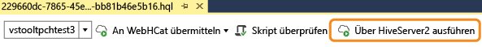
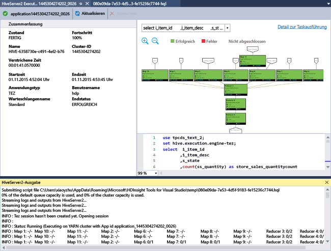

# Erste Schritte bei der Verwendung von Azure Data Lake (HDInsight)-Tools für Visual Studio zum Ausführen einer Hive-Abfrage
Erfahren Sie, wie Sie Data Lake (HDInsight)- Tools für Visual Studio verwenden, um eine Verbindung mit HDInsight-Clustern herzustellen und Hive-Abfragen zu übermitteln. Weitere Informationen zur Verwendung von HDInsight finden Sie unter [Einführung in HDInsight][hdinsight.introduction] und [Erste Schritte mit HDInsight][hdinsight.get.started]. Weitere Informationen zum Herstellen einer Verbindung mit einem Storm-Cluster finden Sie unter [Entwickeln von C#-Topologien für Apache Storm in HDInsight mit Visual Studio][hdinsight.storm.visual.studio.tools].

Data Lake-Tools für Visual Studio können für den Zugriff auf Data Lake Analytics und HDInsight verwendet werden.  Weitere Informationen über Data Lake-Tools finden Sie im [Tutorial: Entwickeln von U-SQL-Skripts mit Data Lake-Tools für Visual Studio](../data-lake-analytics/data-lake-analytics-data-lake-tools-get-started.md).

**Voraussetzungen**

Um dieses Tutorial durchzuführen und die Data Lake-Tools in Visual Studio zu verwenden, benötigen Sie Folgendes:

* Ein Azure HDInsight-Cluster: Informationen zu seiner Erstellung finden Sie unter [Hadoop-Tutorial: Erste Schritte bei der Verwendung von Hadoop in HDInsight](hdinsight-hadoop-linux-tutorial-get-started.md).
* Eine Arbeitsstation mit folgender Software:
  
  * Windows 10, Windows 8.1, Windows 8 oder Windows 7
  * Visual Studio 2013/2015/2017
    
    > [!NOTE]
    > Derzeit werden die Data Lake-Tools für Visual Studio nur mit der englischen Version bereitgestellt.
    > 
    > 

## Installieren von Data Lake-Tools für Visual Studio

Data Lake-Tools sind bei Visual Studio-2017 standardmäßig installiert. Bei älteren Versionen können Sie sie mit dem [Webplattform-Installer](https://www.microsoft.com/web/downloads/)installieren. Sie müssen die Auswahl entsprechend Ihrer Version von Visual Studio vornehmen. Wenn Sie Visual Studio nicht installiert haben, können Sie das aktuelle Visual Studio Community und Azure SDK über den [Webplattform-Installer](https://www.microsoft.com/web/downloads/) installieren:

![Data Lake-Tools für Visual Studio – Webplattform-Installer][1]

## Herstellen einer Verbindung mit Azure-Abonnements
Mithilfe der Data Lake-Tools für Visual Studio können Sie eine Verbindung mit Ihren HDInsight-Clustern herstellen, einfache Verwaltungsvorgänge durchführen und Hive-Abfragen ausführen.

> [!NOTE]
> Informationen zum Herstellen einer Verbindung mit einem generischen Hadoop-Cluster finden Sie unter [Schreiben und Übermitteln von Hive-Abfragen mithilfe von Visual Studio](http://blogs.msdn.com/b/xiaoyong/archive/2015/05/04/how-to-write-and-submit-hive-queries-using-visual-studio.aspx).
> 
> 

**Verbinden mit Ihrem Azure-Abonnement**

1. Öffnen Sie Visual Studio.
2. Klicken Sie im Menü **Ansicht** auf **Server-Explorer**, um das Fenster „Server-Explorer“ zu öffnen.
3. Erweitern Sie erst **Azure** und dann **HDInsight**.
   
   > [!NOTE]
   > Beachten Sie, dass das Fenster **HDInsight-Aufgabenliste** geöffnet sein sollte. Wenn es nicht angezeigt wird, klicken Sie im Menü **Ansicht** auf **Andere Fenster** und dann auf das Fenster **HDInsight-Aufgabenliste**.  
   > 
   > 
4. Geben Sie die Anmeldeinformationen für Ihr Azure-Abonnement ein, und klicken Sie auf **Anmelden**. Dies ist nur erforderlich, wenn Sie in Visual Studio auf dieser Arbeitsstation bislang noch nie eine Verbindung mit dem Azure-Abonnement hergestellt haben.
5. Im Server-Explorer wird eine Liste vorhandener HDInsight-Cluster angezeigt. Wenn Sie noch keine Cluster haben, können Sie über das Azure-Portal, Azure PowerShell oder das HDInsight SDK Cluster erstellen. Weitere Informationen finden Sie unter [Erstellen von Linux-basierten Hadoop-Clustern in HDInsight][hdinsight-create-clusters].
   
   ![Data Lake-Tools für Visual Studio – Clusterliste in Server-Explorer][5]
6. Erweitern Sie einen HDInsight-Cluster. **Hive-Datenbanken**, das Standardspeicherkonto, verknüpfte Speicherkonten und das **Hadoop-Dienstprotokoll** werden daraufhin angezeigt. Sie können die einzelnen Elemente weiter erweitern.

Nach dem Herstellen der Verbindung mit Ihrem Azure-Abonnement können Sie die folgenden Aufgaben ausführen:

**So stellen Sie in Visual Studio eine Verbindung mit dem Azure-Portal her**

* Erweitern Sie im Server-Explorer erst **Azure** > **HDInsight**, klicken Sie mit der rechten Maustaste auf einen HDInsight-Cluster, und klicken Sie dann auf **Cluster im Azure-Portal verwalten**.

**So können Sie in Visual Studio Fragen stellen und Feedback geben**

* Klicken Sie im Menü **Extras** auf **HDInsight** und dann auf **MSDN-Forum**, um Fragen zu stellen, oder auf **Feedback geben**.

## Navigieren durch die verknüpften Ressourcen
Im Server-Explorer werden das Standardspeicherkonto und verknüpfte Speicherkonten angezeigt. Wenn Sie das Standardspeicherkonto erweitern, werden die Container im Speicherkonto angezeigt. Das Standardspeicherkonto und der Standardcontainer sind markiert. Sie können auch mit der rechten Maustaste auf einen der Container klicken, um seinen Inhalt anzuzeigen.

![Data Lake-Tools für Visual Studio – Clusterliste in Server-Explorer][2]

Nach dem Öffnen eines Containers können Sie mithilfe der folgenden Schaltflächen Blobs hochladen, löschen und herunterladen:

## Ausführen einer Hive-Abfrage
[Apache Hive][apache.hive] ist eine Data Warehouse-Infrastruktur, die auf Hadoop aufbaut und Funktionen für Datenzusammenfassung, -abfragen und -analysen bietet. Die Data Lake-Tools für Visual Studio unterstützen das Ausführen von Hive-Abfragen in Visual Studio. Weitere Informationen zu Hive finden Sie unter [Verwenden von Hive mit HDInsight][hdinsight.hive].

Es ist zeitaufwändig, das Hive-Skript mit einem HDInsight-Cluster zu testen. Es kann mehrere Minuten oder länger dauern. Data Lake-Tools für Visual Studio können Hive-Skripts ohne Verbindung mit einem aktiven Cluster lokal überprüfen.

Mithilfe der Data Lake-Tools für Visual Studio können Benutzer auch anzeigen, was sich innerhalb des Hive-Auftrags befindet, indem sie die YARN-Protokolle bestimmter Hive-Aufträge sammeln und anzeigen.

### Anzeigen von **hivesampletable**
HDInsight-Cluster enthalten eine Hive-Beispieltabelle mit dem Namen *hivesampletable*. Mithilfe dieser Tabelle zeigen wir Ihnen, wie Hive-Tabellen aufgelistet, die Tabellenschemas angezeigt und die Zeilen in der Hive-Tabelle aufgelistet werden.

**So können Sie Hive-Tabellen auflisten und das Hive-Tabellenschema anzeigen**

1. Erweitern Sie in **Server-Explorer** nacheinander **Azure** > **HDInsight** > den Cluster Ihrer Wahl > **Hive-Datenbanken** > **Standard** > **hivesampletable**, um das Tabellenschema anzuzeigen.
2. Klicken Sie mit der rechten Maustaste auf **hivesampletable**, und klicken Sie dann auf **Die ersten 100 Zeilen anzeigen**, um die Zeilen aufzulisten. Dies entspricht dem Ausführen der folgenden Hive-Abfrage mithilfe des Hive-ODBC-Treibers:
   
     SELECT * FROM hivesampletable LIMIT 100
   
   Sie können die Anzahl der Zeilen anpassen.
   
   ![Data Lake-Tools: HDinsight Hive Visual Studio-Schemaabfrage][6]

### Erstellen von Hive-Tabellen
Zum Erstellen einer Hive-Tabelle können Sie die Benutzeroberfläche oder Hive-Abfragen nutzen. Informationen zum Verwenden von Hive-Abfragen finden Sie unter [Ausführen von Hive-Abfragen](#run.queries).

**So erstellen Sie eine Hive-Tabelle**

1. Erweitern Sie in **Server-Explorer** nacheinander **Azure** > **HDInsight-Cluster** > einen HDInsight-Cluster > **Hive-Datenbanken**. Klicken Sie mit der rechten Maustaste auf **Standard**, und klicken Sie dann auf **Tabelle erstellen**.
2. Konfigurieren Sie die Tabelle.
3. Klicken Sie auf **Tabelle erstellen** , um den Auftrag zum Erstellen der neuen Hive-Tabelle zu übermitteln.
   
    ![Data Lake-Tools: HDInsight-Tools für Visual Studio-Tools – Hive-Tabelle erstellen][7]

### Überprüfen und Ausführen von Hive-Abfragen
Es gibt zwei Möglichkeiten zum Erstellen und Ausführen von Hive-Abfragen:

* Erstellen von Ad-hoc-Abfragen
* Erstellen einer Hive-Anwendung

**So gehen Sie vor, um Ad-hoc-Abfragen zu erstellen, zu überprüfen und auszuführen**

1. Erweitern Sie in **Server-Explorer** erst **Azure** und dann **HDInsight-Cluster**.
2. Klicken Sie mit der rechten Maustaste auf den Cluster, in dem Sie die Abfrage ausführen möchten, und klicken Sie dann auf **Hive-Abfrage schreiben**.
3. Geben Sie die Hive-Abfragen ein. Beachten Sie, dass der Hive-Editor IntelliSense unterstützt. Data Lake-Tools für Visual Studio unterstützen das Laden von Remotemetadaten, wenn Sie Ihr Hive-Skript bearbeiten. Beispiel: Bei Eingabe von „SELECT * FROM“ listet IntelliSense alle vorgeschlagenen Tabellennamen auf. Wenn ein Tabellenname angegeben wird, werden die Spaltennamen von IntelliSense aufgeführt. Die Tools unterstützen fast alle Hive-DML-Anweisungen, Unterabfragen und die integrierten UDFs.
   
    ![Data Lake-Tools: HDInsight-Tools für Visual Studio – IntelliSense][13]
   
    ![Data Lake-Tools: HDInsight-Tools für Visual Studio – IntelliSense][14]
   
   > [!NOTE]
   > Nur die Metadaten der Cluster, die in der HDInsight-Symbolleiste ausgewählt sind, werden vorgeschlagen.
   > 
   > 
4. (Optional): Klicken Sie auf **Skript überprüfen** , um die Syntaxfehler des Skripts zu überprüfen.
   
    ![Data Lake-Tools: Data Lake Tools für Visual Studio – lokale Überprüfung][10]
5. Klicken Sie auf **Übermitteln** oder **Übermitteln (Erweitert)**. Mit der Option „Übermitteln (Erweitert)“ konfigurieren Sie **Auftragsname**, **Argumente**, **Zusätzliche Konfigurationen** und **Statusverzeichnis** für das Skript:
   
    ![HDInsight Hadoop Hive-Abfrage][9]
   
    Nachdem der Auftrag übermittelt wurde, sehen Sie ein Fenster **Hive-Aufträge – Zusammenfassung** .
   
    ![Zusammenfassung einer HDInsight Hadoop Hive-Abfrage][8]
6. Klicken Sie auf die Schaltfläche **Aktualisieren**, um den Status zu aktualisieren, bis sich der Auftragsstatus in **Abgeschlossen** ändert.
7. Klicken Sie unten auf die Links, um Folgendes anzuzeigen: **Auftragsabfrage**, **Auftragsausgabe**, **Auftragsprotokoll** oder **Yarn-Protokoll**.

**So erstellen Sie eine Hive-Lösung und führen sie aus**

1. Klicken Sie im Menü **DATEI** auf **Neu** und dann auf **Projekt**.
2. Wählen Sie im linken Bereich **HDInsight** und dann im mittleren Bereich **Hive-Anwendung** aus. Geben Sie die Eigenschaften ein, und klicken Sie auf **OK**.
   
    ![Data Lake-Tools: HDInsight-Tools für Visual Studio – neues Hive-Projekt][11]
3. Doppelklicken Sie im **Projektmappen-Explorer** auf **Script.hql**, um die Datei zu öffnen.
4. Um das Hive-Skript zu überprüfen, können Sie entweder auf die Schaltfläche **Skript überprüfen** klicken oder im Hive-Editor mit der rechten Maustaste auf das Skript klicken und anschließend im Kontextmenü die Option **Skript überprüfen** auswählen.

### Anzeigen von Hive-Aufträgen
Sie können Auftragsabfragen, die Auftragsausgabe, Auftragsprotokolle und YARN-Protokolle für Hive-Aufträge anzeigen. Weitere Informationen finden Sie im vorherigen Screenshot.

Die neueste Version der Tools ermöglicht es Ihnen, zu sehen, was sich innerhalb der Hive-Aufträge befindet, indem Sie die YARN-Protokolle sammeln und anzeigen. Ein YARN-Protokoll kann Ihnen bei der Untersuchung von Leistungsproblemen helfen. Weitere Informationen zur Vorgehensweise von HDInsight beim Erfassen von YARN-Protokollen finden Sie unter [Programmgesteuerter Zugriff auf HDInsight-Anwendungsprotokolle][hdinsight.access.application.logs].

**So zeigen Sie Hive-Aufträge an**

1. Erweitern Sie in **Server-Explorer** erst **Azure** und dann **HDInsight**.
2. Klicken Sie mit der rechten Maustaste auf einen HDInsight-Cluster, und klicken Sie dann auf **Aufträge anzeigen**. Daraufhin wird eine Liste der Hive-Aufträge angezeigt, die im Cluster ausgeführt wurden.
3. Klicken Sie in der Auftragsliste auf einen Auftrag, um ihn auszuwählen, und öffnen Sie dann im Fenster **Hive-Aufträge – Zusammenfassung** entweder **Auftragsabfrage**, **Auftragsausgabe**, **Auftragsprotokoll** oder **YARN-Protokoll**.
   
    ![Data Lake-Tools: HDInsight-Tools für Visual Studio – Hive-Aufträge anzeigen][12]

### Schnellerer Weg zur Hive-Ausführung über HiveServer2
> [!NOTE]
> Dieses Feature funktioniert nur mit HDInsight-Clustern ab Version 3.2.
> 
> 

Die Data Lake-Tools haben Hive-Aufträge bisher via [WebHCat](https://cwiki.apache.org/confluence/display/Hive/WebHCat) (auch bekannt als Templeton) übermittelt. Es dauerte sehr lange, bis Auftragsdetails und Fehlerinformationen zurückgegeben wurden.
Um dieses Leistungsproblem zu beheben, führen die Data Lake-Tools Hive-Aufträge jetzt über HiveServer2 direkt im Cluster aus, sodass RDP/SSH umgangen wird.
Als weiterer Vorteil neben der Leistungsverbesserung können die Benutzer Hive nun in Tez-Diagrammen anzeigen, und sie können die Aufgabendetails anzeigen.

Für HDInsight-Cluster ab Version 3.2 wird die Schaltfläche **Über HiveServer2 ausführen** angezeigt:

Wenn die Hive-Abfrage in Tez ausgeführt wurde, können Sie die zurückgestreamten Protokolle in Echtzeit sehen, und Sie sehen auch die Auftragsdiagramme.

**Unterschied zwischen dem Ausführen von Abfragen über HiveServer2 und Senden von Abfragen über WebHCat**

Das Ausführen von Abfragen über HiveServer2 hat zwar viele Leistungsvorteile, jedoch auch einige Einschränkungen. Einige der Einschränkungen beeinträchtigen die Einsatzmöglichkeit in der Produktion. In der folgenden Tabelle sind die Unterschiede aufgeführt:

|  | Ausführen über HiveServer2 | Senden über WebHCat |
| --- | --- | --- |
| Ausführen von Abfragen |Erübrigt den Aufwand in WebHCat (startet einen MapReduce-Auftrag namens "TempletonControllerJob"). |Solange eine Abfrage über WebHCat ausgeführt wird, startet WebHCat einen MapReduce-Auftrag, der zusätzliche Latenz mit sich bringt. |
| Zurückstreamen von Protokollen |Nahezu in Echtzeit. |Die Auftragsausführungsprotokolle sind nur verfügbar, wenn der Auftrag abgeschlossen ist. |
| Anzeige des Auftragsverlaufs |Wenn eine Abfrage über HiveServer2 ausgeführt wird, wird der Auftragsverlauf (Auftragsprotokoll, Auftragsausgabe) nicht beibehalten. Die Anwendung kann in der YARN-Benutzeroberfläche mit begrenzten Informationen angezeigt werden. |Wenn eine Abfrage über WebHCat ausgeführt wird, wird der Auftragsverlauf (Auftragsprotokoll, Auftragsausgabe) beibehalten und kann mithilfe von Visual Studio/HDInsight SDK/PowerShell angezeigt werden. |
| Fenster schließen |Ausführen über HiveServer2 ist eine „synchrone“ Methode, sodass das Fenster geöffnet bleiben muss; wenn Sie die Fenster schließen, wird die Ausführung der Abfrage abgebrochen. |Senden über WebHCat ist eine "asynchrone" Methode, sodass Sie die Abfrage über WebHCat senden und Visual Studio schließen können. Sie können jederzeit zurückkehren und die Ergebnisse anzeigen. |

### Leistungsdiagramm für Tez Hive-Auftrag
In den Data Lake-Tools wird das Anzeigen von Leistungsdiagrammen für die Hive-Aufträge unterstützt, die vom Tez-Ausführungsmodul ausgeführt werden. Informationen zum Aktivieren von Tez finden Sie unter [Verwenden von Hive in HDInsight][hdinsight.hive]. Nachdem Sie in Visual Studio einen Hive-Job gesendet haben, wird das Diagramm in Visual Studio angezeigt, wenn der Auftrag abgeschlossen ist.  Sie müssen unter Umständen auf die Schaltfläche **Aktualisieren** klicken, um den aktuellen Auftragsstatus zu erhalten.

> [!NOTE]
> Dieses Feature ist nur für höhere HDInsight-Clusterversionen als 3.2.4.593 verfügbar und funktioniert nur für abgeschlossene Aufträge (wenn Sie Ihren Auftrag über WebHCat übermittelt haben. Dieses Diagramm wird angezeigt, wenn Sie Ihre Abfrage über HiveServer2 ausführen.). Dies funktioniert sowohl für Windows-basierte als auch für Linux-basierte Cluster.
> 
> 

Um Ihnen das Verständnis der Hive-Abfragen zu erleichtern, wurde dem Tool in dieser Version die Ansicht für Hive-Auftragsoperatoren als neues Feature hinzugefügt. Sie müssen nur auf die Scheitelpunkte des Auftragsdiagramms doppelklicken, um alle Operatoren im Scheitelpunkt anzuzeigen. Sie können auch auf einen bestimmten Operator zeigen, um weitere Details dazu anzuzeigen.

### Aufgabenausführungsansicht für Hive bei Tez-Aufträgen
Mit der Aufgabenausführungsansicht für Hive bei Tez-Aufträgen können Sie strukturierte und visualisierte Informationen zu Hive-Aufträgen gewinnen und sich mehr Auftragsdetails anzeigen lassen. Bei Leistungsproblemen können Sie in dieser Ansicht zusätzliche Details abrufen. Sie erfahren z. B., wie jede einzelne Aufgabe ausgeführt wird, und sehen die Details dazu (Lese- und Schreibvorgänge für Daten, geplanter Ausführungszeitpunkt, Startzeit, Endzeit usw.). Auf Basis dieser visualisierten Informationen können Sie die Auftragskonfigurationen oder die Systemarchitektur optimieren.

## Ausführen von Pig-Skripts
Data Lake-Tools für Visual Studio unterstützen das Erstellen und Senden von Pig-Skripts an HDInsight-Cluster. Benutzer können ein Pig-Projekt über eine Vorlage erstellen und das Skript dann an HDInsight-Cluster senden.

## Feedbacks und bekannte Probleme
* Derzeit werden HiveServer2-Ergebnisse als Nur-Text angezeigt, was nicht gerade ideal ist. Wir arbeiten an der Behebung dieses Problems.
* Wenn die Ergebnisse mit NULL-Werten beginnen, werden die Ergebnisse derzeit nicht angezeigt. Dieses Problem wurde inzwischen behoben. Sollte es bei Ihnen auftreten, senden Sie uns eine E-Mail, oder wenden Sie sich an das Supportteam.
* Das von Visual Studio erstellte HQL-Skript wird je nach der lokalen Regionseinstellung des Benutzer codiert. Es wird unter Umständen nicht richtig ausgeführt, wenn der Benutzer das Skript als Binärdaten in einen Cluster hochlädt.

## Nächste Schritte
In diesem Artikel haben Sie erfahren, wie Sie in Visual Studio mithilfe des Data Lake (HDInsight)-Toolpakets eine Verbindung mit HDInsight-Clustern herstellen und Hive-Abfragen ausführen. Weitere Informationen finden Sie unter:

* [Verwenden von Hadoop Hive in HDInsight][hdinsight.hive]
* [Erste Schritte mit Hadoop in HDInsight][hdinsight.get.started]
* [Übermitteln von Hadoop-Aufträgen in HDInsight][hdinsight.submit.jobs]
* [Analysieren von Twitter-Daten mit Hadoop in HDInsight][hdinsight.analyze.twitter.data]

<!--Anchors-->
[Installation]: #installation
[Connect to your Azure subscription]: #connect-to-your-azure-subscription
[Navigate the linked resources]: #navigate-the-linked-resources
[Run Hive queries]: #run-hive-queries
[Next steps]: #next-steps

<!--Image references-->
[1]: ./media/hdinsight-hadoop-visual-studio-tools-get-started/hdinsight.visual.studio.tools.wpi.png
[2]: ./media/hdinsight-hadoop-visual-studio-tools-get-started/hdinsight.visual.studio.tools.linked.resources.png
[5]: ./media/hdinsight-hadoop-visual-studio-tools-get-started/hdinsight.visual.studio.tools.server.explorer.png
[6]: ./media/hdinsight-hadoop-visual-studio-tools-get-started/hdinsight.visual.studio.tools.hive.schema.png
[7]: ./media/hdinsight-hadoop-visual-studio-tools-get-started/hdinsight.visual.studio.tools.create.hive.table.png
[8]: ./media/hdinsight-hadoop-visual-studio-tools-get-started/hdinsight.visual.studio.tools.run.hive.job.summary.png
[9]: ./media/hdinsight-hadoop-visual-studio-tools-get-started/hdinsight.visual.studio.tools.submit.jobs.advanced.png
[10]: ./media/hdinsight-hadoop-visual-studio-tools-get-started/hdinsight.visual.studio.tools.validate.hive.script.png
[11]: ./media/hdinsight-hadoop-visual-studio-tools-get-started/hdinsight.visual.studio.tools.new.hive.project.png
[12]: ./media/hdinsight-hadoop-visual-studio-tools-get-started/hdinsight.visual.studio.tools.view.hive.jobs.png
[13]: ./media/hdinsight-hadoop-visual-studio-tools-get-started/hdinsight.visual.studio.tools.intellisense.table.names.png
[14]: ./media/hdinsight-hadoop-visual-studio-tools-get-started/hdinsight.visual.studio.tools.intellisense.column.names.png

<!--Link references-->
[hdinsight-create-clusters]: hdinsight-hadoop-provision-linux-clusters.md
[hdinsight.introduction]: hdinsight-hadoop-introduction.md
[hdinsight.get.started]: hdinsight-hadoop-linux-tutorial-get-started.md
[hdinsight.hive]: hdinsight-use-hive.md
[hdinsight.submit.jobs]: hdinsight-submit-hadoop-jobs-programmatically.md
[hdinsight.analyze.twitter.data]: hdinsight-analyze-twitter-data.md
[hdinsight.storm.visual.studio.tools]: hdinsight-storm-develop-csharp-visual-studio-topology.md
[hdinsight.access.application.logs]: hdinsight-hadoop-access-yarn-app-logs.md

[apache.hive]: http://hive.apache.org

